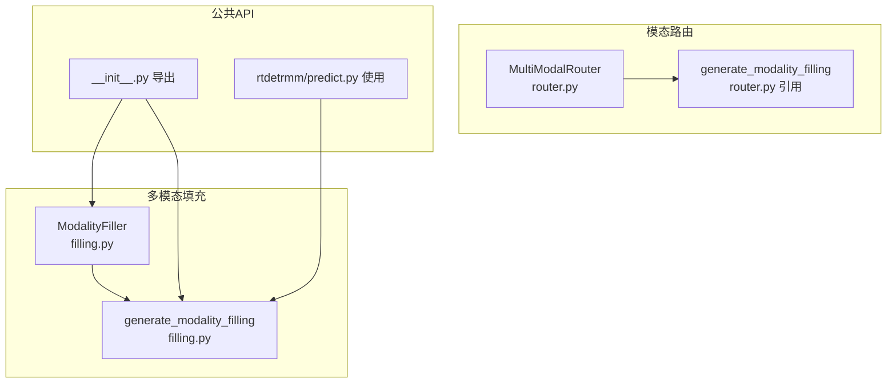
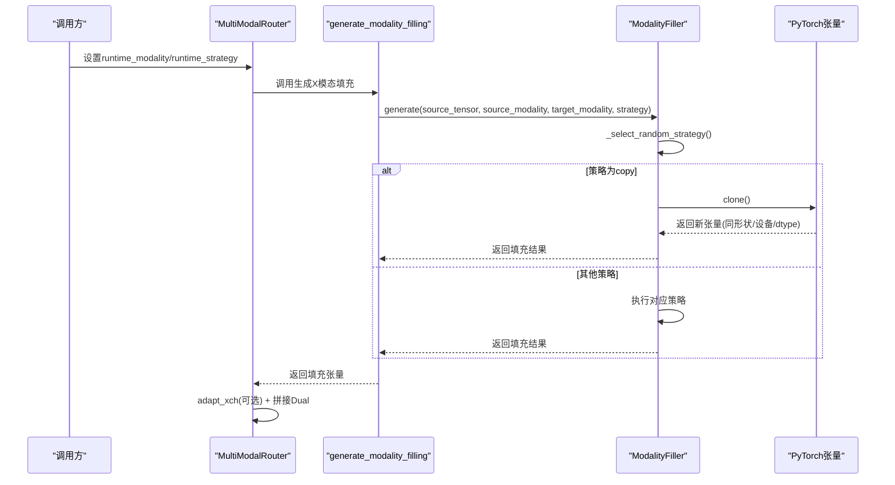
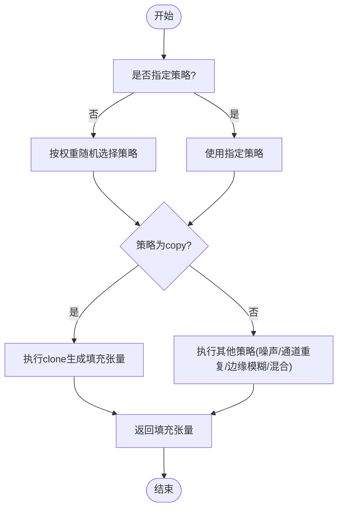
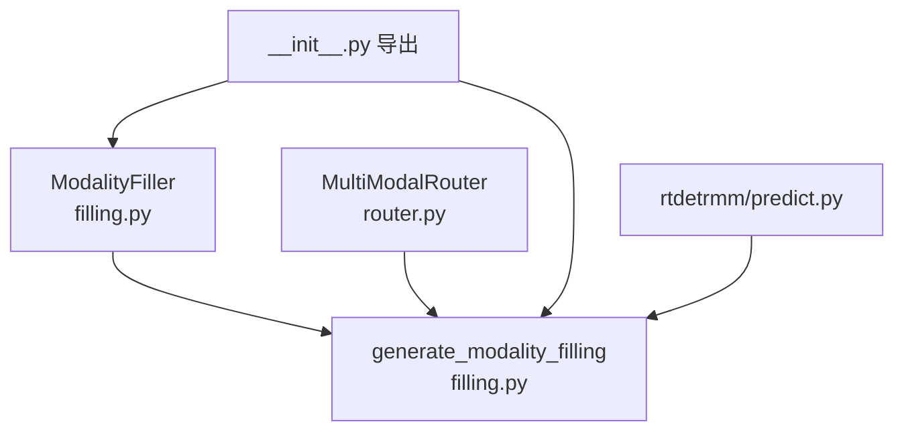

# 零填充策略

<cite>
**本文档引用的文件**
- [ultralytics/models/yolo/multimodal/modal_filling.py](file://ultralytics/models/yolo/multimodal/modal_filling.py)
- [ultralytics/nn/mm/filling.py](file://ultralytics/nn/mm/filling.py)
- [ultralytics/nn/mm/router.py](file://ultralytics/nn/mm/router.py)
- [ultralytics/models/yolo/multimodal/__init__.py](file://ultralytics/models/yolo/multimodal/__init__.py)
- [ultralytics/models/rtdetrmm/predict.py](file://ultralytics/models/rtdetrmm/predict.py)
</cite>

## 目录
1. [引言](#引言)
2. [项目结构](#项目结构)
3. [核心组件](#核心组件)
4. [架构概览](#架构概览)
5. [详细组件分析](#详细组件分析)
6. [依赖分析](#依赖分析)
7. [性能考虑](#性能考虑)
8. [故障排查指南](#故障排查指南)
9. [结论](#结论)

## 引言
本节聚焦“零填充策略”（copy策略），即直接复制源模态张量作为目标模态的填充数据。我们将从数学原理、内存操作机制、计算复杂度、默认策略设定、在模态路由中的作用、零拷贝语义与数据一致性保障、以及典型使用场景与性能特点等方面进行系统化阐述，并结合仓库中的实现文件进行代码级分析。

## 项目结构
围绕零填充策略的相关模块主要分布在以下路径：
- 多模态填充器：提供多种填充策略，其中copy策略为核心默认策略之一
- 模态路由器：在单模态推理场景下，基于运行时参数决定是否进行填充及如何拼接双模态输入
- 公共API入口：统一导出ModalityFiller与generate_modality_filling等接口

图表来源
- [ultralytics/nn/mm/filling.py:14-148](file://ultralytics/nn/mm/filling.py#L14-L148)
- [ultralytics/nn/mm/router.py:157-240](file://ultralytics/nn/mm/router.py#L157-L240)
- [ultralytics/models/yolo/multimodal/__init__.py:44-77](file://ultralytics/models/yolo/multimodal/__init__.py#L44-L77)
- [ultralytics/models/rtdetrmm/predict.py:598-607](file://ultralytics/models/rtdetrmm/predict.py#L598-L607)

章节来源
- [ultralytics/nn/mm/filling.py:14-148](file://ultralytics/nn/mm/filling.py#L14-L148)
- [ultralytics/nn/mm/router.py:157-240](file://ultralytics/nn/mm/router.py#L157-L240)
- [ultralytics/models/yolo/multimodal/__init__.py:44-77](file://ultralytics/models/yolo/multimodal/__init__.py#L44-L77)
- [ultralytics/models/rtdetrmm/predict.py:598-607](file://ultralytics/models/rtdetrmm/predict.py#L598-L607)

## 核心组件
- ModalityFiller：封装多种填充策略，包括copy、noise、channel_repeat、edge_blur、mixed；默认策略权重中copy占比最高，体现其作为默认策略的设计意图。
- generate_modality_filling：便捷函数，负责根据源模态与目标模态生成相应填充张量，默认走copy策略。
- MultiModalRouter：在单模态推理时，依据runtime_modality与runtime_strategy决定是否生成填充并拼接双模态输入。
- 公共API导出：统一对外暴露ModalityFiller与generate_modality_filling，便于各子模块共享行为。

章节来源
- [ultralytics/models/yolo/multimodal/modal_filling.py:20-78](file://ultralytics/models/yolo/multimodal/modal_filling.py#L20-L78)
- [ultralytics/nn/mm/filling.py:21-49](file://ultralytics/nn/mm/filling.py#L21-L49)
- [ultralytics/nn/mm/router.py:157-240](file://ultralytics/nn/mm/router.py#L157-L240)
- [ultralytics/models/yolo/multimodal/__init__.py:44-77](file://ultralytics/models/yolo/multimodal/__init__.py#L44-L77)

## 架构概览
零填充策略在系统中的工作流如下：
- 当检测到单模态输入或需要补齐另一模态时，MultiModalRouter根据runtime_modality与runtime_strategy调用generate_modality_filling
- generate_modality_filling内部委托ModalityFiller.generate/generate_filling
- ModalityFiller在未指定strategy时按权重随机选择策略，若为copy则直接clone源张量
- clone后得到与源张量同形状、同设备、同dtype的新张量，随后按需进行通道适配（如adapt_xch）并拼接为Dual输入

图表来源
- [ultralytics/nn/mm/router.py:157-240](file://ultralytics/nn/mm/router.py#L157-L240)
- [ultralytics/nn/mm/filling.py:35-49](file://ultralytics/nn/mm/filling.py#L35-L49)
- [ultralytics/models/yolo/multimodal/modal_filling.py:63-78](file://ultralytics/models/yolo/multimodal/modal_filling.py#L63-L78)

## 详细组件分析

### 数学原理与数据一致性
- 零填充策略的数学本质是恒等映射：目标模态张量与源模态张量在数值上完全一致，仅在内存层面为新的存储视图或副本。
- 数据一致性体现在：
  - 形状一致性：输出张量与输入张量形状严格一致[B, C, H, W]
  - 设备一致性：输出张量位于与输入张量相同的设备上
  - 类型一致性：输出张量与输入张量dtype保持一致
  - 内容一致性：在copy策略下，输出张量与输入张量逐元素相等

章节来源
- [ultralytics/nn/mm/filling.py:69-70](file://ultralytics/nn/mm/filling.py#L69-L70)
- [ultralytics/models/yolo/multimodal/modal_filling.py:86-96](file://ultralytics/models/yolo/multimodal/modal_filling.py#L86-L96)

### 内存操作机制与零拷贝语义
- clone操作的零拷贝语义：在PyTorch中，clone通常触发惰性复制（lazy copy-on-write）。这意味着：
  - 在写入之前，新张量与原张量共享底层存储，不产生额外内存占用
  - 一旦任一张量发生写操作，系统会为该张量分配独立内存，确保数据隔离
- 在多模态路由场景中，这一特性有助于：
  - 减少不必要的内存分配
  - 在仅读取或下游模块不修改的情况下维持高性能
- 注意：若后续模块对填充张量进行就地修改，则会触发真实拷贝，此时应评估内存与性能影响

章节来源
- [ultralytics/nn/mm/filling.py:69-70](file://ultralytics/nn/mm/filling.py#L69-L70)
- [ultralytics/models/yolo/multimodal/modal_filling.py:86-96](file://ultralytics/models/yolo/multimodal/modal_filling.py#L86-L96)

### 计算复杂度
- 时间复杂度：O(BCHW)，即与批大小、通道数、高度、宽度成正比。clone操作本身为O(1)的视图创建，但实际内存访问与后续使用相关
- 空间复杂度：在惰性复制前提下，初始阶段几乎不增加内存；若发生写入则产生独立副本，额外内存约为B×C×H×W个元素的存储空间
- 在多模态拼接场景中，copy策略不会引入额外卷积或滤波计算，仅进行张量拼接，整体复杂度仍以O(BCHW)为主

章节来源
- [ultralytics/nn/mm/filling.py:69-70](file://ultralytics/nn/mm/filling.py#L69-L70)
- [ultralytics/nn/mm/router.py:190-231](file://ultralytics/nn/mm/router.py#L190-L231)

### 默认策略设定与权重分布
- 默认策略权重中copy占比最高，体现其作为默认策略的设计意图
- 这种权重分布有利于在单模态推理时快速稳定地生成可用的双模态输入，同时兼顾多样性（mixed策略）与其他策略的辅助作用

章节来源
- [ultralytics/models/yolo/multimodal/modal_filling.py:21-27](file://ultralytics/models/yolo/multimodal/modal_filling.py#L21-L27)
- [ultralytics/nn/mm/filling.py:21-27](file://ultralytics/nn/mm/filling.py#L21-L27)

### 在模态路由中的作用
- 单模态推理时，若当前运行模式为“仅RGB”，则会使用copy策略生成X模态填充，随后通过adapt_xch进行通道适配并拼接为Dual输入
- 若当前运行模式为“仅X”，则会使用copy策略生成RGB模态填充，同样进行通道适配并拼接
- 这一过程确保了网络始终接收符合预期的双模态输入格式，避免因通道数不匹配导致的错误

章节来源
- [ultralytics/nn/mm/router.py:157-240](file://ultralytics/nn/mm/router.py#L157-L240)

### 代码实现分析
- ModalityFiller.generate_filling/generate：
  - 未指定strategy时，按权重随机选择策略
  - 策略为copy时，调用_create_copy_fill，内部执行clone
- generate_modality_filling：
  - 作为便捷函数，统一调用ModalityFiller实例的generate/generate_filling
- MultiModalRouter.setup_multimodal_routing：
  - 在单模态场景下，调用generate_modality_filling生成缺失模态的填充
  - 通过adapt_xch确保通道数与配置一致，最后拼接为Dual

图表来源
- [ultralytics/models/yolo/multimodal/modal_filling.py:47-78](file://ultralytics/models/yolo/multimodal/modal_filling.py#L47-L78)
- [ultralytics/nn/mm/filling.py:35-49](file://ultralytics/nn/mm/filling.py#L35-L49)

章节来源
- [ultralytics/models/yolo/multimodal/modal_filling.py:47-96](file://ultralytics/models/yolo/multimodal/modal_filling.py#L47-L96)
- [ultralytics/nn/mm/filling.py:35-70](file://ultralytics/nn/mm/filling.py#L35-L70)
- [ultralytics/nn/mm/router.py:157-240](file://ultralytics/nn/mm/router.py#L157-L240)

### 使用场景与性能特点
- 使用场景
  - 单模态推理：仅提供RGB或仅提供X，系统自动补齐另一模态
  - 模态通道不匹配：通过adapt_xch将填充结果调整为期望通道数
  - 快速原型与稳定性：copy策略简单可靠，适合快速验证与生产兜底
- 性能特点
  - 计算开销低：无额外卷积/滤波，仅张量克隆与拼接
  - 内存友好：惰性复制减少初始内存占用
  - 可扩展性：可与其他策略组合（mixed），在保持稳定性的同时引入多样性

章节来源
- [ultralytics/nn/mm/router.py:157-240](file://ultralytics/nn/mm/router.py#L157-L240)
- [ultralytics/models/rtdetrmm/predict.py:586-607](file://ultralytics/models/rtdetrmm/predict.py#L586-L607)

## 依赖分析
- ModalityFiller与generate_modality_filling构成核心填充能力，被MultiModalRouter与公共API统一调用
- MultiModalRouter在setup_multimodal_routing中直接调用generate_modality_filling，实现零填充策略的落地
- 公共API导出确保各子模块共享一致的行为契约

图表来源
- [ultralytics/nn/mm/filling.py:14-148](file://ultralytics/nn/mm/filling.py#L14-L148)
- [ultralytics/nn/mm/router.py:157-240](file://ultralytics/nn/mm/router.py#L157-L240)
- [ultralytics/models/yolo/multimodal/__init__.py:44-77](file://ultralytics/models/yolo/multimodal/__init__.py#L44-L77)
- [ultralytics/models/rtdetrmm/predict.py:598-607](file://ultralytics/models/rtdetrmm/predict.py#L598-L607)

章节来源
- [ultralytics/nn/mm/filling.py:14-148](file://ultralytics/nn/mm/filling.py#L14-L148)
- [ultralytics/nn/mm/router.py:157-240](file://ultralytics/nn/mm/router.py#L157-L240)
- [ultralytics/models/yolo/multimodal/__init__.py:44-77](file://ultralytics/models/yolo/multimodal/__init__.py#L44-L77)
- [ultralytics/models/rtdetrmm/predict.py:598-607](file://ultralytics/models/rtdetrmm/predict.py#L598-L607)

## 性能考虑
- 在单模态推理中，copy策略避免了复杂的特征变换，显著降低前向计算时间
- 惰性复制机制在多数只读场景下不增加内存压力，但在需要就地修改时应评估真实拷贝成本
- 与通道适配（adapt_xch）配合使用时，注意其线性投影的计算开销，通常远小于copy策略的开销

## 故障排查指南
- 策略权重异常：当策略权重之和不为1时，系统会发出警告，建议检查权重配置
- 设备/类型不匹配：确保clone后张量与源张量在同一设备且dtype一致
- 通道数不匹配：使用adapt_xch进行通道适配，避免拼接时报错
- 单模态预处理阶段禁用自动填充：项目策略明确不在预处理阶段进行自动填充，应在前向中通过MultiModalRouter处理

章节来源
- [ultralytics/models/yolo/multimodal/modal_filling.py:44-45](file://ultralytics/models/yolo/multimodal/modal_filling.py#L44-L45)
- [ultralytics/nn/mm/router.py:209-231](file://ultralytics/nn/mm/router.py#L209-L231)
- [ultralytics/models/rtdetrmm/predict.py:586-596](file://ultralytics/models/rtdetrmm/predict.py#L586-L596)

## 结论
零填充策略以copy为核心，默认权重突出其重要性，旨在提供简单、稳定、高效的模态补齐方案。其实现基于PyTorch的clone操作，具备零拷贝语义与良好的内存友好性；在模态路由中承担关键角色，确保单模态推理时双模态输入的一致性与正确性。对于追求稳定性与性能的场景，copy策略是理想选择；在需要多样性的场景下，可结合mixed策略实现更丰富的填充效果。