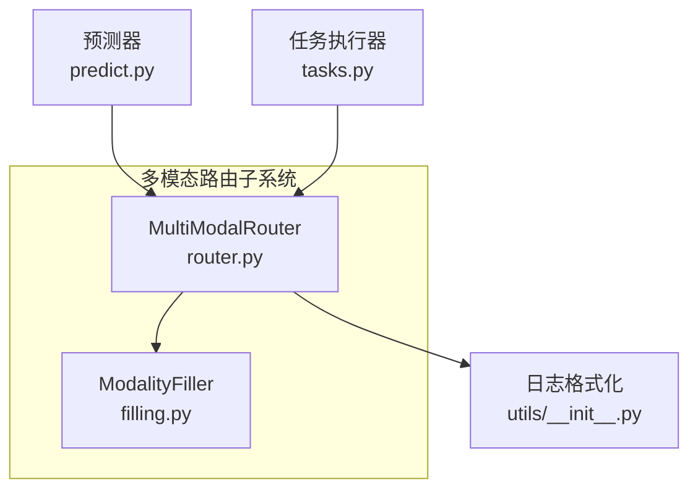
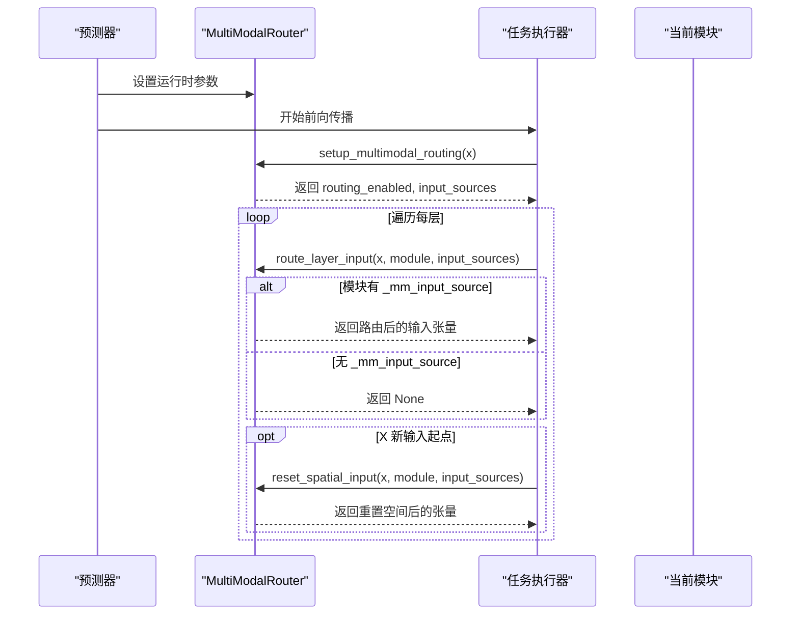
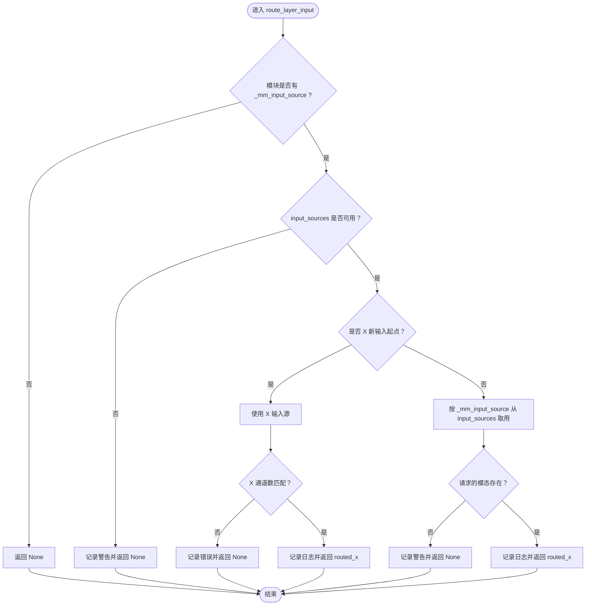
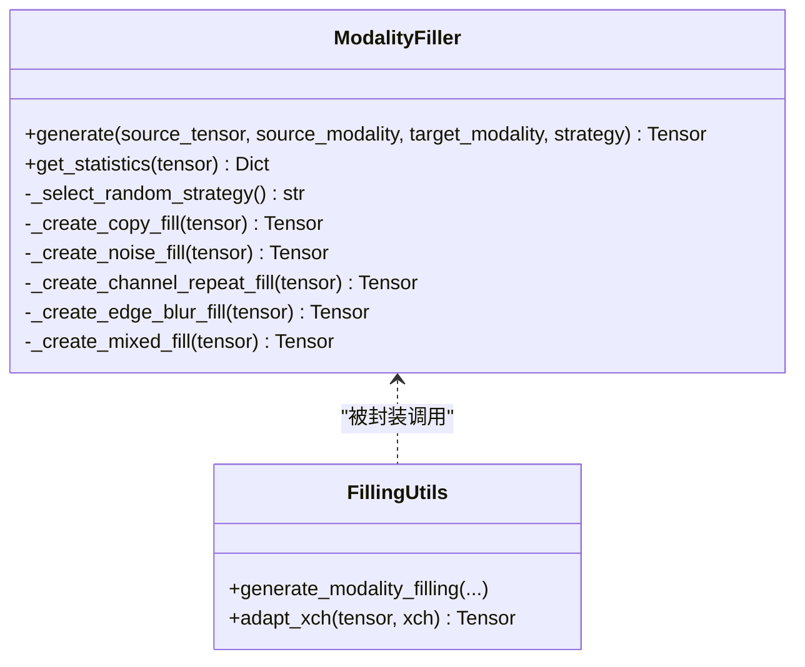
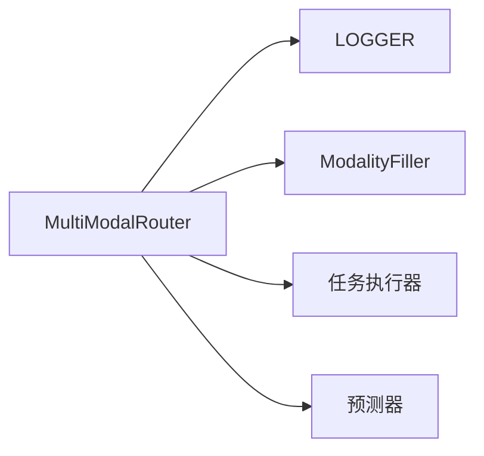

# 层输入路由

<cite>
**本文引用的文件**
- [router.py](file://ultralytics/nn/mm/router.py)
- [filling.py](file://ultralytics/nn/mm/filling.py)
- [tasks.py](file://ultralytics/nn/tasks.py)
- [predict.py](file://ultralytics/models/yolo/multimodal/predict.py)
- [__init__.py](file://ultralytics/utils/__init__.py)
</cite>

## 目录
1. [简介](#简介)
2. [项目结构](#项目结构)
3. [核心组件](#核心组件)
4. [架构总览](#架构总览)
5. [详细组件分析](#详细组件分析)
6. [依赖分析](#依赖分析)
7. [性能考虑](#性能考虑)
8. [故障排查指南](#故障排查指南)
9. [结论](#结论)

## 简介
本节围绕“层输入路由”展开，重点解释 route_layer_input 方法如何依据模块的 MM 属性实现精确的层级路由。内容涵盖：
- 模块属性检查与输入源验证
- X 模态新输入起点的特殊处理（含空间重置标记）
- 错误处理、日志记录与性能优化策略
- 路由流程图、错误处理机制与调试技巧

## 项目结构
与“层输入路由”相关的核心代码位于以下模块：
- 多模态路由器：负责解析配置、建立输入源、路由到具体模态、空间重置等
- 填充工具：在单模态推理时生成缺失模态的合成张量
- 任务执行器：在前向过程中调用路由器进行逐层路由
- 预测器：在推理阶段注入运行时参数并获取路由器实例

图表来源
- [router.py:11-63](file://ultralytics/nn/mm/router.py#L11-L63)
- [filling.py:14-175](file://ultralytics/nn/mm/filling.py#L14-L175)
- [tasks.py:920-940](file://ultralytics/nn/tasks.py#L920-L940)
- [predict.py:74-136](file://ultralytics/models/yolo/multimodal/predict.py#L74-L136)
- [__init__.py:536-565](file://ultralytics/utils/__init__.py#L536-L565)

章节来源
- [router.py:11-63](file://ultralytics/nn/mm/router.py#L11-L63)
- [filling.py:14-175](file://ultralytics/nn/mm/filling.py#L14-L175)
- [tasks.py:920-940](file://ultralytics/nn/tasks.py#L920-L940)
- [predict.py:74-136](file://ultralytics/models/yolo/multimodal/predict.py#L74-L136)
- [__init__.py:536-565](file://ultralytics/utils/__init__.py#L536-L565)

## 核心组件
- MultiModalRouter：解析层配置、建立 RGB/X/Dual 输入源、按模块 MM 属性路由到指定模态、支持 X 新输入起点的空间重置
- ModalityFiller：在单模态场景下生成缺失模态的合成张量，保证 Dual 通道数一致
- 任务执行器：在前向传播中调用路由器对每一层进行输入路由
- 预测器：在推理阶段设置运行时模态参数并获取路由器实例

章节来源
- [router.py:11-63](file://ultralytics/nn/mm/router.py#L11-L63)
- [filling.py:14-175](file://ultralytics/nn/mm/filling.py#L14-L175)
- [tasks.py:920-940](file://ultralytics/nn/tasks.py#L920-L940)
- [predict.py:74-136](file://ultralytics/models/yolo/multimodal/predict.py#L74-L136)

## 架构总览
下图展示了从输入到逐层路由的关键交互：

图表来源
- [predict.py:115-136](file://ultralytics/models/yolo/multimodal/predict.py#L115-L136)
- [router.py:157-240](file://ultralytics/nn/mm/router.py#L157-L240)
- [router.py:242-317](file://ultralytics/nn/mm/router.py#L242-L317)
- [router.py:365-404](file://ultralytics/nn/mm/router.py#L365-L404)
- [tasks.py:920-940](file://ultralytics/nn/tasks.py#L920-L940)

## 详细组件分析

### MultiModalRouter：层输入路由核心
- parse_layer_config：解析层配置的第5字段（RGB/X/Dual），为模块设置 MM 属性；当 X 模态且 from=-1 时，标记为“新输入起点”，并设置“空间重置”标志
- setup_multimodal_routing：基于输入张量通道数判断是否启用多模态路由，拆分 RGB/X 并生成 Dual；在单模态场景下可按策略填充另一模态
- route_layer_input：根据模块的 _mm_input_source 进行路由；若为 X 新输入起点，直接使用 X 输入并进行通道数校验；否则按请求的模态从 input_sources 中取用
- reset_spatial_input：在 X 新输入起点时，将输入重置为原始空间尺寸（利用缓存的 original_inputs）

图表来源
- [router.py:242-317](file://ultralytics/nn/mm/router.py#L242-L317)

章节来源
- [router.py:90-155](file://ultralytics/nn/mm/router.py#L90-L155)
- [router.py:157-240](file://ultralytics/nn/mm/router.py#L157-L240)
- [router.py:242-317](file://ultralytics/nn/mm/router.py#L242-L317)
- [router.py:365-404](file://ultralytics/nn/mm/router.py#L365-L404)

### ModalityFiller：单模态合成与通道适配
- generate_modality_filling：根据策略生成目标模态的合成张量，保持与源张量相同的形状
- adapt_xch：在 RGB 与 X 模态之间进行通道数适配（例如 3→1 或 1→3），或通过线性投影映射到任意 Xch

图表来源
- [filling.py:14-175](file://ultralytics/nn/mm/filling.py#L14-L175)

章节来源
- [filling.py:14-175](file://ultralytics/nn/mm/filling.py#L14-L175)

### 任务执行器：逐层调用路由
- 在前向传播中，针对每个模块调用 route_layer_input 获取路由后的输入张量
- 对于 X 新输入起点的模块，随后调用 reset_spatial_input 将输入重置为原始空间尺寸

章节来源
- [tasks.py:920-940](file://ultralytics/nn/tasks.py#L920-L940)
- [tasks.py:1680-1700](file://ultralytics/nn/tasks.py#L1680-L1700)

### 预测器：运行时参数注入与路由器获取
- _get_mm_router：在直连模型或 AutoBackend 场景下获取路由器实例，必要时从 YAML 配置解析并构造
- _set_runtime_modality_for_router：根据推理模式设置运行时模态与策略，单模态时严格校验路由器存在

章节来源
- [predict.py:74-136](file://ultralytics/models/yolo/multimodal/predict.py#L74-L136)

## 依赖分析
- MultiModalRouter 依赖：
  - 日志记录：通过 LOGGER 输出路由状态与警告/错误
  - 填充工具：在单模态场景下生成缺失模态的合成张量
  - 任务执行器：在前向传播中被调用
  - 预测器：在推理阶段注入运行时参数并获取路由器

图表来源
- [router.py:11-63](file://ultralytics/nn/mm/router.py#L11-L63)
- [filling.py:14-175](file://ultralytics/nn/mm/filling.py#L14-L175)
- [tasks.py:920-940](file://ultralytics/nn/tasks.py#L920-L940)
- [predict.py:74-136](file://ultralytics/models/yolo/multimodal/predict.py#L74-L136)

章节来源
- [router.py:11-63](file://ultralytics/nn/mm/router.py#L11-L63)
- [filling.py:14-175](file://ultralytics/nn/mm/filling.py#L14-L175)
- [tasks.py:920-940](file://ultralytics/nn/tasks.py#L920-L940)
- [predict.py:74-136](file://ultralytics/models/yolo/multimodal/predict.py#L74-L136)

## 性能考虑
- 零拷贝视图路由：在 setup_multimodal_routing 中通过切片与拼接形成 RGB/X/Dual 视图，避免不必要的数据复制
- 运行时参数注入：通过 set_runtime_params 控制填充策略与随机种子，减少重复计算
- 早期返回：当模块无 MM 属性或输入源不可用时，route_layer_input 直接返回 None，避免无效路由
- 空间重置缓存：original_inputs 缓存原始 X 输入，reset_spatial_input 直接复用，降低内存与算力开销

章节来源
- [router.py:157-240](file://ultralytics/nn/mm/router.py#L157-L240)
- [router.py:242-317](file://ultralytics/nn/mm/router.py#L242-L317)
- [router.py:365-404](file://ultralytics/nn/mm/router.py#L365-L404)

## 故障排查指南
- 模块无 _mm_input_source
  - 现象：route_layer_input 返回 None
  - 处理：确认模型配置中该层是否设置了第5字段（RGB/X/Dual）
- 输入源不可用
  - 现象：日志出现“输入源不可用”的警告
  - 处理：检查 setup_multimodal_routing 的输入张量通道数与运行时模态设置
- X 新输入起点通道数不匹配
  - 现象：日志出现“期望X通道数，但接收到N通道”的错误
  - 处理：核对 dataset_config 中的 Xch 与实际输入通道数
- 请求的模态不存在于输入源
  - 现象：日志出现“请求的模态不存在于输入源中”的警告
  - 处理：确认推理模式与路由器运行时参数设置是否正确
- 空间重置失败
  - 现象：日志出现“空间重置失败 - 缺少X输入源/无法获取原始尺寸”
  - 处理：确认 original_inputs 已缓存且模块标记为 X 新输入起点
- 日志与调试
  - 使用 LOGGER 的前缀格式化输出（含警告/错误前缀），便于定位问题
  - 预测器提供详细的输入调试信息记录，可在预处理失败时查看

章节来源
- [router.py:242-317](file://ultralytics/nn/mm/router.py#L242-L317)
- [router.py:365-404](file://ultralytics/nn/mm/router.py#L365-L404)
- [predict.py:644-670](file://ultralytics/models/rtdetrmm/predict.py#L644-L670)
- [predict.py:948-973](file://ultralytics/models/yolo/multimodal/predict.py#L948-L973)
- [__init__.py:536-565](file://ultralytics/utils/__init__.py#L536-L565)

## 结论
- route_layer_input 通过模块的 MM 属性实现对 RGB/X/Dual 的精准路由
- X 模态新输入起点具备特殊处理：直接使用 X 输入并进行通道校验，同时设置空间重置标记
- 路由过程包含完善的错误处理与日志记录，配合运行时参数注入与零拷贝路由，兼顾准确性与性能
- 建议在模型配置中明确第5字段标识，在单模态推理时严格校验路由器存在与运行时参数设置