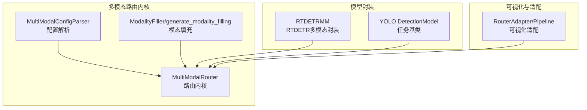
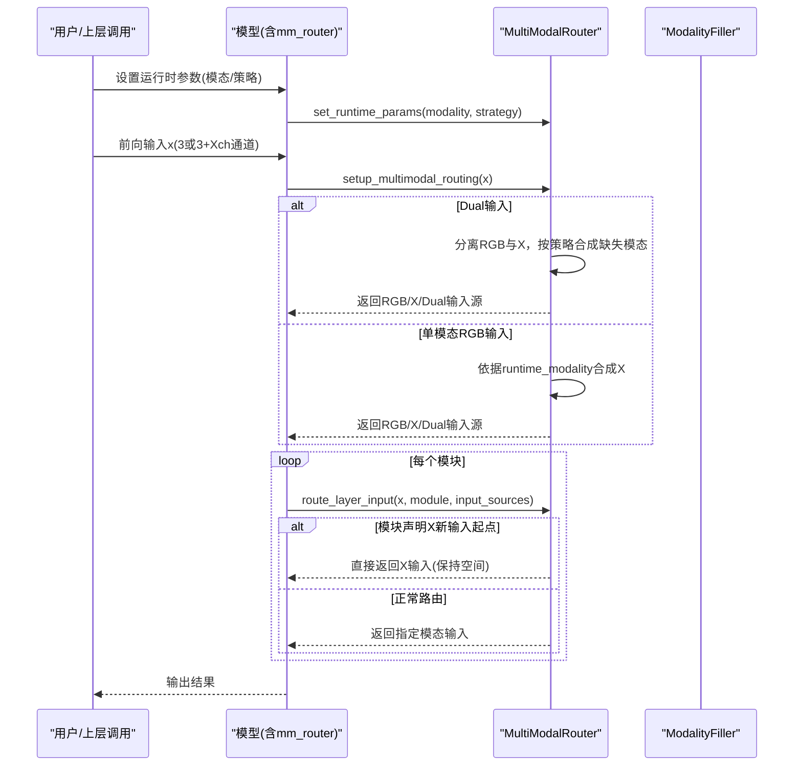
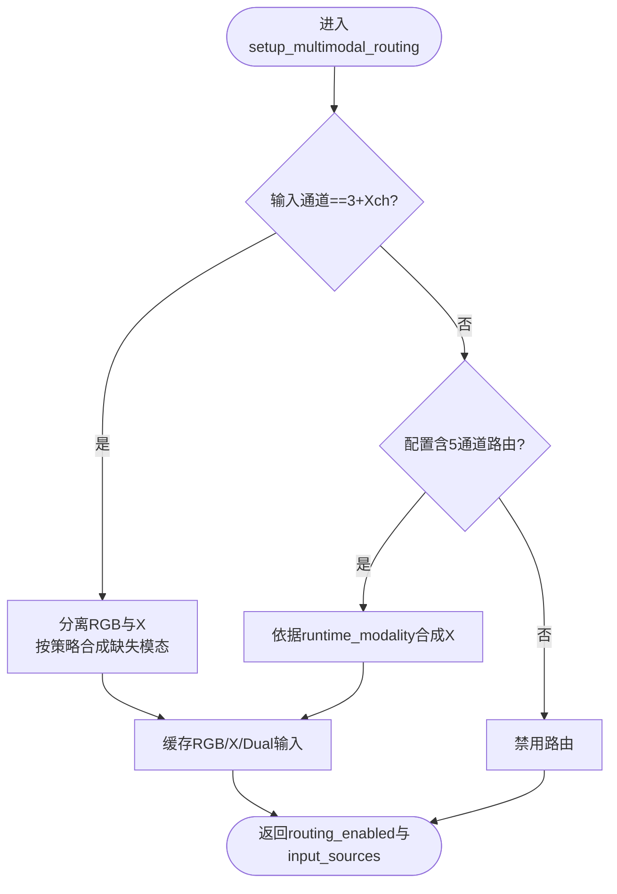
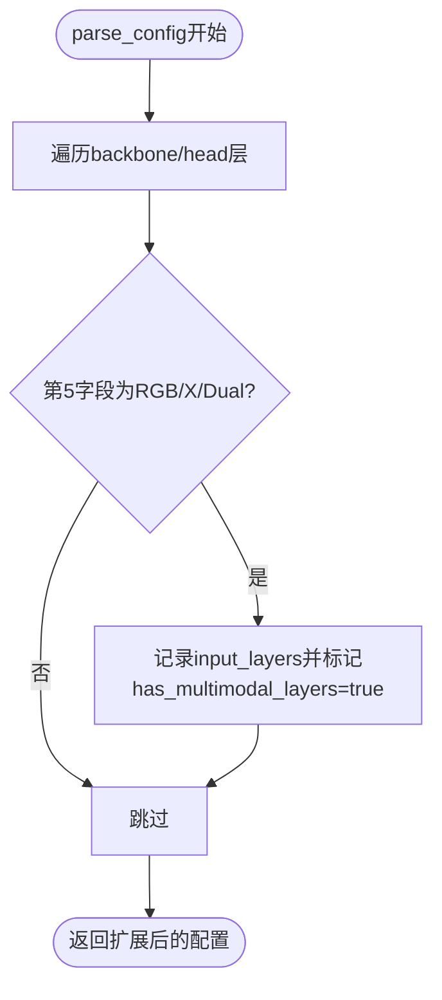
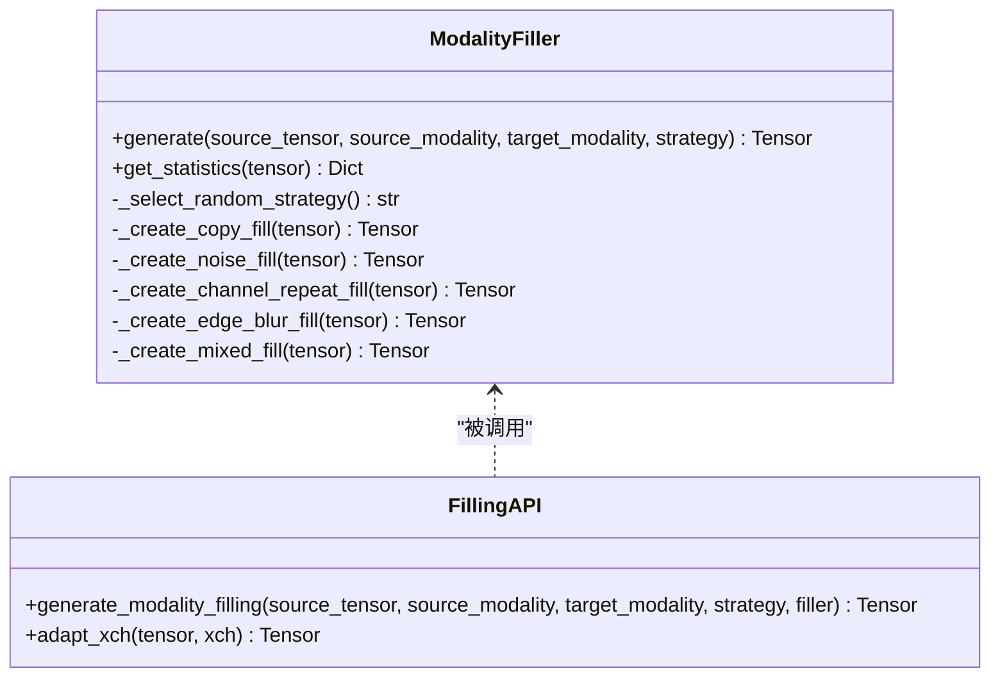
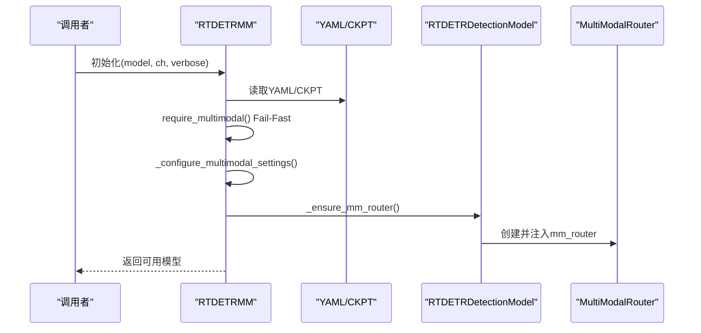
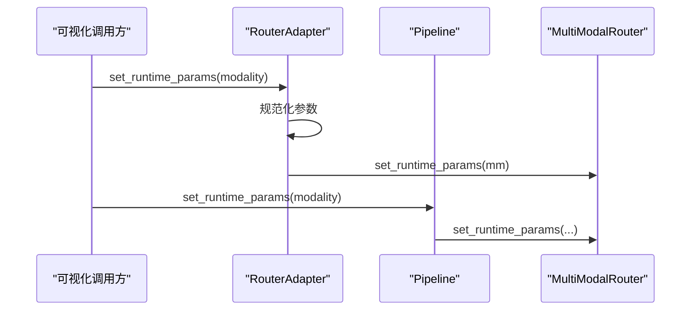
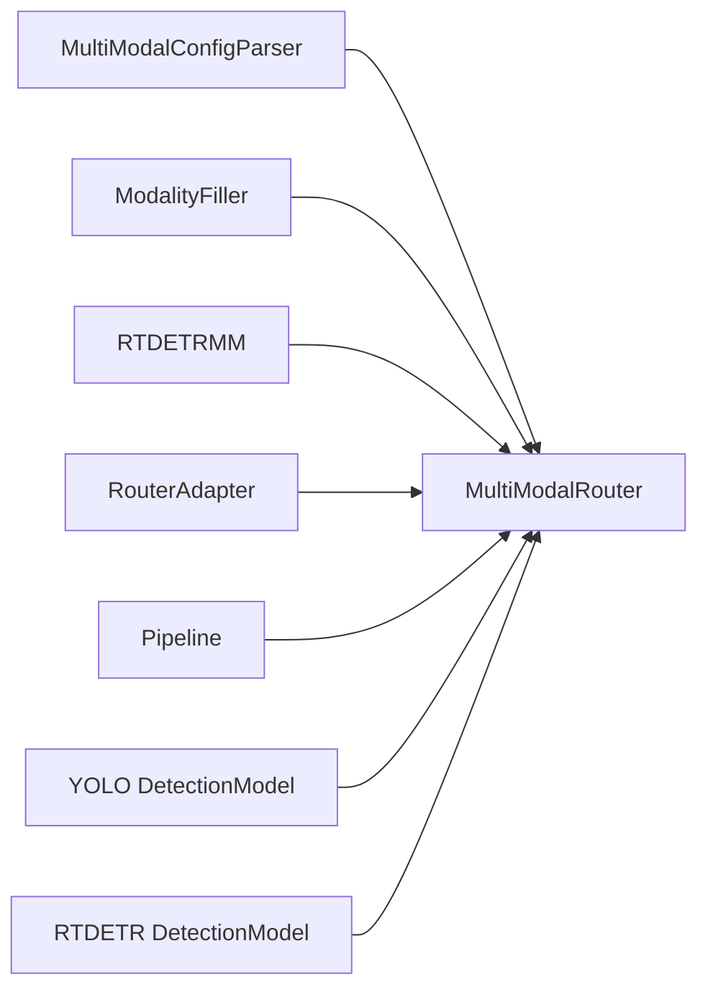

# 模态路由机制原理

<cite>
**本文档引用的文件**
- [ultralytics\nn\mm\router.py](file://ultralytics\nn\mm\router.py)
- [ultralytics\nn\mm\parser.py](file://ultralytics\nn\mm\parser.py)
- [ultralytics\nn\mm\filling.py](file://ultralytics\nn\mm\filling.py)
- [ultralytics\nn\mm\__init__.py](file://ultralytics\nn\mm\__init__.py)
- [ultralytics\models\rtdetrmm\model.py](file://ultralytics\models\rtdetrmm\model.py)
- [ultralytics\models\yolo\multimodal\visualize\pipeline.py](file://ultralytics\models\yolo\multimodal\visualize\pipeline.py)
- [ultralytics\models\utils\multimodal\visualize_core\router_adapter.py](file://ultralytics\models\utils\multimodal\visualize_core\router_adapter.py)
- [ultralytics\nn\tasks.py](file://ultralytics\nn\tasks.py)
- [ultralytics\cfg\models\rtmm\r18\aifi-dattention-c2f-additiveblock.yaml](file://ultralytics\cfg\models\rtmm\r18\aifi-dattention-c2f-additiveblock.yaml)
</cite>

## 目录
1. [简介](#简介)
2. [项目结构](#项目结构)
3. [核心组件](#核心组件)
4. [架构总览](#架构总览)
5. [详细组件分析](#详细组件分析)
6. [依赖关系分析](#依赖关系分析)
7. [性能考量](#性能考量)
8. [故障排查指南](#故障排查指南)
9. [结论](#结论)
10. [附录](#附录)

## 简介
本文件系统性阐述多模态路由机制（MultiModalRouter）的工作原理，重点覆盖以下方面：
- 模态识别与路由决策：如何通过5通道配置字段识别RGB/X/Dual输入来源，并在运行期进行零拷贝路由。
- 数据流控制：Dual输入与单模态输入的分流策略、X模态新输入起点的特殊处理与空间重置。
- 配置驱动的路由系统：YAML配置解析、Hook DSL解析、运行时参数注入。
- 不同网络架构（YOLO、RTDETR）的实现差异与模块化设计：如何在两类检测框架中复用统一的路由内核。
- 可视化与调试：RouterAdapter与可视化管线的集成。

## 项目结构
围绕多模态路由的关键目录与文件如下：
- 路由内核与工具：ultralytics\nn\mm\router.py、ultralytics\nn\mm\parser.py、ultralytics\nn\mm\filling.py
- 模块导出与元信息：ultralytics\nn\mm\__init__.py
- RTDETR多模态模型封装：ultralytics\models\rtdetrmm\model.py
- 可视化与适配：ultralytics\models\yolo\multimodal\visualize\pipeline.py、ultralytics\models\utils\multimodal\visualize_core\router_adapter.py
- YOLO/RTDETR任务基类：ultralytics\nn\tasks.py
- 示例配置：ultralytics\cfg\models\rtmm\r18\aifi-dattention-c2f-additiveblock.yaml

**图表来源**
- [ultralytics\nn\mm\router.py:1-471](file://ultralytics\nn\mm\router.py#L1-L471)
- [ultralytics\nn\mm\parser.py:1-198](file://ultralytics\nn\mm\parser.py#L1-L198)
- [ultralytics\nn\mm\filling.py:1-175](file://ultralytics\nn\mm\filling.py#L1-L175)
- [ultralytics\models\rtdetrmm\model.py:1-269](file://ultralytics\models\rtdetrmm\model.py#L1-L269)
- [ultralytics\nn\tasks.py:1560-1676](file://ultralytics\nn\tasks.py#L1560-L1676)
- [ultralytics\models\yolo\multimodal\visualize\pipeline.py:35-73](file://ultralytics\models\yolo\multimodal\visualize\pipeline.py#L35-L73)
- [ultralytics\models\utils\multimodal\visualize_core\router_adapter.py:45-79](file://ultralytics\models\utils\multimodal\visualize_core\router_adapter.py#L45-L79)

**章节来源**
- [ultralytics\nn\mm\router.py:1-471](file://ultralytics\nn\mm\router.py#L1-L471)
- [ultralytics\nn\mm\parser.py:1-198](file://ultralytics\nn\mm\parser.py#L1-L198)
- [ultralytics\nn\mm\filling.py:1-175](file://ultralytics\nn\mm\filling.py#L1-L175)
- [ultralytics\models\rtdetrmm\model.py:1-269](file://ultralytics\models\rtdetrmm\model.py#L1-L269)
- [ultralytics\nn\tasks.py:1560-1676](file://ultralytics\nn\tasks.py#L1560-L1676)
- [ultralytics\models\yolo\multimodal\visualize\pipeline.py:35-73](file://ultralytics\models\yolo\multimodal\visualize\pipeline.py#L35-L73)
- [ultralytics\models\utils\multimodal\visualize_core\router_adapter.py:45-79](file://ultralytics\models\utils\multimodal\visualize_core\router_adapter.py#L45-L79)

## 核心组件
- MultiModalRouter：统一的RGB+X多模态数据路由器，负责解析5通道配置、建立输入源缓存、执行层间路由与空间重置。
- MultiModalConfigParser：YAML配置解析器，识别5/6通道字段，提取路由层与Hook DSL。
- ModalityFiller/generate_modality_filling：模态填充工具，提供多种轻量策略合成缺失模态。
- RTDETRMM：RTDETR多模态模型封装，Fail-Fast识别多模态结构，确保mm_router可用。
- RouterAdapter/Pipeline：可视化与运行时参数适配器，桥接上层调用与路由内核。

**章节来源**
- [ultralytics\nn\mm\router.py:11-68](file://ultralytics\nn\mm\router.py#L11-L68)
- [ultralytics\nn\mm\parser.py:9-66](file://ultralytics\nn\mm\parser.py#L9-L66)
- [ultralytics\nn\mm\filling.py:14-148](file://ultralytics\nn\mm\filling.py#L14-L148)
- [ultralytics\models\rtdetrmm\model.py:25-188](file://ultralytics\models\rtdetrmm\model.py#L25-L188)
- [ultralytics\models\yolo\multimodal\visualize\pipeline.py:35-73](file://ultralytics\models\yolo\multimodal\visualize\pipeline.py#L35-L73)
- [ultralytics\models\utils\multimodal\visualize_core\router_adapter.py:45-79](file://ultralytics\models\utils\multimodal\visualize_core\router_adapter.py#L45-L79)

## 架构总览
多模态路由采用“配置驱动 + 运行时注入”的设计：
- 配置阶段：解析YAML，识别5通道路由标记与6通道Hook DSL，生成辅助标志。
- 构建阶段：根据输入通道数与配置，初始化INPUT_SOURCES与路由开关。
- 运行阶段：setup_multimodal_routing建立RGB/X/Dual输入源缓存；route_layer_input按模块属性路由；必要时reset_spatial_input进行空间重置。

**图表来源**
- [ultralytics\nn\mm\router.py:64-240](file://ultralytics\nn\mm\router.py#L64-L240)
- [ultralytics\nn\mm\router.py:242-317](file://ultralytics\nn\mm\router.py#L242-L317)
- [ultralytics\nn\mm\filling.py:141-148](file://ultralytics\nn\mm\filling.py#L141-L148)

**章节来源**
- [ultralytics\nn\mm\router.py:64-240](file://ultralytics\nn\mm\router.py#L64-L240)
- [ultralytics\nn\mm\router.py:242-317](file://ultralytics\nn\mm\router.py#L242-L317)
- [ultralytics\nn\mm\filling.py:141-148](file://ultralytics\nn\mm\filling.py#L141-L148)

## 详细组件分析

### MultiModalRouter：路由内核
- 初始化与配置
  - 从dataset_config读取Xch与x_modality，构建INPUT_SOURCES与路由开关。
  - 支持update_dataset_config动态调整X通道数与模态类型。
- 5通道配置解析
  - parse_layer_config识别第5字段为RGB/X/Dual时，设置模块级MM属性（_mm_input_source、_mm_layer_index、_mm_x_modality等）。
  - 若为X且from=-1，标记为新输入起点并启用空间重置。
- Dual与单模态输入分流
  - setup_multimodal_routing根据输入通道判断是否启用路由，分离RGB与X，按runtime_modality策略合成缺失模态，零拷贝缓存original_inputs。
- 层间路由与空间重置
  - route_layer_input优先处理X新输入起点，否则按模块属性路由到RGB/X/Dual。
  - reset_spatial_input在X新输入起点处强制使用original_spatial_size，保证空间一致性。

**图表来源**
- [ultralytics\nn\mm\router.py:157-240](file://ultralytics\nn\mm\router.py#L157-L240)

**章节来源**
- [ultralytics\nn\mm\router.py:31-68](file://ultralytics\nn\mm\router.py#L31-L68)
- [ultralytics\nn\mm\router.py:90-155](file://ultralytics\nn\mm\router.py#L90-L155)
- [ultralytics\nn\mm\router.py:157-240](file://ultralytics\nn\mm\router.py#L157-L240)
- [ultralytics\nn\mm\router.py:242-317](file://ultralytics\nn\mm\router.py#L242-L317)
- [ultralytics\nn\mm\router.py:365-404](file://ultralytics\nn\mm\router.py#L365-L404)

### MultiModalConfigParser：配置驱动
- validate_config_format统计RGB/X/Dual路由层数量，便于诊断。
- extract_multimodal_info提取x_modality_type与路由层数量。
- parse_config检测5通道路由标记，添加has_multimodal_layers与input_layers辅助标志。
- parse_hook_field解析6通道Hook DSL，标准化为规范化的Hook规范列表。

**图表来源**
- [ultralytics\nn\mm\parser.py:67-86](file://ultralytics\nn\mm\parser.py#L67-L86)

**章节来源**
- [ultralytics\nn\mm\parser.py:20-65](file://ultralytics\nn\mm\parser.py#L20-L65)
- [ultralytics\nn\mm\parser.py:67-86](file://ultralytics\nn\mm\parser.py#L67-L86)
- [ultralytics\nn\mm\parser.py:91-197](file://ultralytics\nn\mm\parser.py#L91-L197)

### ModalityFiller：模态填充策略
- 提供copy/noise/channel_repeat/edge_blur/mixed等策略，均保持输出与输入相同形状。
- adapt_xch实现通道数自适应投影，支持3/1/Xch之间的转换。
- generate_modality_filling作为统一入口，结合策略权重随机选择策略。

**图表来源**
- [ultralytics\nn\mm\filling.py:14-175](file://ultralytics\nn\mm\filling.py#L14-L175)

**章节来源**
- [ultralytics\nn\mm\filling.py:14-175](file://ultralytics\nn\mm\filling.py#L14-L175)

### RTDETRMM：RTDETR多模态封装
- Fail-Fast识别多模态结构，校验输入通道（3或6）。
- 基于YAML内容推断支持的模态集合与默认模态，确保mm_router存在。
- 统一任务映射（predictor/validator/trainer/model），与RTDETR检测模型兼容。

**图表来源**
- [ultralytics\models\rtdetrmm\model.py:25-180](file://ultralytics\models\rtdetrmm\model.py#L25-L180)

**章节来源**
- [ultralytics\models\rtdetrmm\model.py:25-180](file://ultralytics\models\rtdetrmm\model.py#L25-L180)

### 可视化与运行时适配
- RouterAdapter：规范化用户输入的模态参数（auto/dual/rgb/x），调用router.set_runtime_params。
- Pipeline：自动探测mm_router位置，提供set_runtime_params能力，兼容旧版检查点的反序列化。

**图表来源**
- [ultralytics\models\utils\multimodal\visualize_core\router_adapter.py:45-79](file://ultralytics\models\utils\multimodal\visualize_core\router_adapter.py#L45-L79)
- [ultralytics\models\yolo\multimodal\visualize\pipeline.py:64-73](file://ultralytics\models\yolo\multimodal\visualize\pipeline.py#L64-L73)

**章节来源**
- [ultralytics\models\utils\multimodal\visualize_core\router_adapter.py:45-79](file://ultralytics\models\utils\multimodal\visualize_core\router_adapter.py#L45-L79)
- [ultralytics\models\yolo\multimodal\visualize\pipeline.py:35-73](file://ultralytics\models\yolo\multimodal\visualize\pipeline.py#L35-L73)

## 依赖关系分析
- 路由内核依赖填充工具：generate_modality_filling/adapt_xch在setup_multimodal_routing中被调用。
- 模型封装依赖路由内核：RTDETRMM在加载时确保mm_router存在并可用。
- 可视化适配依赖路由内核：RouterAdapter/Pipeline通过router.set_runtime_params与update_dataset_config与内核交互。
- 任务基类：YOLO/RTDETR DetectionModel提供统一的forward/predict接口，路由内核在其前向路径中被调用。

**图表来源**
- [ultralytics\nn\mm\router.py:1-471](file://ultralytics\nn\mm\router.py#L1-L471)
- [ultralytics\nn\mm\parser.py:1-198](file://ultralytics\nn\mm\parser.py#L1-L198)
- [ultralytics\nn\mm\filling.py:1-175](file://ultralytics\nn\mm\filling.py#L1-L175)
- [ultralytics\models\rtdetrmm\model.py:1-269](file://ultralytics\models\rtdetrmm\model.py#L1-L269)
- [ultralytics\models\utils\multimodal\visualize_core\router_adapter.py:45-79](file://ultralytics\models\utils\multimodal\visualize_core\router_adapter.py#L45-L79)
- [ultralytics\models\yolo\multimodal\visualize\pipeline.py:35-73](file://ultralytics\models\yolo\multimodal\visualize\pipeline.py#L35-L73)
- [ultralytics\nn\tasks.py:1560-1676](file://ultralytics\nn\tasks.py#L1560-L1676)

**章节来源**
- [ultralytics\nn\mm\router.py:1-471](file://ultralytics\nn\mm\router.py#L1-L471)
- [ultralytics\nn\mm\parser.py:1-198](file://ultralytics\nn\mm\parser.py#L1-L198)
- [ultralytics\nn\mm\filling.py:1-175](file://ultralytics\nn\mm\filling.py#L1-L175)
- [ultralytics\models\rtdetrmm\model.py:1-269](file://ultralytics\models\rtdetrmm\model.py#L1-L269)
- [ultralytics\models\utils\multimodal\visualize_core\router_adapter.py:45-79](file://ultralytics\models\utils\multimodal\visualize_core\router_adapter.py#L45-L79)
- [ultralytics\models\yolo\multimodal\visualize\pipeline.py:35-73](file://ultralytics\models\yolo\multimodal\visualize\pipeline.py#L35-L73)
- [ultralytics\nn\tasks.py:1560-1676](file://ultralytics\nn\tasks.py#L1560-L1676)

## 性能考量
- 零拷贝路由：通过切片与缓存original_inputs实现零拷贝tensor视图，降低内存与带宽开销。
- 轻量化填充策略：填充策略均为纯张量运算，避免额外依赖，适合在线推理路径。
- 动态通道适配：adapt_xch采用线性投影，复杂度低，支持3/1/Xch灵活转换。
- 运行时参数注入：set_runtime_params与update_dataset_config在不重建模型的前提下动态调整行为。

[本节为通用性能讨论，无需具体文件分析]

## 故障排查指南
- 路由未生效
  - 检查配置是否包含5通道RGB/X/Dual标记；确认has_multimodal_layers为True。
  - 确认输入通道数与INPUT_SOURCES匹配（3或3+Xch）。
- X模态新输入起点报错
  - 检查模块是否标记了_mm_new_input_start；确认X输入通道数与预期一致。
  - 查看original_spatial_size是否正确设置。
- 策略合成异常
  - 检查runtime_modality与strategy参数；确认ModalityFiller策略权重合理。
- 可视化/适配器无效
  - 确认mm_router已成功注入；检查RouterAdapter参数规范化逻辑。

**章节来源**
- [ultralytics\nn\mm\router.py:255-317](file://ultralytics\nn\mm\router.py#L255-L317)
- [ultralytics\nn\mm\router.py:365-404](file://ultralytics\nn\mm\router.py#L365-L404)
- [ultralytics\nn\mm\filling.py:141-148](file://ultralytics\nn\mm\filling.py#L141-L148)
- [ultralytics\models\utils\multimodal\visualize_core\router_adapter.py:45-79](file://ultralytics\models\utils\multimodal\visualize_core\router_adapter.py#L45-L79)

## 结论
MultiModalRouter通过“5通道配置字段 + 6通道Hook DSL + 运行时参数注入”的组合，实现了对YOLO与RTDETR两大检测框架的统一多模态路由。其核心优势在于：
- 零拷贝tensor视图路由，显著降低内存与带宽压力。
- 配置驱动的模块化设计，使路由决策与网络结构解耦。
- 轻量填充策略与动态通道适配，兼顾灵活性与性能。
- 可视化与适配层的解耦，便于上层应用快速集成。

[本节为总结性内容，无需具体文件分析]

## 附录

### 5通道配置字段与6通道Hook DSL详解
- 5通道字段（第5字段）
  - 取值范围：RGB、X、Dual。
  - 作用：声明该层的输入模态来源；当为X且from=-1时，标记为X模态新输入起点并启用空间重置。
- 6通道字段（第6字段）
  - Hook DSL：以CL工具为主，支持RGB/X/Dual/Fused（映射为Dual）三类模态，stage需符合Pn格式。
  - 支持参数：tap（input/output）、action（capture）、detach、normalize、buffer等。
  - 用途：在推理/验证过程中捕获特征图，用于可视化与分析。

**章节来源**
- [ultralytics\nn\mm\router.py:90-155](file://ultralytics\nn\mm\router.py#L90-L155)
- [ultralytics\nn\mm\parser.py:67-86](file://ultralytics\nn\mm\parser.py#L67-L86)
- [ultralytics\nn\mm\parser.py:91-197](file://ultralytics\nn\mm\parser.py#L91-L197)

### YOLO与RTDETR实现差异
- YOLO路径
  - 通过DetectionModel的predict流程接入路由内核；在预处理/前向过程中调用setup_multimodal_routing与route_layer_input。
- RTDETR路径
  - 通过RTDETRDetectionModel与RTDETRMM封装，统一任务映射；在推理时同样走相同的路由内核，保证行为一致性。

**章节来源**
- [ultralytics\nn\tasks.py:1560-1676](file://ultralytics\nn\tasks.py#L1560-L1676)
- [ultralytics\models\rtdetrmm\model.py:48-188](file://ultralytics\models\rtdetrmm\model.py#L48-L188)

### 示例配置片段（路径）
- [ultralytics\cfg\models\rtmm\r18\aifi-dattention-c2f-additiveblock.yaml:55-65](file://ultralytics\cfg\models\rtmm\r18\aifi-dattention-c2f-additiveblock.yaml#L55-L65)