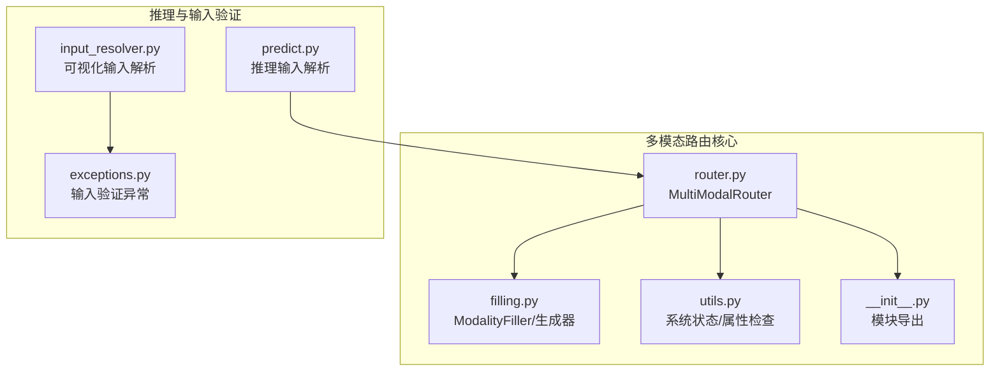
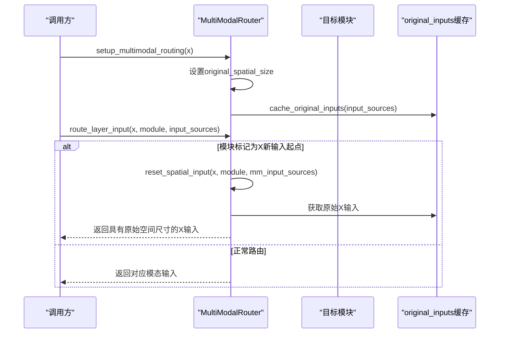
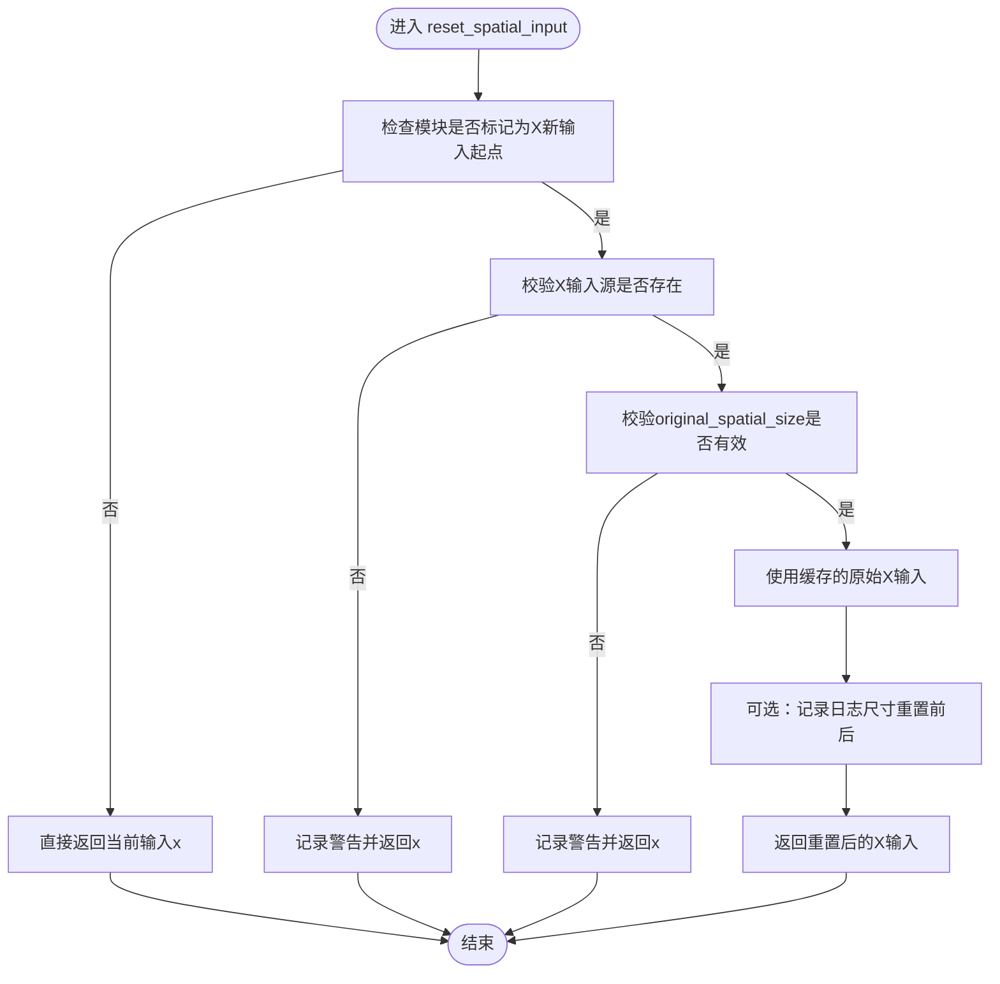
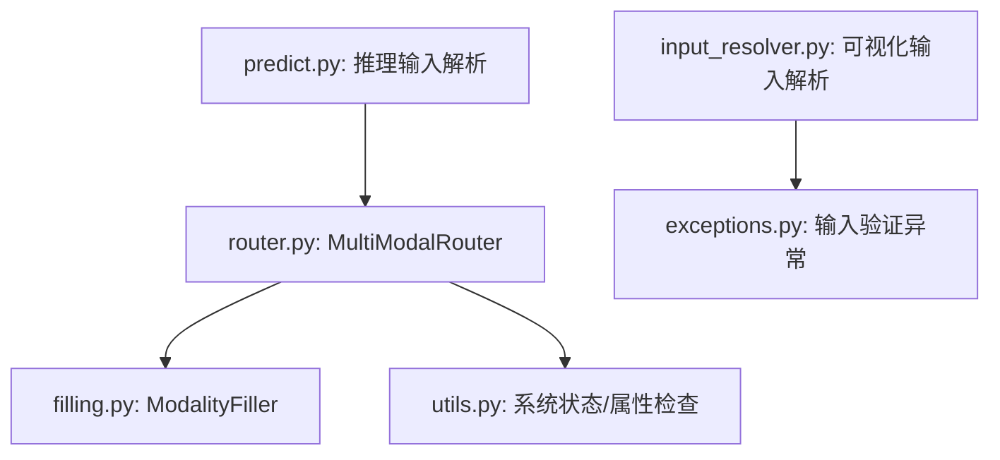

# 空间重置系统

<cite>
**本文档引用的文件**
- [router.py](file://ultralytics/nn/mm/router.py)
- [filling.py](file://ultralytics/nn/mm/filling.py)
- [utils.py](file://ultralytics/nn/mm/utils.py)
- [__init__.py](file://ultralytics/nn/mm/__init__.py)
- [predict.py](file://ultralytics/models/yolo/multimodal/predict.py)
- [input_resolver.py](file://ultralytics/models/utils/multimodal/visualize_core/input_resolver.py)
- [exceptions.py](file://ultralytics/models/utils/multimodal/visualize_core/exceptions.py)
</cite>

## 目录
1. [简介](#简介)
2. [项目结构](#项目结构)
3. [核心组件](#核心组件)
4. [架构总览](#架构总览)
5. [详细组件分析](#详细组件分析)
6. [依赖关系分析](#依赖关系分析)
7. [性能考虑](#性能考虑)
8. [故障排除指南](#故障排除指南)
9. [结论](#结论)

## 简介
本文件针对多模态空间重置系统进行深入技术文档化，重点解释MultiModalRouter如何处理X模态的新输入起点与空间重置需求，详细阐述reset_spatial_input方法的工作原理、原始空间尺寸的缓存机制、X模态输入的获取与验证，以及空间重置过程中的错误处理策略。同时，说明该机制在不同网络架构中的应用场景，以及与模态路由系统的协同工作机制。

## 项目结构
多模态空间重置系统主要位于以下模块中：
- 路由与空间重置核心：ultralytics/nn/mm/router.py
- 模态填充工具：ultralytics/nn/mm/filling.py
- 工具函数与系统状态：ultralytics/nn/mm/utils.py
- 模块导出与元信息：ultralytics/nn/mm/__init__.py
- 推理侧输入解析与验证：ultralytics/models/yolo/multimodal/predict.py
- 可视化输入解析与异常：ultralytics/models/utils/multimodal/visualize_core/input_resolver.py, exceptions.py

**图表来源**
- [router.py:11-471](file://ultralytics/nn/mm/router.py#L11-L471)
- [filling.py:1-175](file://ultralytics/nn/mm/filling.py#L1-L175)
- [utils.py:1-93](file://ultralytics/nn/mm/utils.py#L1-L93)
- [__init__.py:1-78](file://ultralytics/nn/mm/__init__.py#L1-L78)
- [predict.py:205-911](file://ultralytics/models/yolo/multimodal/predict.py#L205-L911)
- [input_resolver.py:162-179](file://ultralytics/models/utils/multimodal/visualize_core/input_resolver.py#L162-L179)
- [exceptions.py:21-54](file://ultralytics/models/utils/multimodal/visualize_core/exceptions.py#L21-L54)

**章节来源**
- [router.py:11-471](file://ultralytics/nn/mm/router.py#L11-L471)
- [filling.py:1-175](file://ultralytics/nn/mm/filling.py#L1-L175)
- [utils.py:1-93](file://ultralytics/nn/mm/utils.py#L1-L93)
- [__init__.py:1-78](file://ultralytics/nn/mm/__init__.py#L1-L78)
- [predict.py:205-911](file://ultralytics/models/yolo/multimodal/predict.py#L205-L911)
- [input_resolver.py:162-179](file://ultralytics/models/utils/multimodal/visualize_core/input_resolver.py#L162-L179)
- [exceptions.py:21-54](file://ultralytics/models/utils/multimodal/visualize_core/exceptions.py#L21-L54)

## 核心组件
- MultiModalRouter：负责RGB+X模态的零拷贝张量路由、X模态新输入起点识别与空间重置、原始空间尺寸缓存与X模态输入获取。
- ModalityFiller/generate_modality_filling/adapt_xch：在运行时按策略合成缺失模态（如将RGB填充为X），并适配通道数。
- 工具函数：系统状态检查、模型属性检查、配置格式验证等。
- 推理输入解析：在推理阶段对输入进行格式校验与必要合成，确保与训练时的多模态配置一致。

**章节来源**
- [router.py:31-63](file://ultralytics/nn/mm/router.py#L31-L63)
- [filling.py:14-175](file://ultralytics/nn/mm/filling.py#L14-L175)
- [utils.py:8-93](file://ultralytics/nn/mm/utils.py#L8-L93)
- [predict.py:387-911](file://ultralytics/models/yolo/multimodal/predict.py#L387-L911)

## 架构总览
MultiModalRouter在前向过程中根据模块属性判断是否需要X模态的新输入起点，并在该位置触发空间重置：从缓存的original_inputs中取出具有原始空间尺寸的X模态张量，确保后续模块接收与输入时相同的分辨率，从而避免因上采样/下采样导致的空间不一致问题。

**图表来源**
- [router.py:157-240](file://ultralytics/nn/mm/router.py#L157-L240)
- [router.py:242-317](file://ultralytics/nn/mm/router.py#L242-L317)
- [router.py:365-404](file://ultralytics/nn/mm/router.py#L365-L404)

## 详细组件分析

### MultiModalRouter：X模态新输入起点与空间重置
- 初始化与配置
  - 从配置字典读取X模态通道数Xch与X模态类型x_modality，构建INPUT_SOURCES映射。
  - 记录has_multimodal_config以判断是否启用多模态配置。
  - 维护original_spatial_size与original_inputs缓存，用于空间重置。
- setup_multimodal_routing
  - 识别双模态输入（RGB+X）或单模态配置，动态设置original_spatial_size。
  - 根据runtime_modality选择RGB或X作为填充源，生成dual输入并缓存原始输入。
- route_layer_input
  - 若模块标记为X新输入起点，则直接返回X模态输入，并进行通道数验证。
  - 否则按模块属性路由到RGB/X/Dual。
- reset_spatial_input
  - 仅当模块标记为X新输入起点时生效。
  - 校验X输入源存在与original_spatial_size有效。
  - 返回具有原始空间尺寸的X模态输入，确保后续模块接收与输入时一致的分辨率。

**图表来源**
- [router.py:365-404](file://ultralytics/nn/mm/router.py#L365-L404)

**章节来源**
- [router.py:31-63](file://ultralytics/nn/mm/router.py#L31-L63)
- [router.py:157-240](file://ultralytics/nn/mm/router.py#L157-L240)
- [router.py:242-317](file://ultralytics/nn/mm/router.py#L242-L317)
- [router.py:324-340](file://ultralytics/nn/mm/router.py#L324-L340)
- [router.py:342-363](file://ultralytics/nn/mm/router.py#L342-L363)
- [router.py:365-404](file://ultralytics/nn/mm/router.py#L365-L404)

### 原始空间尺寸缓存机制
- 设置时机
  - 在setup_multimodal_routing中，当检测到双模态输入或单模态配置时，将输入张量的空间尺寸（H, W）保存到original_spatial_size。
- 缓存内容
  - cache_original_inputs将RGB/X/Dual三路输入以引用方式缓存至original_inputs，避免额外内存拷贝。
- 使用场景
  - reset_spatial_input在X模态新输入起点处，直接从缓存获取原始X输入，保证空间一致性。

**章节来源**
- [router.py:180-207](file://ultralytics/nn/mm/router.py#L180-L207)
- [router.py:209-238](file://ultralytics/nn/mm/router.py#L209-L238)
- [router.py:328-340](file://ultralytics/nn/mm/router.py#L328-L340)

### X模态输入的获取与验证
- 获取原始X输入
  - get_original_x_input支持按需返回原始X输入；当前实现假设原始输入已具备目标尺寸。
- 输入验证
  - route_layer_input在X新输入起点时，会验证X输入通道数与预期Xch一致，否则记录错误并拒绝路由。
- 运行时填充
  - setup_multimodal_routing在单模态场景下，根据runtime_modality使用ModalityFiller生成X或RGB的填充版本，确保输出通道数符合预期。

**章节来源**
- [router.py:342-363](file://ultralytics/nn/mm/router.py#L342-L363)
- [router.py:278-287](file://ultralytics/nn/mm/router.py#L278-L287)
- [filling.py:141-175](file://ultralytics/nn/mm/filling.py#L141-L175)

### 错误处理与日志
- reset_spatial_input
  - 缺少X输入源：记录警告并返回原输入。
  - original_spatial_size为空：记录警告并返回原输入。
- route_layer_input
  - 输入源不可用：记录警告并返回None。
  - 请求的模态不存在于输入源：记录警告并返回None。
  - X新输入起点通道数不匹配：记录错误并返回None。
- 系统状态与属性检查
  - mm_system_status与check_mm_model_attributes提供系统健康度与路由层分布信息。

**章节来源**
- [router.py:381-395](file://ultralytics/nn/mm/router.py#L381-L395)
- [router.py:258-262](file://ultralytics/nn/mm/router.py#L258-L262)
- [router.py:296-301](file://ultralytics/nn/mm/router.py#L296-L301)
- [router.py:280-287](file://ultralytics/nn/mm/router.py#L280-L287)
- [utils.py:37-77](file://ultralytics/nn/mm/utils.py#L37-L77)

### 与模态路由系统的协同工作机制
- 属性注入
  - parse_layer_config在检测到第5列（模态标识）为'X'且from=-1时，为模块注入_mm_new_input_start与_mm_spatial_reset标记，同时设置_mm_input_source与_mm_x_modality等属性。
- 路由决策
  - route_layer_input优先处理X新输入起点，确保该分支始终接收原始X输入；普通路由则按模块属性选择RGB/X/Dual。
- 推理输入解析
  - predict.py在推理阶段对输入进行严格校验，支持双模态列表与6通道张量格式，避免在预处理阶段进行自动填充，将填充逻辑交由MultiModalRouter在前向中处理。

**章节来源**
- [router.py:111-134](file://ultralytics/nn/mm/router.py#L111-L134)
- [router.py:267-294](file://ultralytics/nn/mm/router.py#L267-L294)
- [predict.py:387-407](file://ultralytics/models/yolo/multimodal/predict.py#L387-L407)
- [predict.py:205-224](file://ultralytics/models/yolo/multimodal/predict.py#L205-L224)

### 在不同网络架构中的应用场景
- YOLO系列
  - 通过在模型配置中为特定层设置第5列模态标识，使某些分支在遇到X新输入起点时强制使用原始X输入，确保特征金字塔或多尺度分支在不同分辨率下的一致性。
- RT-DETR系列
  - 在解码器或特定阶段插入X新输入起点标记，结合original_spatial_size，保证注意力计算与检测头在统一空间尺度上进行。
- 通用性
  - 由于采用属性驱动与零拷贝路由，该机制可无缝适配多种骨干网络与颈部结构。

**章节来源**
- [router.py:111-134](file://ultralytics/nn/mm/router.py#L111-L134)
- [router.py:267-294](file://ultralytics/nn/mm/router.py#L267-L294)
- [__init__.py:11-27](file://ultralytics/nn/mm/__init__.py#L11-L27)

## 依赖关系分析
- MultiModalRouter依赖ModalityFiller进行运行时填充，依赖utils进行系统状态与属性检查。
- 推理侧predict.py依赖MultiModalRouter进行输入路由与填充，同时对输入格式进行严格校验。
- 可视化输入解析input_resolver.py与异常定义exceptions.py提供输入有效性保障。

**图表来源**
- [router.py:11-471](file://ultralytics/nn/mm/router.py#L11-L471)
- [filling.py:1-175](file://ultralytics/nn/mm/filling.py#L1-L175)
- [utils.py:1-93](file://ultralytics/nn/mm/utils.py#L1-L93)
- [predict.py:205-911](file://ultralytics/models/yolo/multimodal/predict.py#L205-L911)
- [input_resolver.py:162-179](file://ultralytics/models/utils/multimodal/visualize_core/input_resolver.py#L162-L179)
- [exceptions.py:21-54](file://ultralytics/models/utils/multimodal/visualize_core/exceptions.py#L21-L54)

**章节来源**
- [router.py:11-471](file://ultralytics/nn/mm/router.py#L11-L471)
- [filling.py:1-175](file://ultralytics/nn/mm/filling.py#L1-L175)
- [utils.py:1-93](file://ultralytics/nn/mm/utils.py#L1-L93)
- [predict.py:205-911](file://ultralytics/models/yolo/multimodal/predict.py#L205-L911)
- [input_resolver.py:162-179](file://ultralytics/models/utils/multimodal/visualize_core/input_resolver.py#L162-L179)
- [exceptions.py:21-54](file://ultralytics/models/utils/multimodal/visualize_core/exceptions.py#L21-L54)

## 性能考虑
- 零拷贝路由：通过切片与引用缓存（original_inputs）避免张量复制，降低内存与带宽开销。
- 运行时填充轻量化：ModalityFiller策略简单高效，避免引入重型依赖，适合在前向路径中快速合成缺失模态。
- 条件空间重置：仅在模块标记为X新输入起点时才执行重置，减少不必要的计算与内存访问。

[本节为通用指导，无需具体文件分析]

## 故障排除指南
- 症状：空间重置失败，返回原输入
  - 可能原因：缺少X输入源、original_spatial_size为空、模块未标记为X新输入起点。
  - 处理建议：确认模块配置中第5列为'X'且from=-1；检查setup_multimodal_routing是否正确执行；核对输入格式与通道数。
- 症状：X新输入起点通道数不匹配
  - 可能原因：X输入通道数与Xch不一致。
  - 处理建议：在setup_multimodal_routing中使用adapt_xch调整通道数；检查数据集配置Xch与实际输入是否一致。
- 症状：推理输入格式错误
  - 可能原因：双模态输入数量不符或通道数不为6。
  - 处理建议：遵循predict.py的输入规范，确保提供正确的RGB+X组合或6通道张量；避免在预处理阶段自动填充。

**章节来源**
- [router.py:381-395](file://ultralytics/nn/mm/router.py#L381-L395)
- [router.py:278-287](file://ultralytics/nn/mm/router.py#L278-L287)
- [predict.py:889-911](file://ultralytics/models/yolo/multimodal/predict.py#L889-L911)

## 结论
MultiModalRouter通过属性驱动与零拷贝路由实现了对X模态新输入起点的精准识别与空间重置，配合ModalityFiller与系统工具函数，确保在不同网络架构中的一致性与稳定性。其设计兼顾性能与可维护性，适用于YOLO与RT-DETR等多种主流架构，并为未来的多模态扩展提供了清晰的接口与机制。