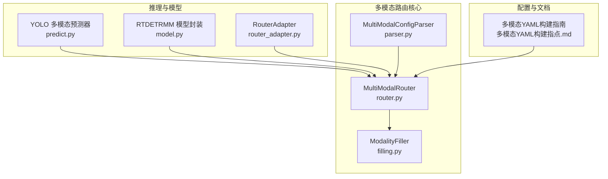
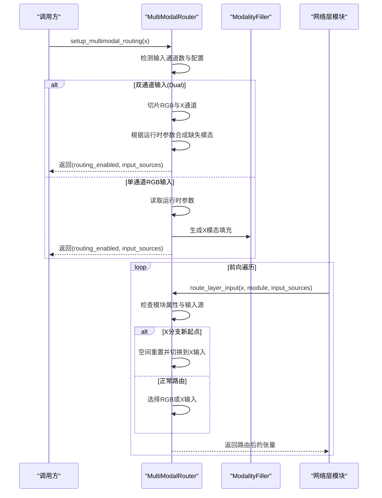
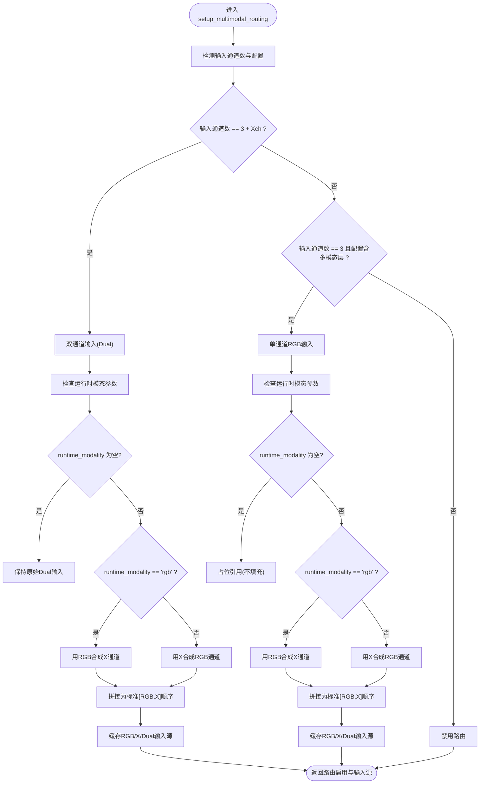
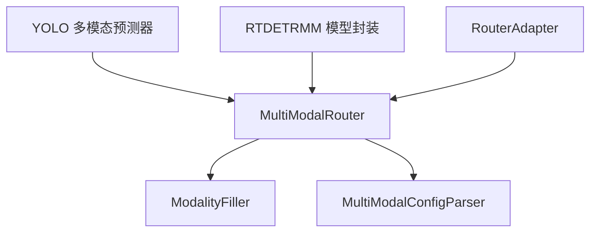

# 路由决策机制

<cite>
**本文档引用的文件**
- [router.py](file://ultralytics/nn/mm/router.py)
- [filling.py](file://ultralytics/nn/mm/filling.py)
- [parser.py](file://ultralytics/nn/mm/parser.py)
- [predict.py](file://ultralytics/models/yolo/multimodal/predict.py)
- [model.py](file://ultralytics/models/rtdetrmm/model.py)
- [router_adapter.py](file://ultralytics/models/utils/multimodal/visualize_core/router_adapter.py)
- [多模态YAML构建指点.md](file://ultralytics/cfg/models/多模态YAML构建指点.md)
</cite>

## 目录
1. [简介](#简介)
2. [项目结构](#项目结构)
3. [核心组件](#核心组件)
4. [架构总览](#架构总览)
5. [详细组件分析](#详细组件分析)
6. [依赖关系分析](#依赖关系分析)
7. [性能考虑](#性能考虑)
8. [故障排除指南](#故障排除指南)
9. [结论](#结论)
10. [附录](#附录)

## 简介
本文件系统性阐述 MultiModalRouter 的路由决策机制，重点解释以下方面：
- 如何根据输入张量的通道数与配置信息做出路由决策
- setup_multimodal_routing 方法的决策逻辑
- 双通道输入（Dual）与单通道输入（RGB/X）的不同处理策略
- 运行时模态参数对路由决策的影响
- 路由启用条件、输入源检测、以及不同路由模式下的数据处理流程
- 包含决策树图、路由流程图和多种路由场景的处理示例

## 项目结构
围绕多模态路由的核心文件分布如下：
- 路由核心：ultralytics/nn/mm/router.py
- 模态填充工具：ultralytics/nn/mm/filling.py
- 配置解析：ultralytics/nn/mm/parser.py
- YOLO 多模态推理：ultralytics/models/yolo/multimodal/predict.py
- RTDETRMM 模型封装：ultralytics/models/rtdetrmm/model.py
- 可视化适配器：ultralytics/models/utils/multimodal/visualize_core/router_adapter.py
- YAML 构建指南：ultralytics/cfg/models/多模态YAML构建指点.md

**图表来源**
- [router.py:11-471](file://ultralytics/nn/mm/router.py#L11-L471)
- [filling.py:14-175](file://ultralytics/nn/mm/filling.py#L14-L175)
- [parser.py:67-97](file://ultralytics/nn/mm/parser.py#L67-L97)
- [predict.py:74-136](file://ultralytics/models/yolo/multimodal/predict.py#L74-L136)
- [model.py:148-180](file://ultralytics/models/rtdetrmm/model.py#L148-L180)
- [router_adapter.py:18-103](file://ultralytics/models/utils/multimodal/visualize_core/router_adapter.py#L18-L103)
- [多模态YAML构建指点.md:1-239](file://ultralytics/cfg/models/多模态YAML构建指点.md#L1-L239)

**章节来源**
- [router.py:11-471](file://ultralytics/nn/mm/router.py#L11-L471)
- [filling.py:14-175](file://ultralytics/nn/mm/filling.py#L14-L175)
- [parser.py:67-97](file://ultralytics/nn/mm/parser.py#L67-L97)
- [predict.py:74-136](file://ultralytics/models/yolo/multimodal/predict.py#L74-L136)
- [model.py:148-180](file://ultralytics/models/rtdetrmm/model.py#L148-L180)
- [router_adapter.py:18-103](file://ultralytics/models/utils/multimodal/visualize_core/router_adapter.py#L18-L103)
- [多模态YAML构建指点.md:1-239](file://ultralytics/cfg/models/多模态YAML构建指点.md#L1-L239)

## 核心组件
- MultiModalRouter：统一的 RGB+X 多模态数据路由器，支持零拷贝张量视图路由、配置驱动的数据流、以及 YOLO/RTDETR 架构的通用支持。
- ModalityFiller：模态填充器，提供多种轻量、确定性的合成策略，用于单模态场景下的缺失模态合成。
- MultiModalConfigParser：配置解析器，检测 YAML 中的第5字段路由标记，生成最小化配置字典，保持向后兼容。
- RouterAdapter：可视化适配器，安全探测并调用路由器，规范化运行时参数。

**章节来源**
- [router.py:11-68](file://ultralytics/nn/mm/router.py#L11-L68)
- [filling.py:14-50](file://ultralytics/nn/mm/filling.py#L14-L50)
- [parser.py:67-97](file://ultralytics/nn/mm/parser.py#L67-L97)
- [router_adapter.py:18-71](file://ultralytics/models/utils/multimodal/visualize_core/router_adapter.py#L18-L71)

## 架构总览
MultiModalRouter 的工作流分为三个阶段：
1) 初始化与配置解析：从数据配置读取 X 模态通道数与类型，检测 YAML 中的多模态层标记，建立 INPUT_SOURCES 映射。
2) 运行时路由决策：根据输入张量通道数与运行时参数，判断是否启用路由，生成 RGB/X/Dual 三路输入源缓存。
3) 层级路由与空间重置：在前向过程中，依据模块属性选择合适的输入源，并在 X 分支新起点处进行空间重置。

**图表来源**
- [router.py:157-240](file://ultralytics/nn/mm/router.py#L157-L240)
- [router.py:242-317](file://ultralytics/nn/mm/router.py#L242-L317)
- [filling.py:35-49](file://ultralytics/nn/mm/filling.py#L35-L49)

**章节来源**
- [router.py:157-317](file://ultralytics/nn/mm/router.py#L157-L317)
- [filling.py:35-49](file://ultralytics/nn/mm/filling.py#L35-L49)

## 详细组件分析

### MultiModalRouter 决策树与流程
MultiModalRouter 的核心决策逻辑集中在 setup_multimodal_routing 方法中。其决策树如下：

**图表来源**
- [router.py:157-240](file://ultralytics/nn/mm/router.py#L157-L240)

**章节来源**
- [router.py:157-240](file://ultralytics/nn/mm/router.py#L157-L240)

### 双通道输入（Dual）处理策略
- 输入检测：当输入张量通道数等于 3 + Xch 时，判定为双通道输入（Dual）。
- 数据切分：将前 3 通道视为 RGB，后 Xch 通道视为 X。
- 运行时参数影响：
  - runtime_modality 为空：保持原始 Dual 输入，不进行任何填充。
  - runtime_modality == 'rgb'：用 RGB 合成 X 通道，通道顺序标准化为 [RGB(0:3), X(3:3+Xch)]。
  - 其他值：用 X 合成 RGB 通道，通道顺序标准化为 [RGB(0:3), X(3:3+Xch)]。
- 输入源缓存：同时缓存 RGB、X、Dual 三路输入，便于后续层级路由与空间重置。

**章节来源**
- [router.py:174-206](file://ultralytics/nn/mm/router.py#L174-L206)
- [router.py:189-200](file://ultralytics/nn/mm/router.py#L189-L200)
- [router.py:202-206](file://ultralytics/nn/mm/router.py#L202-L206)

### 单通道输入（RGB/X）处理策略
- 输入检测：当输入通道数为 3 且配置包含多模态层时，判定为单通道输入。
- 运行时参数影响：
  - runtime_modality 为空：不进行任何填充，RGB/X 输入均为占位引用。
  - runtime_modality == 'rgb'：保持 RGB 输入不变，用 RGB 合成 X 通道，通道顺序标准化为 [RGB(0:3), X(3:3+Xch)]。
  - runtime_modality 为其他值（如 'x'）：保持 X 输入不变，用 X 合成 RGB 通道，通道顺序标准化为 [RGB(0:3), X(3:3+Xch)]。
- 输入源缓存：同样缓存三路输入源。

**章节来源**
- [router.py:209-238](file://ultralytics/nn/mm/router.py#L209-L238)
- [router.py:218-231](file://ultralytics/nn/mm/router.py#L218-L231)
- [router.py:233-237](file://ultralytics/nn/mm/router.py#L233-L237)

### 运行时模态参数与策略
- set_runtime_params：设置 runtime_modality、runtime_strategy、runtime_seed。
- RouterAdapter：在可视化与调试场景中安全探测并调用路由器，规范化 modality 参数（'auto'/'dual' 视为 None，'rgb'/'x' 视为指定消融）。
- 策略选择：若未显式指定策略，ModalityFiller 采用加权随机策略生成缺失模态。

**章节来源**
- [router.py:64-68](file://ultralytics/nn/mm/router.py#L64-L68)
- [router_adapter.py:49-70](file://ultralytics/models/utils/multimodal/visualize_core/router_adapter.py#L49-L70)
- [filling.py:61-67](file://ultralytics/nn/mm/filling.py#L61-L67)

### 层级路由与空间重置
- route_layer_input：根据模块属性选择输入源。
  - 若模块标记为 X 分支新起点（from=-1 + 'X'），强制切换到 X 输入，并进行通道数验证。
  - 否则按模块属性选择 RGB 或 X 输入。
- reset_spatial_input：在 X 分支新起点处，使用原始 X 输入进行空间重置，确保尺寸一致性。

**章节来源**
- [router.py:242-317](file://ultralytics/nn/mm/router.py#L242-L317)
- [router.py:365-404](file://ultralytics/nn/mm/router.py#L365-L404)

### 配置驱动的路由标记
- MultiModalConfigParser：检测 YAML 中第5字段为 'RGB'/'X'/'Dual' 的层，标记为多模态层，并生成辅助标志。
- 多模态YAML构建指南：明确第5字段语义、分支书写规范、早期/中期/晚期融合模板、以及与 data.yaml 的配合。

**章节来源**
- [parser.py:67-97](file://ultralytics/nn/mm/parser.py#L67-L97)
- [多模态YAML构建指点.md:20-64](file://ultralytics/cfg/models/多模态YAML构建指点.md#L20-L64)

### YOLO 与 RTDETRMM 的集成
- YOLO 多模态预测器：在推理前设置运行时模态参数，支持双模态与单模态输入解析与预处理。
- RTDETRMM 模型封装：确保底层模型持有 mm_router，支持输入通道验证与模态配置推断。

**章节来源**
- [predict.py:115-136](file://ultralytics/models/yolo/multimodal/predict.py#L115-L136)
- [model.py:148-180](file://ultralytics/models/rtdetrmm/model.py#L148-L180)

## 依赖关系分析
- MultiModalRouter 依赖 ModalityFiller 进行缺失模态合成，依赖配置解析器检测多模态层标记。
- YOLO 与 RTDETRMM 通过预测器与模型封装间接依赖 MultiModalRouter。
- RouterAdapter 作为可视化适配器，安全探测并调用路由器，避免硬依赖。

**图表来源**
- [router.py:11-471](file://ultralytics/nn/mm/router.py#L11-L471)
- [filling.py:14-175](file://ultralytics/nn/mm/filling.py#L14-L175)
- [parser.py:67-97](file://ultralytics/nn/mm/parser.py#L67-L97)
- [predict.py:74-136](file://ultralytics/models/yolo/multimodal/predict.py#L74-L136)
- [model.py:148-180](file://ultralytics/models/rtdetrmm/model.py#L148-L180)
- [router_adapter.py:18-103](file://ultralytics/models/utils/multimodal/visualize_core/router_adapter.py#L18-L103)

**章节来源**
- [router.py:11-471](file://ultralytics/nn/mm/router.py#L11-L471)
- [filling.py:14-175](file://ultralytics/nn/mm/filling.py#L14-L175)
- [parser.py:67-97](file://ultralytics/nn/mm/parser.py#L67-L97)
- [predict.py:74-136](file://ultralytics/models/yolo/multimodal/predict.py#L74-L136)
- [model.py:148-180](file://ultralytics/models/rtdetrmm/model.py#L148-L180)
- [router_adapter.py:18-103](file://ultralytics/models/utils/multimodal/visualize_core/router_adapter.py#L18-L103)

## 性能考虑
- 零拷贝张量视图：通过切片与缓存原始输入，避免不必要的数据复制。
- 轻量化填充策略：ModalityFiller 提供多种轻量策略，避免引入重型依赖。
- 配置驱动的形状推导：通过 YAML 第5字段与数据配置，减少运行时形状推断开销。
- 日志与诊断：在 profile 模式下输出路由日志，便于定位性能瓶颈。

[本节为通用性能讨论，不直接分析具体文件]

## 故障排除指南
常见问题与排查要点：
- 通道不匹配：检查 data.yaml 的 Xch 设置与 YAML 第5字段标注，确保 Dual 仅在输入起点使用。
- 模块未导入：确认模块在相应 __init__.py 中正确导出。
- 结果融合：示例中 DecisionFusion 为占位注释，需自行实现或在外部融合。
- 运行确认：使用 profile=True 查看 Router 的路由日志与空间重置信息。

**章节来源**
- [多模态YAML构建指点.md:206-224](file://ultralytics/cfg/models/多模态YAML构建指点.md#L206-L224)

## 结论
MultiModalRouter 通过配置驱动与运行时参数的协同，实现了对双通道与单通道输入的统一路由管理。其零拷贝设计、轻量化填充策略与严格的分支书写规范，确保了在多模态场景下的高效与稳定。结合 YOLO 与 RTDETRMM 的集成，该机制为多模态目标检测提供了灵活、可扩展的基础设施。

[本节为总结性内容，不直接分析具体文件]

## 附录

### 路由场景示例
- 双通道输入（最佳性能）：输入为 6 通道（RGB+X），runtime_modality 为空，保持原始 Dual 输入。
- 单通道 RGB 输入：输入为 3 通道，runtime_modality='rgb'，用 RGB 合成 X 通道，形成 6 通道输入。
- 单通道 X 输入：输入为 3 通道，runtime_modality='x'，用 X 合成 RGB 通道，形成 6 通道输入。

**章节来源**
- [router.py:174-206](file://ultralytics/nn/mm/router.py#L174-L206)
- [router.py:209-238](file://ultralytics/nn/mm/router.py#L209-L238)
- [filling.py:35-49](file://ultralytics/nn/mm/filling.py#L35-L49)