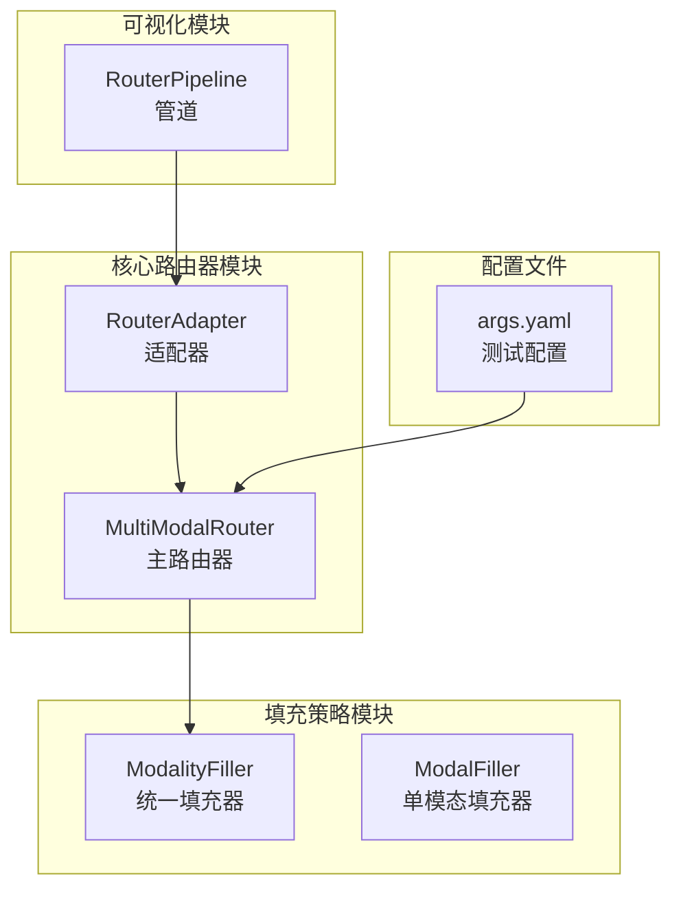
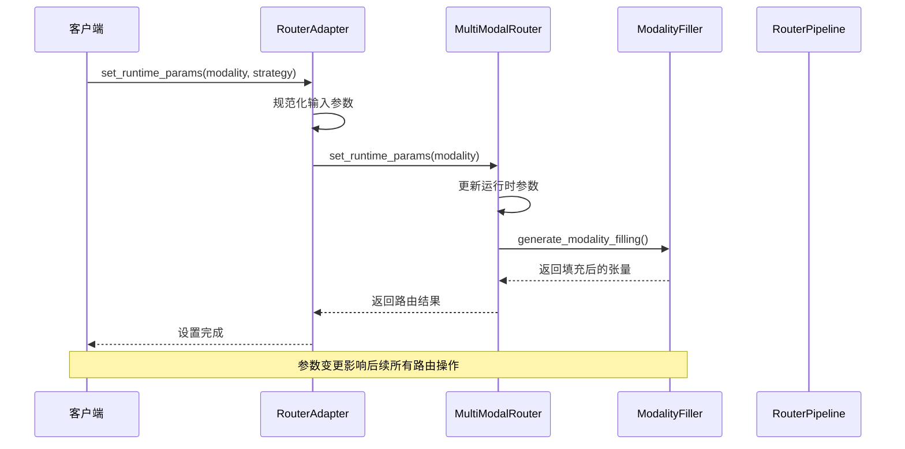
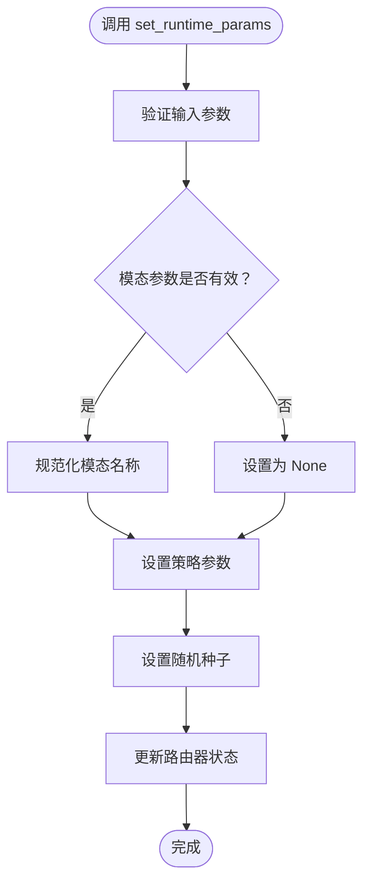
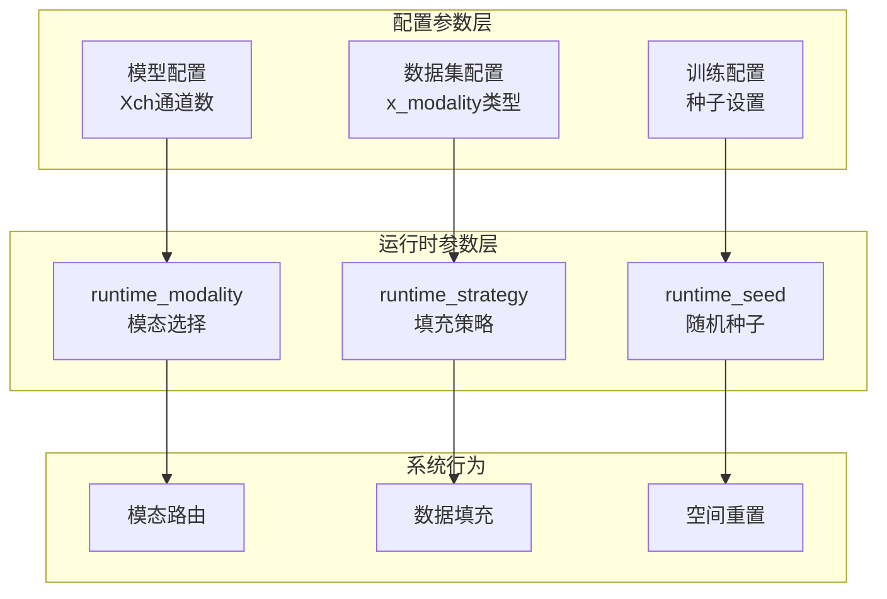
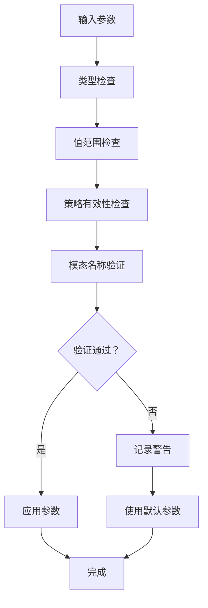
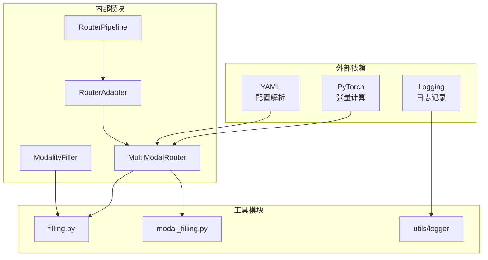

# 运行时参数管理

<cite>
**本文档引用的文件**
- [router.py](file://ultralytics/nn/mm/router.py)
- [router_adapter.py](file://ultralytics/models/utils/multimodal/visualize_core/router_adapter.py)
- [filling.py](file://ultralytics/nn/mm/filling.py)
- [modal_filling.py](file://ultralytics/models/yolo/multimodal/modal_filling.py)
- [pipeline.py](file://ultralytics/models/yolo/multimodal/visualize/pipeline.py)
- [args.yaml](file://ResTest/aifi-dattention-CSP-MutilScaleEdgeInformationEnhance-ASF-P2-lite/args.yaml)
- [trainer.py](file://ultralytics/engine/trainer.py)
</cite>

## 目录
1. [简介](#简介)
2. [项目结构](#项目结构)
3. [核心组件](#核心组件)
4. [架构概览](#架构概览)
5. [详细组件分析](#详细组件分析)
6. [依赖关系分析](#依赖关系分析)
7. [性能考虑](#性能考虑)
8. [故障排除指南](#故障排除指南)
9. [结论](#结论)
10. [附录](#附录)

## 简介

运行时参数管理系统是多模态视觉模型的核心控制机制，负责在模型推理过程中动态管理模态选择、填充策略和随机种子等关键参数。该系统通过MultiModalRouter组件实现了灵活的运行时配置管理，支持RGB+X双模态数据的实时路由和转换。

本系统的主要功能包括：
- **模态选择管理**：支持自动模式、双模态模式和指定模态的动态切换
- **填充策略控制**：提供多种模态填充策略的随机选择和权重配置
- **向后兼容性**：确保旧版本检查点的兼容性和渐进式升级
- **参数优先级处理**：实现配置参数与运行时参数的层次化管理

## 项目结构

运行时参数管理系统主要分布在以下模块中：



**图表来源**
- [router.py:11-471](file://ultralytics/nn/mm/router.py#L11-L471)
- [router_adapter.py:18-103](file://ultralytics/models/utils/multimodal/visualize_core/router_adapter.py#L18-L103)
- [filling.py:14-175](file://ultralytics/nn/mm/filling.py#L14-L175)

**章节来源**
- [router.py:11-471](file://ultralytics/nn/mm/router.py#L11-L471)
- [router_adapter.py:18-103](file://ultralytics/models/utils/multimodal/visualize_core/router_adapter.py#L18-L103)
- [filling.py:14-175](file://ultralytics/nn/mm/filling.py#L14-L175)

## 核心组件

### MultiModalRouter 主路由器

MultiModalRouter是运行时参数管理的核心组件，负责处理所有模态相关的运行时配置。其关键特性包括：

- **运行时参数存储**：维护`runtime_modality`、`runtime_strategy`和`runtime_seed`三个核心参数
- **向后兼容性**：通过`__setstate__`方法确保旧版本检查点的兼容性
- **动态路由**：根据输入张量的通道数自动检测模态模式

### RouterAdapter 适配器

RouterAdapter提供了安全的路由器访问接口，采用Fail-Fast策略确保错误不会被静默处理：

- **规范化处理**：将'auto'/'dual'/'rgb'/'x'等输入标准化为内部表示
- **错误隔离**：捕获并记录异常，避免影响主流程
- **状态跟踪**：维护最后一次模态设置的状态信息

### ModalityFiller 填充器

ModalityFiller实现了多种模态填充策略，支持随机策略选择和权重配置：

- **策略权重系统**：默认提供copy(0.3)、noise(0.25)、channel_repeat(0.2)、edge_blur(0.15)、mixed(0.1)五种策略
- **通道适配**：支持RGB(3通道)与X模态(任意通道数)之间的智能转换
- **确定性支持**：可通过设置随机种子实现可重现的结果

**章节来源**
- [router.py:64-89](file://ultralytics/nn/mm/router.py#L64-L89)
- [router_adapter.py:49-70](file://ultralytics/models/utils/multimodal/visualize_core/router_adapter.py#L49-L70)
- [filling.py:21-50](file://ultralytics/nn/mm/filling.py#L21-L50)

## 架构概览

运行时参数管理系统的整体架构如下：



**图表来源**
- [router_adapter.py:49-70](file://ultralytics/models/utils/multimodal/visualize_core/router_adapter.py#L49-L70)
- [router.py:64-68](file://ultralytics/nn/mm/router.py#L64-L68)
- [filling.py:35-49](file://ultralytics/nn/mm/filling.py#L35-L49)

## 详细组件分析

### set_runtime_params 方法实现

set_runtime_params方法是运行时参数管理的核心入口，实现了参数的设置和验证：



**图表来源**
- [router.py:64-68](file://ultralytics/nn/mm/router.py#L64-L68)

该方法的实现特点：
- **参数规范化**：将字符串参数转换为小写形式
- **类型安全**：确保只有有效的字符串参数才会被处理
- **状态同步**：立即更新路由器的运行时状态

**章节来源**
- [router.py:64-68](file://ultralytics/nn/mm/router.py#L64-L68)

### 运行时参数与配置参数的关系

运行时参数与配置参数之间存在清晰的层次关系：



**图表来源**
- [router.py:31-62](file://ultralytics/nn/mm/router.py#L31-L62)
- [router.py:406-447](file://ultralytics/nn/mm/router.py#L406-L447)

### 参数优先级处理机制

系统实现了多层级的参数优先级处理：

1. **运行时参数优先级最高**：set_runtime_params设置的参数会覆盖配置参数
2. **配置参数作为默认值**：当运行时参数未设置时，使用配置参数
3. **向后兼容性保证**：旧版本检查点自动获得默认参数

### 向后兼容性支持

为了确保系统的向后兼容性，MultiModalRouter实现了以下机制：

- **属性检查**：通过`_ensure_runtime_defaults`方法确保必要属性存在
- **状态恢复**：`__setstate__`方法处理pickle反序列化后的状态恢复
- **渐进式升级**：新版本功能可以安全地添加到旧版本对象上

**章节来源**
- [router.py:71-88](file://ultralytics/nn/mm/router.py#L71-L88)
- [router.py:81-88](file://ultralytics/nn/mm/router.py#L81-L88)

### 参数验证机制

系统实现了多层次的参数验证：



**图表来源**
- [router_adapter.py:62-66](file://ultralytics/models/utils/multimodal/visualize_core/router_adapter.py#L62-L66)

**章节来源**
- [router_adapter.py:62-70](file://ultralytics/models/utils/multimodal/visualize_core/router_adapter.py#L62-L70)

### 运行时参数在不同训练阶段的应用场景

运行时参数在不同训练阶段具有不同的应用场景：

| 训练阶段 | 应用场景 | 参数设置 | 影响范围 |
|---------|---------|---------|---------|
| 数据加载 | 模态预处理 | `runtime_modality` | 数据预处理管道 |
| 模型训练 | 动态模态切换 | `runtime_strategy` | 训练过程中的数据增强 |
| 模型推理 | 实时模态选择 | `runtime_seed` | 推理结果的可重现性 |
| 模型导出 | 固化参数配置 | 配置文件保存 | 导出模型的行为 |

**章节来源**
- [args.yaml:108-135](file://ResTest/aifi-dattention-CSP-MutilScaleEdgeInformationEnhance-ASF-P2-lite/args.yaml#L108-L135)

## 依赖关系分析

运行时参数管理系统的关键依赖关系如下：



**图表来源**
- [router.py:5-8](file://ultralytics/nn/mm/router.py#L5-L8)
- [router_adapter.py:12-15](file://ultralytics/models/utils/multimodal/visualize_core/router_adapter.py#L12-L15)

**章节来源**
- [router.py:5-8](file://ultralytics/nn/mm/router.py#L5-L8)
- [router_adapter.py:12-15](file://ultralytics/models/utils/multimodal/visualize_core/router_adapter.py#L12-L15)

## 性能考虑

运行时参数管理系统在设计时充分考虑了性能因素：

### 内存优化
- **零拷贝路由**：通过张量视图实现高效的内存共享
- **缓存机制**：使用`original_inputs`缓存原始输入，避免重复计算
- **惰性导入**：填充策略中的随机模块仅在需要时导入

### 计算效率
- **快速路径**：对于简单的模态选择，避免不必要的计算
- **批量处理**：支持批量张量的高效处理
- **确定性优化**：可选的确定性模式减少随机性开销

### 并发安全
- **线程安全**：参数设置操作是原子性的
- **状态隔离**：不同实例间的参数状态相互独立

## 故障排除指南

### 常见问题及解决方案

| 问题类型 | 症状 | 可能原因 | 解决方案 |
|---------|------|---------|---------|
| 参数设置失败 | `set_runtime_params`抛出异常 | 无效的模态参数 | 检查参数格式和值范围 |
| 路由错误 | 模型输出异常 | 模态配置不匹配 | 验证X模态通道数设置 |
| 填充质量差 | 生成的模态数据质量低 | 策略权重不合理 | 调整策略权重分布 |
| 性能问题 | 推理速度慢 | 随机种子未设置 | 设置固定随机种子提高可重现性 |

### 调试技巧

1. **启用详细日志**：设置`verbose=True`获取详细的路由信息
2. **参数验证**：使用`LOGGER.warning`输出当前参数状态
3. **中间结果检查**：通过`get_original_x_input`检查X模态输入
4. **性能监控**：利用`profile`参数监控路由性能

**章节来源**
- [router.py:59-62](file://ultralytics/nn/mm/router.py#L59-L62)
- [router_adapter.py:98-102](file://ultralytics/models/utils/multimodal/visualize_core/router_adapter.py#L98-L102)

## 结论

运行时参数管理系统通过MultiModalRouter实现了灵活而强大的模态管理能力。系统的设计充分考虑了以下关键要素：

- **灵活性**：支持动态参数调整和实时模态切换
- **兼容性**：确保向后兼容性和渐进式升级
- **性能**：通过零拷贝和缓存机制优化运行时性能
- **可靠性**：完善的参数验证和错误处理机制

该系统为多模态视觉任务提供了坚实的基础，支持从基础的RGB模态到复杂的RGB+X双模态场景的各种需求。

## 附录

### 配置示例

以下是一个典型的运行时参数配置示例：

```yaml
# 运行时参数配置示例
mm_project_version: '0.1225'
modality: null
use_multimodal_aug: true
mm_rgb_albu_enable: true
mm_modal_dropout_p: 0.0
mm_modal_dropout_target: x
mm_modal_dropout_fill: zero
```

### 最佳实践建议

1. **参数设置时机**：在模型初始化后、数据加载前设置运行时参数
2. **策略权重调优**：根据具体任务调整填充策略权重
3. **性能监控**：定期检查路由性能和内存使用情况
4. **版本管理**：注意向后兼容性，避免破坏旧版本检查点
5. **错误处理**：实现适当的异常处理和降级策略