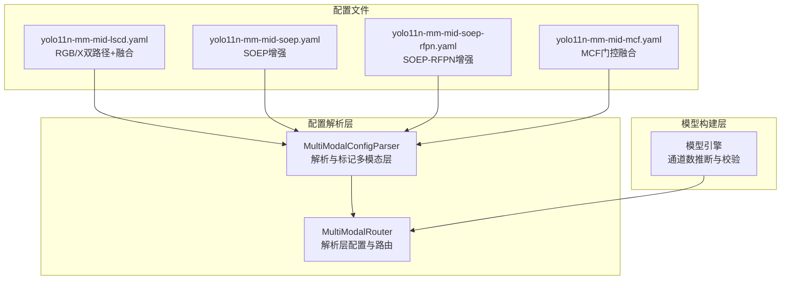
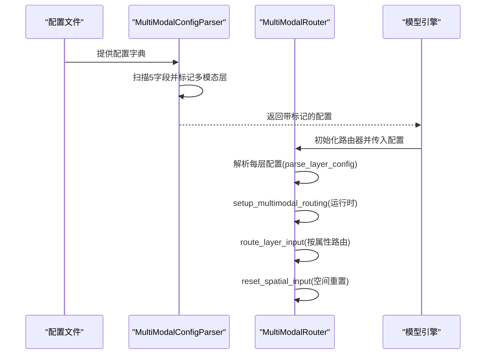
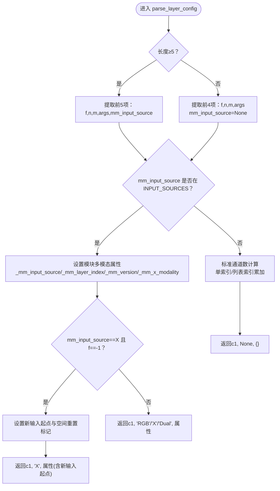
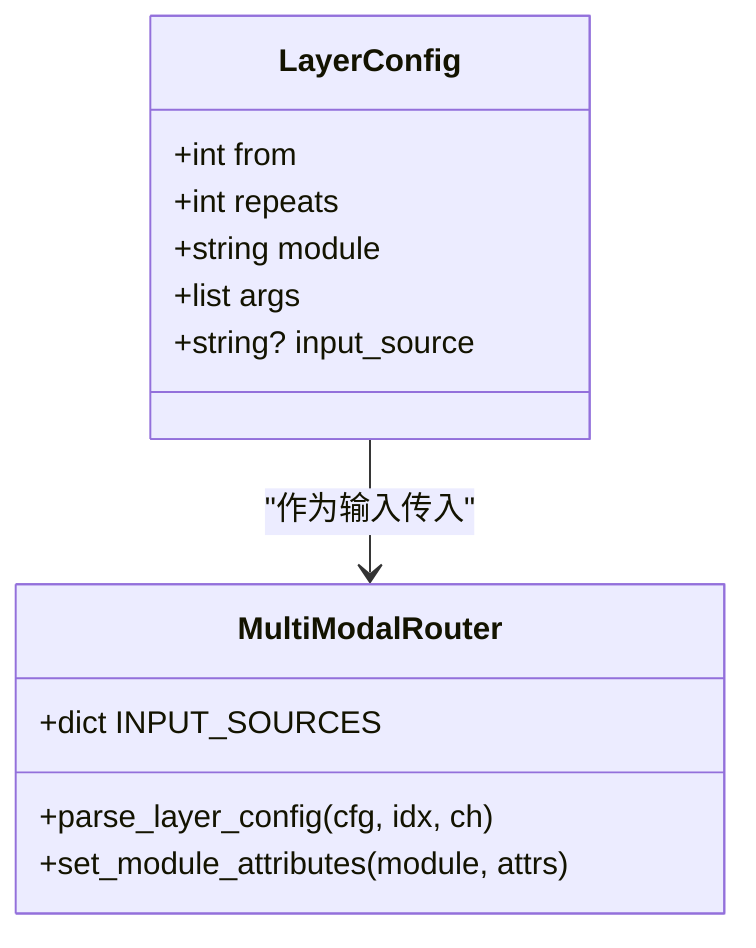
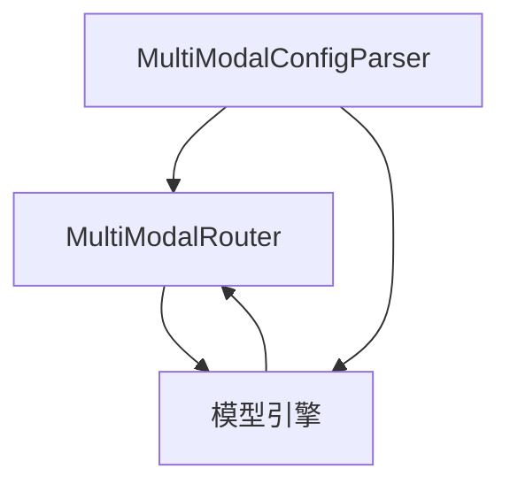

# 配置解析系统

<cite>
**本文档引用的文件**
- [router.py](file://ultralytics/nn/mm/router.py)
- [parser.py](file://ultralytics/nn/mm/parser.py)
- [model.py](file://ultralytics/engine/model.py)
- [yolo11n-mm-mid-lscd.yaml](file://ultralytics/cfg/models/mm/Head/yolo11n-mm-mid-lscd.yaml)
- [yolo11n-mm-mid-soep.yaml](file://ultralytics/cfg/models/mm/Neck/yolo11n-mm-mid-soep.yaml)
- [yolo11n-mm-mid-soep-rfpn.yaml](file://ultralytics/cfg/models/mm/Neck/yolo11n-mm-mid-soep-rfpn.yaml)
- [yolo11n-mm-mid-mcf.yaml](file://ultralytics/cfg/models/mm/Neck/yolo11n-mm-mid-mcf.yaml)
</cite>

## 目录
1. [简介](#简介)
2. [项目结构](#项目结构)
3. [核心组件](#核心组件)
4. [架构总览](#架构总览)
5. [详细组件分析](#详细组件分析)
6. [依赖关系分析](#依赖关系分析)
7. [性能考虑](#性能考虑)
8. [故障排除指南](#故障排除指南)
9. [结论](#结论)
10. [附录](#附录)

## 简介
本文件聚焦于多模态配置解析系统，重点阐述 MultiModalRouter 如何解析和处理配置文件中的5通道配置字段，特别是 parse_layer_config 方法的工作原理。文档还对比了标准4字段配置与扩展5字段配置的区别，解释如何识别和处理不同的模态路由标识符（RGB/X/Dual），以及通道数计算、模块属性设置与运行时参数注入机制。最后提供配置文件示例、解析流程图与常见配置错误的诊断方法。

## 项目结构
多模态配置解析系统主要由以下模块组成：
- MultiModalRouter：负责解析层配置、设置模块属性、初始化多模态输入源、路由层输入与空间重置。
- MultiModalConfigParser：负责检测并标记配置中的多模态层，提取多模态信息，解析hook字段。
- 模型引擎：在模型构建阶段根据模态与通道数进行自动推断与校验。
- 配置文件：以 YAML 形式定义骨干网与头部网络，其中通过第5个字段指定模态路由标识符（RGB/X/Dual）。

**图表来源**
- [parser.py:67-86](file://ultralytics/nn/mm/parser.py#L67-L86)
- [router.py:90-155](file://ultralytics/nn/mm/router.py#L90-L155)
- [model.py:1245-1274](file://ultralytics/engine/model.py#L1245-L1274)

**章节来源**
- [router.py:1-471](file://ultralytics/nn/mm/router.py#L1-L471)
- [parser.py:1-198](file://ultralytics/nn/mm/parser.py#L1-L198)
- [model.py:1245-1274](file://ultralytics/engine/model.py#L1245-L1274)

## 核心组件
- MultiModalRouter.parse_layer_config：解析单层配置，支持标准4字段与扩展5字段（模态路由标识符）。当存在5字段且为RGB/X/Dual之一时，重定向输入通道数，并为模块设置多模态属性（如来源、层索引、版本、X模态类型等）。若X模态且from=-1，则标记为新输入起点并设置空间重置。
- MultiModalRouter.setup_multimodal_routing：基于输入张量通道数判断是否启用多模态路由，按RGB/X/Dual三种模式切分或拼接输入，并缓存原始输入以便后续空间重置。
- MultiModalRouter.route_layer_input/reset_spatial_input：根据模块的多模态属性进行路由与空间重置，确保X模态新输入起点的正确性。
- MultiModalConfigParser.parse_config/validate_config_format：扫描配置中的5字段，标记多模态层，统计RGB/X/Dual路由层数量，辅助构建最小化多模态配置字典。
- 模型引擎通道推断：在未显式传入channels时，依据模态（auto/Dual/RGB/X）与路由器的INPUT_SOURCES自动推断通道数，否则进行有效性校验。

**章节来源**
- [router.py:90-155](file://ultralytics/nn/mm/router.py#L90-L155)
- [router.py:157-240](file://ultralytics/nn/mm/router.py#L157-L240)
- [router.py:242-404](file://ultralytics/nn/mm/router.py#L242-L404)
- [parser.py:67-86](file://ultralytics/nn/mm/parser.py#L67-L86)
- [parser.py:20-46](file://ultralytics/nn/mm/parser.py#L20-L46)
- [model.py:1245-1274](file://ultralytics/engine/model.py#L1245-L1274)

## 架构总览
多模态配置解析的端到端流程如下：
- 解析器扫描配置，识别5字段多模态路由标记，生成has_multimodal_layers与input_layers标记。
- 构建阶段调用parse_layer_config，对每层配置进行解析：若为RGB/X/Dual则设置模块多模态属性并重定向通道数；否则按标准逻辑计算通道数。
- 运行时setup_multimodal_routing根据输入张量通道数与配置标记决定是否启用多模态路由，并缓存原始输入。
- 前向传播时route_layer_input根据模块属性进行路由，必要时reset_spatial_input进行空间重置。

**图表来源**
- [parser.py:67-86](file://ultralytics/nn/mm/parser.py#L67-L86)
- [router.py:90-155](file://ultralytics/nn/mm/router.py#L90-L155)
- [router.py:157-240](file://ultralytics/nn/mm/router.py#L157-L240)
- [router.py:242-404](file://ultralytics/nn/mm/router.py#L242-L404)

## 详细组件分析

### MultiModalRouter.parse_layer_config 工作原理
该方法是配置解析的核心，负责：
- 解析标准4字段配置（from, repeats, module, args），以及可选的第5字段（模态路由标识符）。
- 若第5字段为RGB/X/Dual之一：
  - 使用INPUT_SOURCES映射重定向输入通道数。
  - 为模块设置多模态属性：_mm_input_source、_mm_layer_index、_mm_version、_mm_x_modality。
  - 若为X模态且from=-1，额外设置新输入起点与空间重置标记。
- 否则按标准逻辑处理：单索引或列表索引，计算来自上游层的总通道数。

**图表来源**
- [router.py:90-155](file://ultralytics/nn/mm/router.py#L90-L155)

**章节来源**
- [router.py:90-155](file://ultralytics/nn/mm/router.py#L90-L155)

### 标准4字段 vs 扩展5字段配置
- 标准4字段：兼容旧版配置，仅包含输入来源索引、重复次数、模块类型与参数，通道数按上游输出通道累加计算。
- 扩展5字段：新增模态路由标识符（RGB/X/Dual），用于明确指示当前层应从哪个模态输入，同时触发模块属性设置与通道数重定向。

**图表来源**
- [router.py:90-155](file://ultralytics/nn/mm/router.py#L90-L155)

**章节来源**
- [router.py:90-155](file://ultralytics/nn/mm/router.py#L90-L155)

### 模态路由标识符识别与处理
- 支持的标识符：RGB（固定3通道）、X（可配置通道数，来源于dataset_config中的Xch）、Dual（RGB+X拼接，通道数=3+Xch）。
- 识别逻辑：解析器扫描配置，若某层第5字段为RGB/X/Dual之一，则标记该层为多模态路由层。
- 处理逻辑：parse_layer_config根据标识符设置模块属性，并在setup_multimodal_routing中按RGB/X/Dual模式切分或拼接输入。

**章节来源**
- [parser.py:17-18](file://ultralytics/nn/mm/parser.py#L17-L18)
- [parser.py:76-86](file://ultralytics/nn/mm/parser.py#L76-L86)
- [router.py:41-45](file://ultralytics/nn/mm/router.py#L41-L45)
- [router.py:112-141](file://ultralytics/nn/mm/router.py#L112-L141)

### 通道数计算与模块属性设置
- 通道数计算：
  - 标准模式：若from为列表，通道数为对应上游层通道之和；若from为单值，通道数为对应层通道（from=-1时取最后一层通道）。
  - 多模态模式：若第5字段为RGB/X/Dual，通道数直接取INPUT_SOURCES映射值。
- 模块属性设置：
  - _mm_input_source：路由来源（RGB/X/Dual）。
  - _mm_layer_index：所在层索引。
  - _mm_version：多模态版本标识。
  - _mm_x_modality：X模态类型（如ir/depth等）。
  - _mm_new_input_start/_mm_spatial_reset：X模态新输入起点与空间重置标记。

**章节来源**
- [router.py:144-154](file://ultralytics/nn/mm/router.py#L144-L154)
- [router.py:118-123](file://ultralytics/nn/mm/router.py#L118-L123)
- [router.py:126-133](file://ultralytics/nn/mm/router.py#L126-L133)

### 运行时参数注入机制
- set_runtime_params：设置运行时模态（rgb/x）、策略与随机种子，影响setup_multimodal_routing中的填充与拼接顺序。
- setup_multimodal_routing：根据输入张量通道数与运行时模态，决定是否启用多模态路由，并生成RGB/X/Dual三种输入视图。
- route_layer_input/reset_spatial_input：在前向过程中按模块属性进行路由与空间重置，确保X模态新输入起点的正确性。

**章节来源**
- [router.py:64-68](file://ultralytics/nn/mm/router.py#L64-L68)
- [router.py:157-240](file://ultralytics/nn/mm/router.py#L157-L240)
- [router.py:242-404](file://ultralytics/nn/mm/router.py#L242-L404)

### 配置文件示例与字段说明
以下示例展示了5字段配置在不同架构中的应用：

- 标准中期融合（RGB/X双路径+融合）：
  - 第5字段使用 'RGB'/'X' 明确指定路径来源。
  - 示例路径：[yolo11n-mm-mid-lscd.yaml:21-21](file://ultralytics/cfg/models/mm/Head/yolo11n-mm-mid-lscd.yaml#L21-L21)、[yolo11n-mm-mid-lscd.yaml:33-33](file://ultralytics/cfg/models/mm/Head/yolo11n-mm-mid-lscd.yaml#L33-L33)

- SOEP增强（小目标增强金字塔）：
  - 在head中对P3层进行增强，仍使用RGB/X双路径。
  - 示例路径：[yolo11n-mm-mid-soep.yaml:74-75](file://ultralytics/cfg/models/mm/Neck/yolo11n-mm-mid-soep.yaml#L74-L75)

- SOEP-RFPN增强（结合RFPN技术）：
  - 在上采样与下采样中引入SNI/GSConvE等增强模块。
  - 示例路径：[yolo11n-mm-mid-soep-rfpn.yaml:73-76](file://ultralytics/cfg/models/mm/Neck/yolo11n-mm-mid-soep-rfpn.yaml#L73-L76)

- MCF门控融合：
  - 在P4/P5融合处使用MCFGatedFusion实现门控补偿。
  - 示例路径：[yolo11n-mm-mid-mcf.yaml:43-47](file://ultralytics/cfg/models/mm/Neck/yolo11n-mm-mid-mcf.yaml#L43-L47)

**章节来源**
- [yolo11n-mm-mid-lscd.yaml:21-21](file://ultralytics/cfg/models/mm/Head/yolo11n-mm-mid-lscd.yaml#L21-L21)
- [yolo11n-mm-mid-lscd.yaml:33-33](file://ultralytics/cfg/models/mm/Head/yolo11n-mm-mid-lscd.yaml#L33-L33)
- [yolo11n-mm-mid-soep.yaml:74-75](file://ultralytics/cfg/models/mm/Neck/yolo11n-mm-mid-soep.yaml#L74-L75)
- [yolo11n-mm-mid-soep-rfpn.yaml:73-76](file://ultralytics/cfg/models/mm/Neck/yolo11n-mm-mid-soep-rfpn.yaml#L73-L76)
- [yolo11n-mm-mid-mcf.yaml:43-47](file://ultralytics/cfg/models/mm/Neck/yolo11n-mm-mid-mcf.yaml#L43-L47)

## 依赖关系分析
- MultiModalConfigParser 依赖于配置字典中的backbone与head段，扫描第5字段以检测多模态层。
- MultiModalRouter 依赖于INPUT_SOURCES（由dataset_config中的Xch与x_modality决定），并在运行时根据输入张量通道数与配置标记启用多模态路由。
- 模型引擎在构建阶段根据传入的modality与channels进行通道数推断与校验，若未显式传入则尝试从路由器的INPUT_SOURCES自动推断。

**图表来源**
- [parser.py:76-86](file://ultralytics/nn/mm/parser.py#L76-L86)
- [router.py:41-45](file://ultralytics/nn/mm/router.py#L41-L45)
- [model.py:1245-1274](file://ultralytics/engine/model.py#L1245-L1274)

**章节来源**
- [parser.py:67-86](file://ultralytics/nn/mm/parser.py#L67-L86)
- [router.py:41-45](file://ultralytics/nn/mm/router.py#L41-L45)
- [model.py:1245-1274](file://ultralytics/engine/model.py#L1245-L1274)

## 性能考虑
- 零拷贝张量视图：setup_multimodal_routing通过切片生成RGB/X视图，避免数据复制，提高运行时效率。
- 动态通道适配：adapt_xch与generate_modality_filling在运行时按需调整通道数与填充策略，保证输入一致性。
- 日志与调试：verbose与profile参数可用于定位性能瓶颈与路由异常。

## 故障排除指南
- 通道数不匹配：
  - 症状：X模态新输入起点期望通道数与实际不符。
  - 处理：检查dataset_config中的Xch与x_modality，确认INPUT_SOURCES映射正确。
  - 参考：[router.py:278-287](file://ultralytics/nn/mm/router.py#L278-L287)
- 模块属性缺失：
  - 症状：route_layer_input返回None，提示输入源不可用或请求的模态不存在。
  - 处理：确认配置中第5字段标识符有效，且模块已通过set_module_attributes设置多模态属性。
  - 参考：[router.py:255-301](file://ultralytics/nn/mm/router.py#L255-L301)
- 空间重置失败：
  - 症状：空间重置失败提示缺少X模态输入源或无法获取原始尺寸。
  - 处理：确保setup_multimodal_routing已成功缓存原始输入，并在reset_spatial_input中验证original_spatial_size。
  - 参考：[router.py:382-395](file://ultralytics/nn/mm/router.py#L382-L395)
- 模态推断错误：
  - 症状：channels未显式传入时抛出异常，提示未检测到多模态路由器。
  - 处理：显式传入channels或选择modality='RGB'；或确保路由器已正确初始化INPUT_SOURCES。
  - 参考：[model.py:1250-1254](file://ultralytics/engine/model.py#L1250-L1254)

**章节来源**
- [router.py:255-301](file://ultralytics/nn/mm/router.py#L255-L301)
- [router.py:382-395](file://ultralytics/nn/mm/router.py#L382-L395)
- [model.py:1250-1254](file://ultralytics/engine/model.py#L1250-L1254)

## 结论
MultiModalRouter通过扩展5字段配置实现了灵活的多模态路由控制，parse_layer_config方法在解析层配置时既保持向后兼容，又引入了强大的模态标识符与属性注入机制。配合MultiModalConfigParser的配置扫描与标记，以及模型引擎的通道数推断，系统能够在构建与运行时高效、准确地处理RGB/X/Dual多模态数据流。遵循本文档的配置示例与排错建议，可显著提升多模态模型的可维护性与稳定性。

## 附录
- 配置文件示例路径：
  - [yolo11n-mm-mid-lscd.yaml:21-21](file://ultralytics/cfg/models/mm/Head/yolo11n-mm-mid-lscd.yaml#L21-L21)
  - [yolo11n-mm-mid-soep.yaml:74-75](file://ultralytics/cfg/models/mm/Neck/yolo11n-mm-mid-soep.yaml#L74-L75)
  - [yolo11n-mm-mid-soep-rfpn.yaml:73-76](file://ultralytics/cfg/models/mm/Neck/yolo11n-mm-mid-soep-rfpn.yaml#L73-L76)
  - [yolo11n-mm-mid-mcf.yaml:43-47](file://ultralytics/cfg/models/mm/Neck/yolo11n-mm-mid-mcf.yaml#L43-L47)