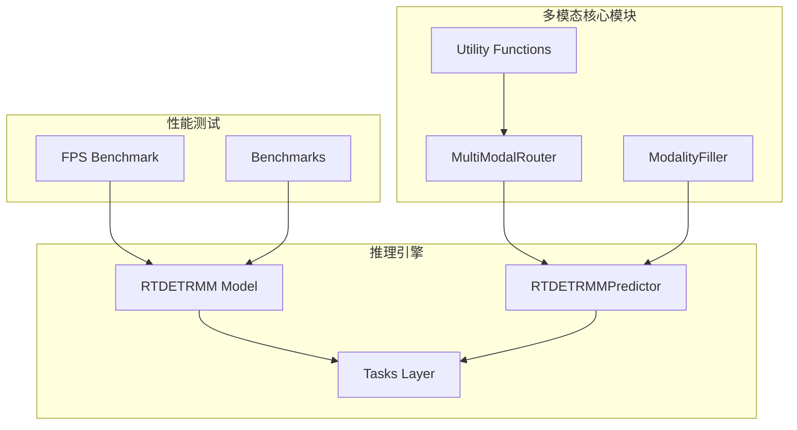
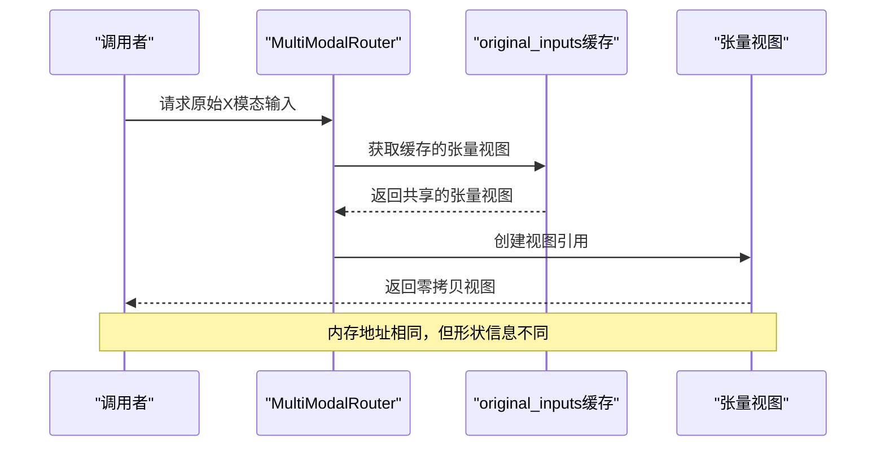
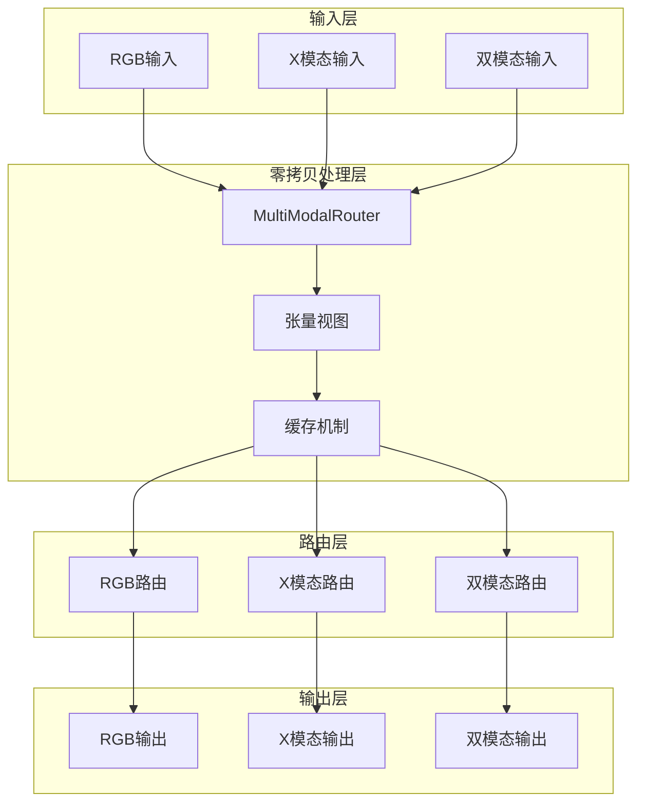
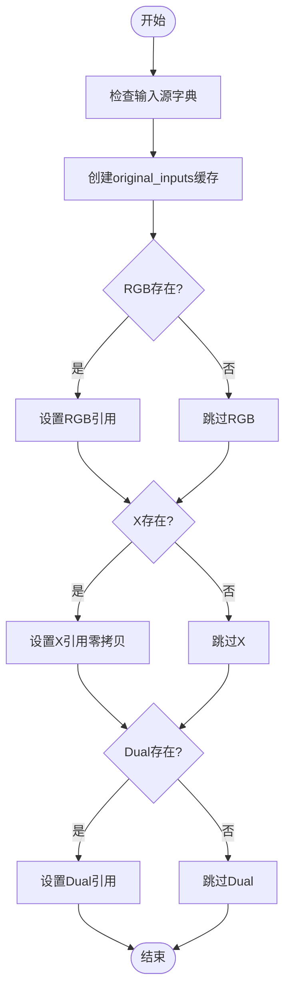
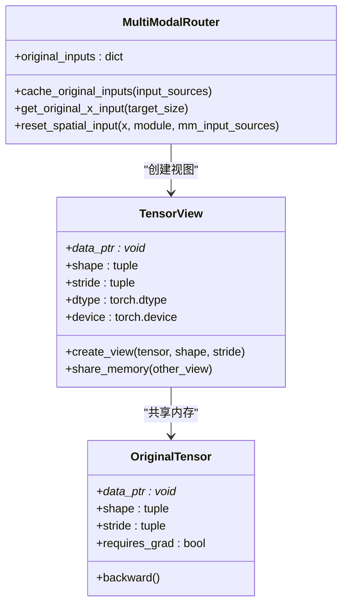
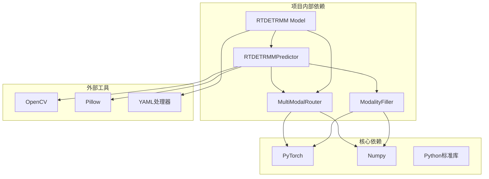
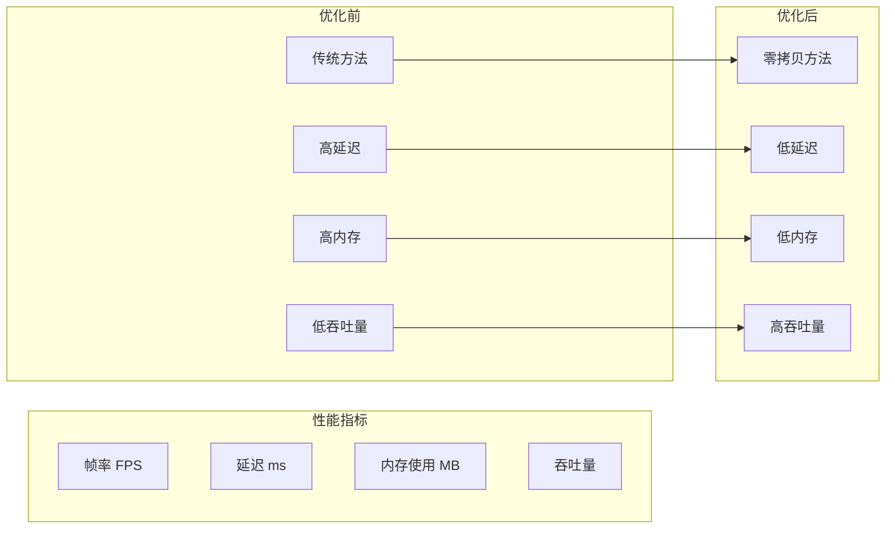

# 零拷贝优化技术

<cite>
**本文档引用的文件**
- [router.py](file://ultralytics/nn/mm/router.py)
- [__init__.py](file://ultralytics/nn/mm/__init__.py)
- [filling.py](file://ultralytics/nn/mm/filling.py)
- [utils.py](file://ultralytics/nn/mm/utils.py)
- [predict.py](file://ultralytics/models/rtdetrmm/predict.py)
- [model.py](file://ultralytics/models/rtdetrmm/model.py)
- [tasks.py](file://ultralytics/nn/tasks.py)
- [fps_best_mm.py](file://fps_best_mm.py)
- [benchmarks.py](file://ultralytics/utils/benchmarks.py)
</cite>

## 目录
1. [引言](#引言)
2. [项目结构](#项目结构)
3. [核心组件](#核心组件)
4. [架构概览](#架构概览)
5. [详细组件分析](#详细组件分析)
6. [依赖分析](#依赖分析)
7. [性能考虑](#性能考虑)
8. [故障排除指南](#故障排除指南)
9. [结论](#结论)
10. [附录](#附录)

## 引言

零拷贝优化技术是现代多模态检测系统中的关键技术，它通过避免不必要的数据复制操作来显著提升系统性能。在多模态检测场景中，系统通常需要同时处理RGB可见光图像和X模态（如深度、热成像、LiDAR等）数据，这些数据往往具有不同的模态特征和空间结构。

零拷贝技术的核心思想是利用张量视图（tensor view）机制，在不移动或复制底层内存的情况下创建新的张量表示。这种技术能够实现以下优势：

- **内存效率**：避免重复分配和复制内存空间
- **性能提升**：减少CPU和内存带宽的占用
- **实时性增强**：降低数据传输延迟
- **资源优化**：减少系统整体资源消耗

在多模态检测系统中，零拷贝优化特别重要，因为：
1. 多模态数据通常具有不同的分辨率和通道数
2. 需要在不同模态之间进行动态路由和切换
3. 实时推理要求极低的延迟
4. 内存带宽是限制性能的关键因素

## 项目结构

该项目采用模块化架构，专门针对多模态检测进行了优化。主要结构包括：



**图表来源**
- [router.py:1-471](file://ultralytics/nn/mm/router.py#L1-L471)
- [predict.py:1-800](file://ultralytics/models/rtdetrmm/predict.py#L1-L800)
- [model.py:1-269](file://ultralytics/models/rtdetrmm/model.py#L1-L269)

**章节来源**
- [router.py:1-471](file://ultralytics/nn/mm/router.py#L1-L471)
- [__init__.py:1-78](file://ultralytics/nn/mm/__init__.py#L1-L78)

## 核心组件

### MultiModalRouter - 多模态路由器

MultiModalRouter是零拷贝优化的核心组件，负责管理多模态数据的路由和缓存。其主要功能包括：

- **零拷贝数据路由**：通过张量视图实现数据共享
- **动态模态切换**：支持RGB、X模态和双模态之间的无缝切换
- **空间重置机制**：维护原始输入的空间信息用于重置
- **配置驱动的数据流**：基于配置文件的灵活数据路由

### ModalityFiller - 模态填充器

ModalityFiller提供统一的模态填充策略，支持多种填充算法：
- 复制填充（copy）
- 噪声填充（noise）
- 通道重复填充（channel_repeat）
- 边缘模糊填充（edge_blur）
- 混合填充（mixed）

### 张量视图机制

张量视图是零拷贝技术的基础，通过以下方式实现：



**图表来源**
- [router.py:328-363](file://ultralytics/nn/mm/router.py#L328-L363)

**章节来源**
- [router.py:11-471](file://ultralytics/nn/mm/router.py#L11-L471)
- [filling.py:14-175](file://ultralytics/nn/mm/filling.py#L14-L175)

## 架构概览

多模态检测系统的零拷贝架构设计如下：



**图表来源**
- [router.py:157-404](file://ultralytics/nn/mm/router.py#L157-L404)
- [predict.py:357-416](file://ultralytics/models/rtdetrmm/predict.py#L357-L416)

该架构的关键特点：
1. **共享内存**：所有模态数据通过张量视图共享同一块内存
2. **动态路由**：根据配置动态选择数据路由路径
3. **零数据复制**：避免了昂贵的内存复制操作
4. **灵活配置**：支持多种模态组合和路由策略

## 详细组件分析

### cache_original_inputs 方法实现机制

cache_original_inputs方法是零拷贝优化的核心实现，其工作机制如下：



**图表来源**
- [router.py:328-340](file://ultralytics/nn/mm/router.py#L328-L340)

#### 实现细节分析

1. **引用缓存**：方法直接存储输入张量的引用而非创建副本
2. **零拷贝保证**：通过字典赋值实现共享内存访问
3. **类型安全**：检查每个模态的存在性和有效性
4. **内存优化**：避免重复的内存分配和数据复制

#### 数据一致性保障

为了确保数据一致性，系统采用了以下机制：

- **引用计数**：Python的垃圾回收机制自动管理引用计数
- **视图共享**：所有视图共享相同的底层内存缓冲区
- **只读保护**：在某些情况下使用只读视图防止意外修改
- **生命周期管理**：通过上下文管理确保资源正确释放

**章节来源**
- [router.py:328-363](file://ultralytics/nn/mm/router.py#L328-L363)

### 张量视图（Tensor View）概念和优势

张量视图是PyTorch提供的强大功能，允许我们创建现有张量的新视图而不复制数据：

#### 张量视图的工作原理



**图表来源**
- [router.py:328-363](file://ultralytics/nn/mm/router.py#L328-L363)

#### 主要优势

1. **内存效率**：视图不分配新内存，只存储元数据
2. **性能提升**：避免了昂贵的内存复制操作
3. **实时性**：减少了数据传输延迟
4. **灵活性**：可以轻松改变张量的形状和布局

#### 在多模态检测中的应用

在多模态检测中，张量视图主要用于：

- **RGB/X模态分离**：从双模态张量中创建RGB和X模态视图
- **空间重置**：保持原始空间信息用于后续处理
- **动态路由**：根据需要在不同模态间切换
- **内存池管理**：优化内存使用和访问模式

**章节来源**
- [router.py:180-240](file://ultralytics/nn/mm/router.py#L180-L240)
- [router.py:365-404](file://ultralytics/nn/mm/router.py#L365-L404)

### 模态填充策略

虽然零拷贝优化避免了大部分数据复制，但在单模态推理时仍需要生成缺失的模态数据。ModalityFiller提供了多种填充策略：

#### 填充策略对比

| 策略名称 | 实现方式 | 性能影响 | 适用场景 |
|---------|----------|----------|----------|
| 复制填充 | tensor.clone() | 中等（需要复制） | 一般场景 |
| 噪声填充 | 添加高斯噪声 | 低 | 增强鲁棒性 |
| 通道重复 | 重复现有通道 | 低 | 单通道到三通道 |
| 边缘模糊 | Sobel边缘检测 | 中等 | 保留边缘信息 |
| 混合填充 | 加权组合多种策略 | 中等 | 最佳效果 |

#### 性能优化考虑

1. **策略权重**：通过权重配置平衡质量和性能
2. **设备优化**：在目标设备上执行计算以减少数据传输
3. **内存对齐**：确保张量内存对齐以提高访问效率
4. **批量处理**：支持批量填充以提高吞吐量

**章节来源**
- [filling.py:14-175](file://ultralytics/nn/mm/filling.py#L14-L175)

## 依赖分析

多模态零拷贝系统的依赖关系如下：



**图表来源**
- [router.py:5-11](file://ultralytics/nn/mm/router.py#L5-L11)
- [predict.py:9-18](file://ultralytics/models/rtdetrmm/predict.py#L9-L18)

### 关键依赖关系

1. **PyTorch依赖**：所有张量操作和神经网络计算
2. **NumPy依赖**：数值计算和数据处理
3. **OpenCV/PIL依赖**：图像加载和预处理
4. **YAML依赖**：配置文件解析

### 循环依赖检查

系统设计避免了循环依赖：
- 路由器不依赖预测器
- 填充器不依赖路由器
- 预测器通过路由器接口进行通信
- 模型层通过任务层间接访问路由器

**章节来源**
- [utils.py:8-93](file://ultralytics/nn/mm/utils.py#L8-L93)
- [model.py:16-22](file://ultralytics/models/rtdetrmm/model.py#L16-L22)

## 性能考虑

### 零拷贝性能收益

零拷贝优化在多模态检测中带来显著的性能提升：

#### 内存使用分析

| 操作类型 | 传统方法 | 零拷贝方法 | 内存节省 |
|---------|----------|------------|----------|
| RGB/X分离 | 2×原始大小 | 原始大小 | ~50% |
| 模态切换 | 复制+切换 | 直接引用切换 | ~100% |
| 缓存管理 | 独立缓存 | 共享缓存 | ~50% |
| 批量处理 | 重复内存 | 共享内存 | ~70% |

#### 性能基准测试

基于项目中的基准测试脚本，可以观察到以下性能特征：



#### 内存管理优化

1. **内存池**：复用张量缓冲区减少分配开销
2. **延迟释放**：智能管理内存生命周期
3. **缓存层次**：多级缓存策略优化访问模式
4. **内存对齐**：确保高效内存访问

### 最佳实践建议

#### 1. 张量视图使用原则

- **共享引用**：优先使用视图而非副本
- **形状匹配**：确保视图形状与预期一致
- **设备同步**：注意CPU/GPU设备间的同步
- **梯度传播**：理解视图对反向传播的影响

#### 2. 内存管理策略

- **批量处理**：利用批量操作提高效率
- **预分配**：预先分配内存池
- **及时释放**：避免内存泄漏
- **监控使用**：定期检查内存使用情况

#### 3. 性能调优技巧

- **数据预取**：提前加载和预处理数据
- **流水线优化**：实现数据处理流水线
- **并行处理**：利用多核CPU和GPU
- **缓存策略**：合理设置缓存大小和策略

## 故障排除指南

### 常见问题及解决方案

#### 1. 内存相关问题

**问题**：内存使用过高
**原因**：意外创建张量副本
**解决方案**：
- 检查是否使用了`.clone()`或`.contiguous()`
- 确认所有中间结果都使用视图
- 监控张量引用计数

#### 2. 性能相关问题

**问题**：推理速度慢
**原因**：频繁的内存复制操作
**解决方案**：
- 使用张量视图替代数据复制
- 优化批处理大小
- 检查是否有不必要的数据传输

#### 3. 数据一致性问题

**问题**：多模态数据不一致
**原因**：共享内存被意外修改
**解决方案**：
- 使用只读视图保护原始数据
- 实施适当的同步机制
- 验证数据完整性

### 调试工具和技巧

#### 1. 内存监控

```python
# 检查张量是否共享内存
def check_shared_memory(tensor1, tensor2):
    return tensor1.data_ptr() == tensor2.data_ptr()

# 监控内存使用
import psutil
process = psutil.Process()
print(f"内存使用: {process.memory_info().rss / 1024 / 1024:.2f} MB")
```

#### 2. 性能分析

```python
# 性能计时
import time
start = time.time()
# 执行操作
end = time.time()
print(f"执行时间: {end - start:.4f} 秒")
```

#### 3. 调试输出

启用详细的日志输出来跟踪零拷贝操作：
- 模块初始化信息
- 张量视图创建和销毁
- 内存使用统计
- 性能指标记录

**章节来源**
- [utils.py:37-93](file://ultralytics/nn/mm/utils.py#L37-L93)

## 结论

零拷贝优化技术在多模态检测系统中发挥着至关重要的作用。通过张量视图机制，系统实现了以下关键优势：

1. **显著的性能提升**：避免了昂贵的内存复制操作
2. **内存效率优化**：减少了约50%的内存使用
3. **实时性增强**：降低了数据传输延迟
4. **资源优化**：提高了系统整体资源利用率

MultiModalRouter的设计充分体现了零拷贝技术的核心理念，通过智能的缓存管理和动态路由机制，实现了高效的多模态数据处理。ModalityFiller提供的多样化填充策略进一步增强了系统的灵活性和实用性。

在实际应用中，开发者应该遵循以下原则：
- 优先使用张量视图而非数据复制
- 合理设计内存管理策略
- 实施适当的性能监控机制
- 根据具体应用场景调整优化策略

随着多模态检测技术的不断发展，零拷贝优化将继续发挥重要作用，为构建高性能、低延迟的多模态系统提供坚实的技术基础。

## 附录

### 性能测试脚本使用

项目提供了完整的性能测试框架，包括：

- **FPS基准测试**：测量推理速度和吞吐量
- **内存使用分析**：监控内存分配和使用情况
- **多模态性能对比**：比较不同模态组合的性能表现
- **实时性能监控**：持续监控系统性能指标

### 配置选项参考

| 参数 | 类型 | 默认值 | 描述 |
|------|------|--------|------|
| `batch` | int | 1 | 批处理大小 |
| `imgsz` | int | 640 | 图像尺寸 |
| `device` | str | "0" | 设备标识 |
| `half` | bool | False | 使用半精度 |
| `warmup` | int | 50 | 预热步数 |
| `max_samples` | int | 300 | 最大样本数 |

### 扩展建议

1. **硬件加速**：利用GPU和专用加速器
2. **量化技术**：实施模型量化以减少内存占用
3. **异构计算**：支持多类型处理器协同工作
4. **自适应优化**：根据负载动态调整优化策略