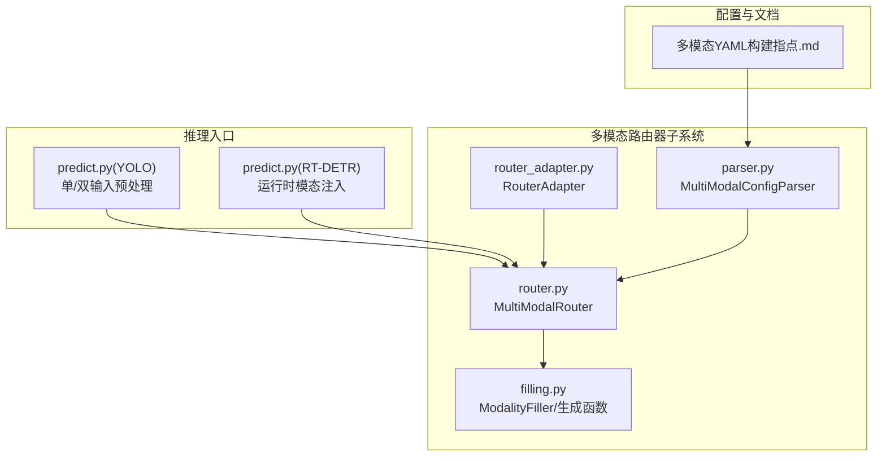
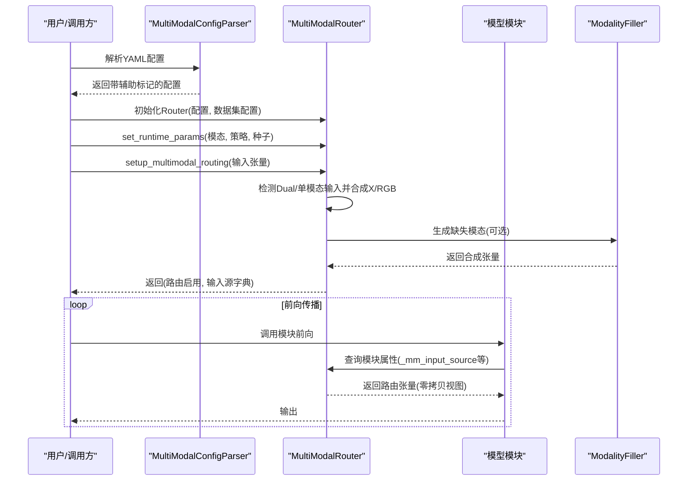
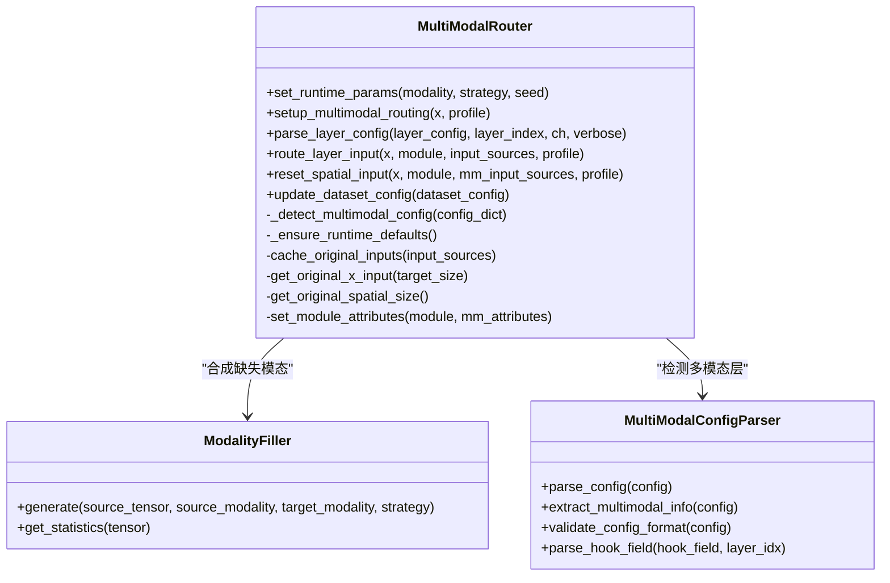
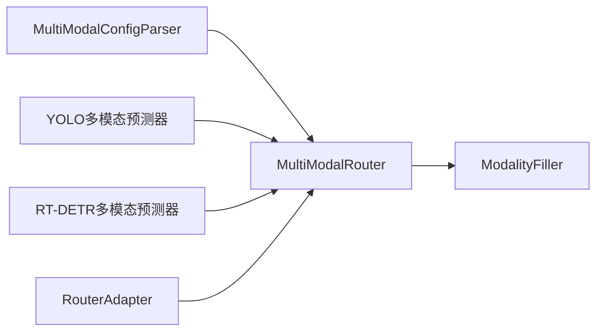

# MultiModalRouter多模态路由器

<cite>
**本文档引用的文件**
- [router.py](file://ultralytics/nn/mm/router.py)
- [parser.py](file://ultralytics/nn/mm/parser.py)
- [filling.py](file://ultralytics/nn/mm/filling.py)
- [router_adapter.py](file://ultralytics/models/utils/multimodal/visualize_core/router_adapter.py)
- [predict.py（YOLO多模态）](file://ultralytics/models/yolo/multimodal/predict.py)
- [predict.py（RT-DETR多模态）](file://ultralytics/models/rtdetrmm/predict.py)
- [多模态YAML构建指点.md](file://ultralytics/cfg/models/多模态YAML构建指点.md)
</cite>

## 目录
1. [简介](#简介)
2. [项目结构](#项目结构)
3. [核心组件](#核心组件)
4. [架构总览](#架构总览)
5. [详细组件分析](#详细组件分析)
6. [依赖分析](#依赖分析)
7. [性能考虑](#性能考虑)
8. [故障排查指南](#故障排查指南)
9. [结论](#结论)
10. [附录](#附录)

## 简介
MultiModalRouter是Ultralytics多模态框架中的通用RGB+X数据路由核心组件，支持YOLO与RT-DETR系列模型的多模态输入融合与运行时消融。其主要能力包括：
- 零拷贝张量视图路由：通过切片与缓存引用实现高效数据流转
- 配置驱动的数据流控制：基于YAML第5字段的模态路由标记
- 运行时参数设置：支持单/双模态切换、合成策略与随机种子
- 空间重置机制：在X模态新输入起点处恢复原始空间尺寸
- 向后兼容性：对旧版检查点的反序列化兼容与默认值保障

## 项目结构
围绕MultiModalRouter的关键文件组织如下：
- 路由器核心：ultralytics/nn/mm/router.py
- 配置解析：ultralytics/nn/mm/parser.py
- 模态合成与通道适配：ultralytics/nn/mm/filling.py
- 可视化适配器：ultralytics/models/utils/multimodal/visualize_core/router_adapter.py
- 推理入口（YOLO/RT-DETR）：ultralytics/models/yolo/multimodal/predict.py、ultralytics/models/rtdetrmm/predict.py
- YAML构建指南：ultralytics/cfg/models/多模态YAML构建指点.md

图表来源
- [router.py:11-471](file://ultralytics/nn/mm/router.py#L11-L471)
- [parser.py:9-198](file://ultralytics/nn/mm/parser.py#L9-L198)
- [filling.py:14-175](file://ultralytics/nn/mm/filling.py#L14-L175)
- [router_adapter.py:18-103](file://ultralytics/models/utils/multimodal/visualize_core/router_adapter.py#L18-L103)
- [predict.py（YOLO多模态）:1558-1588](file://ultralytics/models/yolo/multimodal/predict.py#L1558-L1588)
- [predict.py（RT-DETR多模态）:110-137](file://ultralytics/models/rtdetrmm/predict.py#L110-L137)
- [多模态YAML构建指点.md:1-29](file://ultralytics/cfg/models/多模态YAML构建指点.md#L1-L29)

章节来源
- [router.py:11-471](file://ultralytics/nn/mm/router.py#L11-L471)
- [parser.py:9-198](file://ultralytics/nn/mm/parser.py#L9-L198)
- [filling.py:14-175](file://ultralytics/nn/mm/filling.py#L14-L175)
- [router_adapter.py:18-103](file://ultralytics/models/utils/multimodal/visualize_core/router_adapter.py#L18-L103)
- [predict.py（YOLO多模态）:1558-1588](file://ultralytics/models/yolo/multimodal/predict.py#L1558-L1588)
- [predict.py（RT-DETR多模态）:110-137](file://ultralytics/models/rtdetrmm/predict.py#L110-L137)
- [多模态YAML构建指点.md:1-29](file://ultralytics/cfg/models/多模态YAML构建指点.md#L1-L29)

## 核心组件
- MultiModalRouter：负责初始化、配置解析、输入路由、空间重置、运行时参数注入与向后兼容
- MultiModalConfigParser：解析YAML配置，识别多模态层并提取模态信息
- ModalityFiller/generate_modality_filling/adapt_xch：提供零样本模态合成与通道适配
- RouterAdapter：可视化/调试场景下的安全访问适配器

章节来源
- [router.py:11-471](file://ultralytics/nn/mm/router.py#L11-L471)
- [parser.py:9-198](file://ultralytics/nn/mm/parser.py#L9-L198)
- [filling.py:14-175](file://ultralytics/nn/mm/filling.py#L14-L175)
- [router_adapter.py:18-103](file://ultralytics/models/utils/multimodal/visualize_core/router_adapter.py#L18-L103)

## 架构总览
MultiModalRouter采用“配置驱动 + 运行时注入”的双轴设计：
- 配置驱动：通过YAML第5字段标注模态来源，Router据此决定层间路由
- 运行时注入：在推理阶段设置运行时模态与策略，控制是否进行模态合成及通道拼接

图表来源
- [router.py:31-240](file://ultralytics/nn/mm/router.py#L31-L240)
- [filling.py:141-148](file://ultralytics/nn/mm/filling.py#L141-L148)
- [parser.py:67-86](file://ultralytics/nn/mm/parser.py#L67-L86)

## 详细组件分析

### MultiModalRouter类
- 初始化与配置
  - 从数据集配置读取X模态通道数与类型，构建INPUT_SOURCES映射
  - 检测配置中是否存在多模态层，记录has_multimodal_config
  - 提供verbose开关与运行时参数(runtime_modality/runtime_strategy/runtime_seed)
- 运行时参数设置
  - set_runtime_params支持设置模态(如rgb/x/dual/auto)、合成策略与随机种子
  - 向后兼容：__setstate/__ensure_runtime_defaults确保旧检查点可用
- 输入路由与零拷贝
  - setup_multimodal_routing根据输入通道数判断Dual或单模态，并生成RGB/X/Dual三路输入
  - 使用张量切片实现零拷贝视图，cache_original_inputs缓存以便空间重置
- 层级路由
  - parse_layer_config解析层配置，识别第5字段的模态来源并为模块设置_mm_*属性
  - route_layer_input依据模块属性选择RGB/X/Dual输入，支持X模态新输入起点的特殊处理
- 空间重置
  - reset_spatial_input在遇到X模态新输入起点时，强制使用原始X输入尺寸
- 数据集配置更新
  - update_dataset_config动态更新Xch与X模态类型，影响INPUT_SOURCES与日志显示

图表来源
- [router.py:31-471](file://ultralytics/nn/mm/router.py#L31-L471)
- [filling.py:14-175](file://ultralytics/nn/mm/filling.py#L14-L175)
- [parser.py:9-198](file://ultralytics/nn/mm/parser.py#L9-L198)

章节来源
- [router.py:31-471](file://ultralytics/nn/mm/router.py#L31-L471)

### MultiModalConfigParser类
- 支持的输入源：RGB、X、Dual
- 配置验证：统计各模态路由层数量，输出验证摘要
- 配置解析：为配置添加has_multimodal_layers与input_layers辅助标记
- Hook字段解析：将YAML第6字段Hook DSL解析为规范化规范列表，支持CL工具、模态、阶段、tap/action/normalize/detach等键

章节来源
- [parser.py:9-198](file://ultralytics/nn/mm/parser.py#L9-L198)

### ModalityFiller与合成策略
- 策略集合：copy/noise/channel_repeat/edge_blur/mixed，默认权重可配置
- 生成接口：generate_modality_filling统一入口，返回与源张量同形状的目标模态张量
- 通道适配：adapt_xch在3/1/Xch之间进行通道变换，支持线性投影与重复/求平均

章节来源
- [filling.py:14-175](file://ultralytics/nn/mm/filling.py#L14-L175)

### 推理入口中的路由器集成
- YOLO多模态预测器
  - 在预处理阶段根据输入是否为二元组判定双模态，注入运行时模态至Router
  - 双输入时直接组合为Dual张量；单输入时保持3通道并由Router合成另一侧
- RT-DETR多模态预测器
  - 在推理前向注入运行时模态，若未检测到Router且为单模态则严格报错
  - 提供读取Dual通道数的回退逻辑

章节来源
- [predict.py（YOLO多模态）:1558-1588](file://ultralytics/models/yolo/multimodal/predict.py#L1558-L1588)
- [predict.py（RT-DETR多模态）:110-137](file://ultralytics/models/rtdetrmm/predict.py#L110-L137)

### 可视化适配器RouterAdapter
- 通过多条属性链探测Router位置，避免硬依赖
- 安全设置运行时参数：支持auto/dual/rgb/x等规范化
- 可选更新数据集配置与恢复操作
- 提供摘要与日志输出

章节来源
- [router_adapter.py:18-103](file://ultralytics/models/utils/multimodal/visualize_core/router_adapter.py#L18-L103)

## 依赖分析
- Router对Filler的依赖：仅在需要合成缺失模态时调用，避免在纯Dual输入路径引入开销
- Parser对Router的间接依赖：Parser提供配置辅助标记，Router据此进行路由决策
- 推理入口对Router的直接依赖：在预处理阶段注入运行时参数
- 可视化适配器对Router的弱依赖：仅在存在时进行操作，失败时记录警告而非改变行为

图表来源
- [router.py:11-471](file://ultralytics/nn/mm/router.py#L11-L471)
- [parser.py:9-198](file://ultralytics/nn/mm/parser.py#L9-L198)
- [filling.py:14-175](file://ultralytics/nn/mm/filling.py#L14-L175)
- [router_adapter.py:18-103](file://ultralytics/models/utils/multimodal/visualize_core/router_adapter.py#L18-L103)
- [predict.py（YOLO多模态）:1558-1588](file://ultralytics/models/yolo/multimodal/predict.py#L1558-L1588)
- [predict.py（RT-DETR多模态）:110-137](file://ultralytics/models/rtdetrmm/predict.py#L110-L137)

## 性能考虑
- 零拷贝张量视图：通过切片与缓存引用减少内存复制，提升吞吐
- 条件合成：仅在需要时调用ModalityFiller，避免不必要的计算
- 动态通道适配：adapt_xch采用简单投影/重复/求平均，复杂度低
- 日志与诊断：verbose/profile参数便于定位性能瓶颈与配置问题

## 故障排查指南
- “缺少X模态输入源”：确认输入源字典包含X键，或检查setup_multimodal_routing的输入通道数
- “X模态新输入起点期望N通道”：检查X模态通道数与数据集配置Xch一致性
- “无法获取原始尺寸”：确认original_spatial_size已被setup_multimodal_routing设置
- “路由结果为None”：检查模块是否具备_mm_input_source属性，以及路由目标是否存在
- “单模态模式下不接受双输入”：在严格单模态模式下不要提供二元组输入

章节来源
- [router.py:242-404](file://ultralytics/nn/mm/router.py#L242-L404)

## 结论
MultiModalRouter通过配置驱动与运行时注入相结合，实现了对RGB+X多模态数据的高效、灵活与兼容的路由控制。其零拷贝视图与条件合成策略在保证功能完整性的同时兼顾性能；完善的向后兼容与错误处理机制提升了系统的鲁棒性。

## 附录

### YAML配置要点与示例路径
- 基本语法：第5字段标注模态来源（RGB/X/Dual），通道规则由数据集配置Xch决定
- 新起点分支：X分支作为新输入起点时，将该层from设为-1并标注X模态，Router自动进行空间重置
- 示例参考：多模态YAML构建指南文档

章节来源
- [多模态YAML构建指点.md:1-29](file://ultralytics/cfg/models/多模态YAML构建指点.md#L1-L29)