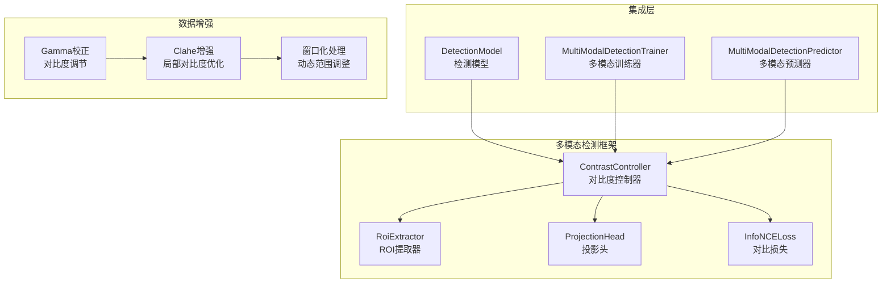
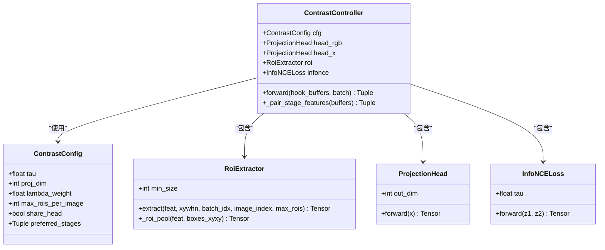
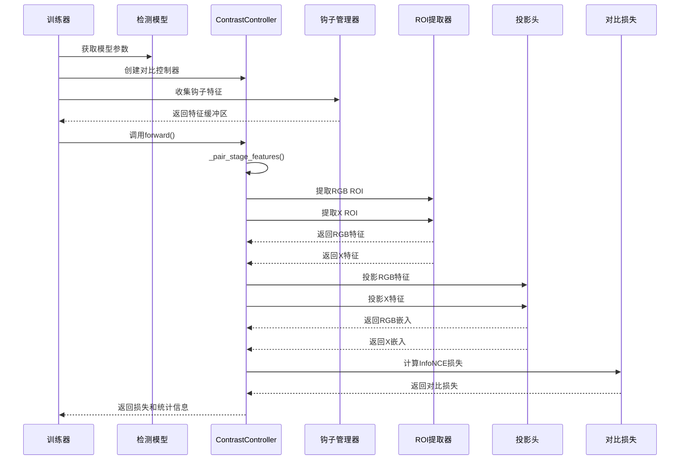
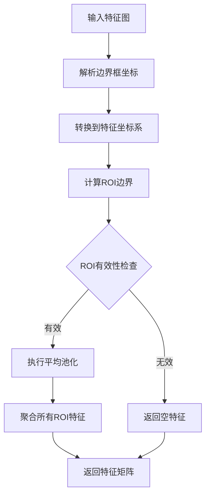
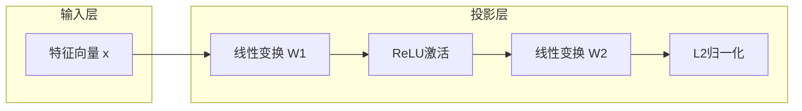
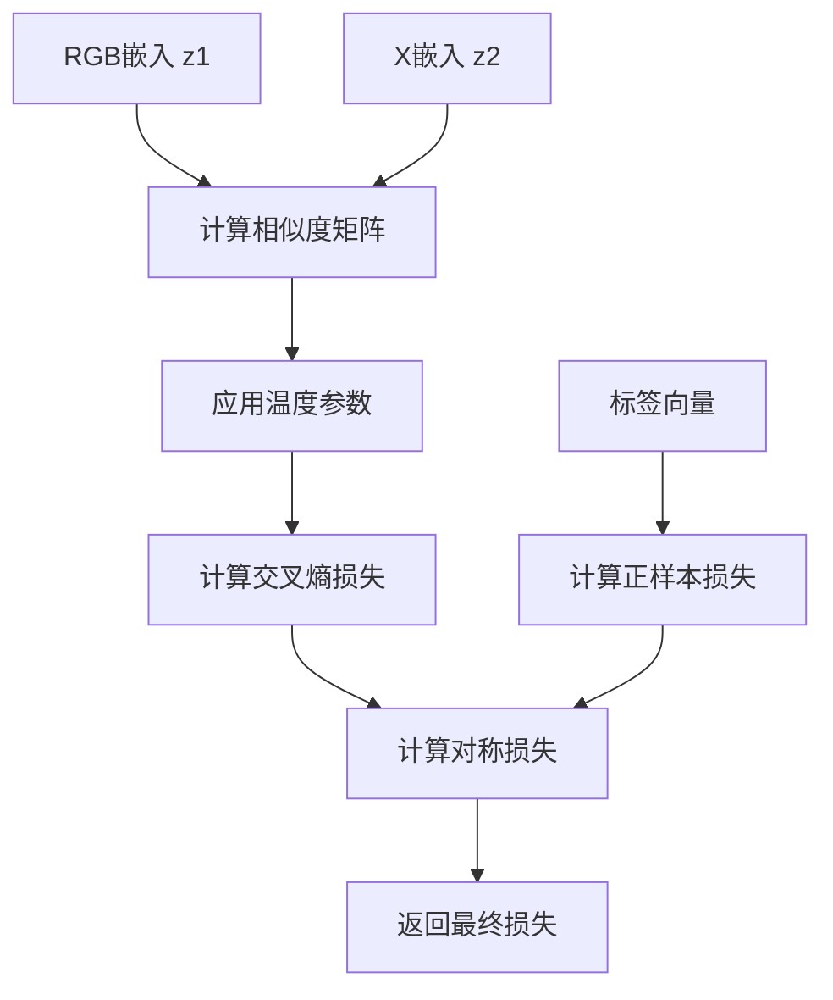
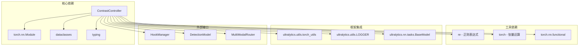
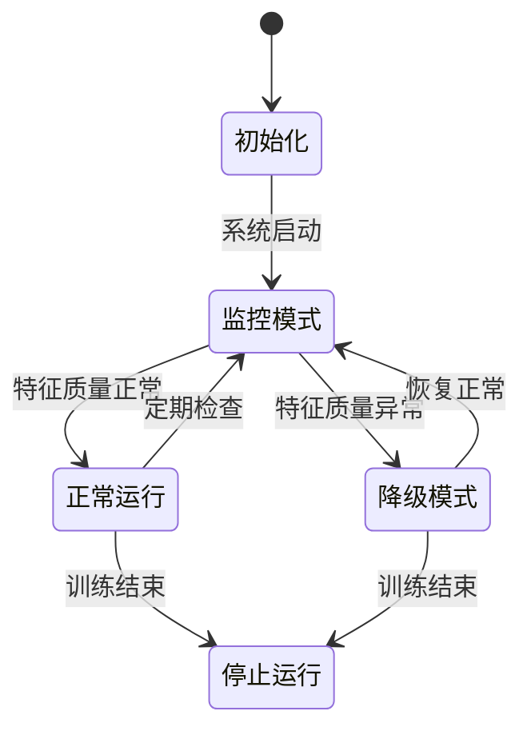
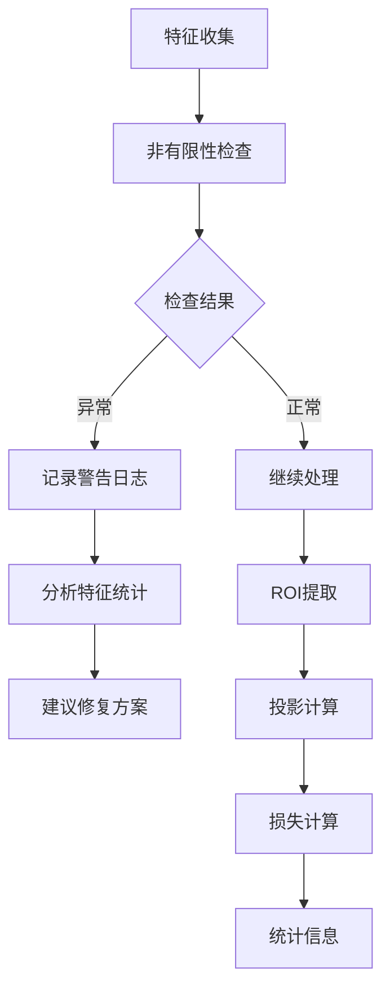

# 对比度控制系统

<cite>
**本文档引用的文件**
- [contrast.py](file://ultralytics/nn/mm/contrast.py)
- [tasks.py](file://ultralytics/nn/tasks.py)
- [train.py](file://ultralytics/models/yolo/multimodal/train.py)
- [predict.py](file://ultralytics/models/yolo/multimodal/predict.py)
- [multimodal_augment.py](file://ultralytics/data/multimodal_augment.py)
</cite>

## 目录
1. [简介](#简介)
2. [项目结构](#项目结构)
3. [核心组件](#核心组件)
4. [架构概览](#架构概览)
5. [详细组件分析](#详细组件分析)
6. [依赖关系分析](#依赖关系分析)
7. [性能考虑](#性能考虑)
8. [故障排除指南](#故障排除指南)
9. [结论](#结论)
10. [附录](#附录)

## 简介

对比度控制系统是多模态融合检测框架中的关键组件，专门用于提升RGB+X模态检测任务的性能表现。该系统通过对比学习机制，实现跨模态特征对齐和语义一致性约束，在不改变基础检测模型结构的前提下显著提升检测精度。

本系统的核心价值在于：
- **无侵入式集成**：通过钩子机制收集特征，无需修改现有网络结构
- **自适应控制**：根据特征质量动态调整对比学习强度
- **实时调节**：在训练过程中实时监控和优化对比度参数
- **多模态融合**：有效解决RGB与X模态之间的差异问题

## 项目结构

对比度控制系统在项目中的组织结构如下：

**图表来源**
- [contrast.py:148-290](file://ultralytics/nn/mm/contrast.py#L148-L290)
- [tasks.py:1110-1167](file://ultralytics/nn/tasks.py#L1110-L1167)

**章节来源**
- [contrast.py:1-290](file://ultralytics/nn/mm/contrast.py#L1-L290)
- [tasks.py:1110-1167](file://ultralytics/nn/tasks.py#L1110-L1167)

## 核心组件

### ContrastController类架构

ContrastController是整个对比度控制系统的核心控制器，负责协调各个组件完成对比学习任务。

**图表来源**
- [contrast.py:148-290](file://ultralytics/nn/mm/contrast.py#L148-L290)
- [contrast.py:139-147](file://ultralytics/nn/mm/contrast.py#L139-L147)
- [contrast.py:39-98](file://ultralytics/nn/mm/contrast.py#L39-L98)
- [contrast.py:100-116](file://ultralytics/nn/mm/contrast.py#L100-L116)
- [contrast.py:118-137](file://ultralytics/nn/mm/contrast.py#L118-L137)

### 参数配置系统

ContrastConfig提供了完整的参数配置机制，支持灵活的对比度控制策略：

| 参数名 | 类型 | 默认值 | 描述 |
|--------|------|--------|------|
| tau | float | 0.07 | 温度参数，控制对比学习的锐度 |
| proj_dim | int | 128 | 投影向量维度 |
| lambda_weight | float | 0.1 | 对比损失权重系数 |
| max_rois_per_image | int | 64 | 每张图像的最大ROI数量 |
| share_head | bool | False | 是否共享投影头 |
| preferred_stages | tuple | ("P4","P5","P3") | 优先选择的特征阶段 |

**章节来源**
- [contrast.py:139-147](file://ultralytics/nn/mm/contrast.py#L139-L147)
- [tasks.py:1125-1132](file://ultralytics/nn/tasks.py#L1125-L1132)

## 架构概览

对比度控制系统采用分层架构设计，实现了从特征收集到损失计算的完整流程：

**图表来源**
- [tasks.py:1145-1147](file://ultralytics/nn/tasks.py#L1145-L1147)
- [contrast.py:189-289](file://ultralytics/nn/mm/contrast.py#L189-L289)

**章节来源**
- [tasks.py:1090-1167](file://ultralytics/nn/tasks.py#L1090-L1167)
- [contrast.py:148-290](file://ultralytics/nn/mm/contrast.py#L148-L290)

## 详细组件分析

### ROI提取器算法

ROI提取器实现了精确的目标区域特征提取机制：

**图表来源**
- [contrast.py:80-98](file://ultralytics/nn/mm/contrast.py#L80-L98)
- [contrast.py:46-78](file://ultralytics/nn/mm/contrast.py#L46-L78)

ROI提取的关键特性：
- **坐标转换**：将归一化边界框转换为特征图坐标
- **边界约束**：确保ROI在有效范围内
- **动态池化**：根据ROI大小自适应调整池化核

### 投影头设计

投影头采用两层MLP结构，实现特征向量的高维映射：

**图表来源**
- [contrast.py:100-116](file://ultralytics/nn/mm/contrast.py#L100-L116)

投影头的优化策略：
- **数值稳定性**：在FP32环境下进行投影计算
- **懒加载机制**：首次前向传播时创建参数
- **维度自适应**：根据输出维度动态调整隐藏层

### 对比损失计算

InfoNCE损失实现了自监督对比学习的核心算法：

**图表来源**
- [contrast.py:118-137](file://ultralytics/nn/mm/contrast.py#L118-L137)

**章节来源**
- [contrast.py:39-137](file://ultralytics/nn/mm/contrast.py#L39-L137)

## 依赖关系分析

对比度控制系统与其他组件的依赖关系：

**图表来源**
- [contrast.py:15-26](file://ultralytics/nn/mm/contrast.py#L15-L26)
- [tasks.py:196-196](file://ultralytics/nn/tasks.py#L196-L196)

**章节来源**
- [contrast.py:15-26](file://ultralytics/nn/mm/contrast.py#L15-L26)
- [tasks.py:196-196](file://ultralytics/nn/tasks.py#L196-L196)

## 性能考虑

### 计算复杂度分析

对比度控制系统的计算开销主要来源于以下几个方面：

| 组件 | 时间复杂度 | 空间复杂度 | 优化策略 |
|------|------------|------------|----------|
| ROI提取 | O(N×H×W×C) | O(N×C) | ROI数量限制、批处理优化 |
| 特征投影 | O(N×C×D) | O(N×D) | FP32计算、懒加载参数 |
| 相似度计算 | O(N²×D) | O(N²) | 温度参数调优、批量处理 |
| 损失计算 | O(N²) | O(1) | 对称损失、数值稳定 |

### 内存优化策略

1. **渐进式特征收集**：仅在需要时收集钩子特征
2. **批处理优化**：合理设置max_rois_per_image参数
3. **设备迁移**：自动检测并使用GPU加速
4. **内存回收**：及时释放中间计算结果

### 实时调节机制

系统实现了自适应的实时调节机制：

## 故障排除指南

### 常见问题及解决方案

| 问题类型 | 症状 | 原因分析 | 解决方案 |
|----------|------|----------|----------|
| 特征非有限 | NaN/Inf值 | 数值不稳定、梯度爆炸 | 检查输入数据、调整温度参数 |
| ROI提取失败 | 空特征返回 | 边界框越界、ROI过小 | 验证边界框坐标、增加min_size |
| 设备不匹配 | CUDA错误 | CPU/GPU设备不一致 | 确保控制器与模型在同一设备 |
| 内存不足 | Out of memory | ROI数量过多、批处理过大 | 减少max_rois_per_image、优化批大小 |

### 调试工具和日志

系统提供了完善的调试机制：

**图表来源**
- [contrast.py:195-281](file://ultralytics/nn/mm/contrast.py#L195-L281)

**章节来源**
- [contrast.py:195-281](file://ultralytics/nn/mm/contrast.py#L195-L281)

## 结论

对比度控制系统通过精心设计的算法架构和灵活的参数配置，为多模态融合检测任务提供了强大的对比学习能力。系统的主要优势包括：

1. **高度集成性**：无缝集成到现有检测框架中，无需修改基础模型
2. **自适应能力**：能够根据特征质量和任务需求动态调整对比强度
3. **实时性能**：在保证精度的同时维持高效的训练速度
4. **可扩展性**：支持多种对比度调节方法和融合策略

该系统在RGB+X模态检测任务中展现了显著的性能提升潜力，为多模态计算机视觉应用提供了可靠的技术支撑。

## 附录

### 配置参数参考表

| 参数 | 类型 | 默认值 | 适用场景 | 性能影响 |
|------|------|--------|----------|----------|
| contrast_tau | float | 0.07 | 标准对比学习 | 温度越低越锐利 |
| contrast_dim | int | 128 | 中等计算资源 | 维度越高越强 |
| contrast_lambda | float | 0.1 | 平衡损失权重 | 越大越强 |
| contrast_max_rois | int | 64 | 标准数据集 | 越多越准确 |
| contrast_share_head | bool | False | 资源受限 | 节省参数 |
| contrast_stages | tuple | ("P4","P5","P3") | 多尺度特征 | P3最弱 |

### 最佳实践建议

1. **参数调优**：根据数据集规模和计算资源调整参数
2. **监控指标**：定期检查对比损失和特征质量
3. **渐进式训练**：从较小心跳开始，逐步增加对比强度
4. **数据验证**：确保输入数据的质量和一致性