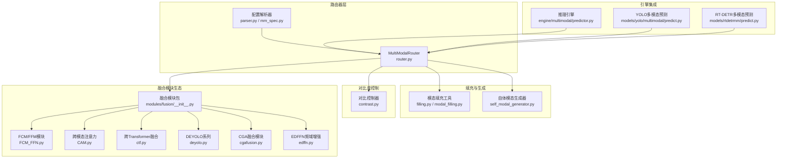
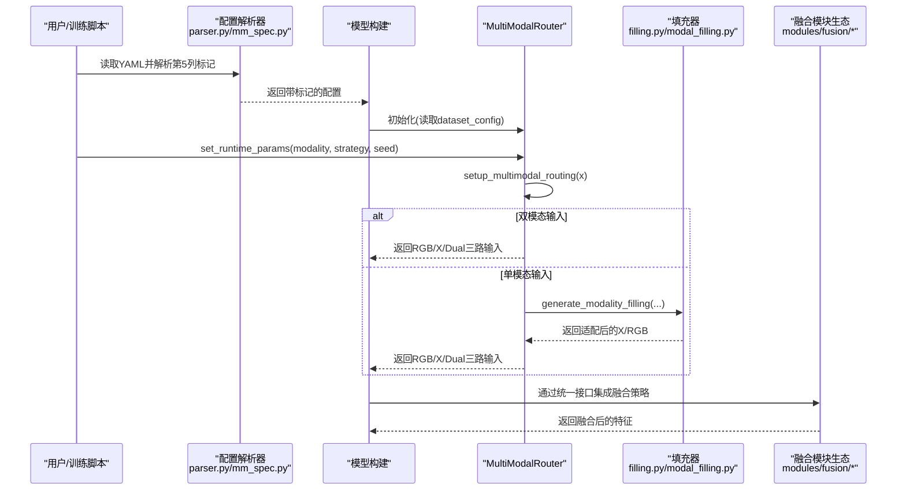
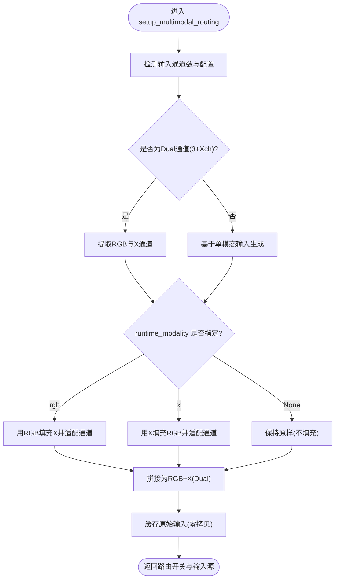
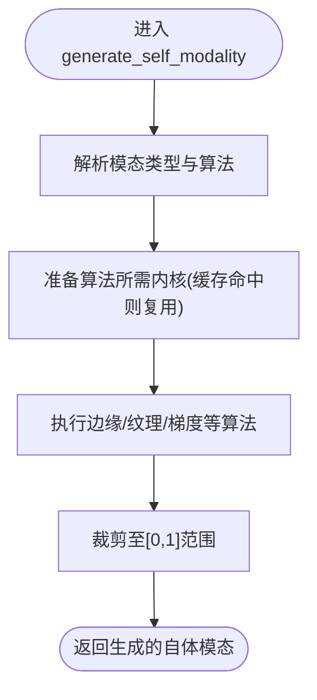
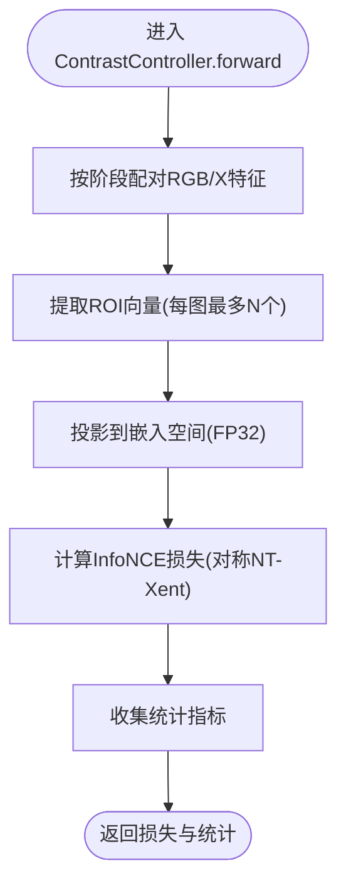
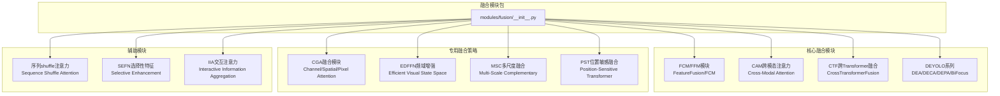
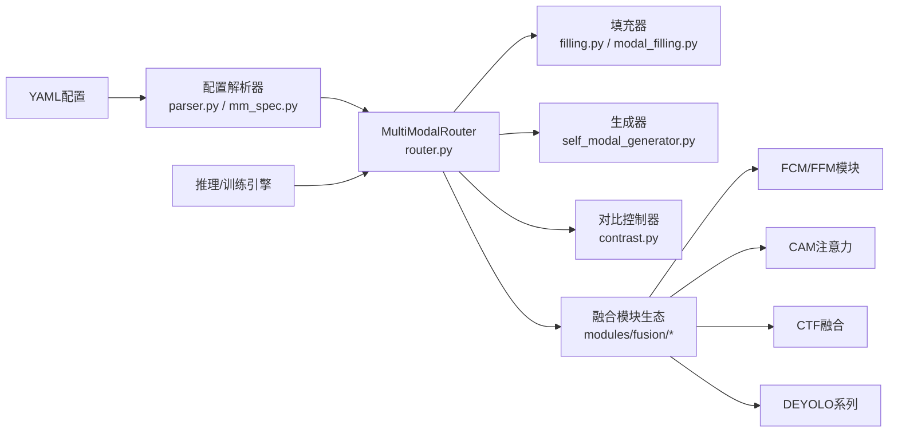

# 核心组件详解

<cite>
**本文档引用的文件**
- [router.py](file://ultralytics/nn/mm/router.py)
- [filling.py](file://ultralytics/nn/mm/filling.py)
- [modal_filling.py](file://ultralytics/models/yolo/multimodal/modal_filling.py)
- [self_modal_generator.py](file://ultralytics/models/yolo/multimodal/self_modal_generator.py)
- [contrast.py](file://ultralytics/nn/mm/contrast.py)
- [predict.py](file://ultralytics/engine/multimodal/predictor.py)
- [predict.py](file://ultralytics/models/yolo/multimodal/predict.py)
- [predict.py](file://ultralytics/models/rtdetrmm/predict.py)
- [__init__.py](file://ultralytics/nn/mm/__init__.py)
- [mm_spec.py](file://ultralytics/models/rtdetrmm/utils/mm_spec.py)
- [parser.py](file://ultralytics/nn/mm/parser.py)
- [__init__.py](file://ultralytics/nn/modules/fusion/__init__.py)
- [FCM_FFN.py](file://ultralytics/nn/modules/fusion/FCM_FFN.py)
- [CAM.py](file://ultralytics/nn/modules/fusion/CAM.py)
- [ctf.py](file://ultralytics/nn/modules/fusion/ctf.py)
- [deyolo.py](file://ultralytics/nn/modules/fusion/deyolo.py)
- [cgafusion.py](file://ultralytics/nn/modules/fusion/cgafusion.py)
- [edffn.py](file://ultralytics/nn/modules/fusion/edffn.py)
</cite>

## 目录
1. [简介](#简介)
2. [项目结构](#项目结构)
3. [核心组件](#核心组件)
4. [架构总览](#架构总览)
5. [详细组件分析](#详细组件分析)
6. [融合模块生态系统](#融合模块生态系统)
7. [依赖关系分析](#依赖关系分析)
8. [性能考虑](#性能考虑)
9. [故障排查指南](#故障排查指南)
10. [结论](#结论)

## 简介
本文件面向多模态检测系统的核心组件，提供深入的技术文档，重点覆盖以下方面：
- MultiModalRouter 多模态路由器：实现细节、配置解析机制与数据流控制逻辑
- 模态填充系统：填充策略、零填充算法与插值填充方法
- 模态生成器：架构设计、生成算法与质量控制机制
- 对比度控制系统：调节算法与自适应策略
- **新增** 融合模块生态系统：统一接口设计、模块间依赖关系与融合策略集成
- 每个组件均包含配置参数说明、使用场景分析与代码路径引用

## 项目结构
多模态系统围绕"路由器 + 填充 + 生成 + 对比 + 融合"五大支柱构建，核心位于 ultralytics/nn/mm 与 models/yolo/multimodal 两个子模块，配合引擎层的推理与训练流程，以及新增的融合模块生态系统。

**图表来源**
- [router.py:1-471](file://ultralytics/nn/mm/router.py#L1-L471)
- [filling.py:1-175](file://ultralytics/nn/mm/filling.py#L1-L175)
- [modal_filling.py:1-295](file://ultralytics/models/yolo/multimodal/modal_filling.py#L1-L295)
- [self_modal_generator.py:39-504](file://ultralytics/models/yolo/multimodal/self_modal_generator.py#L39-L504)
- [contrast.py:1-290](file://ultralytics/nn/mm/contrast.py#L1-L290)
- [__init__.py:1-69](file://ultralytics/nn/modules/fusion/__init__.py#L1-L69)
- [FCM_FFN.py:1-921](file://ultralytics/nn/modules/fusion/FCM_FFN.py#L1-L921)
- [CAM.py:1-97](file://ultralytics/nn/modules/fusion/CAM.py#L1-L97)
- [ctf.py:1-416](file://ultralytics/nn/modules/fusion/ctf.py#L1-L416)
- [deyolo.py:1-502](file://ultralytics/nn/modules/fusion/deyolo.py#L1-L502)
- [cgafusion.py:1-64](file://ultralytics/nn/modules/fusion/cgafusion.py#L1-L64)
- [edffn.py:1-63](file://ultralytics/nn/modules/fusion/edffn.py#L1-L63)

**章节来源**
- [__init__.py:1-78](file://ultralytics/nn/mm/__init__.py#L1-L78)

## 核心组件
- MultiModalRouter：支持 RGB/X/Dual 三路输入，零拷贝路由、运行时消融参数注入、空间重置与通道适配
- 模态填充系统：统一的填充策略库，支持 copy/noise/channel_repeat/edge_blur/mixed
- 模态生成器：自体模态生成器，支持缓存与算法内核预计算
- 对比度控制系统：ROI 提取、投影头与 InfoNCE 损失，支持阶段自适应选择
- **新增** 融合模块生态系统：统一接口设计，涵盖注意力机制、Transformer融合、DEYOLO系列、CGA融合等多种策略

**章节来源**
- [router.py:11-63](file://ultralytics/nn/mm/router.py#L11-L63)
- [filling.py:14-50](file://ultralytics/nn/mm/filling.py#L14-L50)
- [modal_filling.py:12-84](file://ultralytics/models/yolo/multimodal/modal_filling.py#L12-L84)
- [self_modal_generator.py:42-70](file://ultralytics/models/yolo/multimodal/self_modal_generator.py#L42-L70)
- [contrast.py:149-187](file://ultralytics/nn/mm/contrast.py#L149-L187)

## 架构总览
多模态系统采用"配置驱动 + 运行时注入 + 融合模块生态"的模式：
- 配置解析：在模型构建阶段识别 YAML 中的第5列路由标记，标记多模态层
- 路由初始化：根据输入张量通道数判断当前模式（Dual/RGB/X），并缓存原始输入
- 运行时消融：通过 set_runtime_params 注入模态与策略，触发填充或通道适配
- 数据流控制：按模块属性路由到 RGB/X/Dual，必要时进行空间重置与通道适配
- **新增** 融合模块集成：通过统一接口实现各种融合策略的无缝集成

**图表来源**
- [parser.py:67-97](file://ultralytics/nn/mm/parser.py#L67-L97)
- [mm_spec.py:49-82](file://ultralytics/models/rtdetrmm/utils/mm_spec.py#L49-L82)
- [router.py:31-63](file://ultralytics/nn/mm/router.py#L31-L63)
- [router.py:157-240](file://ultralytics/nn/mm/router.py#L157-L240)
- [filling.py:141-148](file://ultralytics/nn/mm/filling.py#L141-L148)
- [modal_filling.py:252-273](file://ultralytics/models/yolo/multimodal/modal_filling.py#L252-L273)

## 详细组件分析

### MultiModalRouter 多模态路由器
- 功能要点
  - 输入源定义：RGB(3)、X(Xch)、Dual(3+Xch)，Xch 来自 dataset_config
  - 配置解析：检测 YAML 第5列路由标记，标记多模态层
  - 运行时注入：set_runtime_params 设置模态、策略与随机种子
  - 数据流：setup_multimodal_routing 根据输入通道判定模式并生成三路输入
  - 路由：route_layer_input 按模块属性路由到 RGB/X/Dual
  - 空间重置：reset_spatial_input 在 X 新输入起点恢复原始空间尺寸
  - 通道适配：adapt_xch 在不同通道数间线性映射

- 关键流程图（setup_multimodal_routing）

**图表来源**
- [router.py:157-240](file://ultralytics/nn/mm/router.py#L157-L240)
- [router.py:328-363](file://ultralytics/nn/mm/router.py#L328-L363)
- [router.py:365-404](file://ultralytics/nn/mm/router.py#L365-L404)

- 配置参数与行为
  - dataset_config.Xch：X 模态通道数
  - dataset_config.x_modality：X 模态类型（日志展示）
  - runtime_modality：'rgb'/'x'/None
  - runtime_strategy：填充策略名或 None（随机）
  - runtime_seed：随机种子

- 使用场景
  - 双模态训练/推理：输入为 3+Xch 通道，不进行填充
  - 单模态推理：输入仅为 RGB 或 X，路由器自动填充另一路并拼接
  - 空间重置：当模块标注为 X 新输入起点时，强制使用原始 X 空间尺寸

**章节来源**
- [router.py:31-63](file://ultralytics/nn/mm/router.py#L31-L63)
- [router.py:90-155](file://ultralytics/nn/mm/router.py#L90-L155)
- [router.py:157-240](file://ultralytics/nn/mm/router.py#L157-L240)
- [router.py:242-317](file://ultralytics/nn/mm/router.py#L242-L317)
- [router.py:319-404](file://ultralytics/nn/mm/router.py#L319-L404)
- [router.py:406-447](file://ultralytics/nn/mm/router.py#L406-L447)

### 模态填充系统
- 统一填充器（filling.py）
  - 策略权重默认：copy(0.3)、noise(0.25)、channel_repeat(0.2)、edge_blur(0.15)、mixed(0.1)
  - 策略实现：
    - copy：直接克隆
    - noise：高斯噪声加到原图并 clamp
    - channel_repeat：单/三通道转换
    - edge_blur：Sobel边缘 + 高斯模糊
    - mixed：随机组合2-3种策略并加权平均
  - 通道适配：adapt_xch 支持 3↔1 与任意 C↔Xch 的线性映射

- YOLO专用填充器（modal_filling.py）
  - 与统一填充器类似，但针对单模态推理场景优化
  - 提供 generate_self_modality 便捷函数，结合 SelfModalGenerator

- 零填充与插值填充
  - 零填充：通过 channel_repeat 将单通道重复为三通道
  - 插值填充：adapt_xch 采用线性投影实现跨通道映射

- 使用场景
  - 单模态推理时，自动为缺失模态生成近似数据
  - 训练阶段可注入策略进行消融实验

**章节来源**
- [filling.py:14-50](file://ultralytics/nn/mm/filling.py#L14-L50)
- [filling.py:69-118](file://ultralytics/nn/mm/filling.py#L69-L118)
- [filling.py:151-175](file://ultralytics/nn/mm/filling.py#L151-L175)
- [modal_filling.py:12-84](file://ultralytics/models/yolo/multimodal/modal_filling.py#L12-L84)
- [modal_filling.py:47-78](file://ultralytics/models/yolo/multimodal/modal_filling.py#L47-L78)
- [modal_filling.py:162-194](file://ultralytics/models/yolo/multimodal/modal_filling.py#L162-L194)

### 模态生成器
- SelfModalGenerator（自体模态生成器）
  - 支持算法：'edge'（Sobel边缘）、'texture'、'gradient' 等（具体算法由内部调度）
  - 缓存机制：可选缓存，便于重复调用加速
  - 内核预计算：Sobel/Gabor 等核在初始化时生成，减少推理开销
  - 全局实例：default_self_modal_generator 供外部直接使用

- 生成流程（generate_self_modality）

**图表来源**
- [self_modal_generator.py:60-72](file://ultralytics/models/yolo/multimodal/self_modal_generator.py#L60-L72)
- [self_modal_generator.py:54-56](file://ultralytics/models/yolo/multimodal/self_modal_generator.py#L54-L56)
- [self_modal_generator.py:485-504](file://ultralytics/models/yolo/multimodal/self_modal_generator.py#L485-L504)

- 质量控制
  - 缓存清理与统计：clear_cache、get_cache_info
  - 数值稳定性：clamp 与 FP32 投影头

**章节来源**
- [self_modal_generator.py:42-70](file://ultralytics/models/yolo/multimodal/self_modal_generator.py#L42-L70)
- [self_modal_generator.py:463-478](file://ultralytics/models/yolo/multimodal/self_modal_generator.py#L463-L478)

### 对比度控制系统
- 组件构成
  - RoiExtractor：从特征图中按框提取 ROI 向量
  - ProjectionHead：两层 MLP，LazyLinear，FP32 投影并 L2 归一化
  - InfoNCELoss：对称 NT-Xent，温度系数 tau
  - ContrastController：从钩子缓冲区配对 RGB/X 特征，计算对比损失

- 自适应策略
  - 阶段选择：preferred_stages 优先选择 P4/P5/P3，否则选择首个可用阶段
  - 钩子命名解析：从 Hook 名称解析模态与阶段（如 CL.RGB.P4.）
  - 统计输出：包含阶段、配对数量、相似度均值

- 流程图（ContrastController.forward）

**图表来源**
- [contrast.py:189-290](file://ultralytics/nn/mm/contrast.py#L189-L290)
- [contrast.py:160-187](file://ultralytics/nn/mm/contrast.py#L160-L187)

- 参数配置
  - ContrastConfig：tau、proj_dim、lambda_weight、max_rois_per_image、share_head、preferred_stages

**章节来源**
- [contrast.py:139-147](file://ultralytics/nn/mm/contrast.py#L139-L147)
- [contrast.py:149-187](file://ultralytics/nn/mm/contrast.py#L149-L187)
- [contrast.py:189-290](file://ultralytics/nn/mm/contrast.py#L189-L290)

## 融合模块生态系统

### 融合模块包概览
融合模块生态系统通过统一的接口设计，将多种先进的多模态融合策略整合到一个可扩展的模块包中。该系统支持从基础的注意力机制到复杂的Transformer架构，为开发者提供了完整的融合策略选择。

**图表来源**
- [__init__.py:1-69](file://ultralytics/nn/modules/fusion/__init__.py#L1-L69)
- [FCM_FFN.py:1-921](file://ultralytics/nn/modules/fusion/FCM_FFN.py#L1-L921)
- [CAM.py:1-97](file://ultralytics/nn/modules/fusion/CAM.py#L1-L97)
- [ctf.py:1-416](file://ultralytics/nn/modules/fusion/ctf.py#L1-L416)
- [deyolo.py:1-502](file://ultralytics/nn/modules/fusion/deyolo.py#L1-L502)
- [cgafusion.py:1-64](file://ultralytics/nn/modules/fusion/cgafusion.py#L1-L64)
- [edffn.py:1-63](file://ultralytics/nn/modules/fusion/edffn.py#L1-L63)

### FCM/FFM融合框架
FCM（Feature Correction Module）和FFM（Feature Fusion Module）构成了CFFormer框架的核心，实现了两阶段的跨模态特征校正和融合。

#### FCM特征校正模块
FCM通过"空间校正→通道校正"的递进式策略，系统性地解决多模态特征融合中的特征不一致和信息冗余问题。

- **空间校正阶段**：通过SpatialWeights生成精细化的空间权重图，实现跨模态空间校正
- **通道校正阶段**：通过ChannelWeights生成通道级的重要性权重，实现跨模态通道校正
- **自适应权重**：weights参数可学习的双模态权重向量，确保最佳的校正强度控制

#### FeatureFusion特征融合模块
FeatureFusion实现了从双模态输入到单模态融合输出的端到端处理，体现了"交互-融合-输出"的完整特征处理流程。

- **输入预处理**：二维特征图到序列的转换
- **交叉交互处理**：基于FeatureInteraction的双向增强
- **特征拼接融合**：多模态信息的整合
- **通道嵌入映射**：序列到特征图的最终转换

**章节来源**
- [FCM_FFN.py:610-700](file://ultralytics/nn/modules/fusion/FCM_FFN.py#L610-L700)
- [FCM_FFN.py:354-471](file://ultralytics/nn/modules/fusion/FCM_FFN.py#L354-L471)

### CAM跨模态注意力机制
CAM（Cross-Modal Attention Mechanism）实现了双输入→单输出的跨模态注意力机制，支持RGB和文本等不同模态间的特征交互。

- **通道自适配**：两路特征映射到公共维度后做C×C注意力
- **形状约束**：两路输入空间尺寸(H, W)必须一致
- **惰性构建**：根据实际输入通道动态构建投影层
- **残差融合**：输出与输入进行残差连接

**章节来源**
- [CAM.py:18-97](file://ultralytics/nn/modules/fusion/CAM.py#L18-L97)

### CTF跨Transformer融合
CTF（Cross-Transformer Fusion）实现了基于Transformer架构的跨模态特征融合，特别适用于可见光和红外模态的融合任务。

#### MultiHeadCrossAttention多头交叉注意力
- **独立QKV投影系统**：为每个模态构建专属的查询-键-值映射
- **多头并行处理**：增强表示能力的分解策略
- **交叉注意力计算**：核心的跨模态交互机制
- **头合并与输出投影**：多头信息的整合

#### TransformerEncoder编码器
- **特征嵌入与缩放**：输入特征的预处理
- **位置编码注入**：空间位置信息的引入
- **多层编码处理**：深层特征学习的核心
- **端到端学习**：统一的特征学习框架

**章节来源**
- [ctf.py:15-119](file://ultralytics/nn/modules/fusion/ctf.py#L15-L119)
- [ctf.py:293-352](file://ultralytics/nn/modules/fusion/ctf.py#L293-L352)

### DEYOLO系列融合模块
DEYOLO系列模块专门用于多模态道路缺陷检测，通过"双重增强"策略解决多模态特征融合中的关键问题。

#### DEA双增强注意力
- **第一阶段-通道增强(DECA)**：专注于"什么信息重要"的问题
- **第二阶段-空间增强(DEPA)**：专注于"哪里的信息重要"的问题
- **渐进式增强**：先通道后空间，符合人类视觉认知的层次化处理机制

#### BiFocus双向焦点机制
- **FocusH水平解耦焦点**：专门针对水平方向的特征增强
- **FocusV垂直解耦焦点**：专门针对垂直方向的特征增强
- **深度可分离融合**：使用高效的深度可分离卷积进行最终融合

**章节来源**
- [deyolo.py:20-63](file://ultralytics/nn/modules/fusion/deyolo.py#L20-L63)
- [deyolo.py:285-330](file://ultralytics/nn/modules/fusion/deyolo.py#L285-L330)

### CGA融合模块
CGA（Cross-Modal Guided Attention）融合模块实现了通道、空间、像素级注意力引导的两输入融合。

- **SpatialAttentionCGA**：基于统计特征的空间注意力
- **ChannelAttentionCGA**：基于全局平均池化的通道注意力
- **PixelAttentionCGA**：像素级注意力的动态权重生成
- **多级注意力融合**：实现精细的跨模态特征交互

**章节来源**
- [cgafusion.py:46-64](file://ultralytics/nn/modules/fusion/cgafusion.py#L46-L64)

### EDF频域增强模块
EDFFN（Efficient Visual State Space）模块在融合后单路特征上执行频域选择性增强，抑制跨模态冗余并突出判别性纹理/结构。

- **Patch分块**：将特征图划分为规则的patch块
- **FFT频域处理**：在频域进行选择性增强
- **深度可分离卷积**：提供高效的非线性变换
- **GELU激活**：引入非线性变换能力

**章节来源**
- [edffn.py:9-63](file://ultralytics/nn/modules/fusion/edffn.py#L9-L63)

## 依赖关系分析
- 配置解析
  - YAML 解析：parser.py 检测第5列标记；mm_spec.py 提供更完整的证据结构
- 路由器依赖
  - 填充：filling.py/modal_filling.py 提供 generate_modality_filling 与 adapt_xch
  - 生成：self_modal_generator.py 提供自体模态生成
  - 对比：contrast.py 提供对比损失计算
- **新增** 融合模块依赖
  - 统一接口：通过 modules/fusion/__init__.py 导出所有融合模块
  - 模块间协作：FCM→FFM 串联封装，CTF→TransformerEncoder 集成
  - 论文支撑：各模块均有对应的学术论文支持
- 引擎集成
  - predictor.py、yolo/rtdetrmm 的 predict.py 在推理前注入 runtime 参数

**图表来源**
- [parser.py:67-97](file://ultralytics/nn/mm/parser.py#L67-L97)
- [mm_spec.py:49-82](file://ultralytics/models/rtdetrmm/utils/mm_spec.py#L49-L82)
- [router.py:1-471](file://ultralytics/nn/mm/router.py#L1-L471)
- [filling.py:1-175](file://ultralytics/nn/mm/filling.py#L1-L175)
- [modal_filling.py:1-295](file://ultralytics/models/yolo/multimodal/modal_filling.py#L1-L295)
- [self_modal_generator.py:39-504](file://ultralytics/models/yolo/multimodal/self_modal_generator.py#L39-L504)
- [contrast.py:1-290](file://ultralytics/nn/mm/contrast.py#L1-L290)
- [__init__.py:1-69](file://ultralytics/nn/modules/fusion/__init__.py#L1-L69)

**章节来源**
- [__init__.py:29-71](file://ultralytics/nn/mm/__init__.py#L29-L71)

## 性能考虑
- 零拷贝路由：MultiModalRouter 通过切片与缓存实现零拷贝，降低内存与拷贝开销
- 线性投影适配：adapt_xch 使用固定权重矩阵映射，避免复杂插值
- 内核预计算：SelfModalGenerator 预生成 Sobel/Gabor 等核，减少推理时计算
- FP32 投影：对比控制器在 FP32 下进行投影与损失计算，提升数值稳定性
- 批处理与进度日志：填充器与生成器在批量处理时打印进度，便于监控
- **新增** 融合模块优化：
  - 深度可分离卷积：CGA、EDFFN等模块采用深度可分离卷积降低计算复杂度
  - 多头注意力：CTF、DEYOLO等模块通过多头设计平衡计算效率与表达能力
  - 惰性构建：CAM等模块根据实际输入动态构建投影层，节省内存开销
  - 两阶段校正：FCM的递进式校正策略避免一次性处理过多信息

## 故障排查指南
- 未找到路由器
  - 现象：单模态推理时报错"未找到多模态路由器"
  - 处理：确认使用多模态权重并在 PyTorch 后端运行
  - 参考
    - [predict.py:127-131](file://ultralytics/models/yolo/multimodal/predict.py#L127-L131)
    - [predict.py:118-122](file://ultralytics/models/rtdetrmm/predict.py#L118-L122)

- 输入通道不匹配
  - 现象：X 新输入起点通道数不匹配
  - 处理：检查 dataset_config.Xch 与实际输入通道一致
  - 参考
    - [router.py:278-287](file://ultralytics/nn/mm/router.py#L278-L287)

- 非有限特征/嵌入
  - 现象：对比损失出现 NaN/Inf
  - 处理：检查 ROI 提取与投影过程，关注非有限数值警告
  - 参考
    - [contrast.py:195-208](file://ultralytics/nn/mm/contrast.py#L195-L208)
    - [contrast.py:241-253](file://ultralytics/nn/mm/contrast.py#L241-L253)
    - [contrast.py:277-281](file://ultralytics/nn/mm/contrast.py#L277-L281)

- 填充策略权重异常
  - 现象：策略权重之和不为1
  - 处理：调整权重或使用默认配置
  - 参考
    - [modal_filling.py:44-45](file://ultralytics/models/yolo/multimodal/modal_filling.py#L44-L45)

- **新增** 融合模块相关问题
  - CAM模块形状不匹配：检查两路输入的空间尺寸(H, W)是否一致
  - FCM模块维度错误：确认输入特征的通道数与模块初始化时的dim参数一致
  - CTF模块序列长度：确保输入特征展平后的序列长度一致
  - DEYOLO模块通道数：检查DEA/DECA/DEPA等模块的channel参数设置
  - CGA模块输入格式：确认输入为两路特征的元组格式(data=(x, y))

**章节来源**
- [predict.py:127-131](file://ultralytics/models/yolo/multimodal/predict.py#L127-L131)
- [predict.py:118-122](file://ultralytics/models/rtdetrmm/predict.py#L118-L122)
- [router.py:278-287](file://ultralytics/nn/mm/router.py#L278-L287)
- [contrast.py:195-208](file://ultralytics/nn/mm/contrast.py#L195-L208)
- [contrast.py:241-253](file://ultralytics/nn/mm/contrast.py#L241-L253)
- [contrast.py:277-281](file://ultralytics/nn/mm/contrast.py#L277-L281)
- [modal_filling.py:44-45](file://ultralytics/models/yolo/multimodal/modal_filling.py#L44-L45)
- [CAM.py:61-75](file://ultralytics/nn/modules/fusion/CAM.py#L61-L75)
- [FCM_FFN.py:678-690](file://ultralytics/nn/modules/fusion/FCM_FFN.py#L678-L690)
- [ctf.py:406-415](file://ultralytics/nn/modules/fusion/ctf.py#L406-L415)
- [deyolo.py:54-62](file://ultralytics/nn/modules/fusion/deyolo.py#L54-L62)
- [cgafusion.py:57-63](file://ultralytics/nn/modules/fusion/cgafusion.py#L57-L63)

## 结论
多模态检测系统通过 MultiModalRouter 实现灵活的配置驱动路由，结合统一的模态填充与自体模态生成，以及对比度控制的特征对齐，形成从配置到推理的完整闭环。**新增的融合模块生态系统**进一步丰富了系统的功能，通过统一接口设计实现了多种先进融合策略的无缝集成。该系统强调零拷贝、可插拔与可配置，既满足训练阶段的消融实验需求，也保障推理阶段的稳定与高效。融合模块生态的引入为开发者提供了从基础注意力机制到复杂Transformer架构的完整工具集，支持多模态目标检测、图像分割、道路缺陷检测等多种应用场景。