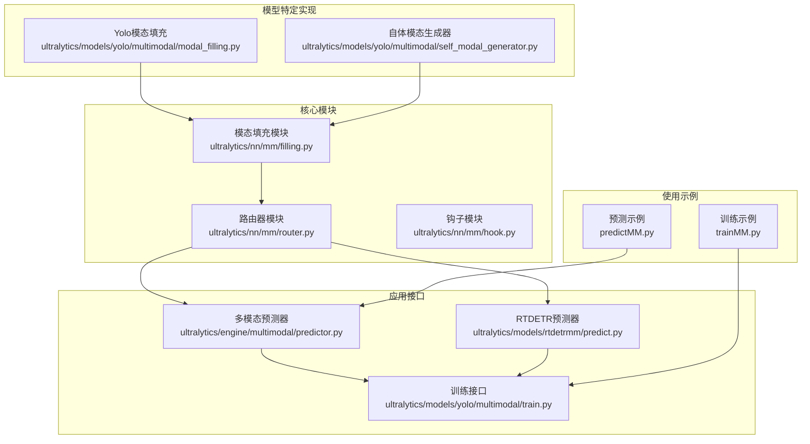
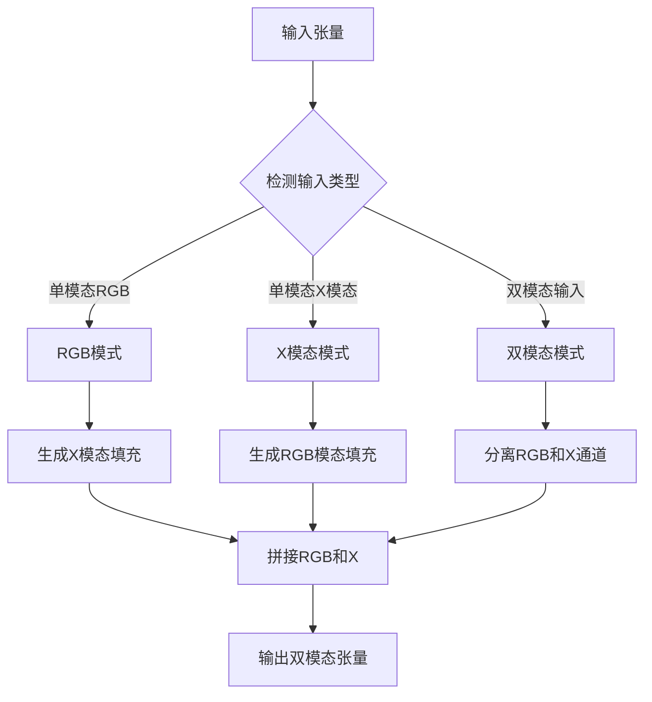
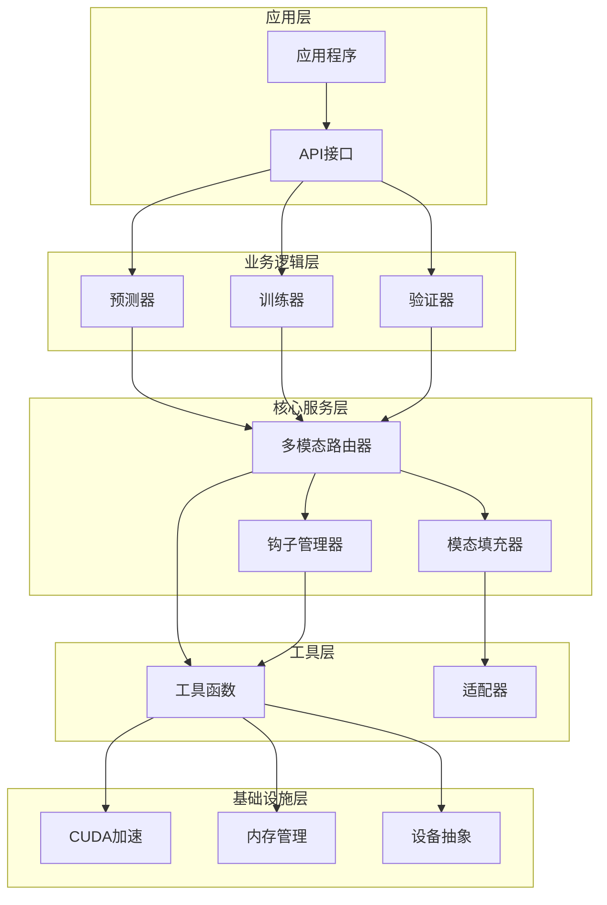
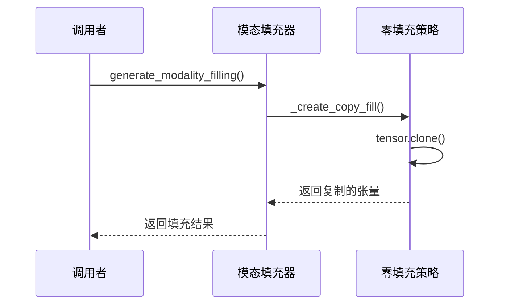
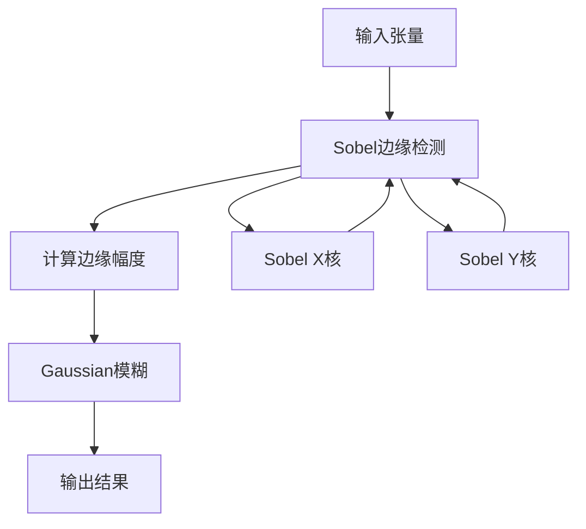
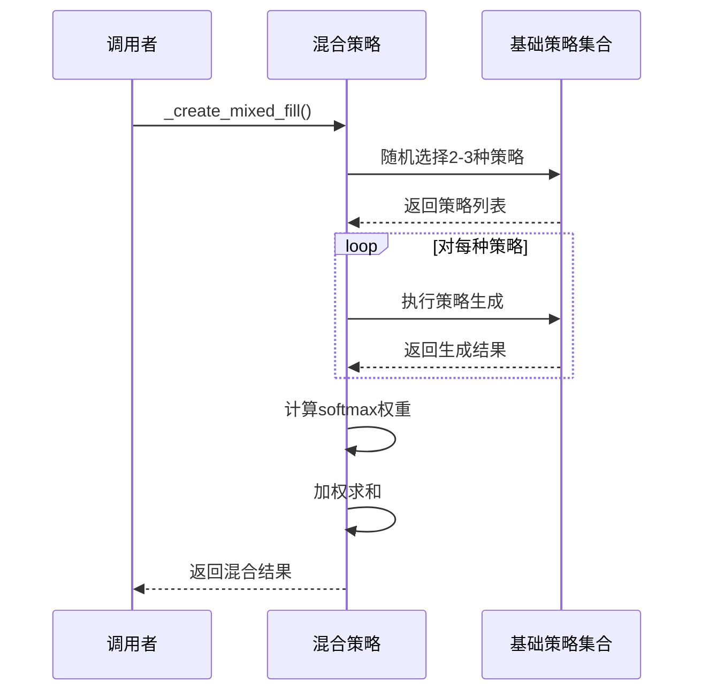
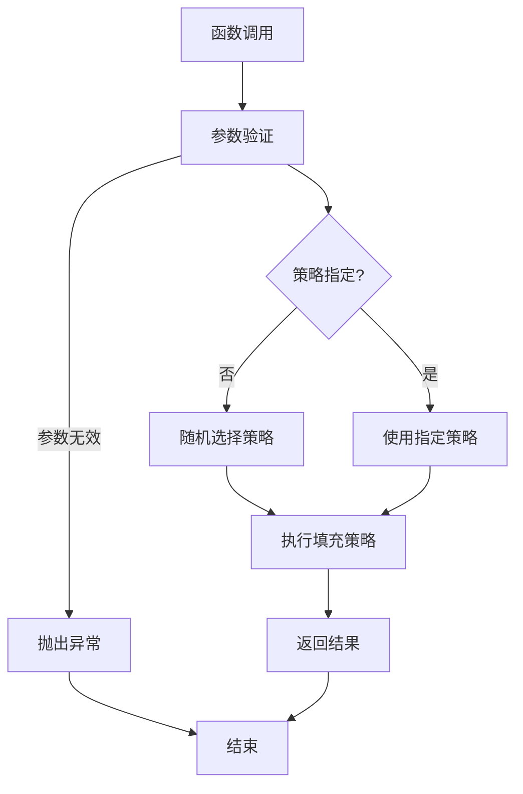
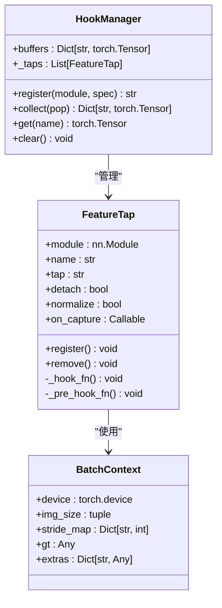
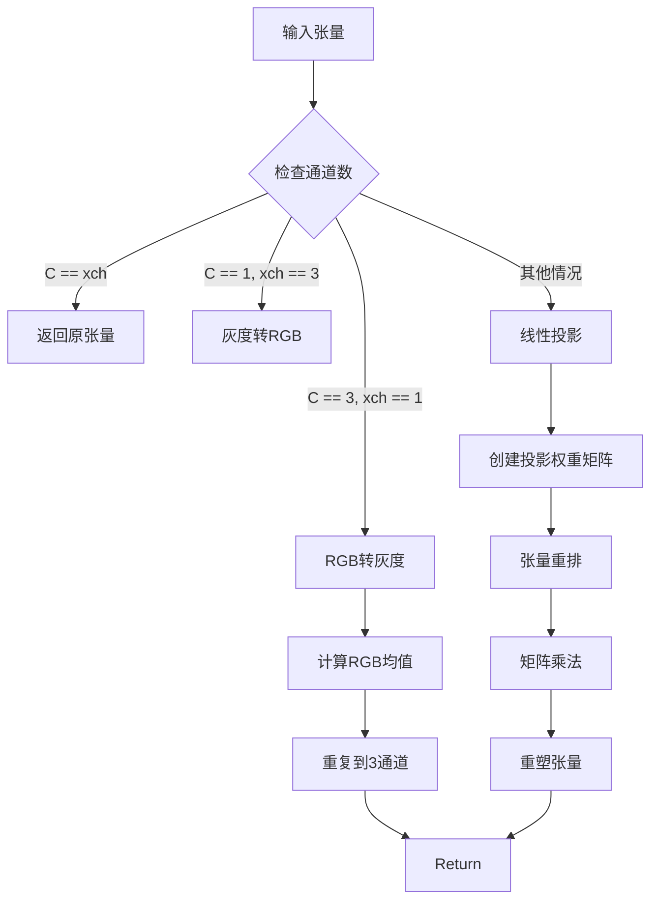
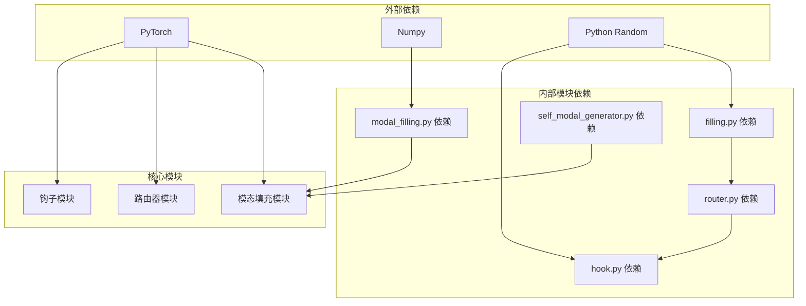

# 模态填充系统

<cite>
**本文档引用的文件**
- [ultralytics/nn/mm/filling.py](file://ultralytics/nn/mm/filling.py)
- [ultralytics/nn/mm/router.py](file://ultralytics/nn/mm/router.py)
- [ultralytics/nn/mm/hook.py](file://ultralytics/nn/mm/hook.py)
- [ultralytics/models/yolo/multimodal/modal_filling.py](file://ultralytics/models/yolo/multimodal/modal_filling.py)
- [ultralytics/models/yolo/multimodal/self_modal_generator.py](file://ultralytics/models/yolo/multimodal/self_modal_generator.py)
- [ultralytics/engine/multimodal/predictor.py](file://ultralytics/engine/multimodal/predictor.py)
- [ultralytics/models/rtdetrmm/predict.py](file://ultralytics/models/rtdetrmm/predict.py)
- [ultralytics/models/yolo/multimodal/train.py](file://ultralytics/models/yolo/multimodal/train.py)
- [predictMM.py](file://predictMM.py)
- [trainMM.py](file://trainMM.py)
</cite>

## 目录
1. [简介](#简介)
2. [项目结构](#项目结构)
3. [核心组件](#核心组件)
4. [架构概览](#架构概览)
5. [详细组件分析](#详细组件分析)
6. [依赖关系分析](#依赖关系分析)
7. [性能考虑](#性能考虑)
8. [故障排除指南](#故障排除指南)
9. [结论](#结论)
10. [附录](#附录)

## 简介

模态填充系统是Ultralytics YOLO多模态检测框架的核心组件，专门设计用于在双模态数据训练的模型上执行单模态推理。该系统提供了多种智能填充策略，能够在缺少某些模态数据时生成合理的替代数据，从而保证模型在单模态场景下的正常运行。

系统主要包含三个核心功能：
- **模态填充策略**：提供零填充、插值填充和自适应填充等多种策略
- **钩子系统**：用于特征提取和模型调试
- **模态适配函数**：处理不同通道数之间的转换

## 项目结构

模态填充系统分布在多个模块中，形成了清晰的层次结构：



**图表来源**
- [ultralytics/nn/mm/filling.py:1-175](file://ultralytics/nn/mm/filling.py#L1-L175)
- [ultralytics/nn/mm/router.py:1-471](file://ultralytics/nn/mm/router.py#L1-L471)
- [ultralytics/nn/mm/hook.py:1-310](file://ultralytics/nn/mm/hook.py#L1-L310)

**章节来源**
- [ultralytics/nn/mm/filling.py:1-175](file://ultralytics/nn/mm/filling.py#L1-L175)
- [ultralytics/nn/mm/router.py:1-471](file://ultralytics/nn/mm/router.py#L1-L471)

## 核心组件

### 模态填充器 (ModalityFiller)

模态填充器是系统的核心组件，提供了多种填充策略：

| 策略类型 | 权重 | 描述 | 性能特点 |
|---------|------|------|----------|
| copy | 0.3 | 直接复制源模态数据 | 最快，无计算开销 |
| noise | 0.25 | 添加高斯噪声到源数据 | 中等性能，增加少量计算 |
| channel_repeat | 0.2 | 通道重复，将单通道扩展为三通道 | 快速，内存效率高 |
| edge_blur | 0.15 | 边缘检测+模糊处理 | 中等性能，计算复杂度较高 |
| mixed | 0.1 | 混合多种策略的加权组合 | 性能变化较大，最灵活 |

### 自体模态生成器 (SelfModalGenerator)

自体模态生成器专门用于从RGB图像生成各种辅助模态：

| 模态类型 | 支持算法 | 主要用途 |
|---------|----------|----------|
| edge | sobel, canny, scharr | 边缘检测和轮廓提取 |
| texture | lbp, gabor, variance | 纹理特征提取 |
| gradient | magnitude, direction, combined | 梯度分析和方向估计 |

### 多模态路由器 (MultiModalRouter)

路由器负责管理模态间的数据流和路由决策：



**图表来源**
- [ultralytics/nn/mm/router.py:157-240](file://ultralytics/nn/mm/router.py#L157-L240)

**章节来源**
- [ultralytics/nn/mm/filling.py:14-175](file://ultralytics/nn/mm/filling.py#L14-L175)
- [ultralytics/nn/mm/router.py:11-471](file://ultralytics/nn/mm/router.py#L11-L471)

## 架构概览

模态填充系统采用分层架构设计，确保了模块间的松耦合和高内聚：



**图表来源**
- [ultralytics/engine/multimodal/predictor.py:16-494](file://ultralytics/engine/multimodal/predictor.py#L16-L494)
- [ultralytics/models/yolo/multimodal/train.py:16-757](file://ultralytics/models/yolo/multimodal/train.py#L16-L757)

## 详细组件分析

### 模态填充策略实现

#### 零填充算法 (Copy Strategy)
零填充是最简单直接的策略，直接复制源模态数据作为填充：



**图表来源**
- [ultralytics/nn/mm/filling.py:69-75](file://ultralytics/nn/mm/filling.py#L69-L75)

#### 插值填充方法 (Noise Strategy)
噪声填充通过向源数据添加高斯噪声来生成填充数据：

```mermaid
flowchart TD
Start[开始] --> AddNoise[添加高斯噪声]
AddNoise --> Clamp[数值裁剪到[0,1]]
Clamp --> Return[返回结果]
AddNoise --> NoiseCalc[计算噪声: N(0,σ²)]
NoiseCalc --> AddNoise
Clamp --> CheckRange{检查范围}
CheckRange --> |超出范围| Clip[裁剪到边界]
CheckRange --> |在范围内| Return
Clip --> Return
```

**图表来源**
- [ultralytics/nn/mm/filling.py:72-75](file://ultralytics/nn/mm/filling.py#L72-L75)

#### 边缘检测+模糊填充 (Edge Blur Strategy)
边缘模糊策略结合了边缘检测和高斯模糊技术：



**图表来源**
- [ultralytics/nn/mm/filling.py:84-97](file://ultralytics/nn/mm/filling.py#L84-L97)

#### 混合策略 (Mixed Strategy)
混合策略随机选择2-3种基础策略进行加权组合：



**图表来源**
- [ultralytics/nn/mm/filling.py:99-118](file://ultralytics/nn/mm/filling.py#L99-L118)

### generate_modality_filling 函数工作机制

`generate_modality_filling` 是系统的便捷函数，提供了统一的接口：



**图表来源**
- [ultralytics/nn/mm/filling.py:141-148](file://ultralytics/nn/mm/filling.py#L141-L148)

### filling_hook 钩子系统

钩子系统提供了强大的特征提取和模型调试能力：



**图表来源**
- [ultralytics/nn/mm/hook.py:51-310](file://ultralytics/nn/mm/hook.py#L51-L310)

### 模态适配函数 adapt_xch 的通道转换逻辑

`adapt_xch` 函数处理不同通道数之间的智能转换：



**图表来源**
- [ultralytics/nn/mm/filling.py:151-174](file://ultralytics/nn/mm/filling.py#L151-L174)

**章节来源**
- [ultralytics/nn/mm/filling.py:14-175](file://ultralytics/nn/mm/filling.py#L14-L175)
- [ultralytics/nn/mm/hook.py:1-310](file://ultralytics/nn/mm/hook.py#L1-L310)

## 依赖关系分析

模态填充系统具有清晰的依赖层次结构：



**图表来源**
- [ultralytics/nn/mm/filling.py:1-12](file://ultralytics/nn/mm/filling.py#L1-L12)
- [ultralytics/nn/mm/router.py:5-8](file://ultralytics/nn/mm/router.py#L5-L8)

**章节来源**
- [ultralytics/nn/mm/filling.py:1-175](file://ultralytics/nn/mm/filling.py#L1-L175)
- [ultralytics/nn/mm/router.py:1-471](file://ultralytics/nn/mm/router.py#L1-L471)

## 性能考虑

### 计算复杂度分析

| 策略类型 | 时间复杂度 | 空间复杂度 | GPU利用率 |
|---------|-----------|-----------|-----------|
| copy | O(1) | O(1) | 低 |
| noise | O(N) | O(1) | 中等 |
| channel_repeat | O(N) | O(1) | 中等 |
| edge_blur | O(N×K²) | O(1) | 高 |
| mixed | O(M×N×K²) | O(M×N) | 高 |

其中 N 为像素总数，K 为卷积核大小，M 为混合策略数量。

### 内存优化策略

1. **零拷贝设计**：尽可能使用张量视图而非数据复制
2. **延迟导入**：仅在需要时导入额外依赖
3. **缓存机制**：对重复计算的结果进行缓存
4. **设备优化**：自动选择最优计算设备

### 实际应用场景

| 场景 | 推荐策略 | 理由 |
|------|----------|------|
| 实时推理 | copy/edge_blur | 低延迟，实时性好 |
| 精度优先 | mixed | 更高质量，但计算开销大 |
| 资源受限 | copy/noise | 最省资源 |
| 边缘检测 | edge_blur | 特定任务效果好 |

## 故障排除指南

### 常见问题及解决方案

#### 1. 模态填充质量不佳
**症状**：填充后的模态质量差，影响检测精度
**解决方案**：
- 调整噪声标准差参数
- 选择更合适的填充策略
- 检查输入数据的预处理

#### 2. 性能问题
**症状**：推理速度慢，GPU利用率低
**解决方案**：
- 使用更快的填充策略（copy/noise）
- 减少混合策略的使用
- 优化批处理大小

#### 3. 内存不足
**症状**：CUDA内存溢出
**解决方案**：
- 减小批量大小
- 使用更简单的填充策略
- 启用混合精度训练

**章节来源**
- [ultralytics/nn/mm/filling.py:43-46](file://ultralytics/nn/mm/filling.py#L43-L46)
- [ultralytics/nn/mm/router.py:64-68](file://ultralytics/nn/mm/router.py#L64-L68)

## 结论

模态填充系统通过精心设计的多策略架构，为多模态检测提供了强大而灵活的解决方案。系统的主要优势包括：

1. **模块化设计**：清晰的层次结构便于维护和扩展
2. **性能优化**：多种策略满足不同性能需求
3. **易用性**：简洁的API接口降低使用门槛
4. **可扩展性**：支持自定义策略和算法

该系统在实际应用中展现了良好的稳定性和实用性，为多模态目标检测任务提供了可靠的技术支撑。

## 附录

### 使用示例

#### 训练过程中的使用
```python
# 训练双模态模型
model = YOLOMM('yolo11n-mm-mid.yaml')
model.train(data='data.yaml', epochs=100, batch=8)

# 单模态训练示例
model.train(data='data.yaml', epochs=50, modality='rgb')
```

#### 推理过程中的使用
```python
# 双模态推理
results = model.predict(
    rgb_source='rgb_image.jpg',
    x_source='x_modal_image.jpg',
    save=True
)

# 单模态推理（自动填充）
results = model.predict(
    rgb_source='rgb_image.jpg',
    x_source=None,  # 自动填充X模态
    save=True
)
```

### 配置参数说明

| 参数 | 类型 | 默认值 | 说明 |
|------|------|--------|------|
| strategy_weights | Dict[str, float] | 预定义权重 | 各填充策略的权重分布 |
| noise_std | float | 0.1 | 高斯噪声的标准差 |
| blur_kernel_size | int | 5 | 模糊操作的核大小 |
| x_channels | int | 3 | X模态的通道数 |
| modality | str | None | 单模态训练模式 |