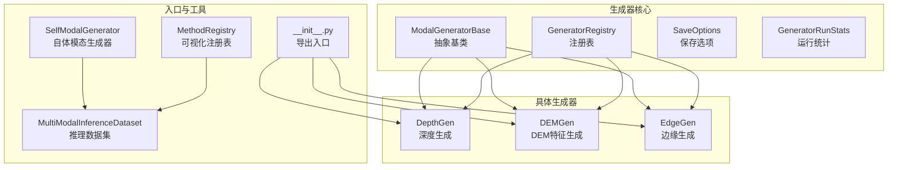
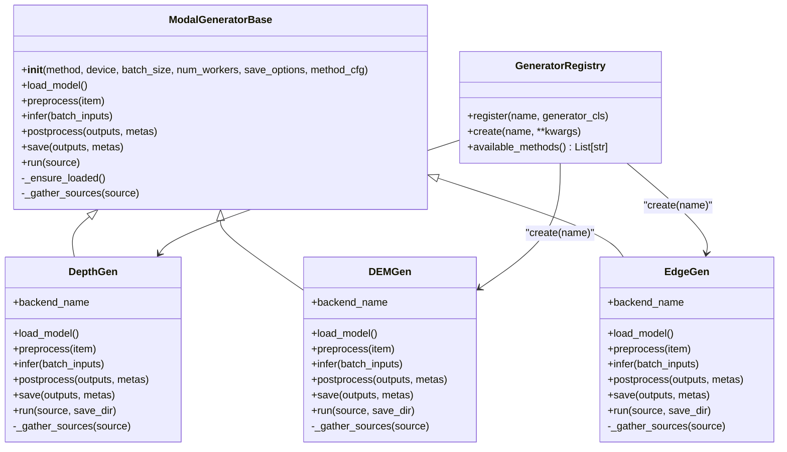
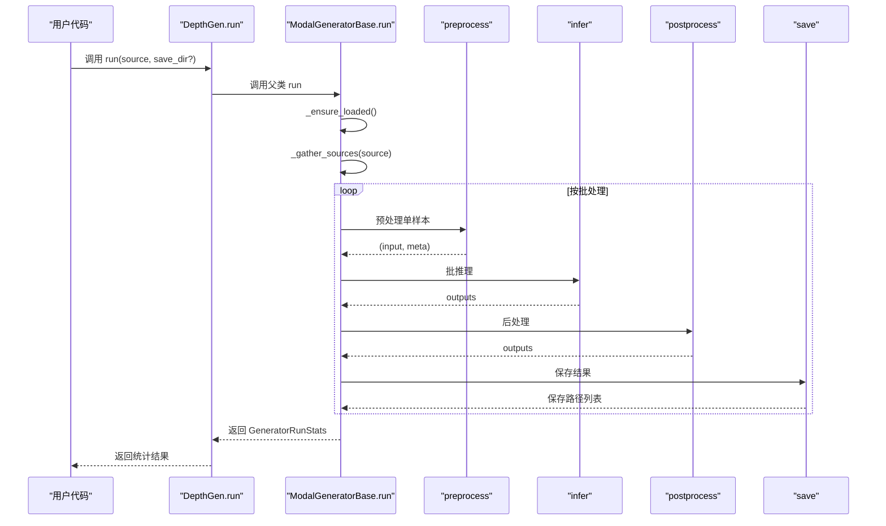
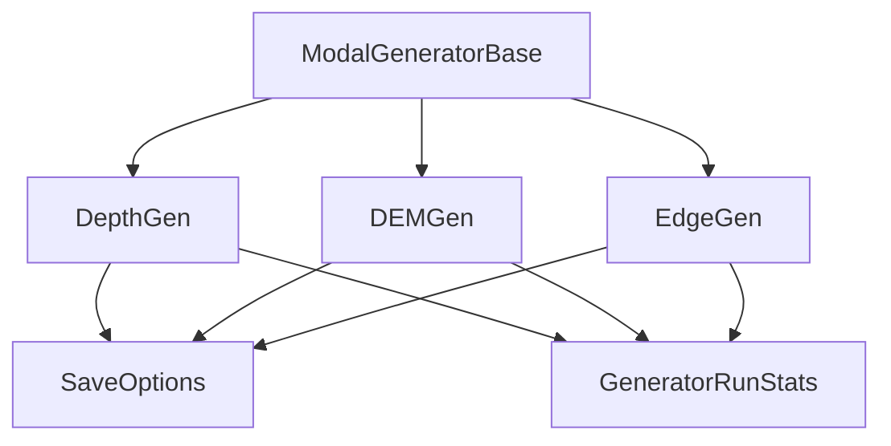

# 基础生成器架构

<cite>
**本文引用的文件**
- [基础生成器核心(base.py)](file://ultralytics/nn/mm/generators/base.py)
- [深度生成器(depth_anything_v2.py)](file://ultralytics/nn/mm/generators/depth_anything_v2.py)
- [DEM特征生成器(dem_features.py)](file://ultralytics/nn/mm/generators/dem_features.py)
- [边缘生成器(edge.py)](file://ultralytics/nn/mm/generators/edge.py)
- [生成器入口(__init__.py)](file://ultralytics/nn/mm/generators/__init__.py)
- [自体模态生成器(self_modal_generator.py)](file://ultralytics/models/yolo/multimodal/self_modal_generator.py)
- [可视化注册表(registry.py)](file://ultralytics/models/utils/multimodal/visualize_core/registry.py)
- [多模态推理数据集(inference_dataset.py)](file://ultralytics/data/multimodal/inference_dataset.py)
</cite>

## 目录
1. [简介](#简介)
2. [项目结构](#项目结构)
3. [核心组件](#核心组件)
4. [架构总览](#架构总览)
5. [详细组件分析](#详细组件分析)
6. [依赖关系分析](#依赖关系分析)
7. [性能考量](#性能考量)
8. [故障排查指南](#故障排查指南)
9. [结论](#结论)
10. [附录](#附录)

## 简介
本文件系统化梳理基础生成器架构，围绕 ModalGeneratorBase 抽象基类、生成器注册表、保存选项与运行统计等核心要素，解释离线模态生成的设计原则、生命周期管理与通用运行逻辑。文档还涵盖深度生成、DEM特征生成与边缘生成三大具体实现，以及与多模态推理数据集的衔接方式，帮助读者快速理解如何继承基础类实现自定义生成器、配置生成参数与处理异常情况。

## 项目结构
生成器体系位于 ultralytics/nn/mm/generators 目录，采用“抽象基类 + 具体实现 + 注册表 + 入口导出”的分层组织方式：
- 基类与通用配置：base.py
- 具体生成器：depth_anything_v2.py（深度）、dem_features.py（DEM特征）、edge.py（边缘）
- 入口导出：__init__.py 将三个生成器暴露给外部使用
- 相关工具与配套：self_modal_generator.py（自体模态生成器）、registry.py（可视化方法注册表）、inference_dataset.py（多模态推理数据集）

图表来源
- [基础生成器核心(base.py):51-71](file://ultralytics/nn/mm/generators/base.py#L51-L71)
- [深度生成器(depth_anything_v2.py):72-116](file://ultralytics/nn/mm/generators/depth_anything_v2.py#L72-L116)
- [DEM特征生成器(dem_features.py):212-239](file://ultralytics/nn/mm/generators/dem_features.py#L212-L239)
- [边缘生成器(edge.py):190-223](file://ultralytics/nn/mm/generators/edge.py#L190-L223)
- [生成器入口(__init__.py):6-14](file://ultralytics/nn/mm/generators/__init__.py#L6-L14)
- [自体模态生成器(self_modal_generator.py):10-52](file://ultralytics/models/yolo/multimodal/self_modal_generator.py#L10-L52)
- [可视化注册表(registry.py):8-34](file://ultralytics/models/utils/multimodal/visualize_core/registry.py#L8-L34)
- [多模态推理数据集(inference_dataset.py):16-89](file://ultralytics/data/multimodal/inference_dataset.py#L16-L89)

章节来源
- [基础生成器核心(base.py):1-225](file://ultralytics/nn/mm/generators/base.py#L1-L225)
- [生成器入口(__init__.py):1-15](file://ultralytics/nn/mm/generators/__init__.py#L1-L15)

## 核心组件
本节聚焦 ModalGeneratorBase 抽象基类及其配套组件，阐明设计理念、生命周期与通用运行逻辑。

- 设计理念
  - 完全离线：仅负责读取源数据、生成目标模态并保存，不与训练/推理管线耦合。
  - 不自动降级：缺权重/设备/依赖即抛错，由调用方显式处理。
  - 可插拔：不同生成方法通过注册表选择，统一 run 接口。

- 生命周期管理
  - 构造阶段：解析设备、批大小、工作进程、保存选项与方法配置；初始化保存选项对象。
  - 首次使用：延迟加载模型（首次 run 调用时触发 load_model）。
  - 运行阶段：收集输入样本路径、分批处理、预处理、推理、后处理、保存、统计。

- 通用运行逻辑
  - _ensure_loaded：确保模型已加载且非空。
  - _gather_sources：支持目录/文件列表/带 data.yaml 的多拆分数据集，自动推导相对路径与元信息。
  - run：主流程编排，包含进度日志、异常捕获与失败记录。

- 保存选项 SaveOptions
  - enable_save：是否落盘
  - save_dir：基础输出目录；None 表示由子类自行决定
  - keep_structure：是否保持输入目录结构（仅在 save_dir 非 None 时使用）
  - overwrite：已存在时是否覆盖

- 运行统计 GeneratorRunStats
  - total/success/failed：总数、成功数、失败数
  - failures：失败项列表，包含 (路径, 错误信息)

章节来源
- [基础生成器核心(base.py):77-225](file://ultralytics/nn/mm/generators/base.py#L77-L225)

## 架构总览
下图展示 ModalGeneratorBase 与三个具体生成器之间的继承与协作关系，以及注册表与入口导出的作用。

图表来源
- [基础生成器核心(base.py):51-71](file://ultralytics/nn/mm/generators/base.py#L51-L71)
- [深度生成器(depth_anything_v2.py):72-116](file://ultralytics/nn/mm/generators/depth_anything_v2.py#L72-L116)
- [DEM特征生成器(dem_features.py):212-239](file://ultralytics/nn/mm/generators/dem_features.py#L212-L239)
- [边缘生成器(edge.py):190-223](file://ultralytics/nn/mm/generators/edge.py#L190-L223)

## 详细组件分析

### ModalGeneratorBase 抽象基类
- 关键职责
  - 定义生成器必须实现的接口：load_model、preprocess、infer、postprocess、save。
  - 提供统一的 run 流程与错误处理框架。
  - 提供 SaveOptions 与 GeneratorRunStats 的标准化使用。

- 生命周期要点
  - 构造：校验 batch_size ≥ 1；解析 save_options；初始化状态。
  - 首次使用：_ensure_loaded 在首次 run 时加载模型。
  - 收集样本：_gather_sources 支持目录/文件/列表/带 data.yaml 的多拆分数据集。
  - 主流程：run 中按批执行预处理、推理、后处理、保存与统计。

- 错误处理策略
  - 对于输入路径不存在、格式不支持等情况抛出明确异常。
  - run 中捕获异常并记录到 failures，更新失败计数。

- 性能与可扩展性
  - 通过 device 与 batch_size 控制资源占用。
  - 通过 method_cfg 传递方法特定参数，便于扩展。

章节来源
- [基础生成器核心(base.py):77-225](file://ultralytics/nn/mm/generators/base.py#L77-L225)

### 生成器注册表 GeneratorRegistry
- 作用
  - 以名称映射到具体生成器类，支持按名称创建实例。
  - 提供可用方法列表查询。

- 使用方式
  - register(name, generator_cls)：注册生成器类（会校验是否为 ModalGeneratorBase 的子类）。
  - create(name, **kwargs)：按名称创建实例。
  - available_methods()：返回已注册方法名列表。

- 注意事项
  - 未注册的方法名会抛出 KeyError。
  - 注册类必须继承 ModalGeneratorBase。

章节来源
- [基础生成器核心(base.py):51-71](file://ultralytics/nn/mm/generators/base.py#L51-L71)

### SaveOptions 保存选项
- 字段
  - enable_save：是否保存
  - save_dir：输出根目录；None 时由子类决定默认路径
  - keep_structure：是否保持输入目录层级
  - overwrite：是否覆盖已存在文件

- 与具体生成器的结合
  - 三个生成器均通过 SaveOptions 统一控制保存行为。
  - 子类在 save 方法中根据 save_dir、keep_structure、overwrite 等决定最终输出路径与覆盖策略。

章节来源
- [基础生成器核心(base.py):27-35](file://ultralytics/nn/mm/generators/base.py#L27-L35)
- [深度生成器(depth_anything_v2.py):151-156](file://ultralytics/nn/mm/generators/depth_anything_v2.py#L151-L156)
- [DEM特征生成器(dem_features.py):254-259](file://ultralytics/nn/mm/generators/dem_features.py#L254-L259)
- [边缘生成器(edge.py):245-250](file://ultralytics/nn/mm/generators/edge.py#L245-L250)

### GeneratorRunStats 运行统计
- 字段
  - total：样本总数
  - success：成功数
  - failed：失败数
  - failures：失败项列表，包含 (路径, 错误信息)

- 使用场景
  - run 循环中累计成功/失败计数。
  - 异常发生时记录失败项与错误信息。
  - 最终返回统计结果供调用方汇总。

章节来源
- [基础生成器核心(base.py):38-45](file://ultralytics/nn/mm/generators/base.py#L38-L45)

### 深度生成器 DepthGen
- 设计特点
  - 直接对外暴露，使用简单：from ultralytics import DepthGen 即可使用。
  - 默认后端为 Depth Anything V2，支持 vits/vitb/vitl/vitg。
  - 仅需初始化与 run(source) 即可，无需额外配置类。

- 关键实现
  - 动态导入 ref/Depth-Anything-V2-main 中的相关模块。
  - 自动推断 encoder：显式指定 > 从权重文件名推断 > 从权重内容兼容性推断 > 默认 vitb。
  - 支持 data.yaml 多拆分数据集，自动解析 train/val/test 与 images_root/images_depth 等默认路径。
  - 后处理包括尺度缩放、百分位裁剪、滤波与颜色映射等。
  - 保存彩色深度图、16位原始深度图、npy 数组与对比图等格式。

- 与基类的差异
  - 重载 _gather_sources 支持 YAML 解析与默认目录推导。
  - 重载 run 支持在调用时临时指定 save_dir 与 split 子集筛选。

图表来源
- [深度生成器(depth_anything_v2.py):503-516](file://ultralytics/nn/mm/generators/depth_anything_v2.py#L503-L516)
- [基础生成器核心(base.py):174-216](file://ultralytics/nn/mm/generators/base.py#L174-L216)

章节来源
- [深度生成器(depth_anything_v2.py):72-520](file://ultralytics/nn/mm/generators/depth_anything_v2.py#L72-L520)

### DEM 特征生成器 DEMGen
- 设计特点
  - 生成 6 通道 DEM-like 特征：伪高程、坡度、坡向、曲率、粗糙度、局部高度差。
  - 与 data.yaml 对齐，支持按 split 收集 source_modality（默认 rgb）图像。
  - 默认保存到 images_dem/<split>/ 下，与 RGB 文件同 stem 的 .npy 文件。

- 关键实现
  - DEMKernels 提供高斯、Sobel/Scharr、拉普拉斯等卷积核。
  - DEMFeatureGenerator 在 GPU/CPU 统一实现，支持 normalize 与多核参数配置。
  - 支持 npy/npz/png 三种保存格式，其中 png 分别保存前 3 通道与第 4-6 通道。

- 与基类的差异
  - 重载 _gather_sources 支持 YAML 解析与 images_dem 默认路径推导。
  - 重载 run 支持 split 子集筛选与临时 save_dir 指定。

章节来源
- [DEM特征生成器(dem_features.py):1-470](file://ultralytics/nn/mm/generators/dem_features.py#L1-L470)

### 边缘生成器 EdgeGen
- 设计特点
  - 从 RGB 图像离线生成 Edge 模态，输出 1 通道或 3 通道，适配多模态训练/推理。
  - 与 DepthGen/DEMGen 对齐：统一 run(source) 接口，支持 data.yaml 与目录/文件列表。
  - 默认输出 3 通道（Xch=3），以适配数据加载侧对标准图像格式的兼容性。

- 关键实现
  - EdgeKernels 提供高斯、Sobel/Scharr 等卷积核。
  - EdgeFeatureGenerator 支持 normalize、gamma、二值化与阈值等参数。
  - 支持 png/npy/npz/tif 四种保存格式，其中 tif 默认保存为 uint16 以提升动态范围。

- 与基类的差异
  - 重载 _gather_sources 支持 YAML 解析与 images_edge 默认路径推导。
  - 重载 run 支持 split 子集筛选与临时 save_dir 指定。
  - infer 中根据输入尺寸一致性决定是否合并批次，保证内存与性能平衡。

章节来源
- [边缘生成器(edge.py):1-506](file://ultralytics/nn/mm/generators/edge.py#L1-L506)

### 自体模态生成器 SelfModalGenerator
- 设计特点
  - 从单个 RGB 图像生成边缘、纹理、梯度等辅助模态，为自体多模态目标检测提供数据源。
  - 所有算法参数在模块内部控制，支持缓存机制以提升重复生成效率。

- 关键实现
  - ALGORITHM_CONFIGS 内置多算法参数配置。
  - generate_self_modality 根据模态类型与算法选择具体实现。
  - 支持 Sobel/Canny/Scharr 边缘检测、LBP/Gabor 纹理提取、梯度幅度与方向组合等。
  - 提供全局默认实例 default_self_modal_generator，便于直接调用。

- 与生成器体系的关系
  - 作为独立工具模块，服务于多模态数据准备阶段，可与生成器产出的模态共同参与训练/推理。

章节来源
- [自体模态生成器(self_modal_generator.py):10-505](file://ultralytics/models/yolo/multimodal/self_modal_generator.py#L10-L505)

### 可视化方法注册表 MethodRegistry
- 设计目的
  - 为可视化核心提供插件发现与注册能力，便于扩展不同的可视化方法。

- 关键行为
  - register(name, plugin)：注册插件（名称去空白并小写）。
  - get(name)：获取插件，未注册时抛出 MethodNotRegisteredError。
  - list()：返回已注册方法名列表。
  - clear()：清空注册表。

- 与生成器体系的关系
  - 作为可视化层的基础设施，与生成器产出的数据配合进行结果展示与调试。

章节来源
- [可视化注册表(registry.py):8-34](file://ultralytics/models/utils/multimodal/visualize_core/registry.py#L8-L34)

## 依赖关系分析
- 组件耦合
  - 具体生成器均继承 ModalGeneratorBase，共享统一的生命周期与运行逻辑。
  - 生成器注册表通过名称映射到具体类，实现可插拔扩展。
  - SaveOptions 与 GeneratorRunStats 在所有生成器中统一使用，保证配置与统计的一致性。

- 外部依赖
  - 深度生成器依赖 ref/Depth-Anything-V2-main 中的模块，动态导入并在运行时校验。
  - 边缘与 DEM 生成器依赖 OpenCV、NumPy、PyTorch 与 torch.nn.functional 等库。
  - 多模态推理数据集依赖 OpenCV、NumPy、PyTorch 与 LetterBox 等工具。

图表来源
- [基础生成器核心(base.py):27-45](file://ultralytics/nn/mm/generators/base.py#L27-L45)
- [深度生成器(depth_anything_v2.py):151-156](file://ultralytics/nn/mm/generators/depth_anything_v2.py#L151-L156)
- [DEM特征生成器(dem_features.py):254-259](file://ultralytics/nn/mm/generators/dem_features.py#L254-L259)
- [边缘生成器(edge.py):245-250](file://ultralytics/nn/mm/generators/edge.py#L245-L250)

章节来源
- [基础生成器核心(base.py):1-225](file://ultralytics/nn/mm/generators/base.py#L1-L225)
- [深度生成器(depth_anything_v2.py):1-520](file://ultralytics/nn/mm/generators/depth_anything_v2.py#L1-L520)
- [DEM特征生成器(dem_features.py):1-470](file://ultralytics/nn/mm/generators/dem_features.py#L1-L470)
- [边缘生成器(edge.py):1-506](file://ultralytics/nn/mm/generators/edge.py#L1-L506)

## 性能考量
- 批处理与设备选择
  - 通过 batch_size 控制每次推理的样本数量，合理设置以平衡吞吐与显存占用。
  - 通过 device 选择 CPU/GPU，避免不必要的设备切换开销。

- 预处理与后处理
  - 深度生成器支持可选的高斯滤波、中值滤波、双边滤波与颜色映射，可根据需求权衡质量与速度。
  - 边缘与 DEM 生成器提供 normalize、gamma、二值化等参数，可在满足任务需求的前提下减少不必要的计算。

- I/O 与缓存
  - 生成器统一使用 SaveOptions 控制保存策略，避免重复写入与无效覆盖。
  - 自体模态生成器提供缓存机制，可显著提升重复生成场景的效率。

- 数据集与路径解析
  - 通过 keep_structure 与相对路径推导，减少不必要的目录遍历与文件检查。
  - data.yaml 支持多拆分数据集，按需筛选 split 子集，缩短处理链路。

[本节为通用性能指导，不直接分析具体文件]

## 故障排查指南
- 常见错误与定位
  - 未找到输入：检查路径是否存在、格式是否受支持、是否被 split 过滤。
  - 权重/模块缺失：深度生成器需要 ref/Depth-Anything-V2-main 完整存在，动态导入失败会抛出 ModuleNotFoundError。
  - encoder 推断失败：当权重文件名与多个 encoder 匹配或无法从权重内容兼容性推断时，需显式传入 encoder。
  - 保存冲突：save_color/save_raw16/save_npy 互斥，仅允许开启一个；覆盖策略由 overwrite 控制。

- 日志与统计
  - run 中每处理一定数量样本会输出进度日志；失败项会被记录到 failures，便于后续重试或修复。
  - 保存目录与对比图目录会在首次使用时打印调试信息，有助于确认输出位置。

- 建议的排查步骤
  - 确认输入路径与格式，必要时使用最小样本集验证。
  - 检查设备与依赖安装，确保动态导入模块可用。
  - 校验保存选项与覆盖策略，避免因路径冲突导致失败。
  - 查看 failures 列表，逐项定位失败原因并修复。

章节来源
- [基础生成器核心(base.py):174-216](file://ultralytics/nn/mm/generators/base.py#L174-L216)
- [深度生成器(depth_anything_v2.py):47-59](file://ultralytics/nn/mm/generators/depth_anything_v2.py#L47-L59)
- [深度生成器(depth_anything_v2.py):146-149](file://ultralytics/nn/mm/generators/depth_anything_v2.py#L146-L149)
- [深度生成器(depth_anything_v2.py):278-315](file://ultralytics/nn/mm/generators/depth_anything_v2.py#L278-L315)

## 结论
基础生成器架构通过 ModalGeneratorBase 抽象出统一的生命周期与运行逻辑，借助 GeneratorRegistry 实现可插拔扩展，配合 SaveOptions 与 GeneratorRunStats 提供一致的配置与统计体验。深度、DEM 与边缘三大生成器在遵循统一规范的同时，针对各自任务特性提供了灵活的参数与保存策略。结合自体模态生成器与多模态推理数据集，该体系能够高效支撑离线模态生成与多模态训练/推理的完整链路。

[本节为总结性内容，不直接分析具体文件]

## 附录

### 如何继承基础类实现自定义生成器
- 步骤概览
  - 新建类继承 ModalGeneratorBase。
  - 实现 load_model、preprocess、infer、postprocess、save 五个抽象方法。
  - 在 __init__ 中解析并存储方法特定参数，构造 SaveOptions。
  - 如需支持 data.yaml 或特殊路径解析，重载 _gather_sources。
  - 在 run 中支持临时 save_dir 与 split 子集筛选（可参考现有实现）。

- 参考路径
  - [基础生成器核心(base.py):118-136](file://ultralytics/nn/mm/generators/base.py#L118-L136)
  - [深度生成器(depth_anything_v2.py):186-259](file://ultralytics/nn/mm/generators/depth_anything_v2.py#L186-L259)
  - [DEM特征生成器(dem_features.py):300-364](file://ultralytics/nn/mm/generators/dem_features.py#L300-L364)
  - [边缘生成器(edge.py):295-360](file://ultralytics/nn/mm/generators/edge.py#L295-L360)

### 配置生成参数与保存选项
- 常用参数
  - device：设备选择（CPU/GPU）。
  - batch_size：批大小。
  - save_dir/keep_structure/overwrite：保存策略。
  - split：按拆分筛选（支持字符串逗号分隔或列表）。
  - 生成器特定参数：如深度生成器的 encoder/input_size、边缘生成器的 xch/gaussian_ksize 等。

- 参考路径
  - [基础生成器核心(base.py):89-111](file://ultralytics/nn/mm/generators/base.py#L89-L111)
  - [深度生成器(depth_anything_v2.py):80-165](file://ultralytics/nn/mm/generators/depth_anything_v2.py#L80-L165)
  - [DEM特征生成器(dem_features.py):221-268](file://ultralytics/nn/mm/generators/dem_features.py#L221-L268)
  - [边缘生成器(edge.py):200-259](file://ultralytics/nn/mm/generators/edge.py#L200-L259)

### 处理异常情况的最佳实践
- 明确抛错：对输入路径、格式、权重等进行前置校验，不符合条件时抛出清晰异常。
- 统一统计：在 run 中捕获异常并记录到 failures，更新失败计数。
- 调试日志：在首次使用保存目录等关键节点输出调试信息，便于定位问题。
- 覆盖策略：合理使用 overwrite，避免重复写入与冲突。

- 参考路径
  - [基础生成器核心(base.py):174-216](file://ultralytics/nn/mm/generators/base.py#L174-L216)
  - [深度生成器(depth_anything_v2.py):216-229](file://ultralytics/nn/mm/generators/depth_anything_v2.py#L216-L229)
  - [边缘生成器(edge.py):338-343](file://ultralytics/nn/mm/generators/edge.py#L338-L343)

### 与多模态推理数据集的衔接
- 多模态推理数据集支持从多种格式加载 X 模态（npy/npz/tif/png 等），并进行空间对齐与通道数校验。
- 生成器产出的模态（如 images_edge、images_dem、images_depth）可直接作为 X 模态输入，配合 RGB 模态拼接为多模态张量。

- 参考路径
  - [多模态推理数据集(inference_dataset.py):185-246](file://ultralytics/data/multimodal/inference_dataset.py#L185-L246)