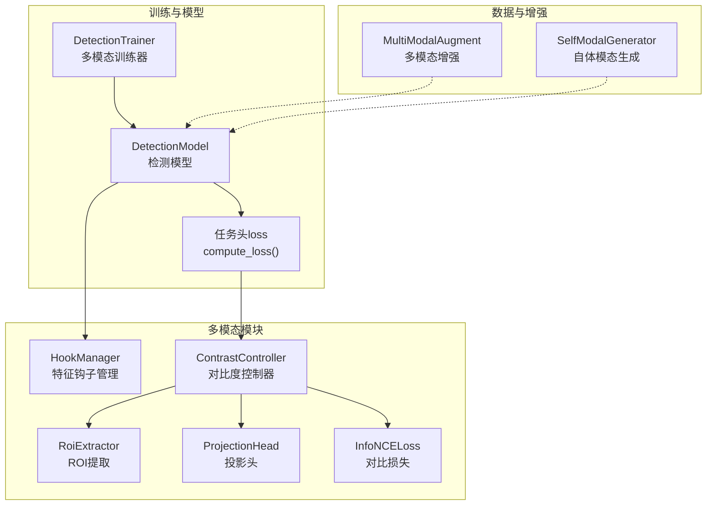
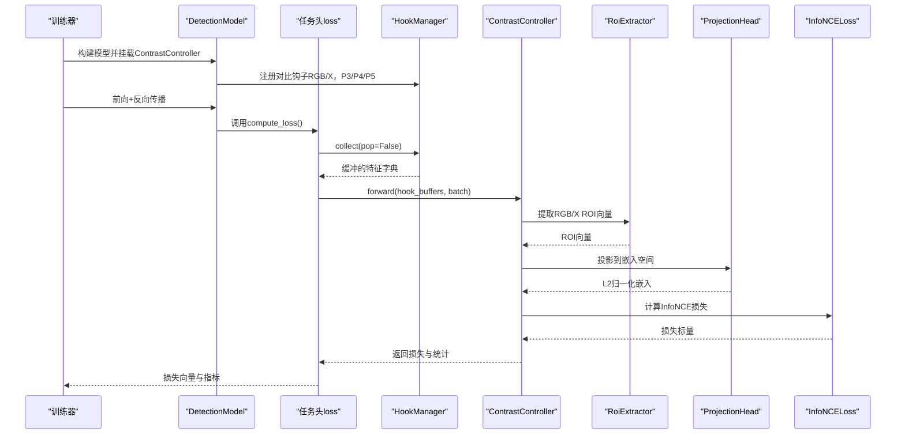
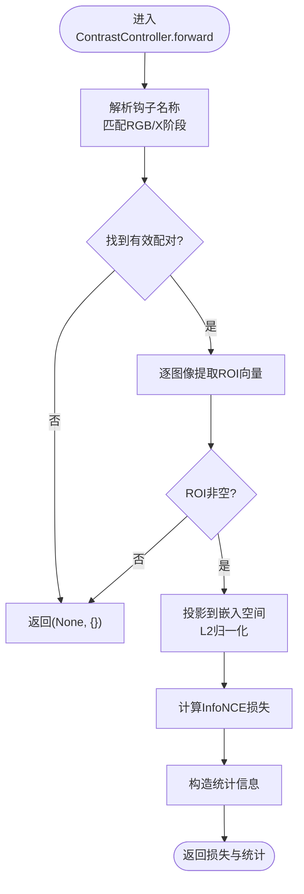
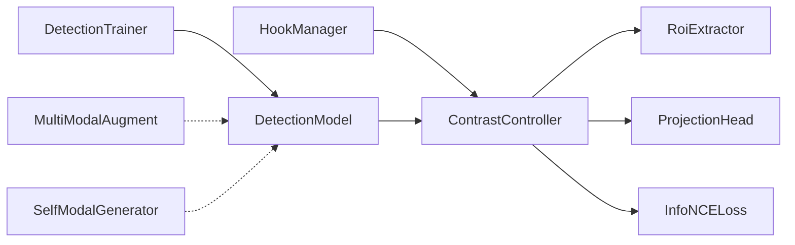

# 对比度控制器

<cite>
**本文引用的文件**
- [contrast.py](file://ultralytics/nn/mm/contrast.py)
- [tasks.py](file://ultralytics/nn/tasks.py)
- [train.py](file://ultralytics/models/yolo/multimodal/train.py)
- [self_modal_generator.py](file://ultralytics/models/yolo/multimodal/self_modal_generator.py)
- [multimodal_augment.py](file://ultralytics/data/multimodal_augment.py)
- [hook.py](file://ultralytics/nn/mm/hook.py)
</cite>

## 目录
1. [简介](#简介)
2. [项目结构](#项目结构)
3. [核心组件](#核心组件)
4. [架构总览](#架构总览)
5. [详细组件分析](#详细组件分析)
6. [依赖关系分析](#依赖关系分析)
7. [性能考量](#性能考量)
8. [故障排查指南](#故障排查指南)
9. [结论](#结论)
10. [附录](#附录)

## 简介
本技术文档聚焦于多模态检测框架中的对比度控制器（ContrastController）。该控制器通过在RGB与X模态的特征空间中提取ROI向量，经投影头映射到统一嵌入空间，再使用InfoNCE损失实现跨模态对比学习，从而提升多模态特征的一致性与判别能力。文档将深入解析其算法原理、自适应控制策略、质量优化机制，以及在多模态处理中的作用、参数与效果评估方法，并提供使用示例与与其他模态处理模块的集成方式。

## 项目结构
对比度控制器位于多模态模块的mm子包中，配合HookManager进行特征采集，由DetectionModel在训练阶段通过任务头loss函数集成。相关文件组织如下：
- 对比度控制器与损失：ultralytics/nn/mm/contrast.py
- 训练阶段集成与参数注入：ultralytics/nn/tasks.py
- 多模态训练器挂载控制器：ultralytics/models/yolo/multimodal/train.py
- 自体模态生成（边缘/纹理/梯度）：ultralytics/models/yolo/multimodal/self_modal_generator.py
- 多模态数据增强（HSV/Gamma/CLAHE等）：ultralytics/data/multimodal_augment.py
- 特征钩子管理：ultralytics/nn/mm/hook.py

**图表来源**
- [contrast.py:149-290](file://ultralytics/nn/mm/contrast.py#L149-L290)
- [tasks.py:1120-1167](file://ultralytics/nn/tasks.py#L1120-L1167)
- [train.py:70-93](file://ultralytics/models/yolo/multimodal/train.py#L70-L93)
- [hook.py:172-310](file://ultralytics/nn/mm/hook.py#L172-L310)
- [multimodal_augment.py:1-200](file://ultralytics/data/multimodal_augment.py#L1-L200)
- [self_modal_generator.py:1-100](file://ultralytics/models/yolo/multimodal/self_modal_generator.py#L1-L100)

**章节来源**
- [contrast.py:1-290](file://ultralytics/nn/mm/contrast.py#L1-L290)
- [tasks.py:1120-1167](file://ultralytics/nn/tasks.py#L1120-L1167)
- [train.py:70-93](file://ultralytics/models/yolo/multimodal/train.py#L70-L93)
- [hook.py:1-310](file://ultralytics/nn/mm/hook.py#L1-L310)
- [multimodal_augment.py:1-200](file://ultralytics/data/multimodal_augment.py#L1-L200)
- [self_modal_generator.py:1-100](file://ultralytics/models/yolo/multimodal/self_modal_generator.py#L1-L100)

## 核心组件
- ContrastController：负责从HookManager收集的RGB/X特征中提取ROI向量，投影到统一嵌入空间，计算InfoNCE损失，并输出统计信息。
- RoiExtractor：基于GT框在特征图上进行平均池化提取ROI向量，支持最大数量限制与批内索引匹配。
- ProjectionHead：两层MLP投影头，支持延迟初始化与FP32数值稳定，输出L2归一化嵌入。
- InfoNCELoss：对称NT-Xent损失，温度参数控制相似度分布锐度。
- HookManager：注册与命名稳定的特征钩子，自动缓冲最新特征，供ContrastController采集。
- ContrastConfig：对比度控制的超参数集合，包括温度、投影维度、权重、最大ROI数、共享头、优选特征阶段等。

**章节来源**
- [contrast.py:39-290](file://ultralytics/nn/mm/contrast.py#L39-L290)
- [hook.py:172-310](file://ultralytics/nn/mm/hook.py#L172-L310)

## 架构总览
ContrastController在训练阶段通过DetectionModel的任务头loss函数被调用，先从HookManager收集RGB与X模态在多个特征阶段（如P3/P4/P5）的特征，再按批次匹配GT框提取ROI向量，经投影头得到嵌入，最后计算InfoNCE损失并返回。该过程与多模态路由、早期/中期/晚期融合策略协同工作，提升跨模态一致性。

**图表来源**
- [tasks.py:1120-1167](file://ultralytics/nn/tasks.py#L1120-L1167)
- [contrast.py:189-290](file://ultralytics/nn/mm/contrast.py#L189-L290)
- [hook.py:270-310](file://ultralytics/nn/mm/hook.py#L270-L310)

**章节来源**
- [tasks.py:1120-1167](file://ultralytics/nn/tasks.py#L1120-L1167)
- [contrast.py:149-290](file://ultralytics/nn/mm/contrast.py#L149-L290)
- [hook.py:172-310](file://ultralytics/nn/mm/hook.py#L172-L310)

## 详细组件分析

### ContrastController算法与自适应策略
- 特征配对与阶段选择：根据钩子名称解析模态（RGB/X）与特征阶段（P3/P4/P5），优先使用用户配置的首选阶段，否则选择首个同时包含RGB与X的阶段。
- ROI提取：对每个图像，依据batch_idx与bboxes在对应特征图上提取ROI向量，限制每图最大ROI数，保证RGB与X的对应性。
- 投影与归一化：两路特征分别通过投影头映射到统一维度的L2归一化嵌入，使用FP32以提升数值稳定性。
- 对比损失：对称NT-Xent（InfoNCE）计算，温度参数控制相似度锐度；若无有效正样本对，返回None，交由调用方决定是否加入对比损失。
- 统计输出：包含所选阶段、正样本对数、平均相似度，便于日志与可视化。

**图表来源**
- [contrast.py:160-290](file://ultralytics/nn/mm/contrast.py#L160-L290)

**章节来源**
- [contrast.py:149-290](file://ultralytics/nn/mm/contrast.py#L149-L290)

### ROI提取器（RoiExtractor）
- 输入：特征图、归一化xywh框、批内索引、最大ROI数。
- 转换：将归一化框转为特征坐标系的xyxy，四舍五入取整，确保最小1x1区域。
- 池化：对每个ROI区域执行平均池化，得到通道维向量。
- 安全性：空框返回零张量；支持批量索引筛选。

**章节来源**
- [contrast.py:39-98](file://ultralytics/nn/mm/contrast.py#L39-L98)

### 投影头（ProjectionHead）
- 结构：两层线性层+ReLU，第一层延迟初始化，第二层输出目标维度。
- 数值稳定：在AMP下切换到FP32计算，避免数值不稳定。
- 归一化：输出L2归一化嵌入，利于对比学习。

**章节来源**
- [contrast.py:100-116](file://ultralytics/nn/mm/contrast.py#L100-L116)

### InfoNCE损失（InfoNCELoss）
- 对称NT-Xent：同时考虑z1→z2与z2→z1的交叉熵，取平均。
- 温度参数：控制相似度分布的锐度，影响对比学习的判别性。
- 空输入处理：任一路为空则返回零损失，避免异常。

**章节来源**
- [contrast.py:118-137](file://ultralytics/nn/mm/contrast.py#L118-L137)

### HookManager与特征采集
- 命名规范：CL.{模态}.{阶段}.L{层索引}.{tap}，支持同层多钩子自动编号。
- 缓冲策略：每次前向仅保留最新特征，避免内存膨胀。
- 数值护栏：捕获时将NaN/Inf替换为有限值，防止污染对比分支。

**章节来源**
- [hook.py:172-310](file://ultralytics/nn/mm/hook.py#L172-L310)

### 训练集成与参数注入
- 训练器在构建模型后检查是否存在对比钩子，若有则创建ContrastController并注入到模型。
- 参数从命令行args读取，支持温度、投影维度、权重、最大ROI数、共享头、优选阶段等。
- 任务头loss中调用ContrastController，将对比损失按权重叠加到检测损失向量。

**章节来源**
- [train.py:70-93](file://ultralytics/models/yolo/multimodal/train.py#L70-L93)
- [tasks.py:1120-1167](file://ultralytics/nn/tasks.py#L1120-L1167)

### 多模态增强与对比度控制的关系
- 多模态增强（HSV/Gamma/CLAHE）主要针对RGB通道，避免对X模态（如深度、热红外）施加不合适的颜色变换。
- 对比度控制器关注特征空间的跨模态一致性，二者互补：前者改善输入域对比度与多样性，后者提升特征域判别力。

**章节来源**
- [multimodal_augment.py:1-200](file://ultralytics/data/multimodal_augment.py#L1-L200)

### 自体模态生成与对比度控制的协同
- 自体模态生成器可从RGB生成边缘、纹理、梯度等辅助模态，用于自体多模态目标检测。
- 对比度控制器与自体模态生成在不同层面发挥作用：前者强调跨模态一致性，后者强调单模态特征表达。

**章节来源**
- [self_modal_generator.py:1-100](file://ultralytics/models/yolo/multimodal/self_modal_generator.py#L1-L100)

## 依赖关系分析
- ContrastController依赖HookManager提供的特征缓冲，依赖RoiExtractor进行ROI向量提取，依赖ProjectionHead进行嵌入投影，依赖InfoNCELoss计算对比损失。
- DetectionModel在任务头loss中调用ContrastController，训练器在模型构建阶段挂载控制器。
- 多模态增强与自体模态生成作为数据侧增强手段，与对比度控制器在不同阶段协同。

**图表来源**
- [contrast.py:149-290](file://ultralytics/nn/mm/contrast.py#L149-L290)
- [tasks.py:1120-1167](file://ultralytics/nn/tasks.py#L1120-L1167)
- [train.py:70-93](file://ultralytics/models/yolo/multimodal/train.py#L70-L93)
- [hook.py:172-310](file://ultralytics/nn/mm/hook.py#L172-L310)
- [multimodal_augment.py:1-200](file://ultralytics/data/multimodal_augment.py#L1-L200)
- [self_modal_generator.py:1-100](file://ultralytics/models/yolo/multimodal/self_modal_generator.py#L1-L100)

**章节来源**
- [contrast.py:149-290](file://ultralytics/nn/mm/contrast.py#L149-L290)
- [tasks.py:1120-1167](file://ultralytics/nn/tasks.py#L1120-L1167)
- [train.py:70-93](file://ultralytics/models/yolo/multimodal/train.py#L70-L93)
- [hook.py:172-310](file://ultralytics/nn/mm/hook.py#L172-L310)

## 性能考量
- 数值稳定性：投影与损失计算在FP32下进行，避免AMP导致的数值不稳定。
- 设备与参数初始化：控制器在首次调用前创建并放置到模型参数所在设备，避免CPU/CUDA不一致。
- 内存与时间：ROI提取与投影在GPU上进行；钩子缓冲仅保留最新特征，避免累积。
- 超参数影响：温度参数影响相似度分布锐度，投影维度影响嵌入容量，最大ROI数影响计算量与正样本多样性。

[本节为通用性能讨论，无需特定文件来源]

## 故障排查指南
- 非有限特征：钩子捕获与ROI向量、投影嵌入、对比损失均进行非有限性检查，发现NaN/Inf会记录告警。
- 无有效配对：若未找到RGB/X配对或特征维度不匹配，返回None，需检查钩子配置与模型融合策略。
- 设备不一致：确保控制器与模型参数在同一设备；训练器会在构建模型时尝试定位设备。
- 日志与统计：对比损失与统计信息可用于监控训练稳定性与跨模态一致性。

**章节来源**
- [contrast.py:189-290](file://ultralytics/nn/mm/contrast.py#L189-L290)
- [tasks.py:1145-1167](file://ultralytics/nn/tasks.py#L1145-L1167)
- [hook.py:104-154](file://ultralytics/nn/mm/hook.py#L104-L154)

## 结论
对比度控制器通过在RGB与X模态特征空间中建立一致的嵌入表示，显著增强了多模态检测的跨模态一致性与判别能力。其自适应策略基于钩子命名解析与阶段优选，结合ROI提取与投影归一化，实现了高效稳定的对比学习。配合多模态增强与自体模态生成，可在输入域与特征域双重提升模型表现。建议在实际部署中合理设置温度、投影维度与最大ROI数，并结合统计指标持续评估对比学习效果。

[本节为总结性内容，无需特定文件来源]

## 附录

### 使用示例与参数调优
- 在训练配置中启用对比度控制：通过命令行参数设置温度、投影维度、权重、最大ROI数、共享头、优选阶段等。
- 示例路径（参数注入）：[train.py:70-93](file://ultralytics/models/yolo/multimodal/train.py#L70-L93)，[tasks.py:1120-1167](file://ultralytics/nn/tasks.py#L1120-L1167)
- 示例路径（控制器实现）：[contrast.py:149-290](file://ultralytics/nn/mm/contrast.py#L149-L290)
- 示例路径（钩子管理）：[hook.py:172-310](file://ultralytics/nn/mm/hook.py#L172-L310)

### 质量提升建议
- 合理设置温度参数：较小温度使相似度更锐利，但可能降低鲁棒性；较大温度更平滑但判别力下降。
- 投影维度：在计算预算允许下适当增大，提升嵌入表达能力。
- 最大ROI数：平衡正样本多样性与计算开销，避免过少导致样本不足，过多导致噪声增加。
- 优选阶段：优先选择包含RGB与X且特征丰富的阶段，如P4/P5。

[本节为通用建议，无需特定文件来源]