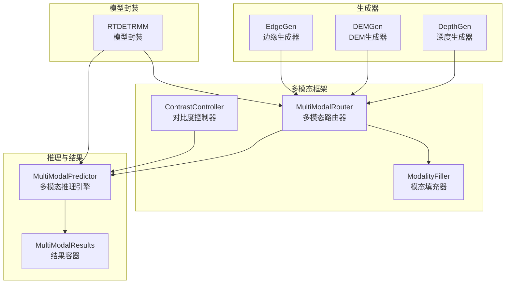
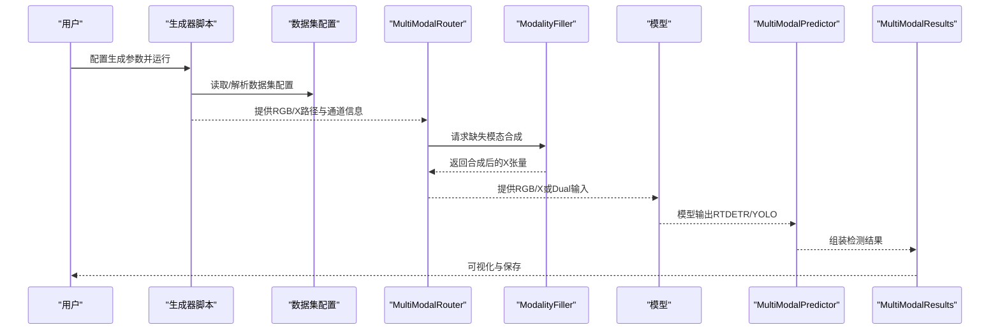
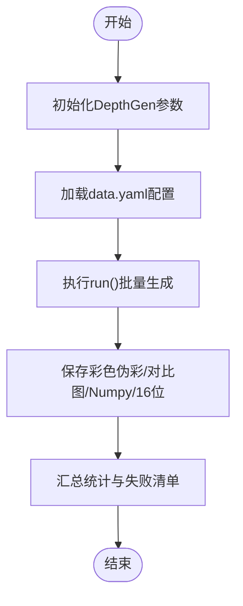
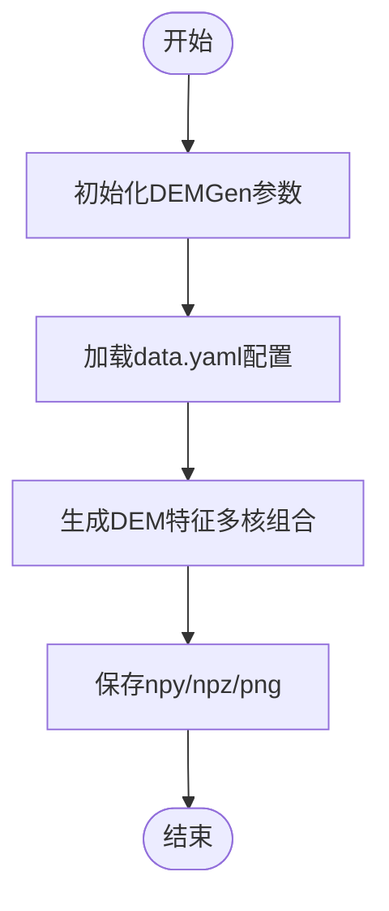
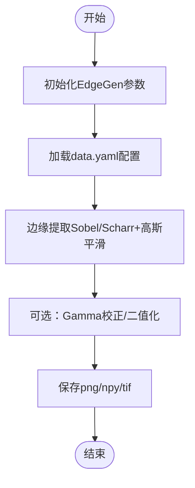
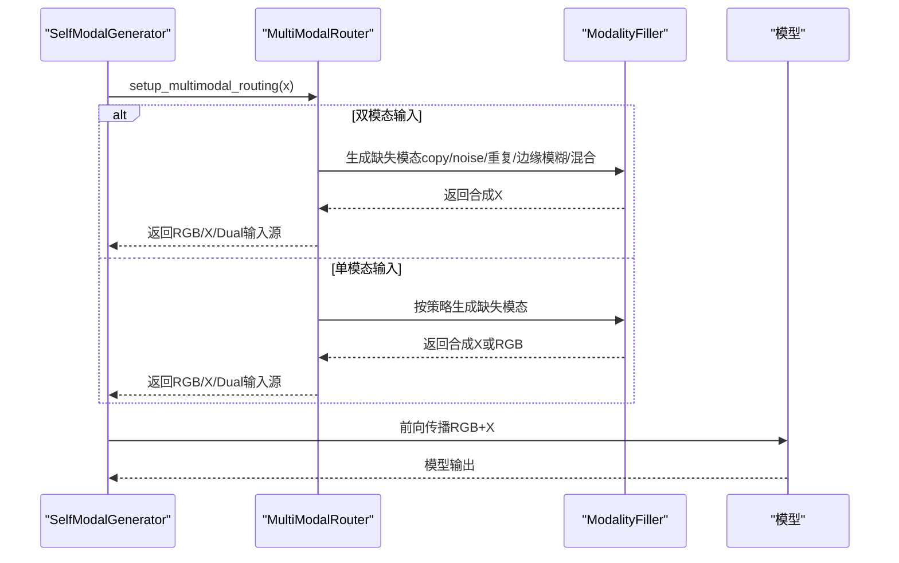
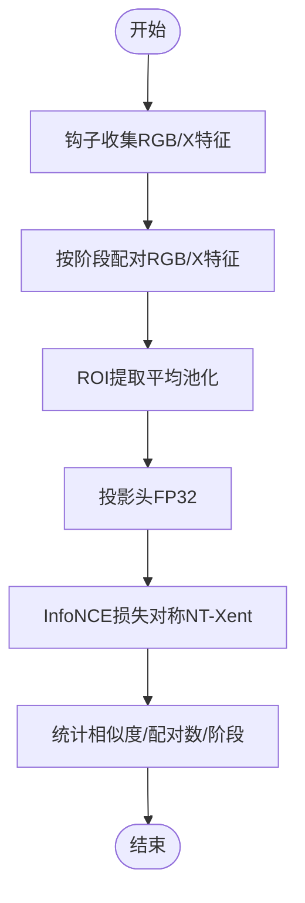
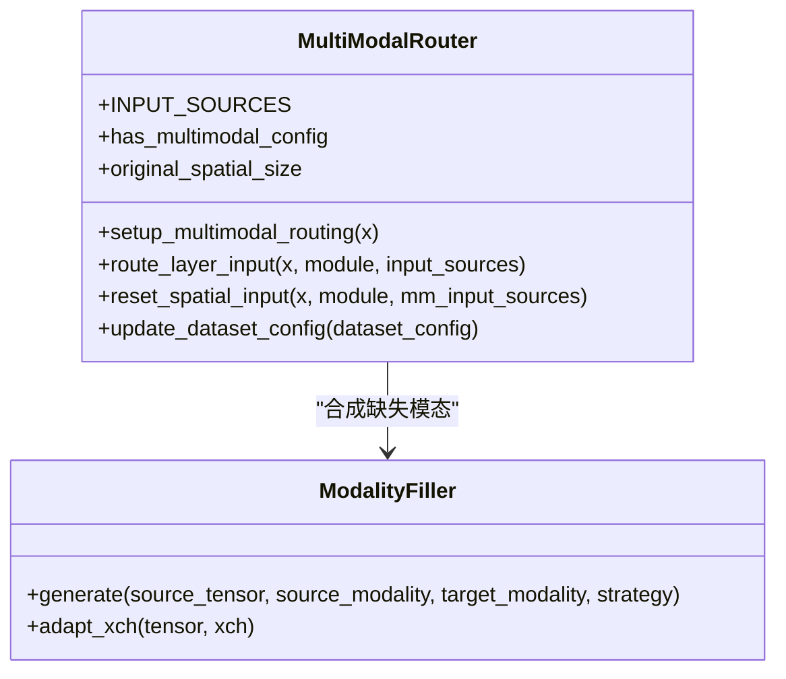
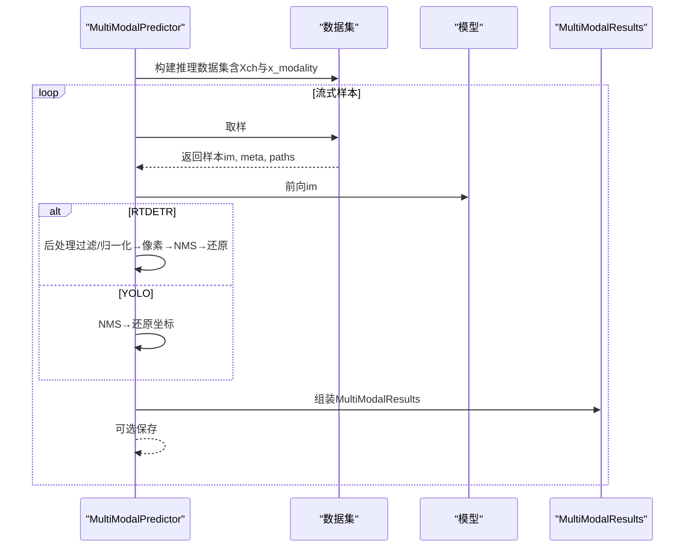
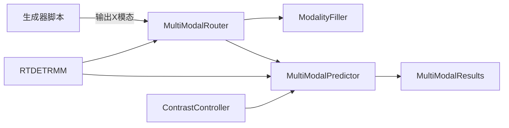

# 模态生成器

<cite>
**本文档引用的文件**   
- [ultralytics\nn\mm\generators\__init__.py](file://ultralytics\nn\mm\generators\__init__.py)
- [depthGen.py](file://depthGen.py)
- [edgeGen.py](file://edgeGen.py)
- [DEMGen.py](file://DEMGen.py)
- [ultralytics\nn\mm\router.py](file://ultralytics\nn\mm\router.py)
- [ultralytics\nn\mm\filling.py](file://ultralytics\nn\mm\filling.py)
- [ultralytics\nn\mm\contrast.py](file://ultralytics\nn\mm\contrast.py)
- [ultralytics\engine\multimodal\predictor.py](file://ultralytics\engine\multimodal\predictor.py)
- [ultralytics\engine\multimodal\results.py](file://ultralytics\engine\multimodal\results.py)
- [ultralytics\models\rtdetrmm\model.py](file://ultralytics\models\rtdetrmm\model.py)
- [ultralytics\nn\mm\utils.py](file://ultralytics\nn\mm\utils.py)
</cite>

## 目录
1. [引言](#引言)
2. [项目结构](#项目结构)
3. [核心组件](#核心组件)
4. [架构总览](#架构总览)
5. [详细组件分析](#详细组件分析)
6. [依赖分析](#依赖分析)
7. [性能考虑](#性能考虑)
8. [故障排查指南](#故障排查指南)
9. [结论](#结论)
10. [附录](#附录)

## 引言
本文件面向模态生成器组件群，系统化阐述其基础架构、生成算法与质量控制机制。重点覆盖以下方面：
- 深度生成器（DepthGen）、DEM生成器（DEMGen）、边缘生成器（EdgeGen）的实现原理与技术特点
- SelfModalGenerator（自体模态生成器）工作流程与配置参数
- 对比度控制系统（ContrastController）在多模态学习中的作用
- 多模态路由器（MultiModalRouter）与填充器（ModalityFiller）的协同机制
- 生成器扩展与自定义开发方法
- 具体使用示例与质量评估路径

## 项目结构
模态生成器相关代码主要分布在以下模块：
- 生成器入口与实现：ultralytics\nn\mm\generators\__init__.py
- 离线生成脚本：depthGen.py、edgeGen.py、DEMGen.py
- 多模态路由与填充：ultralytics\nn\mm\router.py、ultralytics\nn\mm\filling.py
- 对比度控制：ultralytics\nn\mm\contrast.py
- 推理引擎与结果容器：ultralytics\engine\multimodal\predictor.py、ultralytics\engine\multimodal\results.py
- RTDETRMM模型封装：ultralytics\models\rtdetrmm\model.py
- 工具函数：ultralytics\nn\mm\utils.py

**图表来源**
- [ultralytics\nn\mm\generators\__init__.py:1-15](file://ultralytics\nn\mm\generators\__init__.py#L1-L15)
- [ultralytics\nn\mm\router.py:11-471](file://ultralytics\nn\mm\router.py#L11-L471)
- [ultralytics\nn\mm\filling.py:14-175](file://ultralytics\nn\mm\filling.py#L14-L175)
- [ultralytics\nn\mm\contrast.py:149-290](file://ultralytics\nn\mm\contrast.py#L149-L290)
- [ultralytics\engine\multimodal\predictor.py:16-494](file://ultralytics\engine\multimodal\predictor.py#L16-L494)
- [ultralytics\engine\multimodal\results.py:14-357](file://ultralytics\engine\multimodal\results.py#L14-L357)
- [ultralytics\models\rtdetrmm\model.py:25-269](file://ultralytics\models\rtdetrmm\model.py#L25-L269)

**章节来源**
- [ultralytics\nn\mm\generators\__init__.py:1-15](file://ultralytics\nn\mm\generators\__init__.py#L1-L15)
- [ultralytics\nn\mm\router.py:11-471](file://ultralytics\nn\mm\router.py#L11-L471)
- [ultralytics\nn\mm\filling.py:14-175](file://ultralytics\nn\mm\filling.py#L14-L175)
- [ultralytics\nn\mm\contrast.py:149-290](file://ultralytics\nn\mm\contrast.py#L149-L290)
- [ultralytics\engine\multimodal\predictor.py:16-494](file://ultralytics\engine\multimodal\predictor.py#L16-L494)
- [ultralytics\engine\multimodal\results.py:14-357](file://ultralytics\engine\multimodal\results.py#L14-L357)
- [ultralytics\models\rtdetrmm\model.py:25-269](file://ultralytics\models\rtdetrmm\model.py#L25-L269)

## 核心组件
- 生成器入口与导出：通过 generators\__init__.py 暴露 DepthGen、DEMGen、EdgeGen，统一对外接口。
- 多模态路由器（MultiModalRouter）：零拷贝张量路由，支持 RGB/X/Dual 三种输入形态，具备“X 模态新输入起点”与空间重置能力。
- 模态填充器（ModalityFiller）：提供 copy/noise/channel_repeat/edge_blur/mixed 等策略，保证缺失模态合成的一致性与确定性。
- 对比度控制器（ContrastController）：基于 ROI 提取与投影头计算 InfoNCE 损失，支持阶段选择与统计监控。
- 推理引擎（MultiModalPredictor）：独立于 BasePredictor 的推理核心，支持流式推理与 RTDETR/YOLO 后处理分支。
- 结果容器（MultiModalResults）：统一的检测结果存储与可视化接口，支持 RGB/X 合并图绘制。

**章节来源**
- [ultralytics\nn\mm\generators\__init__.py:6-14](file://ultralytics\nn\mm\generators\__init__.py#L6-L14)
- [ultralytics\nn\mm\router.py:11-471](file://ultralytics\nn\mm\router.py#L11-L471)
- [ultralytics\nn\mm\filling.py:14-175](file://ultralytics\nn\mm\filling.py#L14-L175)
- [ultralytics\nn\mm\contrast.py:149-290](file://ultralytics\nn\mm\contrast.py#L149-L290)
- [ultralytics\engine\multimodal\predictor.py:16-494](file://ultralytics\engine\multimodal\predictor.py#L16-L494)
- [ultralytics\engine\multimodal\results.py:14-357](file://ultralytics\engine\multimodal\results.py#L14-L357)

## 架构总览
多模态生成器与推理链路如下：
- 生成器负责离线生成深度/DEM/边缘等模态数据，写入指定目录
- 多模态路由器根据 YAML/ckpt 内容识别路由标记，推断输入通道与可用模态集合
- ModalityFiller 在运行时按策略合成缺失模态，确保通道一致性
- ContrastController 在模型损失阶段抽取 ROI 向量，计算对比损失
- MultiModalPredictor 执行推理，区分 RTDETR 与 YOLO 的后处理路径
- MultiModalResults 统一封装结果并支持可视化与保存

**图表来源**
- [depthGen.py:1-24](file://depthGen.py#L1-L24)
- [edgeGen.py:1-46](file://edgeGen.py#L1-L46)
- [DEMGen.py:1-42](file://DEMGen.py#L1-L42)
- [ultralytics\nn\mm\router.py:157-240](file://ultralytics\nn\mm\router.py#L157-L240)
- [ultralytics\nn\mm\filling.py:34-118](file://ultralytics\nn\mm\filling.py#L34-L118)
- [ultralytics\engine\multimodal\predictor.py:99-243](file://ultralytics\engine\multimodal\predictor.py#L99-L243)
- [ultralytics\engine\multimodal\results.py:436-464](file://ultralytics\engine\multimodal\results.py#L436-L464)

## 详细组件分析

### 深度生成器（DepthGen）
- 功能定位：离线生成深度模态（Depth），支持彩色伪彩、对比图、Numpy/16位原始等保存选项
- 典型参数
  - 权重路径、设备、保存目录、对比图开关、Numpy/彩色/16位开关、数据划分、批大小、进程数
- 使用要点
  - 通过 run(data.yaml) 批量生成，自动解析数据集路径与切分
  - 生成统计包含成功/失败计数与失败清单
- 质量控制
  - 保存对比图便于人工核查
  - 支持批量失败记录，便于后续重试与定位

**图表来源**
- [depthGen.py:3-23](file://depthGen.py#L3-L23)

**章节来源**
- [depthGen.py:1-24](file://depthGen.py#L1-L24)

### DEM生成器（DEMGen）
- 功能定位：离线生成DEM特征（6通道），支持多种保存格式
- 典型参数
  - 源模态、设备、保存目录、数据划分、保存格式、批大小、进程数
  - 生成参数：高斯核、Sobel核、粗糙度核、局部差分核、是否使用Scharr
- 使用要点
  - 训练/推理时需在数据集配置中设置 Xch=6
  - 与 edgeGen/depthGen 参数风格一致，便于统一管理

**图表来源**
- [DEMGen.py:19-41](file://DEMGen.py#L19-L41)

**章节来源**
- [DEMGen.py:1-42](file://DEMGen.py#L1-L42)

### 边缘生成器（EdgeGen）
- 功能定位：离线生成边缘模态（Sobel/Scharr），支持灰度/三通道输出与二值化
- 典型参数
  - 源模态、设备、保存目录、数据划分、保存格式、输出通道（1/3）、批大小、进程数
  - 算法参数：高斯核、Sobel核、是否Scharr、归一化、Gamma、二值化阈值
- 使用要点
  - 训练/推理时可在数据集配置中设置 Xch=1 或 3
  - 与 RT-DETRMM/多模态路由配合良好

**图表来源**
- [edgeGen.py:20-45](file://edgeGen.py#L20-L45)

**章节来源**
- [edgeGen.py:1-46](file://edgeGen.py#L1-L46)

### SelfModalGenerator（自体模态生成器）
- 工作流程
  - 依据当前模态（RGB/X）与运行时策略，调用 ModalityFiller 生成缺失模态
  - 通过 MultiModalRouter 的 setup_multimodal_routing 完成通道拼接与空间重置
  - 保证 RGB+X 的标准顺序，避免通道错位导致训练/推理不一致
- 关键点
  - 支持 runtime_modality 控制（rgb/x/None）
  - 支持 runtime_strategy 与随机策略权重
  - 与 adapt_xch 保证 Xch 通道一致性

**图表来源**
- [ultralytics\nn\mm\router.py:157-240](file://ultralytics\nn\mm\router.py#L157-L240)
- [ultralytics\nn\mm\filling.py:34-118](file://ultralytics\nn\mm\filling.py#L34-L118)

**章节来源**
- [ultralytics\nn\mm\router.py:157-240](file://ultralytics\nn\mm\router.py#L157-L240)
- [ultralytics\nn\mm\filling.py:14-175](file://ultralytics\nn\mm\filling.py#L14-L175)

### 对比度控制系统（ContrastController）
- 组件构成
  - ROI 提取器：按 GT 框在特征图上平均池化提取区域向量
  - 投影头：两层MLP，首调 LazyLinear，FP32 数值稳定
  - InfoNCE 损失：对称 NT-Xent，温度系数 tau
  - 对比度控制器：钩子收集特征 → ROI → 投影 → 损失，支持阶段选择与统计
- 工作流程
  - 从钩子缓冲区按阶段（P3/P4/P5）配对 RGB 与 X 特征
  - 提取 ROI 向量，经投影头归一化嵌入，计算 InfoNCE 损失
  - 统计相似度均值、配对数量、所选阶段

**图表来源**
- [ultralytics\nn\mm\contrast.py:149-290](file://ultralytics\nn\mm\contrast.py#L149-L290)

**章节来源**
- [ultralytics\nn\mm\contrast.py:149-290](file://ultralytics\nn\mm\contrast.py#L149-L290)

### 多模态路由器（MultiModalRouter）
- 路由策略
  - 输入形态识别：Dual（3+Xch）或单模态（RGB=3）
  - “X 模态新输入起点”：从 X 层起始时直接使用 X 输入，触发空间重置
  - 零拷贝张量视图：缓存原始输入，避免不必要的复制
- 关键接口
  - setup_multimodal_routing：初始化 RGB/X/Dual 输入源
  - route_layer_input：按模块属性路由到指定模态
  - reset_spatial_input：在需要时将 X 模态恢复到原始空间尺寸
  - update_dataset_config：动态更新 Xch 与 X 模态类型

**图表来源**
- [ultralytics\nn\mm\router.py:11-471](file://ultralytics\nn\mm\router.py#L11-L471)
- [ultralytics\nn\mm\filling.py:14-175](file://ultralytics\nn\mm\filling.py#L14-L175)

**章节来源**
- [ultralytics\nn\mm\router.py:11-471](file://ultralytics\nn\mm\router.py#L11-L471)
- [ultralytics\nn\mm\filling.py:14-175](file://ultralytics\nn\mm\filling.py#L14-L175)

### 推理引擎与结果容器（MultiModalPredictor / MultiModalResults）
- MultiModalPredictor
  - 从模型读取 mm_router 配置，解析 X 模态类型与通道数
  - 构建推理数据集，支持流式推理（边迭代边 yield）
  - RTDETR 与 YOLO 后处理分支：归一化 cxcywh → 像素 xyxy → 原图坐标还原
- MultiModalResults
  - 统一存储 boxes、paths、orig_imgs、meta
  - 可视化：始终输出 RGB；当 xch∈{1,3} 时可输出 X
  - 支持并排合并图（RGB+X）

**图表来源**
- [ultralytics\engine\multimodal\predictor.py:99-494](file://ultralytics\engine\multimodal\predictor.py#L99-L494)
- [ultralytics\engine\multimodal\results.py:436-464](file://ultralytics\engine\multimodal\results.py#L436-L464)

**章节来源**
- [ultralytics\engine\multimodal\predictor.py:16-494](file://ultralytics\engine\multimodal\predictor.py#L16-L494)
- [ultralytics\engine\multimodal\results.py:14-357](file://ultralytics\engine\multimodal\results.py#L14-L357)

### RTDETRMM 模型封装
- 职责
  - 基于 YAML/ckpt 内容严格判据识别多模态结构，Fail-Fast
  - 解析输入通道与可用模态集合，确保 mm_router 可用
  - 提供 vis/cocoval/val 等高级接口
- 关键点
  - 通过 require_multimodal 与 _ensure_mm_router 保障路由可用
  - 默认 rect=False 以避免 RT-DETR 在非方形输入下的 bbox 缩放偏差

**章节来源**
- [ultralytics\models\rtdetrmm\model.py:25-269](file://ultralytics\models\rtdetrmm\model.py#L25-L269)

## 依赖分析
- 生成器与路由器
  - 生成器脚本通过 ultralytics 导出的 DepthGen/DEMGen/EdgeGen 使用
  - 生成的数据由 MultiModalRouter 路由到 RGB/X/Dual 输入
- 路由器与填充器
  - MultiModalRouter 在运行时调用 ModalityFiller 生成缺失模态
  - adapt_xch 保证通道一致性（3↔1/通用投影）
- 对比度控制与推理
  - ContrastController 在模型损失阶段工作，与 MultiModalPredictor 的推理解耦
- 模型封装与工具
  - RTDETRMM 通过 utils.require_multimodal 与 router.update_dataset_config 等工具函数保障配置正确性

**图表来源**
- [ultralytics\nn\mm\generators\__init__.py:6-14](file://ultralytics\nn\mm\generators\__init__.py#L6-L14)
- [ultralytics\nn\mm\router.py:157-240](file://ultralytics\nn\mm\router.py#L157-L240)
- [ultralytics\nn\mm\filling.py:14-175](file://ultralytics\nn\mm\filling.py#L14-L175)
- [ultralytics\engine\multimodal\predictor.py:16-494](file://ultralytics\engine\multimodal\predictor.py#L16-L494)
- [ultralytics\engine\multimodal\results.py:14-357](file://ultralytics\engine\multimodal\results.py#L14-L357)
- [ultralytics\models\rtdetrmm\model.py:25-269](file://ultralytics\models\rtdetrmm\model.py#L25-L269)
- [ultralytics\nn\mm\contrast.py:149-290](file://ultralytics\nn\mm\contrast.py#L149-L290)

**章节来源**
- [ultralytics\nn\mm\generators\__init__.py:1-15](file://ultralytics\nn\mm\generators\__init__.py#L1-L15)
- [ultralytics\nn\mm\router.py:11-471](file://ultralytics\nn\mm\router.py#L11-L471)
- [ultralytics\nn\mm\filling.py:14-175](file://ultralytics\nn\mm\filling.py#L14-L175)
- [ultralytics\engine\multimodal\predictor.py:16-494](file://ultralytics\engine\multimodal\predictor.py#L16-L494)
- [ultralytics\engine\multimodal\results.py:14-357](file://ultralytics\engine\multimodal\results.py#L14-L357)
- [ultralytics\models\rtdetrmm\model.py:25-269](file://ultralytics\models\rtdetrmm\model.py#L25-L269)
- [ultralytics\nn\mm\contrast.py:149-290](file://ultralytics\nn\mm\contrast.py#L149-L290)

## 性能考虑
- 零拷贝路由：MultiModalRouter 采用张量视图缓存，减少内存与拷贝开销
- 轻量化填充策略：ModalityFiller 的策略权重可调，兼顾速度与稳定性
- 批处理与并行：生成器脚本支持 batch_size 与 num_workers，提升吞吐
- 推理优化：MultiModalPredictor 支持流式推理，降低延迟；RTDETR 后处理分支针对查询数与归一化坐标进行优化
- 数值稳定性：ContrastController 在投影与损失计算中强制 FP32，避免 AMP 导致的数值问题

## 故障排查指南
- 路由器初始化失败
  - 检查模型 YAML 是否包含多模态层标记（第5字段为 RGB/X/Dual）
  - 使用 utils.validate_mm_config_format 与 utils.check_mm_model_attributes 校验配置与模型属性
- 输入通道不匹配
  - 确认数据集配置中的 Xch 与实际生成模态通道一致
  - 使用 adapt_xch 进行通道适配
- 推理结果异常
  - RTDETR 默认 rect=False，避免非方形输入导致的缩放偏差
  - 检查 MultiModalPredictor 的后处理分支与坐标还原参数
- 对比度损失异常
  - 检查钩子特征是否有限（NaN/Inf），必要时调整 ROI 数量与温度系数
- 生成失败
  - 查看生成器统计中的失败清单，定位具体样本与错误原因

**章节来源**
- [ultralytics\nn\mm\utils.py:8-93](file://ultralytics\nn\mm\utils.py#L8-L93)
- [ultralytics\nn\mm\router.py:448-471](file://ultralytics\nn\mm\router.py#L448-L471)
- [ultralytics\engine\multimodal\predictor.py:224-234](file://ultralytics\engine\multimodal\predictor.py#L224-L234)
- [ultralytics\nn\mm\contrast.py:189-290](file://ultralytics\nn\mm\contrast.py#L189-L290)
- [depthGen.py:18-23](file://depthGen.py#L18-L23)
- [edgeGen.py:40-45](file://edgeGen.py#L40-L45)
- [DEMGen.py:36-41](file://DEMGen.py#L36-L41)

## 结论
该模态生成器组件群以 MultiModalRouter 为核心，结合 ModalityFiller 与生成器脚本，实现了 RGB+X 的高效、可扩展多模态数据管线。ContrastController 提供了稳健的对比学习质量控制，MultiModalPredictor 与 MultiModalResults 则保证了端到端的推理与可视化体验。通过合理的参数配置与质量控制手段，可在不同任务场景下获得稳定可靠的多模态检测性能。

## 附录
- 使用示例路径
  - 深度生成：[depthGen.py:3-23](file://depthGen.py#L3-L23)
  - DEM 生成：[DEMGen.py:19-41](file://DEMGen.py#L19-L41)
  - 边缘生成：[edgeGen.py:20-45](file://edgeGen.py#L20-L45)
- 配置参数参考
  - 生成器通用参数：设备、保存目录、数据划分、批大小、进程数、算法参数
  - 多模态路由参数：Xch、x_modality、运行时策略（runtime_modality/runtime_strategy）
  - 对比度控制参数：tau、投影维度、正样本权重、最大ROI数、阶段偏好
- 评估与可视化
  - MultiModalResults.plot/plot_merged 支持 RGB 与 RGB+X 可视化
  - RTDETRMM 提供 cocoval 接口，支持 COCO 标准指标