# 自体模态生成器

<cite>
**本文档引用的文件**
- [self_modal_generator.py](file://ultralytics/models/yolo/multimodal/self_modal_generator.py)
- [modal_filling.py](file://ultralytics/models/yolo/multimodal/modal_filling.py)
- [dataset.py](file://ultralytics/data/dataset.py)
- [build.py](file://ultralytics/data/build.py)
- [multimodal_augment.py](file://ultralytics/data/multimodal_augment.py)
- [__init__.py](file://ultralytics/models/yolo/multimodal/__init__.py)
- [base.py](file://ultralytics/nn/mm/generators/base.py)
</cite>

## 目录
1. [简介](#简介)
2. [项目结构](#项目结构)
3. [核心组件](#核心组件)
4. [架构概览](#架构概览)
5. [详细组件分析](#详细组件分析)
6. [依赖关系分析](#依赖关系分析)
7. [性能考虑](#性能考虑)
8. [故障排除指南](#故障排除指南)
9. [结论](#结论)

## 简介

自体模态生成器是Ultralytics YOLO多模态检测系统中的关键组件，专门用于从RGB图像生成各种辅助模态数据。该生成器支持边缘模态、纹理模态和梯度模态的生成，为自体多模态目标检测提供数据源。

自体模态的概念是指从单一模态（通常是RGB图像）中派生出的辅助模态信息，这些信息可以增强主模态的特征表示，提高多模态学习的效果。在多模态融合场景中，自体模态具有以下优势：

- **数据效率**：无需额外的传感器硬件即可获得辅助模态
- **成本效益**：减少硬件部署和维护成本
- **一致性**：与主模态在时空上完全对齐
- **互补性**：提供与主模态互补的特征信息

## 项目结构

自体模态生成器位于Ultralytics YOLO框架的多模态模块中，与其他相关组件协同工作：

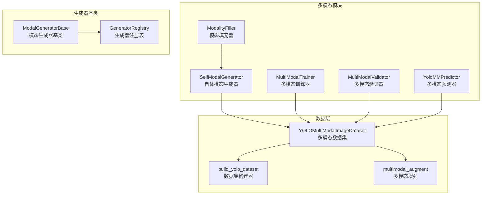

**图表来源**
- [self_modal_generator.py:10-16](file://ultralytics/models/yolo/multimodal/self_modal_generator.py#L10-L16)
- [modal_filling.py:12-18](file://ultralytics/models/yolo/multimodal/modal_filling.py#L12-L18)
- [dataset.py:480-529](file://ultralytics/data/dataset.py#L480-L529)

**章节来源**
- [self_modal_generator.py:1-505](file://ultralytics/models/yolo/multimodal/self_modal_generator.py#L1-L505)
- [__init__.py:1-152](file://ultralytics/models/yolo/multimodal/__init__.py#L1-L152)

## 核心组件

### SelfModalGenerator 类

SelfModalGenerator是自体模态生成器的核心类，提供了完整的模态生成功能：

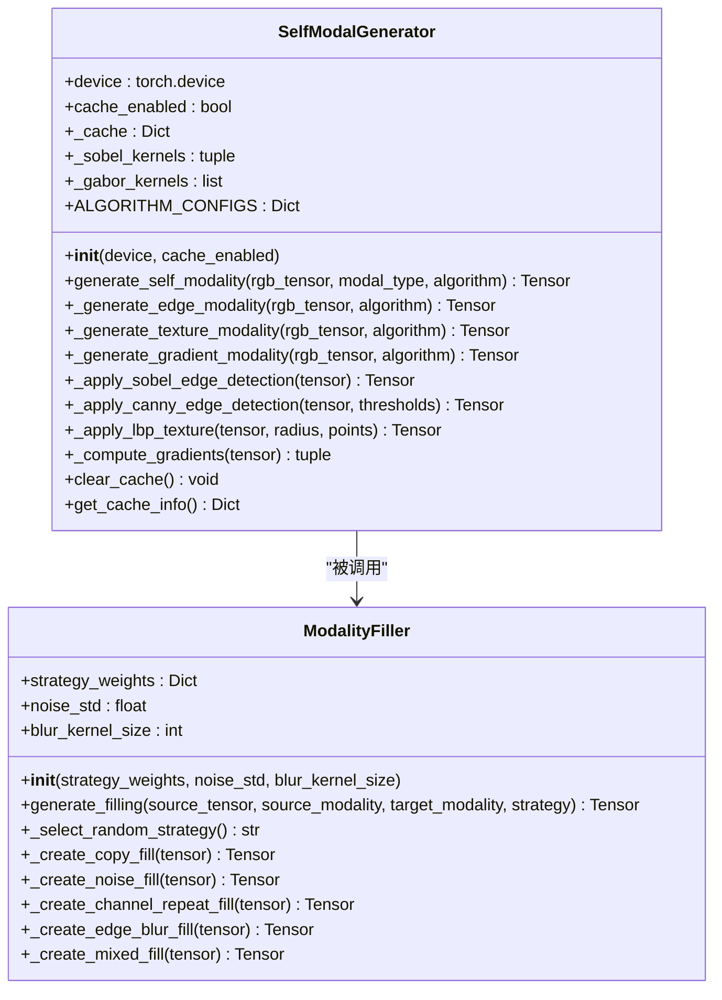

**图表来源**
- [self_modal_generator.py:10-103](file://ultralytics/models/yolo/multimodal/self_modal_generator.py#L10-L103)
- [modal_filling.py:12-78](file://ultralytics/models/yolo/multimodal/modal_filling.py#L12-L78)

### 数据集集成

自体模态生成器与多模态数据集紧密集成：

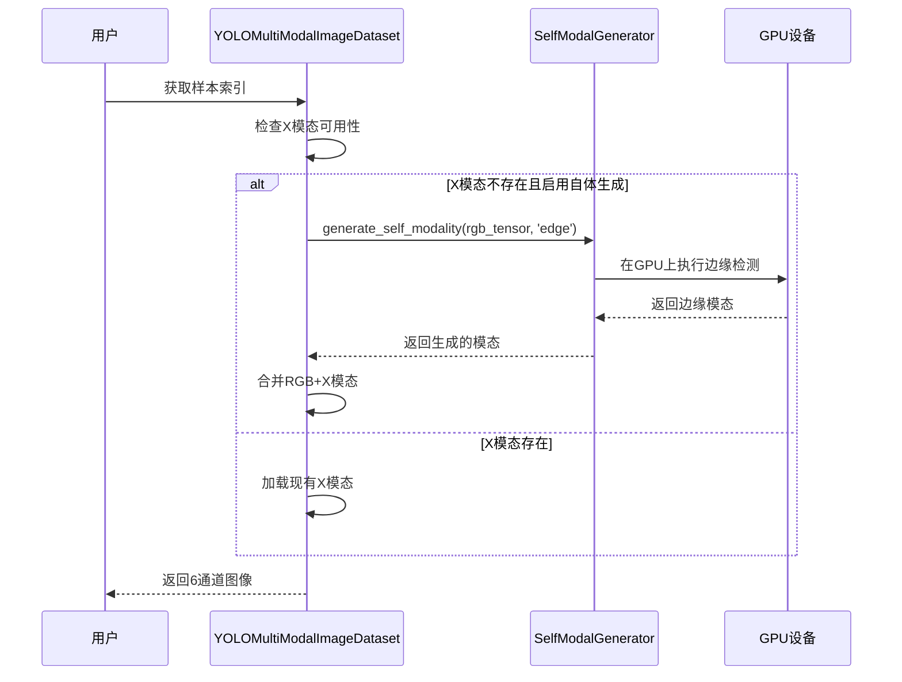

**图表来源**
- [dataset.py:567-593](file://ultralytics/data/dataset.py#L567-L593)
- [self_modal_generator.py:60-103](file://ultralytics/models/yolo/multimodal/self_modal_generator.py#L60-L103)

**章节来源**
- [self_modal_generator.py:42-103](file://ultralytics/models/yolo/multimodal/self_modal_generator.py#L42-L103)
- [modal_filling.py:29-78](file://ultralytics/models/yolo/multimodal/modal_filling.py#L29-L78)

## 架构概览

自体模态生成器采用模块化设计，支持多种模态生成策略：

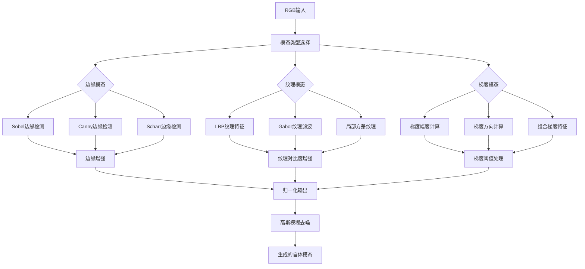

**图表来源**
- [self_modal_generator.py:105-236](file://ultralytics/models/yolo/multimodal/self_modal_generator.py#L105-L236)

### 算法配置

自体模态生成器内置了完善的算法配置系统：

| 模态类型 | 主要算法 | 关键参数 |
|---------|---------|---------|
| 边缘模态 | Sobel/Canny/Scharr | 边缘增强因子、模糊核大小、阈值 |
| 纹理模态 | LBP/Gabor/方差 | LBP半径和采样点、Gabor频率和方向数 |
| 梯度模态 | 幅度/方向/组合 | 权重分配、平滑因子、阈值 |

**章节来源**
- [self_modal_generator.py:18-40](file://ultralytics/models/yolo/multimodal/self_modal_generator.py#L18-L40)

## 详细组件分析

### 边缘模态生成

边缘模态生成是自体模态生成的核心功能之一，支持多种边缘检测算法：

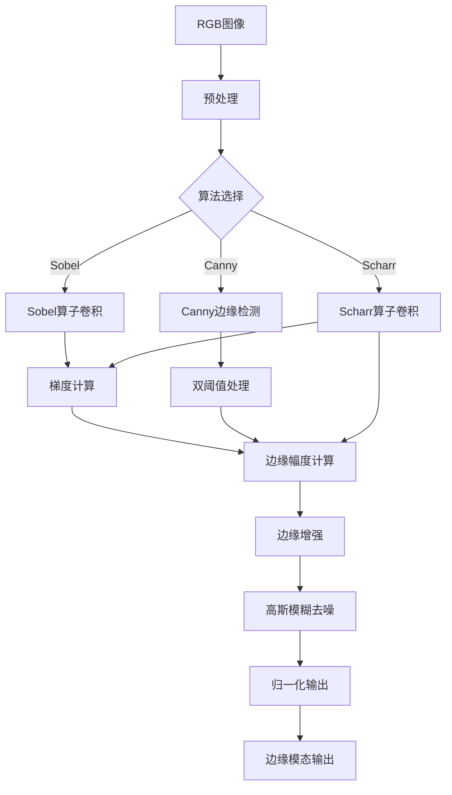

**图表来源**
- [self_modal_generator.py:105-143](file://ultralytics/models/yolo/multimodal/self_modal_generator.py#L105-L143)

### 纹理模态生成

纹理模态生成提供了多种纹理特征提取方法：

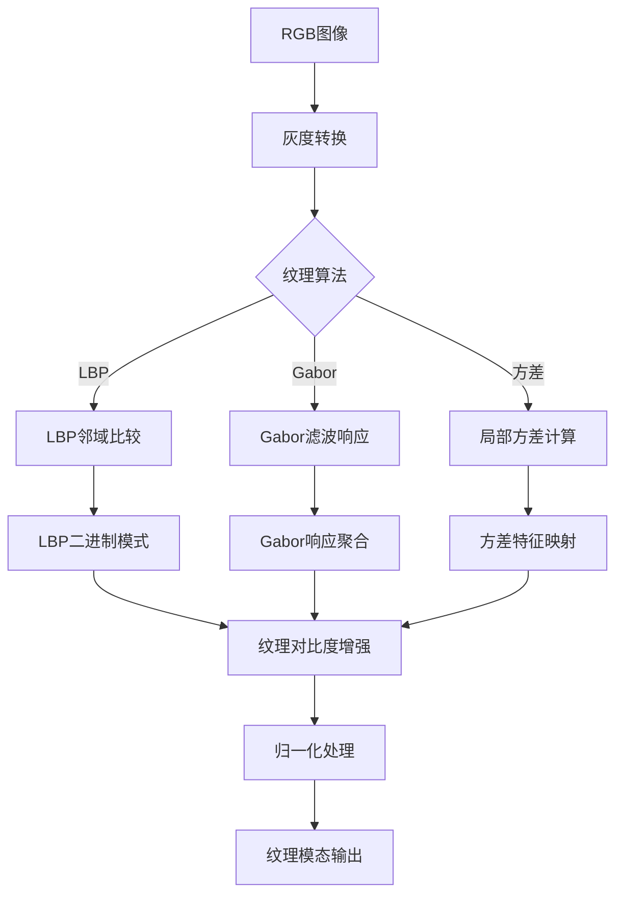

**图表来源**
- [self_modal_generator.py:145-178](file://ultralytics/models/yolo/multimodal/self_modal_generator.py#L145-L178)

### 梯度模态生成

梯度模态生成专注于图像梯度信息的提取和处理：

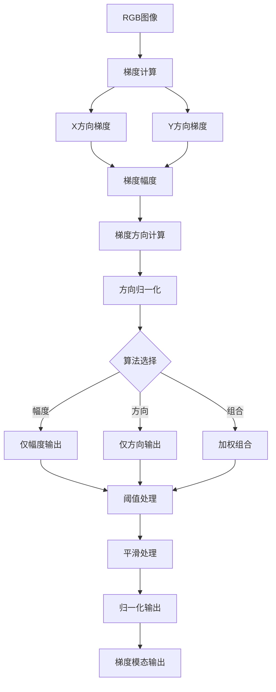

**图表来源**
- [self_modal_generator.py:180-236](file://ultralytics/models/yolo/multimodal/self_modal_generator.py#L180-L236)

**章节来源**
- [self_modal_generator.py:105-236](file://ultralytics/models/yolo/multimodal/self_modal_generator.py#L105-L236)

### 缓存机制

自体模态生成器内置了高效的缓存系统，以提高重复计算的效率：

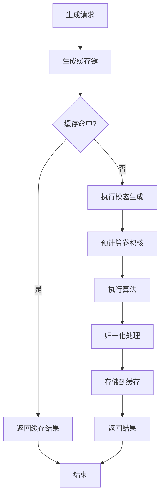

**图表来源**
- [self_modal_generator.py:456-478](file://ultralytics/models/yolo/multimodal/self_modal_generator.py#L456-L478)

**章节来源**
- [self_modal_generator.py:456-478](file://ultralytics/models/yolo/multimodal/self_modal_generator.py#L456-L478)

## 依赖关系分析

自体模态生成器与其他组件的依赖关系如下：

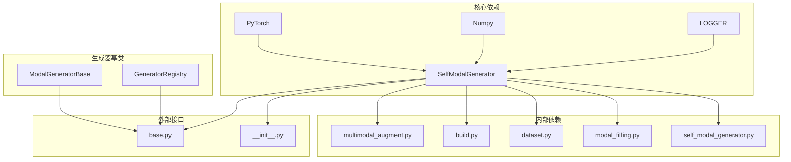

**图表来源**
- [self_modal_generator.py:3-7](file://ultralytics/models/yolo/multimodal/self_modal_generator.py#L3-L7)
- [base.py:12-20](file://ultralytics/nn/mm/generators/base.py#L12-L20)

### 数据流分析

自体模态生成器在整个多模态系统中的数据流：

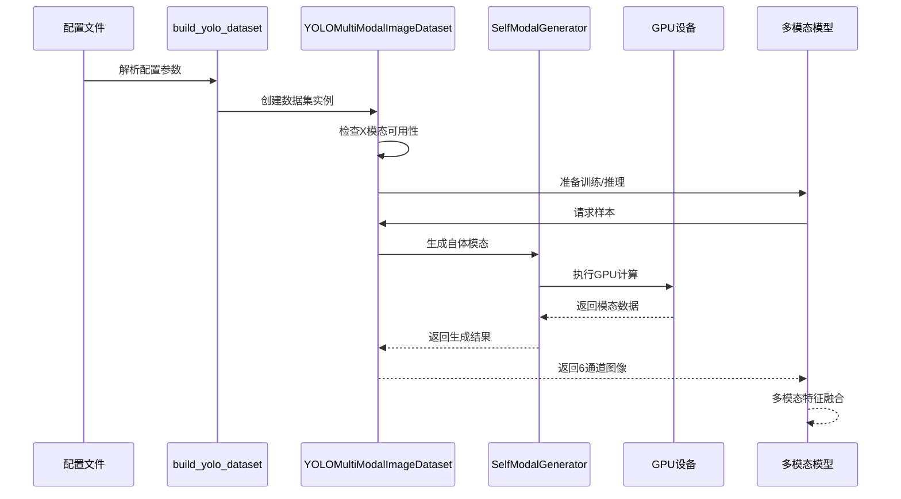

**图表来源**
- [build.py:120-257](file://ultralytics/data/build.py#L120-L257)
- [dataset.py:567-593](file://ultralytics/data/dataset.py#L567-L593)

**章节来源**
- [build.py:120-257](file://ultralytics/data/build.py#L120-L257)
- [dataset.py:567-593](file://ultralytics/data/dataset.py#L567-L593)

## 性能考虑

### 计算优化

自体模态生成器采用了多项性能优化技术：

1. **GPU加速**：所有张量运算都在GPU上执行
2. **预计算卷积核**：减少重复计算开销
3. **缓存机制**：避免重复生成相同的模态
4. **批量处理**：支持批量张量运算

### 内存管理

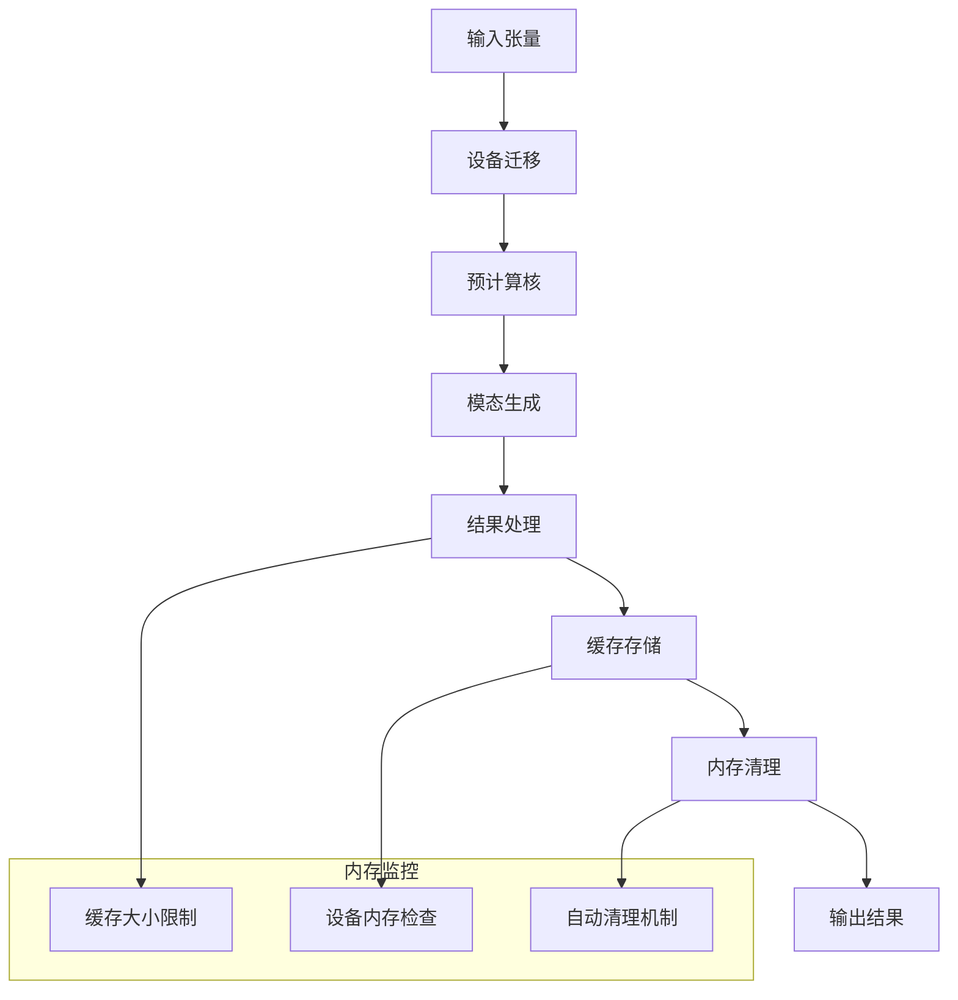

### 并行处理

自体模态生成器支持并行处理多个样本：

- **批处理**：单次处理多个图像
- **多线程**：利用CPU多核处理
- **异步执行**：GPU计算与CPU处理并行

## 故障排除指南

### 常见问题及解决方案

| 问题类型 | 症状 | 可能原因 | 解决方案 |
|---------|------|---------|---------|
| 设备错误 | CUDA内存不足 | GPU内存不足 | 降低批大小或使用CPU |
| 输入错误 | 形状不匹配 | 张量维度错误 | 检查输入形状[B,3,H,W] |
| 算法错误 | 结果异常 | 参数配置错误 | 验证算法参数设置 |
| 性能问题 | 处理缓慢 | 缓存未启用 | 启用缓存机制 |
| 内存问题 | 内存泄漏 | 缓存过大 | 清理缓存或限制大小 |

### 调试工具

自体模态生成器提供了多种调试和监控工具：

```python
# 获取缓存信息
cache_info = generator.get_cache_info()
print(f"缓存状态: {cache_info}")

# 清空缓存
generator.clear_cache()

# 检查设备状态
print(f"当前设备: {generator.device}")
```

**章节来源**
- [self_modal_generator.py:463-478](file://ultralytics/models/yolo/multimodal/self_modal_generator.py#L463-L478)

## 结论

自体模态生成器是Ultralytics YOLO多模态检测系统的重要组成部分，它提供了高效、灵活的模态生成能力。通过支持多种模态类型和算法选择，该生成器能够满足不同应用场景的需求。

主要特点包括：

1. **模块化设计**：清晰的类结构和接口定义
2. **高性能实现**：GPU加速和缓存优化
3. **灵活配置**：丰富的算法参数和策略选择
4. **易于集成**：与现有数据集和训练流程无缝对接

自体模态生成器在多模态融合中的优势体现在其能够提供与主模态互补的信息，同时保持数据的一致性和成本效益。随着多模态学习技术的发展，自体模态生成器将继续发挥重要作用，为更复杂的应用场景提供支持。