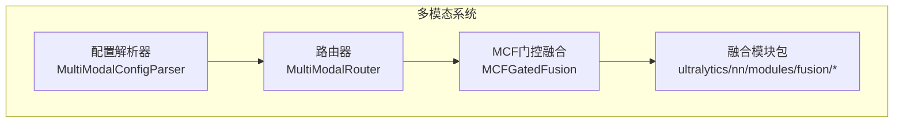
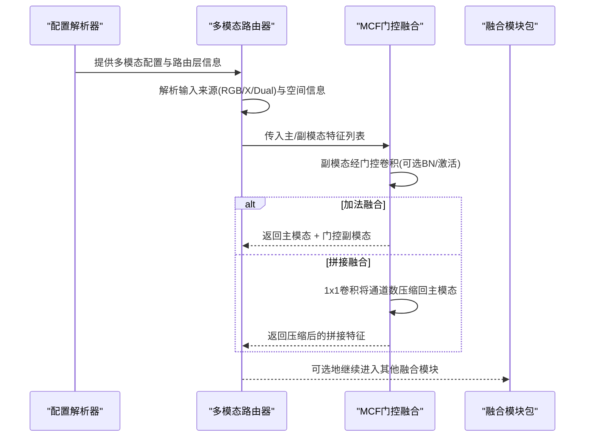
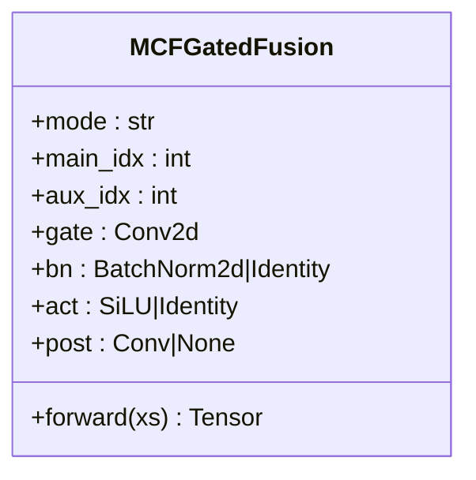
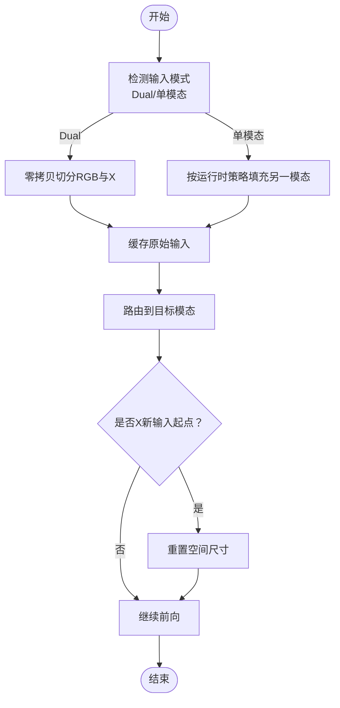
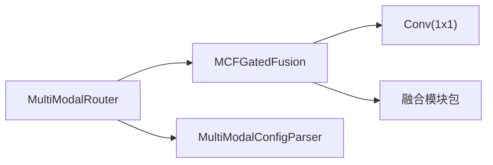

# 特征融合模块

<cite>
**本文档引用的文件**
- [mcf.py](file://ultralytics/nn/mm/mcf.py)
- [router.py](file://ultralytics/nn/mm/router.py)
- [parser.py](file://ultralytics/nn/mm/parser.py)
- [__init__.py（融合模块包）](file://ultralytics/nn/modules/fusion/__init__.py)
- [cgafusion.py](file://ultralytics/nn/modules/fusion/cgafusion.py)
- [csfcn.py](file://ultralytics/nn/modules/fusion/csfcn.py)
- [sdfm.py](file://ultralytics/nn/modules/fusion/sdfm.py)
- [yolo11n-mm-mid-mcf.yaml](file://ultralytics/cfg/models/mm/Neck/yolo11n-mm-mid-mcf.yaml)
- [多模态YAML构建指点.md](file://ultralytics/cfg/models/多模态YAML构建指点.md)
</cite>

## 目录
1. [引言](#引言)
2. [项目结构](#项目结构)
3. [核心组件](#核心组件)
4. [架构总览](#架构总览)
5. [详细组件分析](#详细组件分析)
6. [依赖分析](#依赖分析)
7. [性能考虑](#性能考虑)
8. [故障排查指南](#故障排查指南)
9. [结论](#结论)
10. [附录](#附录)

## 引言
本技术文档围绕特征融合模块（MCF，Multimodal Channel Fusion）展开，系统阐述其在多模态检测中的设计目标、实现原理、融合策略、参数配置与性能优化方法。MCF采用“主-副模态门控融合”的思路，以输入列表中第一个张量为主模态、第二个张量为副模态，通过零初始化的门控卷积对副模态进行加权，随后与主模态进行加法或拼接融合，并在必要时将拼接后的特征映射回主模态通道数。该模块可在不改动YAML顶层输入通道配置的前提下，直接替换融合节点（Add/Concat）以适配多模态网络。

## 项目结构
MCF模块位于多模态神经网络子系统中，与路由器（MultiModalRouter）、配置解析器（MultiModalConfigParser）协同工作，形成“配置驱动 + 数据路由 + 特征融合”的完整链路。融合模块包提供多种融合与注意力机制实现，便于在不同阶段选择合适的融合策略。

**图表来源**
- [router.py:11-471](file://ultralytics/nn/mm/router.py#L11-L471)
- [parser.py:9-198](file://ultralytics/nn/mm/parser.py#L9-L198)
- [mcf.py:19-99](file://ultralytics/nn/mm/mcf.py#L19-L99)
- [__init__.py（融合模块包）:1-58](file://ultralytics/nn/modules/fusion/__init__.py#L1-L58)

**章节来源**
- [router.py:11-471](file://ultralytics/nn/mm/router.py#L11-L471)
- [parser.py:9-198](file://ultralytics/nn/mm/parser.py#L9-L198)
- [mcf.py:19-99](file://ultralytics/nn/mm/mcf.py#L19-L99)
- [__init__.py（融合模块包）:1-58](file://ultralytics/nn/modules/fusion/__init__.py#L1-L58)

## 核心组件
- MCFGatedFusion：主-副模态门控融合模块，支持加法融合与拼接融合两种模式；副模态经零初始化门控卷积（可选BN与激活）处理后参与融合；拼接模式下额外使用1×1卷积将通道数压缩回主模态通道数。
- MultiModalRouter：多模态数据路由系统，负责根据配置将RGB与X模态数据进行零拷贝视图路由、空间重置与运行时填充策略，确保融合节点能正确接收主/副模态输入。
- MultiModalConfigParser：YAML配置解析器，识别并统计含5字段（RGB/X/Dual）的路由层，提取X模态类型等元信息，为路由器提供上下文。
- 融合模块包：提供多种融合与注意力机制（如CGAFusion、SDFM、CFC_CRB/SFC_G2等），作为MCF的补充或替代方案，适用于不同场景下的特征交互需求。

**章节来源**
- [mcf.py:19-99](file://ultralytics/nn/mm/mcf.py#L19-L99)
- [router.py:11-471](file://ultralytics/nn/mm/router.py#L11-L471)
- [parser.py:9-198](file://ultralytics/nn/mm/parser.py#L9-L198)
- [__init__.py（融合模块包）:1-58](file://ultralytics/nn/modules/fusion/__init__.py#L1-L58)

## 架构总览
MCF在多模态检测中的作用是连接主干网络输出的主模态特征与副模态特征，通过门控机制学习两模态间的互补信息，从而提升检测精度与鲁棒性。整体流程如下：

**图表来源**
- [router.py:157-318](file://ultralytics/nn/mm/router.py#L157-L318)
- [mcf.py:87-95](file://ultralytics/nn/mm/mcf.py#L87-L95)

**章节来源**
- [router.py:157-318](file://ultralytics/nn/mm/router.py#L157-L318)
- [mcf.py:87-95](file://ultralytics/nn/mm/mcf.py#L87-L95)

## 详细组件分析

### MCFGatedFusion 组件分析
- 设计目标
  - 以输入列表第1个张量为主模态、第2个张量为副模态，支持在不修改YAML顶层输入通道配置的情况下，直接替换Add/Concat融合节点。
  - 副模态先经过零初始化的门控卷积，再与主模态进行加法或拼接融合。
- 关键参数
  - c_main：主模态通道数（来自f[main_idx]）
  - c_aux：副模态通道数（默认等于c_main）
  - out_channels：副模态门控输出通道数（拼接模式下用于与主模态拼接后再压缩回c_main）
  - mode：融合模式，'add'或'concat'
  - k/s/p/g：门控卷积核大小、步幅、padding、分组
  - main_idx/aux_idx：主/副模态在输入列表中的索引
  - zero_init/use_bn/act：门控卷积权重/偏置是否零初始化、是否使用BN、是否使用SiLU激活
- 实现要点
  - 门控路径：Conv2d（可选BN）+ SiLU（可选）
  - 加法融合：直接相加
  - 拼接融合：先Cat，再用1×1 Conv将通道数压缩回c_main
  - 默认行为：若未指定c_aux/out_channels，则与c_main保持一致，保证通道兼容

**图表来源**
- [mcf.py:19-99](file://ultralytics/nn/mm/mcf.py#L19-L99)

**章节来源**
- [mcf.py:19-99](file://ultralytics/nn/mm/mcf.py#L19-L99)

### 多通道融合算法与策略
- 加法融合（Add）
  - 适用场景：主/副模态通道数一致，且希望保留主模态主导特征的同时引入副模态的细粒度信息。
  - 优点：计算开销低、实现简单、梯度稳定。
  - 注意事项：需保证通道数一致；若差异较大，建议先通过1×1卷积对齐。
- 拼接融合（Concat）
  - 适用场景：主/副模态通道数不一致或希望充分保留两模态的特征表示。
  - 优点：信息保留更完整，适合复杂任务；可通过post 1×1卷积控制最终通道数。
  - 注意事项：通道数增加带来显存与计算压力，需结合下游模块容量设计。
- 门控机制
  - 副模态经零初始化门控卷积，初始对副模态“屏蔽”，训练过程中逐步学习如何融合。
  - 可选BN与激活，有助于稳定训练与加速收敛。
- 参数调优建议
  - k：常用1或3，1×1更轻量，3×3可捕获局部空间信息。
  - g：当通道较多时可增大分组数以降低参数量。
  - zero_init：强烈建议开启，避免初始偏差影响训练稳定性。
  - use_bn：在混合精度训练中建议关闭bias以提升数值稳定性。
  - act：SiLU通常优于ReLU，可提升表达能力。

**章节来源**
- [mcf.py:39-95](file://ultralytics/nn/mm/mcf.py#L39-L95)

### 多模态路由器与数据流
- 路由器职责
  - 解析配置，识别含5字段的路由层，记录RGB/X/Dual输入来源。
  - 在运行时根据输入张量通道数判断当前输入模式（Dual或单模态），并进行零拷贝视图路由。
  - 支持运行时ablation/filling策略，按需生成占位X或RGB以维持网络拓扑一致性。
  - 对“X模态新输入起点”进行特殊处理，确保空间维度与通道维度正确。
- 关键流程
  - setup_multimodal_routing：根据输入张量与配置确定路由模式，缓存原始输入以便空间重置。
  - route_layer_input：依据模块属性将输入路由至RGB、X或Dual。
  - reset_spatial_input：在需要时将X模态输入重置为原始空间尺寸。

**图表来源**
- [router.py:157-404](file://ultralytics/nn/mm/router.py#L157-L404)

**章节来源**
- [router.py:157-404](file://ultralytics/nn/mm/router.py#L157-L404)

### YAML配置与使用示例
- 配置要点
  - 在backbone或head的层定义中添加第5字段（RGB/X/Dual），以声明该层的输入来源。
  - 可选添加第6字段（Hook）以启用特征采集等高级功能。
  - X模态通道数（Xch）与X模态类型（x_modality）在dataset_config中配置，路由器会据此调整路由表。
- 使用示例（基于配置文件）
  - 在Neck或Head中插入MCF融合层，指定c_main、c_aux、out_channels、mode等参数。
  - 若使用拼接融合，确保下游模块能接受相应通道数；若使用加法融合，需保证通道数一致。
  - 结合融合模块包中的注意力/交互模块（如CGAFusion、SDFM、CFC_CRB/SFC_G2）进行多阶段融合。

**章节来源**
- [parser.py:67-86](file://ultralytics/nn/mm/parser.py#L67-L86)
- [parser.py:48-65](file://ultralytics/nn/mm/parser.py#L48-L65)
- [多模态YAML构建指点.md](file://ultralytics/cfg/models/多模态YAML构建指点.md)

### 典型融合策略与对比
- CGAFusion（通道/空间/像素注意力引导的双输入融合）
  - 特点：通过空间注意力、通道注意力与像素注意力共同建模两模态间的互补关系。
  - 适用：需要精细的跨模态对齐与加权的场景。
  - 优势：注意力机制灵活，表达能力强。
  - 成本：额外的注意力分支带来一定计算开销。
- SDFM（空间依赖感知融合）
  - 特点：稳定的SDFM兼容实现，采用数值稳定的门控路径，适合混合精度训练。
  - 适用：强调稳健性的场景，尤其是多尺度融合。
  - 优势：训练鲁棒性强，数值稳定。
  - 成本：需要满足patch整除与输入尺寸约束。
- CFC_CRB/SFC_G2（上下文感知与形变融合）
  - 特点：利用上下文池化与可变形采样对齐高维特征。
  - 适用：跨模态存在显著形变或分辨率差异的场景。
  - 优势：对形变与多尺度有较好适应性。
  - 成本：可变形采样计算较重，需权衡性能与精度。

**章节来源**
- [cgafusion.py:46-64](file://ultralytics/nn/modules/fusion/cgafusion.py#L46-L64)
- [sdfm.py:13-83](file://ultralytics/nn/modules/fusion/sdfm.py#L13-L83)
- [csfcn.py:40-111](file://ultralytics/nn/modules/fusion/csfcn.py#L40-L111)

## 依赖分析
- 组件耦合
  - MCFGatedFusion与融合模块包中的Conv（用于post 1×1卷积）存在直接依赖。
  - MultiModalRouter与MultiModalConfigParser在配置解析与运行时路由上紧密协作。
- 外部依赖
  - PyTorch基础算子（Conv2d、BatchNorm2d、SiLU等）。
  - 融合模块包中的注意力/交互模块（如注意力、上下文池化、可变形采样等）。
- 潜在风险
  - 模式切换（Add/Concat）与通道数不匹配可能导致形状错误。
  - 运行时填充策略不当可能破坏模态语义或引入伪影。

**图表来源**
- [mcf.py:81-85](file://ultralytics/nn/mm/mcf.py#L81-L85)
- [router.py:31-48](file://ultralytics/nn/mm/router.py#L31-L48)
- [parser.py:67-86](file://ultralytics/nn/mm/parser.py#L67-L86)

**章节来源**
- [mcf.py:81-85](file://ultralytics/nn/mm/mcf.py#L81-L85)
- [router.py:31-48](file://ultralytics/nn/mm/router.py#L31-L48)
- [parser.py:67-86](file://ultralytics/nn/mm/parser.py#L67-L86)

## 性能考虑
- 计算效率
  - 门控卷积核大小k=1时，计算量最小；k=3时可捕获局部信息但成本略增。
  - 分组卷积g可降低参数量与计算量，适合大通道场景。
  - 拼接融合会显著增加通道数，需配合post 1×1卷积控制成本。
- 内存占用
  - 拼接融合在Cat阶段会临时放大内存；建议在内存受限场景优先考虑加法融合。
- 数值稳定性
  - 建议关闭门控卷积的bias并与BN组合使用，以提升混合精度训练稳定性。
  - SDFM等模块已在内部采用autocast与数值稳定化处理，适合大规模训练。
- 训练收敛
  - 零初始化门控卷积可有效抑制初始偏差，加速收敛。
  - SiLU激活通常优于ReLU，有助于提升表达能力。

[本节为通用性能指导，无需特定文件引用]

## 故障排查指南
- 形状不匹配
  - 症状：forward时报错，提示通道数或尺寸不一致。
  - 排查：确认c_main与c_aux/out_channels设置是否与输入特征一致；拼接融合需确保post 1×1卷积输出通道等于主模态通道。
- 路由异常
  - 症状：模块未按预期路由到RGB/X/Dual，或X新输入起点报错。
  - 排查：检查配置文件第5字段是否正确；确认dataset_config中的Xch与x_modality设置；验证setup_multimodal_routing是否被正确调用。
- 训练不稳定
  - 症状：loss震荡或收敛缓慢。
  - 排查：确认zero_init已启用；在混合精度场景下避免门控卷积使用bias；适当降低学习率或增加BN。
- 空间重置问题
  - 症状：X模态新输入起点后空间尺寸不正确。
  - 排查：确认original_spatial_size是否被正确缓存；检查reset_spatial_input调用条件。

**章节来源**
- [router.py:254-318](file://ultralytics/nn/mm/router.py#L254-L318)
- [router.py:365-404](file://ultralytics/nn/mm/router.py#L365-L404)
- [mcf.py:87-95](file://ultralytics/nn/mm/mcf.py#L87-L95)

## 结论
MCF门控融合模块通过简洁而高效的门控机制，实现了主-副模态的自适应融合，在多模态检测中扮演着关键角色。结合MultiModalRouter与MultiModalConfigParser，系统能够在不改变顶层配置的前提下灵活接入多种融合策略。实践中应根据任务特性选择加法或拼接融合，并合理设置门控参数与后处理卷积，以在精度与效率之间取得最佳平衡。对于复杂场景，可进一步引入注意力或上下文感知融合模块，实现更精细的跨模态特征交互。

[本节为总结性内容，无需特定文件引用]

## 附录
- 配置文件示例路径
  - [yolo11n-mm-mid-mcf.yaml](file://ultralytics/cfg/models/mm/Neck/yolo11n-mm-mid-mcf.yaml)
  - [多模态YAML构建指点.md](file://ultralytics/cfg/models/多模态YAML构建指点.md)
- 融合模块包导出清单
  - [__init__.py（融合模块包）:1-58](file://ultralytics/nn/modules/fusion/__init__.py#L1-L58)

**章节来源**
- [yolo11n-mm-mid-mcf.yaml](file://ultralytics/cfg/models/mm/Neck/yolo11n-mm-mid-mcf.yaml)
- [多模态YAML构建指点.md](file://ultralytics/cfg/models/多模态YAML构建指点.md)
- [__init__.py（融合模块包）:1-58](file://ultralytics/nn/modules/fusion/__init__.py#L1-L58)