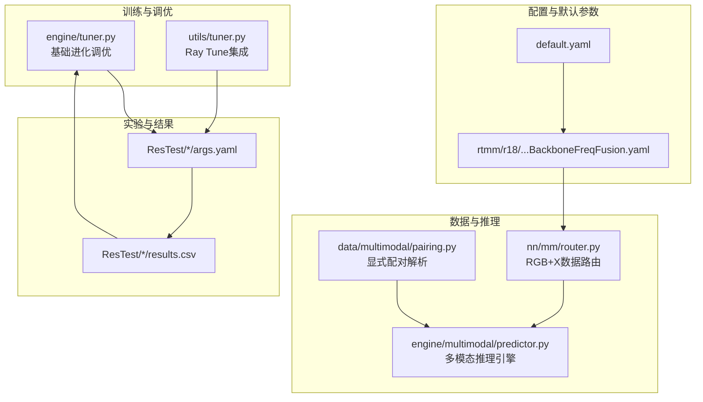
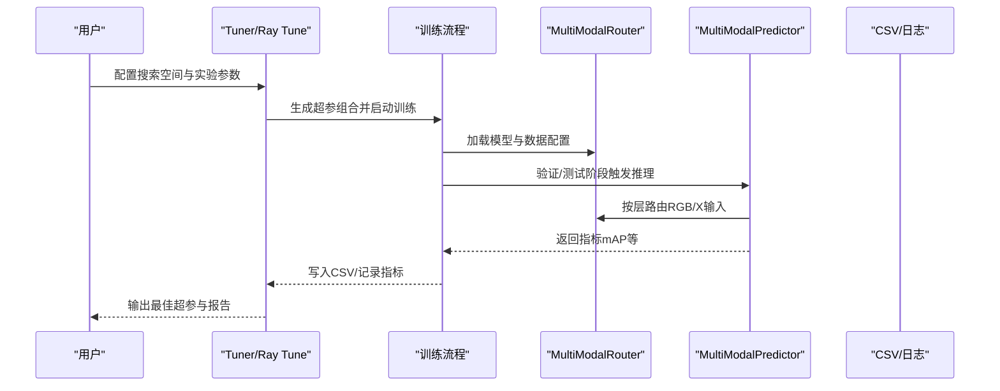
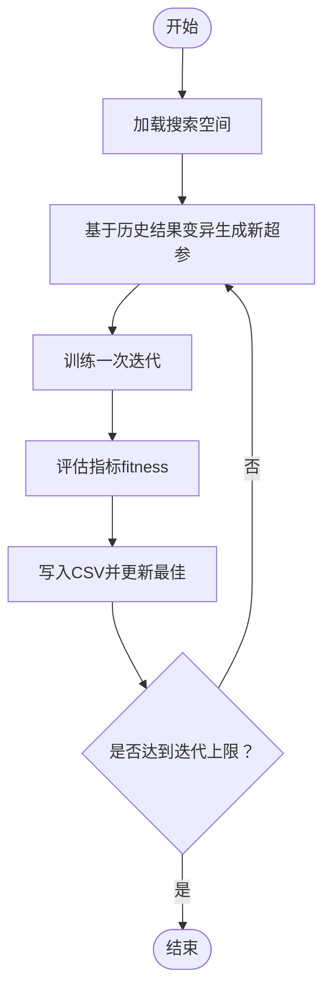
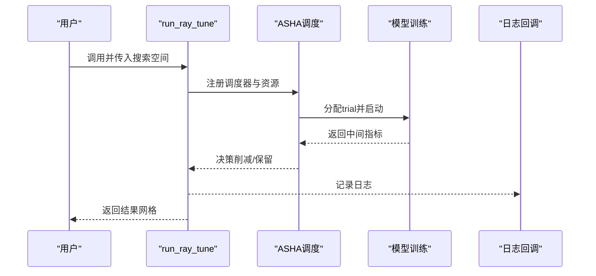
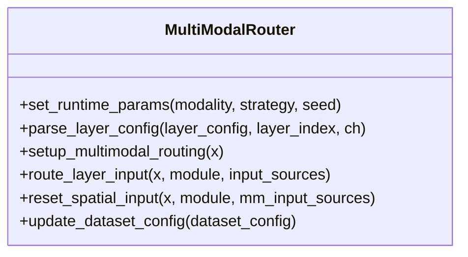
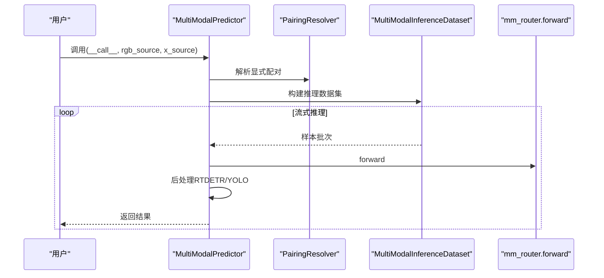
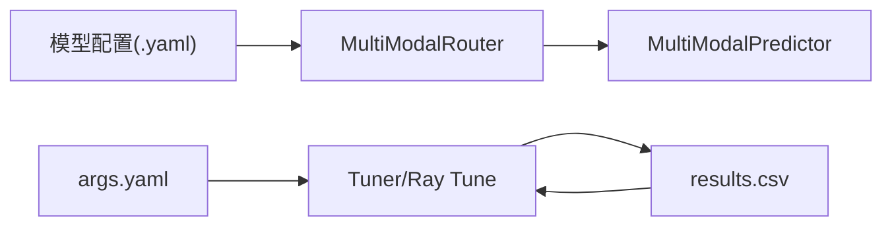

# 参数调优策略

<cite>
**本文档引用的文件**
- [ultralytics/engine/tuner.py](file://ultralytics/engine/tuner.py)
- [ultralytics/utils/tuner.py](file://ultralytics/utils/tuner.py)
- [ultralytics/data/multimodal/pairing.py](file://ultralytics/data/multimodal/pairing.py)
- [ultralytics/engine/multimodal/predictor.py](file://ultralytics/engine/multimodal/predictor.py)
- [ultralytics/nn/mm/router.py](file://ultralytics/nn/mm/router.py)
- [ultralytics/cfg/default.yaml](file://ultralytics/cfg/default.yaml)
- [ultralytics/cfg/models/rtmm/r18/aifi-dattention-CSP-MutilScaleEdgeInformationEnhance-ASF-P2-lite-BackboneFreqFusion.yaml](file://ultralytics/cfg/models/rtmm/r18/aifi-dattention-CSP-MutilScaleEdgeInformationEnhance-ASF-P2-lite-BackboneFreqFusion.yaml)
- [ResTest/aifi-dattention-CSP-MutilScaleEdgeInformationEnhance-ASF-P2-lite-BackboneFreqFusion2/results.csv](file://ResTest/aifi-dattention-CSP-MutilScaleEdgeInformationEnhance-ASF-P2-lite-BackboneFreqFusion2/results.csv)
- [ResTest/aifi-dattention-CSP-MutilScaleEdgeInformationEnhance-ASF-P2-lite-BackboneFreqFusion/args.yaml](file://ResTest/aifi-dattention-CSP-MutilScaleEdgeInformationEnhance-ASF-P2-lite-BackboneFreqFusion/args.yaml)
- [ResTest/aifi-dattention-CSP-MutilScaleEdgeInformationEnhance-ASF-P2-lite-BackboneFreqFusion2/args.yaml](file://ResTest/aifi-dattention-CSP-MutilScaleEdgeInformationEnhance-ASF-P2-lite-BackboneFreqFusion2/args.yaml)
</cite>

## 目录
1. [简介](#简介)
2. [项目结构](#项目结构)
3. [核心组件](#核心组件)
4. [架构总览](#架构总览)
5. [详细组件分析](#详细组件分析)
6. [依赖关系分析](#依赖关系分析)
7. [性能考量](#性能考量)
8. [故障排查指南](#故障排查指南)
9. [结论](#结论)
10. [附录](#附录)

## 简介
本文件面向多模态模型的参数调优，聚焦以下关键方向：
- 模态权重与融合参数：如何通过融合模块配置与训练增强策略影响RGB与X模态的权重分配与信息互补。
- 路由策略参数：如何利用路由器在骨干网络中按层进行模态路由，实现“RGB/X/Dual”输入的灵活切换与空间一致性。
- 训练与推理参数：学习率、损失权重、数据增强、NMS阈值等对收敛性与稳定性的综合影响。
- 自动化调优：基于内置Tuner与Ray Tune的超参搜索流程与最佳实践。

目标是帮助读者在不同模态组合下快速定位最优参数组合，并建立系统化的性能评估与稳定性检查方法。

## 项目结构
该仓库围绕多模态目标检测（RT-DETR-MM与YOLO-MM）提供了完整的训练、推理、数据配对与路由机制，以及自动调优工具链。

**图表来源**
- [ultralytics/cfg/default.yaml:1-168](file://ultralytics/cfg/default.yaml#L1-L168)
- [ultralytics/cfg/models/rtmm/r18/aifi-dattention-CSP-MutilScaleEdgeInformationEnhance-ASF-P2-lite-BackboneFreqFusion.yaml:1-71](file://ultralytics/cfg/models/rtmm/r18/aifi-dattention-CSP-MutilScaleEdgeInformationEnhance-ASF-P2-lite-BackboneFreqFusion.yaml#L1-L71)
- [ultralytics/engine/tuner.py:1-247](file://ultralytics/engine/tuner.py#L1-L247)
- [ultralytics/utils/tuner.py:1-160](file://ultralytics/utils/tuner.py#L1-L160)
- [ultralytics/data/multimodal/pairing.py:1-203](file://ultralytics/data/multimodal/pairing.py#L1-L203)
- [ultralytics/engine/multimodal/predictor.py:1-494](file://ultralytics/engine/multimodal/predictor.py#L1-L494)
- [ultralytics/nn/mm/router.py:1-471](file://ultralytics/nn/mm/router.py#L1-L471)
- [ResTest/aifi-dattention-CSP-MutilScaleEdgeInformationEnhance-ASF-P2-lite-BackboneFreqFusion/args.yaml:1-135](file://ResTest/aifi-dattention-CSP-MutilScaleEdgeInformationEnhance-ASF-P2-lite-BackboneFreqFusion/args.yaml#L1-L135)
- [ResTest/aifi-dattention-CSP-MutilScaleEdgeInformationEnhance-ASF-P2-lite-BackboneFreqFusion2/results.csv:1-133](file://ResTest/aifi-dattention-CSP-MutilScaleEdgeInformationEnhance-ASF-P2-lite-BackboneFreqFusion2/results.csv#L1-L133)

**章节来源**
- [ultralytics/cfg/default.yaml:1-168](file://ultralytics/cfg/default.yaml#L1-L168)
- [ultralytics/cfg/models/rtmm/r18/aifi-dattention-CSP-MutilScaleEdgeInformationEnhance-ASF-P2-lite-BackboneFreqFusion.yaml:1-71](file://ultralytics/cfg/models/rtmm/r18/aifi-dattention-CSP-MutilScaleEdgeInformationEnhance-ASF-P2-lite-BackboneFreqFusion.yaml#L1-L71)
- [ultralytics/engine/tuner.py:1-247](file://ultralytics/engine/tuner.py#L1-L247)
- [ultralytics/utils/tuner.py:1-160](file://ultralytics/utils/tuner.py#L1-L160)
- [ultralytics/data/multimodal/pairing.py:1-203](file://ultralytics/data/multimodal/pairing.py#L1-L203)
- [ultralytics/engine/multimodal/predictor.py:1-494](file://ultralytics/engine/multimodal/predictor.py#L1-L494)
- [ultralytics/nn/mm/router.py:1-471](file://ultralytics/nn/mm/router.py#L1-L471)
- [ResTest/aifi-dattention-CSP-MutilScaleEdgeInformationEnhance-ASF-P2-lite-BackboneFreqFusion/args.yaml:1-135](file://ResTest/aifi-dattention-CSP-MutilScaleEdgeInformationEnhance-ASF-P2-lite-BackboneFreqFusion/args.yaml#L1-L135)
- [ResTest/aifi-dattention-CSP-MutilScaleEdgeInformationEnhance-ASF-P2-lite-BackboneFreqFusion2/results.csv:1-133](file://ResTest/aifi-dattention-CSP-MutilScaleEdgeInformationEnhance-ASF-P2-lite-BackboneFreqFusion2/results.csv#L1-L133)

## 核心组件
- 超参调优器（Tuner）：提供基于进化搜索的超参优化流程，支持自定义搜索空间与结果持久化。
- Ray Tune集成：提供分布式与早停调度（ASHA）的高级调优能力，适合大规模搜索。
- 多模态路由器（Router）：在骨干网络中按层进行模态路由，支持RGB/X/Dual输入与空间重置。
- 推理引擎（Predictor）：封装数据集构建、流式推理、后处理与结果保存。
- 数据配对解析器（PairingResolver）：强制显式RGB与X模态配对，支持单模态与批量推理。
- 默认配置（default.yaml）：集中定义训练、验证、预测与多模态扩展参数的默认值。

**章节来源**
- [ultralytics/engine/tuner.py:31-247](file://ultralytics/engine/tuner.py#L31-L247)
- [ultralytics/utils/tuner.py:7-160](file://ultralytics/utils/tuner.py#L7-L160)
- [ultralytics/nn/mm/router.py:11-471](file://ultralytics/nn/mm/router.py#L11-L471)
- [ultralytics/engine/multimodal/predictor.py:16-494](file://ultralytics/engine/multimodal/predictor.py#L16-L494)
- [ultralytics/data/multimodal/pairing.py:11-203](file://ultralytics/data/multimodal/pairing.py#L11-L203)
- [ultralytics/cfg/default.yaml:92-168](file://ultralytics/cfg/default.yaml#L92-L168)

## 架构总览
多模态参数调优的关键路径如下：

**图表来源**
- [ultralytics/engine/tuner.py:158-247](file://ultralytics/engine/tuner.py#L158-L247)
- [ultralytics/utils/tuner.py:7-160](file://ultralytics/utils/tuner.py#L7-L160)
- [ultralytics/nn/mm/router.py:157-240](file://ultralytics/nn/mm/router.py#L157-L240)
- [ultralytics/engine/multimodal/predictor.py:99-244](file://ultralytics/engine/multimodal/predictor.py#L99-L244)

## 详细组件分析

### 组件A：超参调优器（Tuner）
- 功能要点
  - 搜索空间：包含学习率、动量、权重衰减、warmup、损失权重（box/cls/dfl）、几何增强概率等。
  - 进化策略：基于历史结果加权选择父代，高斯变异生成新个体，限制参数边界。
  - 结果持久化：以CSV记录fitness与各超参，支持断点续训与可视化。
- 关键参数建议
  - 学习率与衰减：先粗调lr0/lrf，再微调momentum/weight_decay；对多模态场景可适当降低lr0以稳定融合。
  - 损失权重：box/cls/dfl需与任务规模匹配；多模态数据不平衡时可适度上调cls。
  - 几何增强：mosaic/mixup/cutmix对多模态需谨慎，建议从低概率开始，逐步提升。
- 性能与稳定性
  - 建议开启AMP与合理batch，监控loss曲线与mAP稳定性。
  - 断点续训：通过tune_dir与resume避免重复实验。

**图表来源**
- [ultralytics/engine/tuner.py:110-156](file://ultralytics/engine/tuner.py#L110-L156)
- [ultralytics/engine/tuner.py:158-247](file://ultralytics/engine/tuner.py#L158-L247)

**章节来源**
- [ultralytics/engine/tuner.py:31-247](file://ultralytics/engine/tuner.py#L31-L247)

### 组件B：Ray Tune集成
- 功能要点
  - 使用ASHA早停调度，按epoch维度进行资源削减。
  - 支持W&B日志回调，便于可视化与追踪。
  - 自动管理存储路径与恢复。
- 关键参数建议
  - grace_period：根据收敛速度设定，一般10~20。
  - max_samples：搜索预算，建议先小规模探索再扩大。
  - gpu_per_trial：按GPU资源分配，注意NUM_THREADS与显存约束。
- 最佳实践
  - 优先使用默认搜索空间，结合任务指标（如mAP）设置mode="max"。
  - 保持数据集与任务一致，避免跨域漂移。

**图表来源**
- [ultralytics/utils/tuner.py:7-160](file://ultralytics/utils/tuner.py#L7-L160)

**章节来源**
- [ultralytics/utils/tuner.py:7-160](file://ultralytics/utils/tuner.py#L7-L160)

### 组件C：多模态路由器（Router）
- 功能要点
  - 支持RGB/X/Dual三种输入模式，按层解析第5字段决定路由来源。
  - 在X模态新输入起点处进行空间重置，保证后续层的空间一致性。
  - 运行时可设置模态ablation（仅RGB/仅X）与填充策略。
- 关键参数建议
  - X通道数（Xch）：与数据集配置一致，确保输入通道匹配。
  - 填充策略：当仅提供RGB时，可用generate_modality_filling生成X占位，避免通道不匹配。
  - 空间重置：在涉及X模态的层前，确保设置“新输入起点”标记，避免空间尺寸不一致。
- 稳定性检查
  - 检查每层路由目标是否存在，避免None输入。
  - 校验通道数与期望值一致，防止运行时报错。

**图表来源**
- [ultralytics/nn/mm/router.py:11-471](file://ultralytics/nn/mm/router.py#L11-L471)

**章节来源**
- [ultralytics/nn/mm/router.py:31-471](file://ultralytics/nn/mm/router.py#L31-L471)

### 组件D：推理引擎（Predictor）
- 功能要点
  - 从模型读取mm_router配置，确定X模态类型与通道数。
  - 构建MultiModalInferenceDataset并流式推理，支持保存结果。
  - 自动区分RTDETR与YOLO后处理路径，适配不同输出格式。
- 关键参数建议
  - 置信度阈值（conf）与NMS阈值（iou）：对多模态检测建议从0.25/0.7起步，逐步调整。
  - 最大检测数（max_det）：根据场景复杂度设定，避免过多冗余框。
  - 设备（device）：多卡训练后可在单卡或多卡上进行推理，注意显存占用。
- 稳定性检查
  - debug开关：打印模型输出形状与坐标变换过程，辅助定位问题。
  - 保存中间结果：便于离线分析与可视化。

**图表来源**
- [ultralytics/engine/multimodal/predictor.py:99-244](file://ultralytics/engine/multimodal/predictor.py#L99-L244)
- [ultralytics/data/multimodal/pairing.py:37-125](file://ultralytics/data/multimodal/pairing.py#L37-L125)

**章节来源**
- [ultralytics/engine/multimodal/predictor.py:16-494](file://ultralytics/engine/multimodal/predictor.py#L16-L494)
- [ultralytics/data/multimodal/pairing.py:11-203](file://ultralytics/data/multimodal/pairing.py#L11-L203)

### 组件E：数据配对解析器（PairingResolver）
- 功能要点
  - 强制显式输入：必须同时提供rgb_source与x_source，或单独提供某一方。
  - 批量与单模态支持：自动归一化为列表，校验文件存在性与类型。
  - ID生成：优先使用文件名stem，确保样本唯一标识。
- 调优建议
  - 在多模态实验中，确保RGB与X模态数量一致，避免配对失败。
  - 单模态场景可使用None占位，配合Router的填充策略。

**章节来源**
- [ultralytics/data/multimodal/pairing.py:11-203](file://ultralytics/data/multimodal/pairing.py#L11-L203)

### 组件F：默认配置与实验参数（default.yaml 与 args.yaml）
- 默认配置（default.yaml）
  - 定义训练/验证/预测/导出的全局参数与超参默认值。
  - 多模态扩展参数：use_multimodal_aug、mm_async_geo_*、mm_modal_dropout_*、mm_x_non_geo_*等。
- 实验参数（args.yaml）
  - 以ResTest中的多个配置为例，展示不同融合策略与增强组合的参数差异。
  - 关注关键项：epochs、batch、imgsz、optimizer、amp、val、plots、以及多模态增强相关参数。

**章节来源**
- [ultralytics/cfg/default.yaml:92-168](file://ultralytics/cfg/default.yaml#L92-L168)
- [ResTest/aifi-dattention-CSP-MutilScaleEdgeInformationEnhance-ASF-P2-lite-BackboneFreqFusion/args.yaml:74-134](file://ResTest/aifi-dattention-CSP-MutilScaleEdgeInformationEnhance-ASF-P2-lite-BackboneFreqFusion/args.yaml#L74-L134)
- [ResTest/aifi-dattention-CSP-MutilScaleEdgeInformationEnhance-ASF-P2-lite-BackboneFreqFusion2/args.yaml:74-134](file://ResTest/aifi-dattention-CSP-MutilScaleEdgeInformationEnhance-ASF-P2-lite-BackboneFreqFusion2/args.yaml#L74-L134)

## 依赖关系分析
- Router与模型配置耦合：模型配置文件（如BackboneFreqFusion.yaml）通过第5字段声明模态路由来源，Router据此在运行时进行输入拆分与拼接。
- 路由器与推理引擎协作：Predictor从模型中读取mm_router，确保推理阶段的输入通道与空间与训练一致。
- 调优器与实验参数：Tuner/Ray Tune读取args.yaml中的训练参数，结合results.csv中的指标进行搜索与收敛评估。

**图表来源**
- [ultralytics/cfg/models/rtmm/r18/aifi-dattention-CSP-MutilScaleEdgeInformationEnhance-ASF-P2-lite-BackboneFreqFusion.yaml:1-71](file://ultralytics/cfg/models/rtmm/r18/aifi-dattention-CSP-MutilScaleEdgeInformationEnhance-ASF-P2-lite-BackboneFreqFusion.yaml#L1-L71)
- [ultralytics/nn/mm/router.py:90-156](file://ultralytics/nn/mm/router.py#L90-L156)
- [ultralytics/engine/multimodal/predictor.py:60-88](file://ultralytics/engine/multimodal/predictor.py#L60-L88)
- [ResTest/aifi-dattention-CSP-MutilScaleEdgeInformationEnhance-ASF-P2-lite-BackboneFreqFusion/args.yaml:1-135](file://ResTest/aifi-dattention-CSP-MutilScaleEdgeInformationEnhance-ASF-P2-lite-BackboneFreqFusion/args.yaml#L1-L135)
- [ResTest/aifi-dattention-CSP-MutilScaleEdgeInformationEnhance-ASF-P2-lite-BackboneFreqFusion2/results.csv:1-133](file://ResTest/aifi-dattention-CSP-MutilScaleEdgeInformationEnhance-ASF-P2-lite-BackboneFreqFusion2/results.csv#L1-L133)

**章节来源**
- [ultralytics/nn/mm/router.py:90-156](file://ultralytics/nn/mm/router.py#L90-L156)
- [ultralytics/engine/multimodal/predictor.py:60-88](file://ultralytics/engine/multimodal/predictor.py#L60-L88)
- [ResTest/aifi-dattention-CSP-MutilScaleEdgeInformationEnhance-ASF-P2-lite-BackboneFreqFusion/args.yaml:1-135](file://ResTest/aifi-dattention-CSP-MutilScaleEdgeInformationEnhance-ASF-P2-lite-BackboneFreqFusion/args.yaml#L1-L135)
- [ResTest/aifi-dattention-CSP-MutilScaleEdgeInformationEnhance-ASF-P2-lite-BackboneFreqFusion2/results.csv:1-133](file://ResTest/aifi-dattention-CSP-MutilScaleEdgeInformationEnhance-ASF-P2-lite-BackboneFreqFusion2/results.csv#L1-L133)

## 性能考量
- 收敛性
  - 通过results.csv观察metrics/precision/recall/mAP随epoch变化趋势，识别过拟合/欠拟合迹象。
  - 使用val参数与合适的split（如val/test）进行阶段性评估。
- 稳定性
  - AMP与混合精度：在支持的硬件上启用AMP可显著提升吞吐。
  - 数据增强：多模态场景建议谨慎使用几何增强，优先非几何增强（如mm_rgb_albu_cfg）。
  - 批大小与学习率：二者需协同调整，batch增大时可相应提高lr以维持收敛速度。
- 资源利用
  - Ray Tune的ASHA调度可有效节省资源，建议结合GPU资源与预算设置grace_period与max_samples。

[本节为通用指导，无需特定文件引用]

## 故障排查指南
- 模态通道不匹配
  - 症状：运行时报错通道数不一致。
  - 排查：确认args.yaml中的Xch与模型配置一致；必要时使用adapt_xch进行通道适配。
- 路由失败
  - 症状：某层路由结果为None或输入源不可用。
  - 排查：检查模型配置第5字段是否正确标注RGB/X/Dual；确保X模态新输入起点处已设置空间重置标记。
- 推理异常
  - 症状：输出为空或坐标异常。
  - 排查：开启debug模式，检查模型输出类型与形状；核对NMS阈值与置信度阈值设置。
- Ray Tune环境
  - 症状：导入ray或wandb失败。
  - 排查：安装所需依赖并确保版本满足要求；检查存储路径权限。

**章节来源**
- [ultralytics/nn/mm/router.py:242-318](file://ultralytics/nn/mm/router.py#L242-L318)
- [ultralytics/engine/multimodal/predictor.py:170-243](file://ultralytics/engine/multimodal/predictor.py#L170-L243)
- [ultralytics/utils/tuner.py:40-58](file://ultralytics/utils/tuner.py#L40-L58)

## 结论
- 多模态参数调优应围绕“模态路由一致性、融合策略稳健性、训练稳定性与收敛效率”四个维度展开。
- 建议采用“先Router后Tuner”的策略：先确保模型配置与数据配对正确，再通过Tuner/Ray Tune系统化搜索最优超参组合。
- 借助results.csv与可视化工具持续监控性能指标，结合断点续训与早停策略，提升整体效率。

[本节为总结性内容，无需特定文件引用]

## 附录

### A. 关键参数清单与调优建议
- 训练与优化
  - lr0/lrf：初始与最终学习率，多模态建议从较低lr0起步。
  - momentum/weight_decay：稳定优化过程，避免过拟合。
  - optimizer：AdamW常适用于多模态；SGD在某些场景更稳定。
- 损失函数权重
  - box/cls/dfl：与任务规模匹配；类别不平衡时可上调cls。
- 数据增强（多模态）
  - use_multimodal_aug：启用独立的RGB+X增强管道。
  - mm_async_geo_*：异步几何扰动的概率与范围，建议从低概率开始。
  - mm_modal_dropout_*：模态擦除的概率与填充策略，可用于模态鲁棒性训练。
  - mm_x_non_geo_*：X模态非几何增强，默认关闭。
- 推理与评估
  - conf/iou/max_det：检测阈值与NMS阈值，建议从默认值起步。
  - plots/val/save：评估与可视化开关，便于快速定位问题。

**章节来源**
- [ultralytics/cfg/default.yaml:92-168](file://ultralytics/cfg/default.yaml#L92-L168)
- [ResTest/aifi-dattention-CSP-MutilScaleEdgeInformationEnhance-ASF-P2-lite-BackboneFreqFusion/args.yaml:108-134](file://ResTest/aifi-dattention-CSP-MutilScaleEdgeInformationEnhance-ASF-P2-lite-BackboneFreqFusion/args.yaml#L108-L134)

### B. 基于实验结果的参数调优指南
- 步骤
  - 选择基准配置（如BackboneFreqFusion），记录初始mAP与收敛速度。
  - 逐项调整：先调整学习率与损失权重，再引入增强策略。
  - 使用Tuner/Ray Tune进行系统搜索，记录CSV并绘制收敛曲线。
- 指标分析
  - 关注metrics/mAP50与metrics/mAP50-95，结合val/loss与train/loss评估稳定性。
  - 若出现震荡或停滞，考虑降低lr、增加warmup或减少增强强度。

**章节来源**
- [ResTest/aifi-dattention-CSP-MutilScaleEdgeInformationEnhance-ASF-P2-lite-BackboneFreqFusion2/results.csv:1-133](file://ResTest/aifi-dattention-CSP-MutilScaleEdgeInformationEnhance-ASF-P2-lite-BackboneFreqFusion2/results.csv#L1-L133)