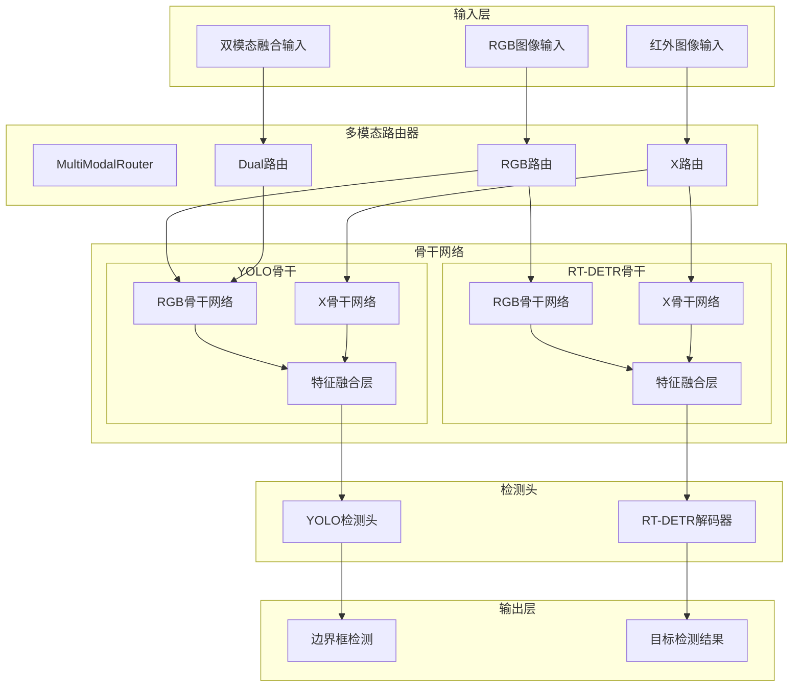
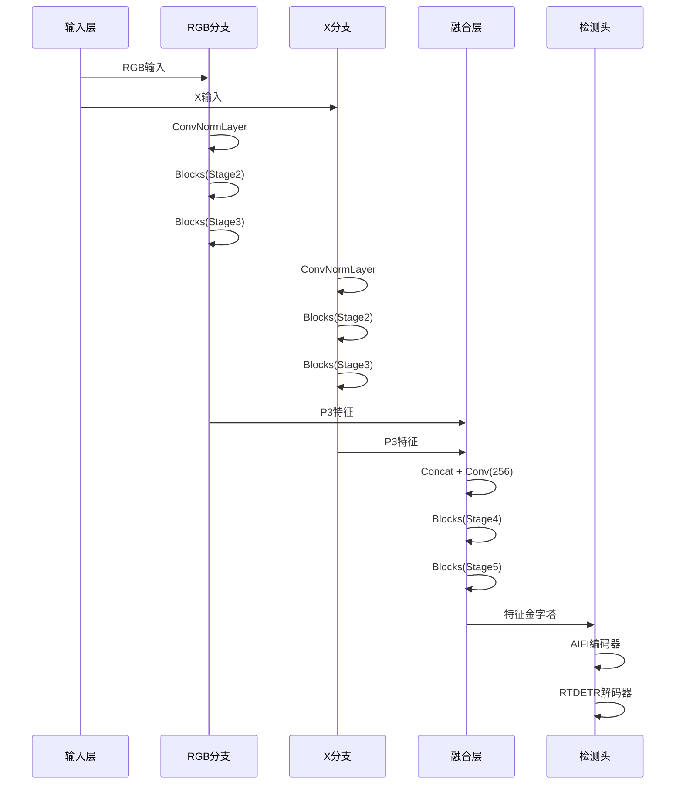
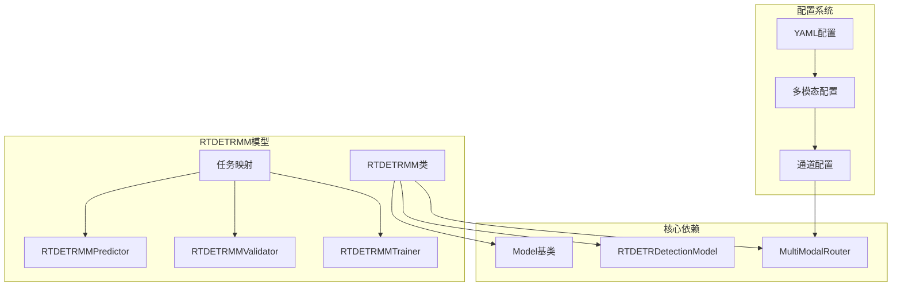

# RT-MM模型配置集合

<cite>
**本文档引用的文件**
- [多模态YAML构建指点.md](file://ultralytics/cfg/models/多模态YAML构建指点.md)
- [README.md](file://ultralytics/cfg/models/README.md)
- [yolo11n-mm-mid.yaml](file://ultralytics/cfg/models/mm/yolo11n-mm-mid.yaml)
- [yolo11n-mm-early.yaml](file://ultralytics/cfg/models/mm/yolo11n-mm-early.yaml)
- [rtdetr-r18-mm-mid.yaml](file://ultralytics/cfg/models/rt-detr/rtdetr-r18-mm-mid.yaml)
- [aifi-dattention-CSP-MutilScaleEdgeInformationEnhance-ASF-P2-lite-BackboneFreqFusion.yaml](file://ultralytics/cfg/models/rtmm/r18/aifi-dattention-CSP-MutilScaleEdgeInformationEnhance-ASF-P2-lite-BackboneFreqFusion.yaml)
- [RTDETR-mid-args.yaml](file://ResTest/RTDETR-mid/args.yaml)
- [aifi-dattention-CSP-MutilScaleEdgeInformationEnhance-ASF-P2-lite-BackboneFreqFusion-args.yaml](file://ResTest/aifi-dattention-CSP-MutilScaleEdgeInformationEnhance-ASF-P2-lite-BackboneFreqFusion/args.yaml)
- [data-参考性质.yaml](file://data(参考性质).yaml)
- [MM-experiment.txt](file://MM-experiment.txt)
- [predictor.py](file://ultralytics/engine/multimodal/predictor.py)
- [model.py](file://ultralytics/models/rtdetrmm/model.py)
- [trainMM.py](file://trainMM.py)
</cite>

## 目录
1. [项目概述](#项目概述)
2. [项目结构](#项目结构)
3. [核心组件](#核心组件)
4. [架构概览](#架构概览)
5. [详细组件分析](#详细组件分析)
6. [依赖关系分析](#依赖关系分析)
7. [性能考量](#性能考量)
8. [故障排除指南](#故障排除指南)
9. [结论](#结论)

## 项目概述

RT-MM（多模态）模型配置集合是一个基于Ultralytics YOLO框架的多模态目标检测系统，专门用于处理RGB与红外（IR）等多模态数据的融合检测任务。该项目提供了完整的多模态配置文件、训练脚本和推理工具，支持多种融合策略和网络架构。

该系统的核心特点包括：
- 支持RGB+红外多模态输入
- 提供早期、中期、晚期三种融合策略
- 包含多种网络变体和优化模块
- 完整的训练、验证和推理流程
- 可视化和性能分析工具

## 项目结构

```mermaid
graph TB
subgraph "配置文件"
A[ultralytics/cfg/models/]
A1[mm/ - YOLO多模态配置]
A2[rt-detr/ - RT-DETR配置]
A3[rtmm/ - RT-DETR多模态配置]
A4[默认配置]
end
subgraph "实验配置"
B[ResTest/ - 训练实验配置]
B1[RTDETR-mid/]
B2[aifi-dattention-CSP-MutilScaleEdgeInformationEnhance/]
B3[调试配置]
end
subgraph "核心代码"
C[ultralytics/engine/]
C1[multimodal/ - 多模态引擎]
C2[models/ - 模型实现]
C3[utils/ - 工具函数]
end
subgraph "数据配置"
D[data(参考性质).yaml - 数据集配置]
E[MM-experiment.txt - 性能对比]
end
A --> B
B --> C
C --> D
D --> E
```

**图表来源**
- [多模态YAML构建指点.md:1-239](file://ultralytics/cfg/models/多模态YAML构建指点.md#L1-L239)
- [README.md:1-66](file://ultralytics/cfg/models/README.md#L1-L66)

**章节来源**
- [多模态YAML构建指点.md:1-239](file://ultralytics/cfg/models/多模态YAML构建指点.md#L1-L239)
- [README.md:1-66](file://ultralytics/cfg/models/README.md#L1-L66)

## 核心组件

### 多模态配置系统

RT-MM系统采用统一的配置驱动架构，支持以下核心组件：

1. **基础理念与适用范围**
   - 统一范式：通过YAML第5字段标注输入路由（'RGB' | 'X' | 'Dual'）
   - 两模态抽象：非可见光模态统一抽象为`X`（例如depth/thermal/IR等）
   - 架构无关：同一套YAML书写规则同时适用于YOLO与RT-DETR

2. **YAML基本语法**
   - 常规层定义四元组：`[from, repeats, module, args]`
   - 多模态扩展为五元组：`[from, repeats, module, args, input_source]`
   - 通道规则：`RGB`固定3通道，`X`由数据配置`Xch`指定，默认3通道

3. **分支书写规范**
   - 当在backbone中分别对RGB与X做独立特征提取时，必须保持"分支连续、清晰分区"
   - 每个分支内部只引用本分支上一层的索引，直到显式融合为止

**章节来源**
- [多模态YAML构建指点.md:9-65](file://ultralytics/cfg/models/多模态YAML构建指点.md#L9-L65)

### 融合策略模板

系统提供三种主要的多模态融合策略：

1. **早期融合（Early Fusion）**
   - 特点：输入直接为`Dual(6ch)`，后续走单路主干与头部
   - 适用场景：模态空间/语义高度对齐，期望最小改造与最快速度

2. **中期融合（Mid Fusion）**
   - 特点：RGB/X双分支分别至P3/P4再`Concat + C3k2/C2PSA`融合
   - 适用场景：RGB/X各自主干网到P4，然后在P4/P5进行融合

3. **晚期融合（Late Fusion）**
   - 特点：RGB/X各自独立检测，最终在推理层面做决策融合
   - 适用场景：两路完全独立、鲁棒性最高

**章节来源**
- [多模态YAML构建指点.md:68-118](file://ultralytics/cfg/models/多模态YAML构建指点.md#L68-L118)

## 架构概览



**图表来源**
- [model.py:25-57](file://ultralytics/models/rtdetrmm/model.py#L25-L57)
- [predictor.py:16-30](file://ultralytics/engine/multimodal/predictor.py#L16-L30)

## 详细组件分析

### YOLO多模态配置

#### 标准中期融合配置

`yolo11n-mm-mid.yaml`展示了典型的双分支中期融合架构：

```mermaid
graph LR
subgraph "RGB分支"
RGB0[Conv64] --> RGB1[Conv128]
RGB1 --> RGB2[C3k2-256]
RGB2 --> RGB3[Conv256]
RGB3 --> RGB4[C3k2-512]
RGB4 --> RGB5[Conv512]
RGB5 --> RGB6[C3k2-512]
RGB6 --> RGB7[Conv1024]
RGB7 --> RGB8[C3k2-1024]
RGB8 --> RGB9[SPPF-1024]
RGB9 --> RGB10[C2PSA-1024]
end
subgraph "X分支"
X0[Conv64] --> X1[Conv128]
X1 --> X2[C3k2-256]
X2 --> X3[Conv256]
X3 --> X4[C3k2-512]
X4 --> X5[Conv512]
X5 --> X6[C3k2-512]
X6 --> X7[Conv1024]
X7 --> X8[C3k2-1024]
X8 --> X9[SPPF-1024]
X9 --> X10[C2PSA-1024]
end
subgraph "融合层"
F1[[6,17] Concat] --> F2[C3k2-1024]
F3[[10,21] Concat] --> F4[C3k2-1024]
F4 --> F5[C2PSA-1024]
end
RGB10 --> F4
X10 --> F4
F5 --> YOLO_Head
```

**图表来源**
- [yolo11n-mm-mid.yaml:18-53](file://ultralytics/cfg/models/mm/yolo11n-mm-mid.yaml#L18-L53)

#### 早期融合配置

`yolo11n-mm-early.yaml`展示了简化的早期融合架构：

- P1/2阶段：直接处理6通道输入（RGB+X）
- 后续阶段：走标准YOLO骨干网络路径
- 优势：结构简单，计算高效

**章节来源**
- [yolo11n-mm-mid.yaml:1-75](file://ultralytics/cfg/models/mm/yolo11n-mm-mid.yaml#L1-L75)
- [yolo11n-mm-early.yaml:1-59](file://ultralytics/cfg/models/mm/yolo11n-mm-early.yaml#L1-L59)

### RT-DETR多模态配置

#### RT-DETR中期融合配置

`rtdetr-r18-mm-mid.yaml`展示了RT-DETR系列的多模态融合：



**图表来源**
- [rtdetr-r18-mm-mid.yaml:12-40](file://ultralytics/cfg/models/rt-detr/rtdetr-r18-mm-mid.yaml#L12-L40)

**章节来源**
- [rtdetr-r18-mm-mid.yaml:1-66](file://ultralytics/cfg/models/rt-detr/rtdetr-r18-mm-mid.yaml#L1-L66)

### 高级融合模块

#### FreqFusion模块

`aifi-dattention-CSP-MutilScaleEdgeInformationEnhance-ASF-P2-lite-BackboneFreqFusion.yaml`展示了复杂的融合策略：

- 使用CSP_MutilScaleEdgeInformationEnhance作为骨干增强模块
- 在P3层级使用FreqFusion进行频率域融合
- 结合DAttention注意力机制
- 采用ASF-P2-lite轻量化设计

**章节来源**
- [aifi-dattention-CSP-MutilScaleEdgeInformationEnhance-ASF-P2-lite-BackboneFreqFusion.yaml:1-71](file://ultralytics/cfg/models/rtmm/r18/aifi-dattention-CSP-MutilScaleEdgeInformationEnhance-ASF-P2-lite-BackboneFreqFusion.yaml#L1-L71)

### 推理引擎

#### MultiModalPredictor核心功能


**图表来源**
- [predictor.py:99-143](file://ultralytics/engine/multimodal/predictor.py#L99-L143)

**章节来源**
- [predictor.py:1-494](file://ultralytics/engine/multimodal/predictor.py#L1-L494)

## 依赖关系分析



**图表来源**
- [model.py:25-57](file://ultralytics/models/rtdetrmm/model.py#L25-L57)
- [model.py:148-180](file://ultralytics/models/rtdetrmm/model.py#L148-L180)

**章节来源**
- [model.py:1-269](file://ultralytics/models/rtdetrmm/model.py#L1-L269)

## 性能考量

### 实验性能对比

根据`MM-experiment.txt`中的实验结果，不同配置的性能表现如下：

| 模型配置 | mAP50 | mAP75 | mAP50-95 | 推理时间 |
|---------|-------|-------|----------|----------|
| base | 0.8803 | 0.6341 | 80.0 | 0.213684s |
| aifi-dattention | 0.8880 | 0.6449 | 80.2 | 0.213433s |
| aifi-dattention-CSP-MutilScaleEdgeInformationEnhance | 0.8875 | 0.6463 | 67.1 | 0.246359s |
| aifi-dattention-CSP-MutilScaleEdgeInformationEnhance-cgrfpn | 0.8792 | 0.6267 | 64.8 | 0.270112s |

### 性能优化策略

1. **轻量化设计**
   - 使用ASF-P2-lite等轻量化模块
   - CSP_MutilScaleEdgeInformationEnhance减少计算开销
   - FreqFusion在保持性能的同时降低复杂度

2. **融合策略选择**
   - 早期融合：最快的推理速度，适合实时应用
   - 中期融合：平衡性能与速度的最佳选择
   - 晚期融合：最高的准确性，但计算成本较高

3. **硬件优化**
   - GPU加速推理
   - 批量处理优化
   - 内存管理优化

**章节来源**
- [MM-experiment.txt:1-63](file://MM-experiment.txt#L1-L63)

## 故障排除指南

### 常见问题及解决方案

1. **通道不匹配错误**
   - 现象：报错提示`expected X channels but got Y`
   - 排查：检查`data.yaml`的`Xch`是否与真实数据一致
   - 解决：确保`Dual`处只在输入起点使用，检查第5字段标注

2. **模块未导入错误**
   - 现象：`ImportError: 模块 'XXX' 在YAML中使用，但未找到`
   - 排查：确认模块在`ultralytics/nn/modules/__init__.py`已正确导出
   - 解决：添加缺失的模块导入或使用标准模块

3. **推理结果异常**
   - 现象：检测框位置错误或数量异常
   - 排查：检查数据预处理、坐标变换和后处理流程
   - 解决：验证输入图像尺寸和比例因子

4. **内存不足问题**
   - 现象：训练过程中内存溢出
   - 排查：检查batch size、图像尺寸和模型复杂度
   - 解决：减小batch size或使用更轻量化的模型

**章节来源**
- [多模态YAML构建指点.md:206-225](file://ultralytics/cfg/models/多模态YAML构建指点.md#L206-L225)

### 调试技巧

1. **启用调试模式**
   ```python
   # 在推理时启用详细日志
   predictor = MultiModalPredictor(model, debug=True)
   ```

2. **检查路由器配置**
   ```python
   # 验证多模态路由器状态
   print(f"X模态类型: {router.x_modality_type}")
   print(f"X通道数: {router.INPUT_SOURCES.get('X', 3)}")
   ```

3. **性能分析**
   - 使用`profile=True`查看路由器路由日志
   - 监控GPU内存使用情况
   - 分析各阶段的计算时间

**章节来源**
- [predictor.py:56-98](file://ultralytics/engine/multimodal/predictor.py#L56-L98)
- [predictor.py:170-178](file://ultralytics/engine/multimodal/predictor.py#L170-L178)

## 结论

RT-MM模型配置集合提供了一个完整、灵活且高性能的多模态目标检测解决方案。该系统的主要优势包括：

1. **统一的配置驱动架构**：通过YAML配置文件实现模块化设计，支持灵活的网络架构组合

2. **多样化的融合策略**：提供早期、中期、晚期三种融合策略，适应不同的应用场景需求

3. **丰富的网络变体**：包含多种骨干网络和融合模块的组合，满足不同性能要求

4. **完善的工具链**：提供训练、验证、推理、可视化等完整的开发工具

5. **良好的扩展性**：支持新的融合模块和网络架构的添加

该系统特别适用于需要处理RGB与红外等多模态数据的目标检测任务，在保证检测精度的同时，提供了灵活的性能调优选项。通过合理的配置选择和优化策略，可以在不同硬件平台上实现最佳的性能表现。