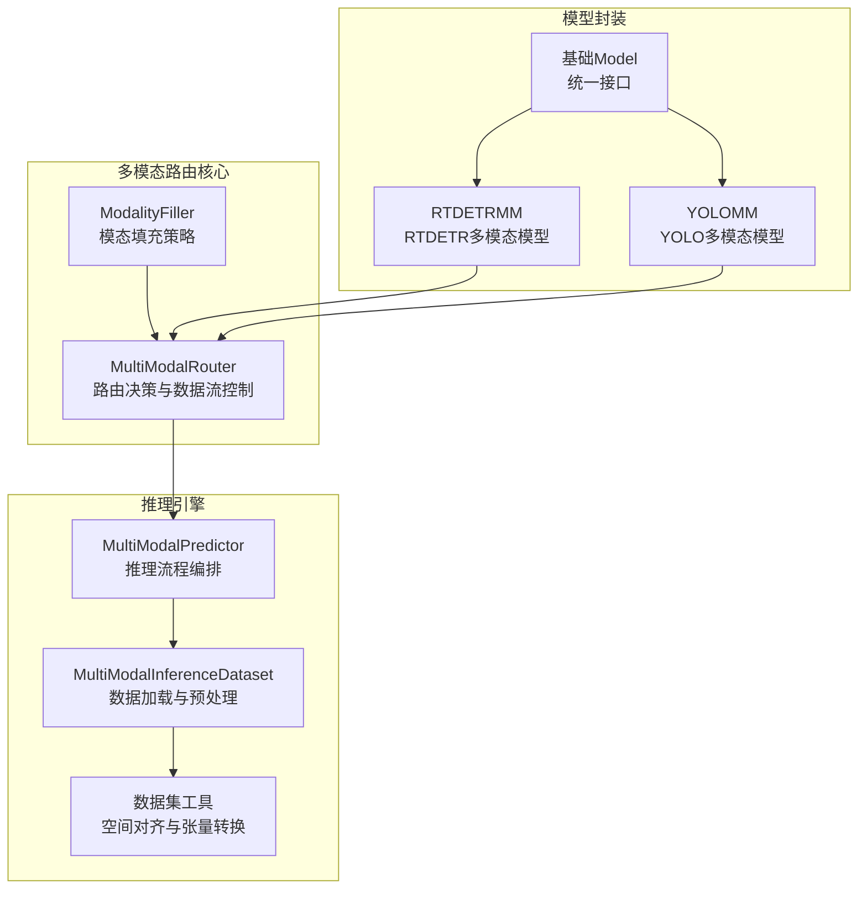
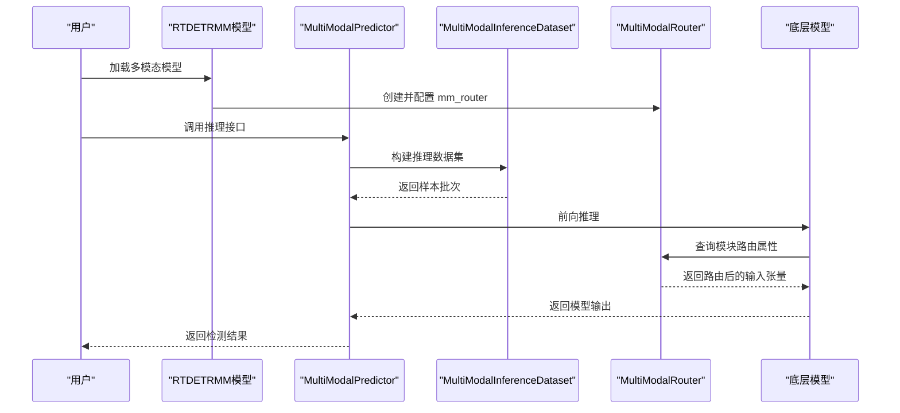
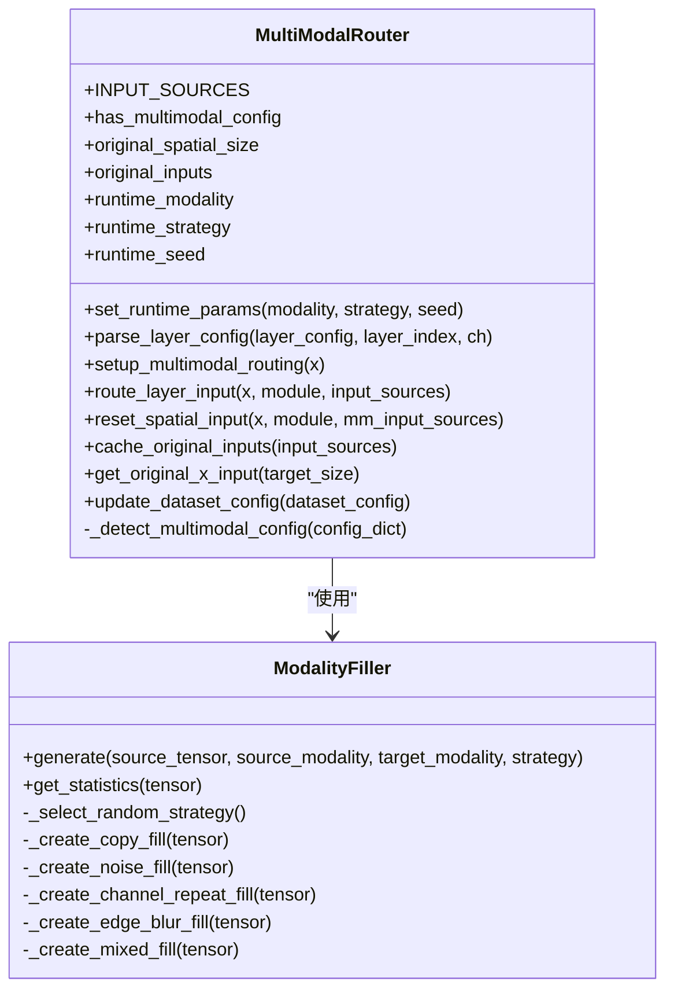
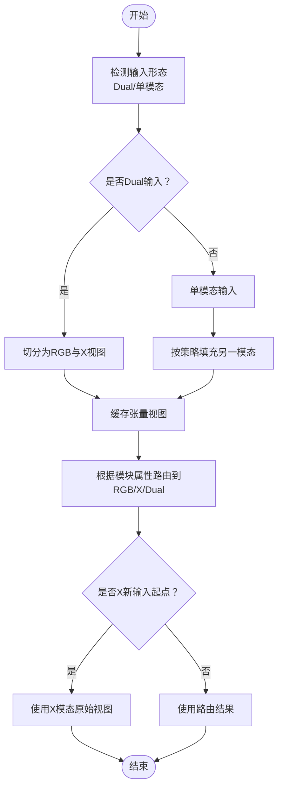
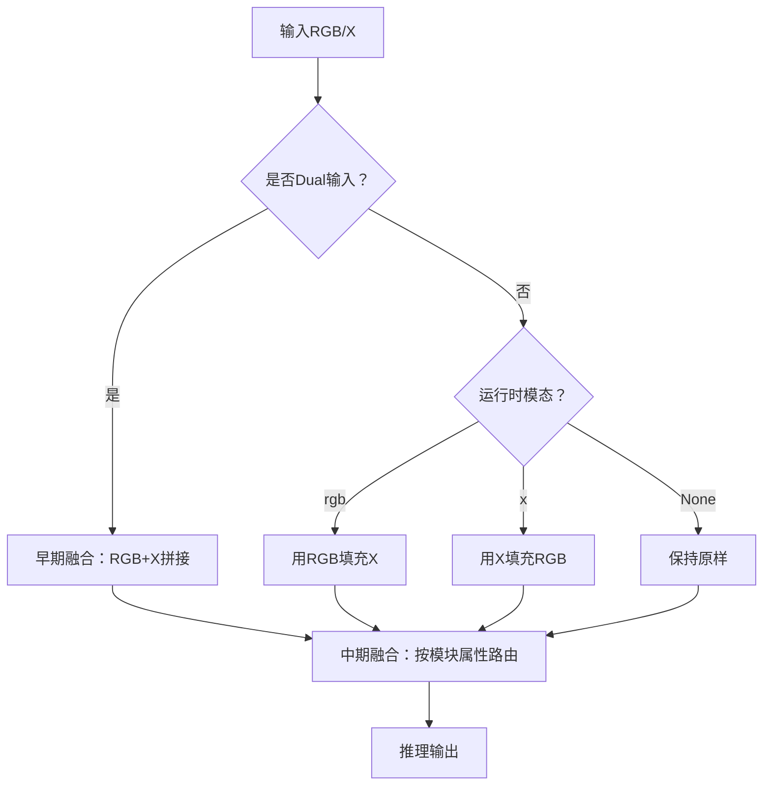
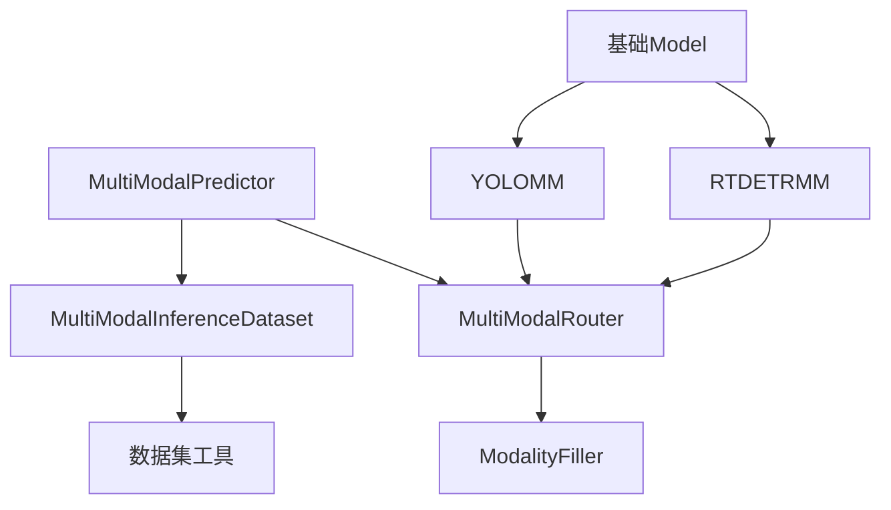

# 多模态路由系统

<cite>
**本文档引用的文件**
- [router.py](file://ultralytics/nn/mm/router.py)
- [filling.py](file://ultralytics/nn/mm/filling.py)
- [predictor.py](file://ultralytics/engine/multimodal/predictor.py)
- [inference_dataset.py](file://ultralytics/data/multimodal/inference_dataset.py)
- [utils.py](file://ultralytics/data/multimodal/utils.py)
- [model.py](file://ultralytics/models/rtdetrmm/model.py)
- [model.py](file://ultralytics/models/yolo/model.py)
- [model.py](file://ultralytics/engine/model.py)
- [__init__.py](file://ultralytics/nn/mm/__init__.py)
</cite>

## 目录
1. [简介](#简介)
2. [项目结构](#项目结构)
3. [核心组件](#核心组件)
4. [架构概览](#架构概览)
5. [详细组件分析](#详细组件分析)
6. [依赖关系分析](#依赖关系分析)
7. [性能考虑](#性能考虑)
8. [故障排除指南](#故障排除指南)
9. [结论](#结论)
10. [附录](#附录)

## 简介
本文件面向多模态路由系统的设计与实现，重点阐述以下内容：
- MultiModalRouter 的核心设计原理与实现机制：模态识别、路由决策、数据流控制
- 零拷贝张量视图路由技术的工作原理与性能优势
- 不同路由策略的实现：早期融合、中期融合、晚期融合
- 具体的配置示例与使用指南，帮助设计与优化多模态路由系统以提升检测性能

该系统支持 RGB 与 X（如深度、热成像、LiDAR 等）模态的统一路由，兼容 YOLO 与 RTDETR 架构，并通过配置驱动的方式实现灵活的数据流控制。

## 项目结构
多模态路由系统主要分布在以下模块：
- 路由核心：ultralytics/nn/mm/router.py
- 模态填充工具：ultralytics/nn/mm/filling.py
- 多模态推理引擎：ultralytics/engine/multimodal/predictor.py
- 多模态数据集：ultralytics/data/multimodal/inference_dataset.py
- 数据集辅助工具：ultralytics/data/multimodal/utils.py
- 模型封装（RTDETRMM/YOLOMM）：ultralytics/models/rtdetrmm/model.py、ultralytics/models/yolo/model.py
- 基础模型框架：ultralytics/engine/model.py
- 模块导出入口：ultralytics/nn/mm/__init__.py

**图表来源**
- [router.py:11-471](file://ultralytics/nn/mm/router.py#L11-L471)
- [filling.py:14-175](file://ultralytics/nn/mm/filling.py#L14-L175)
- [predictor.py:16-494](file://ultralytics/engine/multimodal/predictor.py#L16-L494)
- [inference_dataset.py:16-252](file://ultralytics/data/multimodal/inference_dataset.py#L16-L252)
- [utils.py:13-180](file://ultralytics/data/multimodal/utils.py#L13-L180)
- [model.py:25-269](file://ultralytics/models/rtdetrmm/model.py#L25-L269)
- [model.py:27-200](file://ultralytics/models/yolo/model.py#L27-L200)
- [model.py:29-200](file://ultralytics/engine/model.py#L29-L200)

**章节来源**
- [router.py:11-471](file://ultralytics/nn/mm/router.py#L11-L471)
- [filling.py:14-175](file://ultralytics/nn/mm/filling.py#L14-L175)
- [predictor.py:16-494](file://ultralytics/engine/multimodal/predictor.py#L16-L494)
- [inference_dataset.py:16-252](file://ultralytics/data/multimodal/inference_dataset.py#L16-L252)
- [utils.py:13-180](file://ultralytics/data/multimodal/utils.py#L13-L180)
- [model.py:25-269](file://ultralytics/models/rtdetrmm/model.py#L25-L269)
- [model.py:27-200](file://ultralytics/models/yolo/model.py#L27-L200)
- [model.py:29-200](file://ultralytics/engine/model.py#L29-L200)
- [__init__.py:1-78](file://ultralytics/nn/mm/__init__.py#L1-L78)

## 核心组件
- MultiModalRouter：负责模态识别、路由决策与数据流控制，支持 RGB、X、Dual 三种输入形态，并提供零拷贝张量视图路由能力。
- ModalityFiller：提供多种轻量级的模态填充策略（复制、噪声、通道重复、边缘模糊、混合），用于在单模态输入时合成另一模态。
- MultiModalPredictor：独立的多模态推理引擎，负责构建数据集、执行前向推理、后处理与结果组装。
- MultiModalInferenceDataset：多模态推理专用数据集，负责加载与预处理 RGB/X 图像，执行空间对齐与通道校验。
- 模型封装（RTDETRMM/YOLOMM）：在模型层面集成路由系统，自动检测多模态配置并确保 mm_router 可用。

**章节来源**
- [router.py:11-471](file://ultralytics/nn/mm/router.py#L11-L471)
- [filling.py:14-175](file://ultralytics/nn/mm/filling.py#L14-L175)
- [predictor.py:16-494](file://ultralytics/engine/multimodal/predictor.py#L16-L494)
- [inference_dataset.py:16-252](file://ultralytics/data/multimodal/inference_dataset.py#L16-L252)
- [model.py:25-269](file://ultralytics/models/rtdetrmm/model.py#L25-L269)
- [model.py:27-200](file://ultralytics/models/yolo/model.py#L27-L200)

## 架构概览
多模态路由系统采用“配置驱动 + 零拷贝视图”的设计，核心流程如下：
- 模型初始化阶段：RTDETRMM/YOLOMM 自动检测多模态配置并注入 mm_router
- 推理阶段：MultiModalPredictor 构建 MultiModalInferenceDataset，加载 RGB/X 图像并进行预处理
- 路由阶段：MultiModalRouter 基于模块属性决定输入模态（RGB/X/Dual），并在必要时进行模态填充与通道适配
- 后处理阶段：根据模型类型（YOLO/RTDETR）执行相应的后处理与坐标还原

**图表来源**
- [model.py:148-180](file://ultralytics/models/rtdetrmm/model.py#L148-L180)
- [predictor.py:99-244](file://ultralytics/engine/multimodal/predictor.py#L99-L244)
- [inference_dataset.py:94-184](file://ultralytics/data/multimodal/inference_dataset.py#L94-L184)
- [router.py:157-240](file://ultralytics/nn/mm/router.py#L157-L240)

## 详细组件分析

### MultiModalRouter 组件分析
MultiModalRouter 是多模态路由系统的核心，负责：
- 模态识别：根据模块属性识别当前层所需的输入模态（RGB/X/Dual）
- 路由决策：在 Dual 输入或单模态输入场景下，选择合适的输入张量
- 数据流控制：支持 X 模态新输入起点与空间重置，保证后续层获得正确的空间尺寸
- 零拷贝张量视图：通过缓存原始输入与张量视图，避免不必要的内存拷贝

关键特性与实现要点：
- 输入源配置：RGB(3ch)、X(Xch)、Dual(3+Xch)，Xch 来自数据集配置
- 层配置解析：支持第5字段标识模态来源，如 RGB/X/Dual
- 运行时参数：支持设置运行时模态（rgb/x）、策略（strategy）与随机种子（seed）
- 空间重置：当模块标记为 X 模态新输入起点时，强制使用 X 模态输入并保留原始空间尺寸

**图表来源**
- [router.py:11-471](file://ultralytics/nn/mm/router.py#L11-L471)
- [filling.py:14-175](file://ultralytics/nn/mm/filling.py#L14-L175)

**章节来源**
- [router.py:31-471](file://ultralytics/nn/mm/router.py#L31-L471)
- [filling.py:14-175](file://ultralytics/nn/mm/filling.py#L14-L175)

### 零拷贝张量视图路由技术
零拷贝张量视图路由通过以下机制实现：
- 张量视图缓存：在 setup_multimodal_routing 阶段，将 RGB、X、Dual 输入缓存为张量视图，避免复制
- 原始输入缓存：cache_original_inputs 将 X 模态的原始输入引用缓存，用于空间重置
- 视图复用：route_layer_input 与 reset_spatial_input 直接返回缓存的视图，减少内存分配与拷贝

性能优势：
- 减少内存占用：避免重复分配相同数据的内存
- 提升推理速度：降低 CPU/GPU 内存带宽压力
- 保持数据一致性：通过视图共享，确保后续层访问到一致的数据

**图表来源**
- [router.py:157-240](file://ultralytics/nn/mm/router.py#L157-L240)
- [router.py:242-404](file://ultralytics/nn/mm/router.py#L242-L404)

**章节来源**
- [router.py:157-404](file://ultralytics/nn/mm/router.py#L157-L404)

### 多模态路由策略实现
系统支持三种路由策略，分别对应不同的融合时机：

- 早期融合（Early Fusion）
  - 定义：在输入层将 RGB 与 X 按通道拼接形成 Dual 输入
  - 实现：setup_multimodal_routing 在 Dual 输入时直接切分 RGB 与 X，并按运行时参数填充另一模态
  - 适用：需要在骨干网络早期就融合信息的任务

- 中期融合（Mid Fusion）
  - 定义：在骨干网络中间层根据模块属性选择 RGB 或 X 输入
  - 实现：parse_layer_config 与 route_layer_input 基于模块属性（RGB/X/Dual）进行路由
  - 适用：希望在特征提取过程中逐步融合信息的任务

- 晚期融合（Late Fusion）
  - 定义：在头部或后处理阶段进行融合（例如将两路检测结果合并）
  - 实现：系统未内置晚期融合逻辑，可通过外部后处理实现
  - 适用：需要独立学习各模态特征后再融合的场景

**图表来源**
- [router.py:157-240](file://ultralytics/nn/mm/router.py#L157-L240)
- [router.py:90-156](file://ultralytics/nn/mm/router.py#L90-L156)

**章节来源**
- [router.py:90-240](file://ultralytics/nn/mm/router.py#L90-L240)

### MultiModalPredictor 推理引擎
MultiModalPredictor 的职责：
- 从模型读取 Router 配置（Xch、x_modality）
- 构建 MultiModalInferenceDataset 并迭代样本
- 对每个样本执行：forward -> NMS（YOLO）或 RTDETR 后处理 -> 坐标还原 -> 组装结果
- 支持真正的流式推理（边迭代边 yield）

关键流程：
- 输入解析：PairingResolver 将 RGB 与 X 源配对
- 数据集构建：MultiModalInferenceDataset 加载与预处理
- 前向推理：调用模型 forward
- 后处理：YOLO 使用 NMS，RTDETR 使用置信度过滤与 NMS，并进行坐标缩放与还原

**章节来源**
- [predictor.py:16-494](file://ultralytics/engine/multimodal/predictor.py#L16-L494)
- [inference_dataset.py:16-252](file://ultralytics/data/multimodal/inference_dataset.py#L16-L252)

### 多模态数据集与预处理
MultiModalInferenceDataset 的职责：
- 严格校验：RGB/X 存在性、可读性、X 通道数一致性
- 统一预处理：LetterBox + 转 tensor + 归一化
- 支持单模态零填充：当某模态缺失时，使用零张量填充

数据集工具：
- align_and_validate_x：对齐并校验 X 模态的空间尺寸与通道数
- letterbox_with_ratio_pad：应用 LetterBox 并返回 ratio_pad 信息
- to_tensor_rgb/to_tensor_x：将图像转换为张量并进行归一化

**章节来源**
- [inference_dataset.py:16-252](file://ultralytics/data/multimodal/inference_dataset.py#L16-L252)
- [utils.py:13-180](file://ultralytics/data/multimodal/utils.py#L13-L180)

### 模型封装（RTDETRMM/YOLOMM）
- RTDETRMM：独立的多模态 RT-DETR 家族模型入口，Fail-Fast 识别多模态结构，确保 mm_router 可用
- YOLOMM：通过文件名包含 "-mm" 识别多模态模型，自动切换到 YOLOMM 任务类型
- 基础 Model：提供统一的模型加载与接口，支持 HUB/Triton 等多种来源

**章节来源**
- [model.py:25-269](file://ultralytics/models/rtdetrmm/model.py#L25-L269)
- [model.py:27-200](file://ultralytics/models/yolo/model.py#L27-L200)
- [model.py:29-200](file://ultralytics/engine/model.py#L29-L200)

## 依赖关系分析
多模态路由系统的关键依赖关系如下：
- MultiModalRouter 依赖 ModalityFiller 进行模态填充
- MultiModalPredictor 依赖 MultiModalInferenceDataset 与 Router
- MultiModalInferenceDataset 依赖数据集工具（align_and_validate_x、to_tensor_*）
- RTDETRMM/YOLOMM 在模型层面注入 mm_router
- 基础 Model 提供统一的模型加载与接口

**图表来源**
- [router.py:11-471](file://ultralytics/nn/mm/router.py#L11-L471)
- [filling.py:14-175](file://ultralytics/nn/mm/filling.py#L14-L175)
- [predictor.py:16-494](file://ultralytics/engine/multimodal/predictor.py#L16-L494)
- [inference_dataset.py:16-252](file://ultralytics/data/multimodal/inference_dataset.py#L16-L252)
- [utils.py:13-180](file://ultralytics/data/multimodal/utils.py#L13-L180)
- [model.py:25-269](file://ultralytics/models/rtdetrmm/model.py#L25-L269)
- [model.py:27-200](file://ultralytics/models/yolo/model.py#L27-L200)
- [model.py:29-200](file://ultralytics/engine/model.py#L29-L200)

**章节来源**
- [router.py:11-471](file://ultralytics/nn/mm/router.py#L11-L471)
- [filling.py:14-175](file://ultralytics/nn/mm/filling.py#L14-L175)
- [predictor.py:16-494](file://ultralytics/engine/multimodal/predictor.py#L16-L494)
- [inference_dataset.py:16-252](file://ultralytics/data/multimodal/inference_dataset.py#L16-L252)
- [utils.py:13-180](file://ultralytics/data/multimodal/utils.py#L13-L180)
- [model.py:25-269](file://ultralytics/models/rtdetrmm/model.py#L25-L269)
- [model.py:27-200](file://ultralytics/models/yolo/model.py#L27-L200)
- [model.py:29-200](file://ultralytics/engine/model.py#L29-L200)

## 性能考虑
- 零拷贝张量视图：通过缓存张量视图与原始输入，显著减少内存分配与拷贝，提升推理吞吐
- 轻量填充策略：ModalityFiller 提供多种快速、确定性的填充策略，避免在路由路径引入重型依赖
- LetterBox 对齐：统一的 LetterBox 预处理与 ratio_pad 计算，确保坐标还原准确且高效
- 流式推理：MultiModalPredictor 支持真正的流式推理，边迭代边产出结果，降低延迟

[本节为一般性指导，无需特定文件分析]

## 故障排除指南
常见问题与排查建议：
- 模型缺少 mm_router：确保使用 YOLOMM 或 RTDETRMM 模型，并确认模型已正确注入 mm_router
- X 模态通道数不匹配：检查数据集配置中的 Xch 与实际 X 图像通道数是否一致
- 空间尺寸不一致：确认 RGB 与 X 图像在预处理阶段已完成空间对齐
- 路由失败：检查模块属性（_mm_input_source）是否正确设置，以及输入源是否存在

**章节来源**
- [predictor.py:60-69](file://ultralytics/engine/multimodal/predictor.py#L60-L69)
- [inference_dataset.py:132-158](file://ultralytics/data/multimodal/inference_dataset.py#L132-L158)
- [utils.py:13-84](file://ultralytics/data/multimodal/utils.py#L13-L84)
- [router.py:242-318](file://ultralytics/nn/mm/router.py#L242-L318)

## 结论
多模态路由系统通过 MultiModalRouter 实现了对 RGB 与 X 模态的统一管理，结合零拷贝张量视图路由与轻量填充策略，在保证灵活性的同时提升了性能。系统支持早期、中期与晚期融合策略，能够满足多样化的多模态检测需求。通过合理的配置与使用，可以有效提升检测精度与推理效率。

[本节为总结性内容，无需特定文件分析]

## 附录

### 配置示例与使用指南
- 设置运行时参数：通过 MultiModalRouter.set_runtime_params 指定运行时模态（rgb/x）与填充策略
- 数据集配置：在数据集配置中设置 Xch 与 x_modality，确保与模型配置一致
- 推理调用：使用 MultiModalPredictor 的 __call__ 接口，传入 RGB 与 X 源，支持流式与批量两种模式

最佳实践建议：
- 早期融合适用于需要在骨干网络早期就融合信息的任务
- 中期融合适用于希望在特征提取过程中逐步融合信息的任务
- 晚期融合适用于需要独立学习各模态特征后再融合的场景，可通过外部后处理实现

**章节来源**
- [router.py:64-69](file://ultralytics/nn/mm/router.py#L64-L69)
- [router.py:406-447](file://ultralytics/nn/mm/router.py#L406-L447)
- [predictor.py:99-143](file://ultralytics/engine/multimodal/predictor.py#L99-L143)