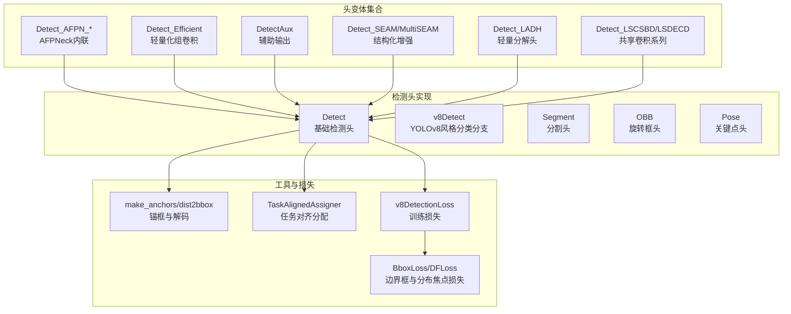
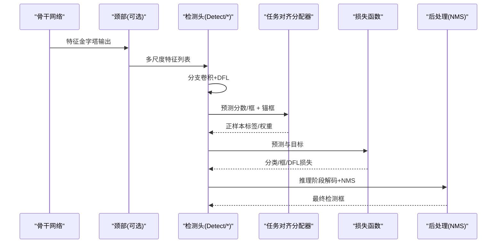
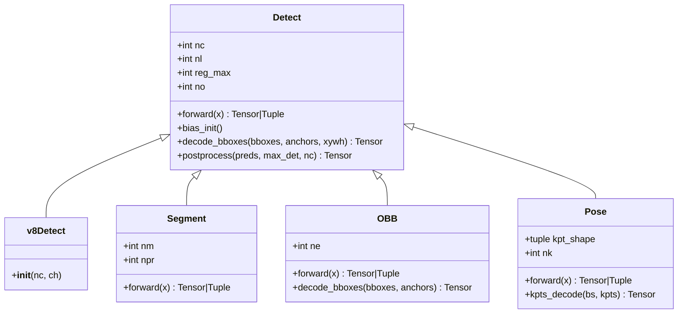
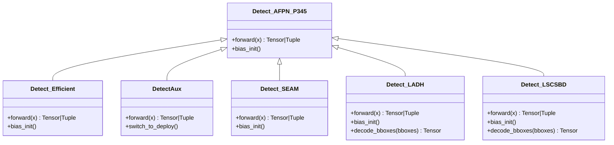
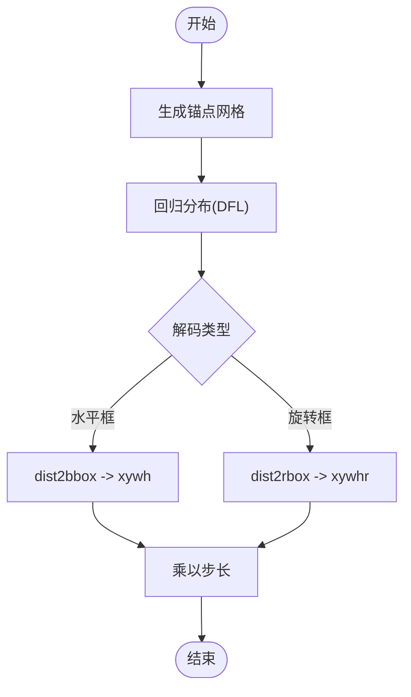
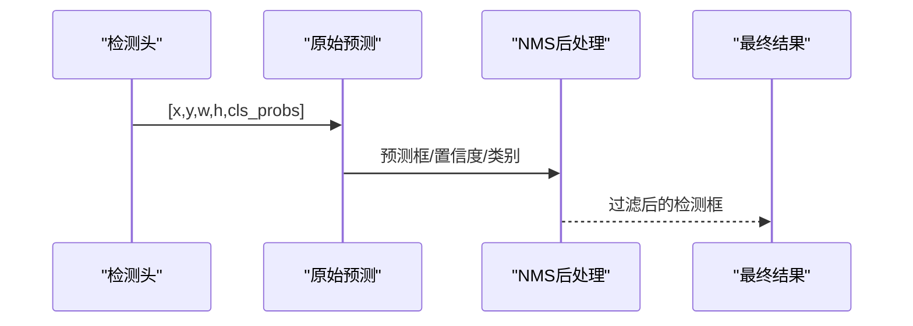
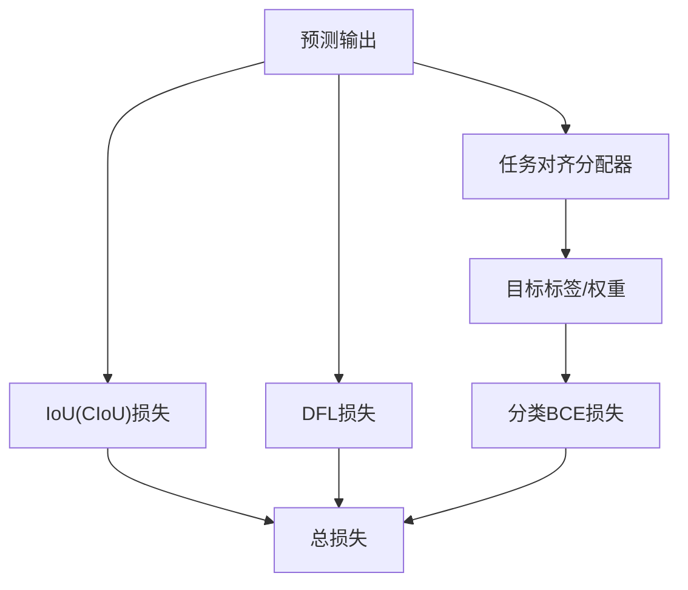
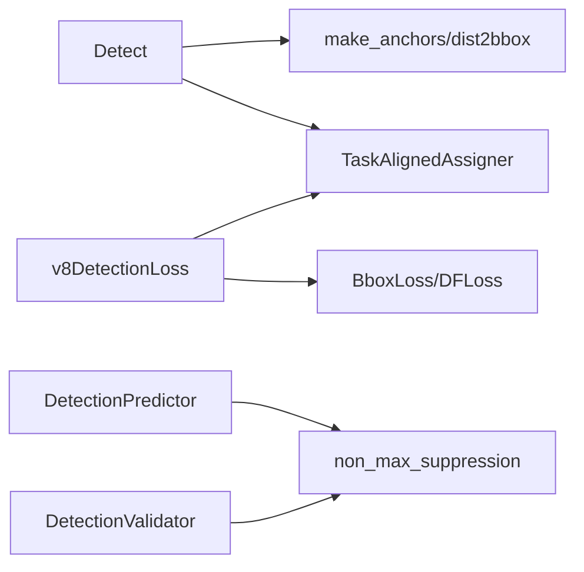

# YOLO检测头架构

<cite>
**本文档引用的文件**
- [ultralytics\nn\modules\head.py](file://ultralytics\nn\modules\head.py)
- [ultralytics\nn\Head\yolo11_head_variants.py](file://ultralytics\nn\Head\yolo11_head_variants.py)
- [ultralytics\utils\tal.py](file://ultralytics\utils\tal.py)
- [ultralytics\utils\loss.py](file://ultralytics\utils\loss.py)
- [ultralytics\models\yolo\detect\train.py](file://ultralytics\models\yolo\detect\train.py)
- [ultralytics\models\yolo\detect\predict.py](file://ultralytics\models\yolo\detect\predict.py)
- [ultralytics\models\yolo\detect\val.py](file://ultralytics\models\yolo\detect\val.py)
</cite>

## 目录
1. [简介](#简介)
2. [项目结构](#项目结构)
3. [核心组件](#核心组件)
4. [架构总览](#架构总览)
5. [详细组件分析](#详细组件分析)
6. [依赖关系分析](#依赖关系分析)
7. [性能考虑](#性能考虑)
8. [故障排除指南](#故障排除指南)
9. [结论](#结论)
10. [附录](#附录)

## 简介
本文件系统性阐述YOLO检测头的架构与实现，覆盖前向传播、边界框回归、分类置信度计算、非极大值抑制（NMS）、多尺度特征融合、锚框机制以及损失函数设计。文档同时给出可操作的配置示例与调参建议，帮助用户根据实际检测需求（输入尺寸、类别数量、锚框配置等）定制化调整检测头参数。

## 项目结构
YOLO检测头相关代码主要分布在以下模块：
- 检测头基础实现：ultralytics\nn\modules\head.py
- YOLO11头变体集合：ultralytics\nn\Head\yolo11_head_variants.py
- 任务对齐分配与锚框工具：ultralytics\utils\tal.py
- 损失函数与训练流程：ultralytics\utils\loss.py
- 推理与验证流程：ultralytics\models\yolo\detect\predict.py、ultralytics\models\yolo\detect\val.py、ultralytics\models\yolo\detect\train.py

**图示来源**
- [ultralytics\nn\modules\head.py:24-434](file://ultralytics\nn\modules\head.py#L24-L434)
- [ultralytics\nn\Head\yolo11_head_variants.py:69-804](file://ultralytics\nn\Head\yolo11_head_variants.py#L69-L804)
- [ultralytics\utils\tal.py:367-420](file://ultralytics\utils\tal.py#L367-L420)
- [ultralytics\utils\loss.py:194-311](file://ultralytics\utils\loss.py#L194-L311)

**章节来源**
- [ultralytics\nn\modules\head.py:24-434](file://ultralytics\nn\modules\head.py#L24-L434)
- [ultralytics\nn\Head\yolo11_head_variants.py:69-804](file://ultralytics\nn\Head\yolo11_head_variants.py#L69-L804)
- [ultralytics\utils\tal.py:367-420](file://ultralytics\utils\tal.py#L367-L420)
- [ultralytics\utils\loss.py:194-311](file://ultralytics\utils\loss.py#L194-L311)

## 核心组件
- 检测头基类 Detect：负责多尺度特征拼接、回归分支（DFL）与分类分支、锚框生成与解码、推理后处理（NMS）。
- 变体头：提供AFPNeck内联、轻量化组卷积、SEAM/MultiSEAM结构化增强、LADH轻量分解、LSCSBD/LSDECD共享卷积等多样化实现。
- 工具模块：make_anchors生成锚框网格，dist2bbox/dist2rbox完成距离到框的解码，TaskAlignedAssigner执行任务对齐匹配。
- 损失函数：v8DetectionLoss统一计算分类（BCE）、边界框（IoU+DFL）损失，并通过任务对齐分配器获得正样本标签。

**章节来源**
- [ultralytics\nn\modules\head.py:24-231](file://ultralytics\nn\modules\head.py#L24-L231)
- [ultralytics\nn\Head\yolo11_head_variants.py:69-804](file://ultralytics\nn\Head\yolo11_head_variants.py#L69-L804)
- [ultralytics\utils\tal.py:14-127](file://ultralytics\utils\tal.py#L14-L127)
- [ultralytics\utils\loss.py:194-311](file://ultralytics\utils\loss.py#L194-L311)

## 架构总览
下图展示了从特征图到最终检测框的关键路径：多尺度特征经各检测头分支产出预测，再通过任务对齐分配器生成目标标签，最后在损失函数中联合优化。

**图示来源**
- [ultralytics\nn\modules\head.py:114-189](file://ultralytics\nn\modules\head.py#L114-L189)
- [ultralytics\utils\tal.py:47-127](file://ultralytics\utils\tal.py#L47-L127)
- [ultralytics\utils\loss.py:243-310](file://ultralytics\utils\loss.py#L243-L310)

## 详细组件分析

### Detect基础检测头
- 多尺度特征输入：接收来自骨干网络不同层级的特征图列表。
- 分支结构：回归分支（box）与分类分支（cls）分别预测偏移与类别概率；支持端到端模式（end2end）。
- DFL分布焦点回归：reg_max控制分布维度，提升定位精度。
- 锚框生成与解码：动态生成锚点网格，使用dist2bbox将分布解码为真实框坐标。
- 推理后处理：在导出或推理模式下执行NMS，限制最大检测数，输出标准化框与置信度。

**图示来源**
- [ultralytics\nn\modules\head.py:24-434](file://ultralytics\nn\modules\head.py#L24-L434)

**章节来源**
- [ultralytics\nn\modules\head.py:24-231](file://ultralytics\nn\modules\head.py#L24-L231)

### YOLO11头变体
- AFPN内联头：在检测头内部集成AFPNeck，支持P345/P2345多尺度融合。
- 轻量化组卷积头：使用组卷积作为stem，减少参数量。
- 辅助输出头：在训练阶段额外输出辅助分支，部署时可切换至主干。
- 结构化增强头：引入SEAM/MultiSEAM模块提升特征表达。
- 轻量分解头：采用深度分离卷积等轻量结构。
- 共享卷积系列：LSCSBD/LSDECD通过共享卷积与BN分离策略平衡精度与效率。

**图示来源**
- [ultralytics\nn\Head\yolo11_head_variants.py:69-804](file://ultralytics\nn\Head\yolo11_head_variants.py#L69-L804)

**章节来源**
- [ultralytics\nn\Head\yolo11_head_variants.py:69-804](file://ultralytics\nn\Head\yolo11_head_variants.py#L69-L804)

### 锚框与解码机制
- 锚框生成：基于特征图尺寸与步长生成网格锚点，支持动态重建。
- 距离到框解码：将回归分布解码为xywh或xyxy格式，结合步长缩放得到真实像素坐标。
- 旋转框解码：OBB头使用角度信息与分布共同解码为旋转矩形。

**图示来源**
- [ultralytics\utils\tal.py:367-420](file://ultralytics\utils\tal.py#L367-L420)
- [ultralytics\nn\modules\head.py:204-206](file://ultralytics\nn\modules\head.py#L204-L206)

**章节来源**
- [ultralytics\utils\tal.py:367-420](file://ultralytics\utils\tal.py#L367-L420)
- [ultralytics\nn\modules\head.py:150-189](file://ultralytics\nn\modules\head.py#L150-L189)

### 分类置信度与NMS
- 分类置信度：分类分支输出logits，推理阶段经sigmoid得到类别概率。
- NMS后处理：DetectionPredictor在推理阶段调用non_max_suppression，支持阈值、IoU阈值、最大检测数、类别过滤等参数。

**图示来源**
- [ultralytics\models\yolo\detect\predict.py:34-82](file://ultralytics\models\yolo\detect\predict.py#L34-L82)

**章节来源**
- [ultralytics\nn\modules\head.py:208-230](file://ultralytics\nn\modules\head.py#L208-L230)
- [ultralytics\models\yolo\detect\predict.py:34-82](file://ultralytics\models\yolo\detect\predict.py#L34-L82)

### 多尺度特征融合策略
- 头内融合：部分变体（如Detect_AFPN_*）在检测头内部集成AFPNeck，直接对多尺度特征进行融合。
- 头外融合：常规Detect头接收来自骨干/独立颈部的多尺度特征，按层级分别处理后在前向中拼接。

**章节来源**
- [ultralytics\nn\Head\yolo11_head_variants.py:69-152](file://ultralytics\nn\Head\yolo11_head_variants.py#L69-L152)
- [ultralytics\nn\modules\head.py:114-124](file://ultralytics\nn\modules\head.py#L114-L124)

### 损失函数设计
- 分类损失：BCEWithLogitsLoss，配合任务对齐分配器提供的正负样本权重。
- 边界框损失：IoU（CIoU）+ DFL（Distribution Focal Loss），DFL通过reg_max控制分布维度。
- 训练流程：DetectionTrainer构建数据集、加载器，v8DetectionLoss在前向后进行任务对齐分配与损失计算。

**图示来源**
- [ultralytics\utils\loss.py:194-311](file://ultralytics\utils\loss.py#L194-L311)
- [ultralytics\utils\tal.py:47-127](file://ultralytics\utils\tal.py#L47-L127)

**章节来源**
- [ultralytics\utils\loss.py:194-311](file://ultralytics\utils\loss.py#L194-L311)
- [ultralytics\models\yolo\detect\train.py:21-152](file://ultralytics\models\yolo\detect\train.py#L21-L152)

## 依赖关系分析
- Detect依赖工具模块：make_anchors、dist2bbox、TaskAlignedAssigner。
- 损失函数依赖：BboxLoss、DFLoss、TaskAlignedAssigner、dist2bbox/bbox2dist。
- 推理与验证：DetectionPredictor调用ops.non_max_suppression，DetectionValidator在验证阶段应用NMS并计算指标。

**图示来源**
- [ultralytics\nn\modules\head.py:114-189](file://ultralytics\nn\modules\head.py#L114-L189)
- [ultralytics\utils\loss.py:194-311](file://ultralytics\utils\loss.py#L194-L311)
- [ultralytics\models\yolo\detect\predict.py:34-82](file://ultralytics\models\yolo\detect\predict.py#L34-L82)
- [ultralytics\models\yolo\detect\val.py:107-129](file://ultralytics\models\yolo\detect\val.py#L107-L129)

**章节来源**
- [ultralytics\nn\modules\head.py:114-189](file://ultralytics\nn\modules\head.py#L114-L189)
- [ultralytics\utils\loss.py:194-311](file://ultralytics\utils\loss.py#L194-L311)
- [ultralytics\models\yolo\detect\predict.py:34-82](file://ultralytics\models\yolo\detect\predict.py#L34-L82)
- [ultralytics\models\yolo\detect\val.py:107-129](file://ultralytics\models\yolo\detect\val.py#L107-L129)

## 性能考虑
- DFL维度：reg_max越大，定位越精细但计算与存储开销增加；通常取16。
- 分支结构：组卷积、深度分离卷积等轻量化结构可在保证精度的同时降低参数量与计算量。
- 多尺度融合：AFPNeck等融合策略可提升小目标检测性能，但需权衡计算成本。
- NMS参数：conf、iou、max_det直接影响检测质量与速度，应结合场景调优。

## 故障排除指南
- CUDA内存不足：任务对齐分配器在大批次时可能触发OOM，代码已内置CPU回退策略；可通过减小batch或显存占用较大的分支结构缓解。
- 预测为空：检查conf阈值是否过高、类别数量是否正确设置、NMS参数是否合理。
- 验证指标异常：确认数据集格式与类别映射正确，必要时启用COCO/LVIS评估流程。

**章节来源**
- [ultralytics\utils\tal.py:83-90](file://ultralytics\utils\tal.py#L83-L90)
- [ultralytics\models\yolo\detect\val.py:417-478](file://ultralytics\models\yolo\detect\val.py#L417-L478)

## 结论
YOLO检测头通过多尺度特征融合、任务对齐分配与DFL分布回归，实现了高精度与高效率的检测。变体头进一步丰富了在不同硬件与精度需求下的选择空间。结合合理的配置（输入尺寸、类别数、锚框与NMS参数）与损失设计，可针对具体应用场景取得最佳效果。

## 附录

### 配置示例与参数说明
- 输入尺寸与通道
  - 输入尺寸：imgsz（如640），影响特征图分辨率与锚框尺度。
  - 输入通道：ch（如3或6，取决于多模态需求）。
- 类别数量与名称
  - nc：类别数；names：类别名称列表。
- 锚框与回归
  - reg_max：DFL分布维度；stride：特征图步长。
- NMS与后处理
  - conf：分类置信度阈值；iou：NMS IoU阈值；max_det：最大检测数。
- 训练超参
  - box/cls/dfl：损失权重；multi_scale：多尺度训练；workers：数据加载并发。

**章节来源**
- [ultralytics\models\yolo\detect\train.py:92-117](file://ultralytics\models\yolo\detect\train.py#L92-L117)
- [ultralytics\utils\loss.py:194-311](file://ultralytics\utils\loss.py#L194-L311)
- [ultralytics\nn\modules\head.py:78-90](file://ultralytics\nn\modules\head.py#L78-L90)