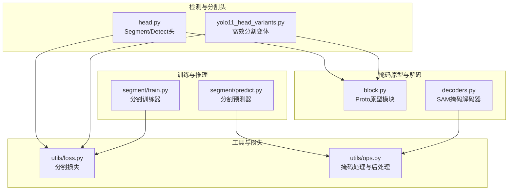
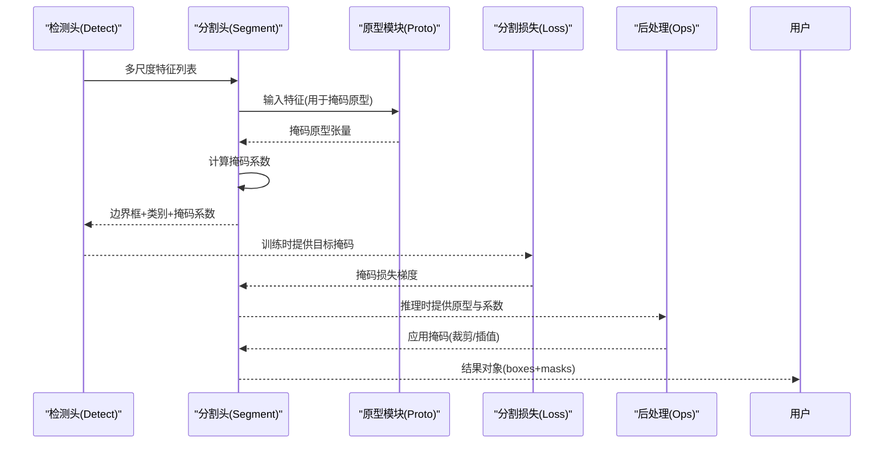
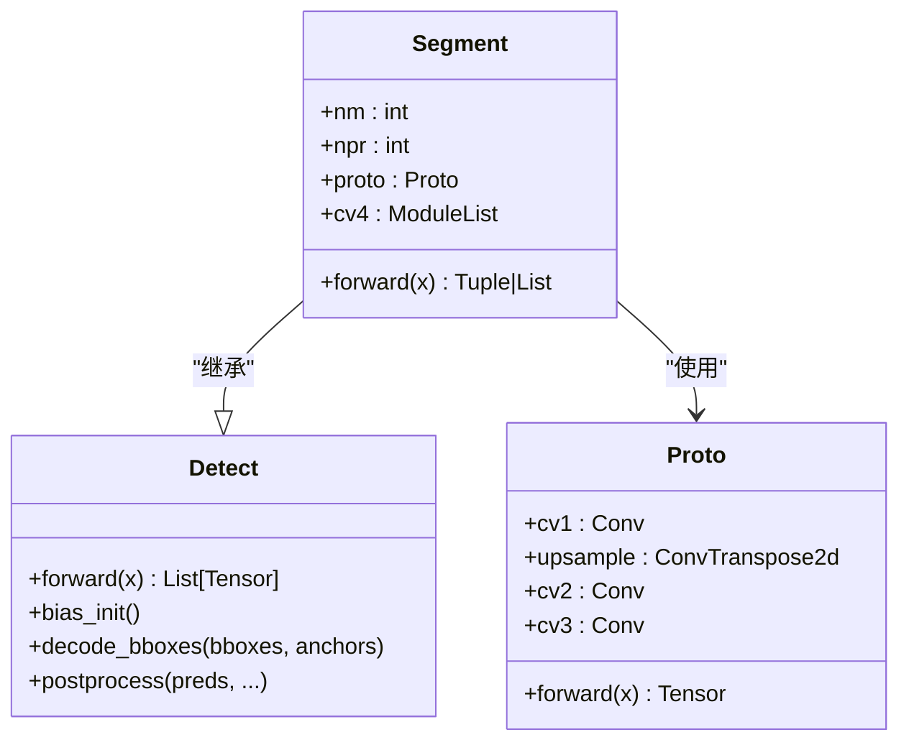
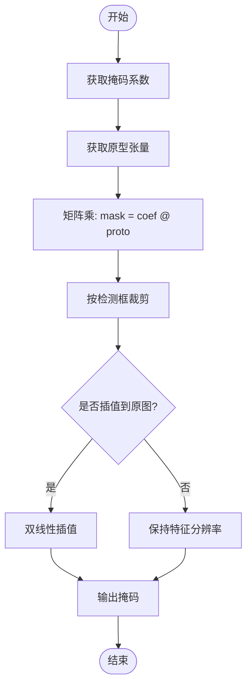
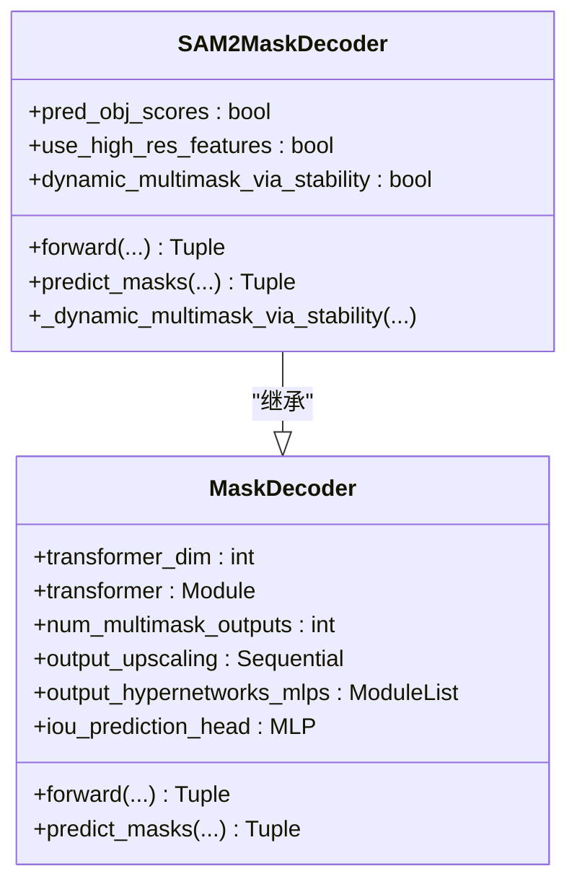
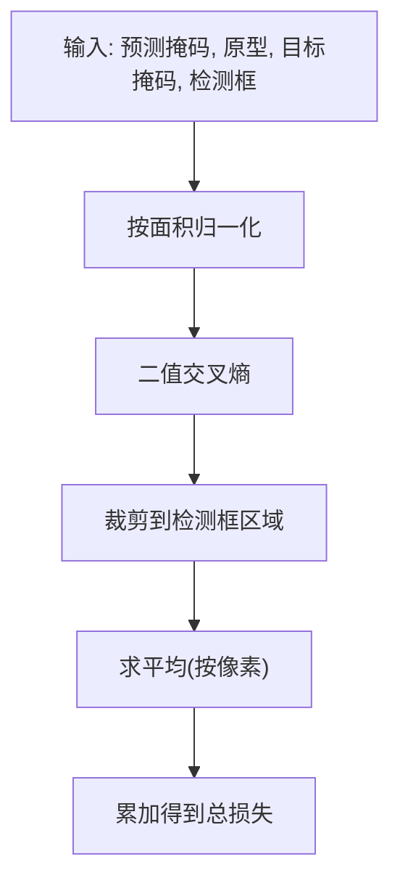
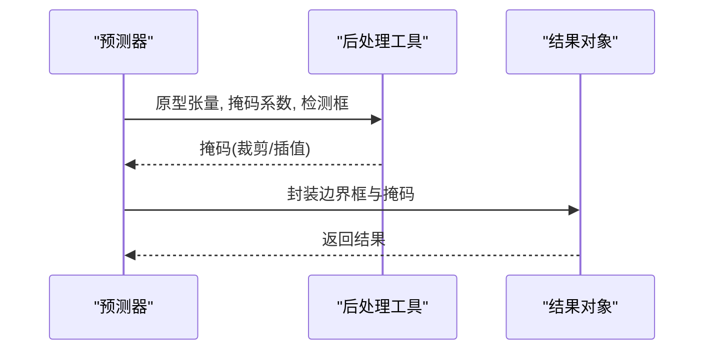
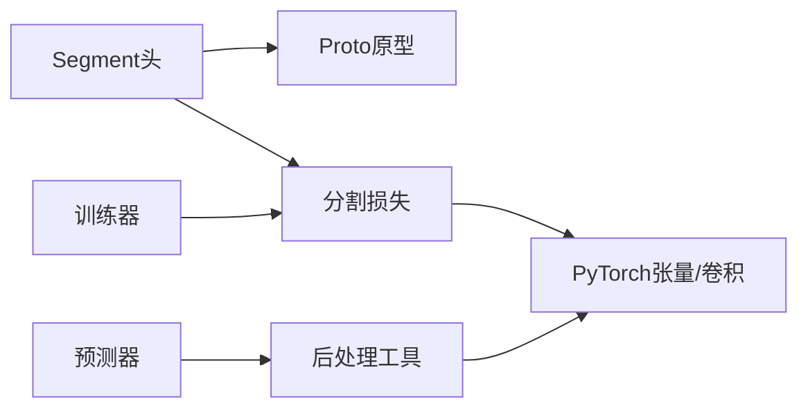

# 分割头架构

<cite>
**本文档引用的文件**
- [head.py](file://ultralytics/nn/modules/head.py)
- [block.py](file://ultralytics/nn/modules/block.py)
- [decoders.py](file://ultralytics/models/sam/modules/decoders.py)
- [predict.py](file://ultralytics/models/yolo/segment/predict.py)
- [train.py](file://ultralytics/models/yolo/segment/train.py)
- [loss.py](file://ultralytics/utils/loss.py)
- [ops.py](file://ultralytics/utils/ops.py)
- [yolo11_head_variants.py](file://ultralytics/nn/Head/yolo11_head_variants.py)
</cite>

## 目录
1. [简介](#简介)
2. [项目结构](#项目结构)
3. [核心组件](#核心组件)
4. [架构总览](#架构总览)
5. [详细组件分析](#详细组件分析)
6. [依赖关系分析](#依赖关系分析)
7. [性能考虑](#性能考虑)
8. [故障排查指南](#故障排查指南)
9. [结论](#结论)

## 简介
本文件系统性阐述实例分割头的架构设计与实现原理，重点覆盖以下方面：
- 掩码预测机制：从检测头特征图生成像素级分割掩码的完整流程
- 分割损失函数：掩码损失的数学形式、归一化与正则化策略
- 后处理算法：掩码裁剪、插值、非极大值抑制与结果封装
- 上采样策略：多级特征融合与逐级上采样
- 掩码解码器：原型解码器与基于Transformer的掩码解码器
- 参数配置：掩码分辨率、损失权重、后处理阈值等可调参数

该文档面向不同技术背景的读者，既提供高层架构概览，也包含代码级细节与可视化图示，便于快速定位实现位置与进行参数调优。

## 项目结构
本仓库中与分割头直接相关的模块主要分布在以下目录：
- 检测与分割头模块：ultralytics/nn/modules/head.py、ultralytics/nn/Head/yolo11_head_variants.py
- 掩码原型与解码器：ultralytics/nn/modules/block.py、ultralytics/models/sam/modules/decoders.py
- 训练与推理接口：ultralytics/models/yolo/segment/train.py、ultralytics/models/yolo/segment/predict.py
- 损失计算与后处理：ultralytics/utils/loss.py、ultralytics/utils/ops.py

**图表来源**
- [head.py:250-300](file://ultralytics/nn/modules/head.py#L250-L300)
- [block.py:96-117](file://ultralytics/nn/modules/block.py#L96-L117)
- [decoders.py:11-87](file://ultralytics/models/sam/modules/decoders.py#L11-L87)
- [predict.py:8-114](file://ultralytics/models/yolo/segment/predict.py#L8-L114)
- [train.py:13-88](file://ultralytics/models/yolo/segment/train.py#L13-L88)
- [loss.py:384-428](file://ultralytics/utils/loss.py#L384-L428)
- [ops.py:692-742](file://ultralytics/utils/ops.py#L692-L742)

**章节来源**
- [head.py:250-300](file://ultralytics/nn/modules/head.py#L250-L300)
- [block.py:96-117](file://ultralytics/nn/modules/block.py#L96-L117)
- [decoders.py:11-87](file://ultralytics/models/sam/modules/decoders.py#L11-L87)
- [predict.py:8-114](file://ultralytics/models/yolo/segment/predict.py#L8-L114)
- [train.py:13-88](file://ultralytics/models/yolo/segment/train.py#L13-L88)
- [loss.py:384-428](file://ultralytics/utils/loss.py#L384-L428)
- [ops.py:692-742](file://ultralytics/utils/ops.py#L692-L742)

## 核心组件
- 检测头基类与分割头扩展
  - 检测头基类 Detect 提供多尺度特征拼接、边界框回归与分类输出
  - 分割头 Segment 在 Detect 基础上增加掩码原型模块与掩码系数分支
- 掩码原型模块 Proto
  - 通过卷积与转置卷积对输入特征进行上采样，生成掩码原型张量
- 掩码解码器
  - 基于原型的线性解码：通过掩码系数与原型矩阵乘得到掩码
  - 基于Transformer的掩码解码器：SAM/SAM2风格，支持高分辨率特征与动态多掩码选择
- 训练与推理
  - 训练器 SegmentationTrainer 负责模型初始化、验证与指标可视化
  - 预测器 SegmentationPredictor 负责后处理、掩码应用与结果封装
- 损失函数
  - 分割损失采用二值交叉熵，结合掩码裁剪与面积归一化
- 后处理
  - 掩码裁剪、插值到原图尺寸、非重叠约束与结果对象封装

**章节来源**
- [head.py:250-300](file://ultralytics/nn/modules/head.py#L250-L300)
- [block.py:96-117](file://ultralytics/nn/modules/block.py#L96-L117)
- [decoders.py:11-87](file://ultralytics/models/sam/modules/decoders.py#L11-L87)
- [train.py:13-88](file://ultralytics/models/yolo/segment/train.py#L13-L88)
- [predict.py:8-114](file://ultralytics/models/yolo/segment/predict.py#L8-L114)
- [loss.py:384-428](file://ultralytics/utils/loss.py#L384-L428)
- [ops.py:692-742](file://ultralytics/utils/ops.py#L692-L742)

## 架构总览
下图展示了从检测头特征到像素级掩码的端到端流程，包括掩码原型生成、掩码解码与后处理。

**图表来源**
- [head.py:250-300](file://ultralytics/nn/modules/head.py#L250-L300)
- [block.py:96-117](file://ultralytics/nn/modules/block.py#L96-L117)
- [loss.py:384-428](file://ultralytics/utils/loss.py#L384-L428)
- [ops.py:692-742](file://ultralytics/utils/ops.py#L692-L742)

## 详细组件分析

### 组件A：检测头与分割头（Segment）
- 设计要点
  - 检测头 Detect 负责多尺度特征的边界框与类别预测
  - 分割头 Segment 在 Detect 基础上增加掩码原型模块与掩码系数分支
  - 掩码系数通过卷积堆叠从各尺度特征聚合得到，最终与原型矩阵相乘生成掩码
- 数据流
  - 前向传播：先执行 Detect 的前向，再计算掩码系数与原型
  - 训练模式：返回检测输出、掩码系数与原型
  - 推理模式：返回检测结果与原型，供预测器进一步处理
- 关键实现位置
  - 分割头定义与前向：[head.py:250-300](file://ultralytics/nn/modules/head.py#L250-L300)
  - 掩码原型模块：[block.py:96-117](file://ultralytics/nn/modules/block.py#L96-L117)

**图表来源**
- [head.py:250-300](file://ultralytics/nn/modules/head.py#L250-L300)
- [block.py:96-117](file://ultralytics/nn/modules/block.py#L96-L117)

**章节来源**
- [head.py:250-300](file://ultralytics/nn/modules/head.py#L250-L300)
- [block.py:96-117](file://ultralytics/nn/modules/block.py#L96-L117)

### 组件B：掩码原型模块（Proto）
- 功能概述
  - 对输入特征进行两次卷积与一次转置卷积上采样，生成掩码原型张量
  - 原型张量维度通常为 [npr, H, W]，其中 npr 为原型通道数
- 实现要点
  - 卷积核大小与步幅控制上采样倍率
  - 转置卷积用于将特征映射到更高分辨率
- 参考实现位置
  - [block.py:96-117](file://ultralytics/nn/modules/block.py#L96-L117)

**章节来源**
- [block.py:96-117](file://ultralytics/nn/modules/block.py#L96-L117)

### 组件C：掩码解码器（基于原型的线性解码）
- 解码流程
  - 将掩码系数与原型进行矩阵乘，得到每个检测框对应的掩码
  - 使用裁剪操作仅保留对应边界框区域，避免越界
  - 可选地进行插值到原图尺寸
- 数学表达
  - 掩码解码：mask = Φ × Θ，其中 Φ 为掩码系数，Θ 为原型矩阵
  - 裁剪与归一化：对每个检测框裁剪掩码并按面积归一化
- 参考实现位置
  - 单掩码损失与批量解码：[loss.py:405-428](file://ultralytics/utils/loss.py#L405-L428)
  - 掩码裁剪与插值：[ops.py:692-742](file://ultralytics/utils/ops.py#L692-L742)

**图表来源**
- [loss.py:405-428](file://ultralytics/utils/loss.py#L405-L428)
- [ops.py:692-742](file://ultralytics/utils/ops.py#L692-L742)

**章节来源**
- [loss.py:405-428](file://ultralytics/utils/loss.py#L405-L428)
- [ops.py:692-742](file://ultralytics/utils/ops.py#L692-L742)

### 组件D：基于Transformer的掩码解码器（SAM/SAM2）
- 设计概述
  - 使用Transformer编码器处理图像嵌入与提示嵌入
  - 通过可学习的掩码令牌与IoU预测头生成多掩码输出
  - 支持高分辨率特征融合与动态多掩码稳定性选择
- 关键模块
  - MaskDecoder：基础掩码解码器，包含上采样与超网络MLP
  - SAM2MaskDecoder：增强版解码器，支持对象分数预测与动态多掩码选择
- 参考实现位置
  - [decoders.py:11-87](file://ultralytics/models/sam/modules/decoders.py#L11-L87)
  - [decoders.py:174-311](file://ultralytics/models/sam/modules/decoders.py#L174-L311)

**图表来源**
- [decoders.py:11-87](file://ultralytics/models/sam/modules/decoders.py#L11-L87)
- [decoders.py:174-311](file://ultralytics/models/sam/modules/decoders.py#L174-L311)

**章节来源**
- [decoders.py:11-87](file://ultralytics/models/sam/modules/decoders.py#L11-L87)
- [decoders.py:174-311](file://ultralytics/models/sam/modules/decoders.py#L174-L311)

### 组件E：分割损失函数
- 损失构成
  - 分割损失：二值交叉熵，对每个像素进行独立损失计算
  - 归一化：按检测框面积归一化，避免大框主导损失
  - 插值：若标注掩码分辨率与原型分辨率不一致，进行最近邻插值
- 关键实现位置
  - 分割损失计算与归一化：[loss.py:384-428](file://ultralytics/utils/loss.py#L384-L428)
  - 单掩码损失函数：[loss.py:405-428](file://ultralytics/utils/loss.py#L405-L428)

**图表来源**
- [loss.py:384-428](file://ultralytics/utils/loss.py#L384-L428)

**章节来源**
- [loss.py:384-428](file://ultralytics/utils/loss.py#L384-L428)

### 组件F：后处理与结果封装
- 后处理流程
  - 掩码裁剪：根据检测框坐标裁剪掩码
  - 插值：将掩码插值到原图尺寸
  - 非极大值抑制：过滤重叠掩码
  - 结果封装：将边界框与掩码组合为结果对象
- 参考实现位置
  - 掩码处理与插值：[ops.py:692-742](file://ultralytics/utils/ops.py#L692-L742)
  - 预测器后处理与结果封装：[predict.py:48-114](file://ultralytics/models/yolo/segment/predict.py#L48-L114)

**图表来源**
- [predict.py:48-114](file://ultralytics/models/yolo/segment/predict.py#L48-L114)
- [ops.py:692-742](file://ultralytics/utils/ops.py#L692-L742)

**章节来源**
- [predict.py:48-114](file://ultralytics/models/yolo/segment/predict.py#L48-L114)
- [ops.py:692-742](file://ultralytics/utils/ops.py#L692-L742)

### 组件G：高效分割头变体（YOLO11变体）
- 设计目标
  - 在保证精度的同时降低计算开销，适用于资源受限场景
  - 提供多种轻量化与结构化变体，如高效检测头、轻量化共享卷积分离BN头等
- 参考实现位置
  - [yolo11_head_variants.py:383-404](file://ultralytics/nn/Head/yolo11_head_variants.py#L383-L404)

**章节来源**
- [yolo11_head_variants.py:383-404](file://ultralytics/nn/Head/yolo11_head_variants.py#L383-L404)

## 依赖关系分析
- 模块耦合
  - 分割头 Segment 依赖 Proto 生成掩码原型
  - 训练器 SegmentationTrainer 依赖损失模块计算分割损失
  - 预测器 SegmentationPredictor 依赖后处理工具进行掩码应用与结果封装
- 外部依赖
  - PyTorch 张量运算与卷积/插值操作
  - Torchvision/Opencv（在工具函数中使用）

**图表来源**
- [head.py:250-300](file://ultralytics/nn/modules/head.py#L250-L300)
- [block.py:96-117](file://ultralytics/nn/modules/block.py#L96-L117)
- [loss.py:384-428](file://ultralytics/utils/loss.py#L384-L428)
- [predict.py:48-114](file://ultralytics/models/yolo/segment/predict.py#L48-L114)
- [ops.py:692-742](file://ultralytics/utils/ops.py#L692-L742)

**章节来源**
- [head.py:250-300](file://ultralytics/nn/modules/head.py#L250-L300)
- [block.py:96-117](file://ultralytics/nn/modules/block.py#L96-L117)
- [loss.py:384-428](file://ultralytics/utils/loss.py#L384-L428)
- [predict.py:48-114](file://ultralytics/models/yolo/segment/predict.py#L48-L114)
- [ops.py:692-742](file://ultralytics/utils/ops.py#L692-L742)

## 性能考虑
- 上采样策略
  - Proto 使用转置卷积进行上采样，建议根据目标分辨率调整上采样倍率与卷积核大小
- 计算复杂度
  - 掩码解码涉及矩阵乘，掩码系数数量与原型通道数决定计算量；可通过减少掩码系数或原型通道数降低开销
- 内存占用
  - 高分辨率掩码会显著增加内存占用，建议在训练阶段使用较小分辨率，在推理阶段根据需求选择是否插值
- 加速技巧
  - 使用高效头变体（如 YOLO11 高效变体）以平衡精度与速度
  - 合理设置损失权重与后处理阈值，避免无效计算

## 故障排查指南
- 掩码分辨率不匹配
  - 现象：目标掩码与原型分辨率不一致导致插值误差
  - 处理：在损失计算中进行最近邻插值，确保分辨率一致
  - 参考：[loss.py:384-388](file://ultralytics/utils/loss.py#L384-L388)
- 掩码为空或全零
  - 现象：后处理阶段过滤掉无有效掩码的检测框
  - 处理：检查置信度阈值与NMS阈值，适当降低阈值以保留更多掩码
  - 参考：[predict.py:110-113](file://ultralytics/models/yolo/segment/predict.py#L110-L113)
- 掩码重叠导致误检
  - 现象：多个检测框产生重叠掩码
  - 处理：启用非重叠约束或调整NMS阈值
  - 参考：[ops.py:692-742](file://ultralytics/utils/ops.py#L692-L742)
- 训练不稳定或收敛缓慢
  - 现象：分割损失波动较大
  - 处理：检查损失权重、学习率与数据增强策略；确认掩码标注质量
  - 参考：[train.py:78-83](file://ultralytics/models/yolo/segment/train.py#L78-L83)

**章节来源**
- [loss.py:384-388](file://ultralytics/utils/loss.py#L384-L388)
- [predict.py:110-113](file://ultralytics/models/yolo/segment/predict.py#L110-L113)
- [ops.py:692-742](file://ultralytics/utils/ops.py#L692-L742)
- [train.py:78-83](file://ultralytics/models/yolo/segment/train.py#L78-L83)

## 结论
本文档系统梳理了实例分割头的架构设计与实现细节，涵盖从检测头特征到像素级掩码的完整流程。通过对掩码原型、掩码解码、损失函数与后处理的深入分析，读者可以：
- 理解掩码预测机制与上采样策略
- 掌握分割损失的数学形式与归一化方法
- 明确后处理的关键步骤与参数调优方向
- 基于提供的实现位置快速定位代码并进行定制化修改