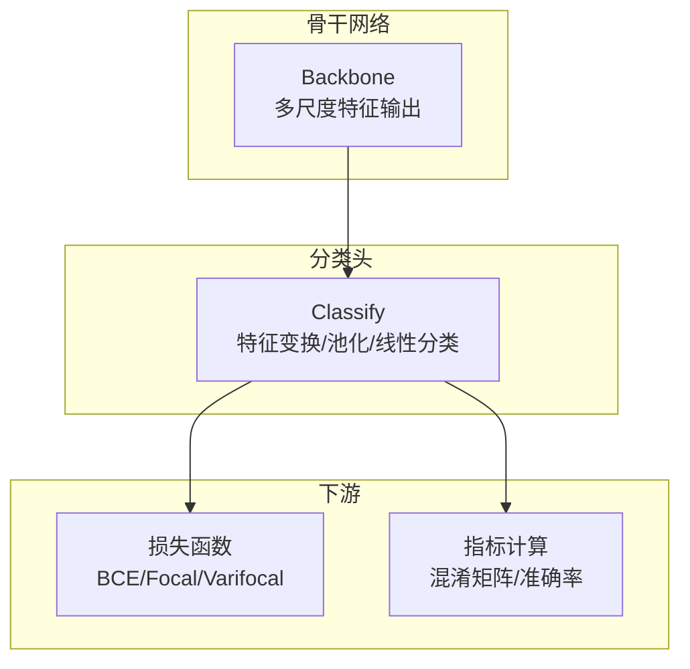
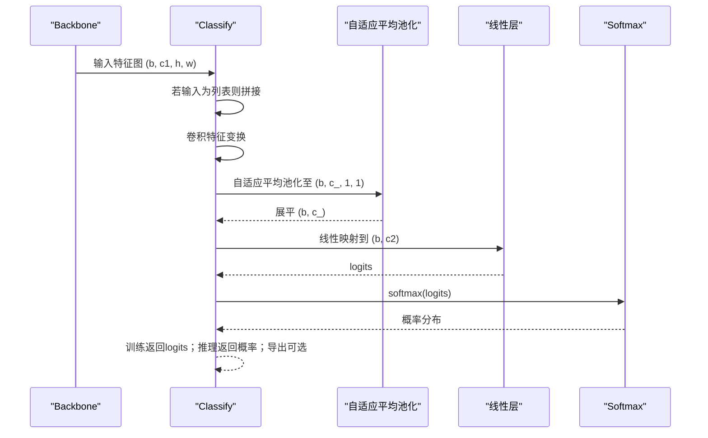
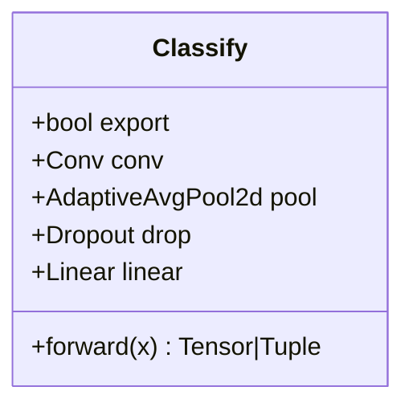
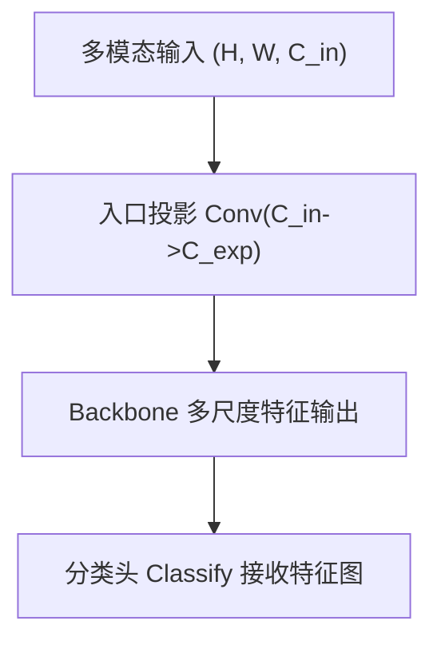
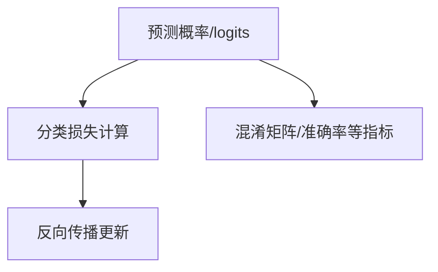
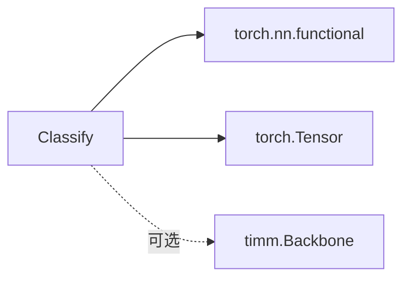

# 分类头架构

<cite>
**本文档引用的文件**
- [head.py](file://ultralytics/nn/modules/head.py)
- [yolo11_head_variants.py](file://ultralytics/nn/Head/yolo11_head_variants.py)
- [sppf_base.py](file://ultralytics/nn/extraction/sppf_base.py)
- [loss.py](file://ultralytics/models/utils/loss.py)
- [metrics.py](file://ultralytics/utils/metrics.py)
- [timm_backbone.py](file://ultralytics/nn/backbone/timm_backbone.py)
</cite>

## 目录
1. [简介](#简介)
2. [项目结构](#项目结构)
3. [核心组件](#核心组件)
4. [架构总览](#架构总览)
5. [详细组件分析](#详细组件分析)
6. [依赖分析](#依赖分析)
7. [性能考虑](#性能考虑)
8. [故障排查指南](#故障排查指南)
9. [结论](#结论)
10. [附录](#附录)

## 简介
本文件系统性阐述图像分类头的架构设计与实现原理，重点覆盖以下方面：
- 特征全局池化：通过自适应平均池化将任意尺寸的特征图压缩为固定长度的特征向量
- 分类全连接层：将全局特征映射到类别空间
- Softmax输出机制：将线性层输出转换为各类别的概率分布
- 与backbone的衔接：说明backbone输出特征图如何进入分类头
- 参数调优：类别数、激活函数、损失函数等配置要点
- 实现细节：Classify类的前向流程、Dropout正则化、训练/推理/导出模式差异

## 项目结构
分类头相关代码主要位于以下模块：
- 分类头主体：ultralytics/nn/modules/head.py 中的 Classify 类
- 检测头变体（包含分类头的通用结构）：ultralytics/nn/Head/yolo11_head_variants.py
- 特征融合与池化工具：ultralytics/nn/extraction/sppf_base.py（提供自适应池化兼容实现）
- 损失函数与指标：ultralytics/models/utils/loss.py、ultralytics/utils/metrics.py
- Backbone入口投影：ultralytics/nn/backbone/timm_backbone.py（多模态输入通道对齐）

**图表来源**
- [head.py:436-489](file://ultralytics/nn/modules/head.py#L436-L489)
- [loss.py:93-120](file://ultralytics/models/utils/loss.py#L93-L120)
- [metrics.py:312-338](file://ultralytics/utils/metrics.py#L312-L338)

**章节来源**
- [head.py:436-489](file://ultralytics/nn/modules/head.py#L436-L489)

## 核心组件
- Classify（分类头）：负责将backbone输出的特征图转换为类别概率
  - 关键组成：卷积特征变换层、自适应平均池化、Dropout、线性分类层
  - 前向流程：特征拼接（若输入为列表）、卷积变换、池化至1×1、展平、线性映射、softmax输出
  - 训练/推理/导出模式差异：训练返回logits；推理返回概率；导出模式返回概率或(概率, logits)

**章节来源**
- [head.py:436-489](file://ultralytics/nn/modules/head.py#L436-L489)

## 架构总览
分类头作为模型的最后一层，接收来自backbone的多尺度特征图，经过统一的特征变换与池化，最终得到固定长度的向量，再由线性层映射到类别空间，并通过softmax得到概率分布。

**图表来源**
- [head.py:474-488](file://ultralytics/nn/modules/head.py#L474-L488)

## 详细组件分析

### Classify 类详解
- 初始化参数
  - c1：输入通道数（通常为backbone最后一层通道）
  - c2：输出类别数
  - k/s/p/g：卷积核大小、步幅、填充、分组（默认1×1卷积）
- 结构组成
  - 卷积层：将c1通道变换到中间通道数（内部常量约为1280）
  - 自适应平均池化：将空间维度压缩为1×1，输出(b, c_, 1, 1)
  - Dropout：正则化，防止过拟合
  - 线性层：将c_映射到c2（类别数）
- 前向流程
  - 若输入为列表，先按通道维拼接
  - 经卷积→池化→展平→线性层→dropout
  - 训练阶段直接返回logits
  - 推理阶段返回softmax后的概率；导出模式可返回(概率, logits)
- 适用场景
  - 图像分类、多模态分类（结合backbone投影层）

**图表来源**
- [head.py:436-489](file://ultralytics/nn/modules/head.py#L436-L489)

**章节来源**
- [head.py:436-489](file://ultralytics/nn/modules/head.py#L436-L489)

### 与backbone的衔接
- 多模态输入通道对齐：当输入通道数与backbone期望通道数不一致时，可通过入口投影层将输入从多模态通道（如6通道）投影到单模态期望通道（如3通道）
- 输出特征形态：backbone输出通常为多尺度特征图，分类头可直接接收最后一层特征图，也可接收拼接后的特征

**图表来源**
- [timm_backbone.py:47-65](file://ultralytics/nn/backbone/timm_backbone.py#L47-L65)

**章节来源**
- [timm_backbone.py:47-65](file://ultralytics/nn/backbone/timm_backbone.py#L47-L65)

### 损失函数与指标
- 损失函数
  - 支持多种分类损失：Varifocal Loss、Focal Loss、BCEWithLogitsLoss
  - 根据配置选择不同策略，YOLO风格分类损失通常以BCE为主
- 指标计算
  - 混淆矩阵支持分类任务，便于评估各类别性能

**图表来源**
- [loss.py:93-120](file://ultralytics/models/utils/loss.py#L93-L120)
- [metrics.py:312-338](file://ultralytics/utils/metrics.py#L312-L338)

**章节来源**
- [loss.py:93-120](file://ultralytics/models/utils/loss.py#L93-L120)
- [metrics.py:312-338](file://ultralytics/utils/metrics.py#L312-L338)

### 特征融合与池化工具
- 自适应池化兼容：在ONNX导出场景下提供兼容实现，保证跨平台部署稳定性
- 全局-局部融合：通过全局信息与局部特征的加权融合，提升分类头对上下文信息的利用能力

**章节来源**
- [sppf_base.py:292-302](file://ultralytics/nn/extraction/sppf_base.py#L292-L302)
- [sppf_base.py:589-624](file://ultralytics/nn/extraction/sppf_base.py#L589-L624)

## 依赖分析
- 模块内聚与耦合
  - Classify高度内聚：仅依赖卷积、池化、线性层与激活函数
  - 与损失/指标解耦：通过接口传递logits或概率，便于替换不同损失函数
- 外部依赖
  - torch.nn.functional：池化、softmax等
  - timm（可选）：用于多模态backbone集成

**图表来源**
- [head.py:436-489](file://ultralytics/nn/modules/head.py#L436-L489)
- [timm_backbone.py:51-65](file://ultralytics/nn/backbone/timm_backbone.py#L51-L65)

**章节来源**
- [head.py:436-489](file://ultralytics/nn/modules/head.py#L436-L489)
- [timm_backbone.py:51-65](file://ultralytics/nn/backbone/timm_backbone.py#L51-L65)

## 性能考虑
- 计算复杂度
  - 池化阶段：O(b·c1·H·W)，将空间复杂度降至常数
  - 线性层：O(b·c_·c2)，c_通常远小于c1·H·W
- 内存占用
  - 池化后展平，内存峰值集中在线性层权重与中间特征
- 导出优化
  - ONNX导出时使用兼容池化，避免不支持的算子
  - 导出模式下可直接返回概率，减少前端后处理

[本节为通用性能讨论，无需具体文件分析]

## 故障排查指南
- 形状不匹配
  - 症状：输入特征图通道数与预期不符
  - 处理：检查backbone输出通道与Classify初始化c1是否一致；必要时使用入口投影层对齐
- 概率分布异常
  - 症状：推理时概率分布集中在少数类别
  - 处理：检查Dropout是否启用、学习率是否过高、标签平滑是否合理
- 导出失败
  - 症状：ONNX导出报错或精度异常
  - 处理：确认使用兼容池化实现；导出模式下避免不必要的非标操作

**章节来源**
- [head.py:474-488](file://ultralytics/nn/modules/head.py#L474-L488)
- [sppf_base.py:292-302](file://ultralytics/nn/extraction/sppf_base.py#L292-L302)

## 结论
分类头通过“特征变换→全局池化→线性映射→Softmax”的标准化流程，实现了从backbone多尺度特征到类别概率的稳定转换。其设计兼顾了训练效率、推理速度与部署兼容性，适用于图像分类与多模态分类任务。通过合理配置类别数、损失函数与正则化策略，可在不同数据集上取得良好性能。

[本节为总结性内容，无需具体文件分析]

## 附录

### 配置示例与参数调优
- 类别数量（c2）
  - 根据任务需求设置，例如ImageNet为1000类
- 激活函数
  - 默认使用softmax；若需多标签分类，可改为sigmoid并配合BCEWithLogitsLoss
- 正则化
  - Dropout：建议0.2~0.5，视数据规模与过拟合程度调整
- 损失函数
  - 单标签分类：BCEWithLogitsLoss
  - 不平衡类别：Focal Loss 或 Varifocal Loss
- 导出模式
  - 导出时可直接返回概率，减少部署端计算

**章节来源**
- [head.py:474-488](file://ultralytics/nn/modules/head.py#L474-L488)
- [loss.py:93-120](file://ultralytics/models/utils/loss.py#L93-L120)