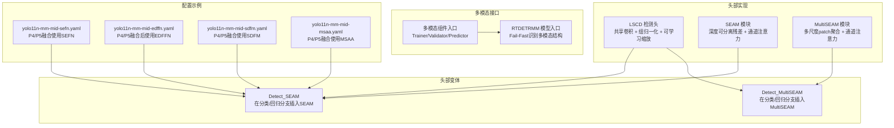
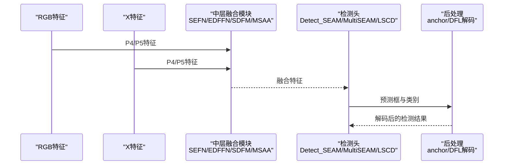
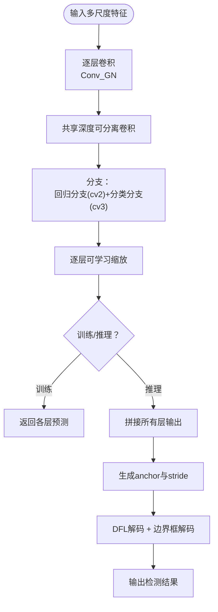
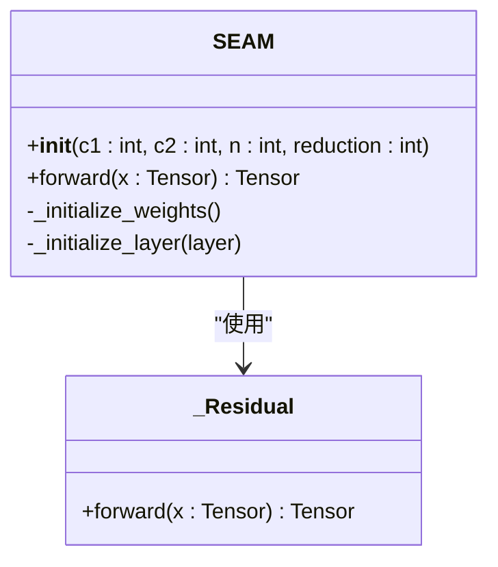
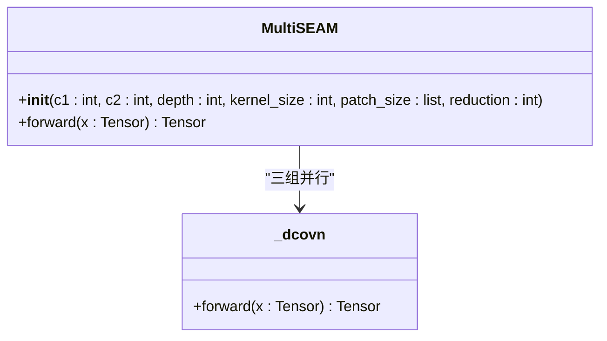
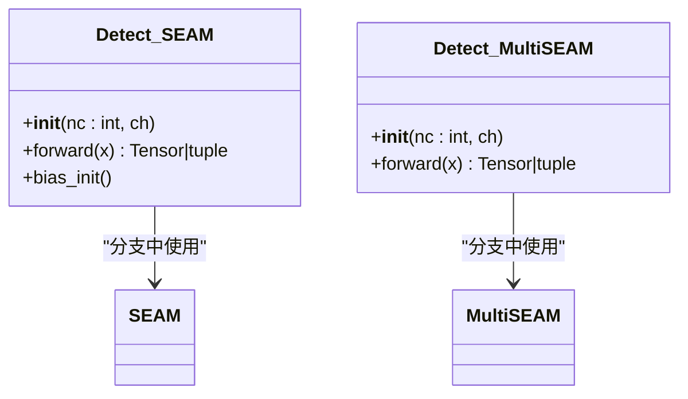
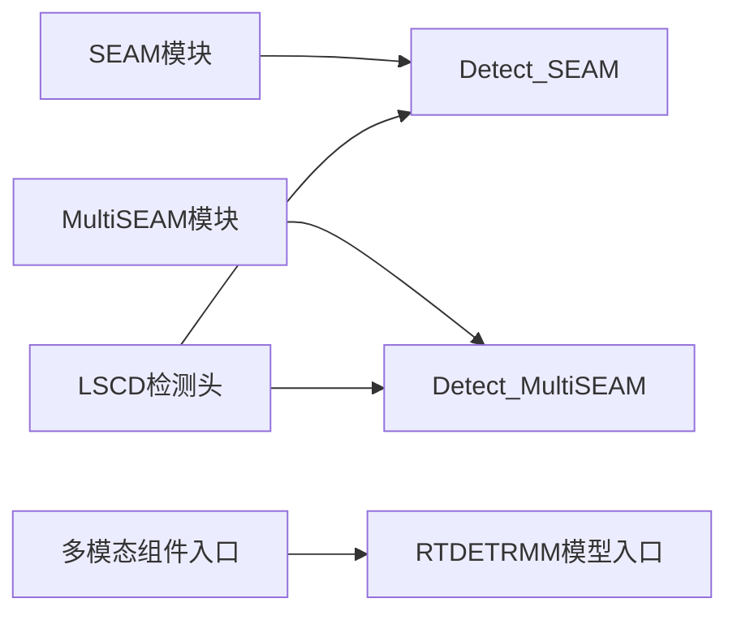

# 多模态头部变体

<cite>
**本文引用的文件**
- [ultralytics\nn\Head\lscd.py](file://ultralytics\nn\Head\lscd.py)
- [ultralytics\nn\Head\yolo11_head_variants.py](file://ultralytics\nn\Head\yolo11_head_variants.py)
- [ultralytics\nn\public\seam.py](file://ultralytics\nn\public\seam.py)
- [ultralytics\models\yolo\multimodal\__init__.py](file://ultralytics\models\yolo\multimodal\__init__.py)
- [ultralytics\models\rtdetrmm\model.py](file://ultralytics\models\rtdetrmm\model.py)
- [ultralytics\cfg\models\mm\change\yolo11n-mm-mid-sefn.yaml](file://ultralytics\cfg\models\mm\change\yolo11n-mm-mid-sefn.yaml)
- [ultralytics\cfg\models\mm\change\yolo11n-mm-mid-edffn.yaml](file://ultralytics\cfg\models\mm\change\yolo11n-mm-mid-edffn.yaml)
- [ultralytics\cfg\models\mm\change\yolo11n-mm-mid-sdfm.yaml](file://ultralytics\cfg\models\mm\change\yolo11n-mm-mid-sdfm.yaml)
- [ultralytics\cfg\models\mm\change\yolo11n-mm-mid-msaa.yaml](file://ultralytics\cfg\models\mm\change\yolo11n-mm-mid-msaa.yaml)
</cite>

## 目录
1. [简介](#简介)
2. [项目结构](#项目结构)
3. [核心组件](#核心组件)
4. [架构总览](#架构总览)
5. [详细组件分析](#详细组件分析)
6. [依赖关系分析](#依赖关系分析)
7. [性能考量](#性能考量)
8. [故障排查指南](#故障排查指南)
9. [结论](#结论)
10. [附录](#附录)

## 简介
本文件聚焦于多模态检测头的多种变体设计与实现，重点覆盖以下头部架构：
- LSCD（Learned Spatial Channel Decomposition，轻量化共享卷积检测头）
- SEAM（Spatial-Enhanced Attention Module，空间增强注意力模块）
- MultiSEAM（Multi-scale Spatial-Enhanced Attention，多尺度空间增强注意力）

文档将系统阐述这些头部变体的结构、处理流程、适用场景与性能优势，并解释多模态头部如何融合RGB与X模态特征（通道分解、空间增强、多尺度注意力），最后给出配置示例与实现细节，帮助读者根据具体多模态检测任务选择合适头部变体。

## 项目结构
围绕多模态头部变体的相关代码与配置分布如下：
- 头部实现与模块
  - 轻量化共享卷积检测头：[ultralytics\nn\Head\lscd.py](file://ultralytics\nn\Head\lscd.py)
  - YOLO11头部变体（含SEAM/MultiSEAM）：[ultralytics\nn\Head\yolo11_head_variants.py](file://ultralytics\nn\Head\yolo11_head_variants.py)
  - SEAM/MultiSEAM模块：[ultralytics\nn\public\seam.py](file://ultralytics\nn\public\seam.py)
- 多模态接口与RT-DETRMM适配
  - 多模态组件入口与公开API：[ultralytics\models\yolo\multimodal\__init__.py](file://ultralytics\models\yolo\multimodal\__init__.py)
  - RT-DETRMM模型入口与多模态路由：[ultralytics\models\rtdetrmm\model.py](file://ultralytics\models\rtdetrmm\model.py)
- 多模态融合与头部配置示例（Mid-Fusion）
  - SEFN（空间增强前馈网络）：[ultralytics\cfg\models\mm\change\yolo11n-mm-mid-sefn.yaml](file://ultralytics\cfg\models\mm\change\yolo11n-mm-mid-sefn.yaml)
  - EDFFN（频域前馈网络）：[ultralytics\cfg\models\mm\change\yolo11n-mm-mid-edffn.yaml](file://ultralytics\cfg\models\mm\change\yolo11n-mm-mid-edffn.yaml)
  - SDFM（空间依赖感知）：[ultralytics\cfg\models\mm\change\yolo11n-mm-mid-sdfm.yaml](file://ultralytics\cfg\models\mm\change\yolo11n-mm-mid-sdfm.yaml)
  - MSAA（多尺度注意力聚合）：[ultralytics\cfg\models\mm\change\yolo11n-mm-mid-msaa.yaml](file://ultralytics\cfg\models\mm\change\yolo11n-mm-mid-msaa.yaml)

**图表来源**
- [ultralytics\nn\Head\lscd.py:66-157](file://ultralytics\nn\Head\lscd.py#L66-L157)
- [ultralytics\nn\Head\yolo11_head_variants.py:291-381](file://ultralytics\nn\Head\yolo11_head_variants.py#L291-L381)
- [ultralytics\nn\public\seam.py:24-156](file://ultralytics\nn\public\seam.py#L24-L156)
- [ultralytics\models\yolo\multimodal\__init__.py:32-77](file://ultralytics\models\yolo\multimodal\__init__.py#L32-L77)
- [ultralytics\models\rtdetrmm\model.py:25-189](file://ultralytics\models\rtdetrmm\model.py#L25-L189)
- [ultralytics\cfg\models\mm\change\yolo11n-mm-mid-sefn.yaml:48-52](file://ultralytics\cfg\models\mm\change\yolo11n-mm-mid-sefn.yaml#L48-L52)
- [ultralytics\cfg\models\mm\change\yolo11n-mm-mid-edffn.yaml:51-59](file://ultralytics\cfg\models\mm\change\yolo11n-mm-mid-edffn.yaml#L51-L59)
- [ultralytics\cfg\models\mm\change\yolo11n-mm-mid-sdfm.yaml:49-53](file://ultralytics\cfg\models\mm\change\yolo11n-mm-mid-sdfm.yaml#L49-L53)
- [ultralytics\cfg\models\mm\change\yolo11n-mm-mid-msaa.yaml:49-53](file://ultralytics\cfg\models\mm\change\yolo11n-mm-mid-msaa.yaml#L49-L53)

**章节来源**
- [ultralytics\nn\Head\lscd.py:66-157](file://ultralytics\nn\Head\lscd.py#L66-L157)
- [ultralytics\nn\Head\yolo11_head_variants.py:291-381](file://ultralytics\nn\Head\yolo11_head_variants.py#L291-L381)
- [ultralytics\nn\public\seam.py:24-156](file://ultralytics\nn\public\seam.py#L24-L156)
- [ultralytics\models\yolo\multimodal\__init__.py:32-77](file://ultralytics\models\yolo\multimodal\__init__.py#L32-L77)
- [ultralytics\models\rtdetrmm\model.py:25-189](file://ultralytics\models\rtdetrmm\model.py#L25-L189)
- [ultralytics\cfg\models\mm\change\yolo11n-mm-mid-sefn.yaml:48-52](file://ultralytics\cfg\models\mm\change\yolo11n-mm-mid-sefn.yaml#L48-L52)
- [ultralytics\cfg\models\mm\change\yolo11n-mm-mid-edffn.yaml:51-59](file://ultralytics\cfg\models\mm\change\yolo11n-mm-mid-edffn.yaml#L51-L59)
- [ultralytics\cfg\models\mm\change\yolo11n-mm-mid-sdfm.yaml:49-53](file://ultralytics\cfg\models\mm\change\yolo11n-mm-mid-sdfm.yaml#L49-L53)
- [ultralytics\cfg\models\mm\change\yolo11n-mm-mid-msaa.yaml:49-53](file://ultralytics\cfg\models\mm\change\yolo11n-mm-mid-msaa.yaml#L49-L53)

## 核心组件
- LSCD（轻量化共享卷积检测头）
  - 特点：共享卷积层减少参数，组归一化提升定位与分类性能，逐层可学习缩放，深度可分离卷积提升效率。
  - 适用场景：对参数量与计算效率敏感的任务，如移动端或边缘部署。
  - 性能优势：参数共享与深度可分离卷积显著降低计算成本，同时保持检测精度。
- SEAM（空间增强注意力模块）
  - 特点：深度可分离残差卷积堆叠 + 通道注意力（Squeeze-Excitation风格），在不改变通道数的前提下增强空间感知能力。
  - 适用场景：需要在不增加通道数的情况下提升特征表达能力的任务。
  - 性能优势：在轻量级结构中引入空间增强，提高小目标与复杂场景下的检测稳定性。
- MultiSEAM（多尺度空间增强注意力模块）
  - 特点：多尺度patch（如3×3、5×5、7×7）并行提取空间依赖，结合通道注意力，形成更强的空间聚合能力。
  - 适用场景：对多尺度空间信息敏感的任务，如复杂背景、多尺寸目标共存。
  - 性能优势：多尺度聚合显著提升对不同尺度空间模式的适应性。

**章节来源**
- [ultralytics\nn\Head\lscd.py:66-157](file://ultralytics\nn\Head\lscd.py#L66-L157)
- [ultralytics\nn\Head\yolo11_head_variants.py:291-381](file://ultralytics\nn\Head\yolo11_head_variants.py#L291-L381)
- [ultralytics\nn\public\seam.py:24-156](file://ultralytics\nn\public\seam.py#L24-L156)

## 架构总览
多模态头部变体的整体工作流如下：
- 数据输入：RGB与X模态分别经过骨干网络提取特征，得到多尺度特征图（如P3/P4/P5）。
- 中间融合（Mid-Fusion）：在P4/P5等中层进行模态融合（如SEFN、EDFFN、SDFM、MSAA），生成融合特征。
- 头部解码：融合后的特征进入检测头（如Detect_SEAM/Detect_MultiSEAM或LSCD），完成边界框与类别预测。
- 推理与导出：在推理阶段，头部负责解码与后处理（如anchor生成、DFL、距离变换解码）。

**图表来源**
- [ultralytics\cfg\models\mm\change\yolo11n-mm-mid-sefn.yaml:48-52](file://ultralytics\cfg\models\mm\change\yolo11n-mm-mid-sefn.yaml#L48-L52)
- [ultralytics\cfg\models\mm\change\yolo11n-mm-mid-edffn.yaml:51-59](file://ultralytics\cfg\models\mm\change\yolo11n-mm-mid-edffn.yaml#L51-L59)
- [ultralytics\cfg\models\mm\change\yolo11n-mm-mid-sdfm.yaml:49-53](file://ultralytics\cfg\models\mm\change\yolo11n-mm-mid-sdfm.yaml#L49-L53)
- [ultralytics\cfg\models\mm\change\yolo11n-mm-mid-msaa.yaml:49-53](file://ultralytics\cfg\models\mm\change\yolo11n-mm-mid-msaa.yaml#L49-L53)
- [ultralytics\nn\Head\yolo11_head_variants.py:291-381](file://ultralytics\nn\Head\yolo11_head_variants.py#L291-L381)
- [ultralytics\nn\Head\lscd.py:113-157](file://ultralytics\nn\Head\lscd.py#L113-L157)

## 详细组件分析

### LSCD（轻量化共享卷积检测头）
- 结构要点
  - 每层输入先经逐层卷积，再通过共享的深度可分离卷积，最后拼接回归与分类分支。
  - 使用组归一化替代批归一化，提升定位与分类性能。
  - 每层输出带有可学习缩放因子，便于训练稳定与收敛。
- 处理流程
  - 训练阶段：直接返回各层预测张量。
  - 推理阶段：拼接所有层输出，生成anchor与stride，使用距离变换解码（DFL）与中心偏移解码，最终输出检测结果。
- 适用场景
  - 对参数量与计算开销敏感的任务，如移动端、边缘设备或实时性要求高的场景。
- 性能优势
  - 参数共享与深度可分离卷积显著降低计算成本，同时保持检测精度。

**图表来源**
- [ultralytics\nn\Head\lscd.py:66-157](file://ultralytics\nn\Head\lscd.py#L66-L157)

**章节来源**
- [ultralytics\nn\Head\lscd.py:66-157](file://ultralytics\nn\Head\lscd.py#L66-L157)

### SEAM（空间增强注意力模块）
- 结构要点
  - 深度可分离残差卷积堆叠（n层），每层包含3×3深度卷积+1×1逐点卷积+GELU+BN。
  - 通道注意力：全局平均池化 + 两层线性层（降维与升维）+ Sigmoid，输出权重用于通道加权。
- 处理流程
  - 输入特征经DCovN堆叠，得到增强特征；通过通道注意力生成权重，对输入进行通道加权。
- 适用场景
  - 需要在不增加通道数的前提下提升空间感知能力的任务，适合与轻量检测头配合使用。
- 性能优势
  - 在轻量结构中引入空间增强，提升小目标与复杂场景下的检测稳定性。

**图表来源**
- [ultralytics\nn\public\seam.py:24-86](file://ultralytics\nn\public\seam.py#L24-L86)

**章节来源**
- [ultralytics\nn\public\seam.py:24-86](file://ultralytics\nn\public\seam.py#L24-L86)

### MultiSEAM（多尺度空间增强注意力模块）
- 结构要点
  - 并行构建三组DCovN（patch大小分别为3、5、7），分别提取多尺度空间依赖。
  - 通道注意力：对三组输出与原输入进行池化，求平均后经全连接层生成通道权重。
- 处理流程
  - 输入特征经三组DCovN与原输入池化，四路特征平均后经通道注意力加权，输出增强特征。
- 适用场景
  - 对多尺度空间信息敏感的任务，如复杂背景、多尺寸目标共存。
- 性能优势
  - 多尺度聚合显著提升对不同尺度空间模式的适应性。

**图表来源**
- [ultralytics\nn\public\seam.py:111-156](file://ultralytics\nn\public\seam.py#L111-L156)

**章节来源**
- [ultralytics\nn\public\seam.py:111-156](file://ultralytics\nn\public\seam.py#L111-L156)

### Detect_SEAM 与 Detect_MultiSEAM（头部变体）
- Detect_SEAM
  - 在回归与分类分支中插入SEAM模块，保持通道数不变的同时增强空间表达。
  - 适用于需要在轻量结构中引入空间增强的场景。
- Detect_MultiSEAM
  - 在回归与分类分支中插入MultiSEAM模块，利用多尺度空间聚合进一步提升表达能力。
  - 适用于复杂场景与多尺度目标检测任务。

**图表来源**
- [ultralytics\nn\Head\yolo11_head_variants.py:291-381](file://ultralytics\nn\Head\yolo11_head_variants.py#L291-L381)
- [ultralytics\nn\public\seam.py:24-156](file://ultralytics\nn\public\seam.py#L24-L156)

**章节来源**
- [ultralytics\nn\Head\yolo11_head_variants.py:291-381](file://ultralytics\nn\Head\yolo11_head_variants.py#L291-L381)

### 多模态头部如何处理RGB与X模态特征融合
- 融合位置（Mid-Fusion）
  - 在P4/P5等中层进行RGB与X模态融合，常见融合方式包括：
    - SEFN（空间增强前馈网络）：双输入增强，单路输出。
    - EDFFN（频域前馈网络）：单路输入，频域滤波，要求H/W可被patch整除。
    - SDFM（空间依赖感知）：按patch展开/折叠的空间依赖注意，双输入→单输出。
    - MSAA（多尺度注意力聚合）：双输入特征→多尺度卷积+通道/空间注意力→单路输出。
- 融合策略
  - 通道分解：通过卷积/注意力机制对RGB与X特征进行通道级分解与重组。
  - 空间增强：利用SEAM/MultiSEAM等模块增强空间上下文感知。
  - 多尺度注意力：在不同尺度上聚合空间信息，提升对多尺寸目标的适应性。
- 适用场景
  - 复杂光照、遮挡、低能见度等场景，需要RGB与X模态互补信息提升鲁棒性。

**章节来源**
- [ultralytics\cfg\models\mm\change\yolo11n-mm-mid-sefn.yaml:48-52](file://ultralytics\cfg\models\mm\change\yolo11n-mm-mid-sefn.yaml#L48-L52)
- [ultralytics\cfg\models\mm\change\yolo11n-mm-mid-edffn.yaml:51-59](file://ultralytics\cfg\models\mm\change\yolo11n-mm-mid-edffn.yaml#L51-L59)
- [ultralytics\cfg\models\mm\change\yolo11n-mm-mid-sdfm.yaml:49-53](file://ultralytics\cfg\models\mm\change\yolo11n-mm-mid-sdfm.yaml#L49-L53)
- [ultralytics\cfg\models\mm\change\yolo11n-mm-mid-msaa.yaml:49-53](file://ultralytics\cfg\models\mm\change\yolo11n-mm-mid-msaa.yaml#L49-L53)

## 依赖关系分析
- Detect_SEAM/Detect_MultiSEAM依赖SEAM/MultiSEAM模块，二者均通过卷积与注意力机制增强空间表达。
- LSCD检测头与Detect_SEAM/Detect_MultiSEAM在结构上互补：前者强调参数共享与组归一化，后者强调空间增强与多尺度聚合。
- 多模态接口（Trainer/Validator/Predictor）与RTDETRMM模型入口负责Fail-Fast识别多模态结构并配置路由，确保RGB与X模态输入通道与可用模态集合正确。

**图表来源**
- [ultralytics\nn\Head\yolo11_head_variants.py:291-381](file://ultralytics\nn\Head\yolo11_head_variants.py#L291-L381)
- [ultralytics\nn\Head\lscd.py:66-157](file://ultralytics\nn\Head\lscd.py#L66-L157)
- [ultralytics\nn\public\seam.py:24-156](file://ultralytics\nn\public\seam.py#L24-L156)
- [ultralytics\models\yolo\multimodal\__init__.py:32-77](file://ultralytics\models\yolo\multimodal\__init__.py#L32-L77)
- [ultralytics\models\rtdetrmm\model.py:25-189](file://ultralytics\models\rtdetrmm\model.py#L25-L189)

**章节来源**
- [ultralytics\nn\Head\yolo11_head_variants.py:291-381](file://ultralytics\nn\Head\yolo11_head_variants.py#L291-L381)
- [ultralytics\nn\Head\lscd.py:66-157](file://ultralytics\nn\Head\lscd.py#L66-L157)
- [ultralytics\nn\public\seam.py:24-156](file://ultralytics\nn\public\seam.py#L24-L156)
- [ultralytics\models\yolo\multimodal\__init__.py:32-77](file://ultralytics\models\yolo\multimodal\__init__.py#L32-L77)
- [ultralytics\models\rtdetrmm\model.py:25-189](file://ultralytics\models\rtdetrmm\model.py#L25-L189)

## 性能考量
- 参数与计算效率
  - LSCD通过共享卷积与深度可分离卷积显著降低参数与计算量，适合资源受限场景。
  - SEAM/MultiSEAM在不增加通道数的前提下引入空间增强，兼顾表达能力与效率。
- 训练稳定性
  - 组归一化与可学习缩放有助于提升训练稳定性与收敛速度。
- 推理优化
  - Detect_SEAM/Detect_MultiSEAM在推理阶段可结合anchor生成与DFL解码，保证后处理效率。
- 融合模块约束
  - EDFFN与SDFM对输入分辨率有整除约束，需在上游进行对齐（如步幅或上采样）。

[本节为通用性能讨论，无需特定文件引用]

## 故障排查指南
- 多模态组件验证失败
  - 现象：模块初始化时验证失败，部分功能不可用。
  - 处理：检查多模态组件导入状态，确认Trainer/Validator/Predictor与模态填充器、自体模态生成器均可正常导入。
- 输入通道不匹配
  - 现象：RTDETRMM输入通道不是3或6。
  - 处理：确保输入通道为3（RGB-only）或6（RGB+X），否则抛出异常。
- 融合模块分辨率不满足约束
  - 现象：EDFFN/SDFM报错提示H/W不可被patch整除。
  - 处理：在上游调整分辨率，使H/W能被指定patch_size整除，或通过步幅/上采样对齐。

**章节来源**
- [ultralytics\models\yolo\multimodal\__init__.py:118-152](file://ultralytics\models\yolo\multimodal\__init__.py#L118-L152)
- [ultralytics\models\rtdetrmm\model.py:140-147](file://ultralytics\models\rtdetrmm\model.py#L140-L147)
- [ultralytics\cfg\models\mm\change\yolo11n-mm-mid-edffn.yaml:6-12](file://ultralytics\cfg\models\mm\change\yolo11n-mm-mid-edffn.yaml#L6-L12)
- [ultralytics\cfg\models\mm\change\yolo11n-mm-mid-sdfm.yaml:6-10](file://ultralytics\cfg\models\mm\change\yolo11n-mm-mid-sdfm.yaml#L6-L10)

## 结论
- LSCD、SEAM与MultiSEAM分别代表了多模态检测头在“参数效率”“空间增强”“多尺度聚合”三个方向的代表性设计。
- Mid-Fusion阶段的RGB与X模态融合（SEFN、EDFFN、SDFM、MSAA）为头部提供了强大的跨模态互补能力。
- 通过合理选择头部变体与融合策略，可以在不同硬件与任务需求之间取得最佳平衡。

[本节为总结性内容，无需特定文件引用]

## 附录

### 选择头部变体的实践建议
- 资源受限或实时性优先：优先选择LSCD，结合SEAM/MultiSEAM在不显著增加通道数的前提下增强空间表达。
- 复杂场景与多尺度目标：优先选择Detect_MultiSEAM，利用多尺度空间聚合提升鲁棒性。
- 频域/空间依赖敏感任务：可考虑EDFFN或SDFM作为融合模块，但需注意分辨率整除约束。

### 配置示例与实现细节（路径指引）
- SEFN（P4/P5融合，双输入增强，单路输出）
  - 配置文件路径：[yolo11n-mm-mid-sefn.yaml:48-52](file://ultralytics\cfg\models\mm\change\yolo11n-mm-mid-sefn.yaml#L48-L52)
- EDFFN（P4/P5融合后使用，单路输入，频域滤波）
  - 配置文件路径：[yolo11n-mm-mid-edffn.yaml:51-59](file://ultralytics\cfg\models\mm\change\yolo11n-mm-mid-edffn.yaml#L51-L59)
- SDFM（P4/P5融合，空间依赖感知）
  - 配置文件路径：[yolo11n-mm-mid-sdfm.yaml:49-53](file://ultralytics\cfg\models\mm\change\yolo11n-mm-mid-sdfm.yaml#L49-L53)
- MSAA（P4/P5融合，多尺度注意力聚合）
  - 配置文件路径：[yolo11n-mm-mid-msaa.yaml:49-53](file://ultralytics\cfg\models\mm\change\yolo11n-mm-mid-msaa.yaml#L49-L53)

**章节来源**
- [ultralytics\cfg\models\mm\change\yolo11n-mm-mid-sefn.yaml:48-52](file://ultralytics\cfg\models\mm\change\yolo11n-mm-mid-sefn.yaml#L48-L52)
- [ultralytics\cfg\models\mm\change\yolo11n-mm-mid-edffn.yaml:51-59](file://ultralytics\cfg\models\mm\change\yolo11n-mm-mid-edffn.yaml#L51-L59)
- [ultralytics\cfg\models\mm\change\yolo11n-mm-mid-sdfm.yaml:49-53](file://ultralytics\cfg\models\mm\change\yolo11n-mm-mid-sdfm.yaml#L49-L53)
- [ultralytics\cfg\models\mm\change\yolo11n-mm-mid-msaa.yaml:49-53](file://ultralytics\cfg\models\mm\change\yolo11n-mm-mid-msaa.yaml#L49-L53)