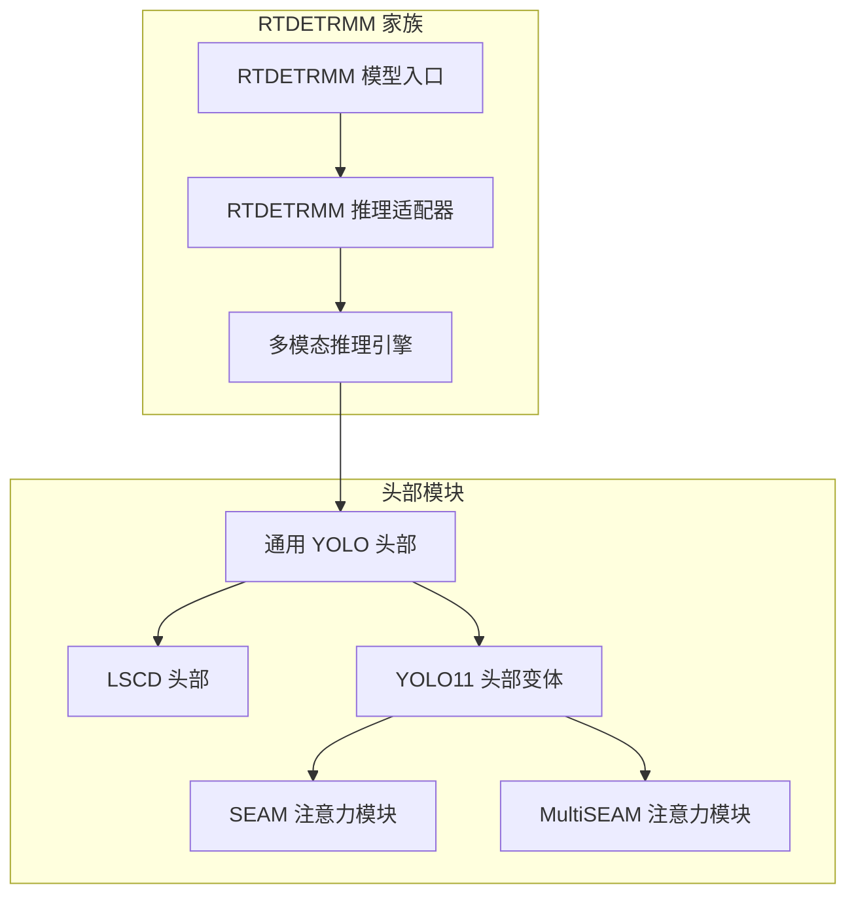
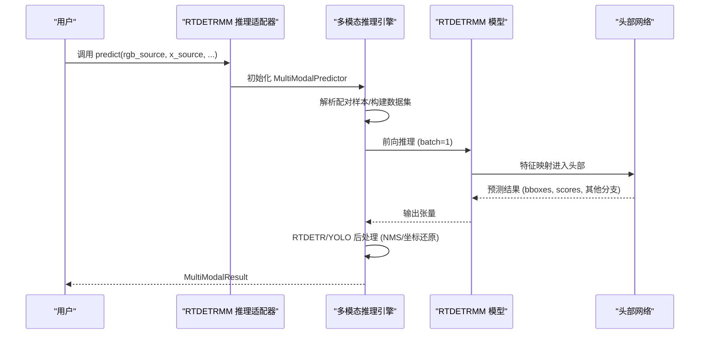
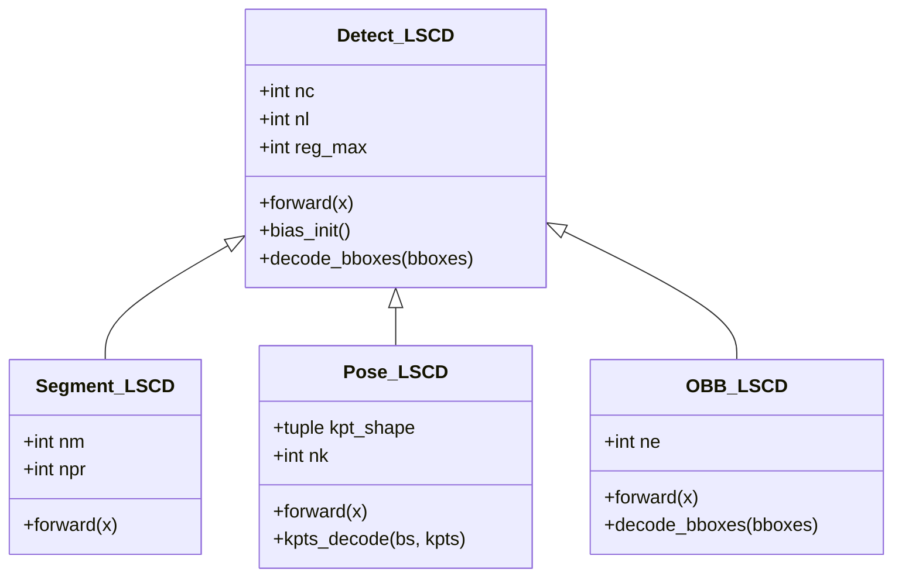
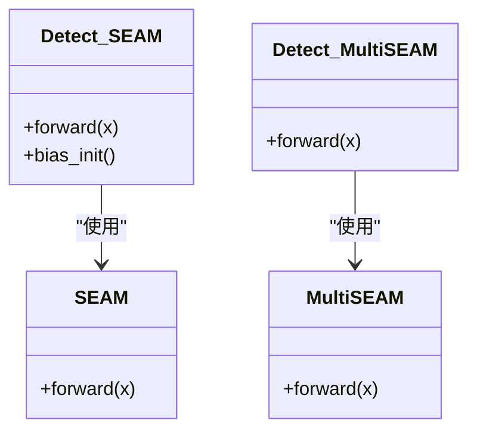
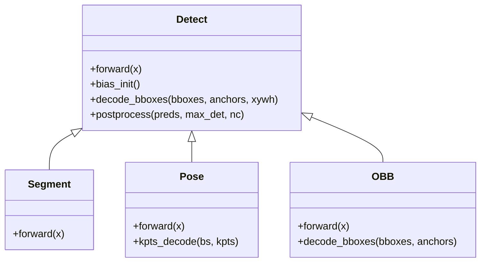
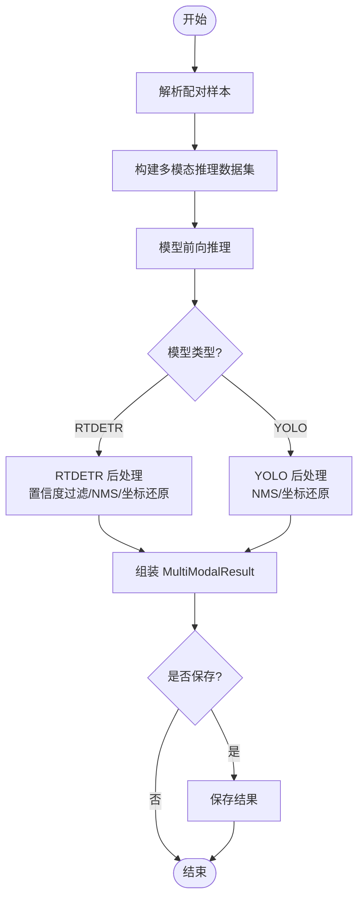
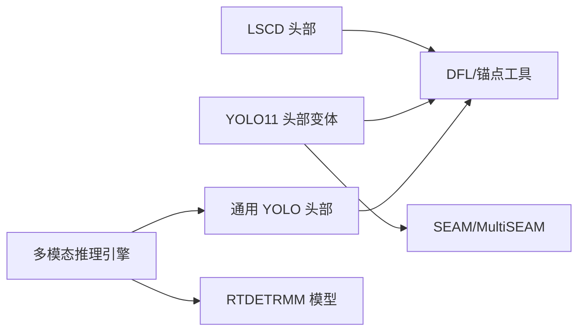

# 头部网络架构

<cite>
**本文档引用的文件**
- [ultralytics/models/rtdetrmm/model.py](file://ultralytics/models/rtdetrmm/model.py)
- [ultralytics/engine/multimodal/predictor.py](file://ultralytics/engine/multimodal/predictor.py)
- [ultralytics/models/rtdetrmm/mm_predictor.py](file://ultralytics/models/rtdetrmm/mm_predictor.py)
- [ultralytics/nn/Head/__init__.py](file://ultralytics/nn/Head/__init__.py)
- [ultralytics/nn/Head/lscd.py](file://ultralytics/nn/Head/lscd.py)
- [ultralytics/nn/modules/head.py](file://ultralytics/nn/modules/head.py)
- [ultralytics/nn/Head/yolo11_head_variants.py](file://ultralytics/nn/Head/yolo11_head_variants.py)
- [ultralytics/nn/public/seam.py](file://ultralytics/nn/public/seam.py)
</cite>

## 目录
1. [简介](#简介)
2. [项目结构](#项目结构)
3. [核心组件](#核心组件)
4. [架构总览](#架构总览)
5. [详细组件分析](#详细组件分析)
6. [依赖关系分析](#依赖关系分析)
7. [性能考虑](#性能考虑)
8. [故障排查指南](#故障排查指南)
9. [结论](#结论)

## 简介
本文件系统性梳理并解读头部网络架构，重点覆盖以下方面：
- YOLOMM 与 RTDETRMM 的头部设计原理与实现差异
- YOLO 头、分割头、姿态估计头、旋转框头等的结构与特性
- LSCD、SEAMHead、MultiSEAMHead 等变体的实现要点与适用场景
- 多任务学习机制、损失函数设计与后处理算法
- 配置示例与实现细节，指导如何根据具体检测任务选择合适头部网络架构

## 项目结构
头部网络相关代码主要分布在以下模块：
- RTDETRMM 模型入口与推理适配：models/rtdetrmm/*
- 多模态推理引擎：engine/multimodal/*
- 头部模块与变体：nn/Head/*
- 通用 YOLO 头部实现：nn/modules/head.py
- SEAM/MultiSEAM 注意力模块：nn/public/seam.py

**图表来源**
- [ultralytics/models/rtdetrmm/model.py:25-188](file://ultralytics/models/rtdetrmm/model.py#L25-L188)
- [ultralytics/models/rtdetrmm/mm_predictor.py:18-136](file://ultralytics/models/rtdetrmm/mm_predictor.py#L18-L136)
- [ultralytics/engine/multimodal/predictor.py:16-494](file://ultralytics/engine/multimodal/predictor.py#L16-L494)
- [ultralytics/nn/Head/lscd.py:66-260](file://ultralytics/nn/Head/lscd.py#L66-L260)
- [ultralytics/nn/Head/yolo11_head_variants.py:27-66](file://ultralytics/nn/Head/yolo11_head_variants.py#L27-L66)
- [ultralytics/nn/public/seam.py:24-156](file://ultralytics/nn/public/seam.py#L24-L156)
- [ultralytics/nn/modules/head.py:24-434](file://ultralytics/nn/modules/head.py#L24-L434)

**章节来源**
- [ultralytics/models/rtdetrmm/model.py:25-188](file://ultralytics/models/rtdetrmm/model.py#L25-L188)
- [ultralytics/engine/multimodal/predictor.py:16-494](file://ultralytics/engine/multimodal/predictor.py#L16-L494)

## 核心组件
- LSCD（轻量化共享卷积检测头）：通过共享卷积与组归一化降低参数量，结合可学习缩放因子提升定位与分类性能。
- SEAM/MultiSEAM：基于深度可分离残差卷积的挤压激励式注意力模块，支持多尺度感受野聚合。
- YOLO11 头部变体：包含 AFPN、LADH、LSCSBD、LSDECD、RSCD 等多种轻量化与结构化头部，以及 Detect_SEAM/Detect_MultiSEAM。
- 通用 YOLO 头部：Detect、Segment、Pose、OBB 等标准头，支持训练/推理路径与导出模式。

**章节来源**
- [ultralytics/nn/Head/lscd.py:15-260](file://ultralytics/nn/Head/lscd.py#L15-L260)
- [ultralytics/nn/Head/yolo11_head_variants.py:27-66](file://ultralytics/nn/Head/yolo11_head_variants.py#L27-L66)
- [ultralytics/nn/public/seam.py:24-156](file://ultralytics/nn/public/seam.py#L24-L156)
- [ultralytics/nn/modules/head.py:24-434](file://ultralytics/nn/modules/head.py#L24-L434)

## 架构总览
多模态推理流程概览如下：

**图表来源**
- [ultralytics/models/rtdetrmm/mm_predictor.py:71-111](file://ultralytics/models/rtdetrmm/mm_predictor.py#L71-L111)
- [ultralytics/engine/multimodal/predictor.py:144-243](file://ultralytics/engine/multimodal/predictor.py#L144-L243)
- [ultralytics/models/rtdetrmm/model.py:25-188](file://ultralytics/models/rtdetrmm/model.py#L25-L188)

## 详细组件分析

### LSCD 头部详解
- 设计要点
  - 共享卷积：在多尺度特征上共享深度可分离卷积，显著减少参数量。
  - 组归一化：替代批归一化，提升定位与分类性能稳定性。
  - 可学习缩放：每层输出加入可学习缩放因子，增强特征表达能力。
  - DFL 分布焦点回归：使用分布焦点损失提升边界框回归精度。
- 适用任务
  - YOLO 检测、分割、姿态估计、旋转框等均基于该头部扩展实现。
- 训练/推理路径
  - 训练阶段返回多尺度预测张量；推理阶段进行锚点/步长生成、解码与导出适配。

**图表来源**
- [ultralytics/nn/Head/lscd.py:66-260](file://ultralytics/nn/Head/lscd.py#L66-L260)

**章节来源**
- [ultralytics/nn/Head/lscd.py:66-260](file://ultralytics/nn/Head/lscd.py#L66-L260)

### YOLO11 头部变体详解
- Detect_AFPN_*：内置 AFPN 颈部，支持 P345/P2345 多尺度融合，适合多尺度目标检测。
- Detect_Efficient：组卷积主干，轻量化设计，适合资源受限场景。
- DetectAux：带辅助输出的检测头，训练阶段提供额外监督信号，部署时可切换到主干。
- Detect_SEAM / Detect_MultiSEAM：在分类/回归分支中引入 SEAM/MultiSEAM 注意力，提升细节感知与多尺度聚合能力。
- Detect_LADH / Segment_LADH / Pose_LADH / OBB_LADH：基于深度可分离卷积的轻量对齐分解头，纯 PyTorch 实现，便于部署。
- Detect_LSCSBD / Segment_LSCSBD / Pose_LSCSBD / OBB_LSCSBD：分离 BN 的共享卷积头，BN 按尺度与共享卷积阶段分离，提升泛化。
- Detect_LSDECD / Segment_LSDECD / Pose_LSDECD / OBB_LSDECD：基于 DEConv 的细节增强共享卷积头，进一步强化细节表达。
- Detect_RSCD / Segment_RSCD / Pose_RSCD / OBB_RSCD：相对 LSCD 的另一种结构化设计，侧重不同模块组合。

**图表来源**
- [ultralytics/nn/Head/yolo11_head_variants.py:291-381](file://ultralytics/nn/Head/yolo11_head_variants.py#L291-L381)
- [ultralytics/nn/public/seam.py:24-156](file://ultralytics/nn/public/seam.py#L24-L156)

**章节来源**
- [ultralytics/nn/Head/yolo11_head_variants.py:69-381](file://ultralytics/nn/Head/yolo11_head_variants.py#L69-L381)
- [ultralytics/nn/public/seam.py:24-156](file://ultralytics/nn/public/seam.py#L24-L156)

### 通用 YOLO 头部（Detect/Semantic/OBB/Pose）
- Detect：标准多尺度检测头，支持端到端模式、导出格式适配、锚点/步长动态生成与解码。
- Segment：在 Detect 基础上增加原型掩码生成与系数分支，支持实例分割。
- Pose：在 Detect 基础上增加关键点分支，支持 2D/3D 关键点解码。
- OBB：在 Detect 基础上增加角度分支，支持旋转框解码。
- 后处理：YOLO 采用 NMS；RTDETR 采用查询置信度过滤与 NMS 的后处理流程。

**图表来源**
- [ultralytics/nn/modules/head.py:24-434](file://ultralytics/nn/modules/head.py#L24-L434)

**章节来源**
- [ultralytics/nn/modules/head.py:24-434](file://ultralytics/nn/modules/head.py#L24-L434)

### 多模态推理与头部集成
- RTDETRMM 推理适配器负责桥接 BasePredictor 接口与新的 MultiModalPredictor 引擎，确保 API 兼容性。
- 多模态推理引擎从模型读取 Router 配置，构建数据集并逐样本执行前向、后处理与结果组装。
- 头部网络在模型内部接收多模态融合后的特征，输出统一格式的检测结果。

**图表来源**
- [ultralytics/models/rtdetrmm/mm_predictor.py:99-142](file://ultralytics/models/rtdetrmm/mm_predictor.py#L99-L142)
- [ultralytics/engine/multimodal/predictor.py:144-243](file://ultralytics/engine/multimodal/predictor.py#L144-L243)

**章节来源**
- [ultralytics/models/rtdetrmm/mm_predictor.py:18-136](file://ultralytics/models/rtdetrmm/mm_predictor.py#L18-L136)
- [ultralytics/engine/multimodal/predictor.py:16-494](file://ultralytics/engine/multimodal/predictor.py#L16-L494)

## 依赖关系分析
- 头部模块依赖关系
  - LSCD 头部依赖通用卷积、DFL、锚点生成工具。
  - YOLO11 头部变体依赖 SEAM/MultiSEAM 注意力模块与公共卷积模块。
  - 通用 YOLO 头部依赖 DFL、dist2bbox/dist2rbox、NMS 等工具。
- 多模态推理依赖
  - RTDETRMM 通过 mm_router 识别多模态结构，确保输入通道与可用模态集合正确配置。
  - 推理引擎根据模型类型自动选择后处理路径，保证坐标还原与 NMS 的一致性。

**图表来源**
- [ultralytics/nn/Head/lscd.py:10-12](file://ultralytics/nn/Head/lscd.py#L10-L12)
- [ultralytics/nn/Head/yolo11_head_variants.py:17-25](file://ultralytics/nn/Head/yolo11_head_variants.py#L17-L25)
- [ultralytics/nn/modules/head.py:13-19](file://ultralytics/nn/modules/head.py#L13-L19)
- [ultralytics/engine/multimodal/predictor.py:61-68](file://ultralytics/engine/multimodal/predictor.py#L61-L68)
- [ultralytics/models/rtdetrmm/model.py:166-180](file://ultralytics/models/rtdetrmm/model.py#L166-L180)

**章节来源**
- [ultralytics/nn/Head/__init__.py:4-20](file://ultralytics/nn/Head/__init__.py#L4-L20)
- [ultralytics/nn/Head/lscd.py:10-12](file://ultralytics/nn/Head/lscd.py#L10-L12)
- [ultralytics/nn/Head/yolo11_head_variants.py:17-25](file://ultralytics/nn/Head/yolo11_head_variants.py#L17-L25)
- [ultralytics/nn/modules/head.py:13-19](file://ultralytics/nn/modules/head.py#L13-L19)
- [ultralytics/engine/multimodal/predictor.py:61-68](file://ultralytics/engine/multimodal/predictor.py#L61-L68)
- [ultralytics/models/rtdetrmm/model.py:166-180](file://ultralytics/models/rtdetrmm/model.py#L166-L180)

## 性能考虑
- 参数量与计算效率
  - LSCD 通过共享卷积与组归一化显著降低参数量，适合移动端与边缘设备。
  - Detect_Efficient 使用组卷积主干，进一步压缩参数与计算开销。
  - SEAM/MultiSEAM 在不显著增加参数的前提下提升细节感知能力。
- 导出与部署
  - 多头实现均考虑导出格式（TF/TensorRT/NCNN 等）的数值稳定性与算子兼容性。
  - RTDETR 后处理针对不同导出格式进行归一化因子预计算，避免运行时不稳定。
- 多尺度与注意力
  - AFPN/P2345/P345 等颈部与 SEAM/MultiSEAM 注意力模块有助于提升小目标与多尺度目标的检测性能。

[本节为通用性能讨论，不直接分析具体文件]

## 故障排查指南
- 多模态配置失败
  - 现象：RTDETRMM 初始化时无法识别多模态结构或输入通道不匹配。
  - 处理：检查模型 YAML 中的路由标记与通道数；确认输入通道为 3 或 6；必要时使用保守配置。
- 推理引擎报错
  - 现象：缺少 mm_router 或模型类型识别失败。
  - 处理：确保使用 YOLOMM/RTDETRMM 模型；检查模型内部 mm_router 是否成功创建。
- 后处理异常
  - 现象：RTDETR 推理结果坐标异常或 mAP 偏低。
  - 处理：验证 rect 参数设置；确保使用正确的后处理路径（置信度过滤/NMS/坐标还原）。

**章节来源**
- [ultralytics/models/rtdetrmm/model.py:115-125](file://ultralytics/models/rtdetrmm/model.py#L115-L125)
- [ultralytics/engine/multimodal/predictor.py:279-321](file://ultralytics/engine/multimodal/predictor.py#L279-L321)

## 结论
- LSCD、SEAMHead、MultiSEAMHead 等头部变体在参数量、细节感知与多尺度能力之间提供了多样化的平衡方案。
- YOLO 与 RTDETR 的头部设计在结构与后处理上各有侧重，多模态推理引擎统一了两类模型的推理流程。
- 选择头部网络时应综合考虑任务需求（检测/分割/姿态/旋转框）、硬件约束与部署环境，并结合实验效果进行权衡。