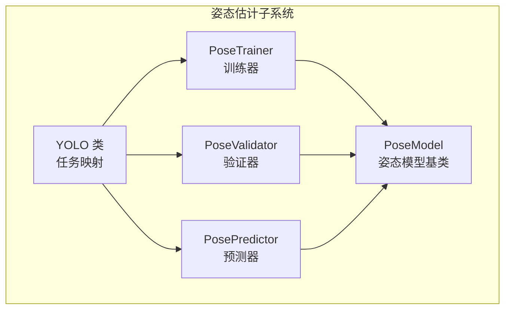
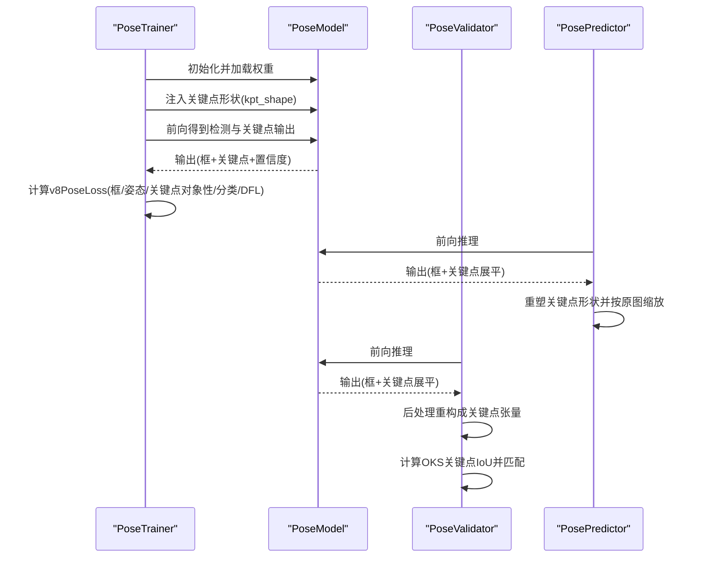
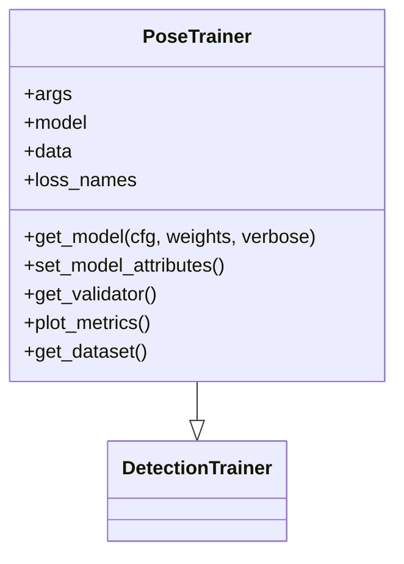
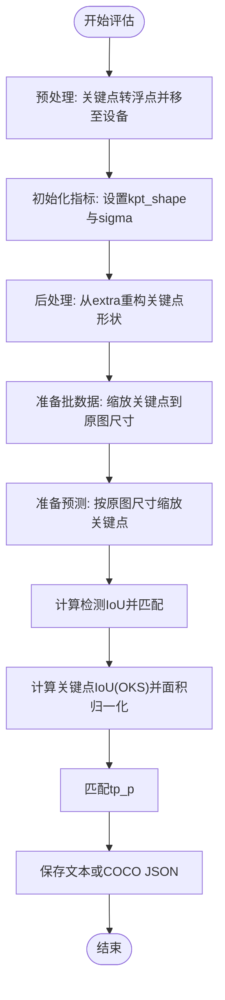
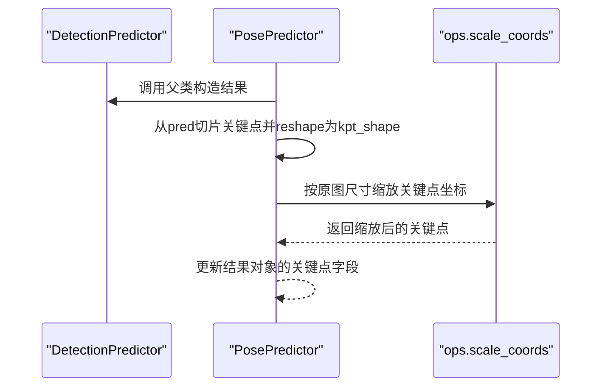
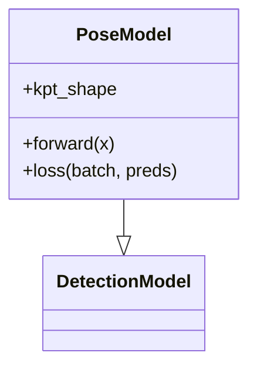
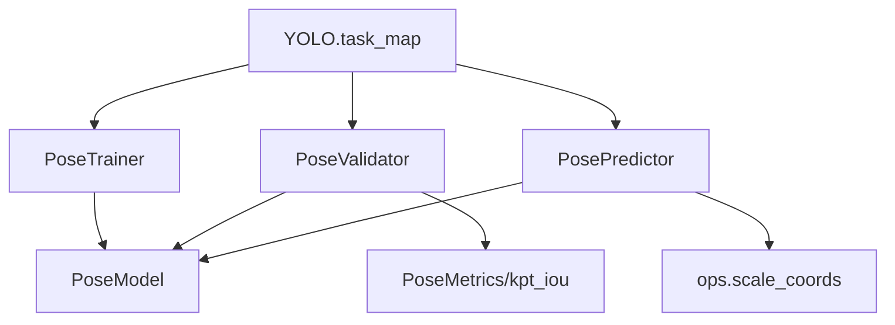

# 姿态估计头架构

<cite>
**本文档引用的文件**
- [ultralytics/models/yolo/pose/__init__.py](file://ultralytics/models/yolo/pose/__init__.py)
- [ultralytics/models/yolo/pose/predict.py](file://ultralytics/models/yolo/pose/predict.py)
- [ultralytics/models/yolo/pose/train.py](file://ultralytics/models/yolo/pose/train.py)
- [ultralytics/models/yolo/pose/val.py](file://ultralytics/models/yolo/pose/val.py)
- [ultralytics/models/yolo/model.py](file://ultralytics/models/yolo/model.py)
- [ultralytics/nn/tasks.py](file://ultralytics/nn/tasks.py)
</cite>

## 目录
1. [简介](#简介)
2. [项目结构](#项目结构)
3. [核心组件](#核心组件)
4. [架构总览](#架构总览)
5. [详细组件分析](#详细组件分析)
6. [依赖关系分析](#依赖关系分析)
7. [性能考虑](#性能考虑)
8. [故障排除指南](#故障排除指南)
9. [结论](#结论)

## 简介
本文件系统性阐述姿态估计头（Pose Head）在 Ultralytics 框架中的设计与实现，重点覆盖以下方面：
- 关键点检测机制：如何从特征图回归关键点坐标与可见性置信度
- 关键点连接关系：如何通过关键点形状配置与 OKS 计算实现姿态评分与匹配
- 姿态评分计算：基于 OKS 的关键点 IoU 与多尺度面积归一化策略
- 从特征图到最终预测的端到端流程：前向推理、后处理与坐标缩放
- 可配置参数：关键点数量、连接关系、置信度阈值与解码算法的调优方式

该文档旨在帮助读者快速理解并高效调整姿态估计任务的参数与流程。

## 项目结构
姿态估计相关代码主要分布在以下模块：
- 模型封装与任务映射：YOLO 类的任务映射中包含 pose 任务
- 姿态专用训练器、验证器与预测器：分别负责训练、评估与推理
- 姿态模型基类：PoseModel 继承自 DetectionModel，扩展关键点维度与损失

**图表来源**
- [ultralytics/models/yolo/model.py:96-131](file://ultralytics/models/yolo/model.py#L96-L131)
- [ultralytics/models/yolo/pose/train.py:13-39](file://ultralytics/models/yolo/pose/train.py#L13-L39)
- [ultralytics/models/yolo/pose/val.py:14-47](file://ultralytics/models/yolo/pose/val.py#L14-L47)
- [ultralytics/models/yolo/pose/predict.py:7-27](file://ultralytics/models/yolo/pose/predict.py#L7-L27)
- [ultralytics/nn/tasks.py:1420-1420](file://ultralytics/nn/tasks.py#L1420-L1420)

**章节来源**
- [ultralytics/models/yolo/model.py:96-131](file://ultralytics/models/yolo/model.py#L96-L131)
- [ultralytics/models/yolo/pose/__init__.py:1-8](file://ultralytics/models/yolo/pose/__init__.py#L1-L8)

## 核心组件
- PoseTrainer：继承自 DetectionTrainer，负责姿态模型的训练、损失名称定义、数据集校验（要求提供关键点形状）、可视化与验证器创建
- PoseValidator：继承自 DetectionValidator，负责姿态评估的关键点预处理、后处理、OKS 计算、关键点 IoU 匹配与 COCO JSON 导出
- PosePredictor：继承自 DetectionPredictor，负责姿态预测结果构造，将关键点从展平张量重构成指定形状并按原图尺寸缩放
- PoseModel：姿态模型基类，继承 DetectionModel，通过 kpt_shape 属性承载关键点维度信息，并在训练阶段注入到模型中

**章节来源**
- [ultralytics/models/yolo/pose/train.py:13-129](file://ultralytics/models/yolo/pose/train.py#L13-L129)
- [ultralytics/models/yolo/pose/val.py:14-294](file://ultralytics/models/yolo/pose/val.py#L14-L294)
- [ultralytics/models/yolo/pose/predict.py:7-81](file://ultralytics/models/yolo/pose/predict.py#L7-L81)
- [ultralytics/nn/tasks.py:1420-1420](file://ultralytics/nn/tasks.py#L1420-L1420)

## 架构总览
姿态估计头的端到端流程如下：
- 训练阶段：PoseTrainer 获取 PoseModel，设置关键点形状，使用 v8PoseLoss 计算框损失、姿态损失、关键点对象性损失、分类损失与分布焦点损失
- 推理阶段：PosePredictor 从检测头输出中提取关键点张量，按模型关键点形状重构，并将关键点坐标从特征图尺度缩放到原图尺寸
- 评估阶段：PoseValidator 对批数据进行关键点预处理与缩放，后处理阶段将额外输出（extra）重构成关键点张量，计算 OKS 关键点 IoU 并进行匹配

**图表来源**
- [ultralytics/models/yolo/pose/train.py:74-109](file://ultralytics/models/yolo/pose/train.py#L74-L109)
- [ultralytics/models/yolo/pose/predict.py:56-80](file://ultralytics/models/yolo/pose/predict.py#L56-L80)
- [ultralytics/models/yolo/pose/val.py:119-147](file://ultralytics/models/yolo/pose/val.py#L119-L147)

## 详细组件分析

### PoseTrainer 分析
- 任务设置：强制将 args.task 设为 "pose"，并在 Apple MPS 设备上发出已知问题警告
- 模型获取：通过 PoseModel(cfg, nc, ch, data_kpt_shape, verbose) 创建模型，若提供权重则加载
- 数据集校验：要求数据集中包含 kpt_shape 键，否则抛出异常
- 验证器创建：返回 PoseValidator 实例，设置损失名称元组
- 指标可视化：plot_metrics 调用 plot_results，传入 pose=True

**图表来源**
- [ultralytics/models/yolo/pose/train.py:13-129](file://ultralytics/models/yolo/pose/train.py#L13-L129)

**章节来源**
- [ultralytics/models/yolo/pose/train.py:41-129](file://ultralytics/models/yolo/pose/train.py#L41-L129)

### PoseValidator 分析
- 初始化：设置 args.task 为 "pose"，初始化 PoseMetrics；在 MPS 上给出警告
- 关键点形状与 OKS：根据数据集 kpt_shape 判断是否为 COCO 格式，设置 sigma（OKS_SIGMA 或按关键点数量归一）
- 预处理：将批次中的关键点转换为浮点并移动到设备
- 后处理：从额外输出(extra)中提取关键点并按 kpt_shape 重塑
- 批处理与匹配：计算检测框 IoU 后，使用 kpt_iou 计算关键点 IoU，结合面积归一化得到 tp_p
- 结果导出：支持保存文本格式与 COCO JSON 格式

**图表来源**
- [ultralytics/models/yolo/pose/val.py:84-226](file://ultralytics/models/yolo/pose/val.py#L84-L226)

**章节来源**
- [ultralytics/models/yolo/pose/val.py:49-294](file://ultralytics/models/yolo/pose/val.py#L49-L294)

### PosePredictor 分析
- 任务设置：将 args.task 设为 "pose"
- 结果构造：在父类 DetectionPredictor 的基础上，从预测张量中切片关键点部分，按模型 kpt_shape 重塑，并将关键点坐标从特征图尺度缩放到原图尺寸

**图表来源**
- [ultralytics/models/yolo/pose/predict.py:56-80](file://ultralytics/models/yolo/pose/predict.py#L56-L80)

**章节来源**
- [ultralytics/models/yolo/pose/predict.py:29-81](file://ultralytics/models/yolo/pose/predict.py#L29-L81)

### PoseModel 分析
- 姿态模型基类：继承 DetectionModel，通过 data_kpt_shape 参数在初始化时注入关键点形状信息
- 关键点形状注入：在训练器中通过 set_model_attributes 将 data["kpt_shape"] 写入模型属性

**图表来源**
- [ultralytics/nn/tasks.py:1420-1420](file://ultralytics/nn/tasks.py#L1420-L1420)

**章节来源**
- [ultralytics/nn/tasks.py:1420-1420](file://ultralytics/nn/tasks.py#L1420-L1420)

## 依赖关系分析
- 任务映射：YOLO 类的 task_map 将 "pose" 映射到 PoseModel、PoseTrainer、PoseValidator、PosePredictor
- 模型依赖：PoseTrainer 依赖 PoseModel；PoseValidator 依赖 PoseMetrics 与 kpt_iou；PosePredictor 依赖 ops.scale_coords
- 数据依赖：训练与验证均依赖数据集中的 kpt_shape 与关键点标注

**图表来源**
- [ultralytics/models/yolo/model.py:96-131](file://ultralytics/models/yolo/model.py#L96-L131)
- [ultralytics/models/yolo/pose/val.py:11-11](file://ultralytics/models/yolo/pose/val.py#L11-L11)
- [ultralytics/models/yolo/pose/predict.py:4-4](file://ultralytics/models/yolo/pose/predict.py#L4-L4)

**章节来源**
- [ultralytics/models/yolo/model.py:96-131](file://ultralytics/models/yolo/model.py#L96-L131)
- [ultralytics/models/yolo/pose/val.py:14-47](file://ultralytics/models/yolo/pose/val.py#L14-L47)
- [ultralytics/models/yolo/pose/predict.py:3-6](file://ultralytics/models/yolo/pose/predict.py#L3-L6)

## 性能考虑
- 关键点 IoU 计算：OKS 使用面积归一化因子（COCO 规范），在大规模数据集上建议合理设置 IoU 阈值与关键点可见性阈值以平衡召回与精度
- 坐标缩放：在验证与预测阶段均需进行坐标缩放，注意 ratio_pad 与原图尺寸的一致性，避免边界误差
- 设备兼容性：Apple MPS 在姿态模型上存在已知问题，建议在该设备上使用 CPU 推理
- 批处理与内存：关键点张量在后处理阶段会进行 reshape 与复制操作，大批次或高分辨率输入可能增加显存占用

## 故障排除指南
- Apple MPS 姿态模型警告：当设备为 mps 时，框架会提示已知问题并建议使用 cpu
- 数据集缺少 kpt_shape：训练阶段若数据集中未提供关键点形状，将抛出异常，需检查数据集配置
- 关键点 IoU 为空：当批内无检测或无标注时，tp_p 将全为 False，属于正常情况
- COCO 评估失败：确保保存的 JSON 文件与 annotations 路径正确，且类别映射一致

**章节来源**
- [ultralytics/models/yolo/pose/train.py:63-72](file://ultralytics/models/yolo/pose/train.py#L63-L72)
- [ultralytics/models/yolo/pose/train.py:125-128](file://ultralytics/models/yolo/pose/train.py#L125-L128)
- [ultralytics/models/yolo/pose/val.py:78-82](file://ultralytics/models/yolo/pose/val.py#L78-L82)
- [ultralytics/models/yolo/pose/val.py:218-226](file://ultralytics/models/yolo/pose/val.py#L218-L226)

## 结论
姿态估计头在 Ultralytics 中通过 PoseTrainer、PoseValidator、PosePredictor 与 PoseModel 协作完成从特征图到关键点坐标的回归与评估。其核心在于：
- 以 kpt_shape 为锚定的关键点形状配置
- 以 OKS 为核心的姿态评分与匹配策略
- 在训练、验证与推理三阶段统一的关键点坐标缩放与后处理流程

通过合理设置关键点数量、连接关系、置信度阈值与解码算法参数，可针对不同姿态估计任务（如 COCO 17 关键点）实现高精度与高效率的端到端解决方案。