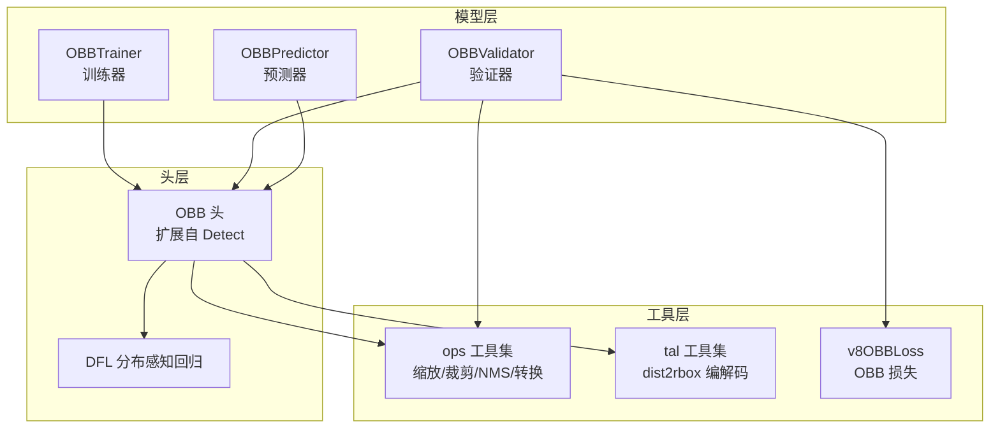
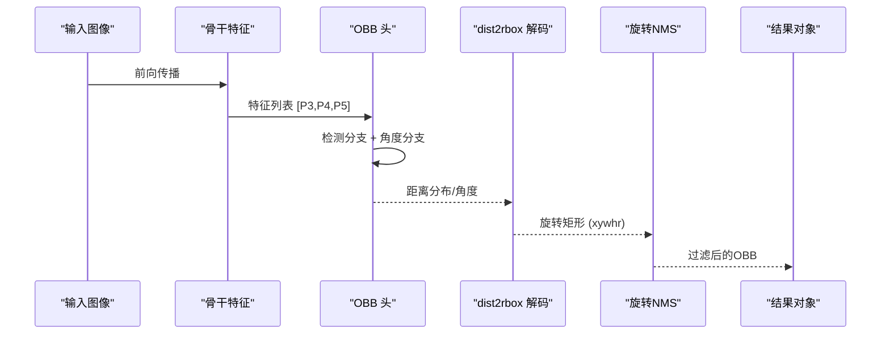
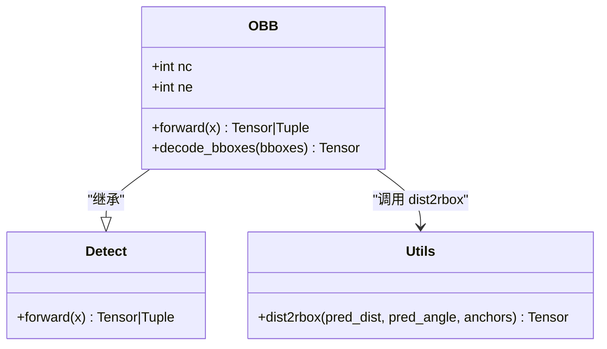
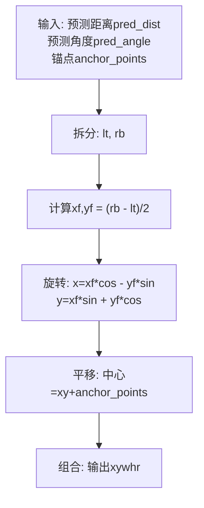
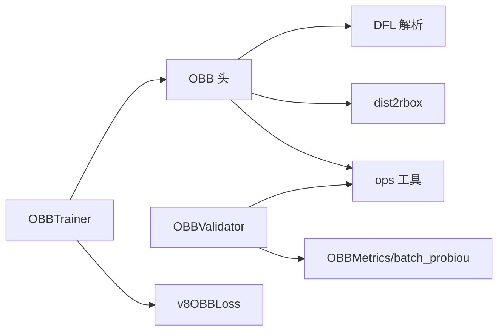

# 定向边界框头架构

<cite>
**本文引用的文件**
- [ultralytics/models/yolo/obb/__init__.py](file://ultralytics/models/yolo/obb/__init__.py)
- [ultralytics/models/yolo/obb/predict.py](file://ultralytics/models/yolo/obb/predict.py)
- [ultralytics/models/yolo/obb/train.py](file://ultralytics/models/yolo/obb/train.py)
- [ultralytics/models/yolo/obb/val.py](file://ultralytics/models/yolo/obb/val.py)
- [ultralytics/nn/modules/head.py](file://ultralytics/nn/modules/head.py)
- [ultralytics/utils/tal.py](file://ultralytics/utils/tal.py)
- [ultralytics/utils/ops.py](file://ultralytics/utils/ops.py)
- [ultralytics/engine/results.py](file://ultralytics/engine/results.py)
- [ultralytics/utils/loss.py](file://ultralytics/utils/loss.py)
</cite>

## 目录
1. [引言](#引言)
2. [项目结构](#项目结构)
3. [核心组件](#核心组件)
4. [架构总览](#架构总览)
5. [详细组件分析](#详细组件分析)
6. [依赖分析](#依赖分析)
7. [性能考虑](#性能考虑)
8. [故障排查指南](#故障排查指南)
9. [结论](#结论)
10. [附录](#附录)

## 引言
本文件系统性阐述定向边界框（OBB）检测头在代码库中的设计与实现，重点覆盖以下方面：
- 角度预测机制：如何从特征图回归或分类角度，以及输出范围与后处理策略
- 旋转矩形编码与解码：从分布感知的四边距离到旋转矩形中心、宽高与角度的映射过程
- OBB头如何从特征图同时预测目标中心坐标、宽高、旋转角度与类别概率
- 配置示例与实现细节：如何针对不同旋转目标检测任务调整角度表示方式、损失函数权重与后处理算法

## 项目结构
OBB相关能力由“模型层”“头层”“工具层”协同完成：
- 模型层：OBB训练器、验证器、预测器封装了任务级流程
- 头层：OBB检测头在YOLO检测头基础上扩展角度分支
- 工具层：角度解码、NMS、坐标变换、指标计算等支撑功能

图表来源
- [ultralytics/models/yolo/obb/train.py:12-90](file://ultralytics/models/yolo/obb/train.py#L12-L90)
- [ultralytics/models/yolo/obb/val.py:14-304](file://ultralytics/models/yolo/obb/val.py#L14-L304)
- [ultralytics/models/yolo/obb/predict.py:10-66](file://ultralytics/models/yolo/obb/predict.py#L10-L66)
- [ultralytics/nn/modules/head.py:302-356](file://ultralytics/nn/modules/head.py#L302-L356)
- [ultralytics/utils/tal.py:400-419](file://ultralytics/utils/tal.py#L400-L419)
- [ultralytics/utils/ops.py:105-141](file://ultralytics/utils/ops.py#L105-L141)
- [ultralytics/utils/loss.py:142-701](file://ultralytics/utils/loss.py#L142-L701)

章节来源
- [ultralytics/models/yolo/obb/train.py:12-90](file://ultralytics/models/yolo/obb/train.py#L12-L90)
- [ultralytics/models/yolo/obb/val.py:14-304](file://ultralytics/models/yolo/obb/val.py#L14-L304)
- [ultralytics/models/yolo/obb/predict.py:10-66](file://ultralytics/models/yolo/obb/predict.py#L10-L66)
- [ultralytics/nn/modules/head.py:302-356](file://ultralytics/nn/modules/head.py#L302-L356)
- [ultralytics/utils/tal.py:400-419](file://ultralytics/utils/tal.py#L400-L419)
- [ultralytics/utils/ops.py:105-141](file://ultralytics/utils/ops.py#L105-L141)
- [ultralytics/utils/loss.py:142-701](file://ultralytics/utils/loss.py#L142-L701)

## 核心组件
- OBB检测头（Detect 扩展）
  - 在YOLO检测头基础上新增角度预测分支，输出包含中心、宽高、类别与角度
  - 训练时返回角度张量；推理时将角度与检测结果拼接
- 角度解码函数 dist2rbox
  - 将分布感知的距离预测与角度预测结合，得到旋转矩形的中心、宽高与角度
- 推理后处理
  - 预测器将输出转换为规范化OBB格式，进行尺度缩放与角度拼接
- 验证与评估
  - 验证器使用OBB专用指标与旋转NMS，支持DOTA格式导出与合并

章节来源
- [ultralytics/nn/modules/head.py:302-356](file://ultralytics/nn/modules/head.py#L302-L356)
- [ultralytics/utils/tal.py:400-419](file://ultralytics/utils/tal.py#L400-L419)
- [ultralytics/models/yolo/obb/predict.py:47-66](file://ultralytics/models/yolo/obb/predict.py#L47-L66)
- [ultralytics/models/yolo/obb/val.py:14-304](file://ultralytics/models/yolo/obb/val.py#L14-L304)

## 架构总览
OBB检测头的端到端工作流如下：

图表来源
- [ultralytics/nn/modules/head.py:339-356](file://ultralytics/nn/modules/head.py#L339-L356)
- [ultralytics/utils/tal.py:400-419](file://ultralytics/utils/tal.py#L400-L419)
- [ultralytics/utils/ops.py:159-189](file://ultralytics/utils/ops.py#L159-L189)
- [ultralytics/models/yolo/obb/predict.py:47-66](file://ultralytics/models/yolo/obb/predict.py#L47-L66)

## 详细组件分析

### OBB检测头（角度预测与解码）
- 角度预测机制
  - 通过cv4卷积子模块对每个尺度特征图进行角度分支预测，输出形状为[bs, ne, hw]
  - 归一化到[-π/4, 3π/4]区间，便于稳定训练与推理
  - 训练阶段返回角度张量；推理阶段缓存角度以供解码使用
- 旋转矩形解码
  - 使用dist2rbox将分布感知的距离预测与角度预测结合，得到旋转矩形中心、宽高与角度
  - 支持按步幅缩放，得到原图坐标系下的旋转矩形

图表来源
- [ultralytics/nn/modules/head.py:302-356](file://ultralytics/nn/modules/head.py#L302-L356)
- [ultralytics/utils/tal.py:400-419](file://ultralytics/utils/tal.py#L400-L419)

章节来源
- [ultralytics/nn/modules/head.py:302-356](file://ultralytics/nn/modules/head.py#L302-L356)
- [ultralytics/utils/tal.py:400-419](file://ultralytics/utils/tal.py#L400-L419)

### 角度预测与输出范围
- 角度分支输出经sigmoid归一化后映射至[-π/4, 3π/4]，覆盖常见旋转目标的主方向范围
- 推理时将角度与检测头输出拼接，形成最终OBB预测（x, y, w, h, conf, cls, angle）

章节来源
- [ultralytics/nn/modules/head.py:339-351](file://ultralytics/nn/modules/head.py#L339-L351)

### 旋转矩形编码与解码算法
- 编码
  - 目标框先经DFL（Distribution Focal Loss）编码为四边距离（ltrb），再配合角度进行解码
- 解码
  - dist2rbox将pred_dist拆分为左上与右下两部分，利用pred_angle的cos/sin进行旋转，再平移回锚点坐标
  - 最终得到xy（中心）、wh（宽高）与angle（角度）

图表来源
- [ultralytics/utils/tal.py:400-419](file://ultralytics/utils/tal.py#L400-L419)

章节来源
- [ultralytics/utils/tal.py:400-419](file://ultralytics/utils/tal.py#L400-L419)

### 预测器（构造OBB结果）
- 将检测头输出的前四维（x, y, w, h）与角度拼接
- 对旋转矩形进行尺度缩放，映射回原图尺寸
- 生成包含OBB的Results对象，便于后续可视化与保存

章节来源
- [ultralytics/models/yolo/obb/predict.py:47-66](file://ultralytics/models/yolo/obb/predict.py#L47-L66)
- [ultralytics/engine/results.py:1461-1556](file://ultralytics/engine/results.py#L1461-L1556)

### 验证器（OBB专用评估与NMS）
- 使用OBBMetrics与probiou计算IoU矩阵，支持多IoU阈值统计
- 采用旋转NMS（nms_rotated）过滤重叠预测，提升旋转目标检测精度
- 支持DOTA格式导出与合并，便于与标准评测脚本对接

章节来源
- [ultralytics/models/yolo/obb/val.py:14-304](file://ultralytics/models/yolo/obb/val.py#L14-L304)
- [ultralytics/utils/ops.py:159-189](file://ultralytics/utils/ops.py#L159-L189)

### 训练器（OBB任务配置）
- 自动设置task=obb，确保训练流程与OBB任务一致
- 返回OBBModel并加载预训练权重（可选）
- 提供OBBValidator用于验证

章节来源
- [ultralytics/models/yolo/obb/train.py:12-90](file://ultralytics/models/yolo/obb/train.py#L12-L90)

## 依赖分析
- OBB头依赖
  - Detect基础头：复用分类与回归分支
  - dist2rbox：将距离分布与角度解码为旋转矩形
  - ops：缩放、裁剪、旋转NMS等
- 训练/验证依赖
  - v8OBBLoss：OBB专用损失（IoU、分类、DFL）
  - OBBMetrics/batch_probiou：OBB评估指标

图表来源
- [ultralytics/nn/modules/head.py:302-356](file://ultralytics/nn/modules/head.py#L302-L356)
- [ultralytics/utils/tal.py:400-419](file://ultralytics/utils/tal.py#L400-L419)
- [ultralytics/utils/ops.py:105-141](file://ultralytics/utils/ops.py#L105-L141)
- [ultralytics/utils/loss.py:142-701](file://ultralytics/utils/loss.py#L142-L701)
- [ultralytics/models/yolo/obb/val.py:14-304](file://ultralytics/models/yolo/obb/val.py#L14-L304)

章节来源
- [ultralytics/nn/modules/head.py:302-356](file://ultralytics/nn/modules/head.py#L302-L356)
- [ultralytics/utils/tal.py:400-419](file://ultralytics/utils/tal.py#L400-L419)
- [ultralytics/utils/ops.py:105-141](file://ultralytics/utils/ops.py#L105-L141)
- [ultralytics/utils/loss.py:142-701](file://ultralytics/utils/loss.py#L142-L701)
- [ultralytics/models/yolo/obb/val.py:14-304](file://ultralytics/models/yolo/obb/val.py#L14-L304)

## 性能考虑
- 角度范围映射
  - 将角度限制在[-π/4, 3π/4]可提升训练稳定性与收敛速度
- 旋转NMS阈值
  - 合理设置nms_rotated阈值（如0.3）可在保持召回的同时减少冗余检测
- DFL与IoU损失
  - 结合CIoU与DFL可提升定位精度，建议在旋转目标密集场景适当提高IoU权重

## 故障排查指南
- 预测角度异常
  - 确认角度分支输出是否被正确映射到[-π/4, 3π/4]区间
  - 检查推理阶段是否缓存并使用了正确的角度张量
- 旋转矩形不匹配
  - 核对dist2rbox输入维度与锚点对齐情况
  - 确保尺度缩放与原图尺寸一致
- 评估指标异常
  - 检查DOTA格式导出路径与合并逻辑
  - 确认nms_rotated阈值与probiou计算一致性

章节来源
- [ultralytics/nn/modules/head.py:339-356](file://ultralytics/nn/modules/head.py#L339-L356)
- [ultralytics/utils/tal.py:400-419](file://ultralytics/utils/tal.py#L400-L419)
- [ultralytics/utils/ops.py:159-189](file://ultralytics/utils/ops.py#L159-L189)
- [ultralytics/models/yolo/obb/val.py:239-304](file://ultralytics/models/yolo/obb/val.py#L239-L304)

## 结论
OBB检测头通过在YOLO检测头基础上增加角度分支与dist2rbox解码，实现了从特征图到旋转矩形的端到端预测。其角度范围约束、旋转NMS与OBB专用指标共同提升了旋转目标检测的精度与鲁棒性。通过合理配置角度表示、损失权重与后处理阈值，可针对不同旋转目标检测任务取得更优效果。

## 附录
- 配置要点（示例性描述）
  - 角度表示方式：选择[-π/4, 3π/4]范围映射，适配多数旋转目标
  - 损失函数权重：可根据任务复杂度调整IoU、分类与DFL权重
  - 后处理算法：旋转NMS阈值建议从0.3起步，结合数据集密度微调
- 数据格式
  - 预测输出格式：(x, y, w, h, conf, cls, angle)
  - 评估输出格式：rbox（x, y, w, h, angle）与polygon（x1, y1, x2, y2, x3, y3, x4, y4）