# 模型架构设计

<cite>
**本文档引用的文件**
- [ultralytics/models/rtdetrmm/model.py](file://ultralytics/models/rtdetrmm/model.py)
- [ultralytics/models/rtdetrmm/train.py](file://ultralytics/models/rtdetrmm/train.py)
- [ultralytics/models/rtdetrmm/predict.py](file://ultralytics/models/rtdetrmm/predict.py)
- [ultralytics/models/rtdetr/model.py](file://ultralytics/models/rtdetr/model.py)
- [ultralytics/models/yolo/model.py](file://ultralytics/models/yolo/model.py)
- [ultralytics/nn/mm/router.py](file://ultralytics/nn/mm/router.py)
- [ultralytics/nn/mm/utils.py](file://ultralytics/nn/mm/utils.py)
</cite>

## 目录
1. [引言](#引言)
2. [项目结构](#项目结构)
3. [核心组件](#核心组件)
4. [架构概览](#架构概览)
5. [详细组件分析](#详细组件分析)
6. [依赖关系分析](#依赖关系分析)
7. [性能考虑](#性能考虑)
8. [故障排除指南](#故障排除指南)
9. [结论](#结论)

## 引言

本文件面向多模态检测模型架构设计，重点阐述YOLOMM和RTDETRMM两大系列模型的整体架构设计。我们将深入解析骨干网络、颈部网络、头部网络的组成与功能，详细说明多尺度特征处理机制、模态融合策略以及路由机制的设计原理。同时，对比不同模型变体的特点与适用场景，包括YOLO11系列、RT-DETR系列等，并提供架构图解与组件交互说明，帮助读者全面理解各模块之间的数据流向与处理逻辑。

## 项目结构

该代码库采用模块化组织方式，围绕多模态检测任务构建了完整的模型体系：

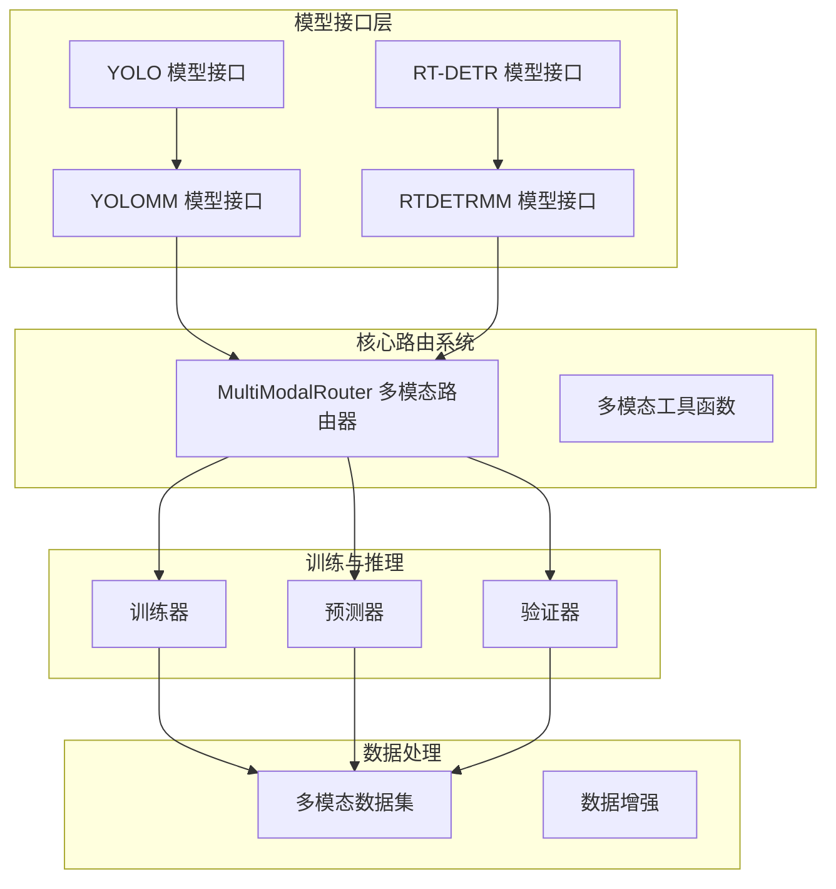

**图表来源**
- [ultralytics/models/yolo/model.py:27-131](file://ultralytics/models/yolo/model.py#L27-L131)
- [ultralytics/models/rtdetr/model.py:31-75](file://ultralytics/models/rtdetr/model.py#L31-L75)
- [ultralytics/models/rtdetrmm/model.py:25-57](file://ultralytics/models/rtdetrmm/model.py#L25-L57)

**章节来源**
- [ultralytics/models/yolo/model.py:27-131](file://ultralytics/models/yolo/model.py#L27-L131)
- [ultralytics/models/rtdetr/model.py:31-75](file://ultralytics/models/rtdetr/model.py#L31-L75)
- [ultralytics/models/rtdetrmm/model.py:25-57](file://ultralytics/models/rtdetrmm/model.py#L25-L57)

## 核心组件

### 多模态路由器系统

MultiModalRouter是整个多模态系统的核心，负责RGB与X模态之间的智能路由与融合：

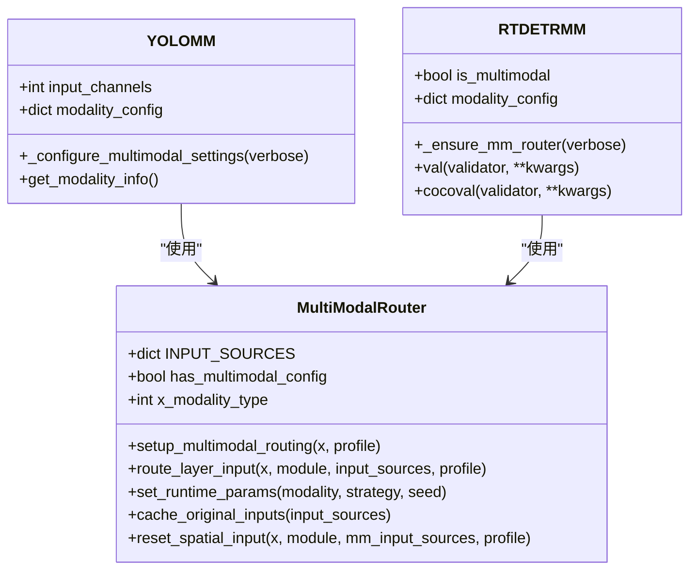

**图表来源**
- [ultralytics/nn/mm/router.py:11-471](file://ultralytics/nn/mm/router.py#L11-L471)
- [ultralytics/models/yolo/model.py:456-658](file://ultralytics/models/yolo/model.py#L456-L658)
- [ultralytics/models/rtdetrmm/model.py:25-188](file://ultralytics/models/rtdetrmm/model.py#L25-L188)

### 模型变体架构

系统支持多种模型变体，每种都有特定的架构特点：

| 模型系列 | 输入通道 | 模态支持 | 架构特点 |
|---------|---------|---------|---------|
| YOLO11系列 | 3/6 | RGB, X, Dual | CNN骨干网络，多尺度特征融合 |
| RT-DETR系列 | 3/6 | RGB, X, Dual | Vision Transformer骨干，查询解码器 |
| YOLOMM | 3/6 | RGB+X | 传统CNN架构的多模态扩展 |
| RTDETRMM | 3/6 | RGB+X | Vision Transformer架构的多模态扩展 |

**章节来源**
- [ultralytics/models/yolo/model.py:456-658](file://ultralytics/models/yolo/model.py#L456-L658)
- [ultralytics/models/rtdetrmm/model.py:25-188](file://ultralytics/models/rtdetrmm/model.py#L25-L188)

## 架构概览

### YOLOMM架构设计

YOLOMM基于传统的YOLO架构扩展，主要特点是：

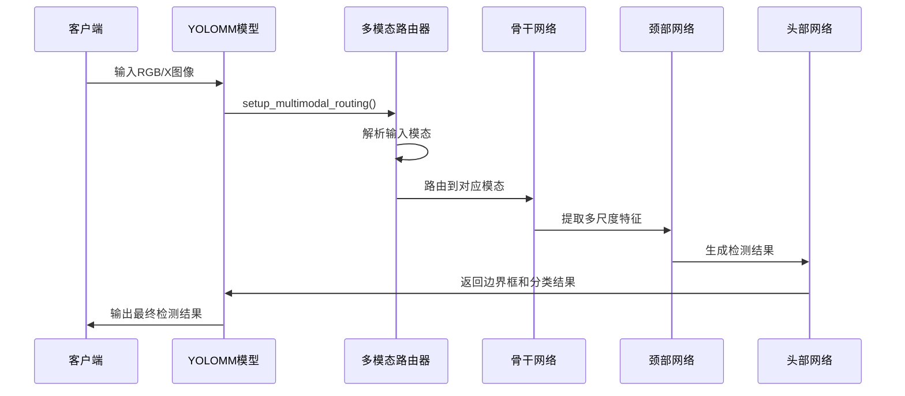

**图表来源**
- [ultralytics/models/yolo/model.py:456-658](file://ultralytics/models/yolo/model.py#L456-L658)
- [ultralytics/nn/mm/router.py:157-240](file://ultralytics/nn/mm/router.py#L157-L240)

### RTDETRMM架构设计

RTDETRMM基于Vision Transformer架构，具有独特的查询解码器机制：

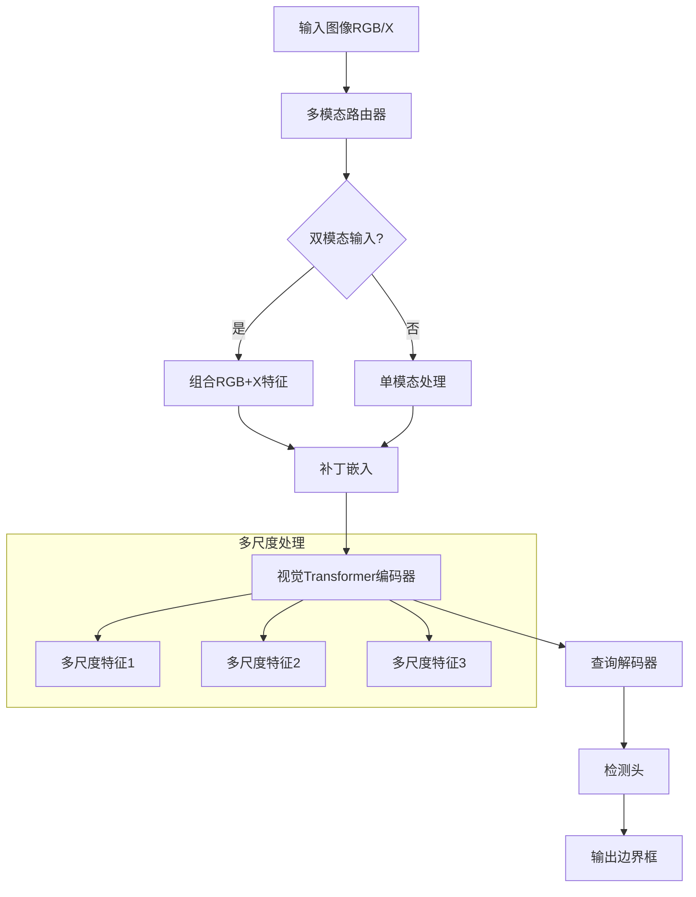

**图表来源**
- [ultralytics/models/rtdetrmm/model.py:25-188](file://ultralytics/models/rtdetrmm/model.py#L25-L188)
- [ultralytics/models/rtdetrmm/train.py:173-254](file://ultralytics/models/rtdetrmm/train.py#L173-L254)

## 详细组件分析

### 骨干网络设计

#### YOLOMM骨干网络
YOLOMM采用改进的CSP（Cross Stage Partial）架构，支持多模态输入：

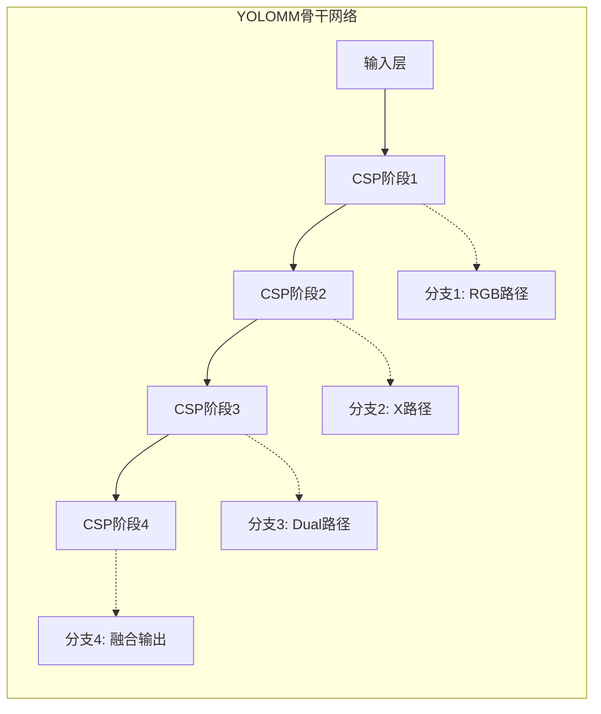

**图表来源**
- [ultralytics/models/yolo/model.py:516-740](file://ultralytics/models/yolo/model.py#L516-L740)

#### RTDETR骨干网络
RTDETR使用Vision Transformer架构，具有层次化的特征提取能力：

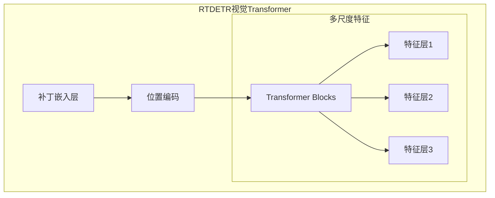

**图表来源**
- [ultralytics/models/rtdetrmm/model.py:150-180](file://ultralytics/models/rtdetrmm/model.py#L150-L180)

### 颈部网络设计

#### 多尺度特征融合
两种架构都实现了多尺度特征处理机制：

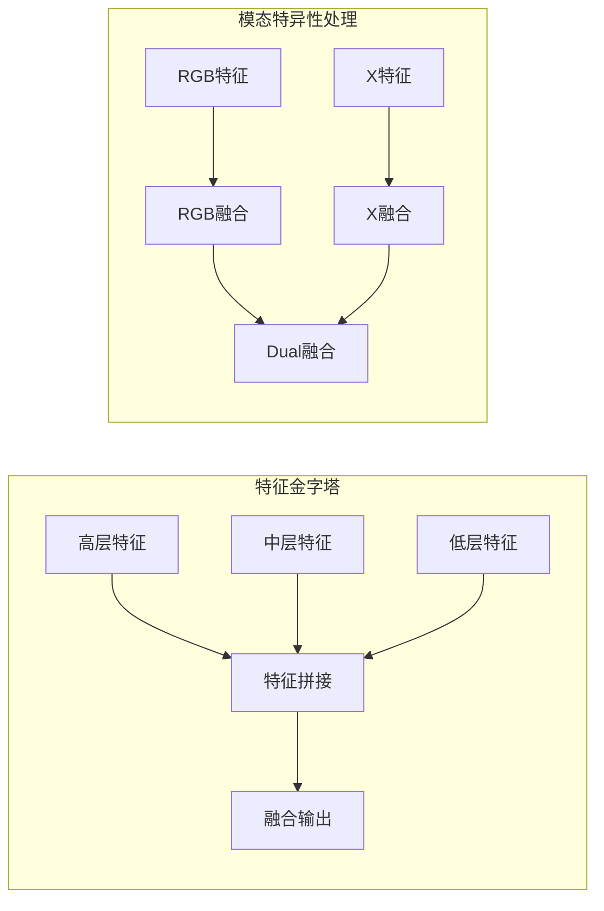

**图表来源**
- [ultralytics/nn/mm/router.py:242-317](file://ultralytics/nn/mm/router.py#L242-L317)

### 头部网络设计

#### YOLOMM检测头
采用YOLO风格的检测头，支持多类别检测：

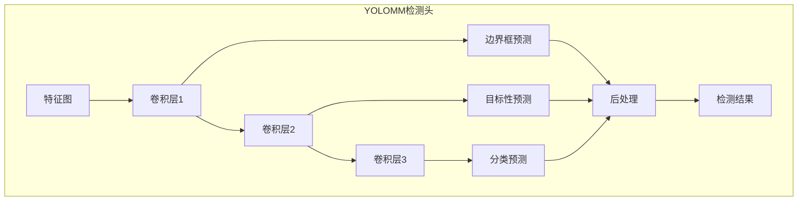

**图表来源**
- [ultralytics/models/yolo/model.py:660-740](file://ultralytics/models/yolo/model.py#L660-L740)

#### RTDETR检测头
使用查询解码器架构：

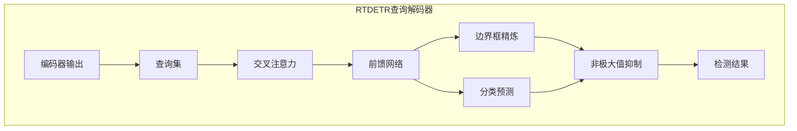

**图表来源**
- [ultralytics/models/rtdetrmm/predict.py:21-91](file://ultralytics/models/rtdetrmm/predict.py#L21-L91)

### 模态融合策略

#### 路由机制设计
多模态路由器实现了灵活的路由机制：

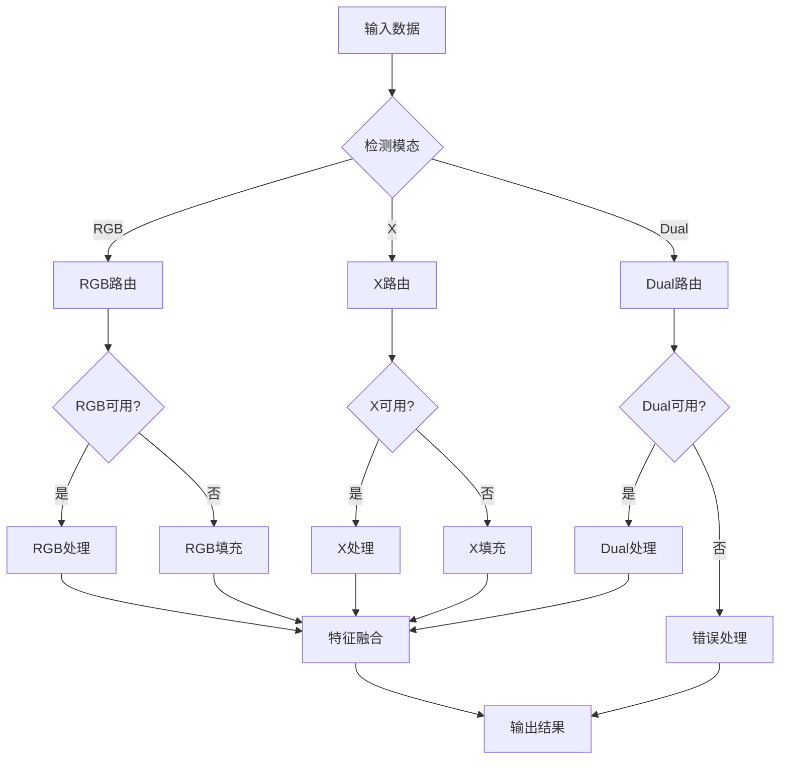

**图表来源**
- [ultralytics/nn/mm/router.py:157-240](file://ultralytics/nn/mm/router.py#L157-L240)
- [ultralytics/nn/mm/router.py:242-317](file://ultralytics/nn/mm/router.py#L242-L317)

### 数据流处理

#### 训练阶段数据流
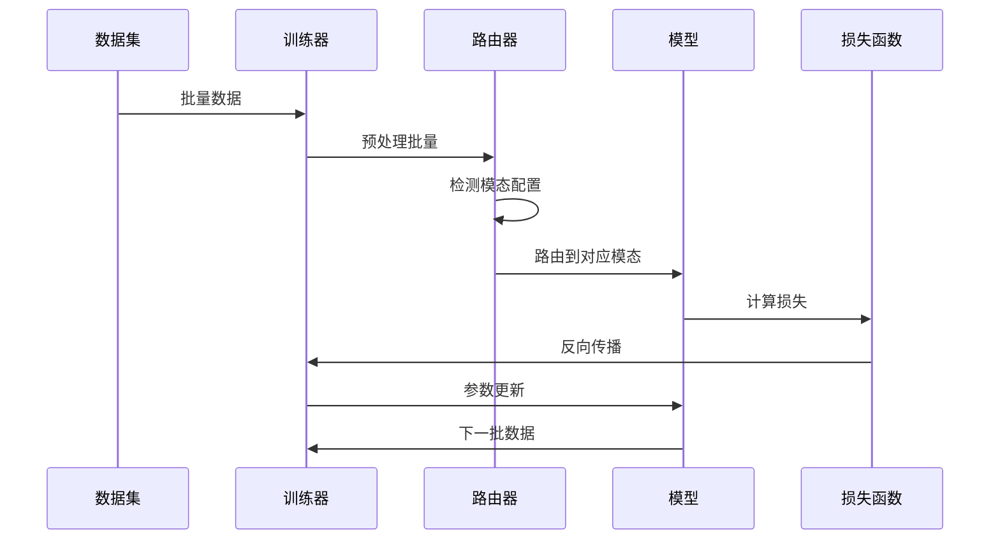

**图表来源**
- [ultralytics/models/rtdetrmm/train.py:116-170](file://ultralytics/models/rtdetrmm/train.py#L116-L170)
- [ultralytics/models/rtdetrmm/train.py:256-291](file://ultralytics/models/rtdetrmm/train.py#L256-L291)

**章节来源**
- [ultralytics/nn/mm/router.py:11-471](file://ultralytics/nn/mm/router.py#L11-L471)
- [ultralytics/models/rtdetrmm/train.py:116-170](file://ultralytics/models/rtdetrmm/train.py#L116-L170)

## 依赖关系分析

### 模块间依赖关系

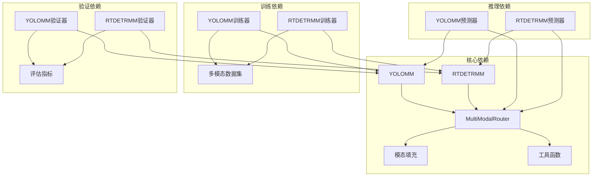

**图表来源**
- [ultralytics/models/yolo/model.py:456-658](file://ultralytics/models/yolo/model.py#L456-L658)
- [ultralytics/models/rtdetrmm/model.py:25-188](file://ultralytics/models/rtdetrmm/model.py#L25-L188)

### 错误处理机制

系统实现了多层次的错误处理机制：

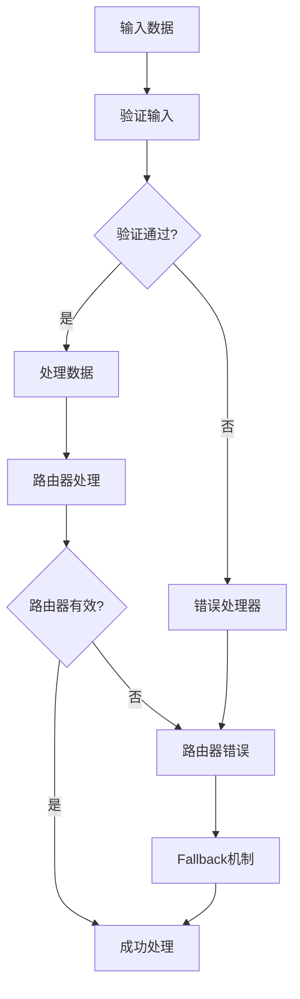

**图表来源**
- [ultralytics/nn/mm/router.py:242-317](file://ultralytics/nn/mm/router.py#L242-L317)

**章节来源**
- [ultralytics/models/rtdetrmm/model.py:140-180](file://ultralytics/models/rtdetrmm/model.py#L140-L180)
- [ultralytics/nn/mm/router.py:242-317](file://ultralytics/nn/mm/router.py#L242-L317)

## 性能考虑

### 计算复杂度优化

1. **零拷贝路由**: MultiModalRouter实现零拷贝张量视图路由，减少内存分配开销
2. **动态通道适配**: 根据配置动态调整输入通道数，避免不必要的数据转换
3. **批处理优化**: 支持批量推理，提高GPU利用率

### 内存管理策略

- **缓存机制**: 路由器缓存原始输入用于空间重置操作
- **智能填充**: 仅在必要时进行模态填充，避免额外计算开销
- **设备管理**: 自动管理张量设备迁移，确保推理效率

## 故障排除指南

### 常见问题诊断

1. **模态配置错误**
   - 检查配置文件中的模态标识符
   - 验证输入通道数与配置是否匹配
   - 确认路由器初始化是否成功

2. **推理失败**
   - 检查输入格式是否符合要求
   - 验证模态路由参数设置
   - 确认模型权重文件完整性

3. **训练异常**
   - 检查数据集配置中的模态映射
   - 验证批处理大小设置
   - 确认学习率和优化器配置

**章节来源**
- [ultralytics/nn/mm/utils.py:8-93](file://ultralytics/nn/mm/utils.py#L8-L93)
- [ultralytics/models/rtdetrmm/model.py:140-180](file://ultralytics/models/rtdetrmm/model.py#L140-L180)

## 结论

本设计文档全面阐述了YOLOMM和RTDETRMM两大多模态检测模型系列的架构设计。通过MultiModalRouter系统，两种架构实现了灵活的模态路由与融合机制，支持RGB、X模态以及双模态输入。YOLOMM延续了传统CNN架构的优势，而RTDETRMM则利用Vision Transformer的强大学习能力，在多模态场景下展现出更好的性能表现。

系统的模块化设计使得不同组件可以独立演进，同时通过标准化的接口实现紧密集成。多尺度特征处理、智能路由机制和灵活的模态融合策略共同构成了完整的多模态检测解决方案，为实际应用场景提供了强大的技术支持。