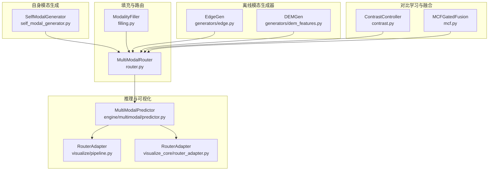
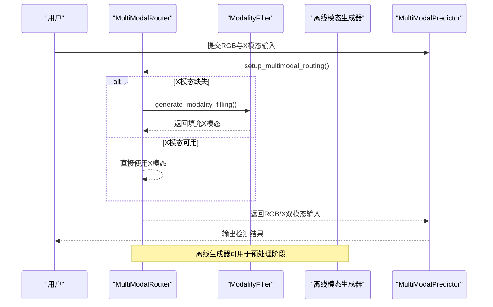
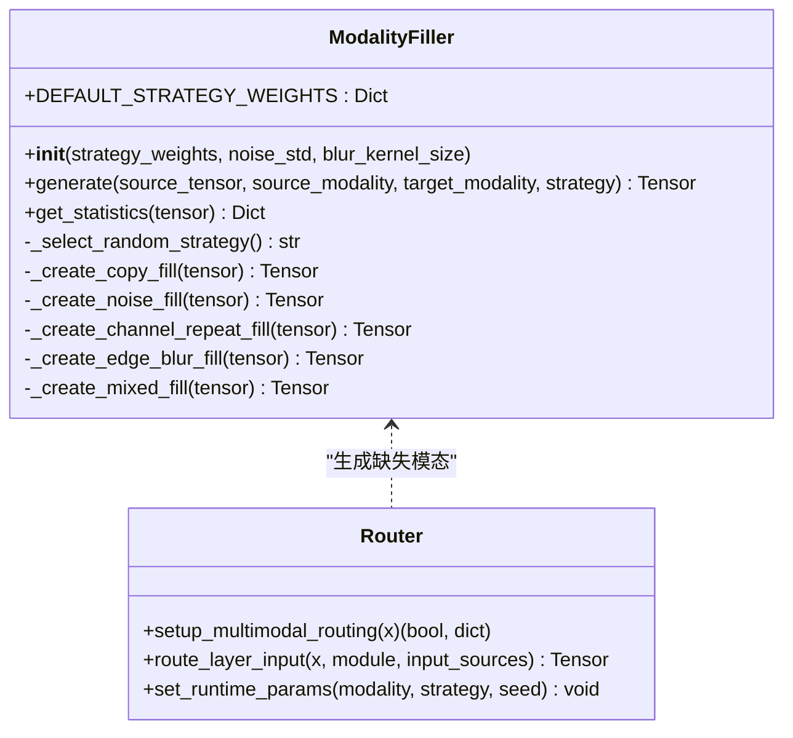
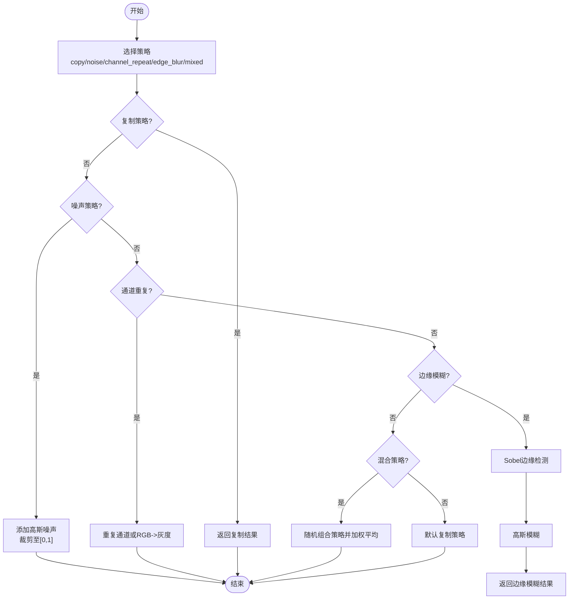
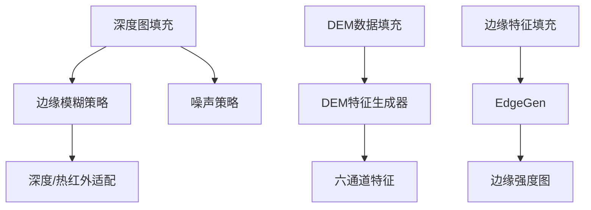
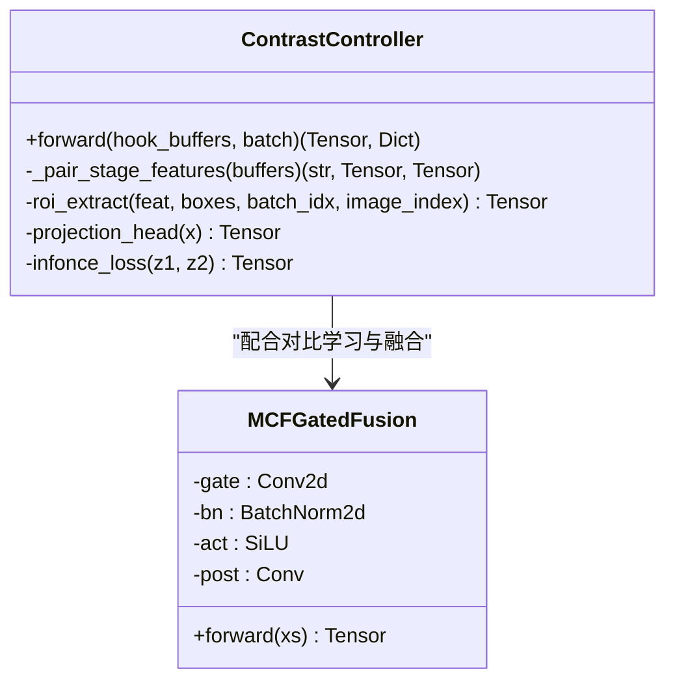
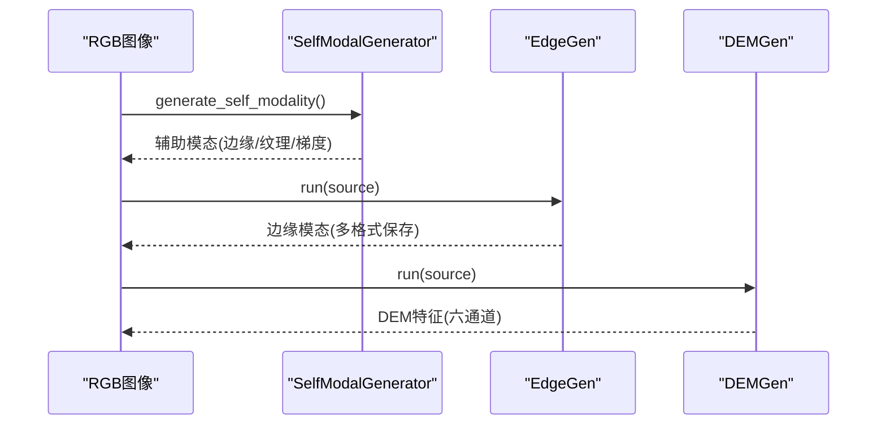
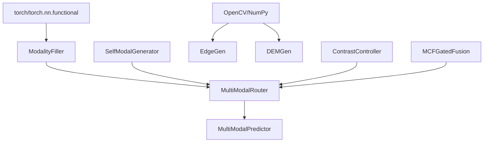

# 模态填充策略

<cite>
**本文档引用的文件**
- [ultralytics\nn\mm\filling.py](file://ultralytics\nn\mm\filling.py)
- [ultralytics\models\yolo\multimodal\modal_filling.py](file://ultralytics\models\yolo\multimodal\modal_filling.py)
- [ultralytics\nn\mm\router.py](file://ultralytics\nn\mm\router.py)
- [ultralytics\models\yolo\multimodal\self_modal_generator.py](file://ultralytics\models\yolo\multimodal\self_modal_generator.py)
- [ultralytics\nn\mm\generators\edge.py](file://ultralytics\nn\mm\generators\edge.py)
- [ultralytics\nn\mm\generators\dem_features.py](file://ultralytics\nn\mm\generators\dem_features.py)
- [ultralytics\nn\mm\generators\__init__.py](file://ultralytics\nn\mm\generators\__init__.py)
- [ultralytics\nn\mm\contrast.py](file://ultralytics\nn\mm\contrast.py)
- [ultralytics\nn\mm\mcf.py](file://ultralytics\nn\mm\mcf.py)
- [ultralytics\engine\multimodal\predictor.py](file://ultralytics\engine\multimodal\predictor.py)
- [ultralytics\models\yolo\multimodal\visualize\pipeline.py](file://ultralytics\models\yolo\multimodal\visualize\pipeline.py)
- [ultralytics\models\utils\multimodal\visualize_core\router_adapter.py](file://ultralytics\models\utils\multimodal\visualize_core\router_adapter.py)
- [depthGen.py](file://depthGen.py)
</cite>

## 目录
1. [简介](#简介)
2. [项目结构](#项目结构)
3. [核心组件](#核心组件)
4. [架构概览](#架构概览)
5. [详细组件分析](#详细组件分析)
6. [依赖关系分析](#依赖关系分析)
7. [性能考虑](#性能考虑)
8. [故障排除指南](#故障排除指南)
9. [结论](#结论)
10. [附录](#附录)

## 简介
本文件系统性阐述多模态检测中的模态填充策略，重点围绕以下方面展开：
- ModalityFiller 的设计原理与实现机制：涵盖零填充策略、插值填充方法与自动生成策略
- 针对不同模态的填充算法特点：深度图填充、DEM 数据填充与边缘特征填充
- 模态对比度控制与自适应调节机制
- 具体的代码示例与配置指南，帮助读者在实际项目中选择与优化模态填充策略，以提升多模态检测的鲁棒性

## 项目结构
该项目围绕多模态检测构建了完整的流水线，模态填充策略主要分布在以下模块：
- 填充与路由：`ultralytics\nn\mm\filling.py`、`ultralytics\nn\mm\router.py`
- 自身模态生成：`ultralytics\models\yolo\multimodal\self_modal_generator.py`
- 离线模态生成器：`ultralytics\nn\mm\generators\edge.py`、`ultralytics\nn\mm\generators\dem_features.py`
- 对比学习与融合：`ultralytics\nn\mm\contrast.py`、`ultralytics\nn\mm\mcf.py`
- 推理引擎与可视化：`ultralytics\engine\multimodal\predictor.py`、`ultralytics\models\yolo\multimodal\visualize\pipeline.py`、`ultralytics\models\utils\multimodal\visualize_core\router_adapter.py`

**图表来源**
- [ultralytics\nn\mm\filling.py:14-175](file://ultralytics\nn\mm\filling.py#L14-L175)
- [ultralytics\nn\mm\router.py:11-471](file://ultralytics\nn\mm\router.py#L11-L471)
- [ultralytics\models\yolo\multimodal\self_modal_generator.py:10-505](file://ultralytics\models\yolo\multimodal\self_modal_generator.py#L10-L505)
- [ultralytics\nn\mm\generators\edge.py:190-506](file://ultralytics\nn\mm\generators\edge.py#L190-L506)
- [ultralytics\nn\mm\generators\dem_features.py:111-470](file://ultralytics\nn\mm\generators\dem_features.py#L111-L470)
- [ultralytics\nn\mm\contrast.py:149-290](file://ultralytics\nn\mm\contrast.py#L149-L290)
- [ultralytics\nn\mm\mcf.py:19-99](file://ultralytics\nn\mm\mcf.py#L19-L99)
- [ultralytics\engine\multimodal\predictor.py:16-494](file://ultralytics\engine\multimodal\predictor.py#L16-L494)
- [ultralytics\models\yolo\multimodal\visualize\pipeline.py:35-73](file://ultralytics\models\yolo\multimodal\visualize\pipeline.py#L35-L73)
- [ultralytics\models\utils\multimodal\visualize_core\router_adapter.py:45-79](file://ultralytics\models\utils\multimodal\visualize_core\router_adapter.py#L45-L79)

**章节来源**
- [ultralytics\nn\mm\filling.py:1-175](file://ultralytics\nn\mm\filling.py#L1-L175)
- [ultralytics\nn\mm\router.py:1-471](file://ultralytics\nn\mm\router.py#L1-L471)

## 核心组件
本节聚焦模态填充策略的核心组件及其职责：
- ModalityFiller：提供多种填充策略（复制、噪声、通道重复、边缘模糊、混合），支持权重配置与统计输出
- MultiModalRouter：在运行时根据模态需求生成缺失模态，负责通道适配与输入路由
- SelfModalGenerator：从RGB图像生成边缘、纹理、梯度等辅助模态
- 离线模态生成器：EdgeGen、DEMGen 提供深度图、DEM 特征等离线生成能力
- 对比学习与融合：ContrastController 与 MCFGatedFusion 支持模态对比度控制与门控融合

**章节来源**
- [ultralytics\nn\mm\filling.py:14-175](file://ultralytics\nn\mm\filling.py#L14-L175)
- [ultralytics\nn\mm\router.py:11-471](file://ultralytics\nn\mm\router.py#L11-L471)
- [ultralytics\models\yolo\multimodal\self_modal_generator.py:10-505](file://ultralytics\models\yolo\multimodal\self_modal_generator.py#L10-L505)
- [ultralytics\nn\mm\generators\edge.py:190-506](file://ultralytics\nn\mm\generators\edge.py#L190-L506)
- [ultralytics\nn\mm\generators\dem_features.py:111-470](file://ultralytics\nn\mm\generators\dem_features.py#L111-L470)
- [ultralytics\nn\mm\contrast.py:149-290](file://ultralytics\nn\mm\contrast.py#L149-L290)
- [ultralytics\nn\mm\mcf.py:19-99](file://ultralytics\nn\mm\mcf.py#L19-L99)

## 架构概览
模态填充策略贯穿数据准备、推理与后处理阶段，形成如下端到端流程：

**图表来源**
- [ultralytics\engine\multimodal\predictor.py:150-244](file://ultralytics\engine\multimodal\predictor.py#L150-L244)
- [ultralytics\nn\mm\router.py:157-240](file://ultralytics\nn\mm\router.py#L157-L240)
- [ultralytics\nn\mm\filling.py:35-148](file://ultralytics\nn\mm\filling.py#L35-L148)

## 详细组件分析

### ModalityFiller 设计与实现
ModalityFiller 提供轻量、快速且可确定性的填充策略，适用于实时推理与训练场景。其核心特性包括：
- 策略权重配置：支持 copy、noise、channel_repeat、edge_blur、mixed 等策略的权重分配
- 随机策略选择：基于权重随机选择策略，保证多样性
- 统计输出：提供均值、标准差、最大/最小值与形状等统计信息
- 通道适配：通过 adapt_xch 实现 RGB 与单通道之间的互转

**图表来源**
- [ultralytics\nn\mm\filling.py:14-175](file://ultralytics\nn\mm\filling.py#L14-L175)
- [ultralytics\nn\mm\router.py:157-317](file://ultralytics\nn\mm\router.py#L157-L317)

**章节来源**
- [ultralytics\nn\mm\filling.py:14-175](file://ultralytics\nn\mm\filling.py#L14-L175)

### 填充策略详解
- 零填充策略（copy）：直接复制源模态，保持语义一致性，适合通道数与目标一致的情况
- 插值填充方法（noise）：在源模态基础上添加高斯噪声，有助于提升模型对噪声的鲁棒性
- 通道重复（channel_repeat）：将单通道重复到多通道，或将RGB转为灰度后再重复，确保通道数匹配
- 边缘特征填充（edge_blur）：通过Sobel边缘检测与高斯模糊生成边缘特征，适配深度图、热红外等模态
- 自动生成策略（mixed）：随机组合多种策略并加权平均，提升泛化能力

**图表来源**
- [ultralytics\nn\mm\filling.py:61-118](file://ultralytics\nn\mm\filling.py#L61-L118)

**章节来源**
- [ultralytics\nn\mm\filling.py:61-118](file://ultralytics\nn\mm\filling.py#L61-L118)

### 不同模态填充算法特点
- 深度图填充：利用边缘特征填充（edge_blur）与噪声（noise）相结合，既能保留边缘信息，又能引入适度噪声
- DEM 数据填充：通过离线生成器（DEMGen）提取高程、坡度、坡向、曲率、粗糙度与局部高度差等特征，形成稳定的六通道特征
- 边缘特征填充：EdgeGen 提供高斯平滑、Sobel/Scharr 梯度、伽马校正与二值化等选项，适配不同场景的边缘需求

**图表来源**
- [ultralytics\nn\mm\filling.py:84-97](file://ultralytics\nn\mm\filling.py#L84-L97)
- [ultralytics\nn\mm\generators\dem_features.py:111-210](file://ultralytics\nn\mm\generators\dem_features.py#L111-L210)
- [ultralytics\nn\mm\generators\edge.py:86-187](file://ultralytics\nn\mm\generators\edge.py#L86-L187)

**章节来源**
- [ultralytics\nn\mm\generators\dem_features.py:111-210](file://ultralytics\nn\mm\generators\dem_features.py#L111-L210)
- [ultralytics\nn\mm\generators\edge.py:86-187](file://ultralytics\nn\mm\generators\edge.py#L86-L187)

### 模态对比度控制与自适应调节
- 对比学习（ContrastController）：通过ROI提取与投影头计算，实现RGB与X模态间的对比学习，支持对称InfoNCE损失与阶段选择
- 门控融合（MCFGatedFusion）：以主模态为主，副模态经零初始化卷积门后与主模态相加或拼接，支持通道压缩与激活
- 自适应调节：通过 adapt_xch 在RGB与单通道之间转换，确保通道数匹配；通过策略权重与算法参数实现自适应调节

**图表来源**
- [ultralytics\nn\mm\contrast.py:149-290](file://ultralytics\nn\mm\contrast.py#L149-L290)
- [ultralytics\nn\mm\mcf.py:19-99](file://ultralytics\nn\mm\mcf.py#L19-L99)

**章节来源**
- [ultralytics\nn\mm\contrast.py:149-290](file://ultralytics\nn\mm\contrast.py#L149-L290)
- [ultralytics\nn\mm\mcf.py:19-99](file://ultralytics\nn\mm\mcf.py#L19-L99)

### 自身模态生成与离线生成
- SelfModalGenerator：从RGB图像生成边缘、纹理、梯度等辅助模态，支持缓存与多种算法参数
- EdgeGen/DEMGen：提供统一的离线生成接口，支持多种保存格式与通道适配

**图表来源**
- [ultralytics\models\yolo\multimodal\self_modal_generator.py:60-103](file://ultralytics\models\yolo\multimodal\self_modal_generator.py#L60-L103)
- [ultralytics\nn\mm\generators\edge.py:376-423](file://ultralytics\nn\mm\generators\edge.py#L376-L423)
- [ultralytics\nn\mm\generators\dem_features.py:378-423](file://ultralytics\nn\mm\generators\dem_features.py#L378-L423)

**章节来源**
- [ultralytics\models\yolo\multimodal\self_modal_generator.py:60-103](file://ultralytics\models\yolo\multimodal\self_modal_generator.py#L60-L103)
- [ultralytics\nn\mm\generators\edge.py:376-423](file://ultralytics\nn\mm\generators\edge.py#L376-L423)
- [ultralytics\nn\mm\generators\dem_features.py:378-423](file://ultralytics\nn\mm\generators\dem_features.py#L378-L423)

## 依赖关系分析
- ModalityFiller 依赖 torch 与 torch.nn.functional 进行张量运算与卷积操作
- MultiModalRouter 依赖 ModalityFiller 与 adapt_xch 完成填充与通道适配
- SelfModalGenerator 依赖 torch 与 torch.nn.functional 进行卷积与梯度计算
- 离线生成器依赖 OpenCV、NumPy 与 PyTorch 进行图像处理与特征提取
- 对比学习与融合模块依赖钩子缓冲区与投影头进行特征对齐

**图表来源**
- [ultralytics\nn\mm\filling.py:10-11](file://ultralytics\nn\mm\filling.py#L10-L11)
- [ultralytics\nn\mm\router.py:8](file://ultralytics\nn\mm\router.py#L8)
- [ultralytics\models\yolo\multimodal\self_modal_generator.py:3-6](file://ultralytics\models\yolo\multimodal\self_modal_generator.py#L3-L6)
- [ultralytics\nn\mm\generators\edge.py:22-27](file://ultralytics\nn\mm\generators\edge.py#L22-L27)
- [ultralytics\nn\mm\generators\dem_features.py:26-31](file://ultralytics\nn\mm\generators\dem_features.py#L26-L31)
- [ultralytics\nn\mm\contrast.py:21-24](file://ultralytics\nn\mm\contrast.py#L21-L24)
- [ultralytics\nn\mm\mcf.py:13-16](file://ultralytics\nn\mm\mcf.py#L13-L16)

**章节来源**
- [ultralytics\nn\mm\filling.py:10-11](file://ultralytics\nn\mm\filling.py#L10-L11)
- [ultralytics\nn\mm\router.py:8](file://ultralytics\nn\mm\router.py#L8)
- [ultralytics\models\yolo\multimodal\self_modal_generator.py:3-6](file://ultralytics\models\yolo\multimodal\self_modal_generator.py#L3-L6)
- [ultralytics\nn\mm\generators\edge.py:22-27](file://ultralytics\nn\mm\generators\edge.py#L22-L27)
- [ultralytics\nn\mm\generators\dem_features.py:26-31](file://ultralytics\nn\mm\generators\dem_features.py#L26-L31)
- [ultralytics\nn\mm\contrast.py:21-24](file://ultralytics\nn\mm\contrast.py#L21-L24)
- [ultralytics\nn\mm\mcf.py:13-16](file://ultralytics\nn\mm\mcf.py#L13-L16)

## 性能考虑
- 策略选择：在实时推理中优先使用 copy、channel_repeat 等轻量策略；在训练阶段可引入 noise 与 mixed 提升鲁棒性
- 通道适配：通过 adapt_xch 在RGB与单通道间快速转换，避免额外的模型修改
- 缓存机制：SelfModalGenerator 支持缓存，减少重复计算
- 离线生成：EdgeGen/DEMGen 支持批量处理与多格式保存，便于预处理与离线数据增强

## 故障排除指南
- 策略权重总和不为1：ModalityFiller 在初始化时会警告权重总和异常
- 非有限特征：ContrastController 在提取ROI与投影时会记录非有限特征的统计信息
- 模型类型检测：MultiModalPredictor 会尝试检测RTDETR与YOLO模型类型，避免错误的后处理路径
- 可视化适配：RouterAdapter 支持设置运行时参数，若失败会记录警告

**章节来源**
- [ultralytics\models\yolo\multimodal\modal_filling.py:43-46](file://ultralytics\models\yolo\multimodal\modal_filling.py#L43-L46)
- [ultralytics\nn\mm\contrast.py:194-208](file://ultralytics\nn\mm\contrast.py#L194-L208)
- [ultralytics\engine\multimodal\predictor.py:279-321](file://ultralytics\engine\multimodal\predictor.py#L279-L321)
- [ultralytics\models\yolo\multimodal\visualize\pipeline.py:64-73](file://ultralytics\models\yolo\multimodal\visualize\pipeline.py#L64-L73)

## 结论
模态填充策略在多模态检测中扮演关键角色，既能在推理阶段填补缺失模态，又可通过离线生成与对比学习提升模型鲁棒性。通过合理配置策略权重、选择合适的填充算法与通道适配方案，可以显著提升多模态检测在复杂场景下的稳定性与准确性。

## 附录

### 代码示例与配置指南
- 使用 ModalityFiller 生成缺失模态
  - 示例路径：[ultralytics\nn\mm\filling.py:141-148](file://ultralytics\nn\mm\filling.py#L141-L148)
- 在 MultiModalRouter 中设置运行时参数
  - 示例路径：[ultralytics\nn\mm\router.py:64-68](file://ultralytics\nn\mm\router.py#L64-L68)
- 生成自身模态（边缘/纹理/梯度）
  - 示例路径：[ultralytics\models\yolo\multimodal\self_modal_generator.py:60-103](file://ultralytics\models\yolo\multimodal\self_modal_generator.py#L60-L103)
- 离线生成边缘模态
  - 示例路径：[ultralytics\nn\mm\generators\edge.py:376-423](file://ultralytics\nn\mm\generators\edge.py#L376-L423)
- 离线生成DEM特征
  - 示例路径：[ultralytics\nn\mm\generators\dem_features.py:378-423](file://ultralytics\nn\mm\generators\dem_features.py#L378-L423)
- 使用深度生成器
  - 示例路径：[depthGen.py:1-24](file://depthGen.py#L1-L24)