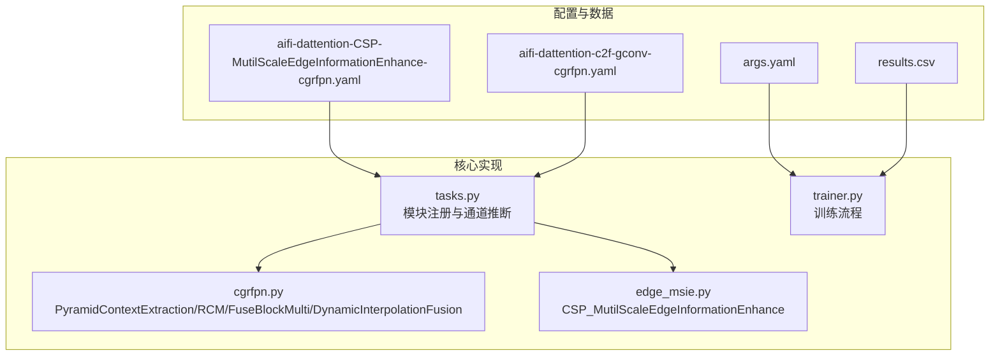
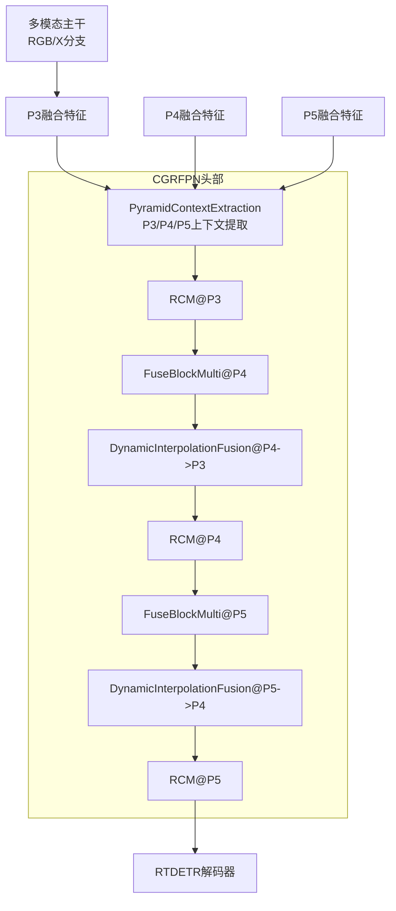
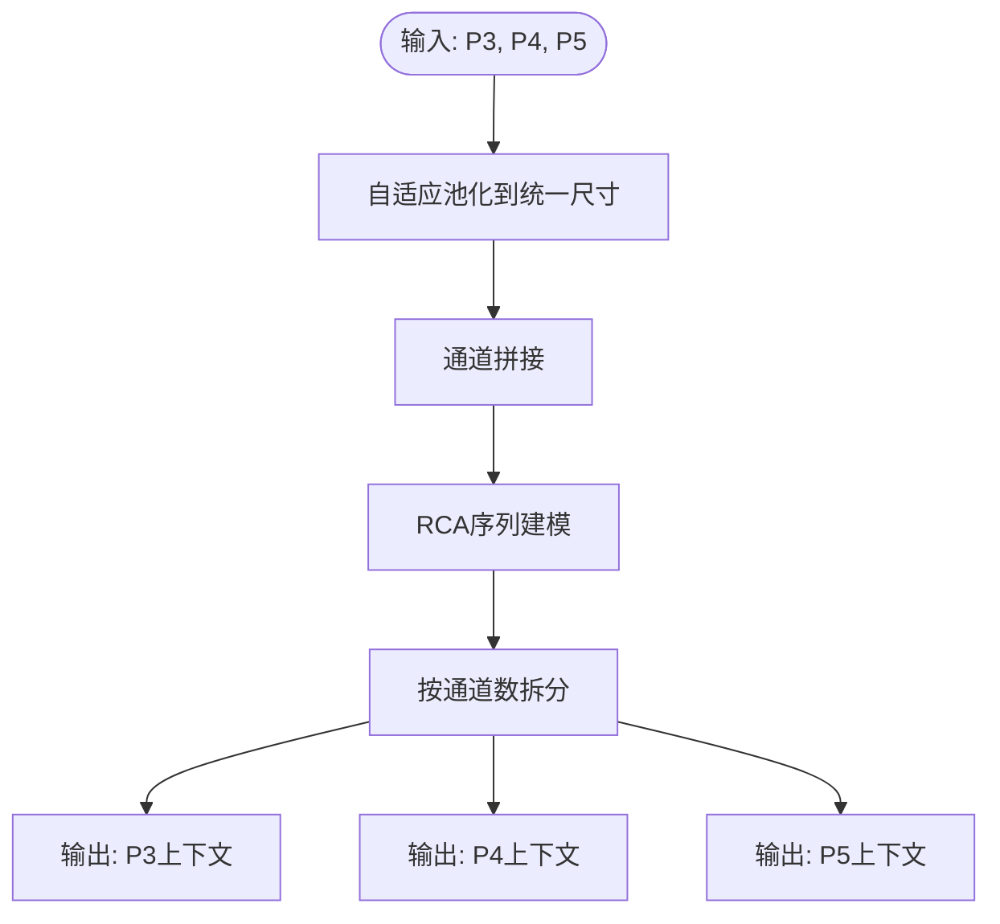
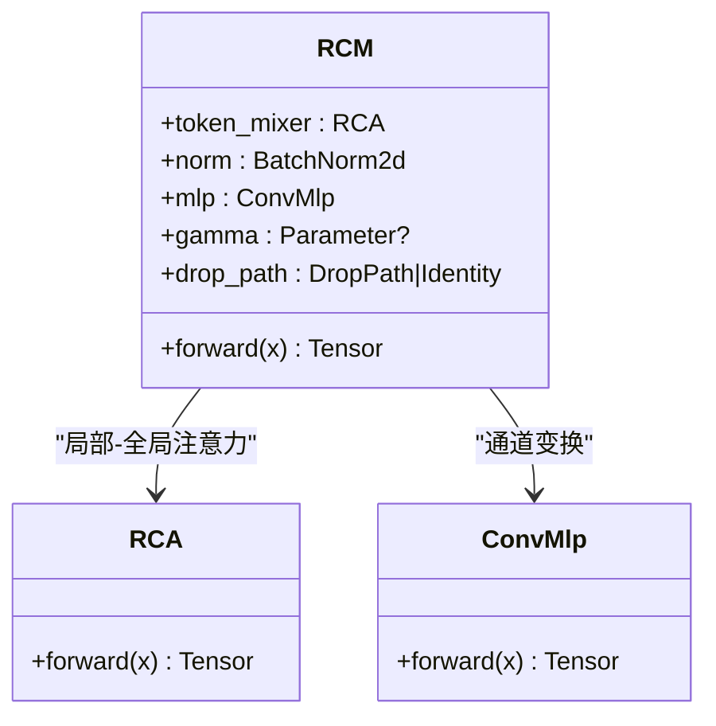
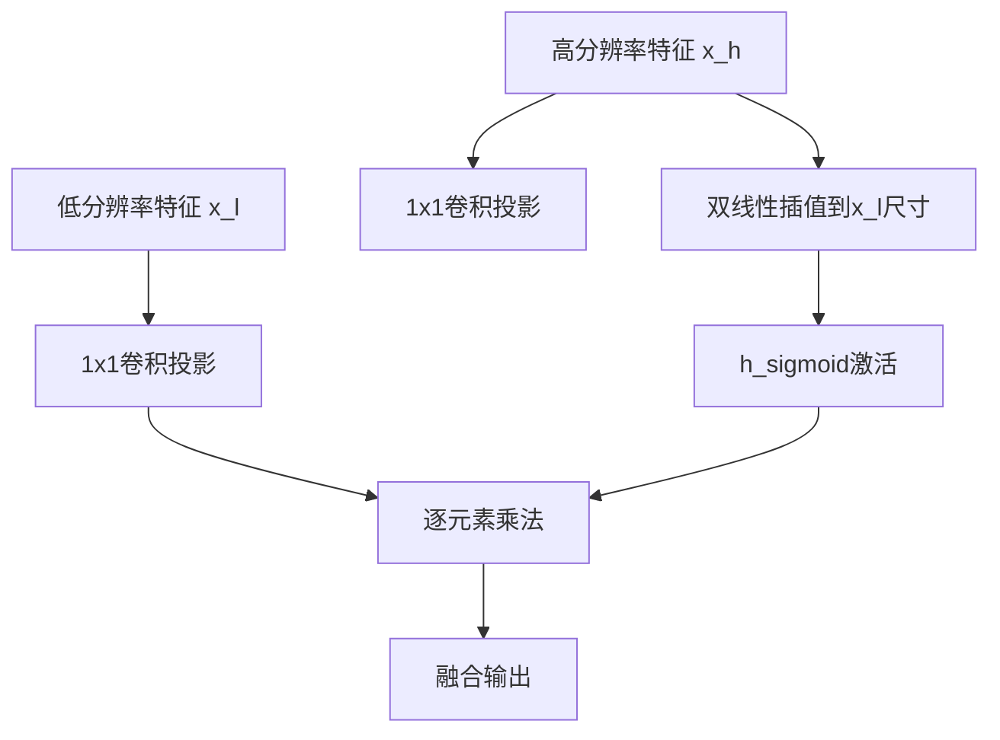
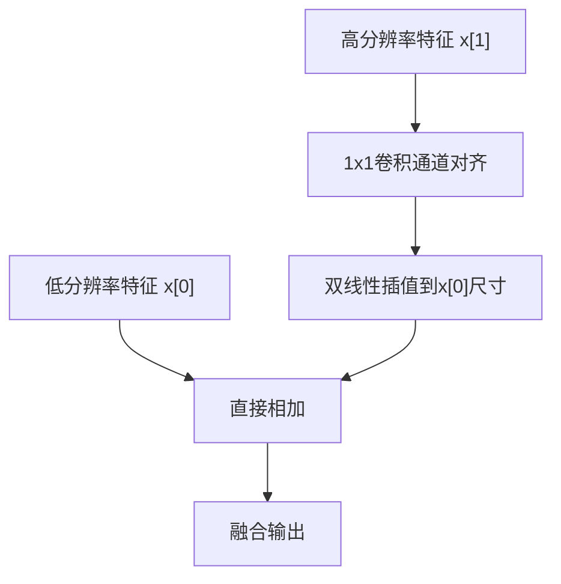
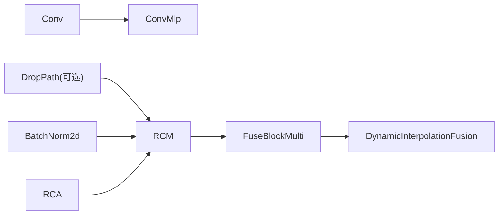

# CGRFPN网络

<cite>
**本文档引用的文件**
- [ultralytics\nn\Neck\cgrfpn.py](file://ultralytics\nn\Neck\cgrfpn.py)
- [ultralytics\cfg\models\rtmm\r18\aifi-dattention-CSP-MutilScaleEdgeInformationEnhance-cgrfpn.yaml](file://ultralytics\cfg\models\rtmm\r18\aifi-dattention-CSP-MutilScaleEdgeInformationEnhance-cgrfpn.yaml)
- [ultralytics\cfg\models\rtmm\r18\aifi-dattention-c2f-gconv-cgrfpn.yaml](file://ultralytics\cfg\models\rtmm\r18\aifi-dattention-c2f-gconv-cgrfpn.yaml)
- [ultralytics\nn\public\edge_msie.py](file://ultralytics\nn\public\edge_msie.py)
- [ResTest\aifi-dattention-CSP-MutilScaleEdgeInformationEnhance-cgrfpn\args.yaml](file://ResTest\aifi-dattention-CSP-MutilScaleEdgeInformationEnhance-cgrfpn\args.yaml)
- [ResTest\aifi-dattention-CSP-MutilScaleEdgeInformationEnhance-cgrfpn\results.csv](file://ResTest\aifi-dattention-CSP-MutilScaleEdgeInformationEnhance-cgrfpn\results.csv)
- [ultralytics\nn\tasks.py](file://ultralytics\nn\tasks.py)
- [ultralytics\engine\trainer.py](file://ultralytics\engine\trainer.py)
</cite>

## 目录
1. [简介](#简介)
2. [项目结构](#项目结构)
3. [核心组件](#核心组件)
4. [架构总览](#架构总览)
5. [详细组件分析](#详细组件分析)
6. [依赖关系分析](#依赖关系分析)
7. [性能考量](#性能考量)
8. [故障排除指南](#故障排除指南)
9. [结论](#结论)
10. [附录](#附录)

## 简介
本文件系统性阐述CGRFPN（Cascaded Pyramid Context Refinement Feature Pyramid Network，级联金字塔上下文精炼特征金字塔网络）的设计理念与实现细节。CGRFPN通过“级联金字塔上下文精炼”机制，在多尺度特征金字塔（P3/P4/P5）上逐层注入全局上下文信息，并结合动态插值融合与多路注意力精炼模块，实现更鲁棒、更高精度的目标检测性能。本文重点解析以下关键组件：PyramidContextExtraction（金字塔上下文提取）、GetIndexOutput（索引输出）、RCM（矩形自校准模块）、FuseBlockMulti（多路融合块）以及DynamicInterpolationFusion（动态插值融合），并提供配置示例、使用场景与性能优势说明。

## 项目结构
该仓库包含多套多模态目标检测实验配置与结果，其中与CGRFPN直接相关的关键文件如下：
- 核心实现：ultralytics\nn\Neck\cgrfpn.py
- 模型配置（多模态RT-DETR主干+DAttention+CSP多尺度边缘增强+CGRFPN）：ultralytics\cfg\models\rtmm\r18\aifi-dattention-CSP-MutilScaleEdgeInformationEnhance-cgrfpn.yaml
- 另一套配置（C2f_gConv+CGRFPN）：ultralytics\cfg\models\rtmm\r18\aifi-dattention-c2f-gconv-cgrfpn.yaml
- 多尺度边缘增强模块（为CSP_MutilScaleEdgeInformationEnhance提供基础能力）：ultralytics\nn\public\edge_msie.py
- 训练参数示例：ResTest\aifi-dattention-CSP-MutilScaleEdgeInformationEnhance-cgrfpn\args.yaml
- 训练日志示例：ResTest\aifi-dattention-CSP-MutilScaleEdgeInformationEnhance-cgrfpn\results.csv
- 模型构建与模块注册：ultralytics\nn\tasks.py
- 训练器基类：ultralytics\engine\trainer.py

**图表来源**
- [ultralytics\cfg\models\rtmm\r18\aifi-dattention-CSP-MutilScaleEdgeInformationEnhance-cgrfpn.yaml:1-62](file://ultralytics\cfg\models\rtmm\r18\aifi-dattention-CSP-MutilScaleEdgeInformationEnhance-cgrfpn.yaml#L1-L62)
- [ultralytics\cfg\models\rtmm\r18\aifi-dattention-c2f-gconv-cgrfpn.yaml:1-71](file://ultralytics\cfg\models\rtmm\r18\aifi-dattention-c2f-gconv-cgrfpn.yaml#L1-L71)
- [ultralytics\nn\Neck\cgrfpn.py:1-189](file://ultralytics\nn\Neck\cgrfpn.py#L1-L189)
- [ultralytics\nn\public\edge_msie.py:1-76](file://ultralytics\nn\public\edge_msie.py#L1-L76)
- [ultralytics\nn\tasks.py:3529-3561](file://ultralytics\nn\tasks.py#L3529-L3561)
- [ultralytics\engine\trainer.py:1-200](file://ultralytics\engine\trainer.py#L1-L200)

**章节来源**
- [ultralytics\cfg\models\rtmm\r18\aifi-dattention-CSP-MutilScaleEdgeInformationEnhance-cgrfpn.yaml:1-62](file://ultralytics\cfg\models\rtmm\r18\aifi-dattention-CSP-MutilScaleEdgeInformationEnhance-cgrfpn.yaml#L1-L62)
- [ultralytics\cfg\models\rtmm\r18\aifi-dattention-c2f-gconv-cgrfpn.yaml:1-71](file://ultralytics\cfg\models\rtmm\r18\aifi-dattention-c2f-gconv-cgrfpn.yaml#L1-L71)
- [ultralytics\nn\Neck\cgrfpn.py:1-189](file://ultralytics\nn\Neck\cgrfpn.py#L1-L189)
- [ultralytics\nn\public\edge_msie.py:1-76](file://ultralytics\nn\public\edge_msie.py#L1-L76)
- [ultralytics\nn\tasks.py:3529-3561](file://ultralytics\nn\tasks.py#L3529-L3561)
- [ultralytics\engine\trainer.py:1-200](file://ultralytics\engine\trainer.py#L1-L200)

## 核心组件
- PyramidContextExtraction（金字塔上下文提取）
  - 功能：对来自不同层级（如P3/P4/P5）的特征进行自适应池化聚合与通道分割，生成可被后续模块处理的多分支上下文张量。
  - 实现要点：使用自适应平均池化在空间维度上统一到同一尺寸，随后通过序列化的RCA模块进行上下文建模，最后按预设通道数拆分为多个分支。
- GetIndexOutput（索引输出）
  - 功能：从列表或元组形式的多分支输出中按索引取出特定分支（如P3、P4、P5）。
- RCM（矩形自校准模块）
  - 功能：基于矩形卷积与通道注意力的上下文建模单元，先通过RCA进行局部-全局注意力调制，再经BN与MLP进行特征变换，支持残差连接与DropPath。
- FuseBlockMulti（多路融合块）
  - 功能：将低分辨率高响应特征与高分辨率低响应特征进行加权融合，采用双卷积与插值sigmoid门控实现跨尺度信息互补。
- DynamicInterpolationFusion（动态插值融合）
  - 功能：将高分辨率特征动态映射到低分辨率特征的空间尺寸后相加，保持语义一致性的同时提升鲁棒性。

**章节来源**
- [ultralytics\nn\Neck\cgrfpn.py:27-189](file://ultralytics\nn\Neck\cgrfpn.py#L27-L189)

## 架构总览
CGRFPN在RT-DETR多模态主干之后，利用Transformer编码器生成Y5特征，随后通过金字塔上下文提取得到P3/P4/P5三个尺度的上下文特征。每个尺度分别经过RCM进行上下文精炼，然后与对应层级的高层特征进行多路融合（FuseBlockMulti），并通过动态插值融合（DynamicInterpolationFusion）将高分辨率信息回注到低分辨率特征中，最终进入RTDETR解码器进行检测。

**图表来源**
- [ultralytics\cfg\models\rtmm\r18\aifi-dattention-CSP-MutilScaleEdgeInformationEnhance-cgrfpn.yaml:32-61](file://ultralytics\cfg\models\rtmm\r18\aifi-dattention-CSP-MutilScaleEdgeInformationEnhance-cgrfpn.yaml#L32-L61)
- [ultralytics\nn\Neck\cgrfpn.py:141-189](file://ultralytics\nn\Neck\cgrfpn.py#L141-L189)

**章节来源**
- [ultralytics\cfg\models\rtmm\r18\aifi-dattention-CSP-MutilScaleEdgeInformationEnhance-cgrfpn.yaml:32-61](file://ultralytics\cfg\models\rtmm\r18\aifi-dattention-CSP-MutilScaleEdgeInformationEnhance-cgrfpn.yaml#L32-L61)
- [ultralytics\nn\Neck\cgrfpn.py:141-189](file://ultralytics\nn\Neck\cgrfpn.py#L141-L189)

## 详细组件分析

### PyramidContextExtraction（金字塔上下文提取）
- 设计思想：在多尺度输入上进行自适应池化以消除空间差异，统一到同一空间分辨率后进行通道级上下文建模，再按通道数拆分，便于后续逐层精炼。
- 关键实现：
  - 自适应池化聚合：PyramidPoolAgg_PCE将各尺度特征池化到一致尺寸并拼接。
  - 上下文建模：RCA序列对拼接后的特征进行注意力调制。
  - 分支输出：torch.split按预设通道数拆分为P3/P4/P5分支。
- 复杂度分析：池化与拼接操作近似O(NHW·ΣC)，RCA序列复杂度取决于层数与通道数；整体为线性于参数量与输入面积的复杂度。

**图表来源**
- [ultralytics\nn\Neck\cgrfpn.py:27-154](file://ultralytics\nn\Neck\cgrfpn.py#L27-L154)

**章节来源**
- [ultralytics\nn\Neck\cgrfpn.py:27-154](file://ultralytics\nn\Neck\cgrfpn.py#L27-L154)

### GetIndexOutput（索引输出）
- 作用：从多分支输出中按索引选择特定分支，用于后续模块的输入路由。
- 使用场景：配合PyramidContextExtraction的输出，分别获取P3、P4、P5分支。

**章节来源**
- [ultralytics\nn\Neck\cgrfpn.py:156-163](file://ultralytics\nn\Neck\cgrfpn.py#L156-L163)
- [ultralytics\nn\tasks.py:3535-3538](file://ultralytics\nn\tasks.py#L3535-L3538)

### RCM（矩形自校准模块）
- 设计思想：结合矩形卷积与通道注意力，对特征进行局部-全局联合建模；通过BN与MLP进行非线性变换；支持残差与DropPath以稳定训练。
- 关键实现：
  - RCA：对输入进行局部位置建模与池化注意力融合，输出加权后的特征。
  - Norm：BN归一化。
  - MLP：1x1卷积实现通道变换与激活。
  - 残差与DropPath：可选的残差连接与路径丢弃。
- 复杂度：RCA与MLP均为线性于通道数的卷积操作，整体近似O(C^2·H·W)或更低，具体取决于实现细节。

**图表来源**
- [ultralytics\nn\Neck\cgrfpn.py:81-139](file://ultralytics\nn\Neck\cgrfpn.py#L81-L139)

**章节来源**
- [ultralytics\nn\Neck\cgrfpn.py:81-139](file://ultralytics\nn\Neck\cgrfpn.py#L81-L139)

### FuseBlockMulti（多路融合块）
- 设计思想：将低分辨率高响应特征与高分辨率低响应特征进行门控融合，通过插值sigmoid门控抑制高频噪声，保留强语义信息。
- 关键实现：
  - 两个1x1卷积分别对低/高分辨率特征进行投影。
  - 对高分辨率特征进行插值到低分辨率尺寸。
  - sigmoid门控与逐元素乘法实现加权融合。
- 复杂度：主要由插值与卷积构成，近似O(H·W·C)。

**图表来源**
- [ultralytics\nn\Neck\cgrfpn.py:165-179](file://ultralytics\nn\Neck\cgrfpn.py#L165-L179)

**章节来源**
- [ultralytics\nn\Neck\cgrfpn.py:165-179](file://ultralytics\nn\Neck\cgrfpn.py#L165-L179)

### DynamicInterpolationFusion（动态插值融合）
- 设计思想：将高分辨率特征动态映射到低分辨率特征的空间尺寸后相加，保持语义一致性，减少上采样带来的模糊。
- 关键实现：
  - 1x1卷积将高分辨率特征通道对齐到低分辨率目标通道数。
  - 双线性插值将高分辨率特征上采样到低分辨率尺寸。
  - 逐元素相加实现融合。
- 复杂度：插值与卷积近似O(H·W·C)。

**图表来源**
- [ultralytics\nn\Neck\cgrfpn.py:181-189](file://ultralytics\nn\Neck\cgrfpn.py#L181-L189)

**章节来源**
- [ultralytics\nn\Neck\cgrfpn.py:181-189](file://ultralytics\nn\Neck\cgrfpn.py#L181-L189)

### CSP_MutilScaleEdgeInformationEnhance（多尺度边缘增强，背景模块）
- 虽非CGRFPN核心，但为P3/P4/P5阶段提供更强的边缘与多尺度上下文感知能力，与CGRFPN形成互补。
- 关键实现：多尺度池化分支+边缘增强子模块+最终拼接与卷积整合。

**章节来源**
- [ultralytics\nn\public\edge_msie.py:27-49](file://ultralytics\nn\public\edge_msie.py#L27-L49)

## 依赖关系分析
- 模块注册与通道推断：在模型构建时，CGRFPN相关模块通过任务构建器进行注册与通道推断，确保输入/输出通道匹配。
- 关键依赖：
  - ConvMlp依赖于Conv模块。
  - DropPath在timm不可用时退化为Identity。
  - RCM内部使用BN与可选的残差/DropPath。

**图表来源**
- [ultralytics\nn\Neck\cgrfpn.py:50-139](file://ultralytics\nn\Neck\cgrfpn.py#L50-L139)

**章节来源**
- [ultralytics\nn\Neck\cgrfpn.py:1-25](file://ultralytics\nn\Neck\cgrfpn.py#L1-L25)
- [ultralytics\nn\tasks.py:3529-3561](file://ultralytics\nn\tasks.py#L3529-L3561)

## 性能考量
- 计算效率：CGRFPN通过逐层上下文精炼与动态插值融合，避免全图大卷积，整体计算开销可控。
- 内存占用：多尺度融合与插值带来一定显存压力，可通过调整通道数与插值模式平衡性能与资源。
- 训练稳定性：RCM中的DropPath与残差连接有助于缓解梯度问题；建议结合EMA与学习率调度使用。
- 推理速度：融合模块均为轻量卷积与插值，适合实时部署；可结合量化/导出优化。

## 故障排除指南
- 输入通道不匹配
  - 症状：构建时报错提示期望列表/元组输入或通道不一致。
  - 处理：确认上游模块输出类型与通道数，确保GetIndexOutput与DynamicInterpolationFusion/FuseBlockMulti的输入格式正确。
- 插值尺寸不一致
  - 症状：插值或相加时报错。
  - 处理：确保高分辨率特征插值到低分辨率尺寸后再进行融合；检查通道对齐（1x1卷积）。
- 模块未注册
  - 症状：模型构建失败，找不到模块。
  - 处理：在任务构建器中添加相应模块注册逻辑，确保通道推断与参数传递正确。

**章节来源**
- [ultralytics\nn\tasks.py:3535-3561](file://ultralytics\nn\tasks.py#L3535-L3561)
- [ultralytics\nn\Neck\cgrfpn.py:165-189](file://ultralytics\nn\Neck\cgrfpn.py#L165-L189)

## 结论
CGRFPN通过“级联金字塔上下文精炼”机制，实现了多尺度特征的逐层上下文增强与跨尺度信息互补。PyramidContextExtraction负责全局上下文聚合，RCM进行局部-全局注意力建模，FuseBlockMulti与DynamicInterpolationFusion则保证了跨尺度信息的稳定融合。结合多尺度边缘增强模块，CGRFPN在精度与鲁棒性方面具有显著优势，适用于多模态目标检测场景。

## 附录

### 配置示例与使用场景
- 多模态RT-DETR主干+CSP多尺度边缘增强+CGRFPN
  - 配置文件路径：ultralytics\cfg\models\rtmm\r18\aifi-dattention-CSP-MutilScaleEdgeInformationEnhance-cgrfpn.yaml
  - 典型使用场景：RGB与X模态融合的多传感器目标检测，强调跨尺度上下文与边缘信息增强。
- C2f_gConv+CGRFPN
  - 配置文件路径：ultralytics\cfg\models\rtmm\r18\aifi-dattention-c2f-gconv-cgrfpn.yaml
  - 典型使用场景：追求更高效骨干与轻量化融合的部署环境。
- 训练参数示例
  - 参数文件路径：ResTest\aifi-dattention-CSP-MutilScaleEdgeInformationEnhance-cgrfpn\args.yaml
  - 训练日志示例：ResTest\aifi-dattention-CSP-MutilScaleEdgeInformationEnhance-cgrfpn\results.csv

**章节来源**
- [ultralytics\cfg\models\rtmm\r18\aifi-dattention-CSP-MutilScaleEdgeInformationEnhance-cgrfpn.yaml:1-62](file://ultralytics\cfg\models\rtmm\r18\aifi-dattention-CSP-MutilScaleEdgeInformationEnhance-cgrfpn.yaml#L1-L62)
- [ultralytics\cfg\models\rtmm\r18\aifi-dattention-c2f-gconv-cgrfpn.yaml:1-71](file://ultralytics\cfg\models\rtmm\r18\aifi-dattention-c2f-gconv-cgrfpn.yaml#L1-L71)
- [ResTest\aifi-dattention-CSP-MutilScaleEdgeInformationEnhance-cgrfpn\args.yaml:1-135](file://ResTest\aifi-dattention-CSP-MutilScaleEdgeInformationEnhance-cgrfpn\args.yaml#L1-L135)
- [ResTest\aifi-dattention-CSP-MutilScaleEdgeInformationEnhance-cgrfpn\results.csv:1-152](file://ResTest\aifi-dattention-CSP-MutilScaleEdgeInformationEnhance-cgrfpn\results.csv#L1-L152)