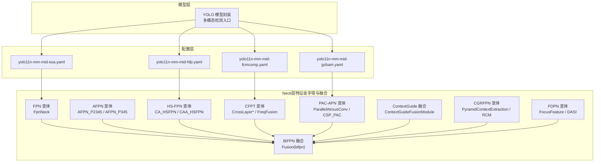
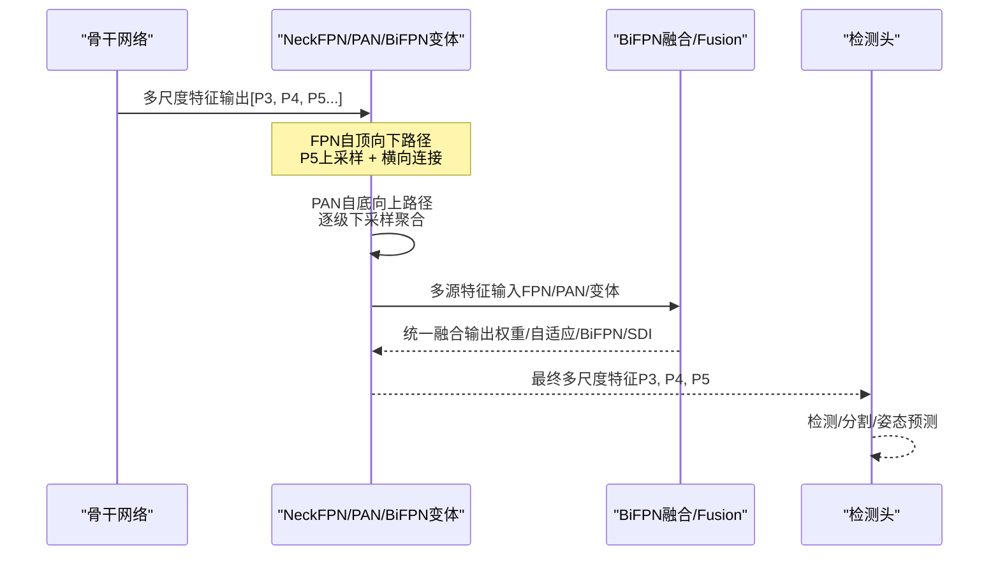
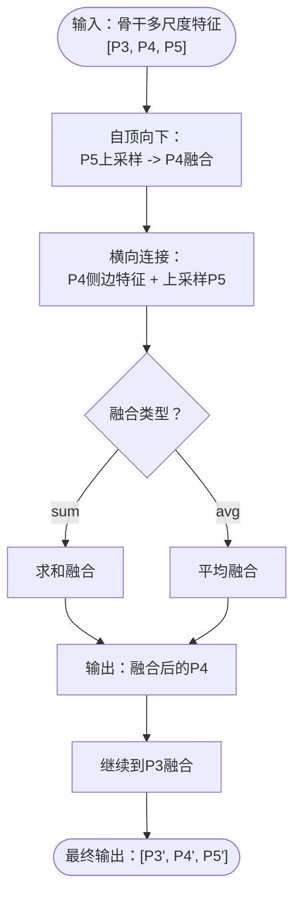
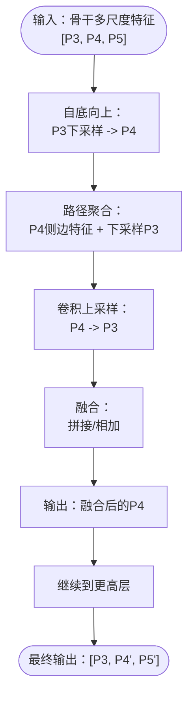
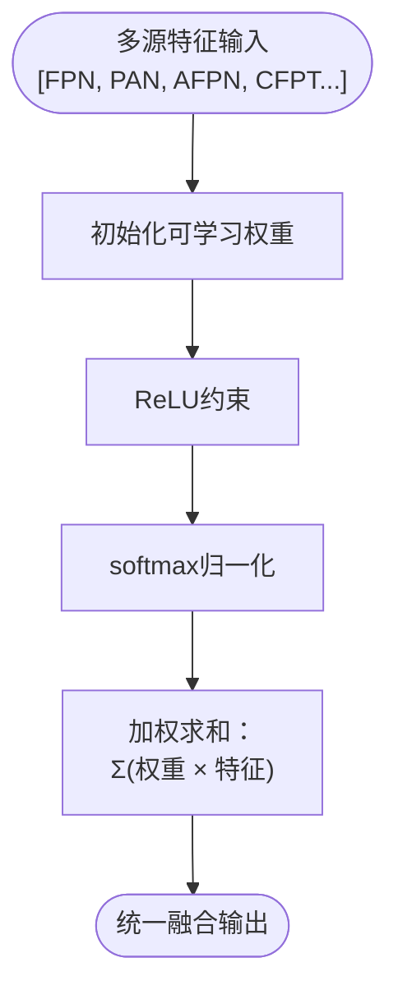
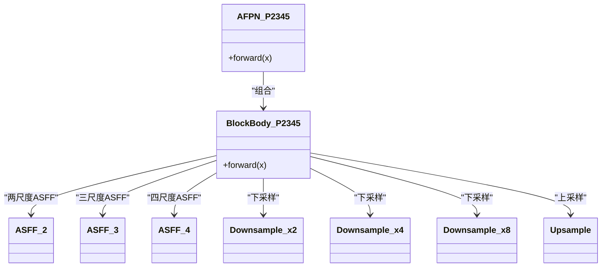
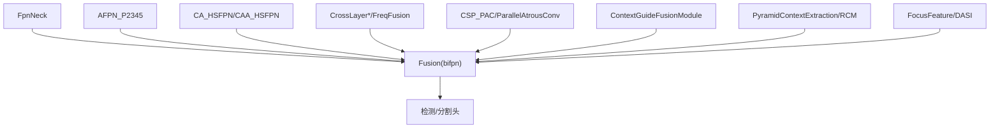

# FPN、PAN和BiFPN网络

<cite>
**本文档引用的文件**
- [ultralytics/nn/Neck/neck_variants.py](file://ultralytics/nn/Neck/neck_variants.py)
- [ultralytics/nn/Neck/pacapn.py](file://ultralytics/nn/Neck/pacapn.py)
- [ultralytics/nn/Neck/contextguide.py](file://ultralytics/nn/Neck/contextguide.py)
- [ultralytics/nn/Neck/cgrfpn.py](file://ultralytics/nn/Neck/cgrfpn.py)
- [ultralytics/nn/Neck/fdpn.py](file://ultralytics/nn/Neck/fdpn.py)
- [ultralytics/nn/Neck/fdpn_dasi.py](file://ultralytics/nn/Neck/fdpn_dasi.py)
- [ultralytics/models/yolo/model.py](file://ultralytics/models/yolo/model.py)
- [ultralytics/cfg/models/mm/change/yolo11n-mm-mid-ssa.yaml](file://ultralytics/cfg/models/mm/change/yolo11n-mm-mid-ssa.yaml)
- [ultralytics/cfg/models/mm/change/yolo11n-mm-mid-hfp.yaml](file://ultralytics/cfg/models/mm/change/yolo11n-mm-mid-hfp.yaml)
- [ultralytics/cfg/models/mm/change/yolo11n-mm-mid-fcmcomp.yaml](file://ultralytics/cfg/models/mm/change/yolo11n-mm-mid-fcmcomp.yaml)
- [ultralytics/cfg/models/mm/change/yolo11n-mm-mid-gcbam.yaml](file://ultralytics/cfg/models/mm/change/yolo11n-mm-mid-gcbam.yaml)
</cite>

## 目录
1. [简介](#简介)
2. [项目结构](#项目结构)
3. [核心组件](#核心组件)
4. [架构总览](#架构总览)
5. [详细组件分析](#详细组件分析)
6. [依赖关系分析](#依赖关系分析)
7. [性能考虑](#性能考虑)
8. [故障排除指南](#故障排除指南)
9. [结论](#结论)
10. [附录](#附录)

## 简介
本文件系统性梳理并解释多模态检测中的经典特征金字塔网络（FPN）、路径聚合网络（PAN）与双向特征金字塔网络（BiFPN）及其变体。内容涵盖：
- FPN的自顶向下路径与横向连接机制
- PAN的自底向上路径与路径聚合增强策略
- BiFPN的双向连接优化与加权融合
- 多模态检测中AFPN、HS-FPN、CFPT等变体的特点与适用场景
- 具体配置示例与选择建议

## 项目结构
该仓库在多模态检测场景下提供了丰富的FPN/PAN/BiFPN变体实现，主要集中在Neck模块中，并通过模型配置文件（YAML）组织多模态融合路径。

**图示来源**
- [ultralytics/models/yolo/model.py:456-741](file://ultralytics/models/yolo/model.py#L456-L741)
- [ultralytics/nn/Neck/neck_variants.py:153-190](file://ultralytics/nn/Neck/neck_variants.py#L153-L190)
- [ultralytics/nn/Neck/pacapn.py:11-76](file://ultralytics/nn/Neck/pacapn.py#L11-L76)
- [ultralytics/nn/Neck/contextguide.py:29-48](file://ultralytics/nn/Neck/contextguide.py#L29-L48)
- [ultralytics/nn/Neck/cgrfpn.py:141-189](file://ultralytics/nn/Neck/cgrfpn.py#L141-L189)
- [ultralytics/nn/Neck/fdpn.py:12-45](file://ultralytics/nn/Neck/fdpn.py#L12-L45)
- [ultralytics/nn/Neck/fdpn_dasi.py:12-37](file://ultralytics/nn/Neck/fdpn_dasi.py#L12-L37)

**章节来源**
- [ultralytics/models/yolo/model.py:456-741](file://ultralytics/models/yolo/model.py#L456-L741)

## 核心组件
- FPN变体：FpnNeck提供自顶向下的上采样与横向连接，支持多种融合方式（求和/平均）与插值模式。
- AFPN变体：AFPN_P2345/AFPN_P345通过ASFF模块与多尺度下采样/上采样形成双向交互，提升多尺度特征融合质量。
- HS-FPN变体：CA_HSFPN/CAA_HSFPN引入通道注意力与高斯平滑感知，增强高层语义与高频细节的融合。
- CFPT变体：CrossLayer*与FreqFusion等跨层注意力与频域融合模块，强化跨尺度与跨模态信息交互。
- PAC-APN：并行空洞卷积与CSP瓶颈，提升上下文聚合能力。
- ContextGuide：SE注意力引导的双向特征融合模块。
- CGRFPN：金字塔池化聚合、矩形上下文注意力（RCA）与动态插值融合。
- FDPN：扩散聚焦金字塔特征聚合与动态尺度集成（DASI）。
- BiFPN融合：统一的Fusion模块，支持权重融合、自适应融合、拼接、BiFPN加权与SDI语义注入。

**章节来源**
- [ultralytics/nn/Neck/neck_variants.py:153-190](file://ultralytics/nn/Neck/neck_variants.py#L153-L190)
- [ultralytics/nn/Neck/neck_variants.py:874-915](file://ultralytics/nn/Neck/neck_variants.py#L874-L915)
- [ultralytics/nn/Neck/neck_variants.py:1310-1344](file://ultralytics/nn/Neck/neck_variants.py#L1310-L1344)
- [ultralytics/nn/Neck/pacapn.py:11-76](file://ultralytics/nn/Neck/pacapn.py#L11-L76)
- [ultralytics/nn/Neck/contextguide.py:29-48](file://ultralytics/nn/Neck/contextguide.py#L29-L48)
- [ultralytics/nn/Neck/cgrfpn.py:141-189](file://ultralytics/nn/Neck/cgrfpn.py#L141-L189)
- [ultralytics/nn/Neck/fdpn.py:12-45](file://ultralytics/nn/Neck/fdpn.py#L12-L45)
- [ultralytics/nn/Neck/fdpn_dasi.py:12-37](file://ultralytics/nn/Neck/fdpn_dasi.py#L12-L37)

## 架构总览
FPN、PAN与BiFPN在多模态检测中的典型组合流程如下：

**图示来源**
- [ultralytics/nn/Neck/neck_variants.py:153-190](file://ultralytics/nn/Neck/neck_variants.py#L153-L190)
- [ultralytics/cfg/models/mm/change/yolo11n-mm-mid-ssa.yaml:63-76](file://ultralytics/cfg/models/mm/change/yolo11n-mm-mid-ssa.yaml#L63-L76)
- [ultralytics/cfg/models/mm/change/yolo11n-mm-mid-hfp.yaml:58-77](file://ultralytics/cfg/models/mm/change/yolo11n-mm-mid-hfp.yaml#L58-L77)

## 详细组件分析

### FPN（自顶向下 + 横向连接）
- 工作原理
  - 自顶向下：从最高层特征开始，双线性/三次插值上采样到下一层分辨率。
  - 横向连接：将上采样的高层特征与对应层的侧边特征相加或平均，得到融合特征。
  - 位置编码：对融合后的特征图生成位置编码，便于后续任务（如DETR类）。
- 关键实现
  - FpnNeck：移除输出卷积，采用bicubic插值；支持sum/avg融合；可选择仅部分层级参与自顶向下传播。
- 适用场景
  - 需要快速多尺度特征且对高层语义敏感的任务；与DETR等位置编码需求配合良好。

**图示来源**
- [ultralytics/nn/Neck/neck_variants.py:515-653](file://ultralytics/nn/Neck/neck_variants.py#L515-L653)

**章节来源**
- [ultralytics/nn/Neck/neck_variants.py:515-653](file://ultralytics/nn/Neck/neck_variants.py#L515-L653)

### PAN（自底向上 + 路径聚合）
- 工作原理
  - 自底向上：从最低层特征开始，逐级通过步长卷积下采样，逐步聚合高层语义。
  - 路径聚合：在每一级与上一级的侧边特征进行拼接或融合，增强多尺度上下文。
- 在配置中的体现
  - 多个yolo11n-mm-mid-*配置展示了自底向上的路径与PAN模块的结合方式。

**图示来源**
- [ultralytics/cfg/models/mm/change/yolo11n-mm-mid-ssa.yaml:67-76](file://ultralytics/cfg/models/mm/change/yolo11n-mm-mid-ssa.yaml#L67-L76)
- [ultralytics/cfg/models/mm/change/yolo11n-mm-mid-hfp.yaml:68-77](file://ultralytics/cfg/models/mm/change/yolo11n-mm-mid-hfp.yaml#L68-L77)

**章节来源**
- [ultralytics/cfg/models/mm/change/yolo11n-mm-mid-ssa.yaml:63-76](file://ultralytics/cfg/models/mm/change/yolo11n-mm-mid-ssa.yaml#L63-L76)
- [ultralytics/cfg/models/mm/change/yolo11n-mm-mid-hfp.yaml:58-77](file://ultralytics/cfg/models/mm/change/yolo11n-mm-mid-hfp.yaml#L58-L77)

### BiFPN（双向连接 + 加权融合）
- 工作原理
  - 双向连接：同时利用自顶向下与自底向上的路径信息，形成更强的多尺度交互。
  - 加权融合：通过可学习权重对多输入特征进行softmax归一化的加权求和，提升融合稳定性与表达力。
- 关键实现
  - Fusion模块：支持"weight"/"adaptive"/"concat"/"bifpn"/"SDI"五种融合策略；BiFPN模式下使用ReLU约束与epsilon稳定除法。
- 适用场景
  - 对多尺度与跨模态融合要求高的检测任务；追求轻量且稳定的融合策略。

**图示来源**
- [ultralytics/nn/Neck/neck_variants.py:153-190](file://ultralytics/nn/Neck/neck_variants.py#L153-L190)

**章节来源**
- [ultralytics/nn/Neck/neck_variants.py:153-190](file://ultralytics/nn/Neck/neck_variants.py#L153-L190)

### AFPN（自适应特征金字塔网络）
- 特点
  - 以ASFF为核心，结合多尺度下采样/上采样，形成多轮双向交互。
  - 支持P2345与P345两种规模，可替换基础块类型（如C2f）以平衡性能与效率。
- 应用场景
  - 需要强多尺度交互与灵活模块替换的检测任务；适合资源受限场景的轻量化部署。

**图示来源**
- [ultralytics/nn/Neck/neck_variants.py:663-773](file://ultralytics/nn/Neck/neck_variants.py#L663-L773)
- [ultralytics/nn/Neck/neck_variants.py:522-580](file://ultralytics/nn/Neck/neck_variants.py#L522-L580)

**章节来源**
- [ultralytics/nn/Neck/neck_variants.py:874-915](file://ultralytics/nn/Neck/neck_variants.py#L874-L915)
- [ultralytics/nn/Neck/neck_variants.py:663-773](file://ultralytics/nn/Neck/neck_variants.py#L663-L773)

### HS-FPN（高频感知FPN）
- 特点
  - 引入通道注意力（CA_HSFPN/CAA_HSFPN）与高斯平滑感知（ELA_HSFPN），强调高频细节与通道重要性。
- 应用场景
  - 对边缘、纹理等高频细节敏感的任务；与多模态融合结合可提升跨模态一致性。

**章节来源**
- [ultralytics/nn/Neck/neck_variants.py:1310-1344](file://ultralytics/nn/Neck/neck_variants.py#L1310-L1344)

### CFPT（跨层特征金字塔）
- 特点
  - CrossLayerSpatialAttention/CrossLayerChannelAttention实现跨层空间/通道注意力。
  - FreqFusion等频域融合模块增强跨尺度与跨模态信息整合。
- 应用场景
  - 多模态（RGB+红外/深度）融合；需要显式建模跨层与跨谱信息的任务。

**章节来源**
- [ultralytics/nn/Neck/neck_variants.py:47-62](file://ultralytics/nn/Neck/neck_variants.py#L47-L62)

### PAC-APN（并行空洞卷积聚合）
- 特点
  - 并行空洞卷积聚合多尺度上下文；CSP_PAC瓶颈减少计算开销。
  - AttentionUpsample/AttentionDownsample引入通道门控与双分支上/下采样。
- 应用场景
  - 需要高效上下文聚合与可控上/下采样的任务。

**章节来源**
- [ultralytics/nn/Neck/pacapn.py:11-76](file://ultralytics/nn/Neck/pacapn.py#L11-L76)

### ContextGuide（上下文引导融合）
- 特点
  - SEAttention引导的双向特征融合模块，对两个输入分支进行通道加权后拼接。
- 应用场景
  - 需要显式通道注意力与双向信息注入的多模态融合。

**章节来源**
- [ultralytics/nn/Neck/contextguide.py:29-48](file://ultralytics/nn/Neck/contextguide.py#L29-L48)

### CGRFPN（金字塔上下文融合）
- 特点
  - PyramidPoolAgg_PCE自适应金字塔池化聚合；
  - RCM（矩形上下文注意力）与ConvMlp实现上下文建模；
  - DynamicInterpolationFusion动态插值融合。
- 应用场景
  - 需要强上下文感知与动态融合的多尺度任务。

**章节来源**
- [ultralytics/nn/Neck/cgrfpn.py:141-189](file://ultralytics/nn/Neck/cgrfpn.py#L141-L189)

### FDPN（扩散聚焦金字塔）
- 特点
  - FocusFeature通过多核深度卷积与瓶颈设计实现扩散聚焦；
  - DASI动态对齐与尺度集成，保证多尺度特征的一致性。
- 应用场景
  - 需要多尺度扩散与动态对齐的检测任务。

**章节来源**
- [ultralytics/nn/Neck/fdpn.py:12-45](file://ultralytics/nn/Neck/fdpn.py#L12-L45)
- [ultralytics/nn/Neck/fdpn_dasi.py:12-37](file://ultralytics/nn/Neck/fdpn_dasi.py#L12-L37)

## 依赖关系分析
- 组件耦合
  - FPN/PAN/变体模块作为Neck层，向上游Head提供统一的多尺度特征。
  - BiFPN融合模块作为统一接口，接收来自FPN、PAN及各种变体的特征，降低上游模块耦合度。
- 外部依赖
  - 部分模块依赖timm的DropPath；未安装时回退为Identity。
  - 部分模块可选依赖torch_dct，缺失时自动降级。

**图示来源**
- [ultralytics/nn/Neck/neck_variants.py:153-190](file://ultralytics/nn/Neck/neck_variants.py#L153-L190)
- [ultralytics/nn/Neck/pacapn.py:11-76](file://ultralytics/nn/Neck/pacapn.py#L11-L76)
- [ultralytics/nn/Neck/contextguide.py:29-48](file://ultralytics/nn/Neck/contextguide.py#L29-L48)
- [ultralytics/nn/Neck/cgrfpn.py:141-189](file://ultralytics/nn/Neck/cgrfpn.py#L141-L189)
- [ultralytics/nn/Neck/fdpn.py:12-45](file://ultralytics/nn/Neck/fdpn.py#L12-L45)
- [ultralytics/nn/Neck/fdpn_dasi.py:12-37](file://ultralytics/nn/Neck/fdpn_dasi.py#L12-L37)

**章节来源**
- [ultralytics/nn/Neck/neck_variants.py:153-190](file://ultralytics/nn/Neck/neck_variants.py#L153-L190)

## 性能考虑
- 计算复杂度
  - BiFPN加权融合相比拼接会增加少量计算，但显著提升特征表达；自适应融合在稳定性与表达力间取得平衡。
  - AFPN多轮ASFF交互带来额外开销，可通过替换基础块（如C2f）降低。
- 内存占用
  - 多尺度特征存储与BiFPN融合均会增加内存；合理选择融合策略与特征通道数可控制峰值内存。
- 速度优化
  - 插值模式选择（bilinear/bicubic/nearest）影响速度与精度；在实时场景优先考虑nearest或bilinear。
  - 注意力模块（SE/CA/RCM）可按需启用，避免过度计算。

## 故障排除指南
- 多模态输入通道不匹配
  - 症状：模型初始化时报错或推理失败。
  - 排查：确认配置文件中输入通道（3或6）与实际输入一致；检查是否有Dual模态层。
- 融合维度不一致
  - 症状：Fusion/ContextGuide等模块报维度错误。
  - 排查：确保输入特征通道数与模块期望一致；必要时使用1×1卷积调整通道。
- 插值尺寸不匹配
  - 症状：DASI/动态融合插值时报错。
  - 排查：确认参考特征尺寸一致，或在融合前进行上/下采样对齐。

**章节来源**
- [ultralytics/models/yolo/model.py:631-644](file://ultralytics/models/yolo/model.py#L631-L644)
- [ultralytics/nn/Neck/contextguide.py:32-47](file://ultralytics/nn/Neck/contextguide.py#L32-L47)
- [ultralytics/nn/Neck/fdpn_dasi.py:23-35](file://ultralytics/nn/Neck/fdpn_dasi.py#L23-L35)

## 结论
- FPN提供自顶向下的多尺度语义增强，PAN提供自底向上的上下文聚合，二者结合可覆盖大多数检测任务。
- BiFPN通过统一的加权融合接口，将FPN/PAN与各类变体（AFPN、HS-FPN、CFPT、PAC-APN、ContextGuide、CGRFPN、FDPN）有机整合，提升多尺度与跨模态融合效果。
- 在多模态检测中，应根据任务特性（细节敏感度、模态类型、实时性要求）选择合适变体与融合策略，并通过配置文件（YAML）灵活组织FPN/PAN/BiFPN路径。

## 附录

### 配置示例与选择建议
- yolo11n-mm-mid-ssa.yaml
  - 特点：展示标准FPN自顶向下与PAN自底向上的组合路径。
  - 适用：通用多模态检测，平衡性能与复杂度。
- yolo11n-mm-mid-hfp.yaml
  - 特点：引入HighFrequencyPerception（高频感知）模块，强调细节增强。
  - 适用：对边缘/纹理敏感的任务，如小目标检测或多模态边缘对齐。
- yolo11n-mm-mid-fcmcomp.yaml / yolo11n-mm-mid-gcbam.yaml
  - 特点：展示不同注意力/融合策略的配置差异。
  - 适用：对比实验与消融研究，选择最适合的融合模块。

**章节来源**
- [ultralytics/cfg/models/mm/change/yolo11n-mm-mid-ssa.yaml:63-76](file://ultralytics/cfg/models/mm/change/yolo11n-mm-mid-ssa.yaml#L63-L76)
- [ultralytics/cfg/models/mm/change/yolo11n-mm-mid-hfp.yaml:58-77](file://ultralytics/cfg/models/mm/change/yolo11n-mm-mid-hfp.yaml#L58-L77)
- [ultralytics/cfg/models/mm/change/yolo11n-mm-mid-fcmcomp.yaml:63-76](file://ultralytics/cfg/models/mm/change/yolo11n-mm-mid-fcmcomp.yaml#L63-L76)
- [ultralytics/cfg/models/mm/change/yolo11n-mm-mid-gcbam.yaml:65-78](file://ultralytics/cfg/models/mm/change/yolo11n-mm-mid-gcbam.yaml#L65-L78)