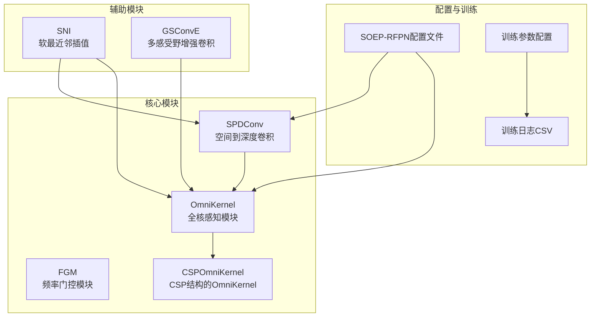
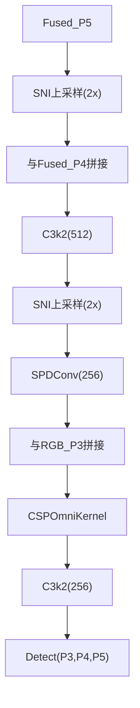
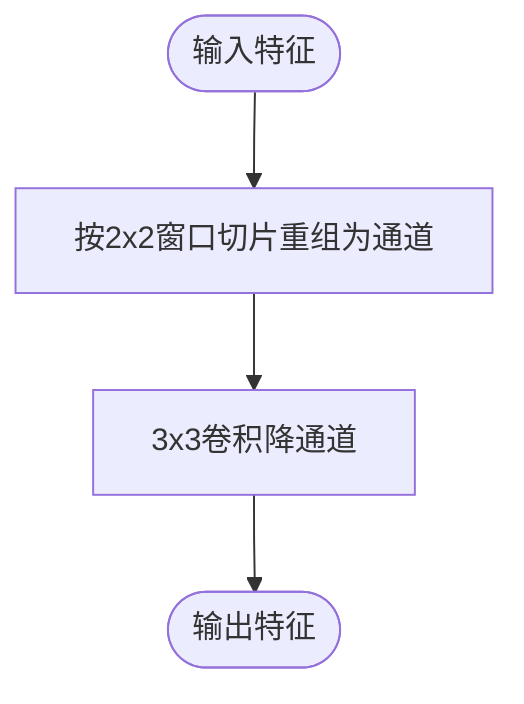
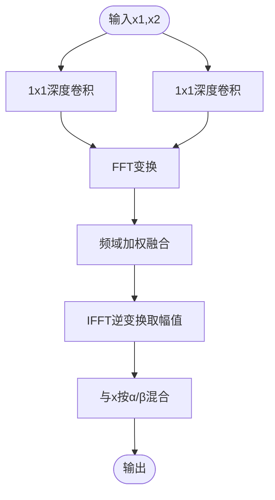
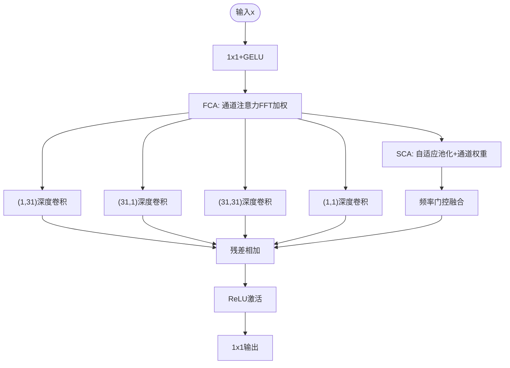
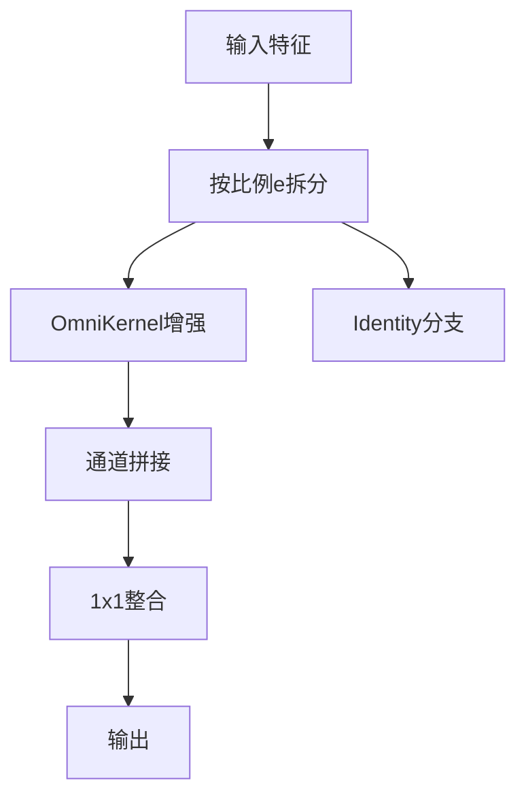
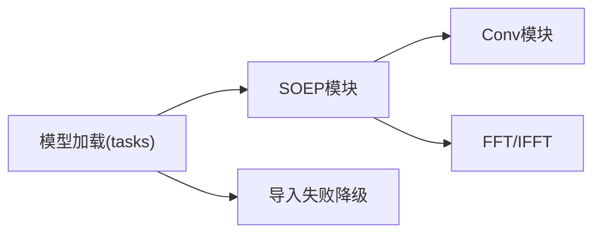

# SOEP网络

<cite>
**本文引用的文件列表**
- [soep.py](file://ultralytics/nn/Neck/soep.py)
- [yolo11n-mm-mid-soep-rfpn.yaml](file://ultralytics/cfg/models/mm/Neck/yolo11n-mm-mid-soep-rfpn.yaml)
- [args.yaml](file://ResTest/aifi-dattention-CSP-MutilScaleEdgeInformationEnhance-soep-mfm/args.yaml)
- [results.csv](file://ResTest/aifi-dattention-CSP-MutilScaleEdgeInformationEnhance-soep-mfm/results.csv)
- [tasks.py](file://ultralytics/nn/taske.py)
- [conv.py](file://ultralytics/nn/modules/conv.py)
- [auxiliary.py](file://ultralytics/nn/Neck/auxiliary.py)
</cite>

## 目录
1. [简介](#简介)
2. [项目结构](#项目结构)
3. [核心组件](#核心组件)
4. [架构总览](#架构总览)
5. [详细组件分析](#详细组件分析)
6. [依赖关系分析](#依赖关系分析)
7. [性能考量](#性能考量)
8. [故障排查指南](#故障排查指南)
9. [结论](#结论)
10. [附录](#附录)

## 简介
本文件系统性阐述SOEP（Small Object Enhance Pyramid，小目标增强金字塔）网络在小目标检测中的设计理念与核心技术。SOEP通过引入空间到深度卷积（SPDConv）、频率门控模块（FGM）、全核感知模块（OmniKernel）以及结合CSP结构的CSPOmniKernel，形成“多尺度核融合 + 频域增强”的特征金字塔增强方案。配合软最近邻插值（SNI）与多感受野增强卷积（GSConvE）等辅助模块，SOEP在多模态场景下的小目标检测中显著提升了召回与定位精度。

## 项目结构
围绕SOEP的关键文件组织如下：
- 核心模块：SOEP四大组件（SPDConv、FGM、OmniKernel、CSPOmniKernel）位于 neck 层模块中，作为特征金字塔增强的核心。
- 架构配置：SOEP-RFPN的完整模型配置文件定义了骨干、中期融合与SOEP增强路径。
- 训练配置与评估：ResTest目录下的训练参数与训练日志展示了SOEP在多模态数据上的收敛与性能表现。

图表来源
- [soep.py:13-196](file://ultralytics/nn/Neck/soep.py#L13-L196)
- [yolo11n-mm-mid-soep-rfpn.yaml:65-89](file://ultralytics/cfg/models/mm/Neck/yolo11n-mm-mid-soep-rfpn.yaml#L65-L89)
- [args.yaml:1-135](file://ResTest/aifi-dattention-CSP-MutilScaleEdgeInformationEnhance-soep-mfm/args.yaml#L1-L135)
- [results.csv:1-152](file://ResTest/aifi-dattention-CSP-MutilScaleEdgeInformationEnhance-soep-mfm/results.csv#L1-L152)

章节来源
- [soep.py:13-196](file://ultralytics/nn/Neck/soep.py#L13-L196)
- [yolo11n-mm-mid-soep-rfpn.yaml:65-89](file://ultralytics/cfg/models/mm/Neck/yolo11n-mm-mid-soep-rfpn.yaml#L65-L89)
- [args.yaml:1-135](file://ResTest/aifi-dattention-CSP-MutilScaleEdgeInformationEnhance-soep-mfm/args.yaml#L1-L135)
- [results.csv:1-152](file://ResTest/aifi-dattention-CSP-MutilScaleEdgeInformationEnhance-soep-mfm/results.csv#L1-L152)

## 核心组件
- SPDConv（空间到深度卷积）：将空间信息重排为通道维度，降低分辨率的同时增加通道数，保留细节信息，适合小目标特征提取。
- FGM（频率门控模块）：基于FFT的频域注意力机制，通过可学习权重对频域特征进行加权融合，增强主干特征的判别能力。
- OmniKernel（全核感知模块）：聚合多种尺度卷积核（水平、垂直、全局、1×1）与频域/通道注意力，形成多尺度-多域的特征增强。
- CSPOmniKernel（CSP结构的OmniKernel）：采用CSP分叉策略，仅对部分通道进行OmniKernel增强，其余通道直接残差连接，兼顾性能与效率。

章节来源
- [soep.py:13-196](file://ultralytics/nn/Neck/soep.py#L13-L196)

## 架构总览
SOEP-RFPN在标准FPN/PAN路径之外，于P3尺度引入SOEP增强路径：先用SNI将高层特征上采样至P3，再与RGB_P2经SPDConv后的特征及FPN侧支特征进行三路融合，随后通过CSPOmniKernel进行多尺度-频域增强，最终输出增强后的P3特征参与检测头。

图表来源
- [yolo11n-mm-mid-soep-rfpn.yaml:67-89](file://ultralytics/cfg/models/mm/Neck/yolo11n-mm-mid-soep-rfpn.yaml#L67-L89)

章节来源
- [yolo11n-mm-mid-soep-rfpn.yaml:65-89](file://ultralytics/cfg/models/mm/Neck/yolo11n-mm-mid-soep-rfpn.yaml#L65-L89)

## 详细组件分析

### SPDConv（空间到深度卷积）
- 设计动机：将空间冗余信息压缩到通道维，降低分辨率以提升小目标的相对尺度，同时保持高频细节。
- 实现要点：将输入张量按2×2窗口切片并重排为通道，随后经3×3卷积映射到目标通道数。
- 适用场景：小目标密集区域的特征压缩与通道增强，常用于P3/P2等中低层金字塔。

图表来源
- [soep.py:35-45](file://ultralytics/nn/Neck/soep.py#L35-L45)

章节来源
- [soep.py:13-45](file://ultralytics/nn/Neck/soep.py#L13-L45)

### FGM（频率门控模块）
- 设计动机：利用FFT在频域对特征进行注意力加权，突出关键频率成分，抑制噪声。
- 实现要点：对两个分支分别做1×1卷积后进行FFT/IFFT变换，再与可学习权重相乘融合，最后与输入按α/β混合。
- 性能影响：在不显著增加计算量的前提下，提升特征判别力，尤其对边缘/纹理敏感的小目标有帮助。

图表来源
- [soep.py:70-85](file://ultralytics/nn/Neck/soep.py#L70-L85)

章节来源
- [soep.py:48-85](file://ultralytics/nn/Neck/soep.py#L48-L85)

### OmniKernel（全核感知模块）
- 设计动机：聚合多尺度卷积核（水平、垂直、全局、1×1）与频域/通道注意力，形成多域特征增强。
- 实现要点：
  - 多尺度核：(1,31)、(31,1)、(31,31)、(1,1)深度卷积，均使用组卷积以降低计算。
  - 频域注意力（FCA）：对通道注意力权重进行FFT加权，再逆变换取幅值。
  - 通道注意力（SCA）：自适应池化后1×1卷积生成通道权重，与频域结果相乘。
  - 频率门控（FGM）：进一步融合频域与空域注意力。
  - 残差融合：与输入及多尺度核输出相加，经激活与1×1输出。
- 性能影响：显著提升多尺度小目标的表征能力，但需注意组卷积带来的通道交互成本。

图表来源
- [soep.py:137-159](file://ultralytics/nn/Neck/soep.py#L137-L159)

章节来源
- [soep.py:88-159](file://ultralytics/nn/Neck/soep.py#L88-L159)

### CSPOmniKernel（CSP结构的OmniKernel）
- 设计动机：借鉴CSP思想，将通道分为两支：一部分经OmniKernel增强，另一部分直接残差连接，平衡性能与效率。
- 实现要点：按比例e将输入通道拆分，OmniKernel分支仅处理e比例的通道，其余通道直接拼接，最后经1×1卷积整合。
- 性能影响：在保持主干特征完整性的同时，显著降低OmniKernel的计算开销，适合部署场景。

图表来源
- [soep.py:186-196](file://ultralytics/nn/Neck/soep.py#L186-L196)

章节来源
- [soep.py:162-196](file://ultralytics/nn/Neck/soep.py#L162-L196)

### 辅助模块：SNI与GSConvE
- SNI（软最近邻插值）：通过缩放因子α实现更平滑的上采样，减少棋盘伪影，改善特征对齐。
- GSConvE（多感受野增强卷积）：在自底向上路径中替代常规卷积，增强大目标的表征能力，提升整体检测性能。

章节来源
- [auxiliary.py:12-49](file://ultralytics/nn/Neck/auxiliary.py#L12-L49)
- [yolo11n-mm-mid-soep-rfpn.yaml:79-86](file://ultralytics/cfg/models/mm/Neck/yolo11n-mm-mid-soep-rfpn.yaml#L79-L86)

## 依赖关系分析
SOEP模块依赖于通用卷积模块（Conv）与FFT功能，且在导入时具备可用性检查与降级处理，确保在不同环境下稳定运行。

图表来源
- [soep.py:4-8](file://ultralytics/nn/Neck/soep.py#L4-L8)
- [tasks.py:261-290](file://ultralytics/nn/taske.py#L261-L290)

章节来源
- [soep.py:4-8](file://ultralytics/nn/Neck/soep.py#L4-L8)
- [tasks.py:261-290](file://ultralytics/nn/taske.py#L261-L290)

## 性能考量
- 计算复杂度：OmniKernel包含多尺度深度卷积与FFT操作，建议在P3/P4等中等分辨率层使用，避免在高分辨率层过度消耗显存。
- 内存占用：SPDConv与OmniKernel均涉及通道扩展与组卷积，需关注batch size与输入分辨率的平衡。
- 训练稳定性：SNI与GSConvE在FPN/PAN路径中交替使用，有助于缓解上采样伪影与感受野不足问题。
- 小目标收益：通过SPDConv压缩空间冗余、CSPOmniKernel增强多尺度表征，SOEP在小目标场景下具有明显优势。

## 故障排查指南
- 导入失败：若SOEP模块无法导入，系统会记录警告并抛出异常，提示模块不可用。请确认环境安装与依赖版本。
- FFT精度：在AMP模式下，FFT可能切换到FP32路径以保证数值稳定性；如遇性能瓶颈，可在非AMP模式下运行。
- 尺寸不匹配：GSConvE在指定输出尺寸时若与实际特征图不一致，会报错提示，请检查输入尺寸或关闭多尺度设置。

章节来源
- [tasks.py:261-290](file://ultralytics/nn/taske.py#L261-L290)
- [conv.py:730-800](file://ultralytics/nn/modules/conv.py#L730-L800)

## 结论
SOEP通过“空间压缩 + 多尺度核融合 + 频域增强 + CSP分叉”的设计，在小目标检测中实现了特征金字塔的高效增强。结合SNI与GSConvE，SOEP在多模态场景下显著提升了小目标的召回与定位精度，并在保持较高推理效率的同时具备良好的工程可移植性。

## 附录

### 配置示例与使用场景
- 模型配置：SOEP-RFPN在P3尺度引入SPDConv与CSPOmniKernel，配合SNI与GSConvE，适用于需要高精度小目标检测的多模态任务。
- 训练参数：ResTest中的训练配置展示了合理的超参设置，包括学习率、批次大小、数据增强策略等。
- 性能验证：训练日志显示mAP与召回随训练轮次稳步提升，表明SOEP在该数据集上具有良好的收敛性与泛化能力。

章节来源
- [yolo11n-mm-mid-soep-rfpn.yaml:1-25](file://ultralytics/cfg/models/mm/Neck/yolo11n-mm-mid-soep-rfpn.yaml#L1-L25)
- [args.yaml:1-135](file://ResTest/aifi-dattention-CSP-MutilScaleEdgeInformationEnhance-soep-mfm/args.yaml#L1-L135)
- [results.csv:1-152](file://ResTest/aifi-dattention-CSP-MutilScaleEdgeInformationEnhance-soep-mfm/results.csv#L1-L152)