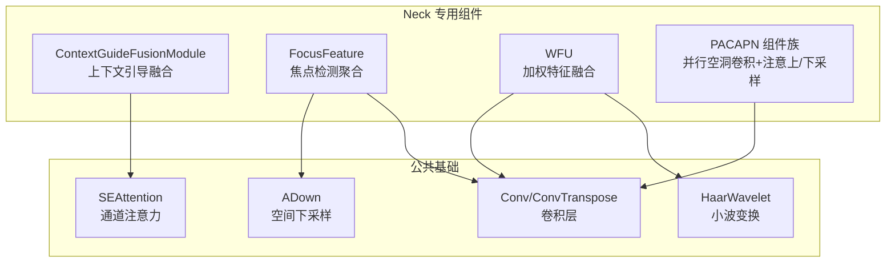
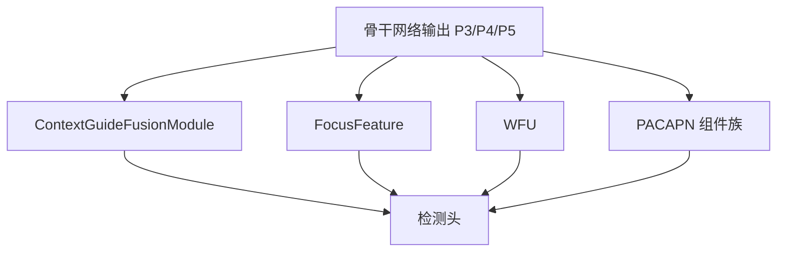
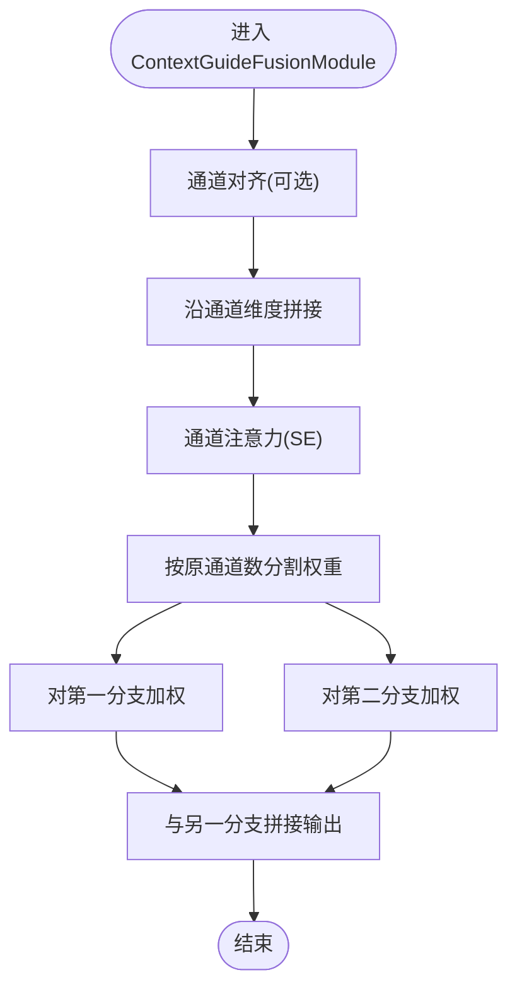
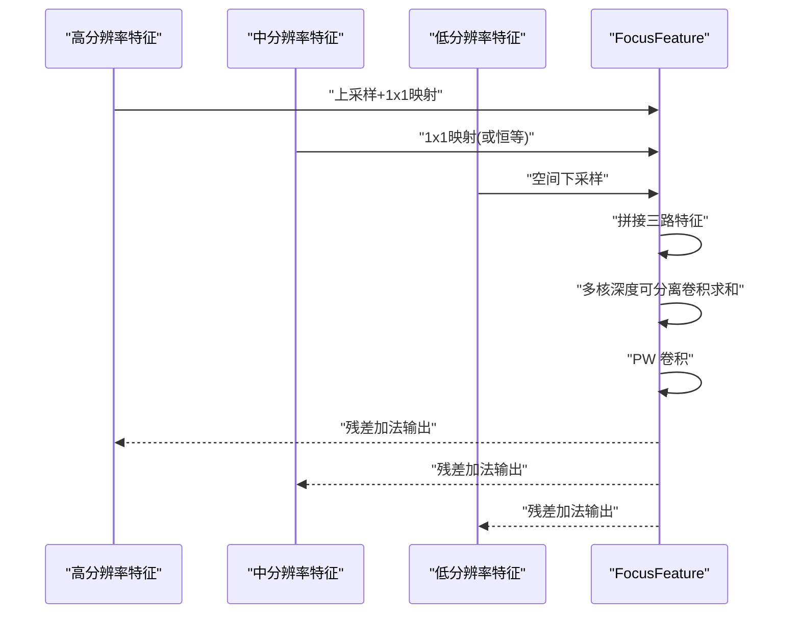
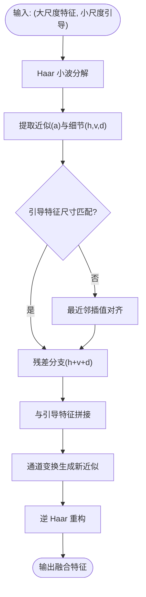
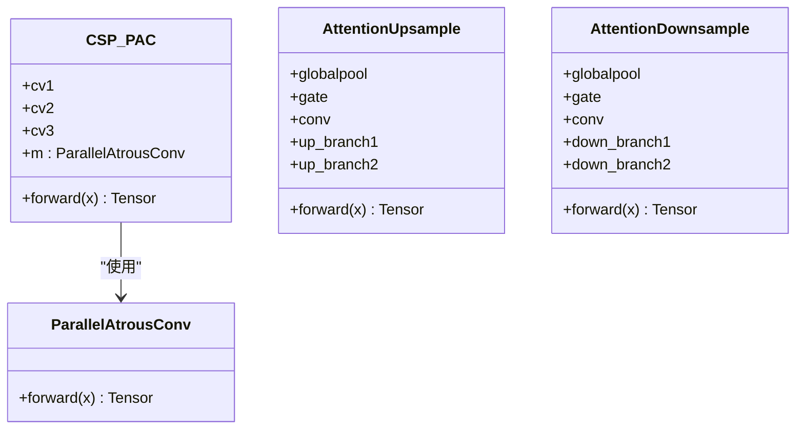
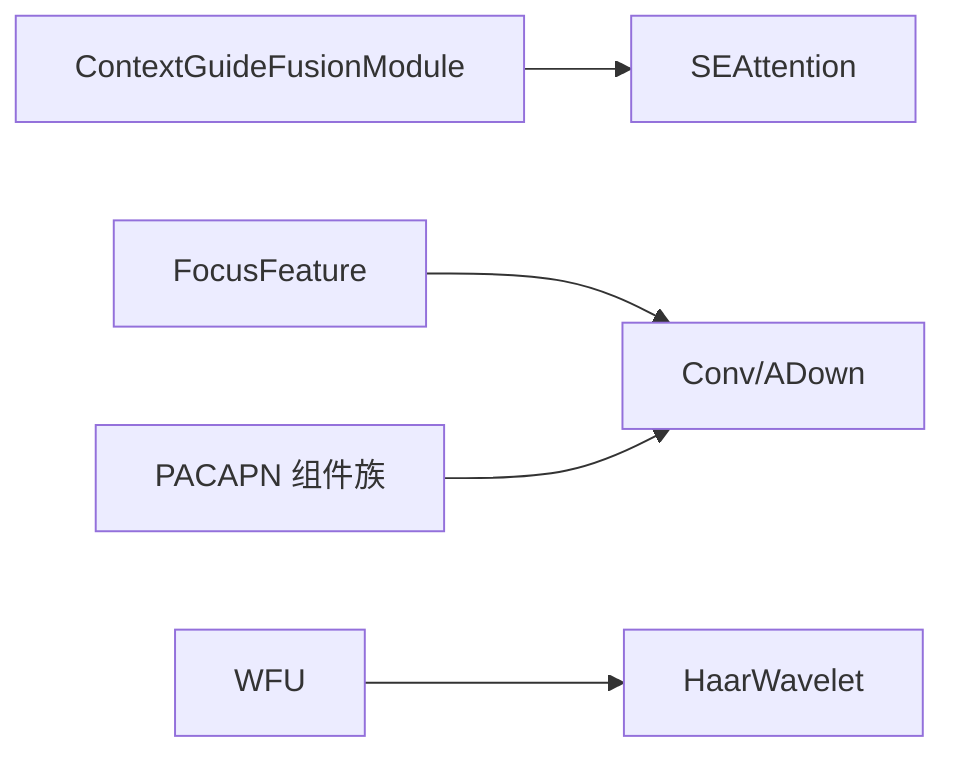

# 专用颈部网络

<cite>
**本文引用的文件**
- [contextguide.py](file://ultralytics/nn/Neck/contextguide.py)
- [fdpn.py](file://ultralytics/nn/Neck/fdpn.py)
- [wfu.py](file://ultralytics/nn/Neck/wfu.py)
- [pacapn.py](file://ultralytics/nn/Neck/pacapn.py)
- [__init__.py](file://ultralytics/nn/Neck/__init__.py)
- [aifi-dattention-CSP-MutilScaleEdgeInformationEnhance-ASF-P2-lite-ContextGuideFusionModule\args.yaml](file://ResTest/aifi-dattention-CSP-MutilScaleEdgeInformationEnhance-ASF-P2-lite-ContextGuideFusionModule/args.yaml)
- [aifi-dattention-CSP-MutilScaleEdgeInformationEnhance-pacapn\args.yaml](file://ResTest/aifi-dattention-CSP-MutilScaleEdgeInformationEnhance-pacapn/args.yaml)
- [aifi-dattention-CSP-MutilScaleEdgeInformationEnhance-fdpn\args.yaml](file://ResTest/aifi-dattention-CSP-MutilScaleEdgeInformationEnhance-fdpn/args.yaml)
</cite>

## 目录
1. [简介](#简介)
2. [项目结构](#项目结构)
3. [核心组件](#核心组件)
4. [架构总览](#架构总览)
5. [详细组件分析](#详细组件分析)
6. [依赖关系分析](#依赖关系分析)
7. [性能考量](#性能考量)
8. [故障排查指南](#故障排查指南)
9. [结论](#结论)
10. [附录](#附录)

## 简介
本文件聚焦于多模态检测框架中四类专用颈部网络组件：ContextGuideFusionModule（上下文引导融合模块）、Focus Detection Network（焦点检测网络，以 FocusFeature 为代表实现）、Weighted Feature Fusion Unit（加权特征融合单元，以 WFU 为代表实现）、Parallel Atrous Convolution Attention Pyramid Network（并行空洞卷积注意金字塔网络，以 PACAPN 组件族为代表）。我们将从设计目标、核心算法、数据流与控制流、适用场景、配置示例与使用建议等方面进行系统化说明，并辅以可视化图示帮助理解。

## 项目结构
专用颈部网络位于 neck 子模块中，采用按功能分层的组织方式：
- contextguide.py：上下文引导融合模块及其子组件（SEAttention、ContextGuideFusionModule）
- fdpn.py：焦点检测网络相关组件（FocusFeature）
- wfu.py：加权特征融合单元（HaarWavelet、WFU）
- pacapn.py：并行空洞卷积注意金字塔网络组件（ParallelAtrousConv、CSP_PAC、AttentionUpsample、AttentionDownsample）

**图表来源**
- [contextguide.py:29-47](file://ultralytics/nn/Neck/contextguide.py#L29-L47)
- [fdpn.py:12-43](file://ultralytics/nn/Neck/fdpn.py#L12-L43)
- [wfu.py:45-81](file://ultralytics/nn/Neck/wfu.py#L45-L81)
- [pacapn.py:11-75](file://ultralytics/nn/Neck/pacapn.py#L11-L75)

**章节来源**
- [__init__.py:13-18](file://ultralytics/nn/Neck/__init__.py#L13-L18)

## 核心组件
- ContextGuideFusionModule：通过通道注意力对双向特征进行加权融合，强调上下文信息对特征表达的引导作用。
- FocusFeature：基于多核深度可分离卷积的焦点特征聚合，融合高分辨率与低分辨率特征，提升多尺度细节表达。
- WFU：利用固定 Haar 小波变换在高低分辨率特征间建立跨尺度语义桥梁，实现加权融合。
- PACAPN 组件族：并行空洞卷积扩大感受野，结合 CSP 结构与注意门控的上/下采样，形成金字塔式上下文增强路径。

**章节来源**
- [contextguide.py:29-47](file://ultralytics/nn/Neck/contextguide.py#L29-L47)
- [fdpn.py:12-43](file://ultralytics/nn/Neck/fdpn.py#L12-L43)
- [wfu.py:45-81](file://ultralytics/nn/Neck/wfu.py#L45-L81)
- [pacapn.py:11-75](file://ultralytics/nn/Neck/pacapn.py#L11-L75)

## 架构总览
以下图示展示专用颈部组件在多模态检测流程中的位置与交互关系（概念示意，不映射具体代码文件）：

## 详细组件分析

### ContextGuideFusionModule（上下文引导融合模块）
- 设计目标
  - 在多尺度特征之间引入双向引导机制，通过通道注意力动态分配权重，使高语境特征能够指导低语境特征，反之亦然。
- 核心算法
  - 特征通道调整：若输入通道不一致，使用 1×1 卷积对齐通道数。
  - 通道注意力：对拼接后的双通道特征计算 SE 注意力，得到通道级权重。
  - 加权融合：将注意力权重分别作用于两个分支，再拼接输出，形成双向增强的融合特征。
- 数据流与控制流
  - 输入：两路特征张量（通道数可能不同）。
  - 处理：通道对齐 → 拼接 → SE 注意力 → 分割权重 → 分支加权 → 最终拼接。
- 适用场景
  - 需要跨尺度上下文互补的检测任务；对边缘与细节敏感的任务可受益于双向引导。
- 使用建议
  - 建议在多尺度特征融合前使用，作为“语境校正”模块；注意通道一致性与计算开销平衡。

**图表来源**
- [contextguide.py:32-47](file://ultralytics/nn/Neck/contextguide.py#L32-L47)

**章节来源**
- [contextguide.py:11-27](file://ultralytics/nn/Neck/contextguide.py#L11-L27)
- [contextguide.py:29-47](file://ultralytics/nn/Neck/contextguide.py#L29-L47)

### FocusFeature（焦点检测网络）
- 设计目标
  - 聚合来自不同分辨率的特征，利用多核深度可分离卷积在保持轻量化的同时扩展感受野，突出焦点区域的细节。
- 核心算法
  - 上采样/下采样/直接映射：对三路及以上输入分别进行上采样、1×1 映射或空间下采样，统一到中间通道维。
  - 多核深度可分离卷积：对统一后的特征堆叠多组不同核大小的深度卷积，再求和。
  - 逐点卷积：将融合后的特征映射回目标通道维。
  - 残差连接：最终输出与输入相加，稳定训练。
- 数据流与控制流
  - 输入：至少三路特征（通常为高分辨率到低分辨率）。
  - 处理：各路预处理 → 拼接 → 多核深度卷积堆叠求和 → PW 卷积 → 残差加法。
- 适用场景
  - 对多尺度细节敏感的任务；需要在轻量化前提下提升局部细节表达。
- 使用建议
  - 合理选择核大小序列与中间通道比例，避免过深导致显存压力；与上/下采样策略配合使用。

**图表来源**
- [fdpn.py:15-43](file://ultralytics/nn/Neck/fdpn.py#L15-L43)

**章节来源**
- [fdpn.py:12-43](file://ultralytics/nn/Neck/fdpn.py#L12-L43)

### WFU（加权特征融合单元）
- 设计目标
  - 利用固定 Haar 小波变换在高低分辨率特征间建立跨尺度语义桥梁，实现结构化的小波域融合。
- 核心算法
  - 小波分解：对高分辨率特征执行 Haar 小波分解，得到近似分量与三个方向细节分量。
  - 引导融合：将低分辨率引导特征与近似分量在通道维拼接，经通道变换生成新的近似分量。
  - 重构合成：将细节分量与新近似分量拼接，经逆 Haar 小波重构输出。
- 数据流与控制流
  - 输入：[高分辨率特征, 低分辨率引导特征]。
  - 处理：小波分解 → 细节分支残差 → 引导与近似拼接 → 通道变换 → 逆小波重构。
- 适用场景
  - 需要在小波域进行跨尺度融合的任务；对纹理与边缘细节有较高要求。
- 使用建议
  - 注意输入尺寸与小波分解的兼容性；当引导特征分辨率不匹配时需插值对齐。

**图表来源**
- [wfu.py:67-81](file://ultralytics/nn/Neck/wfu.py#L67-L81)

**章节来源**
- [wfu.py:12-43](file://ultralytics/nn/Neck/wfu.py#L12-L43)
- [wfu.py:45-81](file://ultralytics/nn/Neck/wfu.py#L45-L81)

### PACAPN（并行空洞卷积注意金字塔网络）
- 设计目标
  - 通过并行空洞卷积扩大感受野，结合 CSP 结构与注意门控的上/下采样，构建多尺度金字塔上下文增强路径。
- 核心算法
  - 并行空洞卷积：在同一输入上使用不同膨胀率的卷积分支，融合多尺度上下文。
  - CSP_PAC：在 CSP 结构中嵌入并行空洞卷积，减少冗余计算。
  - 注意门控上/下采样：自适应地融合多种上/下采样分支，提高特征表达能力。
- 数据流与控制流
  - 输入：单路特征张量。
  - 处理：CSP 分支 → 并行空洞卷积 → 特征拼接 → 输出。
  - 上/下采样：注意门控融合多分支（如转置卷积/最近邻上采样、带步幅卷积/池化下采样）。
- 适用场景
  - 需要多尺度上下文增强与高效上/下采样的检测任务；对大目标与小目标兼顾的场景尤为有效。
- 使用建议
  - 合理设置膨胀率与中间通道比例，避免感受野过大导致冗余；注意上/下采样的一致性与对齐。

**图表来源**
- [pacapn.py:11-75](file://ultralytics/nn/Neck/pacapn.py#L11-L75)

**章节来源**
- [pacapn.py:11-75](file://ultralytics/nn/Neck/pacapn.py#L11-L75)

## 依赖关系分析
- 组件内聚与耦合
  - ContextGuideFusionModule 依赖 SEAttention 进行通道加权，耦合度较低，便于替换注意力策略。
  - FocusFeature 依赖 ADown 与 Conv 实现多尺度融合，整体为轻量模块。
  - WFU 依赖 HaarWavelet 与 Conv，结构清晰，计算路径明确。
  - PACAPN 组件依赖 Conv/ConvTranspose 与注意力门控，模块化程度高。
- 外部依赖
  - 所有模块均依赖通用卷积与激活组件，无循环依赖风险。
- 集成点
  - Neck 子模块统一导出上述组件，便于在模型配置中灵活组合。

**图表来源**
- [contextguide.py:8](file://ultralytics/nn/Neck/contextguide.py#L8)
- [fdpn.py:8-9](file://ultralytics/nn/Neck/fdpn.py#L8-L9)
- [wfu.py:9](file://ultralytics/nn/Neck/wfu.py#L9)
- [pacapn.py:8](file://ultralytics/nn/Neck/pacapn.py#L8)

**章节来源**
- [__init__.py:13-18](file://ultralytics/nn/Neck/__init__.py#L13-L18)

## 性能考量
- 计算复杂度
  - ContextGuideFusionModule：主要为通道注意力与少量卷积，复杂度适中，适合多尺度融合前置。
  - FocusFeature：深度可分离卷积在保证效果的同时降低参数与计算量，适合实时场景。
  - WFU：小波变换与通道变换带来一定额外开销，但结构化融合收益明显。
  - PACAPN：并行空洞卷积与注意门控增加计算，可通过合理设置膨胀率与通道比例平衡性能。
- 显存占用
  - 建议在高分辨率输入场景下控制中间通道比例，避免内存峰值过高。
- 推理速度
  - 优先选择轻量化实现（如深度可分离卷积、固定小波核），并确保上/下采样对齐，减少不必要的插值。

## 故障排查指南
- 输入通道不匹配
  - ContextGuideFusionModule 会根据输入通道自动调整，但若通道差异过大可能导致特征对齐不充分，建议在融合前统一通道。
- 尺寸不一致
  - WFU 中若引导特征分辨率与小波分解结果不一致，会触发插值对齐；请确认输入尺寸满足小波分解整除条件。
- 注意力权重异常
  - 若出现梯度消失或不稳定，可检查注意力模块的归一化与激活函数设置。
- 上/下采样对齐问题
  - PACAPN 的注意门控上/下采样分支需确保输出通道一致，否则拼接会报错。

**章节来源**
- [contextguide.py:32-37](file://ultralytics/nn/Neck/contextguide.py#L32-L37)
- [wfu.py:75-76](file://ultralytics/nn/Neck/wfu.py#L75-L76)
- [pacapn.py:44-51](file://ultralytics/nn/Neck/pacapn.py#L44-L51)
- [pacapn.py:62-69](file://ultralytics/nn/Neck/pacapn.py#L62-L69)

## 结论
ContextGuideFusionModule、FocusFeature、WFU 与 PACAPN 组件分别针对“上下文引导融合”、“焦点区域细节增强”、“跨尺度小波域融合”和“多尺度金字塔上下文增强”等特定需求而设计。它们在保持轻量化与高效性的前提下，提供了灵活的模块化组合能力，适用于多模态检测任务中的多样化场景。建议根据任务特性与资源约束，选择合适的组件并进行合理的通道与尺度配置。

## 附录

### 配置示例与使用建议
- ContextGuideFusionModule
  - 示例：在多尺度融合阶段插入该模块，作为上下文引导的前置处理。
  - 参考配置文件路径：[aifi-dattention-CSP-MutilScaleEdgeInformationEnhance-ASF-P2-lite-ContextGuideFusionModule\args.yaml](file://ResTest/aifi-dattention-CSP-MutilScaleEdgeInformationEnhance-ASF-P2-lite-ContextGuideFusionModule/args.yaml)
- FocusFeature
  - 示例：在多尺度特征聚合阶段使用，提升局部细节表达。
  - 参考配置文件路径：[aifi-dattention-CSP-MutilScaleEdgeInformationEnhance-fdpn\args.yaml](file://ResTest/aifi-dattention-CSP-MutilScaleEdgeInformationEnhance-fdpn/args.yaml)
- WFU
  - 示例：在高分辨率与低分辨率特征融合时使用，借助小波域结构化融合。
  - 参考配置文件路径：[aifi-dattention-CSP-MutilScaleEdgeInformationEnhance-pacapn\args.yaml](file://ResTest/aifi-dattention-CSP-MutilScaleEdgeInformationEnhance-pacapn/args.yaml)
- PACAPN 组件族
  - 示例：在金字塔网络中使用并行空洞卷积与注意门控上/下采样，增强多尺度上下文。
  - 参考配置文件路径：[aifi-dattention-CSP-MutilScaleEdgeInformationEnhance-pacapn\args.yaml](file://ResTest/aifi-dattention-CSP-MutilScaleEdgeInformationEnhance-pacapn/args.yaml)

**章节来源**
- [aifi-dattention-CSP-MutilScaleEdgeInformationEnhance-ASF-P2-lite-ContextGuideFusionModule\args.yaml:1-135](file://ResTest/aifi-dattention-CSP-MutilScaleEdgeInformationEnhance-ASF-P2-lite-ContextGuideFusionModule/args.yaml#L1-L135)
- [aifi-dattention-CSP-MutilScaleEdgeInformationEnhance-fdpn\args.yaml:1-135](file://ResTest/aifi-dattention-CSP-MutilScaleEdgeInformationEnhance-fdpn/args.yaml#L1-L135)
- [aifi-dattention-CSP-MutilScaleEdgeInformationEnhance-pacapn\args.yaml:1-135](file://ResTest/aifi-dattention-CSP-MutilScaleEdgeInformationEnhance-pacapn/args.yaml#L1-L135)