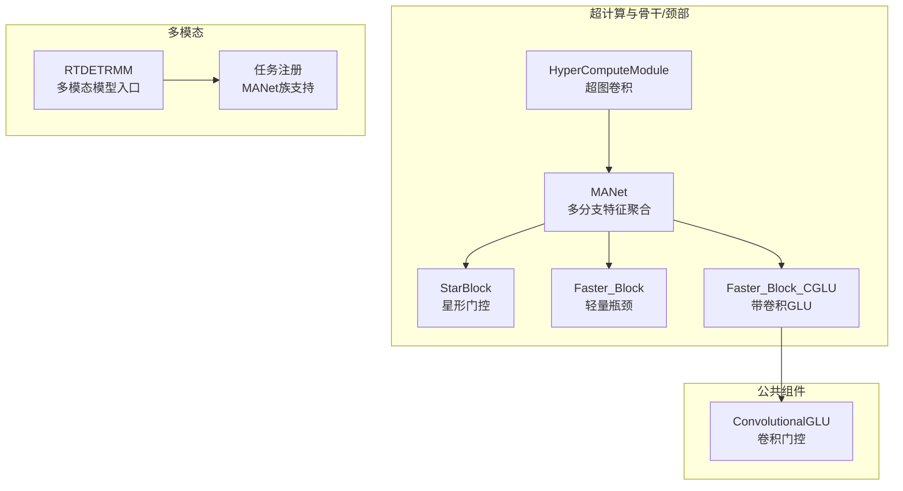
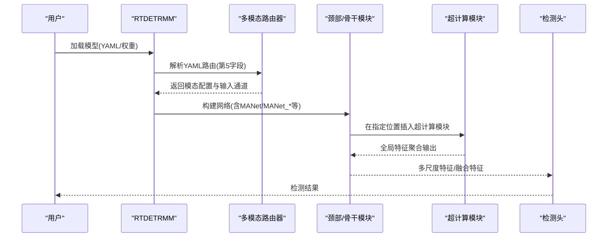
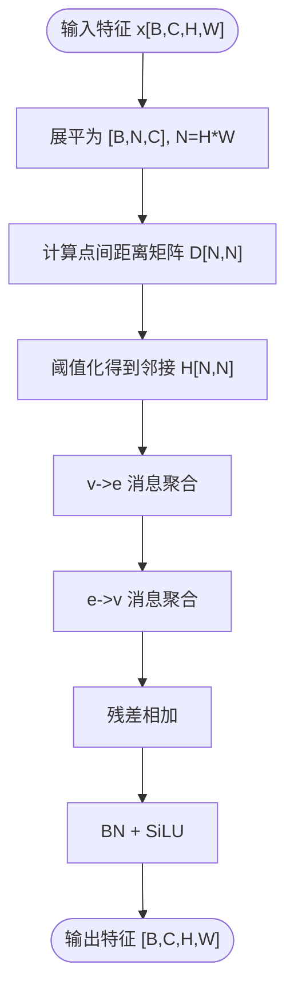
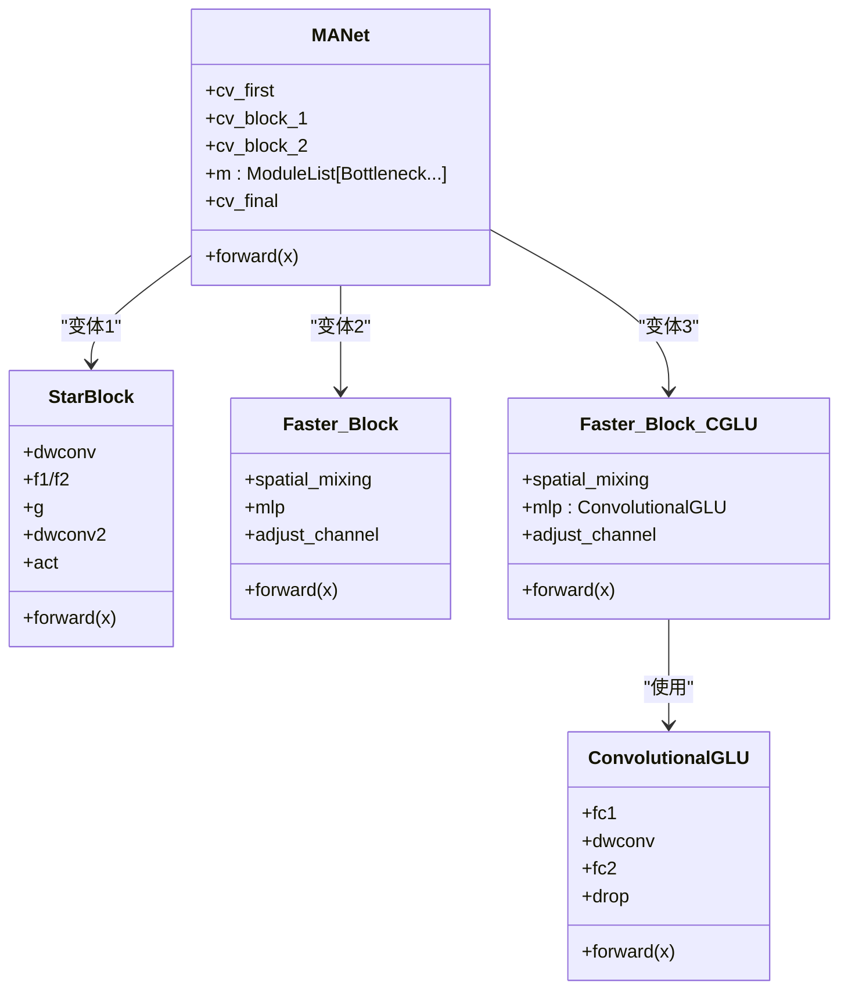
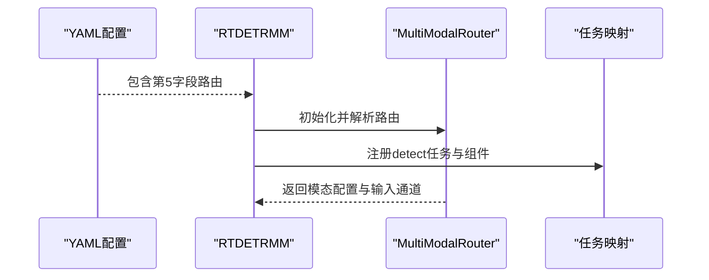
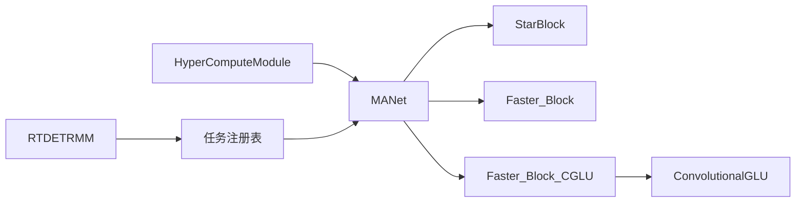

# 超计算网络

<cite>
**本文档引用的文件**
- [ultralytics\nn\Neck\hypercompute.py](file://ultralytics\nn\Neck\hypercompute.py)
- [ultralytics\nn\extraction\c3k2_base.py](file://ultralytics\nn\extraction\c3k2_base.py)
- [ultralytics\nn\public\common_glu.py](file://ultralytics\nn\public\common_glu.py)
- [ultralytics\models\rtdetrmm\model.py](file://ultralytics\models\rtdetrmm\model.py)
- [ultralytics\cfg\models\多模态YAML构建指点.md](file://ultralytics\cfg\models\多模态YAML构建指点.md)
- [ultralytics\nn\tasks.py](file://ultralytics\nn\tasks.py)
</cite>

## 目录
1. [简介](#简介)
2. [项目结构](#项目结构)
3. [核心组件](#核心组件)
4. [架构总览](#架构总览)
5. [详细组件分析](#详细组件分析)
6. [依赖分析](#依赖分析)
7. [性能考量](#性能考量)
8. [故障排查指南](#故障排查指南)
9. [结论](#结论)
10. [附录](#附录)

## 简介
本文件系统化阐述超计算网络（HyperCompute Network）的设计理念与实现要点，聚焦以下目标：
- 解释超计算模块（HyperComputeModule）如何通过超图消息传递实现高效的特征聚合与处理。
- 说明 MANet、MANet_Star、MANet_FasterBlock、MANet_FasterCGLU 等骨干/颈部变体的结构设计与实现差异。
- 总结在保持模型性能的前提下，如何通过轻量化算子、门控机制与高效融合策略提升整体计算效率。
- 展示在多模态检测（RGB+X）中的应用价值与配置方法。

## 项目结构
围绕超计算网络的关键代码分布在以下模块：
- 超计算与多模态骨干/颈部：ultralytics\nn\Neck\hypercompute.py、ultralytics\nn\extraction\c3k2_base.py
- 通用门控单元：ultralytics\nn\public\common_glu.py
- 多模态模型入口与路由：ultralytics\models\rtdetrmm\model.py、ultralytics\nn\tasks.py
- 多模态 YAML 构建指南：ultralytics\cfg\models\多模态YAML构建指点.md

**图表来源**
- [ultralytics\nn\Neck\hypercompute.py:38-189](file://ultralytics\nn\Neck\hypercompute.py#L38-L189)
- [ultralytics\nn\extraction\c3k2_base.py:4704-4826](file://ultralytics\nn\extraction\c3k2_base.py#L4704-L4826)
- [ultralytics\nn\public\common_glu.py:12-42](file://ultralytics\nn\public\common_glu.py#L12-L42)
- [ultralytics\models\rtdetrmm\model.py:25-57](file://ultralytics\models\rtdetrmm\model.py#L25-L57)
- [ultralytics\nn\tasks.py:3459-3486](file://ultralytics\nn\tasks.py#L3459-L3486)

**章节来源**
- [ultralytics\nn\Neck\hypercompute.py:1-190](file://ultralytics\nn\Neck\hypercompute.py#L1-L190)
- [ultralytics\nn\extraction\c3k2_base.py:1-800](file://ultralytics\nn\extraction\c3k2_base.py#L1-L800)
- [ultralytics\nn\public\common_glu.py:1-44](file://ultralytics\nn\public\common_glu.py#L1-L44)
- [ultralytics\models\rtdetrmm\model.py:1-269](file://ultralytics\models\rtdetrmm\model.py#L1-L269)
- [ultralytics\cfg\models\多模态YAML构建指点.md:1-239](file://ultralytics\cfg\models\多模态YAML构建指点.md#L1-L239)
- [ultralytics\nn\tasks.py:3459-3486](file://ultralytics\nn\tasks.py#L3459-L3486)

## 核心组件
- 超计算模块（HyperComputeModule）
  - 通过点间距离阈值构建超图邻接矩阵，执行节点到边、边到节点的消息聚合，结合线性变换与归一化，实现全局感知的特征更新。
  - 前向流程包含特征展平、成对距离计算、邻接构造、超图卷积、残差与激活。
- MANet 系列
  - 基础变体（MANet）：采用双分支特征路径与多级瓶颈块堆叠，结合轻量深度可分离卷积路径，形成多分支融合。
  - 替代变体（MANet_Star、MANet_FasterBlock、MANet_FasterCGLU）：以星形门控块、轻量瓶颈块、带卷积GLU的轻量瓶颈块替代传统瓶颈，降低算子复杂度并引入门控增强非线性表达。
- 门控单元（ConvolutionalGLU）
  - 1x1 → DWConv(3x3, grouped) → 1x1 的门控前馈，利用通道二元拆分与逐点乘实现门控，兼具轻量与表达力。

**章节来源**
- [ultralytics\nn\Neck\hypercompute.py:38-107](file://ultralytics\nn\Neck\hypercompute.py#L38-L107)
- [ultralytics\nn\extraction\c3k2_base.py:4704-4826](file://ultralytics\nn\extraction\c3k2_base.py#L4704-L4826)
- [ultralytics\nn\public\common_glu.py:12-42](file://ultralytics\nn\public\common_glu.py#L12-L42)

## 架构总览
超计算网络在多模态检测中的定位与交互如下：
- 多模态路由（RGB/X/Dual）由 YAML 的第5字段声明，模型入口负责解析并注入路由配置。
- 超计算模块可置于颈部或骨干中，作为全局特征交互单元，提升跨位置/跨尺度的语义关联。
- MANet 系列模块作为特征聚合与轻量化瓶颈，支撑多分支融合与高效推理。

**图表来源**
- [ultralytics\models\rtdetrmm\model.py:25-189](file://ultralytics\models\rtdetrmm\model.py#L25-L189)
- [ultralytics\cfg\models\多模态YAML构建指点.md:20-64](file://ultralytics\cfg\models\多模态YAML构建指点.md#L20-L64)
- [ultralytics\nn\Neck\hypercompute.py:38-62](file://ultralytics\nn\Neck\hypercompute.py#L38-L62)

**章节来源**
- [ultralytics\models\rtdetrmm\model.py:25-189](file://ultralytics\models\rtdetrmm\model.py#L25-L189)
- [ultralytics\cfg\models\多模态YAML构建指点.md:1-239](file://ultralytics\cfg\models\多模态YAML构建指点.md#L1-L239)

## 详细组件分析

### 超计算模块（HyperComputeModule）
- 设计要点
  - 将特征图展平为点集，计算点间欧氏距离，以阈值生成超图邻接；通过 v→e→v 的消息传递实现全局交互。
  - 使用线性映射与批归一化+激活，残差连接保证稳定性。
- 数据流与复杂度
  - 对于 H×W 的特征图，点数 N≈H×W；距离计算复杂度 O(N^2)，在小分辨率下可行；可通过阈值控制邻接稀疏度。
- 适用场景
  - 需要跨位置长程依赖的颈部/骨干层，或在多尺度融合前进行全局特征对齐。

**图表来源**
- [ultralytics\nn\Neck\hypercompute.py:54-62](file://ultralytics\nn\Neck\hypercompute.py#L54-L62)

**章节来源**
- [ultralytics\nn\Neck\hypercompute.py:38-62](file://ultralytics\nn\Neck\hypercompute.py#L38-L62)

### MANet 与变体（MANet、MANet_Star、MANet_FasterBlock、MANet_FasterCGLU）
- 设计理念
  - MANet 通过双分支路径与多级瓶颈堆叠，结合轻量深度可分离路径，形成多分支融合，提升特征表达与效率。
  - MANet_Star 以星形门控块替代瓶颈，强调空间与通道的门控混合。
  - MANet_FasterBlock 以轻量瓶颈块替代瓶颈，减少计算开销。
  - MANet_FasterCGLU 以带卷积GLU的轻量瓶颈块替代瓶颈，引入门控增强非线性。
- 实现差异
  - StarBlock：深度可分离卷积 + 两路1x1投影 + 逐点门控 + 深度卷积，残差连接。
  - Faster_Block：空间混合（部分卷积）+ MLP（ConvolutionalGLU）+ 可选层缩放。
  - Faster_Block_CGLU：直接使用 ConvolutionalGLU 作为 MLP，通道调整与层缩放可选。

**图表来源**
- [ultralytics\nn\Neck\hypercompute.py:65-189](file://ultralytics\nn\Neck\hypercompute.py#L65-L189)
- [ultralytics\nn\extraction\c3k2_base.py:4704-4826](file://ultralytics\nn\extraction\c3k2_base.py#L4704-L4826)
- [ultralytics\nn\public\common_glu.py:12-42](file://ultralytics\nn\public\common_glu.py#L12-L42)

**章节来源**
- [ultralytics\nn\Neck\hypercompute.py:65-189](file://ultralytics\nn\Neck\hypercompute.py#L65-L189)
- [ultralytics\nn\extraction\c3k2_base.py:4704-4826](file://ultralytics\nn\extraction\c3k2_base.py#L4704-L4826)
- [ultralytics\nn\public\common_glu.py:12-42](file://ultralytics\nn\public\common_glu.py#L12-L42)

### 多模态检测中的应用与配置
- YAML 路由
  - 第5字段标注输入模态来源（'RGB' | 'X' | 'Dual'），支持早期/中期/晚期融合范式。
  - Dual 输入用于早期融合，X 分支新起点需 from=-1 + 'X'，确保空间尺寸正确重置。
- 模型入口
  - RTDETRMM 通过 require_multimodal 与 _ensure_mm_router 确保多模态结构可用，任务映射中包含 detect 的预测/验证/训练器与检测模型类型。
- 任务注册
  - 任务注册表中 MANet 及其变体被识别为有效模块类型，便于 YAML 构网。

**图表来源**
- [ultralytics\models\rtdetrmm\model.py:25-189](file://ultralytics\models\rtdetrmm\model.py#L25-L189)
- [ultralytics\nn\tasks.py:3459-3486](file://ultralytics\nn\tasks.py#L3459-L3486)
- [ultralytics\cfg\models\多模态YAML构建指点.md:20-64](file://ultralytics\cfg\models\多模态YAML构建指点.md#L20-L64)

**章节来源**
- [ultralytics\models\rtdetrmm\model.py:25-189](file://ultralytics\models\rtdetrmm\model.py#L25-L189)
- [ultralytics\nn\tasks.py:3459-3486](file://ultralytics\nn\tasks.py#L3459-L3486)
- [ultralytics\cfg\models\多模态YAML构建指点.md:1-239](file://ultralytics\cfg\models\多模态YAML构建指点.md#L1-L239)

## 依赖分析
- 组件耦合
  - HyperComputeModule 与 MANet 系列均为独立模块，通过网络拓扑连接；MANet 系列内部以不同块类型替换 Bottleneck，耦合度低、可替换性强。
  - MANet_FasterCGLU 依赖 ConvolutionalGLU，形成轻量门控路径。
- 外部依赖
  - 多模态路由依赖 YAML 第5字段与数据配置（Xch），模型入口负责解析与校验。
  - 任务注册表支持 MANet 族模块，便于在 YAML 中直接使用。

**图表来源**
- [ultralytics\nn\Neck\hypercompute.py:38-189](file://ultralytics\nn\Neck\hypercompute.py#L38-L189)
- [ultralytics\nn\extraction\c3k2_base.py:4704-4826](file://ultralytics\nn\extraction\c3k2_base.py#L4704-L4826)
- [ultralytics\nn\tasks.py:3459-3486](file://ultralytics\nn\tasks.py#L3459-L3486)

**章节来源**
- [ultralytics\nn\Neck\hypercompute.py:38-189](file://ultralytics\nn\Neck\hypercompute.py#L38-L189)
- [ultralytics\nn\extraction\c3k2_base.py:4704-4826](file://ultralytics\nn\extraction\c3k2_base.py#L4704-L4826)
- [ultralytics\nn\tasks.py:3459-3486](file://ultralytics\nn\tasks.py#L3459-L3486)

## 性能考量
- 超图消息传递
  - 点数 N 与距离计算复杂度 O(N^2)，在高分辨率下需谨慎；可通过阈值控制邻接稀疏度，或在局部窗口内计算以降低复杂度。
- 轻量瓶颈与门控
  - MANet_Star 与 MANet_FasterBlock 通过深度可分离与部分卷积减少参数与计算；MANet_FasterCGLU 引入卷积GLU，以门控增强表达力并保持轻量。
- 多模态融合
  - 早期融合（Dual）简化结构、提速；中期融合在 P3/P4 融合兼顾细节与语义；晚期融合独立推理后融合结果，鲁棒性更高但需额外后处理。
- 推理与部署
  - 可结合重参数化与融合策略（如 DBB 等）在部署阶段进一步加速；注意通道与尺寸一致性，避免运行时形状不匹配。

[本节为通用性能讨论，不直接分析具体文件]

## 故障排查指南
- 通道不匹配
  - 现象：报错提示期望通道数与实际不符。
  - 排查：确认 data.yaml 的 Xch 设置与真实数据一致；Dual 仅用于输入起点；检查第5字段标注是否正确。
- 模块未导入
  - 现象：YAML 中使用的模块未找到。
  - 排查：确认模块已在相应 __init__.py 导出；MANet 族已在任务注册表中支持。
- 路由与形状
  - 现象：前向报错或结果异常。
  - 排查：使用 profile=True 查看 Router 日志；确保 X 分支新起点使用 from=-1 + 'X'；检查 Concat 融合点前后通道一致性。

**章节来源**
- [ultralytics\cfg\models\多模态YAML构建指点.md:206-225](file://ultralytics\cfg\models\多模态YAML构建指点.md#L206-L225)
- [ultralytics\nn\tasks.py:3459-3486](file://ultralytics\nn\tasks.py#L3459-L3486)

## 结论
超计算网络通过超图消息传递与多分支轻量化瓶颈设计，在多模态检测中实现了高效的全局特征交互与表达增强。HyperComputeModule 提供全局感知能力，MANet 系列在保持性能的同时显著降低计算成本。结合多模态 YAML 路由与模型入口的统一管理，可灵活实现早期/中期/晚期融合策略，满足不同场景下的精度与效率需求。

[本节为总结性内容，不直接分析具体文件]

## 附录
- 配置示例与建议
  - 早期融合（Dual）：适合模态对齐良好、追求速度与最小改造的场景。
  - 中期融合（P3/P4 融合）：适合互补模态，兼顾细节与语义，可控算力。
  - 晚期融合（独立检测 + 推理融合）：鲁棒性最高，需在推理或后处理阶段融合结果。
  - 选择合适变体：在计算受限场景优先考虑 MANet_FasterBlock/MANet_FasterCGLU；对空间与通道门控更敏感的任务可选用 MANet_Star。
- 性能优化建议
  - 控制超图邻接稀疏度（阈值）；在局部窗口内计算距离以降低复杂度。
  - 使用轻量瓶颈与门控（部分卷积 + 卷积GLU）；在部署阶段考虑重参数化与融合策略。
  - 严格遵循 YAML 分支书写规范，避免跨模态分支交叉引用导致的通道推导与路由混乱。

[本节为通用建议，不直接分析具体文件]