# 颈部网络架构

<cite>
**本文引用的文件**
- [ultralytics\nn\Neck\__init__.py](file://ultralytics\nn\Neck\__init__.py)
- [ultralytics\nn\Neck\cgrfpn.py](file://ultralytics\nn\Neck\cgrfpn.py)
- [ultralytics\nn\Neck\soep.py](file://ultralytics\nn\Neck\soep.py)
- [ultralytics\nn\Neck\fdpn.py](file://ultralytics\nn\Neck\fdpn.py)
- [ultralytics\nn\Neck\contextguide.py](file://ultralytics\nn\Neck\contextguide.py)
- [ultralytics\nn\Neck\pacapn.py](file://ultralytics\nn\Neck\pacapn.py)
- [ultralytics\nn\Neck\hypercompute.py](file://ultralytics\nn\Neck\hypercompute.py)
- [ultralytics\nn\Neck\wfu.py](file://ultralytics\nn\Neck\wfu.py)
- [ultralytics\nn\Neck\auxiliary.py](file://ultralytics\nn\Neck\auxiliary.py)
- [ultralytics\nn\Neck\neck_variants.py](file://ultralytics\nn\Neck\neck_variants.py)
- [ultralytics\models\rtdetrmm\model.py](file://ultralytics\models\rtdetrmm\model.py)
- [ultralytics\models\rtdetrmm\mm_predictor.py](file://ultralytics\models\rtdetrmm\mm_predictor.py)
</cite>

## 目录
1. [引言](#引言)
2. [项目结构](#项目结构)
3. [核心组件](#核心组件)
4. [架构总览](#架构总览)
5. [详细组件分析](#详细组件分析)
6. [依赖分析](#依赖分析)
7. [性能考虑](#性能考虑)
8. [故障排查指南](#故障排查指南)
9. [结论](#结论)
10. [附录](#附录)

## 引言
本文件系统性梳理多模态检测中的“颈部网络”（Neck）架构，重点覆盖以下主题：
- FPN（特征金字塔网络）、PAN（路径聚合网络）、BiFPN（双向特征金字塔网络）等经典与变体
- CGRFPN、FDPN、SOEP 等创新颈部模块
- 特征融合策略、多尺度特征处理机制与通道混合机制
- 针对不同多模态检测任务的配置示例与优化建议

本文件旨在帮助读者快速理解各颈部模块的设计动机、数据流与实现要点，并提供可落地的配置与优化思路。

## 项目结构
本仓库将“颈部网络”集中于 ultralytics\nn\Neck 目录，按功能域拆分多个子模块，统一在 __init__.py 中导出，便于在上层模型中按需装配。RTDETRMM 系列模型通过独立的多模态入口组织推理与验证流程。

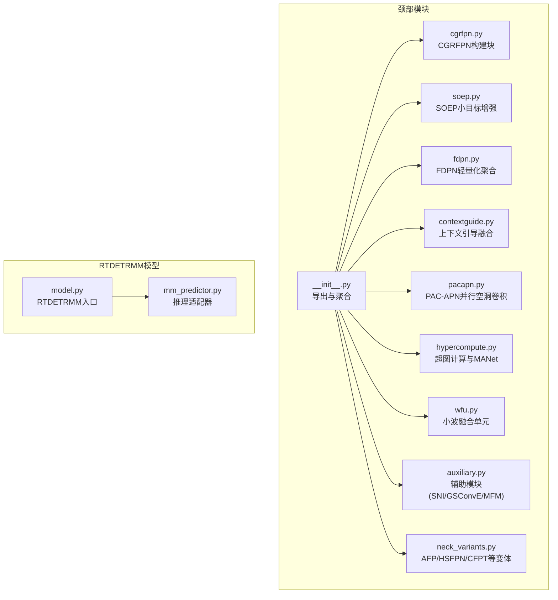

**图表来源**
- [ultralytics\nn\Neck\__init__.py:1-107](file://ultralytics\nn\Neck\__init__.py#L1-L107)
- [ultralytics\nn\Neck\cgrfpn.py:1-189](file://ultralytics\nn\Neck\cgrfpn.py#L1-L189)
- [ultralytics\nn\Neck\soep.py:1-196](file://ultralytics\nn\Neck\soep.py#L1-L196)
- [ultralytics\nn\Neck\fdpn.py:1-45](file://ultralytics\nn\Neck\fdpn.py#L1-L45)
- [ultralytics\nn\Neck\contextguide.py:1-48](file://ultralytics\nn\Neck\contextguide.py#L1-L48)
- [ultralytics\nn\Neck\pacapn.py:1-76](file://ultralytics\nn\Neck\pacapn.py#L1-L76)
- [ultralytics\nn\Neck\hypercompute.py:1-190](file://ultralytics\nn\Neck\hypercompute.py#L1-L190)
- [ultralytics\nn\Neck\wfu.py:1-86](file://ultralytics\nn\Neck\wfu.py#L1-L86)
- [ultralytics\nn\Neck\auxiliary.py:1-187](file://ultralytics\nn\Neck\auxiliary.py#L1-L187)
- [ultralytics\nn\Neck\neck_variants.py:1-800](file://ultralytics\nn\Neck\neck_variants.py#L1-L800)
- [ultralytics\models\rtdetrmm\model.py:1-269](file://ultralytics\models\rtdetrmm\model.py#L1-L269)
- [ultralytics\models\rtdetrmm\mm_predictor.py:1-136](file://ultralytics\models\rtdetrmm\mm_predictor.py#L1-L136)

**章节来源**
- [ultralytics\nn\Neck\__init__.py:1-107](file://ultralytics\nn\Neck\__init__.py#L1-L107)
- [ultralytics\models\rtdetrmm\model.py:1-269](file://ultralytics\models\rtdetrmm\model.py#L1-L269)

## 核心组件
- CGRFPN（上下文-金字塔融合）：通过金字塔池化聚合多尺度特征，结合矩形上下文注意力与MLP实现通道混合，适合多尺度目标检测。
- SOEP（小目标增强金字塔）：包含空间到深度卷积、频率门控、OmniKernel与CSP-OmniKernel，强调小目标细节与多方向边缘信息。
- FDPN（焦点扩散金字塔）：轻量化特征聚合，利用上采样、深度卷积组与ADown进行多核融合。
- ContextGuideFusionModule（上下文引导融合）：基于SE注意力的双向特征融合，平衡高/低分辨率特征。
- PAC-APN（并行空洞卷积-注意力金字塔）：并行空洞卷积聚合上下文，配合CSP瓶颈与注意力上/下采样。
- HyperComputeModule与MANet系列：超图消息传递与多分支星块，提升长程依赖与特征表达。
- WFU（小波融合单元）：Haar小波变换与逆变换，融合高分辨率与低分辨率引导特征。
- 辅助模块（SNI、GSConvE、MFM）：软最近邻插值、增强GSConv与多尺度特征调制，改善对齐与自适应融合。
- 颈部变体（AFP/HSFPN/CFPT/Fusion/GLSA/PSFM等）：提供加权/自适应/拼接/BiFPN/SDI等多种融合策略与频域融合方案。

**章节来源**
- [ultralytics\nn\Neck\cgrfpn.py:1-189](file://ultralytics\nn\Neck\cgrfpn.py#L1-L189)
- [ultralytics\nn\Neck\soep.py:1-196](file://ultralytics\nn\Neck\soep.py#L1-L196)
- [ultralytics\nn\Neck\fdpn.py:1-45](file://ultralytics\nn\Neck\fdpn.py#L1-L45)
- [ultralytics\nn\Neck\contextguide.py:1-48](file://ultralytics\nn\Neck\contextguide.py#L1-L48)
- [ultralytics\nn\Neck\pacapn.py:1-76](file://ultralytics\nn\Neck\pacapn.py#L1-L76)
- [ultralytics\nn\Neck\hypercompute.py:1-190](file://ultralytics\nn\Neck\hypercompute.py#L1-L190)
- [ultralytics\nn\Neck\wfu.py:1-86](file://ultralytics\nn\Neck\wfu.py#L1-L86)
- [ultralytics\nn\Neck\auxiliary.py:1-187](file://ultralytics\nn\Neck\auxiliary.py#L1-L187)
- [ultralytics\nn\Neck\neck_variants.py:1-800](file://ultralytics\nn\Neck\neck_variants.py#L1-L800)

## 架构总览
下图展示了典型多模态检测中“骨干→颈部→头部”的数据流，以及不同颈部模块的可插拔特性。RTDETRMM 通过独立入口与推理适配器，支持RGB与X模态的多路输入与路由。

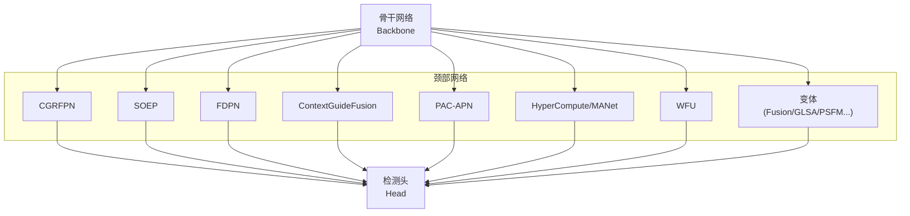

**图表来源**
- [ultralytics\nn\Neck\__init__.py:1-107](file://ultralytics\nn\Neck\__init__.py#L1-L107)
- [ultralytics\nn\Neck\cgrfpn.py:1-189](file://ultralytics\nn\Neck\cgrfpn.py#L1-L189)
- [ultralytics\nn\Neck\soep.py:1-196](file://ultralytics\nn\Neck\soep.py#L1-L196)
- [ultralytics\nn\Neck\fdpn.py:1-45](file://ultralytics\nn\Neck\fdpn.py#L1-L45)
- [ultralytics\nn\Neck\contextguide.py:1-48](file://ultralytics\nn\Neck\contextguide.py#L1-L48)
- [ultralytics\nn\Neck\pacapn.py:1-76](file://ultralytics\nn\Neck\pacapn.py#L1-L76)
- [ultralytics\nn\Neck\hypercompute.py:1-190](file://ultralytics\nn\Neck\hypercompute.py#L1-L190)
- [ultralytics\nn\Neck\wfu.py:1-86](file://ultralytics\nn\Neck\wfu.py#L1-L86)
- [ultralytics\nn\Neck\neck_variants.py:1-800](file://ultralytics\nn\Neck\neck_variants.py#L1-L800)

## 详细组件分析

### CGRFPN（上下文-金字塔融合）
- 设计要点
  - 多尺度输入的自适应金字塔池化与拼接
  - 矩形上下文注意力（RCA）与BN+MLP通道混合
  - 多阶段上下文提取与通道拆分输出
- 数据流
  - 输入多尺度特征列表
  - 金字塔池化聚合 → 多次RCA+MLP → 按通道维度拆分输出
- 适用场景
  - 多尺度目标检测，强调上下文感知与通道语义混合

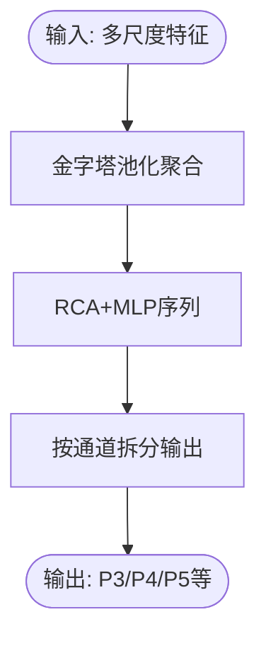

**图表来源**
- [ultralytics\nn\Neck\cgrfpn.py:27-154](file://ultralytics\nn\Neck\cgrfpn.py#L27-L154)

**章节来源**
- [ultralytics\nn\Neck\cgrfpn.py:1-189](file://ultralytics\nn\Neck\cgrfpn.py#L1-L189)

### SOEP（小目标增强金字塔）
- 设计要点
  - SPDConv：空间到深度重排，降低通道数同时保留信息
  - OmniKernel：多尺度卷积核+频率注意+FCA+SCA+FGM
  - CSP-OmniKernel：CSP结构与OmniKernel组合，兼顾效率与效果
- 数据流
  - SPDConv降维 → OmniKernel多方向特征融合 → CSP-OmniKernel进一步优化

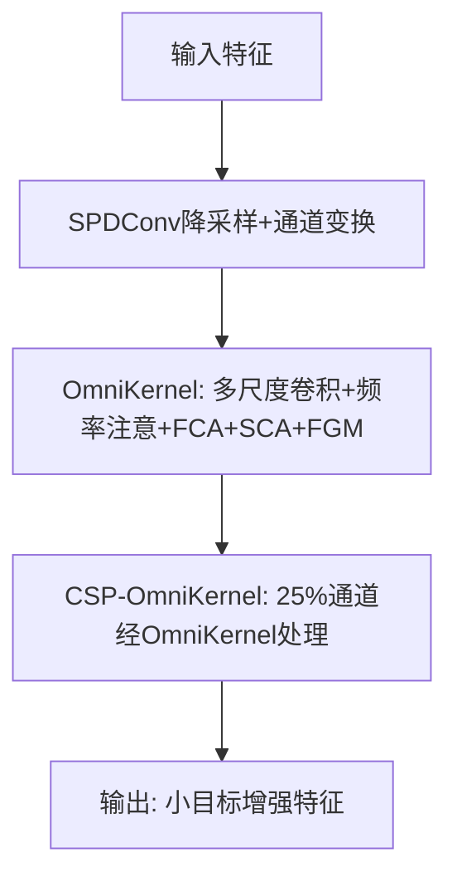

**图表来源**
- [ultralytics\nn\Neck\soep.py:13-196](file://ultralytics\nn\Neck\soep.py#L13-L196)

**章节来源**
- [ultralytics\nn\Neck\soep.py:1-196](file://ultralytics\nn\Neck\soep.py#L1-L196)

### FDPN（焦点扩散金字塔）
- 设计要点
  - FocusFeature：上采样、通道对齐、多核深度卷积堆叠、逐元素残差
  - 适用于轻量化多尺度特征融合
- 数据流
  - 三输入（P3/P4/P5）分别上采样/下采样/对齐 → 多核DW卷积堆叠 → PW融合 → 残差

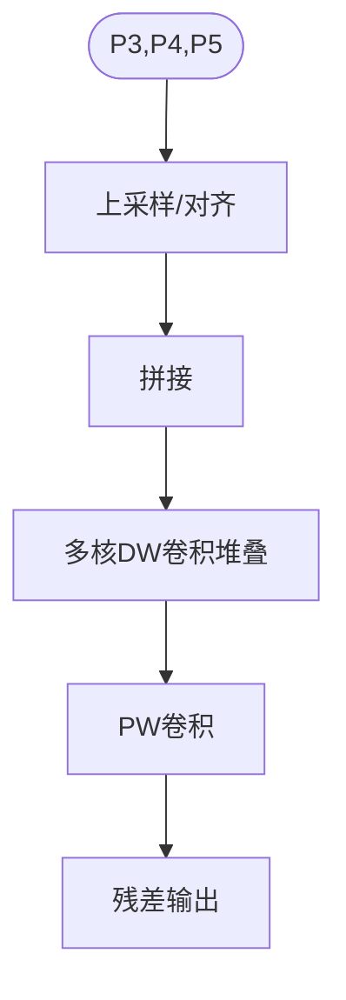

**图表来源**
- [ultralytics\nn\Neck\fdpn.py:12-45](file://ultralytics\nn\Neck\fdpn.py#L12-L45)

**章节来源**
- [ultralytics\nn\Neck\fdpn.py:1-45](file://ultralytics\nn\Neck\fdpn.py#L1-L45)

### ContextGuideFusionModule（上下文引导融合）
- 设计要点
  - 两路特征通道对齐 → SE注意力融合 → 双向加权拼接
- 数据流
  - 调整通道 → SE注意力 → 拆分权重 → 加权融合 → 拼接输出

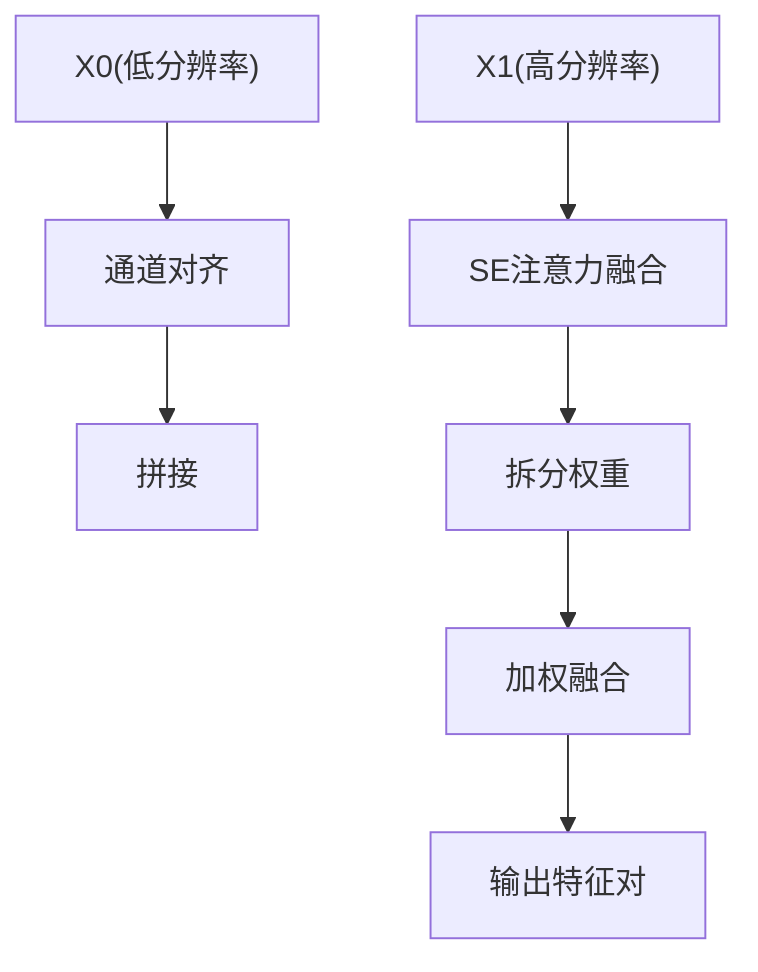

**图表来源**
- [ultralytics\nn\Neck\contextguide.py:29-48](file://ultralytics\nn\Neck\contextguide.py#L29-L48)

**章节来源**
- [ultralytics\nn\Neck\contextguide.py:1-48](file://ultralytics\nn\Neck\contextguide.py#L1-L48)

### PAC-APN（并行空洞卷积-注意力金字塔）
- 设计要点
  - 并行空洞卷积聚合上下文
  - CSP瓶颈整合多分支
  - 注意力上/下采样保持分辨率一致性
- 数据流
  - 并行空洞卷积 → CSP瓶颈 → 注意力上/下采样 → 融合输出

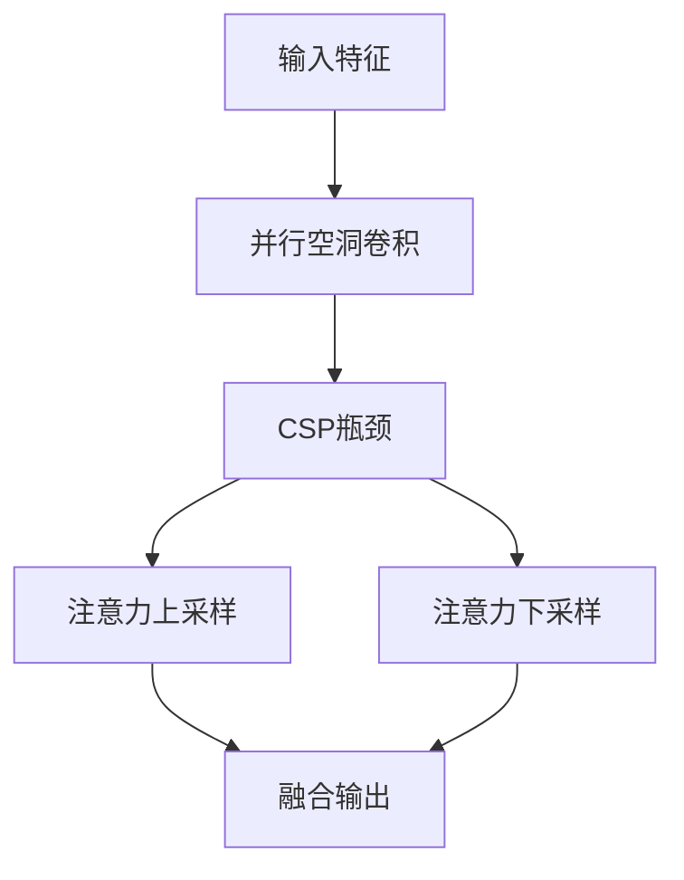

**图表来源**
- [ultralytics\nn\Neck\pacapn.py:11-76](file://ultralytics\nn\Neck\pacapn.py#L11-L76)

**章节来源**
- [ultralytics\nn\Neck\pacapn.py:1-76](file://ultralytics\nn\Neck\pacapn.py#L1-L76)

### HyperComputeModule 与 MANet 系列
- 设计要点
  - 超图消息传递：节点距离构建邻接，v→e与e→v消息聚合
  - MANet：多分支与残差块组合，支持多种变体（Star、Faster、FasterCGLU）
- 数据流
  - 展平为节点 → 计算距离构造邻接 → 消息聚合 → 激活与残差

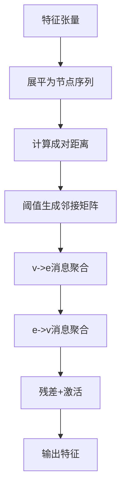

**图表来源**
- [ultralytics\nn\Neck\hypercompute.py:38-63](file://ultralytics\nn\Neck\hypercompute.py#L38-L63)

**章节来源**
- [ultralytics\nn\Neck\hypercompute.py:1-190](file://ultralytics\nn\Neck\hypercompute.py#L1-L190)

### WFU（小波融合单元）
- 设计要点
  - Haar小波变换/逆变换分解高频/低频
  - 低分辨率引导与高分辨率融合
- 数据流
  - 小波分解 → 高频分量RB残差 → 与引导特征通道变换融合 → 小波重构

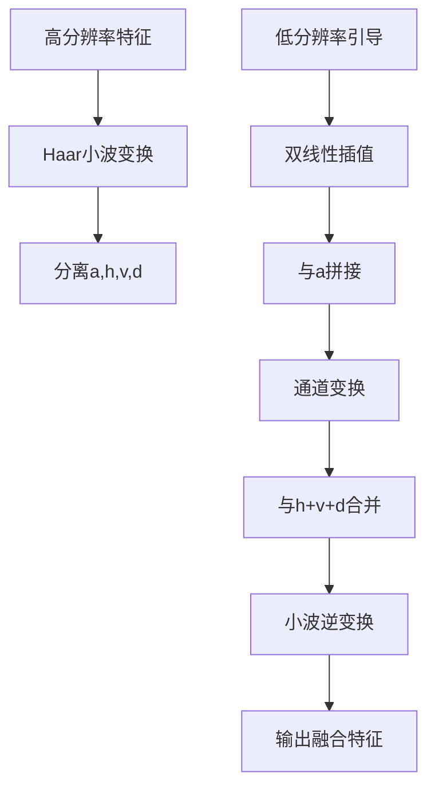

**图表来源**
- [ultralytics\nn\Neck\wfu.py:45-82](file://ultralytics\nn\Neck\wfu.py#L45-L82)

**章节来源**
- [ultralytics\nn\Neck\wfu.py:1-86](file://ultralytics\nn\Neck\wfu.py#L1-L86)

### 辅助模块（SNI、GSConvE、MFM）
- SNI：软最近邻插值，缓解上采样伪影
- GSConvE：双分支增强卷积，丰富感受野与纹理
- MFM：多尺度特征调制，自适应加权融合

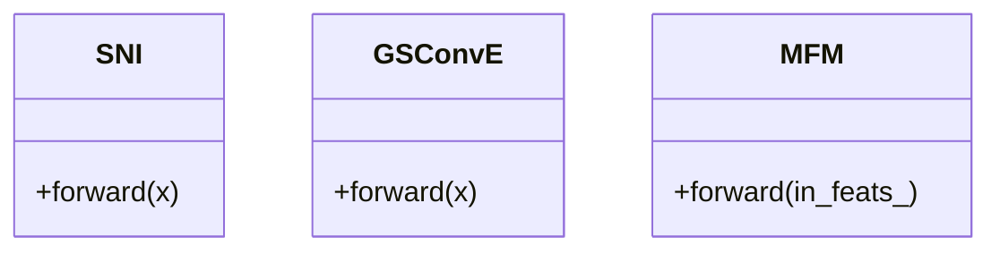

**图表来源**
- [ultralytics\nn\Neck\auxiliary.py:12-187](file://ultralytics\nn\Neck\auxiliary.py#L12-L187)

**章节来源**
- [ultralytics\nn\Neck\auxiliary.py:1-187](file://ultralytics\nn\Neck\auxiliary.py#L1-L187)

### 颈部变体（AFP/HSFPN/CFPT/Fusion/GLSA/PSFM等）
- AFPN/ASFF：多尺度ASFF加权融合，支持P345/P2345
- HS-FPN/CA/ELA/CAA/FSA：通道/空间注意力与改进的金字塔
- CFPT：跨层空间/通道注意力与交叉注意力块
- Fusion/GLSA/PSFM/SDI：加权/自适应/拼接/BiFPN/SDI等融合策略与频域融合

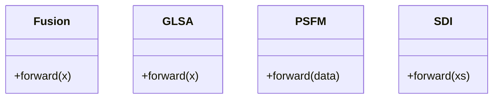

**图表来源**
- [ultralytics\nn\Neck\neck_variants.py:153-190](file://ultralytics\nn\Neck\neck_variants.py#L153-L190)
- [ultralytics\nn\Neck\neck_variants.py:284-314](file://ultralytics\nn\Neck\neck_variants.py#L284-L314)
- [ultralytics\nn\Neck\neck_variants.py:374-388](file://ultralytics\nn\Neck\neck_variants.py#L374-L388)
- [ultralytics\nn\Neck\neck_variants.py:134-151](file://ultralytics\nn\Neck\neck_variants.py#L134-L151)

**章节来源**
- [ultralytics\nn\Neck\neck_variants.py:1-800](file://ultralytics\nn\Neck\neck_variants.py#L1-L800)

## 依赖分析
- 模块内聚与耦合
  - 各颈部模块相对独立，通过统一的导出接口在上层模型中装配
  - 部分模块依赖基础卷积/深度卷积/上采样/下采样等通用算子
- 外部依赖
  - timm.layers.DropPath（可降级为Identity）
  - torch_dct（可选频域工具）
  - FFT（SOEP中的频率门控与频域注意）

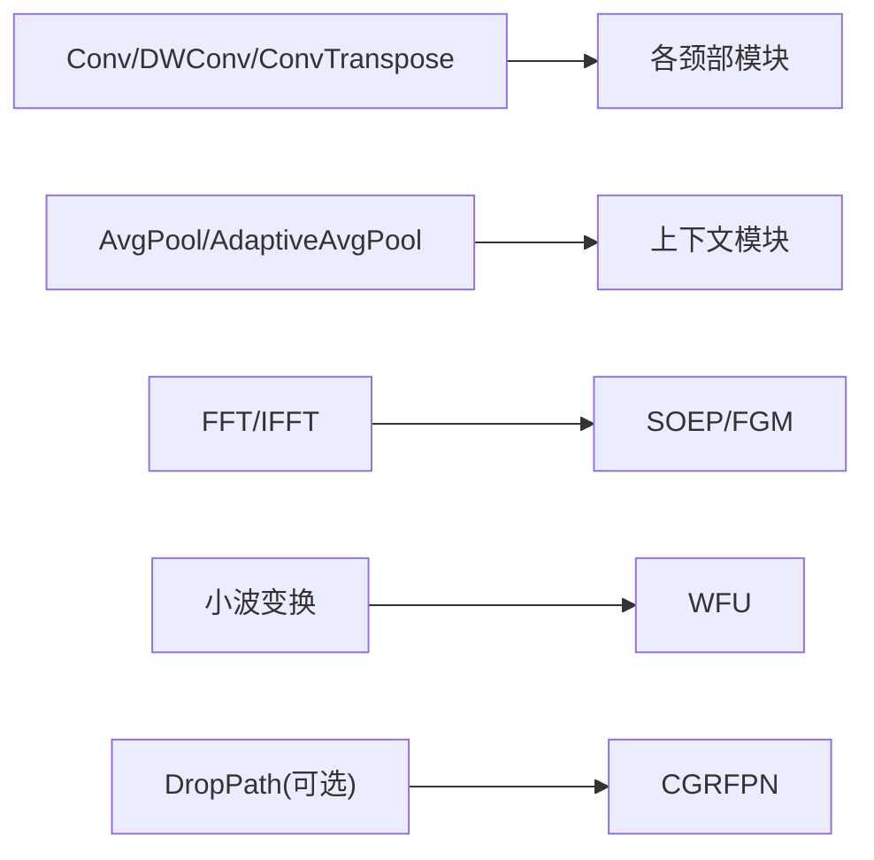

**图表来源**
- [ultralytics\nn\Neck\cgrfpn.py:19-25](file://ultralytics\nn\Neck\cgrfpn.py#L19-L25)
- [ultralytics\nn\Neck\soep.py:70-85](file://ultralytics\nn\Neck\soep.py#L70-L85)
- [ultralytics\nn\Neck\wfu.py:33-43](file://ultralytics\nn\Neck\wfu.py#L33-L43)

**章节来源**
- [ultralytics\nn\Neck\cgrfpn.py:1-189](file://ultralytics\nn\Neck\cgrfpn.py#L1-L189)
- [ultralytics\nn\Neck\soep.py:1-196](file://ultralytics\nn\Neck\soep.py#L1-L196)
- [ultralytics\nn\Neck\wfu.py:1-86](file://ultralytics\nn\Neck\wfu.py#L1-L86)

## 性能考虑
- 计算复杂度
  - CGRFPN：多RCA+MLP，适合多尺度上下文感知
  - SOEP：OmniKernel多核+频率注意，计算开销较高但特征表达强
  - FDPN：轻量化设计，适合资源受限场景
  - HyperCompute：超图消息传递，长程依赖强但计算成本高
- 内存与吞吐
  - 注意力与频域操作可能增加显存占用
  - 小波/FFT等算子在GPU上需注意精度与数值稳定性
- 优化建议
  - 优先在大目标场景使用轻量化模块（FDPN/SNI/MFM）
  - 小目标密集场景引入SOEP/OmniKernel
  - 多尺度融合优先采用BiFPN/SDI等自适应加权策略

## 故障排查指南
- 输入通道不匹配
  - ContextGuideFusionModule要求两路输入通道数，需确保通道对齐或使用1x1卷积调整
- 尺度不一致
  - 注意注意力/插值前后的H/W一致性，必要时进行插值或下采样对齐
- 数值不稳定
  - FFT/小波变换涉及浮点运算，注意dtype与autocast使用
- 超图邻接稀疏
  - 距离阈值过大/过小都会影响邻接质量，建议在验证集上调参

**章节来源**
- [ultralytics\nn\Neck\contextguide.py:32-47](file://ultralytics\nn\Neck\contextguide.py#L32-L47)
- [ultralytics\nn\Neck\soep.py:70-85](file://ultralytics\nn\Neck\soep.py#L70-L85)
- [ultralytics\nn\Neck\hypercompute.py:54-62](file://ultralytics\nn\Neck\hypercompute.py#L54-L62)

## 结论
本仓库的颈部网络模块覆盖了从轻量化到高表达能力的完整谱系，既可满足实时性需求，也能在小目标与多模态场景下提供更强的特征融合能力。通过合理选择与组合（如SOEP+CGRFPN、FDPN+ContextGuide、PAC-APN+HyperCompute），可在不同多模态检测任务中取得更优的精度与效率平衡。

## 附录

### 配置示例与优化建议（基于模块能力）
- 小目标密集场景
  - 推荐：SOEP + OmniKernel + CSP-OmniKernel
  - 理由：多方向边缘与频率注意增强小目标细节
- 轻量化部署
  - 推荐：FDPN + SNI + MFM
  - 理由：计算开销低，插值与自适应融合兼顾
- 多尺度融合
  - 推荐：CGRFPN + BiFPN/SDI + ContextGuideFusion
  - 理由：金字塔上下文+自适应加权+双向融合
- 长程依赖
  - 推荐：HyperComputeModule + MANet_Star
  - 理由：超图消息传递+星块提升表达

### RTDETRMM 多模态推理入口
- 入口类：RTDETRMM
- 推理适配器：RTDETRMMPredictor
- 功能：支持RGB与X模态显式输入，桥接旧API与新推理引擎

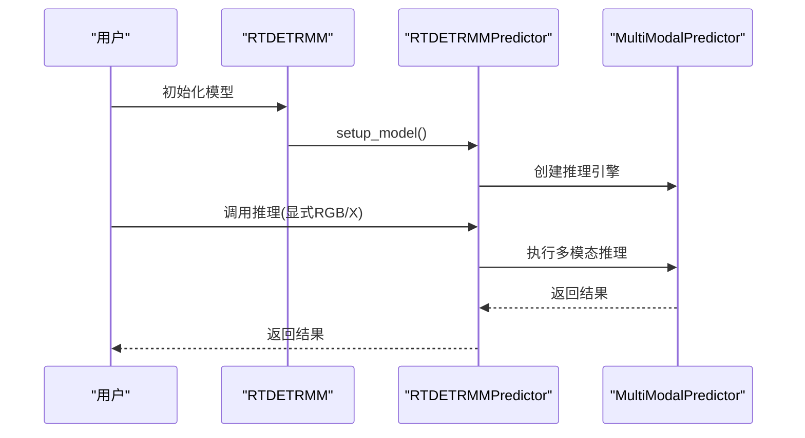

**图表来源**
- [ultralytics\models\rtdetrmm\model.py:25-47](file://ultralytics\models\rtdetrmm\model.py#L25-L47)
- [ultralytics\models\rtdetrmm\mm_predictor.py:45-70](file://ultralytics\models\rtdetrmm\mm_predictor.py#L45-L70)
- [ultralytics\models\rtdetrmm\mm_predictor.py:71-111](file://ultralytics\models\rtdetrmm\mm_predictor.py#L71-L111)