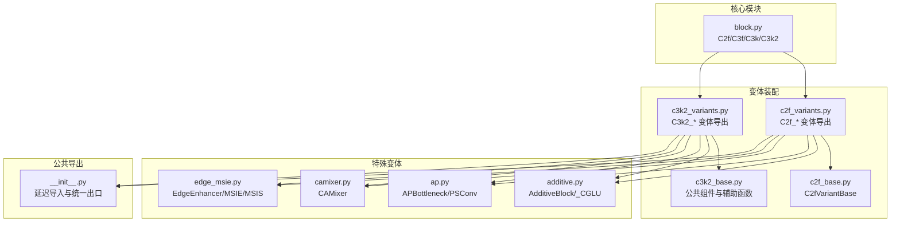
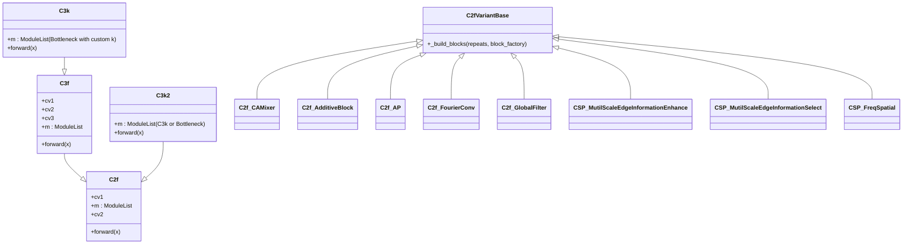
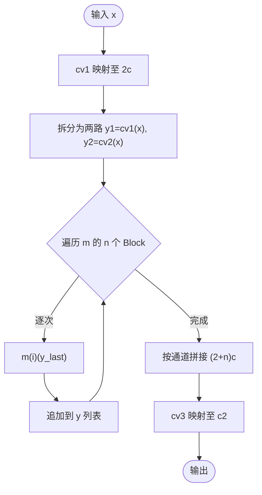
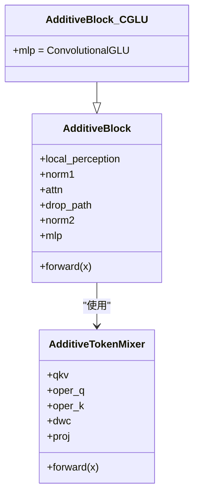
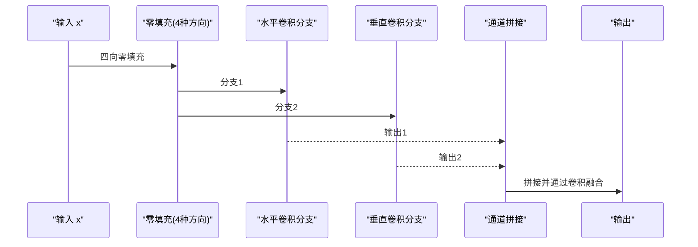
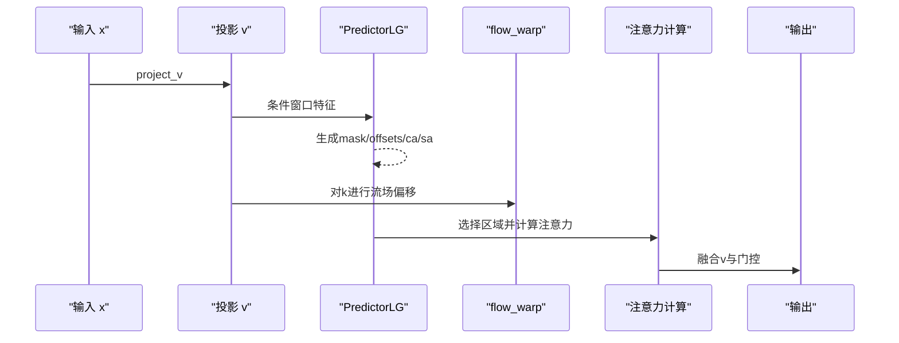
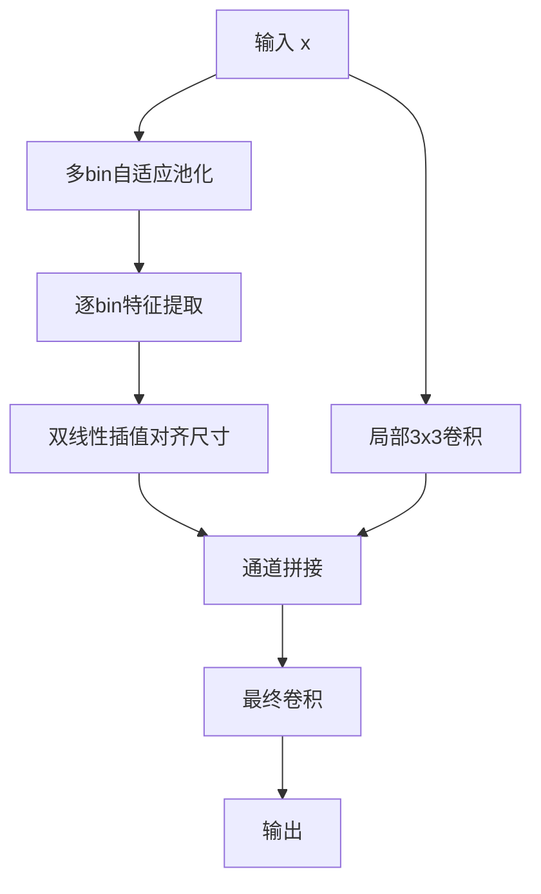
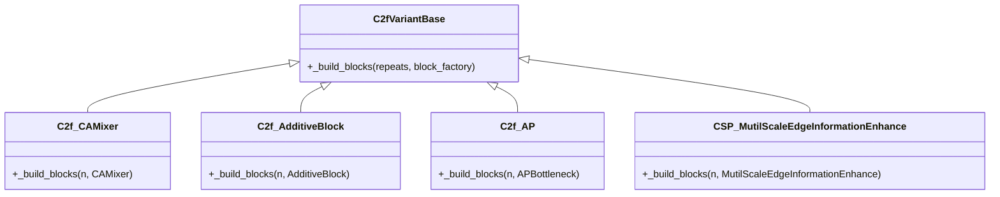
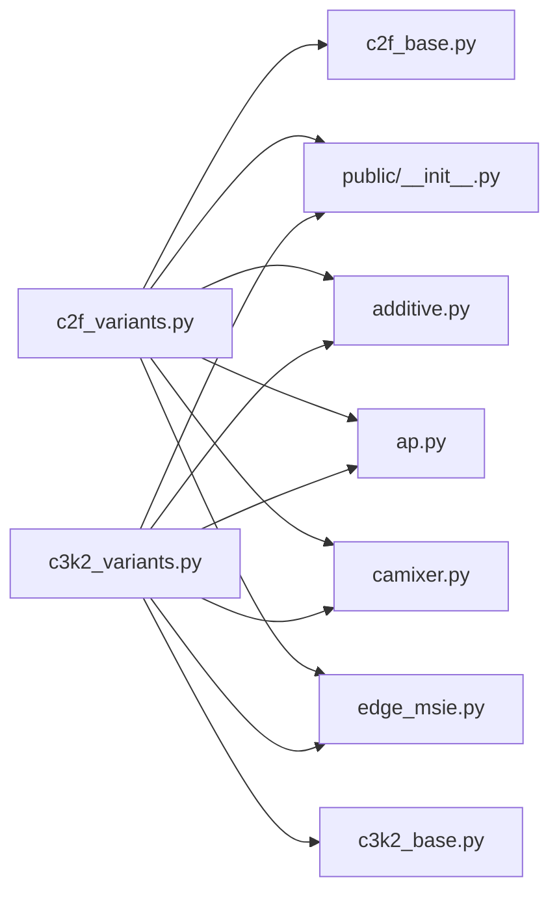

# CSP模块家族

<cite>
**本文档引用的文件**
- [block.py](file://ultralytics\nn\modules\block.py)
- [c2f_base.py](file://ultralytics\nn\extraction\c2f_base.py)
- [c2f_variants.py](file://ultralytics\nn\extraction\c2f_variants.py)
- [c3k2_base.py](file://ultralytics\nn\extraction\c3k2_base.py)
- [c3k2_variants.py](file://ultralytics\nn\extraction\c3k2_variants.py)
- [additive.py](file://ultralytics\nn\public\additive.py)
- [ap.py](file://ultralytics\nn\public\ap.py)
- [camixer.py](file://ultralytics\nn\public\camixer.py)
- [edge_msie.py](file://ultralytics\nn\public\edge_msie.py)
- [__init__.py](file://ultralytics\nn\public\__init__.py)
</cite>

## 目录
1. [简介](#简介)
2. [项目结构](#项目结构)
3. [核心组件](#核心组件)
4. [架构总览](#架构总览)
5. [详细组件分析](#详细组件分析)
6. [依赖分析](#依赖分析)
7. [性能考虑](#性能考虑)
8. [故障排查指南](#故障排查指南)
9. [结论](#结论)
10. [附录](#附录)

## 简介
本文件系统性梳理CSP（Cross Stage Partial）模块家族的设计与实现，重点覆盖：
- 核心CSP变体：C2f、C3f、C3k、C3k2
- 特殊变体：AdditiveBlock、AP模块、CAMixer、多尺度边缘增强/选择模块等
- 特征重用与计算效率优化策略
- 在多模态场景中的应用与融合方式
- 配置方法、参数调优与性能优化建议

## 项目结构
CSP模块家族主要分布在以下路径：
- 核心模块与基础CSP实现：ultralytics\nn\modules\block.py
- C2f/C3k2变体装配与导出：ultralytics\nn\extraction\c2f_variants.py、ultralytics\nn\extraction\c3k2_variants.py
- 变体基础与公共组件：ultralytics\nn\extraction\c2f_base.py、ultralytics\nn\extraction\c3k2_base.py
- 特殊变体模块：ultralytics\nn\public\additive.py、ultralytics\nn\public\ap.py、ultralytics\nn\public\camixer.py、ultralytics\nn\public\edge_msie.py
- 公共模块出口：ultralytics\nn\public\__init__.py

**图表来源**
- [block.py:1120-1193](file://ultralytics\nn\modules\block.py#L1120-L1193)
- [c2f_variants.py:67-133](file://ultralytics\nn\extraction\c2f_variants.py#L67-L133)
- [c3k2_variants.py:94-117](file://ultralytics\nn\extraction\c3k2_variants.py#L94-L117)
- [c2f_base.py:19-42](file://ultralytics\nn\extraction\c2f_base.py#L19-L42)
- [c3k2_base.py:190-192](file://ultralytics\nn\extraction\c3k2_base.py#L190-L192)
- [additive.py:95-137](file://ultralytics\nn\public\additive.py#L95-L137)
- [ap.py:13-48](file://ultralytics\nn\public\ap.py#L13-L48)
- [camixer.py:125-185](file://ultralytics\nn\public\camixer.py#L125-L185)
- [edge_msie.py:27-76](file://ultralytics\nn\public\edge_msie.py#L27-L76)
- [__init__.py:8-113](file://ultralytics\nn\public\__init__.py#L8-L113)

**章节来源**
- [block.py:1120-1193](file://ultralytics\nn\modules\block.py#L1120-L1193)
- [c2f_variants.py:67-133](file://ultralytics\nn\extraction\c2f_variants.py#L67-L133)
- [c3k2_variants.py:94-117](file://ultralytics\nn\extraction\c3k2_variants.py#L94-L117)

## 核心组件
- C2f：两路特征分叉与堆叠，中间模块列表可替换为任意Block变体，实现高度可插拔的CSP结构。
- C3f：C2f的快速实现，采用两路卷积后拼接，适合追求速度的场景。
- C3k：在C3基础上引入可定制核大小，提升特征提取灵活性。
- C3k2：在C3k基础上进一步封装，支持n个Block的重复堆叠，便于批量替换。

这些模块均遵循“cv1→m→cv2→拼接→cv3”的通用模式，通过调整m中的Block类型与数量，实现功能与效率的平衡。

**章节来源**
- [block.py:1120-1193](file://ultralytics\nn\modules\block.py#L1120-L1193)

## 架构总览
CSP模块家族通过“基础CSP + 可插拔Block变体”的架构实现高内聚、低耦合的模块化设计。C2f/C3k2提供统一的装配框架，c2f_variants/c3k2_variants负责将公共变体模块注入到m中，形成丰富的变体组合。

**图表来源**
- [block.py:1120-1193](file://ultralytics\nn\modules\block.py#L1120-L1193)
- [c2f_base.py:19-42](file://ultralytics\nn\extraction\c2f_base.py#L19-L42)
- [c2f_variants.py:130-133](file://ultralytics\nn\extraction\c2f_variants.py#L130-L133)
- [c2f_variants.py:327-337](file://ultralytics\nn\extraction\c2f_variants.py#L327-L337)
- [c2f_variants.py:206-210](file://ultralytics\nn\extraction\c2f_variants.py#L206-L210)
- [c2f_variants.py:243-249](file://ultralytics\nn\extraction\c2f_variants.py#L243-L249)
- [c2f_variants.py:251-257](file://ultralytics\nn\extraction\c2f_variants.py#L251-L257)
- [c2f_variants.py:444-466](file://ultralytics\nn\extraction\c2f_variants.py#L444-L466)

## 详细组件分析

### C2f/C3f/C3k/C3k2：CSP骨架与快速实现
- 结构要点
  - C2f：cv1将输入映射至2c；m为n个Block；cv2将(2+n)c拼接映射回c2。
  - C3f：与C2f类似，但cv1/cv2/cv3结构更紧凑，适合快速实现。
  - C3k：在C3基础上将m替换为带自定义核大小的Bottleneck序列。
  - C3k2：在C3k基础上封装n次重复，支持C3k或Bottleneck两种子模块。

- 特性与权衡
  - 特征重用：通过cv1/cv2的两路映射与m的堆叠，实现信息在不同阶段的多次利用。
  - 计算效率：C3f在相同参数下减少一次卷积映射，提升吞吐；C3k通过可变核提升感受野灵活性。

**图表来源**
- [block.py:1120-1146](file://ultralytics\nn\modules\block.py#L1120-L1146)

**章节来源**
- [block.py:1120-1193](file://ultralytics\nn\modules\block.py#L1120-L1193)

### AdditiveBlock 与 AdditiveBlock_CGLU：加性注意力块
- 设计思想
  - AdditiveTokenMixer：通过Q+K的加性融合与深度可分离卷积实现轻量注意力。
  - MLP采用Mlp_CASVIT或ConvolutionalGLU，结合DropPath与归一化层，稳定训练。

- 应用场景
  - 需要轻量注意力且对显存敏感的任务；与C2f/C3k2组合可提升特征表达能力。

**图表来源**
- [additive.py:75-137](file://ultralytics\nn\public\additive.py#L75-L137)

**章节来源**
- [additive.py:95-137](file://ultralytics\nn\public\additive.py#L95-L137)

### AP 模块：非对称填充瓶颈（Asymmetric Padding）
- 设计思想
  - PSConv：通过四个方向的零填充与并行卷积，模拟“风车形”感受野。
  - APBottleneck：在PSConv基础上进行通道拼接与残差连接，提升表达能力。

- 应用场景
  - 需要更大感受野但不显著增加参数量的任务；适合与C2f/C3k2组合。

**图表来源**
- [ap.py:13-48](file://ultralytics\nn\public\ap.py#L13-L48)

**章节来源**
- [ap.py:13-48](file://ultralytics\nn\public\ap.py#L13-L48)

### CAMixer：条件感知混合器
- 设计思想
  - PredictorLG：在窗口内预测掩码与偏移，动态选择重要区域。
  - 流场偏移：根据offset对k进行形变采样，增强跨位置交互。
  - 通道/空间门控：结合CA/SA门控，抑制冗余信息。

- 应用场景
  - 需要自适应区域选择与形变建模的任务；适合多尺度特征融合。

**图表来源**
- [camixer.py:125-185](file://ultralytics\nn\public\camixer.py#L125-L185)

**章节来源**
- [camixer.py:125-185](file://ultralytics\nn\public\camixer.py#L125-L185)

### 多尺度边缘信息增强/选择模块
- EdgeEnhancer：通过局部平均池化与非线性映射生成边缘掩码，增强边缘特征。
- MutilScaleEdgeInformationEnhance：在多个bin上自适应聚合，融合局部与全局边缘信息。
- MutilScaleEdgeInformationSelect：在增强基础上引入DualDomainSelectionMechanism，进行选择性融合。

**图表来源**
- [edge_msie.py:27-76](file://ultralytics\nn\public\edge_msie.py#L27-L76)

**章节来源**
- [edge_msie.py:14-76](file://ultralytics\nn\public\edge_msie.py#L14-L76)

### CSP变体装配与导出
- C2fVariantBase：提供统一的_block工厂注入机制，仅需替换m中的Block类型即可完成变体迁移。
- c2f_variants/c3k2_variants：集中导出各类变体，涵盖注意力、卷积、边缘增强、频域等模块。

**图表来源**
- [c2f_base.py:19-42](file://ultralytics\nn\extraction\c2f_base.py#L19-L42)
- [c2f_variants.py:130-133](file://ultralytics\nn\extraction\c2f_variants.py#L130-L133)
- [c2f_variants.py:327-337](file://ultralytics\nn\extraction\c2f_variants.py#L327-L337)
- [c2f_variants.py:206-210](file://ultralytics\nn\extraction\c2f_variants.py#L206-L210)
- [c2f_variants.py:452-458](file://ultralytics\nn\extraction\c2f_variants.py#L452-L458)

**章节来源**
- [c2f_base.py:19-42](file://ultralytics\nn\extraction\c2f_base.py#L19-L42)
- [c2f_variants.py:67-133](file://ultralytics\nn\extraction\c2f_variants.py#L67-L133)
- [c2f_variants.py:444-466](file://ultralytics\nn\extraction\c2f_variants.py#L444-L466)

## 依赖分析
- 组件耦合
  - C2f/C3k2依赖于公共Block变体（如AdditiveBlock、APBottleneck、CAMixer等），通过C2fVariantBase统一注入，降低直接耦合。
  - c3k2_base提供大量公共组件与DBB等重参数化工具，支撑C3k2变体的多样性。
- 导入策略
  - public/__init__.py采用延迟导入，避免循环依赖并统一导出接口。

**图表来源**
- [c2f_variants.py:67-133](file://ultralytics\nn\extraction\c2f_variants.py#L67-L133)
- [c3k2_variants.py:94-117](file://ultralytics\nn\extraction\c3k2_variants.py#L94-L117)
- [c3k2_base.py:190-192](file://ultralytics\nn\extraction\c3k2_base.py#L190-L192)
- [__init__.py:8-113](file://ultralytics\nn\public\__init__.py#L8-L113)

**章节来源**
- [c2f_variants.py:67-133](file://ultralytics\nn\extraction\c2f_variants.py#L67-L133)
- [c3k2_variants.py:94-117](file://ultralytics\nn\extraction\c3k2_variants.py#L94-L117)
- [__init__.py:8-113](file://ultralytics\nn\public\__init__.py#L8-L113)

## 性能考虑
- 特征重用与计算效率
  - C3f通过减少一次映射提升吞吐；C2f/C3k2通过m的堆叠实现阶段性特征复用。
  - AdditiveBlock/CAMixer等轻量模块可在不显著增加参数的情况下提升表达能力。
- 参数与显存
  - 优先选择C3f/C3k2替代深层CSP可降低显存占用。
  - AP模块通过非对称填充扩大感受野，兼顾效率与表达。
- 训练稳定性
  - AdditiveBlock使用DropPath与归一化层，有助于稳定训练过程。
- 推理部署
  - c3k2_base提供DBB等重参数化工具，可在部署阶段融合BN/卷积，减少推理开销。

[本节为通用指导，无需特定文件引用]

## 故障排查指南
- 输入通道与输出通道不匹配
  - 现象：初始化时报错或forward失败。
  - 排查：确认c1/c2与各cv层通道设置一致；检查n是否导致拼接通道数异常。
- 维度不一致（如频域/形状）
  - 现象：FourierConv/GlobalFilter等模块报错。
  - 排查：确保传入size/den等必需参数与特征图尺寸一致。
- CUDA扩展缺失
  - 现象：某些变体在无CUDA环境下无法加载。
  - 排查：使用c2f_variants中“no-CUDA extras”批次的替代实现（如C2f_HFERB等）。

**章节来源**
- [c2f_variants.py:243-249](file://ultralytics\nn\extraction\c2f_variants.py#L243-L249)
- [c2f_variants.py:251-257](file://ultralytics\nn\extraction\c2f_variants.py#L251-L257)
- [c2f_variants.py:378-382](file://ultralytics\nn\extraction\c2f_variants.py#L378-L382)

## 结论
CSP模块家族通过“骨架统一 + 变体可插拔”的设计，在保证结构一致性的同时提供了极高的灵活性。C2f/C3k2作为骨干，配合AdditiveBlock、AP、CAMixer、边缘增强/选择等变体，既能在速度与参数上取得平衡，又能在表达能力上持续增强。在多模态任务中，可通过CSP变体与公共模块的组合实现跨模态特征融合与自适应选择，满足多样化的工程需求。

[本节为总结性内容，无需特定文件引用]

## 附录

### 配置与使用示例（路径指引）
- C2f_CAMixer
  - [c2f_variants.py:130-133](file://ultralytics\nn\extraction\c2f_variants.py#L130-L133)
- C2f_AdditiveBlock / C2f_AdditiveBlock_CGLU
  - [c2f_variants.py:327-337](file://ultralytics\nn\extraction\c2f_variants.py#L327-L337)
- C2f_AP
  - [c2f_variants.py:206-210](file://ultralytics\nn\extraction\c2f_variants.py#L206-L210)
- C2f_FourierConv / C2f_GlobalFilter
  - [c2f_variants.py:243-249](file://ultralytics\nn\extraction\c2f_variants.py#L243-L249)
  - [c2f_variants.py:251-257](file://ultralytics\nn\extraction\c2f_variants.py#L251-L257)
- CSP_MutilScaleEdgeInformationEnhance / CSP_MutilScaleEdgeInformationSelect / CSP_FreqSpatial
  - [c2f_variants.py:444-466](file://ultralytics\nn\extraction\c2f_variants.py#L444-L466)

### 参数调优与性能优化建议
- 通道比例e与重复次数n
  - e控制隐藏通道数，n控制深度；增大n提升表达但增加计算；合理设置e在精度与效率间折中。
- Block选择
  - 轻量任务优先C3f/C3k2；需要注意力时选用AdditiveBlock/CAMixer；追求大感受野时选用AP。
- 部署优化
  - 使用c3k2_base中的DBB等重参数化工具，部署阶段融合BN/卷积，减少推理分支。

[本节为通用指导，无需特定文件引用]