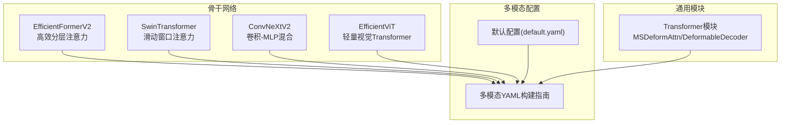
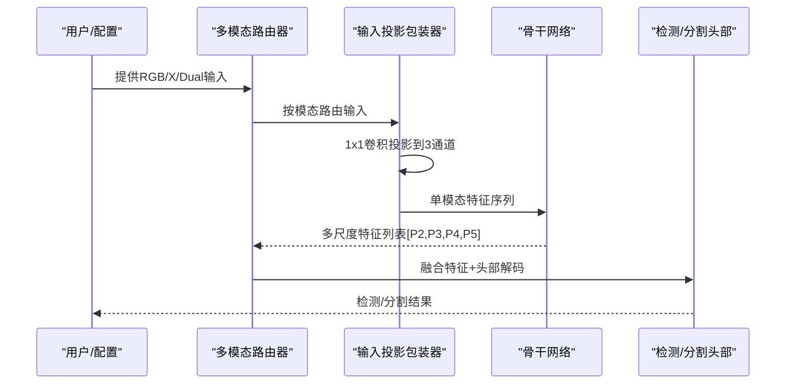
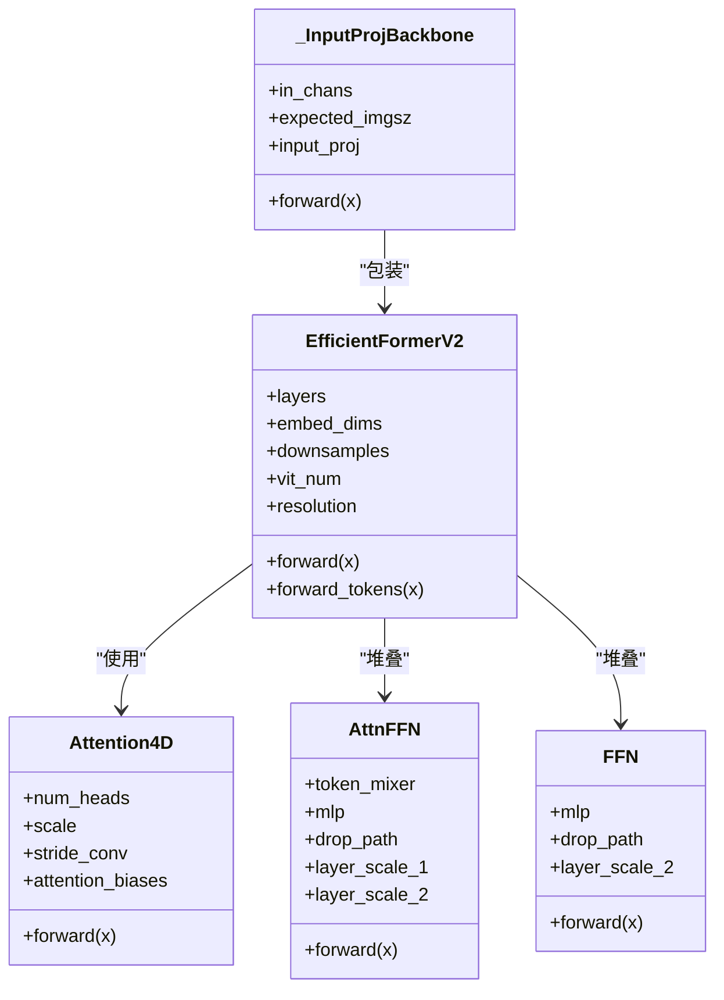
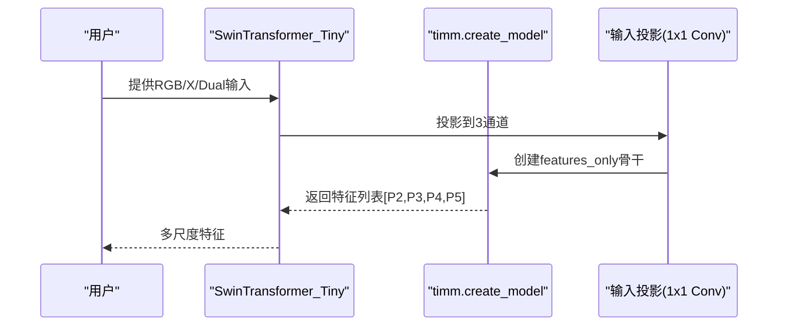
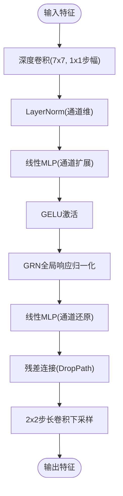
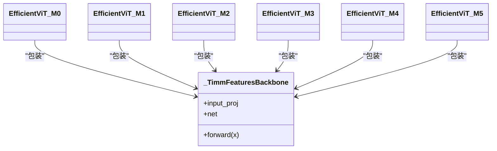
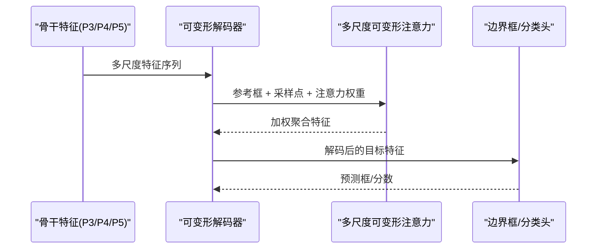
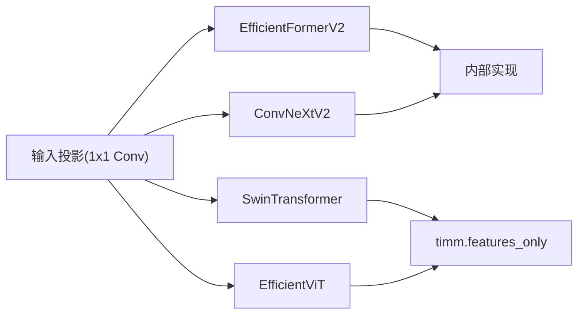

# Transformer骨干网络

<cite>
**本文档引用的文件**
- [EfficientFormerV2.py](file://ultralytics/nn/backbone/EfficientFormerV2.py)
- [SwinTransformer.py](file://ultralytics/nn/backbone/SwinTransformer.py)
- [convnextv2.py](file://ultralytics/nn/backbone/convnextv2.py)
- [efficientViT.py](file://ultralytics/nn/backbone/efficientViT.py)
- [transformer.py](file://ultralytics/nn/modules/transformer.py)
- [多模态YAML构建指点.md](file://ultralytics/cfg/models/多模态YAML构建指点.md)
- [default.yaml](file://ultralytics/cfg/default.yaml)
- [tasks.py](file://ultralytics/nn/tasks.py)
</cite>

## 目录
1. [简介](#简介)
2. [项目结构](#项目结构)
3. [核心组件](#核心组件)
4. [架构总览](#架构总览)
5. [详细组件分析](#详细组件分析)
6. [依赖关系分析](#依赖关系分析)
7. [性能考量](#性能考量)
8. [故障排查指南](#故障排查指南)
9. [结论](#结论)
10. [附录](#附录)

## 简介
本文件系统化梳理并深入解析现代Transformer骨干网络在多模态场景中的应用，重点覆盖以下四种骨干：EfficientFormerV2、SwinTransformer、ConvNeXtV2、EfficientViT。我们将从设计原理、实现细节、注意力机制、层级特征提取与全局上下文建模等方面进行剖析，并结合多模态配置与使用范式，提供可操作的配置与性能对比建议，帮助读者在不同任务与资源约束下做出合适的选择。

## 项目结构
本项目的Transformer骨干网络主要位于 `ultralytics/nn/backbone/` 目录，配套的通用Transformer模块位于 `ultralytics/nn/modules/`，多模态配置与使用指南位于 `ultralytics/cfg/models/`。整体组织遵循“多模态输入投影 + 单模态骨干 + 多输出特征”的统一范式，确保RGB/X/Dual三路输入在统一接口下工作。

图表来源
- [EfficientFormerV2.py:1-681](file://ultralytics/nn/backbone/EfficientFormerV2.py#L1-L681)
- [SwinTransformer.py:1-83](file://ultralytics/nn/backbone/SwinTransformer.py#L1-L83)
- [convnextv2.py:1-239](file://ultralytics/nn/backbone/convnextv2.py#L1-L239)
- [efficientViT.py:1-118](file://ultralytics/nn/backbone/efficientViT.py#L1-L118)
- [transformer.py:1-642](file://ultralytics/nn/modules/transformer.py#L1-L642)
- [多模态YAML构建指点.md:1-239](file://ultralytics/cfg/models/多模态YAML构建指点.md#L1-L239)
- [default.yaml:1-168](file://ultralytics/cfg/default.yaml#L1-L168)

章节来源
- [多模态YAML构建指点.md:1-239](file://ultralytics/cfg/models/多模态YAML构建指点.md#L1-L239)
- [default.yaml:1-168](file://ultralytics/cfg/default.yaml#L1-L168)

## 核心组件
- EfficientFormerV2：基于4D注意力的高效分层骨干，支持可变扩展比与渐进式ViT块，适合移动端与边缘部署。
- SwinTransformer：基于滑动窗口的Transformer骨干，通过timm features_only实现多输出特征，适合通用视觉任务。
- ConvNeXtV2：卷积-MLP混合架构，采用全局响应归一化与深度可分离卷积，强调稳定性和精度。
- EfficientViT：轻量级视觉Transformer系列，通过timm features_only实现多输出特征，适合资源受限场景。

章节来源
- [EfficientFormerV2.py:467-681](file://ultralytics/nn/backbone/EfficientFormerV2.py#L467-L681)
- [SwinTransformer.py:18-83](file://ultralytics/nn/backbone/SwinTransformer.py#L18-L83)
- [convnextv2.py:94-239](file://ultralytics/nn/backbone/convnextv2.py#L94-L239)
- [efficientViT.py:18-118](file://ultralytics/nn/backbone/efficientViT.py#L18-L118)

## 架构总览
Transformer骨干网络在本项目中的统一接入方式如下：所有骨干均通过一个“输入投影包装器”接收多模态输入（RGB/X/Dual），将其投影到3通道后再进入单模态骨干，骨干返回多尺度特征列表供下游头部使用。这种设计保证了多模态场景下的通道一致性与接口统一。

图表来源
- [SwinTransformer.py:18-57](file://ultralytics/nn/backbone/SwinTransformer.py#L18-L57)
- [convnextv2.py:163-178](file://ultralytics/nn/backbone/convnextv2.py#L163-L178)
- [efficientViT.py:18-57](file://ultralytics/nn/backbone/efficientViT.py#L18-L57)
- [多模态YAML构建指点.md:1-239](file://ultralytics/cfg/models/多模态YAML构建指点.md#L1-L239)

## 详细组件分析

### EfficientFormerV2：高效分层注意力骨干
- 设计要点
  - 4D注意力：在每个注意力头内对空间位置进行偏移编码，形成局部-全局混合的注意力权重。
  - 渐进式ViT块：在深层引入带步长的注意力块，逐步降低分辨率并引入更强大的全局建模能力。
  - 可变扩展比：不同阶段采用不同的MLP扩展比，平衡精度与效率。
  - 层尺度残差：引入层尺度参数，稳定深层训练。
- 关键实现
  - 4D注意力模块：支持stride下采样与上采样，内置Talking Head变换与偏移编码。
  - AttnFFN/FFN：交替堆叠注意力与MLP，支持DropPath与层尺度。
  - eformer_block：根据阶段动态选择AttnFFN或FFN，并注入步长与分辨率。
  - 输入投影包装器：强制输入分辨率与分辨率相关缓存对齐，避免自动resize。
- 适用场景
  - 移动端与边缘设备：S0/S1/S2/L等不同规模版本可按需选择。
  - 多模态早期融合：通过输入投影包装器与RGB通道对齐，适合Dual输入。

图表来源
- [EfficientFormerV2.py:68-151](file://ultralytics/nn/backbone/EfficientFormerV2.py#L68-L151)
- [EfficientFormerV2.py:358-410](file://ultralytics/nn/backbone/EfficientFormerV2.py#L358-L410)
- [EfficientFormerV2.py:412-465](file://ultralytics/nn/backbone/EfficientFormerV2.py#L412-L465)
- [EfficientFormerV2.py:575-613](file://ultralytics/nn/backbone/EfficientFormerV2.py#L575-L613)

章节来源
- [EfficientFormerV2.py:68-151](file://ultralytics/nn/backbone/EfficientFormerV2.py#L68-L151)
- [EfficientFormerV2.py:358-410](file://ultralytics/nn/backbone/EfficientFormerV2.py#L358-L410)
- [EfficientFormerV2.py:412-465](file://ultralytics/nn/backbone/EfficientFormerV2.py#L412-L465)
- [EfficientFormerV2.py:575-613](file://ultralytics/nn/backbone/EfficientFormerV2.py#L575-L613)

### SwinTransformer：滑动窗口注意力骨干
- 设计要点
  - 滑动窗口注意力：在局部窗口内进行注意力计算，显著降低复杂度。
  - features_only：通过timm的features_only接口返回多尺度特征列表。
  - 输入投影：统一将RGB/X/Dual投影到3通道，适配单模态骨干。
- 关键实现
  - _TimmFeaturesBackbone：封装timm.create_model(features_only=True)，返回特征列表。
  - 权重加载：支持从本地权重文件加载状态字典。
  - 输入校验：严格检查输入维度、通道数与模态标记一致性。
- 适用场景
  - 通用视觉任务：图像分类、检测、分割等。
  - 多模态中期/晚期融合：通过特征列表在融合层进行拼接或进一步处理。

图表来源
- [SwinTransformer.py:18-57](file://ultralytics/nn/backbone/SwinTransformer.py#L18-L57)

章节来源
- [SwinTransformer.py:18-57](file://ultralytics/nn/backbone/SwinTransformer.py#L18-L57)

### ConvNeXtV2：卷积-MLP混合骨干
- 设计要点
  - 深度可分离卷积：每层使用7×7深度卷积，强调局部感受野。
  - LayerNorm与Linear MLP：在通道维进行两层线性变换，引入GELU激活与GRN归一化。
  - 下采样层：通过2×2步长卷积实现逐层降采样，输出P2到P5。
  - 层尺度残差：DropPath与层尺度参数提升训练稳定性。
- 关键实现
  - Block：深度卷积 + LayerNorm + 两层线性MLP + GRN + 残差。
  - ConvNeXtV2：四个阶段的下采样层 + 多个Block堆叠。
  - 输入投影包装器：将多模态输入投影到3通道，适配单模态骨干。
- 适用场景
  - 高精度场景：在ImageNet等基准上表现优异。
  - 多模态融合：提供稳定的多尺度特征，适合与RGB特征进行拼接或加权融合。

图表来源
- [convnextv2.py:67-92](file://ultralytics/nn/backbone/convnextv2.py#L67-L92)
- [convnextv2.py:94-150](file://ultralytics/nn/backbone/convnextv2.py#L94-L150)

章节来源
- [convnextv2.py:67-92](file://ultralytics/nn/backbone/convnextv2.py#L67-L92)
- [convnextv2.py:94-150](file://ultralytics/nn/backbone/convnextv2.py#L94-L150)

### EfficientViT：轻量视觉Transformer骨干
- 设计要点
  - 轻量化设计：通过timm提供的轻量级视觉Transformer系列，适合资源受限场景。
  - features_only：返回多尺度特征列表，便于下游融合。
  - 输入投影：统一到3通道，适配单模态骨干。
- 关键实现
  - _TimmFeaturesBackbone：封装timm.create_model(features_only=True)。
  - 多版本：M0到M5，按规模递增，适合不同性能需求。
- 适用场景
  - 边缘部署：M0/M1/M2适合低功耗设备。
  - 多模态早期融合：与RGB通道对齐，适合Dual输入。

图表来源
- [efficientViT.py:18-118](file://ultralytics/nn/backbone/efficientViT.py#L18-L118)

章节来源
- [efficientViT.py:18-118](file://ultralytics/nn/backbone/efficientViT.py#L18-L118)

### 通用Transformer模块与多模态融合
- MSDeformAttn：多尺度可变形注意力，支持参考框与采样点，广泛用于检测/分割的解码器。
- DeformableTransformerDecoder：多层解码器，结合自注意力、跨注意力与FFN，支持训练/推理的不同输出策略。
- 多模态融合范式：通过YAML的第五字段标注输入来源（RGB/X/Dual），在骨干中分别提取特征并在指定层级进行拼接或进一步处理。

图表来源
- [transformer.py:296-420](file://ultralytics/nn/modules/transformer.py#L296-L420)
- [transformer.py:553-642](file://ultralytics/nn/modules/transformer.py#L553-L642)

章节来源
- [transformer.py:296-420](file://ultralytics/nn/modules/transformer.py#L296-L420)
- [transformer.py:553-642](file://ultralytics/nn/modules/transformer.py#L553-L642)
- [多模态YAML构建指点.md:68-118](file://ultralytics/cfg/models/多模态YAML构建指点.md#L68-L118)

## 依赖关系分析
- 统一接口：所有骨干均通过输入投影包装器，确保通道数与分辨率符合单模态骨干要求。
- 外部依赖：SwinTransformer与EfficientViT依赖timm的features_only特性；ConvNeXtV2内部实现不依赖外部库。
- 多模态路由：骨干实例在被创建时即绑定其channel属性，供上层路由与头部使用。

图表来源
- [SwinTransformer.py:28-36](file://ultralytics/nn/backbone/SwinTransformer.py#L28-L36)
- [efficientViT.py:28-36](file://ultralytics/nn/backbone/efficientViT.py#L28-L36)
- [convnextv2.py:170-178](file://ultralytics/nn/backbone/convnextv2.py#L170-L178)
- [EfficientFormerV2.py:585-587](file://ultralytics/nn/backbone/EfficientFormerV2.py#L585-L587)

章节来源
- [SwinTransformer.py:28-36](file://ultralytics/nn/backbone/SwinTransformer.py#L28-L36)
- [efficientViT.py:28-36](file://ultralytics/nn/backbone/efficientViT.py#L28-L36)
- [convnextv2.py:170-178](file://ultralytics/nn/backbone/convnextv2.py#L170-L178)
- [EfficientFormerV2.py:585-587](file://ultralytics/nn/backbone/EfficientFormerV2.py#L585-L587)

## 性能考量
- 计算复杂度
  - EfficientFormerV2：4D注意力在局部窗口内计算，复杂度随窗口大小与头数线性增长，适合移动端。
  - SwinTransformer：滑动窗口注意力显著降低复杂度，适合大规模图像。
  - ConvNeXtV2：深度卷积为主，复杂度与卷积核大小和通道数相关，训练稳定。
  - EfficientViT：轻量级设计，适合边缘设备与低功耗场景。
- 内存占用
  - 所有骨干均返回多尺度特征，内存占用与分辨率、通道数及层数成正比。
  - 输入投影包装器将多模态输入统一到3通道，减少通道不一致带来的额外开销。
- 训练稳定性
  - 层尺度残差与DropPath在EfficientFormerV2与ConvNeXtV2中均有应用，有助于深层训练稳定。
  - EfficientFormerV2的4D注意力包含Talking Head变换，有助于缓解注意力分布退化。

[本节为通用性能讨论，不直接分析具体文件]

## 故障排查指南
- 输入通道不匹配
  - 现象：运行时报错提示期望通道数与实际不符。
  - 排查：检查data.yaml中的Xch设置与Dual输入起点标注；确认输入模态与YAML第5字段一致。
- 分辨率不一致
  - 现象：EfficientFormerV2报错提示分辨率与预期不符。
  - 排查：确保imgsz与骨干构建时的resolution一致，避免自动resize导致的预计算偏差。
- 模块导入失败
  - 现象：timm导入失败或features_only输出类型异常。
  - 排查：安装timm；确认features_only返回为list/tuple且元素均为Tensor。
- 多尺度特征缺失
  - 现象：头部无法获取P2/P3/P4/P5。
  - 排查：检查骨干的out_indices或features_only配置；确认融合层索引正确。

章节来源
- [多模态YAML构建指点.md:206-217](file://ultralytics/cfg/models/多模态YAML构建指点.md#L206-L217)
- [SwinTransformer.py:40-56](file://ultralytics/nn/backbone/SwinTransformer.py#L40-L56)
- [EfficientFormerV2.py:600-611](file://ultralytics/nn/backbone/EfficientFormerV2.py#L600-L611)

## 结论
EfficientFormerV2、SwinTransformer、ConvNeXtV2与EfficientViT代表了现代Transformer骨干网络在效率、精度与资源约束之间的不同取舍。EfficientFormerV2强调局部-全局混合注意力与渐进式建模；SwinTransformer与EfficientViT通过timm features_only实现通用多输出；ConvNeXtV2则以卷积-MLP混合架构强调稳定性与精度。结合多模态统一接口与YAML路由范式，这些骨干能够在RGB+X的多模态场景中灵活适配，为不同任务与硬件条件提供最优解。

[本节为总结性内容，不直接分析具体文件]

## 附录

### 配置与使用示例路径
- 多模态YAML构建指南
  - [多模态YAML构建指点.md:1-239](file://ultralytics/cfg/models/多模态YAML构建指点.md#L1-L239)
- 默认配置
  - [default.yaml:1-168](file://ultralytics/cfg/default.yaml#L1-L168)
- 骨干网络工厂函数
  - [EfficientFormerV2.py:615-681](file://ultralytics/nn/backbone/EfficientFormerV2.py#L615-L681)
  - [SwinTransformer.py:72-83](file://ultralytics/nn/backbone/SwinTransformer.py#L72-L83)
  - [convnextv2.py:184-239](file://ultralytics/nn/backbone/convnextv2.py#L184-L239)
  - [efficientViT.py:72-118](file://ultralytics/nn/backbone/efficientViT.py#L72-L118)
- 多模态骨干注册与约束
  - [tasks.py:3213-3241](file://ultralytics/nn/tasks.py#L3213-L3241)

### 适用场景与性能对比建议
- 高精度+高算力：SwinTransformer或ConvNeXtV2（M3/M4/M5对应更高规模）。
- 资源受限+边缘部署：EfficientFormerV2(S0/S1/S2)或EfficientViT(M0/M1/M2)。
- 多模态早期融合：EfficientFormerV2与EfficientViT均可通过输入投影包装器与RGB对齐。
- 多模态中期融合：SwinTransformer与ConvNeXtV2提供更丰富的多尺度特征，适合在P3/P4/P5层进行拼接。

[本节为通用建议，不直接分析具体文件]