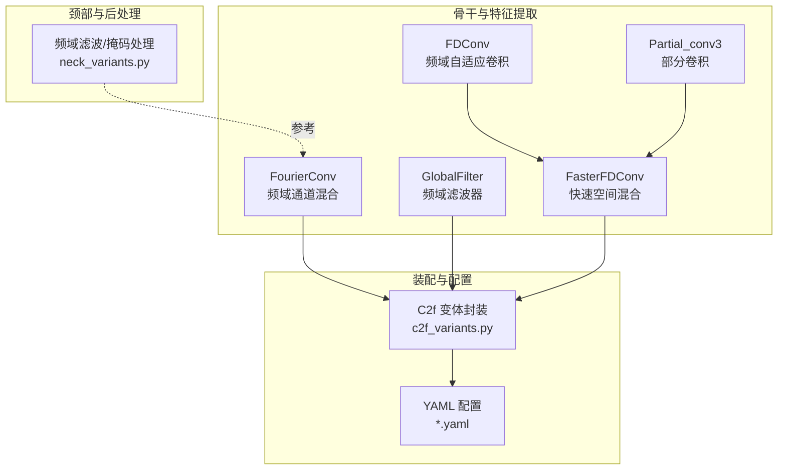
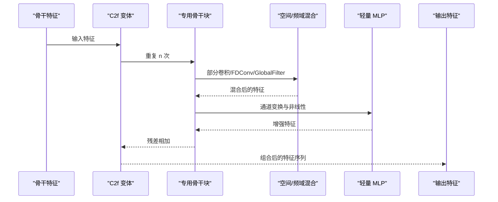
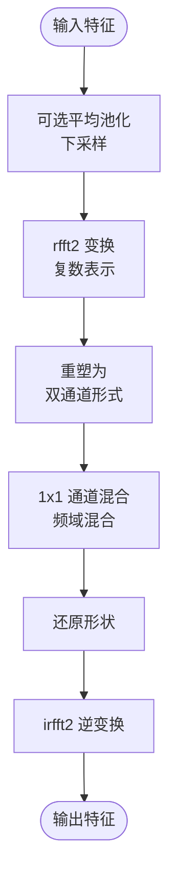
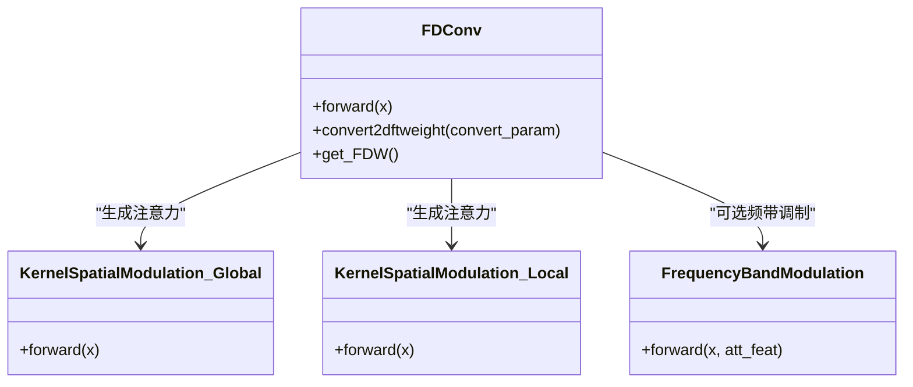
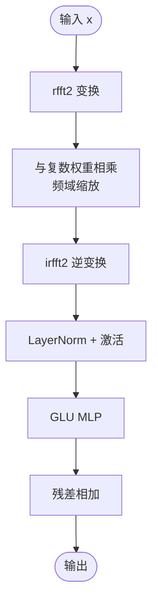
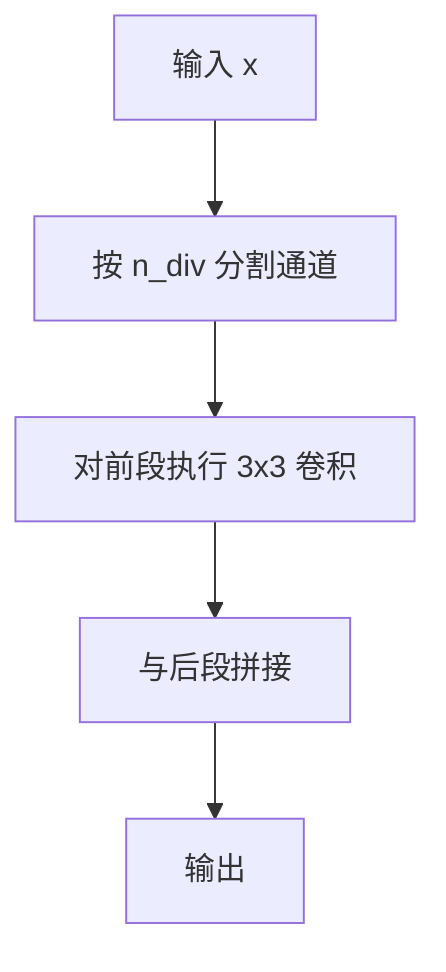
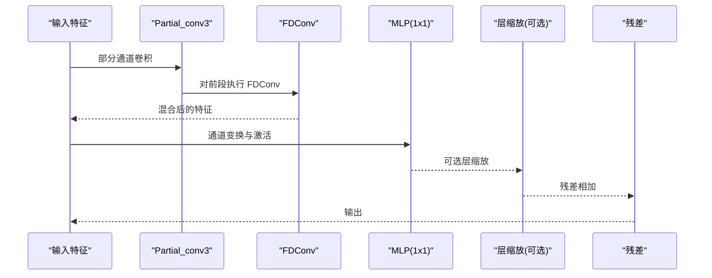
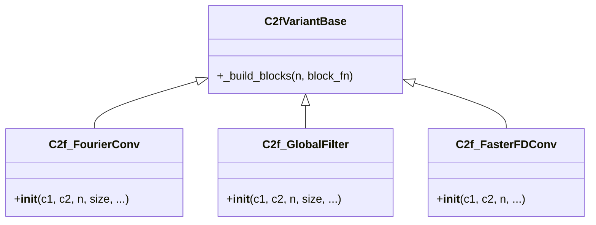
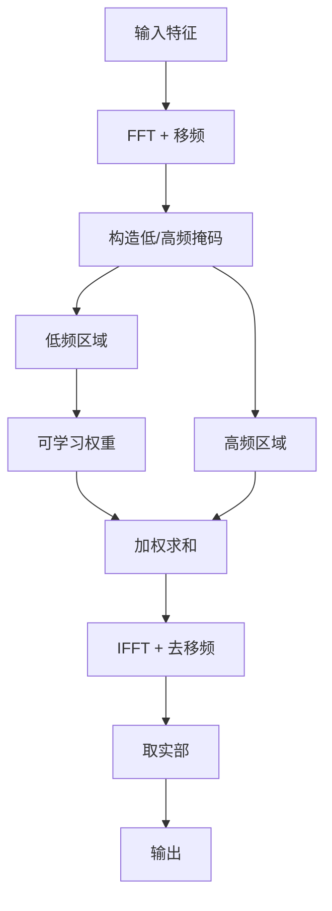
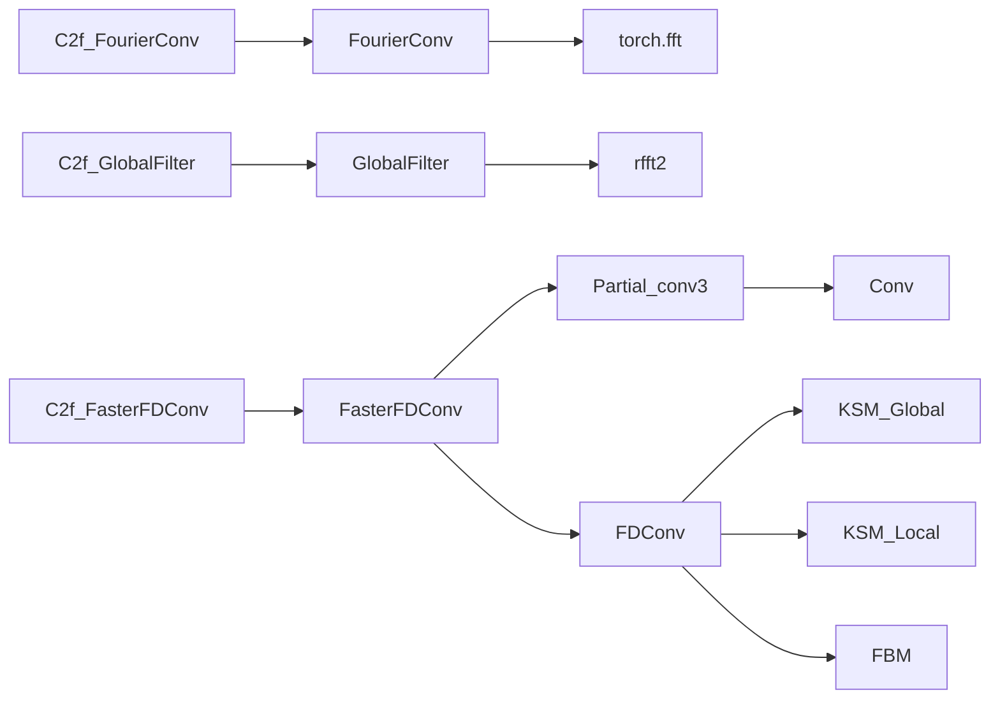

# 专用骨干网络

<cite>
**本文引用的文件**
- [ultralytics\nn\modules\conv.py](file://ultralytics\nn\modules\conv.py)
- [ultralytics\nn\public\fdconv.py](file://ultralytics\nn\public\fdconv.py)
- [ultralytics\nn\public\global_filter.py](file://ultralytics\nn\public\global_filter.py)
- [ultralytics\nn\public\partial_conv.py](file://ultralytics\nn\public\partial_conv.py)
- [ultralytics\nn\public\faster_fdconv.py](file://ultralytics\nn\public\faster_fdconv.py)
- [ultralytics\nn\public\faster_sfsconv.py](file://ultralytics\nn\public\faster_sfsconv.py)
- [ultralytics\nn\public\sfsconv.py](file://ultralytics\nn\public\sfsconv.py)
- [ultralytics\nn\extraction\c2f_variants.py](file://ultralytics\nn\extraction\c2f_variants.py)
- [ultralytics\nn\extraction\c2f_base.py](file://ultralytics\nn\extraction\c2f_base.py)
- [ultralytics\nn\Neck\neck_variants.py](file://ultralytics\nn\Neck\neck_variants.py)
- [ultralytics\cfg\models\rtmm\r18\aifi-dattention-c2f-faster-fdconv.yaml](file://ultralytics\cfg\models\rtmm\r18\aifi-dattention-c2f-faster-fdconv.yaml)
- [ultralytics\cfg\models\rtmm\r18\rtdetr-r18-mm-mid-c2f-globalfilter.yaml](file://ultralytics\cfg\models\rtmm\r18\rtdetr-r18-mm-mid-c2f-globalfilter.yaml)
</cite>

## 目录
1. [引言](#引言)
2. [项目结构](#项目结构)
3. [核心组件](#核心组件)
4. [架构总览](#架构总览)
5. [详细组件分析](#详细组件分析)
6. [依赖分析](#依赖分析)
7. [性能考量](#性能考量)
8. [故障排查指南](#故障排查指南)
9. [结论](#结论)
10. [附录](#附录)

## 引言
本文件聚焦于仓库中的“专用骨干网络”相关实现，系统梳理并解释以下创新卷积与特征提取模块的设计原理与实现细节，并给出在保持计算效率的同时提升特征提取能力的方法论与实践建议：
- 频域卷积：FourierConv
- 快速卷积：FasterFDConv（基于 FDConv 的快速空间混合）
- 全局滤波器：GlobalFilter（频域通道混合）
- 部分卷积：Partial_conv3（通道分组稀疏卷积）

同时，结合 YAML 配置与 C2f 变体封装，说明如何在多模态骨干中集成这些模块，以及在不同场景下的参数调优与性能优化技巧。

## 项目结构
围绕专用骨干网络的关键代码分布在如下位置：
- 核心卷积与模块定义：ultralytics\nn\modules\conv.py
- 高级频域卷积与注意力：ultralytics\nn\public\fdconv.py
- 全局滤波器与频域混合：ultralytics\nn\public\global_filter.py
- 部分卷积与快速路径：ultralytics\nn\public\partial_conv.py、ultralytics\nn\public\faster_fdconv.py、ultralytics\nn\public\faster_sfsconv.py、ultralytics\nn\public\sfsconv.py
- C2f 变体与装配：ultralytics\nn\extraction\c2f_variants.py、ultralytics\nn\extraction\c2f_base.py
- 颈部模块（频域滤波示例）：ultralytics\nn\Neck\neck_variants.py
- YAML 配置样例：ultralytics\cfg\models\rtmm\r18\*.yaml

**图表来源**
- [ultralytics\nn\modules\conv.py](file://ultralytics\nn\modules\conv.py)
- [ultralytics\nn\public\fdconv.py](file://ultralytics\nn\public\fdconv.py)
- [ultralytics\nn\public\global_filter.py](file://ultralytics\nn\public\global_filter.py)
- [ultralytics\nn\public\partial_conv.py](file://ultralytics\nn\public\partial_conv.py)
- [ultralytics\nn\public\faster_fdconv.py](file://ultralytics\nn\public\faster_fdconv.py)
- [ultralytics\nn\extraction\c2f_variants.py](file://ultralytics\nn\extraction\c2f_variants.py)
- [ultralytics\nn\Neck\neck_variants.py](file://ultralytics\nn\Neck\neck_variants.py)

**章节来源**
- [ultralytics\nn\modules\conv.py](file://ultralytics\nn\modules\conv.py)
- [ultralytics\nn\public\fdconv.py](file://ultralytics\nn\public\fdconv.py)
- [ultralytics\nn\public\global_filter.py](file://ultralytics\nn\public\global_filter.py)
- [ultralytics\nn\public\partial_conv.py](file://ultralytics\nn\public\partial_conv.py)
- [ultralytics\nn\public\faster_fdconv.py](file://ultralytics\nn\public\faster_fdconv.py)
- [ultralytics\nn\extraction\c2f_variants.py](file://ultralytics\nn\extraction\c2f_variants.py)
- [ultralytics\nn\Neck\neck_variants.py](file://ultralytics\nn\Neck\neck_variants.py)

## 核心组件
- FourierConv：在频域进行通道混合，支持可选下采样与输出尺寸校验，适合在多尺度骨干中稳定地进行频域特征融合。
- FDConv：基于频域自适应权重的通用卷积模块，包含全局/局部核空间调制与频带调制，按条件启用以平衡性能与参数量。
- GlobalFilter：以可学习复数权重在频域对通道进行缩放，配合归一化与 MLP 形成稳定的特征增强路径。
- Partial_conv3：通道分组稀疏卷积，仅对部分通道执行 3×3 卷积，其余通道直通，降低计算开销。
- FasterFDConv：在 Partial_conv3 基础上引入 FDConv 的快速空间混合，结合轻量 MLP 与残差连接，形成高效骨干单元。

**章节来源**
- [ultralytics\nn\modules\conv.py](file://ultralytics\nn\modules\conv.py)
- [ultralytics\nn\public\fdconv.py](file://ultralytics\nn\public\fdconv.py)
- [ultralytics\nn\public\global_filter.py](file://ultralytics\nn\public\global_filter.py)
- [ultralytics\nn\public\partial_conv.py](file://ultralytics\nn\public\partial_conv.py)
- [ultralytics\nn\public\faster_fdconv.py](file://ultralytics\nn\public\faster_fdconv.py)

## 架构总览
专用骨干网络通过 C2f 变体将上述模块装配为可复用的特征提取单元，典型流程如下：
- 输入特征经由 C2f 组合多个变体块，每个块内部可能包含频域/部分卷积、MLP、残差与可选层缩放。
- 在多模态场景中，可在特定阶段（如 P3 融合后）插入快速骨干块以增强低层特征表达。
- 颈部模块可进一步对频域进行掩码与滤波处理，辅助检测头的多尺度特征融合。

**图表来源**
- [ultralytics\nn\extraction\c2f_variants.py](file://ultralytics\nn\extraction\c2f_variants.py)
- [ultralytics\nn\public\faster_fdconv.py](file://ultralytics\nn\public\faster_fdconv.py)
- [ultralytics\nn\public\fdconv.py](file://ultralytics\nn\public\fdconv.py)
- [ultralytics\nn\public\global_filter.py](file://ultralytics\nn\public\global_filter.py)
- [ultralytics\nn\public\partial_conv.py](file://ultralytics\nn\public\partial_conv.py)

## 详细组件分析

### FourierConv（频域卷积）
- 设计要点
  - 在频域对通道进行混合，先对输入进行平均池化（可选）以控制空间分辨率，再对每个通道执行二维实数傅里叶变换，将复数视作双通道进行 1×1 通道混合，最后逆变换回时域。
  - 支持指定输出尺寸，若池化后尺寸与目标不一致则抛出错误，便于在多尺度骨干中强制尺寸一致性。
  - 使用 ReLU 激活进行非线性映射，保持数值稳定性。
- 计算复杂度
  - 主要瓶颈为两次 rfft2/irfft2，整体复杂度近似 O(BCHW log(CHW))，在大分辨率下显著优于逐像素卷积。
- 应用场景
  - 多尺度骨干中进行稳定的频域特征融合；与注意力/调制模块组合以实现更灵活的频带选择。

**图表来源**
- [ultralytics\nn\modules\conv.py](file://ultralytics\nn\modules\conv.py)

**章节来源**
- [ultralytics\nn\modules\conv.py](file://ultralytics\nn\modules\conv.py)

### FDConv（频域自适应卷积）
- 设计要点
  - 通过全局/局部核空间调制（KSM）生成通道、滤波器、空间与核的注意力权重，动态组合频域权重。
  - 支持频带调制（FBM）对不同频率分量施加空间掩码，实现频域选择性增强。
  - 参数化策略：可对频域权重进行稀疏采样与比例压缩，减少参数与计算。
- 计算复杂度
  - 当内核大小与通道满足一定条件时，采用频域权重聚合与一次性卷积，避免逐通道卷积的高复杂度。
- 应用场景
  - 需要自适应空间/频率响应的骨干块，适合在多尺度与多模态融合中提升特征表达能力。

**图表来源**
- [ultralytics\nn\public\fdconv.py](file://ultralytics\nn\public\fdconv.py)

**章节来源**
- [ultralytics\nn\public\fdconv.py](file://ultralytics\nn\public\fdconv.py)

### GlobalFilter（全局滤波器）
- 设计要点
  - 以可学习复数权重在频域对特征进行缩放，实现全局的频率响应调制。
  - 结合 LayerNorm 与 GLU 类 MLP，形成稳定的残差路径。
- 计算复杂度
  - 频域变换与逐通道缩放，复杂度近似 O(BCHW log(CHW))。
- 应用场景
  - 作为 C2f 变体中的基础块，用于在不增加过多参数的前提下增强特征表达。

**图表来源**
- [ultralytics\nn\public\global_filter.py](file://ultralytics\nn\public\global_filter.py)

**章节来源**
- [ultralytics\nn\public\global_filter.py](file://ultralytics\nn\public\global_filter.py)

### Partial_conv3（部分卷积）
- 设计要点
  - 将通道分为两段：一部分进行 3×3 卷积，另一部分直通，实现稀疏卷积与高效特征混合。
  - 支持切片与拼接两种前向模式，便于在不同阶段灵活切换。
- 计算复杂度
  - 仅对部分通道执行卷积，参数与计算量显著降低。
- 应用场景
  - 作为 FasterFDConv 的空间混合基元，与 FDConv 结合形成快速骨干块。

**图表来源**
- [ultralytics\nn\public\partial_conv.py](file://ultralytics\nn\public\partial_conv.py)

**章节来源**
- [ultralytics\nn\public\partial_conv.py](file://ultralytics\nn\public\partial_conv.py)

### FasterFDConv（快速骨干块）
- 设计要点
  - 在 Partial_conv3 基础上引入 FDConv 的快速空间混合，结合轻量 MLP 与可选层缩放参数，形成高效的骨干单元。
  - 支持通道调整以适配输入维度，残差连接保证梯度稳定。
- 计算复杂度
  - 空间混合部分为部分通道卷积 + FDConv，MLP 为两层 1×1 卷积，整体高效且参数可控。
- 应用场景
  - 多模态骨干中在 P3 融合后插入，以低成本增强特征表达。

**图表来源**
- [ultralytics\nn\public\faster_fdconv.py](file://ultralytics\nn\public\faster_fdconv.py)
- [ultralytics\nn\public\fdconv.py](file://ultralytics\nn\public\fdconv.py)
- [ultralytics\nn\public\partial_conv.py](file://ultralytics\nn\public\partial_conv.py)

**章节来源**
- [ultralytics\nn\public\faster_fdconv.py](file://ultralytics\nn\public\faster_fdconv.py)

### C2f 变体与装配
- 设计要点
  - 通过 C2fVariantBase 将不同骨干块（含 FourierConv、GlobalFilter、FasterFDConv 等）进行可复用装配。
  - C2f_FourierConv 与 C2f_GlobalFilter 需要显式提供尺寸参数，以确保频域权重尺寸一致。
- 应用场景
  - 在多模态骨干中，将快速骨干块插入到特定阶段（如 P3 融合后），以低成本提升特征表达。

**图表来源**
- [ultralytics\nn\extraction\c2f_variants.py](file://ultralytics\nn\extraction\c2f_variants.py)
- [ultralytics\nn\extraction\c2f_base.py](file://ultralytics\nn\extraction\c2f_base.py)

**章节来源**
- [ultralytics\nn\extraction\c2f_variants.py](file://ultralytics\nn\extraction\c2f_variants.py)
- [ultralytics\nn\extraction\c2f_base.py](file://ultralytics\nn\extraction\c2f_base.py)

### 颈部模块中的频域处理
- 设计要点
  - 颈部模块可对频域进行掩码与滤波处理，例如在中心区域保留低频信息、对高频区域应用可学习权重，实现更精细的特征融合。
- 应用场景
  - 与骨干中的频域模块协同，进一步提升检测头的多尺度特征表达。

**图表来源**
- [ultralytics\nn\Neck\neck_variants.py](file://ultralytics\nn\Neck\neck_variants.py)

**章节来源**
- [ultralytics\nn\Neck\neck_variants.py](file://ultralytics\nn\Neck\neck_variants.py)

## 依赖分析
- FourierConv 依赖 torch.fft 实现频域变换，内部通过 1×1 卷积进行频域通道混合。
- FDConv 依赖 KSM（全局/局部核空间调制）与 FBM（频带调制），并在满足条件时采用频域权重聚合。
- GlobalFilter 依赖复数权重与频域缩放，结合 LayerNorm 与 GLU MLP。
- Partial_conv3 依赖标准卷积对部分通道进行稀疏卷积。
- FasterFDConv 依赖 Partial_conv3 与 FDConv，形成快速骨干块。
- C2f 变体通过统一装配接口将上述模块组合为可复用骨干单元。

**图表来源**
- [ultralytics\nn\modules\conv.py](file://ultralytics\nn\modules\conv.py)
- [ultralytics\nn\public\fdconv.py](file://ultralytics\nn\public\fdconv.py)
- [ultralytics\nn\public\global_filter.py](file://ultralytics\nn\public\global_filter.py)
- [ultralytics\nn\public\partial_conv.py](file://ultralytics\nn\public\partial_conv.py)
- [ultralytics\nn\public\faster_fdconv.py](file://ultralytics\nn\public\faster_fdconv.py)
- [ultralytics\nn\extraction\c2f_variants.py](file://ultralytics\nn\extraction\c2f_variants.py)

**章节来源**
- [ultralytics\nn\modules\conv.py](file://ultralytics\nn\modules\conv.py)
- [ultralytics\nn\public\fdconv.py](file://ultralytics\nn\public\fdconv.py)
- [ultralytics\nn\public\global_filter.py](file://ultralytics\nn\public\global_filter.py)
- [ultralytics\nn\public\partial_conv.py](file://ultralytics\nn\public\partial_conv.py)
- [ultralytics\nn\public\faster_fdconv.py](file://ultralytics\nn\public\faster_fdconv.py)
- [ultralytics\nn\extraction\c2f_variants.py](file://ultralytics\nn\extraction\c2f_variants.py)

## 性能考量
- 计算效率
  - 频域方法（FourierConv、FDConv、GlobalFilter）在高分辨率下相比时域卷积具有更低的复杂度，适合多尺度骨干。
  - 部分卷积（Partial_conv3）与快速骨干块（FasterFDConv）在保证效果的同时显著降低参数与计算量。
- 内存与数值稳定性
  - 频域变换需注意半精度与非 2 次幂尺寸的限制，必要时切换至全精度或调整输入尺寸。
  - 输出尺寸校验（FourierConv）可避免多尺度不一致导致的运行时错误。
- 模块选择策略
  - 在低层（P3）融合后插入快速骨干块（FasterFDConv），在高层（P4/P5）可采用更丰富的频域模块（FDConv、GlobalFilter）以增强表达。

[本节为通用指导，无需具体文件分析]

## 故障排查指南
- FourierConv 尺寸不匹配
  - 症状：池化后特征尺寸与配置的 out_size 不一致，抛出异常。
  - 处理：检查 YAML 中的尺寸参数与实际特征图一致，或关闭多尺度/调整输入尺寸。
- FasterFDConv 通道不一致
  - 症状：输入通道与模块维度不一致。
  - 处理：通过 1×1 卷积调整通道，或在 C2f 变体中正确传入 inc。
- 频域半精度限制
  - 症状：在某些尺寸下半精度 cuFFT 报错。
  - 处理：禁用 AMP 或切换至全精度，或调整输入尺寸为 2 的幂次。
- YAML 配置问题
  - 症状：C2f_FourierConv/GlobalFilter 缺少 size 参数导致初始化失败。
  - 处理：在 YAML 中为相应模块提供 size（如 [H, W] 或单值 size）。

**章节来源**
- [ultralytics\nn\modules\conv.py](file://ultralytics\nn\modules\conv.py)
- [ultralytics\nn\public\faster_fdconv.py](file://ultralytics\nn\public\faster_fdconv.py)
- [ultralytics\cfg\models\rtmm\r18\aifi-dattention-c2f-faster-fdconv.yaml](file://ultralytics\cfg\models\rtmm\r18\aifi-dattention-c2f-faster-fdconv.yaml)
- [ultralytics\cfg\models\rtmm\r18\rtdetr-r18-mm-mid-c2f-globalfilter.yaml](file://ultralytics\cfg\models\rtmm\r18\rtdetr-r18-mm-mid-c2f-globalfilter.yaml)

## 结论
本仓库提供的专用骨干网络通过 FourierConv、FDConv、GlobalFilter、Partial_conv3 与 FasterFDConv 等模块，在保持计算效率的同时显著提升了特征提取能力。结合 C2f 变体与 YAML 配置，可在多模态骨干中灵活插入这些模块，实现从低层到高层的渐进式特征增强。实践中应关注频域尺寸与半精度限制、模块参数与通道适配，并根据任务需求选择合适的模块组合。

[本节为总结，无需具体文件分析]

## 附录

### 使用与配置示例（路径指引）
- 在多模态骨干中插入 C2f_FasterFDConv（P3 融合后）
  - 参考路径：[ultralytics\cfg\models\rtmm\r18\aifi-dattention-c2f-faster-fdconv.yaml](file://ultralytics\cfg\models\rtmm\r18\aifi-dattention-c2f-faster-fdconv.yaml)
- 在骨干中插入 C2f_GlobalFilter（多尺度融合）
  - 参考路径：[ultralytics\cfg\models\rtmm\r18\rtdetr-r18-mm-mid-c2f-globalfilter.yaml](file://ultralytics\cfg\models\rtmm\r18\rtdetr-r18-mm-mid-c2f-globalfilter.yaml)
- C2f 变体装配与参数
  - 参考路径：[ultralytics\nn\extraction\c2f_variants.py](file://ultralytics\nn\extraction\c2f_variants.py)
- 快速骨干块实现
  - 参考路径：[ultralytics\nn\public\faster_fdconv.py](file://ultralytics\nn\public\faster_fdconv.py)
- 频域卷积与滤波器实现
  - 参考路径：[ultralytics\nn\modules\conv.py](file://ultralytics\nn\modules\conv.py)
  - 参考路径：[ultralytics\nn\public\fdconv.py](file://ultralytics\nn\public\fdconv.py)
  - 参考路径：[ultralytics\nn\public\global_filter.py](file://ultralytics\nn\public\global_filter.py)
- 部分卷积实现
  - 参考路径：[ultralytics\nn\public\partial_conv.py](file://ultralytics\nn\public\partial_conv.py)