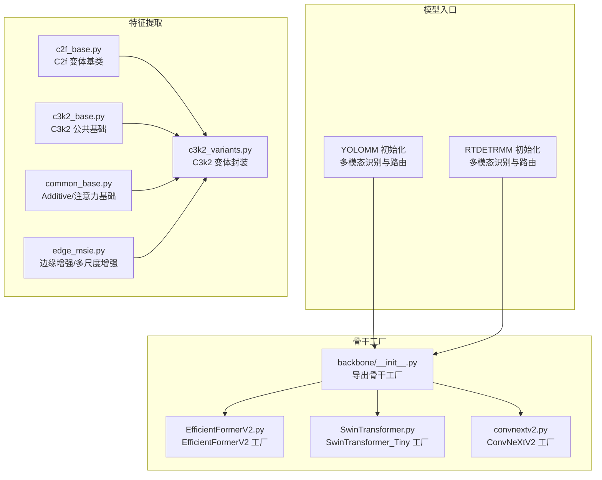
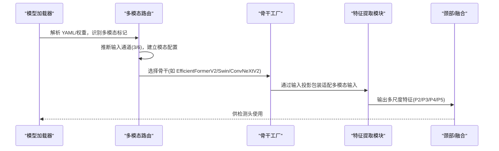
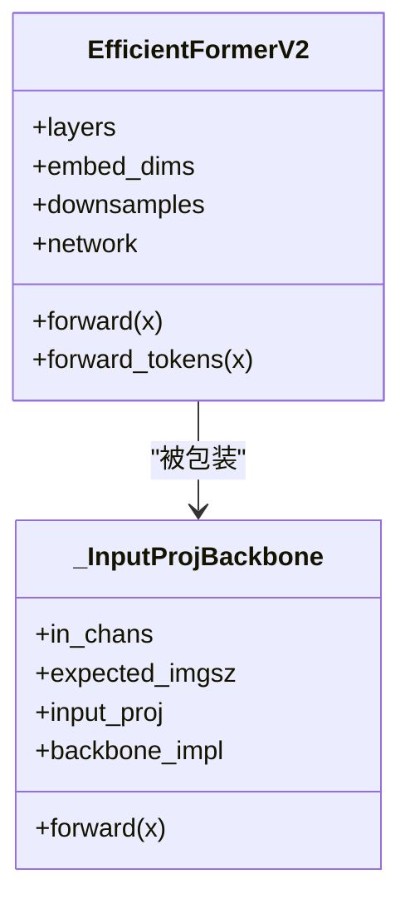
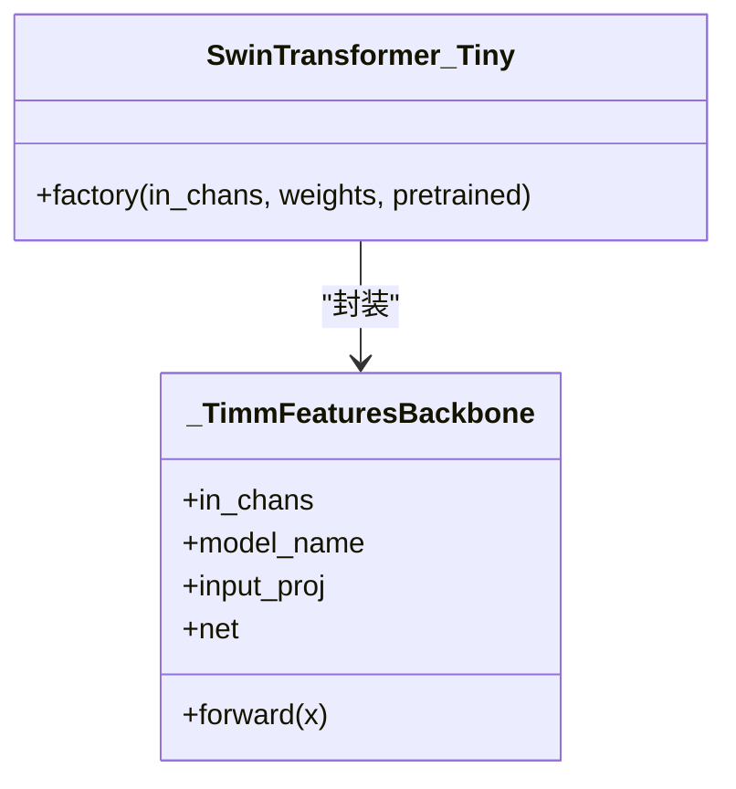
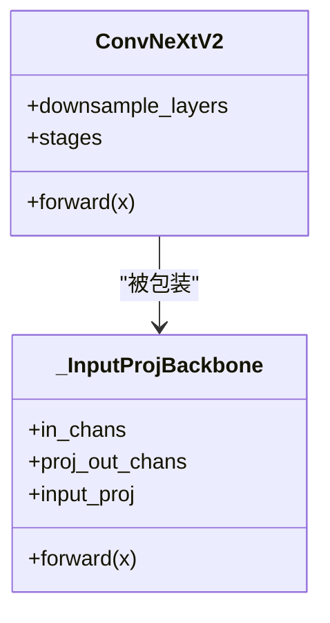
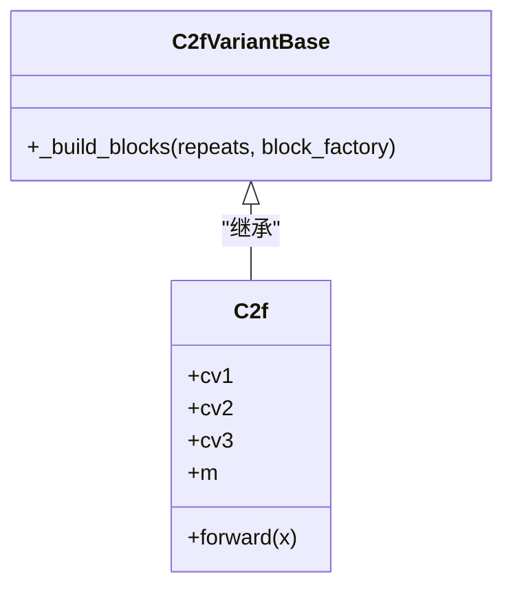
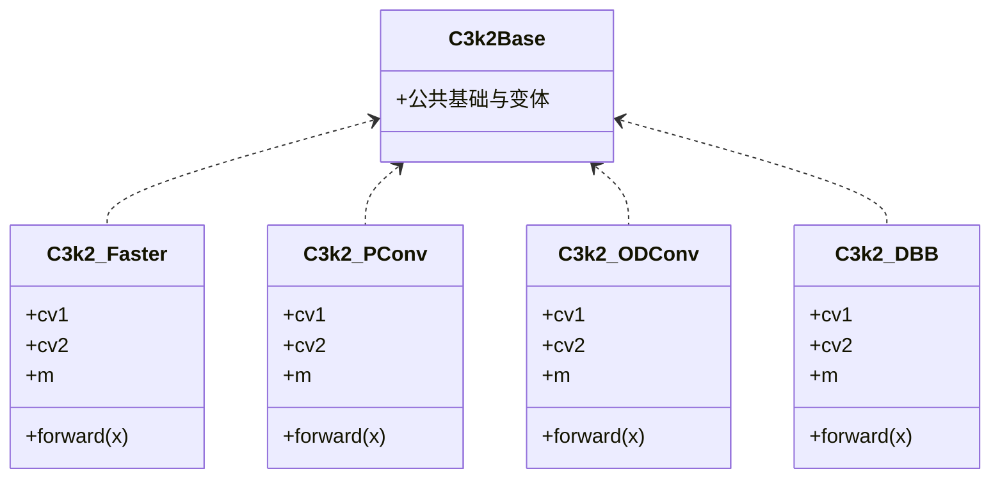
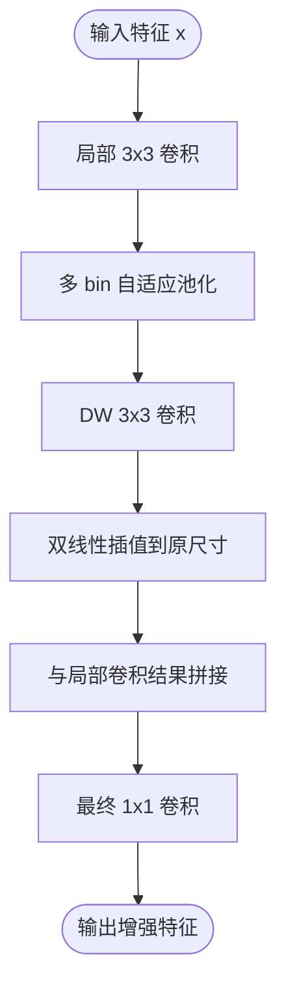
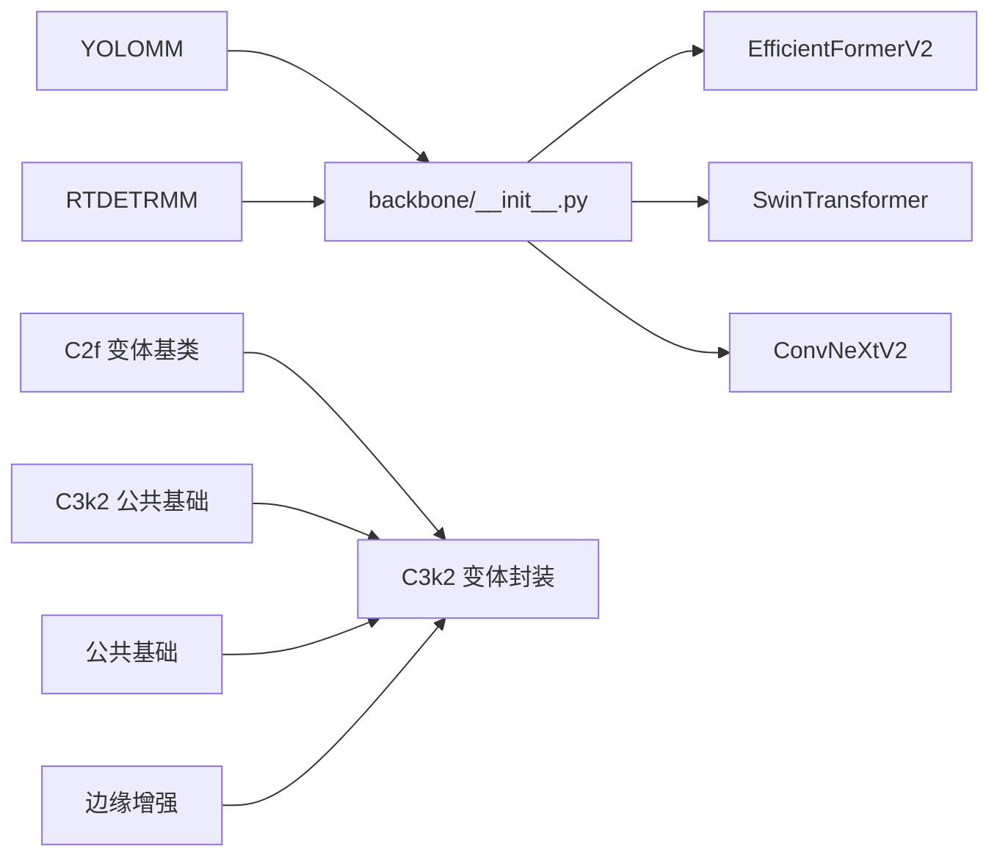

# 骨干网络架构

<cite>
**本文档引用的文件**
- [ultralytics/models/rtdetrmm/model.py](file://ultralytics/models/rtdetrmm/model.py)
- [ultralytics/models/yolo/model.py](file://ultralytics/models/yolo/model.py)
- [ultralytics/nn/backbone/__init__.py](file://ultralytics/nn/backbone/__init__.py)
- [ultralytics/nn/backbone/EfficientFormerV2.py](file://ultralytics/nn/backbone/EfficientFormerV2.py)
- [ultralytics/nn/backbone/SwinTransformer.py](file://ultralytics/nn/backbone/SwinTransformer.py)
- [ultralytics/nn/backbone/convnextv2.py](file://ultralytics/nn/backbone/convnextv2.py)
- [ultralytics/nn/modules/block.py](file://ultralytics/nn/modules/block.py)
- [ultralytics/nn/extraction/c2f_base.py](file://ultralytics/nn/extraction/c2f_base.py)
- [ultralytics/nn/extraction/c3k2_base.py](file://ultralytics/nn/extraction/c3k2_base.py)
- [ultralytics/nn/extraction/common_base.py](file://ultralytics/nn/extraction/common_base.py)
- [ultralytics/nn/extraction/c3k2_variants.py](file://ultralytics/nn/extraction/c3k2_variants.py)
- [ultralytics/nn/public/edge_msie.py](file://ultralytics/nn/public/edge_msie.py)
</cite>

## 目录
1. [简介](#简介)
2. [项目结构](#项目结构)
3. [核心组件](#核心组件)
4. [架构总览](#架构总览)
5. [详细组件分析](#详细组件分析)
6. [依赖分析](#依赖分析)
7. [性能考虑](#性能考虑)
8. [故障排查指南](#故障排查指南)
9. [结论](#结论)
10. [附录](#附录)

## 简介
本文件系统化梳理多模态骨干网络架构，聚焦于 YOLOMM 与 RTDETRMM 模型中的骨干设计与实现。重点覆盖：
- 骨干网络变体：EfficientFormerV2、SwinTransformer、ConvNeXtV2 等
- 核心提取模块：CSP 系列（C2f、C3k2）、注意力机制（通道/空间）
- 多尺度边缘增强与特征融合策略
- 在多模态场景（RGB+X）中的路由与融合实践

## 项目结构
围绕骨干网络的关键目录与文件：
- 模型入口与多模态识别：YOLOMM/RTDETRMM 初始化与路由
- 骨干工厂与封装：backbone 子模块与输入投影包装
- 特征提取与变体：C2f、C3k2 及其公共基础与变体集合
- 注意力与边缘增强：通道/空间注意力、多尺度边缘信息增强

**图示来源**
- [ultralytics/models/yolo/model.py:456-740](file://ultralytics/models/yolo/model.py#L456-L740)
- [ultralytics/models/rtdetrmm/model.py:25-188](file://ultralytics/models/rtdetrmm/model.py#L25-L188)
- [ultralytics/nn/backbone/__init__.py:1-46](file://ultralytics/nn/backbone/__init__.py#L1-L46)
- [ultralytics/nn/extraction/c2f_base.py:19-42](file://ultralytics/nn/extraction/c2f_base.py#L19-L42)
- [ultralytics/nn/extraction/c3k2_base.py:90-192](file://ultralytics/nn/extraction/c3k2_base.py#L90-L192)
- [ultralytics/nn/extraction/c3k2_variants.py:1-117](file://ultralytics/nn/extraction/c3k2_variants.py#L1-L117)
- [ultralytics/nn/public/edge_msie.py:14-75](file://ultralytics/nn/public/edge_msie.py#L14-L75)

**章节来源**
- [ultralytics/models/yolo/model.py:456-740](file://ultralytics/models/yolo/model.py#L456-L740)
- [ultralytics/models/rtdetrmm/model.py:25-188](file://ultralytics/models/rtdetrmm/model.py#L25-L188)
- [ultralytics/nn/backbone/__init__.py:1-46](file://ultralytics/nn/backbone/__init__.py#L1-L46)

## 核心组件
- YOLOMM/RTDETRMM 多模态识别与路由
  - 基于 YAML/权重内容判据识别多模态结构，自动推断输入通道（3/6），并建立模态配置（RGB/X/Dual）。
  - 提供 modality_config 与 get_modality_info，支撑下游推理与验证流程。

- 骨干工厂与输入投影
  - EfficientFormerV2：提供多尺寸变体（S0/S1/S2/L），支持输入投影包装以适配多模态输入通道。
  - SwinTransformer：基于 timm features_only，提供输入投影包装，确保单模态主干接收 3 通道。
  - ConvNeXtV2：提供多尺寸变体（atto/femto/pico/nano/tiny/base/large/huge），统一输入投影包装。

- 特征提取模块
  - C2f：快速 CSP 变体，通过 cv1/cv2/cv3 与内部 Bottleneck 列表实现高效特征提取。
  - C3k2：在 C3k 基础上扩展的变体集合，集成多种注意力与卷积变体（EMA、ODConv、DBB 等）。

**章节来源**
- [ultralytics/models/yolo/model.py:456-740](file://ultralytics/models/yolo/model.py#L456-L740)
- [ultralytics/models/rtdetrmm/model.py:25-188](file://ultralytics/models/rtdetrmm/model.py#L25-L188)
- [ultralytics/nn/backbone/EfficientFormerV2.py:467-681](file://ultralytics/nn/backbone/EfficientFormerV2.py#L467-L681)
- [ultralytics/nn/backbone/SwinTransformer.py:18-83](file://ultralytics/nn/backbone/SwinTransformer.py#L18-L83)
- [ultralytics/nn/backbone/convnextv2.py:94-239](file://ultralytics/nn/backbone/convnextv2.py#L94-L239)
- [ultralytics/nn/modules/block.py:305-365](file://ultralytics/nn/modules/block.py#L305-L365)
- [ultralytics/nn/extraction/c3k2_variants.py:120-200](file://ultralytics/nn/extraction/c3k2_variants.py#L120-L200)

## 架构总览
多模态骨干网络在 YOLOMM/RTDETRMM 中的总体流程：
- 模型加载阶段：解析 YAML，识别多模态标记，确定输入通道与模态集合。
- 骨干选择：依据配置选择 EfficientFormerV2/SwinTransformer/ConvNeXtV2 等骨干，并通过输入投影包装适配多模态输入。
- 特征提取：骨干输出多尺度特征（如 P2/P3/P4/P5），随后进入颈部与检测头。
- 注意力与融合：在 C2f/C3k2 变体中集成通道/空间注意力与多尺度边缘增强，提升特征表达能力。

**图示来源**
- [ultralytics/models/yolo/model.py:516-645](file://ultralytics/models/yolo/model.py#L516-L645)
- [ultralytics/models/rtdetrmm/model.py:59-188](file://ultralytics/models/rtdetrmm/model.py#L59-L188)
- [ultralytics/nn/backbone/EfficientFormerV2.py:575-630](file://ultralytics/nn/backbone/EfficientFormerV2.py#L575-L630)
- [ultralytics/nn/backbone/SwinTransformer.py:18-57](file://ultralytics/nn/backbone/SwinTransformer.py#L18-L57)
- [ultralytics/nn/backbone/convnextv2.py:163-182](file://ultralytics/nn/backbone/convnextv2.py#L163-L182)

## 详细组件分析

### EfficientFormerV2 骨干
- 设计要点
  - 4 阶段结构，逐级下采样，支持多尺寸变体（S0/S1/S2/L）。
  - Attention4D 与 FFN 混合模块，结合局部卷积与全局注意力。
  - 多种扩展比（expansion ratios）随阶段变化，兼顾效率与精度。
- 多模态适配
  - 通过 _InputProjBackbone 将任意通道数输入投影至 3 通道，进入单模态主干。
  - 内部对分辨率敏感，要求训练/推理 imgsz 与构建时分辨率一致。

**图示来源**
- [ultralytics/nn/backbone/EfficientFormerV2.py:467-562](file://ultralytics/nn/backbone/EfficientFormerV2.py#L467-L562)
- [ultralytics/nn/backbone/EfficientFormerV2.py:575-613](file://ultralytics/nn/backbone/EfficientFormerV2.py#L575-L613)

**章节来源**
- [ultralytics/nn/backbone/EfficientFormerV2.py:21-681](file://ultralytics/nn/backbone/EfficientFormerV2.py#L21-L681)

### SwinTransformer 骨干
- 设计要点
  - 基于 timm features_only，输出多尺度特征列表。
  - 通过 Conv(1x1) 将输入通道投影至 3，再进入 Swin 主干。
- 多模态适配
  - 严格校验输入通道与模态路由标记一致性，防止误用。

**图示来源**
- [ultralytics/nn/backbone/SwinTransformer.py:18-57](file://ultralytics/nn/backbone/SwinTransformer.py#L18-L57)
- [ultralytics/nn/backbone/SwinTransformer.py:72-83](file://ultralytics/nn/backbone/SwinTransformer.py#L72-L83)

**章节来源**
- [ultralytics/nn/backbone/SwinTransformer.py:18-83](file://ultralytics/nn/backbone/SwinTransformer.py#L18-L83)

### ConvNeXtV2 骨干
- 设计要点
  - 4 阶下采样阶段，每阶段堆叠若干 Block，使用 LayerNorm 与 GRN。
  - 通过 _InputProjBackbone 将输入通道投影至 3，进入单模态主干。
- 多模态适配
  - 统一输入投影包装，支持多通道输入。

**图示来源**
- [ultralytics/nn/backbone/convnextv2.py:94-150](file://ultralytics/nn/backbone/convnextv2.py#L94-L150)
- [ultralytics/nn/backbone/convnextv2.py:163-182](file://ultralytics/nn/backbone/convnextv2.py#L163-L182)

**章节来源**
- [ultralytics/nn/backbone/convnextv2.py:94-239](file://ultralytics/nn/backbone/convnextv2.py#L94-L239)

### C2f 模块与变体
- 核心结构
  - cv1/cv2/cv3 三卷积结构，m 为 n 个 Bottleneck 的 ModuleList。
  - 通过拼接与映射实现高效特征融合。
- 变体基类
  - C2fVariantBase 提供统一的内部 block 替换入口，便于快速扩展新变体。

**图示来源**
- [ultralytics/nn/modules/block.py:305-365](file://ultralytics/nn/modules/block.py#L305-L365)
- [ultralytics/nn/extraction/c2f_base.py:19-42](file://ultralytics/nn/extraction/c2f_base.py#L19-L42)

**章节来源**
- [ultralytics/nn/modules/block.py:305-365](file://ultralytics/nn/modules/block.py#L305-L365)
- [ultralytics/nn/extraction/c2f_base.py:19-42](file://ultralytics/nn/extraction/c2f_base.py#L19-L42)

### C3k2 模块与公共基础
- 公共基础
  - 提供注意力机制（EMA、OD_Attention）、卷积变体（Partial_conv3、ODConv2d）、重参数化模块（DiverseBranchBlock 系列）等。
  - 提供 Additive 系列基础模块（LocalIntegration、AdditiveTokenMixer、AdditiveBlock 等）。
- 变体封装
  - C3k2_Faster、C3k2_PConv、C3k2_ODConv、C3k2_DBB 等，均在 C3k 基础上替换内部 block。

**图示来源**
- [ultralytics/nn/extraction/c3k2_variants.py:120-200](file://ultralytics/nn/extraction/c3k2_variants.py#L120-L200)
- [ultralytics/nn/extraction/c3k2_base.py:90-192](file://ultralytics/nn/extraction/c3k2_base.py#L90-L192)
- [ultralytics/nn/extraction/common_base.py:12-194](file://ultralytics/nn/extraction/common_base.py#L12-L194)

**章节来源**
- [ultralytics/nn/extraction/c3k2_variants.py:1-117](file://ultralytics/nn/extraction/c3k2_variants.py#L1-L117)
- [ultralytics/nn/extraction/c3k2_base.py:90-192](file://ultralytics/nn/extraction/c3k2_base.py#L90-L192)
- [ultralytics/nn/extraction/common_base.py:12-194](file://ultralytics/nn/extraction/common_base.py#L12-L194)

### 注意力机制与边缘增强
- 通道注意力与空间注意力
  - 通过 AdaptiveAvgPool2d + Conv + Sigmoid 生成通道/空间权重，实现注意力加权。
- 多尺度边缘增强
  - EdgeEnhancer：基于局部均值差分生成边缘掩码，与原特征相加。
  - MutilScaleEdgeInformationEnhance：多 bin 自适应池化 + 3x3 DW 卷积 + 双分支融合，增强多尺度边缘信息。

**图示来源**
- [ultralytics/nn/public/edge_msie.py:27-49](file://ultralytics/nn/public/edge_msie.py#L27-L49)

**章节来源**
- [ultralytics/nn/public/edge_msie.py:14-75](file://ultralytics/nn/public/edge_msie.py#L14-L75)
- [ultralytics/nn/extraction/common_base.py:64-100](file://ultralytics/nn/extraction/common_base.py#L64-L100)

### 多模态场景中的骨干配置与使用
- YOLOMM/RTDETRMM 初始化
  - 自动识别多模态层标记（RGB/X/Dual），推断输入通道（3/6），建立模态配置。
  - 提供 get_modality_info 获取当前模型的模态信息。
- 骨干工厂选择
  - 通过 backbone/__init__.py 导出的工厂函数选择 EfficientFormerV2/Swin/ConvNeXtV2。
  - 使用 _InputProjBackbone/Conv 投影包装，确保单模态主干接收 3 通道。
- 配置示例（路径引用）
  - 多模态识别与通道推断：[ultralytics/models/yolo/model.py:516-645](file://ultralytics/models/yolo/model.py#L516-L645)
  - 骨干工厂导出：[ultralytics/nn/backbone/__init__.py:19-46](file://ultralytics/nn/backbone/__init__.py#L19-L46)
  - EfficientFormerV2 工厂与包装：[ultralytics/nn/backbone/EfficientFormerV2.py:615-681](file://ultralytics/nn/backbone/EfficientFormerV2.py#L615-L681)
  - SwinTransformer 工厂与包装：[ultralytics/nn/backbone/SwinTransformer.py:72-83](file://ultralytics/nn/backbone/SwinTransformer.py#L72-L83)
  - ConvNeXtV2 工厂与包装：[ultralytics/nn/backbone/convnextv2.py:184-239](file://ultralytics/nn/backbone/convnextv2.py#L184-L239)

**章节来源**
- [ultralytics/models/yolo/model.py:456-740](file://ultralytics/models/yolo/model.py#L456-L740)
- [ultralytics/models/rtdetrmm/model.py:25-188](file://ultralytics/models/rtdetrmm/model.py#L25-L188)
- [ultralytics/nn/backbone/__init__.py:19-46](file://ultralytics/nn/backbone/__init__.py#L19-L46)

## 依赖分析
- 组件耦合
  - 骨干工厂与输入投影包装强耦合，确保多模态输入通道统一为 3。
  - C2f/C3k2 变体依赖公共基础模块（注意力、卷积变体、重参数化）。
- 外部依赖
  - SwinTransformer 依赖 timm 库，需安装并正确导入。
  - 注意力与边缘增强模块依赖 torch.nn.functional 与 timm 层。

**图示来源**
- [ultralytics/nn/backbone/__init__.py:19-46](file://ultralytics/nn/backbone/__init__.py#L19-L46)
- [ultralytics/nn/extraction/c2f_base.py:19-42](file://ultralytics/nn/extraction/c2f_base.py#L19-L42)
- [ultralytics/nn/extraction/c3k2_base.py:90-192](file://ultralytics/nn/extraction/c3k2_base.py#L90-L192)
- [ultralytics/nn/public/edge_msie.py:14-75](file://ultralytics/nn/public/edge_msie.py#L14-L75)

**章节来源**
- [ultralytics/nn/backbone/__init__.py:19-46](file://ultralytics/nn/backbone/__init__.py#L19-L46)
- [ultralytics/nn/extraction/c2f_base.py:19-42](file://ultralytics/nn/extraction/c2f_base.py#L19-L42)
- [ultralytics/nn/extraction/c3k2_base.py:90-192](file://ultralytics/nn/extraction/c3k2_base.py#L90-L192)
- [ultralytics/nn/public/edge_msie.py:14-75](file://ultralytics/nn/public/edge_msie.py#L14-L75)

## 性能考虑
- 计算效率
  - EfficientFormerV2 通过 Attention4D 与 FFN 混合，在保证精度的同时控制计算开销。
  - C2f 通过更少的中间卷积与高效的拼接映射，降低冗余计算。
- 存储与内存
  - 重参数化模块（如 DiverseBranchBlock）在部署阶段可融合分支，减少推理时延。
- 分辨率与通道
  - EfficientFormerV2 对分辨率敏感，需与训练/推理 imgsz 保持一致，避免运行时插值带来的性能损失。

## 故障排查指南
- 多模态通道不匹配
  - 现象：输入通道数与期望不符，抛出 RuntimeError。
  - 处理：检查 YAML 的模态路由标记（RGB/X/Dual）与实际输入通道一致。
  - 参考：[ultralytics/nn/backbone/EfficientFormerV2.py:590-613](file://ultralytics/nn/backbone/EfficientFormerV2.py#L590-L613)、[ultralytics/nn/backbone/SwinTransformer.py:39-56](file://ultralytics/nn/backbone/SwinTransformer.py#L39-L56)、[ultralytics/nn/backbone/convnextv2.py:175-182](file://ultralytics/nn/backbone/convnextv2.py#L175-L182)
- 分辨率不一致
  - 现象：主干按特定分辨率构建，输入分辨率不一致时报错。
  - 处理：将 imgsz 与主干构建分辨率对齐（如 640 或 320）。
  - 参考：[ultralytics/nn/backbone/EfficientFormerV2.py:600-611](file://ultralytics/nn/backbone/EfficientFormerV2.py#L600-L611)
- timm 未安装
  - 现象：导入 timm 失败。
  - 处理：安装 timm 并确保导入成功。
  - 参考：[ultralytics/nn/backbone/SwinTransformer.py:30-35](file://ultralytics/nn/backbone/SwinTransformer.py#L30-L35)

**章节来源**
- [ultralytics/nn/backbone/EfficientFormerV2.py:590-613](file://ultralytics/nn/backbone/EfficientFormerV2.py#L590-L613)
- [ultralytics/nn/backbone/SwinTransformer.py:30-35](file://ultralytics/nn/backbone/SwinTransformer.py#L30-L35)
- [ultralytics/nn/backbone/convnextv2.py:175-182](file://ultralytics/nn/backbone/convnextv2.py#L175-L182)

## 结论
本项目在多模态骨干网络方面，通过统一的输入投影包装与丰富的骨干变体（EfficientFormerV2、SwinTransformer、ConvNeXtV2），实现了对 RGB+X 等多模态输入的灵活适配。结合 C2f/C3k2 变体与注意力、边缘增强模块，显著提升了多尺度特征表达与鲁棒性。在工程实践中，建议严格遵循通道与分辨率约束，并优先选择与任务规模匹配的骨干变体以平衡性能与效率。

## 附录
- 配置与使用示例（路径引用）
  - YOLOMM 初始化与多模态配置：[ultralytics/models/yolo/model.py:516-645](file://ultralytics/models/yolo/model.py#L516-L645)
  - RTDETRMM 初始化与多模态配置：[ultralytics/models/rtdetrmm/model.py:59-188](file://ultralytics/models/rtdetrmm/model.py#L59-L188)
  - 骨干工厂导出与选择：[ultralytics/nn/backbone/__init__.py:19-46](file://ultralytics/nn/backbone/__init__.py#L19-L46)
  - EfficientFormerV2 工厂与包装：[ultralytics/nn/backbone/EfficientFormerV2.py:615-681](file://ultralytics/nn/backbone/EfficientFormerV2.py#L615-L681)
  - SwinTransformer 工厂与包装：[ultralytics/nn/backbone/SwinTransformer.py:72-83](file://ultralytics/nn/backbone/SwinTransformer.py#L72-L83)
  - ConvNeXtV2 工厂与包装：[ultralytics/nn/backbone/convnextv2.py:184-239](file://ultralytics/nn/backbone/convnextv2.py#L184-L239)
  - C2f 变体基类与使用：[ultralytics/nn/extraction/c2f_base.py:19-42](file://ultralytics/nn/extraction/c2f_base.py#L19-L42)
  - C3k2 变体封装与公共基础：[ultralytics/nn/extraction/c3k2_variants.py:120-200](file://ultralytics/nn/extraction/c3k2_variants.py#L120-L200)、[ultralytics/nn/extraction/c3k2_base.py:90-192](file://ultralytics/nn/extraction/c3k2_base.py#L90-L192)
  - 边缘增强与多尺度增强：[ultralytics/nn/public/edge_msie.py:27-49](file://ultralytics/nn/public/edge_msie.py#L27-L49)