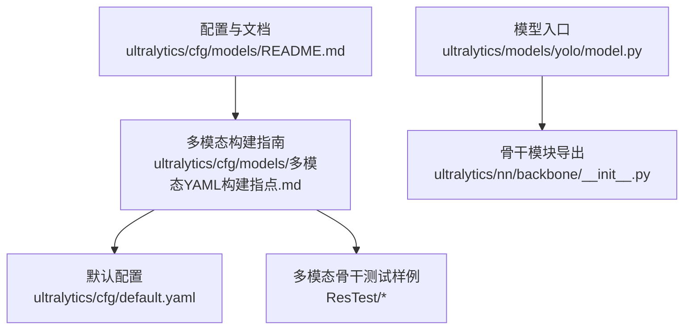
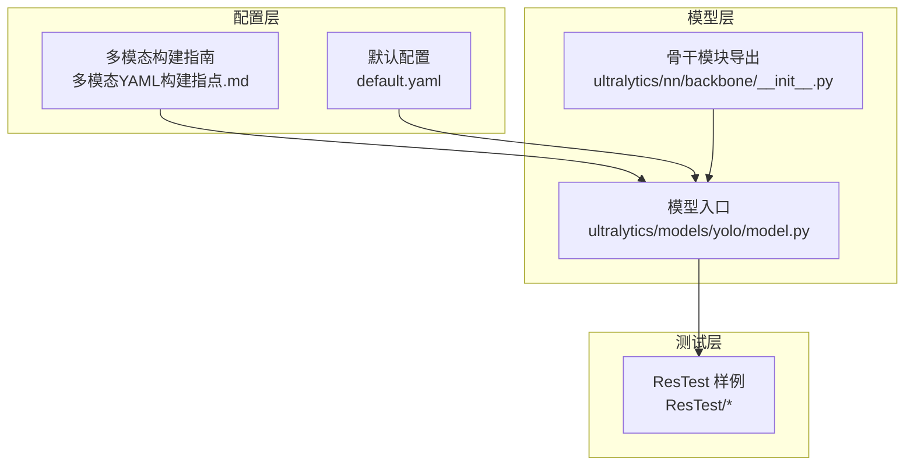
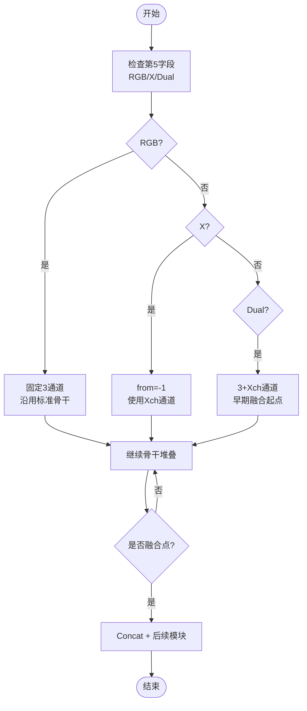
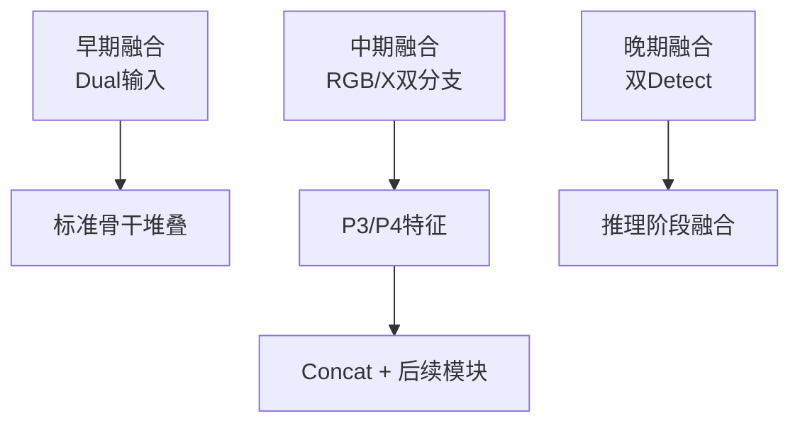
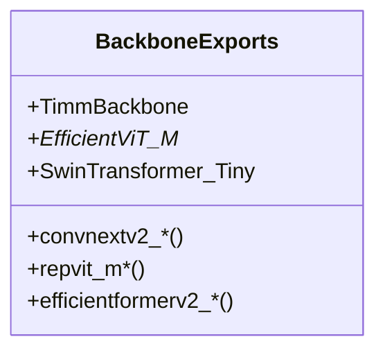
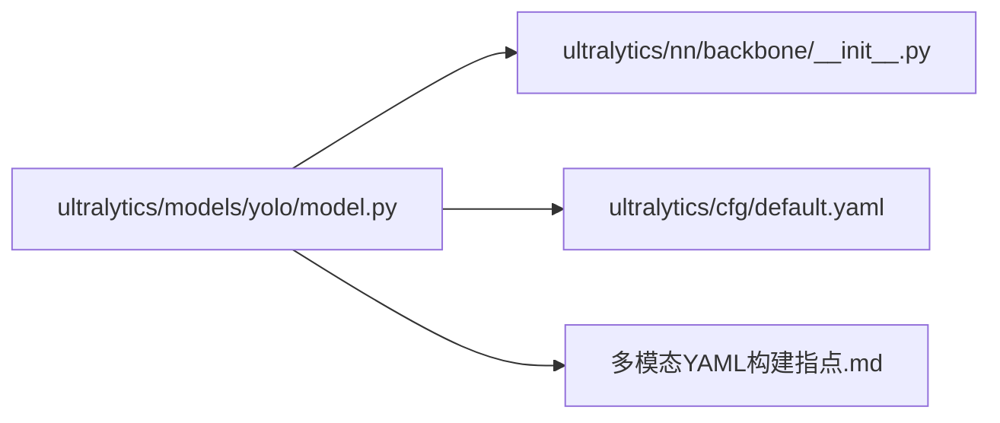

# 骨干网络配置

<cite>
**本文档引用的文件**
- [ultralytics/cfg/models/README.md](file://ultralytics/cfg/models/README.md)
- [ultralytics/cfg/models/多模态YAML构建指点.md](file://ultralytics/cfg/models/多模态YAML构建指点.md)
- [ultralytics/cfg/default.yaml](file://ultralytics/cfg/default.yaml)
- [ultralytics/models/yolo/model.py](file://ultralytics/models/yolo/model.py)
- [ultralytics/nn/backbone/__init__.py](file://ultralytics/nn/backbone/__init__.py)
- [ResTest/RTDETR-mid/args.yaml](file://ResTest/RTDETR-mid/args.yaml)
- [ResTest/aifi-dattention-CSP-MutilScaleEdgeInformationEnhance-ASF-P2-lite-BackboneFreqFusion/results.csv](file://ResTest/aifi-dattention-CSP-MutilScaleEdgeInformationEnhance-ASF-P2-lite-BackboneFreqFusion/results.csv)
- [ResTest/aifi-dattention-CSP-MutilScaleEdgeInformationEnhance-ASF-P2-lite-BackboneFreqFusion2/results.csv](file://ResTest/aifi-dattention-CSP-MutilScaleEdgeInformationEnhance-ASF-P2-lite-BackboneFreqFusion2/results.csv)
- [ResTest/aifi-dattention-CSP-MutilScaleEdgeInformationEnhance-ASF-P2-lite-BackboneFreqFusion3/results.csv](file://ResTest/aifi-dattention-CSP-MutilScaleEdgeInformationEnhance-ASF-P2-lite-BackboneFreqFusion3/results.csv)
- [ResTest/aifi-dattention-CSP-MutilScaleEdgeInformationEnhance-ASF-P2-lite-BackboneFreqFusion4/results.csv](file://ResTest/aifi-dattention-CSP-MutilScaleEdgeInformationEnhance-ASF-P2-lite-BackboneFreqFusion4/results.csv)
- [ResTest/aifi-dattention-CSP-MutilScaleEdgeInformationEnhance-ASF-P2-lite-BackboneMultiScaleGatedAttn/results.csv](file://ResTest/aifi-dattention-CSP-MutilScaleEdgeInformationEnhance-ASF-P2-lite-BackboneMultiScaleGatedAttn/results.csv)
- [ResTest/aifi-dattention-CSP-MutilScaleEdgeInformationEnhance-ASF-P2-lite-BackbonePSFM/results.csv](file://ResTest/aifi-dattention-CSP-MutilScaleEdgeInformationEnhance-ASF-P2-lite-BackbonePSFM/results.csv)
- [ResTest/aifi-dattention-CSP-MutilScaleEdgeInformationEnhance-ASF-P2-lite-BackboneSEFN/results.csv](file://ResTest/aifi-dattention-CSP-MutilScaleEdgeInformationEnhance-ASF-P2-lite-BackboneSEFN/results.csv)
- [ResTest/aifi-dattention-CSP-MutilScaleEdgeInformationEnhance-ASF-P2-lite-BackboneSEFN2/results.csv](file://ResTest/aifi-dattention-CSP-MutilScaleEdgeInformationEnhance-ASF-P2-lite-BackboneSEFN2/results.csv)
- [ResTest/aifi-dattention-CSP-MutilScaleEdgeInformationEnhance-ASF-P2-lite-BackboneScalarGate/results.csv](file://ResTest/aifi-dattention-CSP-MutilScaleEdgeInformationEnhance-ASF-P2-lite-BackboneScalarGate/results.csv)
- [ResTest/aifi-dattention-CSP-MutilScaleEdgeInformationEnhance-ASF-P2-lite-BiFPNFusion/results.csv](file://ResTest/aifi-dattention-CSP-MutilScaleEdgeInformationEnhance-ASF-P2-lite-BiFPNFusion/results.csv)
- [ResTest/aifi-dattention-CSP-MutilScaleEdgeInformationEnhance-ASF-P2-lite-CGAFusion/results.csv](file://ResTest/aifi-dattention-CSP-MutilScaleEdgeInformationEnhance-ASF-P2-lite-CGAFusion/results.csv)
- [ResTest/aifi-dattention-CSP-MutilScaleEdgeInformationEnhance-ASF-P2-lite-CTrans/results.csv](file://ResTest/aifi-dattention-CSP-MutilScaleEdgeInformationEnhance-ASF-P2-lite-CTrans/results.csv)
- [ResTest/aifi-dattention-CSP-MutilScaleEdgeInformationEnhance-ASF-P2-lite-CTrans2/results.csv](file://ResTest/aifi-dattention-CSP-MutilScaleEdgeInformationEnhance-ASF-P2-lite-CTrans2/results.csv)
- [ResTest/aifi-dattention-CSP-MutilScaleEdgeInformationEnhance-ASF-P2-lite-ContextGuideFusionModule/results.csv](file://ResTest/aifi-dattention-CSP-MutilScaleEdgeInformationEnhance-ASF-P2-lite-ContextGuideFusionModule/results.csv)
- [ResTest/aifi-dattention-CSP-MutilScaleEdgeInformationEnhance-ASF-P2-lite-DynamicInterpolationFusion/results.csv](file://ResTest/aifi-dattention-CSP-MutilScaleEdgeInformationEnhance-ASF-P2-lite-DynamicInterpolationFusion/results.csv)
- [ResTest/aifi-dattention-CSP-MutilScaleEdgeInformationEnhance-ASF-P2-lite-GDSAFusion/results.csv](file://ResTest/aifi-dattention-CSP-MutilScaleEdgeInformationEnhance-ASF-P2-lite-GDSAFusion/results.csv)
- [ResTest/aifi-dattention-CSP-MutilScaleEdgeInformationEnhance-ASF-P2-lite-GDSAFusion2/results.csv](file://ResTest/aifi-dattention-CSP-MutilScaleEdgeInformationEnhance-ASF-P2-lite-GDSAFusion2/results.csv)
- [ResTest/aifi-dattention-CSP-MutilScaleEdgeInformationEnhance-ASF-P2-lite-GLSA/results.csv](file://ResTest/aifi-dattention-CSP-MutilScaleEdgeInformationEnhance-ASF-P2-lite-GLSA/results.csv)
- [ResTest/aifi-dattention-CSP-MutilScaleEdgeInformationEnhance-ASF-P2-lite-GLSA2/results.csv](file://ResTest/aifi-dattention-CSP-MutilScaleEdgeInformationEnhance-ASF-P2-lite-GLSA2/results.csv)
- [ResTest/aifi-dattention-CSP-MutilScaleEdgeInformationEnhance-ASF-P2-lite-GLSA3/results.csv](file://ResTest/aifi-dattention-CSP-MutilScaleEdgeInformationEnhance-ASF-P2-lite-GLSA3/results.csv)
- [ResTest/aifi-dattention-CSP-MutilScaleEdgeInformationEnhance-ASF-P2-lite-GatedConcat/results.csv](file://ResTest/aifi-dattention-CSP-MutilScaleEdgeInformationEnhance-ASF-P2-lite-GatedConcat/results.csv)
- [ResTest/aifi-dattention-CSP-MutilScaleEdgeInformationEnhance-ASF-P2-lite-MCFGatedAdd/results.csv](file://ResTest/aifi-dattention-CSP-MutilScaleEdgeInformationEnhance-ASF-P2-lite-MCFGatedAdd/results.csv)
- [ResTest/aifi-dattention-CSP-MutilScaleEdgeInformationEnhance-ASF-P2-lite-WeightFusion/results.csv](file://ResTest/aifi-dattention-CSP-MutilScaleEdgeInformationEnhance-ASF-P2-lite-WeightFusion/results.csv)
- [ResTest/aifi-dattention-CSP-MutilScaleEdgeInformationEnhance-ASF-P2-lite-WeightFusion2/results.csv](file://ResTest/aifi-dattention-CSP-MutilScaleEdgeInformationEnhance-ASF-P2-lite-WeightFusion2/results.csv)
- [ResTest/aifi-dattention-CSP-MutilScaleEdgeInformationEnhance-ASF-P2-lite-WeightFusion3/results.csv](file://ResTest/aifi-dattention-CSP-MutilScaleEdgeInformationEnhance-ASF-P2-lite-WeightFusion3/results.csv)
- [ResTest/aifi-dattention-CSP-MutilScaleEdgeInformationEnhance-ASF-P2-litev2/args.yaml](file://ResTest/aifi-dattention-CSP-MutilScaleEdgeInformationEnhance-ASF-P2-litev2/args.yaml)
- [ResTest/aifi-dattention-CSP-MutilScaleEdgeInformationEnhance-ASF-P2-litev3/args.yaml](file://ResTest/aifi-dattention-CSP-MutilScaleEdgeInformationEnhance-ASF-P2-litev3/args.yaml)
- [ResTest/aifi-dattention-CSP-MutilScaleEdgeInformationEnhance-ASF-P2-lite-BackboneFreqFusion/args.yaml](file://ResTest/aifi-dattention-CSP-MutilScaleEdgeInformationEnhance-ASF-P2-lite-BackboneFreqFusion/args.yaml)
- [ResTest/aifi-dattention-CSP-MutilScaleEdgeInformationEnhance-ASF-P2-lite-BackboneFreqFusion2/args.yaml](file://ResTest/aifi-dattention-CSP-MutilScaleEdgeInformationEnhance-ASF-P2-lite-BackboneFreqFusion2/args.yaml)
- [ResTest/aifi-dattention-CSP-MutilScaleEdgeInformationEnhance-ASF-P2-lite-BackboneFreqFusion3/args.yaml](file://ResTest/aifi-dattention-CSP-MutilScaleEdgeInformationEnhance-ASF-P2-lite-BackboneFreqFusion3/args.yaml)
- [ResTest/aifi-dattention-CSP-MutilScaleEdgeInformationEnhance-ASF-P2-lite-BackboneFreqFusion4/args.yaml](file://ResTest/aifi-dattention-CSP-MutilScaleEdgeInformationEnhance-ASF-P2-lite-BackboneFreqFusion4/args.yaml)
- [ResTest/aifi-dattention-CSP-MutilScaleEdgeInformationEnhance-ASF-P2-lite-BackboneMultiScaleGatedAttn/args.yaml](file://ResTest/aifi-dattention-CSP-MutilScaleEdgeInformationEnhance-ASF-P2-lite-BackboneMultiScaleGatedAttn/args.yaml)
- [ResTest/aifi-dattention-CSP-MutilScaleEdgeInformationEnhance-ASF-P2-lite-BackbonePSFM/args.yaml](file://ResTest/aifi-dattention-CSP-MutilScaleEdgeInformationEnhance-ASF-P2-lite-BackbonePSFM/args.yaml)
- [ResTest/aifi-dattention-CSP-MutilScaleEdgeInformationEnhance-ASF-P2-lite-BackboneSEFN/args.yaml](file://ResTest/aifi-dattention-CSP-MutilScaleEdgeInformationEnhance-ASF-P2-lite-BackboneSEFN/args.yaml)
- [ResTest/aifi-dattention-CSP-MutilScaleEdgeInformationEnhance-ASF-P2-lite-BackboneSEFN2/args.yaml](file://ResTest/aifi-dattention-CSP-MutilScaleEdgeInformationEnhance-ASF-P2-lite-BackboneSEFN2/args.yaml)
- [ResTest/aifi-dattention-CSP-MutilScaleEdgeInformationEnhance-ASF-P2-lite-BackboneScalarGate/args.yaml](file://ResTest/aifi-dattention-CSP-MutilScaleEdgeInformationEnhance-ASF-P2-lite-BackboneScalarGate/args.yaml)
- [ResTest/aifi-dattention-CSP-MutilScaleEdgeInformationEnhance-ASF-P2-lite-BiFPNFusion/args.yaml](file://ResTest/aifi-dattention-CSP-MutilScaleEdgeInformationEnhance-ASF-P2-lite-BiFPNFusion/args.yaml)
- [ResTest/aifi-dattention-CSP-MutilScaleEdgeInformationEnhance-ASF-P2-lite-CGAFusion/args.yaml](file://ResTest/aifi-dattention-CSP-MutilScaleEdgeInformationEnhance-ASF-P2-lite-CGAFusion/args.yaml)
- [ResTest/aifi-dattention-CSP-MutilScaleEdgeInformationEnhance-ASF-P2-lite-CTrans/args.yaml](file://ResTest/aifi-dattention-CSP-MutilScaleEdgeInformationEnhance-ASF-P2-lite-CTrans/args.yaml)
- [ResTest/aifi-dattention-CSP-MutilScaleEdgeInformationEnhance-ASF-P2-lite-CTrans2/args.yaml](file://ResTest/aifi-dattention-CSP-MutilScaleEdgeInformationEnhance-ASF-P2-lite-CTrans2/args.yaml)
- [ResTest/aifi-dattention-CSP-MutilScaleEdgeInformationEnhance-ASF-P2-lite-ContextGuideFusionModule/args.yaml](file://ResTest/aifi-dattention-CSP-MutilScaleEdgeInformationEnhance-ASF-P2-lite-ContextGuideFusionModule/args.yaml)
- [ResTest/aifi-dattention-CSP-MutilScaleEdgeInformationEnhance-ASF-P2-lite-DynamicInterpolationFusion/args.yaml](file://ResTest/aifi-dattention-CSP-MutilScaleEdgeInformationEnhance-ASF-P2-lite-DynamicInterpolationFusion/args.yaml)
- [ResTest/aifi-dattention-CSP-MutilScaleEdgeInformationEnhance-ASF-P2-lite-GDSAFusion/args.yaml](file://ResTest/aifi-dattention-CSP-MutilScaleEdgeInformationEnhance-ASF-P2-lite-GDSAFusion/args.yaml)
- [ResTest/aifi-dattention-CSP-MutilScaleEdgeInformationEnhance-ASF-P2-lite-GDSAFusion2/args.yaml](file://ResTest/aifi-dattention-CSP-MutilScaleEdgeInformationEnhance-ASF-P2-lite-GDSAFusion2/args.yaml)
- [ResTest/aifi-dattention-CSP-MutilScaleEdgeInformationEnhance-ASF-P2-lite-GLSA/args.yaml](file://ResTest/aifi-dattention-CSP-MutilScaleEdgeInformationEnhance-ASF-P2-lite-GLSA/args.yaml)
- [ResTest/aifi-dattention-CSP-MutilScaleEdgeInformationEnhance-ASF-P2-lite-GLSA2/args.yaml](file://ResTest/aifi-dattention-CSP-MutilScaleEdgeInformationEnhance-ASF-P2-lite-GLSA2/args.yaml)
- [ResTest/aifi-dattention-CSP-MutilScaleEdgeInformationEnhance-ASF-P2-lite-GLSA3/args.yaml](file://ResTest/aifi-dattention-CSP-MutilScaleEdgeInformationEnhance-ASF-P2-lite-GLSA3/args.yaml)
- [ResTest/aifi-dattention-CSP-MutilScaleEdgeInformationEnhance-ASF-P2-lite-GatedConcat/args.yaml](file://ResTest/aifi-dattention-CSP-MutilScaleEdgeInformationEnhance-ASF-P2-lite-GatedConcat/args.yaml)
- [ResTest/aifi-dattention-CSP-MutilScaleEdgeInformationEnhance-ASF-P2-lite-MCFGatedAdd/args.yaml](file://ResTest/aifi-dattention-CSP-MutilScaleEdgeInformationEnhance-ASF-P2-lite-MCFGatedAdd/args.yaml)
- [ResTest/aifi-dattention-CSP-MutilScaleEdgeInformationEnhance-ASF-P2-lite-WeightFusion/args.yaml](file://ResTest/aifi-dattention-CSP-MutilScaleEdgeInformationEnhance-ASF-P2-lite-WeightFusion/args.yaml)
- [ResTest/aifi-dattention-CSP-MutilScaleEdgeInformationEnhance-ASF-P2-lite-WeightFusion2/args.yaml](file://ResTest/aifi-dattention-CSP-MutilScaleEdgeInformationEnhance-ASF-P2-lite-WeightFusion2/args.yaml)
- [ResTest/aifi-dattention-CSP-MutilScaleEdgeInformationEnhance-ASF-P2-lite-WeightFusion3/args.yaml](file://ResTest/aifi-dattention-CSP-MutilScaleEdgeInformationEnhance-ASF-P2-lite-WeightFusion3/args.yaml)
</cite>

## 目录
1. [简介](#简介)
2. [项目结构](#项目结构)
3. [核心组件](#核心组件)
4. [架构总览](#架构总览)
5. [详细组件分析](#详细组件分析)
6. [依赖关系分析](#依赖关系分析)
7. [性能考量](#性能考量)
8. [故障排查指南](#故障排查指南)
9. [结论](#结论)
10. [附录](#附录)

## 简介
本文件面向需要基于 YAML 配置选择与定制骨干网络的用户，系统梳理了多模态骨干网络的配置方法与最佳实践。内容覆盖：
- 如何通过 YAML 选择不同骨干架构（含早期版本与多模态特定变体）
- 配置参数的含义与影响（通道数、层数、特征图尺寸等）
- 不同配置之间的差异与适用场景
- 性能调优建议与常见问题解决方案
- 实际测试与评估结果的参考路径

## 项目结构
本仓库围绕“配置驱动 + 多模态路由”的骨干网络设计展开，关键位置如下：
- 配置与文档：ultralytics/cfg/models/README.md、ultralytics/cfg/models/多模态YAML构建指点.md
- 默认训练/推理配置：ultralytics/cfg/default.yaml
- 模型入口与类型分派：ultralytics/models/yolo/model.py
- 骨干模块导出：ultralytics/nn/backbone/__init__.py
- 多模态骨干网络测试样例：ResTest 下大量 args.yaml 与 results.csv

**图表来源**
- [ultralytics/cfg/models/README.md:1-66](file://ultralytics/cfg/models/README.md#L1-L66)
- [ultralytics/cfg/models/多模态YAML构建指点.md:1-239](file://ultralytics/cfg/models/多模态YAML构建指点.md#L1-L239)
- [ultralytics/cfg/default.yaml:1-168](file://ultralytics/cfg/default.yaml#L1-L168)
- [ultralytics/models/yolo/model.py:1-200](file://ultralytics/models/yolo/model.py#L1-L200)
- [ultralytics/nn/backbone/__init__.py:1-46](file://ultralytics/nn/backbone/__init__.py#L1-L46)

**章节来源**
- [ultralytics/cfg/models/README.md:1-66](file://ultralytics/cfg/models/README.md#L1-L66)
- [ultralytics/cfg/models/多模态YAML构建指点.md:1-239](file://ultralytics/cfg/models/多模态YAML构建指点.md#L1-L239)
- [ultralytics/cfg/default.yaml:1-168](file://ultralytics/cfg/default.yaml#L1-L168)
- [ultralytics/models/yolo/model.py:1-200](file://ultralytics/models/yolo/model.py#L1-L200)
- [ultralytics/nn/backbone/__init__.py:1-46](file://ultralytics/nn/backbone/__init__.py#L1-L46)

## 核心组件
- 配置驱动的骨干网络：通过 YAML 定义 backbone、head、neck 等模块序列，支持多模态输入路由（RGB/X/Dual）。
- 多模态路由机制：利用 YAML 第五字段标注输入来源，配合数据配置中的 Xch 控制通道数，实现早期/中期/晚期融合策略。
- 默认训练/推理参数：default.yaml 提供学习率、批次、数据增强、多模态增强等全局超参。
- 模型入口与类型分派：YOLO 类根据文件名自动分派到 YOLOWorld、YOLOE 或 YOLOMM 等实现。

**章节来源**
- [ultralytics/cfg/models/多模态YAML构建指点.md:18-239](file://ultralytics/cfg/models/多模态YAML构建指点.md#L18-L239)
- [ultralytics/cfg/default.yaml:134-168](file://ultralytics/cfg/default.yaml#L134-L168)
- [ultralytics/models/yolo/model.py:55-95](file://ultralytics/models/yolo/model.py#L55-L95)

## 架构总览
下图展示了多模态骨干网络的配置与运行时交互：YAML 描述骨干拓扑与路由，default.yaml 提供训练/推理超参，模型入口负责加载与调度。

**图表来源**
- [ultralytics/cfg/models/多模态YAML构建指点.md:1-239](file://ultralytics/cfg/models/多模态YAML构建指点.md#L1-L239)
- [ultralytics/cfg/default.yaml:1-168](file://ultralytics/cfg/default.yaml#L1-L168)
- [ultralytics/models/yolo/model.py:1-200](file://ultralytics/models/yolo/model.py#L1-L200)
- [ultralytics/nn/backbone/__init__.py:1-46](file://ultralytics/nn/backbone/__init__.py#L1-L46)

## 详细组件分析

### 多模态 YAML 语法与路由
- 五元组定义：[from, repeats, module, args, input_source]，其中 input_source ∈ {RGB, X, Dual}。
- 通道规则：RGB 固定 3 通道；X 由数据配置 Xch 决定；Dual = 3 + Xch。
- 分支书写规范：RGB 与 X 分支必须连续、清晰分区，避免在融合前交叉引用。
- 新起点分支：以 'X' 作为新输入起点时，from 应为 -1，Router 会重置空间尺寸。

**图表来源**
- [ultralytics/cfg/models/多模态YAML构建指点.md:20-64](file://ultralytics/cfg/models/多模态YAML构建指点.md#L20-L64)

**章节来源**
- [ultralytics/cfg/models/多模态YAML构建指点.md:20-64](file://ultralytics/cfg/models/多模态YAML构建指点.md#L20-L64)

### 融合策略与适用场景
- 早期融合（Early Fusion）：输入为 Dual，结构最简，适合模态配准良好、追求速度与最小改造的场景。
- 中期融合（Mid Fusion）：RGB/X 双分支分别至 P3/P4 再 Concat + C3k2/C2PSA 融合，兼顾细节与语义，适合互补但差异较大的模态。
- 晚期融合（Late Fusion）：两路各自独立检测，推理阶段做决策融合，鲁棒性最高，需自行实现或外部融合。

**图表来源**
- [ultralytics/cfg/models/多模态YAML构建指点.md:70-118](file://ultralytics/cfg/models/多模态YAML构建指点.md#L70-L118)

**章节来源**
- [ultralytics/cfg/models/多模态YAML构建指点.md:70-118](file://ultralytics/cfg/models/多模态YAML构建指点.md#L70-L118)

### 骨干模块与变体
骨干模块导出集中于 nn/backbone/__init__.py，涵盖多种骨干变体（如 ConvNeXTv2、RepViT、EfficientFormerV2、EfficientViT、SwinTransformer 等）。这些模块可直接在 YAML 中引用，作为 backbone 的基础单元。

**图表来源**
- [ultralytics/nn/backbone/__init__.py:1-46](file://ultralytics/nn/backbone/__init__.py#L1-L46)

**章节来源**
- [ultralytics/nn/backbone/__init__.py:1-46](file://ultralytics/nn/backbone/__init__.py#L1-L46)

### 配置参数与影响
- 通道数（Xch）：决定 X 模态通道数，默认 3；Dual = 3 + Xch。
- 层数与模块：repeats 与模块类型（如 Conv、C3k2、C2PSA、SPPF 等）控制特征提取深度与感受野。
- 特征图尺寸：步幅（stride）、下采样层级（P3/P4/P5）影响检测尺度与计算量。
- 多模态增强：default.yaml 提供异步几何扰动、模态擦除等增强策略，有助于提升跨模态鲁棒性。

**章节来源**
- [ultralytics/cfg/models/多模态YAML构建指点.md:25-28](file://ultralytics/cfg/models/多模态YAML构建指点.md#L25-L28)
- [ultralytics/cfg/default.yaml:140-168](file://ultralytics/cfg/default.yaml#L140-L168)

### 实验样例与评估
ResTest 目录下提供了大量骨干网络变体的 args.yaml 与 results.csv，可用于对比不同配置的性能表现。建议：
- 对比 Early/Mid/Late 融合策略在同一数据集上的 mAP/FPS。
- 对比不同骨干变体（如 FreqFusion、MultiScaleGatedAttn、PSFM、SEFN 等）在相同融合策略下的效果。
- 关注 results.csv 中的指标变化，结合 args.yaml 的模块差异进行归因分析。

**章节来源**
- [ResTest/aifi-dattention-CSP-MutilScaleEdgeInformationEnhance-ASF-P2-lite-BackboneFreqFusion/results.csv](file://ResTest/aifi-dattention-CSP-MutilScaleEdgeInformationEnhance-ASF-P2-lite-BackboneFreqFusion/results.csv)
- [ResTest/aifi-dattention-CSP-MutilScaleEdgeInformationEnhance-ASF-P2-lite-BackboneMultiScaleGatedAttn/results.csv](file://ResTest/aifi-dattention-CSP-MutilScaleEdgeInformationEnhance-ASF-P2-lite-BackboneMultiScaleGatedAttn/results.csv)
- [ResTest/aifi-dattention-CSP-MutilScaleEdgeInformationEnhance-ASF-P2-lite-BackbonePSFM/results.csv](file://ResTest/aifi-dattention-CSP-MutilScaleEdgeInformationEnhance-ASF-P2-lite-BackbonePSFM/results.csv)
- [ResTest/aifi-dattention-CSP-MutilScaleEdgeInformationEnhance-ASF-P2-lite-BackboneSEFN/results.csv](file://ResTest/aifi-dattention-CSP-MutilScaleEdgeInformationEnhance-ASF-P2-lite-BackboneSEFN/results.csv)
- [ResTest/aifi-dattention-CSP-MutilScaleEdgeInformationEnhance-ASF-P2-lite-BackboneSEFN2/results.csv](file://ResTest/aifi-dattention-CSP-MutilScaleEdgeInformationEnhance-ASF-P2-lite-BackboneSEFN2/results.csv)
- [ResTest/aifi-dattention-CSP-MutilScaleEdgeInformationEnhance-ASF-P2-lite-BackboneScalarGate/results.csv](file://ResTest/aifi-dattention-CSP-MutilScaleEdgeInformationEnhance-ASF-P2-lite-BackboneScalarGate/results.csv)
- [ResTest/aifi-dattention-CSP-MutilScaleEdgeInformationEnhance-ASF-P2-lite-BiFPNFusion/results.csv](file://ResTest/aifi-dattention-CSP-MutilScaleEdgeInformationEnhance-ASF-P2-lite-BiFPNFusion/results.csv)
- [ResTest/aifi-dattention-CSP-MutilScaleEdgeInformationEnhance-ASF-P2-lite-CGAFusion/results.csv](file://ResTest/aifi-dattention-CSP-MutilScaleEdgeInformationEnhance-ASF-P2-lite-CGAFusion/results.csv)
- [ResTest/aifi-dattention-CSP-MutilScaleEdgeInformationEnhance-ASF-P2-lite-CTrans/results.csv](file://ResTest/aifi-dattention-CSP-MutilScaleEdgeInformationEnhance-ASF-P2-lite-CTrans/results.csv)
- [ResTest/aifi-dattention-CSP-MutilScaleEdgeInformationEnhance-ASF-P2-lite-CTrans2/results.csv](file://ResTest/aifi-dattention-CSP-MutilScaleEdgeInformationEnhance-ASF-P2-lite-CTrans2/results.csv)
- [ResTest/aifi-dattention-CSP-MutilScaleEdgeInformationEnhance-ASF-P2-lite-ContextGuideFusionModule/results.csv](file://ResTest/aifi-dattention-CSP-MutilScaleEdgeInformationEnhance-ASF-P2-lite-ContextGuideFusionModule/results.csv)
- [ResTest/aifi-dattention-CSP-MutilScaleEdgeInformationEnhance-ASF-P2-lite-DynamicInterpolationFusion/results.csv](file://ResTest/aifi-dattention-CSP-MutilScaleEdgeInformationEnhance-ASF-P2-lite-DynamicInterpolationFusion/results.csv)
- [ResTest/aifi-dattention-CSP-MutilScaleEdgeInformationEnhance-ASF-P2-lite-GDSAFusion/results.csv](file://ResTest/aifi-dattention-CSP-MutilScaleEdgeInformationEnhance-ASF-P2-lite-GDSAFusion/results.csv)
- [ResTest/aifi-dattention-CSP-MutilScaleEdgeInformationEnhance-ASF-P2-lite-GDSAFusion2/results.csv](file://ResTest/aifi-dattention-CSP-MutilScaleEdgeInformationEnhance-ASF-P2-lite-GDSAFusion2/results.csv)
- [ResTest/aifi-dattention-CSP-MutilScaleEdgeInformationEnhance-ASF-P2-lite-GLSA/results.csv](file://ResTest/aifi-dattention-CSP-MutilScaleEdgeInformationEnhance-ASF-P2-lite-GLSA/results.csv)
- [ResTest/aifi-dattention-CSP-MutilScaleEdgeInformationEnhance-ASF-P2-lite-GLSA2/results.csv](file://ResTest/aifi-dattention-CSP-MutilScaleEdgeInformationEnhance-ASF-P2-lite-GLSA2/results.csv)
- [ResTest/aifi-dattention-CSP-MutilScaleEdgeInformationEnhance-ASF-P2-lite-GLSA3/results.csv](file://ResTest/aifi-dattention-CSP-MutilScaleEdgeInformationEnhance-ASF-P2-lite-GLSA3/results.csv)
- [ResTest/aifi-dattention-CSP-MutilScaleEdgeInformationEnhance-ASF-P2-lite-GatedConcat/results.csv](file://ResTest/aifi-dattention-CSP-MutilScaleEdgeInformationEnhance-ASF-P2-lite-GatedConcat/results.csv)
- [ResTest/aifi-dattention-CSP-MutilScaleEdgeInformationEnhance-ASF-P2-lite-MCFGatedAdd/results.csv](file://ResTest/aifi-dattention-CSP-MutilScaleEdgeInformationEnhance-ASF-P2-lite-MCFGatedAdd/results.csv)
- [ResTest/aifi-dattention-CSP-MutilScaleEdgeInformationEnhance-ASF-P2-lite-WeightFusion/results.csv](file://ResTest/aifi-dattention-CSP-MutilScaleEdgeInformationEnhance-ASF-P2-lite-WeightFusion/results.csv)
- [ResTest/aifi-dattention-CSP-MutilScaleEdgeInformationEnhance-ASF-P2-lite-WeightFusion2/results.csv](file://ResTest/aifi-dattention-CSP-MutilScaleEdgeInformationEnhance-ASF-P2-lite-WeightFusion2/results.csv)
- [ResTest/aifi-dattention-CSP-MutilScaleEdgeInformationEnhance-ASF-P2-lite-WeightFusion3/results.csv](file://ResTest/aifi-dattention-CSP-MutilScaleEdgeInformationEnhance-ASF-P2-lite-WeightFusion3/results.csv)

## 依赖关系分析
- 模型入口依赖：YOLO 类根据文件名后缀自动切换到 YOLOWorld、YOLOE 或 YOLOMM，从而加载对应的骨干与头部实现。
- 骨干模块依赖：backbone 导出模块被 YAML 引用，形成骨干网络的可组合性。
- 多模态依赖：default.yaml 中的 mm_* 参数与多模态 YAML 的 input_source 协同工作，确保通道与路由正确。

**图表来源**
- [ultralytics/models/yolo/model.py:1-200](file://ultralytics/models/yolo/model.py#L1-L200)
- [ultralytics/nn/backbone/__init__.py:1-46](file://ultralytics/nn/backbone/__init__.py#L1-L46)
- [ultralytics/cfg/default.yaml:134-168](file://ultralytics/cfg/default.yaml#L134-L168)
- [ultralytics/cfg/models/多模态YAML构建指点.md:1-239](file://ultralytics/cfg/models/多模态YAML构建指点.md#L1-L239)

**章节来源**
- [ultralytics/models/yolo/model.py:55-95](file://ultralytics/models/yolo/model.py#L55-L95)
- [ultralytics/nn/backbone/__init__.py:1-46](file://ultralytics/nn/backbone/__init__.py#L1-L46)
- [ultralytics/cfg/default.yaml:134-168](file://ultralytics/cfg/default.yaml#L134-L168)
- [ultralytics/cfg/models/多模态YAML构建指点.md:1-239](file://ultralytics/cfg/models/多模态YAML构建指点.md#L1-L239)

## 性能考量
- 融合策略选择：早期融合速度最快、内存占用最低；中期融合在精度与效率间折中；晚期融合鲁棒性最强但需额外推理成本。
- 骨干变体选择：不同骨干变体在参数量、FLOPs、感受野与多尺度能力上存在差异，应结合硬件与任务复杂度权衡。
- 数据增强：default.yaml 提供的异步几何扰动与模态擦除可提升跨模态鲁棒性，但可能增加训练时间。
- 批次与分辨率：较大批次与更高分辨率可提升精度，但需考虑显存与吞吐；可通过 AutoBatch 与动态分辨率策略平衡。

[本节为通用性能讨论，不直接分析具体文件]

## 故障排查指南
- 通道不匹配：检查 data.yaml 的 Xch 设置与 YAML 第五字段标注，确保 Dual 仅出现在输入起点。
- 模块未导入：确认所需模块已在相应 __init__.py 中导出，避免 ImportError。
- 结果融合：示例中的 DecisionFusion 为占位注释，需自行实现或替换为外部融合脚本。
- 运行确认：使用 profile=True 查看 Router 的路由日志，核对 RGB/X/Dual 的形状与空间重置信息。

**章节来源**
- [ultralytics/cfg/models/多模态YAML构建指点.md:206-217](file://ultralytics/cfg/models/多模态YAML构建指点.md#L206-L217)

## 结论
通过 YAML 配置与多模态路由机制，用户可以灵活选择与定制骨干网络，覆盖从早期到晚期的多种融合策略，并结合骨干变体与数据增强实现性能与精度的平衡。建议以 ResTest 的样例为基准，结合 default.yaml 的超参与多模态构建指南，逐步迭代优化。

[本节为总结性内容，不直接分析具体文件]

## 附录
- 示例参考路径（仅列出关键文件，便于定位）：
  - [ResTest/RTDETR-mid/args.yaml](file://ResTest/RTDETR-mid/args.yaml)
  - [ResTest/aifi-dattention-CSP-MutilScaleEdgeInformationEnhance-ASF-P2-litev2/args.yaml](file://ResTest/aifi-dattention-CSP-MutilScaleEdgeInformationEnhance-ASF-P2-litev2/args.yaml)
  - [ResTest/aifi-dattention-CSP-MutilScaleEdgeInformationEnhance-ASF-P2-litev3/args.yaml](file://ResTest/aifi-dattention-CSP-MutilScaleEdgeInformationEnhance-ASF-P2-litev3/args.yaml)
  - [ResTest/aifi-dattention-CSP-MutilScaleEdgeInformationEnhance-ASF-P2-lite-BackboneFreqFusion/args.yaml](file://ResTest/aifi-dattention-CSP-MutilScaleEdgeInformationEnhance-ASF-P2-lite-BackboneFreqFusion/args.yaml)
  - [ResTest/aifi-dattention-CSP-MutilScaleEdgeInformationEnhance-ASF-P2-lite-BackboneMultiScaleGatedAttn/args.yaml](file://ResTest/aifi-dattention-CSP-MutilScaleEdgeInformationEnhance-ASF-P2-lite-BackboneMultiScaleGatedAttn/args.yaml)
  - [ResTest/aifi-dattention-CSP-MutilScaleEdgeInformationEnhance-ASF-P2-lite-BackbonePSFM/args.yaml](file://ResTest/aifi-dattention-CSP-MutilScaleEdgeInformationEnhance-ASF-P2-lite-BackbonePSFM/args.yaml)
  - [ResTest/aifi-dattention-CSP-MutilScaleEdgeInformationEnhance-ASF-P2-lite-BackboneSEFN/args.yaml](file://ResTest/aifi-dattention-CSP-MutilScaleEdgeInformationEnhance-ASF-P2-lite-BackboneSEFN/args.yaml)
  - [ResTest/aifi-dattention-CSP-MutilScaleEdgeInformationEnhance-ASF-P2-lite-BackboneScalarGate/args.yaml](file://ResTest/aifi-dattention-CSP-MutilScaleEdgeInformationEnhance-ASF-P2-lite-BackboneScalarGate/args.yaml)
  - [ResTest/aifi-dattention-CSP-MutilScaleEdgeInformationEnhance-ASF-P2-lite-BiFPNFusion/args.yaml](file://ResTest/aifi-dattention-CSP-MutilScaleEdgeInformationEnhance-ASF-P2-lite-BiFPNFusion/args.yaml)
  - [ResTest/aifi-dattention-CSP-MutilScaleEdgeInformationEnhance-ASF-P2-lite-CGAFusion/args.yaml](file://ResTest/aifi-dattention-CSP-MutilScaleEdgeInformationEnhance-ASF-P2-lite-CGAFusion/args.yaml)
  - [ResTest/aifi-dattention-CSP-MutilScaleEdgeInformationEnhance-ASF-P2-lite-CTrans/args.yaml](file://ResTest/aifi-dattention-CSP-MutilScaleEdgeInformationEnhance-ASF-P2-lite-CTrans/args.yaml)
  - [ResTest/aifi-dattention-CSP-MutilScaleEdgeInformationEnhance-ASF-P2-lite-CTrans2/args.yaml](file://ResTest/aifi-dattention-CSP-MutilScaleEdgeInformationEnhance-ASF-P2-lite-CTrans2/args.yaml)
  - [ResTest/aifi-dattention-CSP-MutilScaleEdgeInformationEnhance-ASF-P2-lite-ContextGuideFusionModule/args.yaml](file://ResTest/aifi-dattention-CSP-MutilScaleEdgeInformationEnhance-ASF-P2-lite-ContextGuideFusionModule/args.yaml)
  - [ResTest/aifi-dattention-CSP-MutilScaleEdgeInformationEnhance-ASF-P2-lite-DynamicInterpolationFusion/args.yaml](file://ResTest/aifi-dattention-CSP-MutilScaleEdgeInformationEnhance-ASF-P2-lite-DynamicInterpolationFusion/args.yaml)
  - [ResTest/aifi-dattention-CSP-MutilScaleEdgeInformationEnhance-ASF-P2-lite-GDSAFusion/args.yaml](file://ResTest/aifi-dattention-CSP-MutilScaleEdgeInformationEnhance-ASF-P2-lite-GDSAFusion/args.yaml)
  - [ResTest/aifi-dattention-CSP-MutilScaleEdgeInformationEnhance-ASF-P2-lite-GDSAFusion2/args.yaml](file://ResTest/aifi-dattention-CSP-MutilScaleEdgeInformationEnhance-ASF-P2-lite-GDSAFusion2/args.yaml)
  - [ResTest/aifi-dattention-CSP-MutilScaleEdgeInformationEnhance-ASF-P2-lite-GLSA/args.yaml](file://ResTest/aifi-dattention-CSP-MutilScaleEdgeInformationEnhance-ASF-P2-lite-GLSA/args.yaml)
  - [ResTest/aifi-dattention-CSP-MutilScaleEdgeInformationEnhance-ASF-P2-lite-GLSA2/args.yaml](file://ResTest/aifi-dattention-CSP-MutilScaleEdgeInformationEnhance-ASF-P2-lite-GLSA2/args.yaml)
  - [ResTest/aifi-dattention-CSP-MutilScaleEdgeInformationEnhance-ASF-P2-lite-GLSA3/args.yaml](file://ResTest/aifi-dattention-CSP-MutilScaleEdgeInformationEnhance-ASF-P2-lite-GLSA3/args.yaml)
  - [ResTest/aifi-dattention-CSP-MutilScaleEdgeInformationEnhance-ASF-P2-lite-GatedConcat/args.yaml](file://ResTest/aifi-dattention-CSP-MutilScaleEdgeInformationEnhance-ASF-P2-lite-GatedConcat/args.yaml)
  - [ResTest/aifi-dattention-CSP-MutilScaleEdgeInformationEnhance-ASF-P2-lite-MCFGatedAdd/args.yaml](file://ResTest/aifi-dattention-CSP-MutilScaleEdgeInformationEnhance-ASF-P2-lite-MCFGatedAdd/args.yaml)
  - [ResTest/aifi-dattention-CSP-MutilScaleEdgeInformationEnhance-ASF-P2-lite-WeightFusion/args.yaml](file://ResTest/aifi-dattention-CSP-MutilScaleEdgeInformationEnhance-ASF-P2-lite-WeightFusion/args.yaml)
  - [ResTest/aifi-dattention-CSP-MutilScaleEdgeInformationEnhance-ASF-P2-lite-WeightFusion2/args.yaml](file://ResTest/aifi-dattention-CSP-MutilScaleEdgeInformationEnhance-ASF-P2-lite-WeightFusion2/args.yaml)
  - [ResTest/aifi-dattention-CSP-MutilScaleEdgeInformationEnhance-ASF-P2-lite-WeightFusion3/args.yaml](file://ResTest/aifi-dattention-CSP-MutilScaleEdgeInformationEnhance-ASF-P2-lite-WeightFusion3/args.yaml)