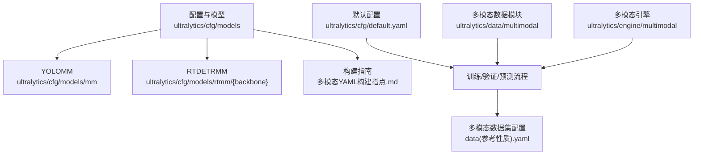
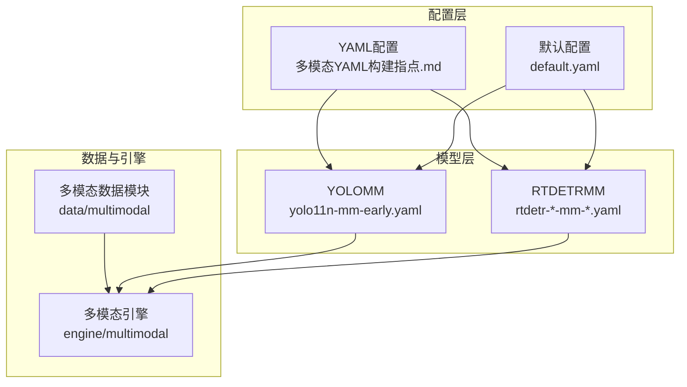
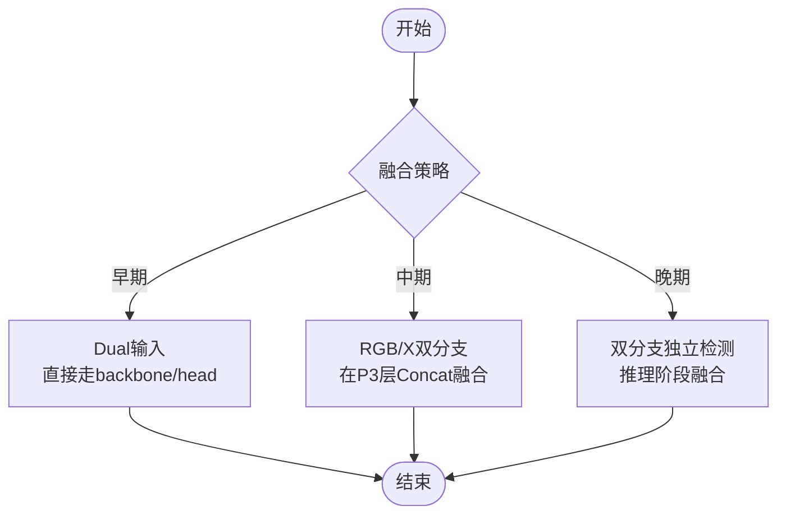
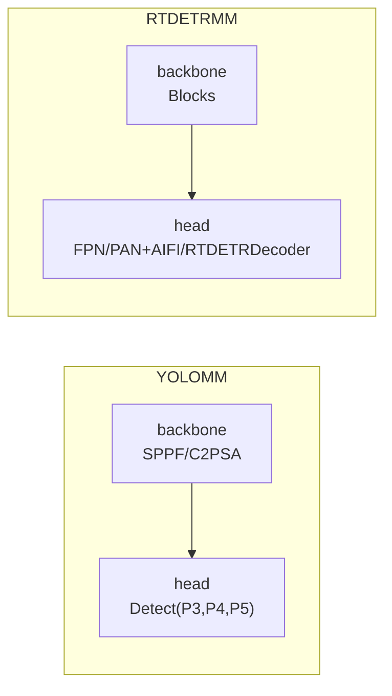
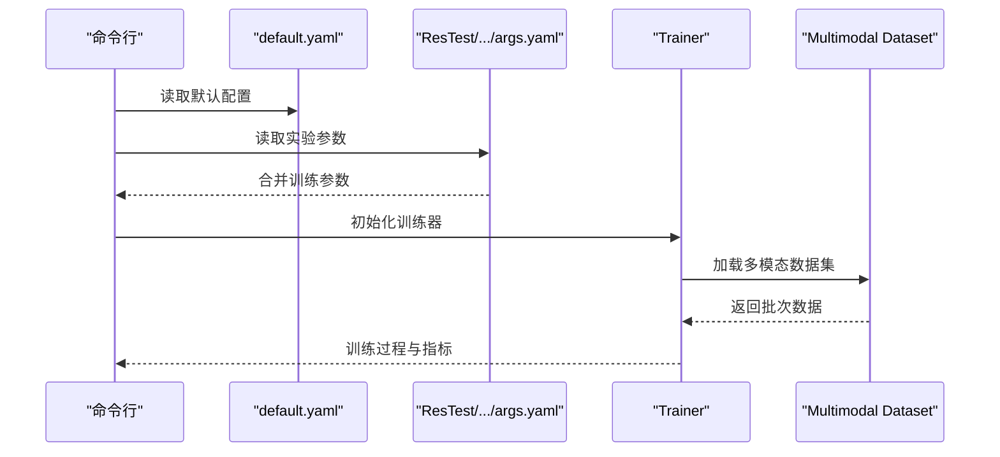
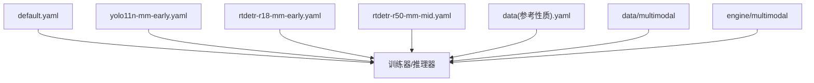

# 模型配置与管理

<cite>
**本文引用的文件**
- [多模态YAML构建指点.md](file://ultralytics/cfg/models/多模态YAML构建指点.md)
- [README.md](file://ultralytics/cfg/models/README.md)
- [default.yaml](file://ultralytics/cfg/default.yaml)
- [yolo11n-mm-early.yaml](file://ultralytics/cfg/models/mm/yolo11n-mm-early.yaml)
- [rtdetr-r18-mm-early.yaml](file://ultralytics/cfg/models/rtmm/r18/rtdetr-r18-mm-early.yaml)
- [rtdetr-r50-mm-mid.yaml](file://ultralytics/cfg/models/rtmm/r50/rtdetr-r50-mm-mid.yaml)
- [__init__.py（多模态引擎）](file://ultralytics/engine/multimodal/__init__.py)
- [__init__.py（多模态数据）](file://ultralytics/data/multimodal/__init__.py)
- [data(参考性质).yaml](file://data(参考性质).yaml)
- [aifi-dattention-CSP-MutilScaleEdgeInformationEnhance-ASF-P2-lite-BackboneFreqFusion\args.yaml](file://ResTest/aifi-dattention-CSP-MutilScaleEdgeInformationEnhance-ASF-P2-lite-BackboneFreqFusion/args.yaml)
</cite>

## 目录
1. [简介](#简介)
2. [项目结构](#项目结构)
3. [核心组件](#核心组件)
4. [架构总览](#架构总览)
5. [详细组件分析](#详细组件分析)
6. [依赖分析](#依赖分析)
7. [性能考虑](#性能考虑)
8. [故障排查指南](#故障排查指南)
9. [结论](#结论)
10. [附录](#附录)

## 简介
本文件面向多模态模型的配置与管理，系统化阐述YAML配置语法、参数含义、模型架构（YOLOMM与RTDETRMM）、多尺度特征处理机制及不同配置选项对性能的影响。文档同时提供完整配置参数参考手册、配置文件组织与继承关系说明，以及最佳实践与排错指引，帮助读者快速搭建与优化RGB+X（如深度、红外等）多模态目标检测系统。

## 项目结构
- 配置与模型
  - 模型配置目录：ultralytics/cfg/models
    - YOLOMM：ultralytics/cfg/models/mm
    - RTDETRMM：ultralytics/cfg/models/rtmm/{backbone}
    - 文档与构建指南：ultralytics/cfg/models/多模态YAML构建指点.md
  - 默认全局配置：ultralytics/cfg/default.yaml
- 多模态数据与推理引擎
  - 数据模块：ultralytics/data/multimodal
  - 推理引擎：ultralytics/engine/multimodal

**图表来源**
- [多模态YAML构建指点.md:1-239](file://ultralytics/cfg/models/多模态YAML构建指点.md#L1-L239)
- [default.yaml:1-168](file://ultralytics/cfg/default.yaml#L1-L168)
- [__init__.py（多模态数据）:1-21](file://ultralytics/data/multimodal/__init__.py#L1-L21)
- [__init__.py（多模态引擎）:1-9](file://ultralytics/engine/multimodal/__init__.py#L1-L9)

**章节来源**
- [README.md:1-66](file://ultralytics/cfg/models/README.md#L1-L66)
- [多模态YAML构建指点.md:1-239](file://ultralytics/cfg/models/多模态YAML构建指点.md#L1-L239)
- [default.yaml:1-168](file://ultralytics/cfg/default.yaml#L1-L168)

## 核心组件
- 多模态YAML构建指南：定义统一范式、五元组语法、通道规则、分支书写规范、常见融合范式（早期/中期/晚期）、RT-DETR范式模板、命名约定、验证与排查要点。
- 默认配置default.yaml：覆盖训练、验证、预测、导出、超参、跟踪器、多模态增强等键值，支持多模态训练增强开关与参数。
- YOLOMM/RTDETRMM配置样例：早期融合与中期融合的最小模板，展示backbone与head的典型堆叠方式。
- 多模态数据与引擎：提供数据对齐、张量转换、推理数据集与结果保存等能力。

**章节来源**
- [多模态YAML构建指点.md:1-239](file://ultralytics/cfg/models/多模态YAML构建指点.md#L1-L239)
- [default.yaml:134-168](file://ultralytics/cfg/default.yaml#L134-L168)
- [yolo11n-mm-early.yaml:1-59](file://ultralytics/cfg/models/mm/yolo11n-mm-early.yaml#L1-L59)
- [rtdetr-r18-mm-early.yaml:1-50](file://ultralytics/cfg/models/rtmm/r18/rtdetr-r18-mm-early.yaml#L1-L50)
- [rtdetr-r50-mm-mid.yaml:1-67](file://ultralytics/cfg/models/rtmm/r50/rtdetr-r50-mm-mid.yaml#L1-L67)
- [__init__.py（多模态数据）:1-21](file://ultralytics/data/multimodal/__init__.py#L1-L21)
- [__init__.py（多模态引擎）:1-9](file://ultralytics/engine/multimodal/__init__.py#L1-L9)

## 架构总览
多模态配置采用“配置驱动 + 第五字段路由”的统一范式，通过MultiModalRouter接管不同模态的输入与特征流，确保YOLO与RT-DETR均可复用同一套书写规则。早期融合在输入层直接拼接Dual通道，中期融合在P3/P4等中层进行特征拼接，晚期融合则在推理阶段决策融合。

**图表来源**
- [多模态YAML构建指点.md:1-239](file://ultralytics/cfg/models/多模态YAML构建指点.md#L1-L239)
- [default.yaml:134-168](file://ultralytics/cfg/default.yaml#L134-L168)
- [yolo11n-mm-early.yaml:1-59](file://ultralytics/cfg/models/mm/yolo11n-mm-early.yaml#L1-L59)
- [rtdetr-r18-mm-early.yaml:1-50](file://ultralytics/cfg/models/rtmm/r18/rtdetr-r18-mm-early.yaml#L1-L50)
- [rtdetr-r50-mm-mid.yaml:1-67](file://ultralytics/cfg/models/rtmm/r50/rtdetr-r50-mm-mid.yaml#L1-L67)
- [__init__.py（多模态数据）:1-21](file://ultralytics/data/multimodal/__init__.py#L1-L21)
- [__init__.py（多模态引擎）:1-9](file://ultralytics/engine/multimodal/__init__.py#L1-L9)

## 详细组件分析

### YAML语法与参数含义
- 五元组语法：[from, repeats, module, args, input_source]，其中input_source ∈ {'RGB','X','Dual'}，用于标注该层输入来源。
- 通道规则：RGB固定3通道；X由数据配置Xch决定；Dual=3+Xch。
- 分支书写规范：RGB与X分支必须连续、清晰分区，避免在融合前交叉引用。
- 常见融合范式：
  - 早期融合：输入层直接Dual融合，结构最简，适合模态配准良好场景。
  - 中期融合：在P3/P4等中层进行Concat融合，兼顾细节与语义。
  - 晚期融合：双分支各自独立检测，推理阶段决策融合。

**章节来源**
- [多模态YAML构建指点.md:20-118](file://ultralytics/cfg/models/多模态YAML构建指点.md#L20-L118)

### YOLOMM与RTDETRMM架构设计
- YOLOMM早期融合样例：backbone首层接受Dual输入，随后按标准YOLO堆叠，head输出P3/P4/P5检测。
- RTDETRMM早期/中期融合样例：早期融合同样以Dual输入；中期融合在P3层进行RGB与X特征拼接，再继续至P4/P5。

**图表来源**
- [多模态YAML构建指点.md:70-118](file://ultralytics/cfg/models/多模态YAML构建指点.md#L70-L118)
- [yolo11n-mm-early.yaml:19-53](file://ultralytics/cfg/models/mm/yolo11n-mm-early.yaml#L19-L53)
- [rtdetr-r18-mm-early.yaml:12-49](file://ultralytics/cfg/models/rtmm/r18/rtdetr-r18-mm-early.yaml#L12-L49)
- [rtdetr-r50-mm-mid.yaml:11-66](file://ultralytics/cfg/models/rtmm/r50/rtdetr-r50-mm-mid.yaml#L11-L66)

**章节来源**
- [yolo11n-mm-early.yaml:1-59](file://ultralytics/cfg/models/mm/yolo11n-mm-early.yaml#L1-L59)
- [rtdetr-r18-mm-early.yaml:1-50](file://ultralytics/cfg/models/rtmm/r18/rtdetr-r18-mm-early.yaml#L1-L50)
- [rtdetr-r50-mm-mid.yaml:1-67](file://ultralytics/cfg/models/rtmm/r50/rtdetr-r50-mm-mid.yaml#L1-L67)

### 多尺度特征处理机制
- YOLOMM：通过SPPF、C2PSA等模块在不同尺度（P3/P4/P5）生成检测头输入，head按金字塔结构向上采样与拼接。
- RTDETRMM：通过Blocks（BasicBlock/RTDETRBottleNeck）构建ResNet风格骨干，在P3/P4/P5生成特征，head采用FPN/PAN与AIFI/RTDETRDecoder。

**图表来源**
- [yolo11n-mm-early.yaml:20-53](file://ultralytics/cfg/models/mm/yolo11n-mm-early.yaml#L20-L53)
- [rtdetr-r18-mm-early.yaml:12-49](file://ultralytics/cfg/models/rtmm/r18/rtdetr-r18-mm-early.yaml#L12-L49)
- [rtdetr-r50-mm-mid.yaml:11-66](file://ultralytics/cfg/models/rtmm/r50/rtdetr-r50-mm-mid.yaml#L11-L66)

**章节来源**
- [yolo11n-mm-early.yaml:34-53](file://ultralytics/cfg/models/mm/yolo11n-mm-early.yaml#L34-L53)
- [rtdetr-r18-mm-early.yaml:25-49](file://ultralytics/cfg/models/rtmm/r18/rtdetr-r18-mm-early.yaml#L25-L49)
- [rtdetr-r50-mm-mid.yaml:40-66](file://ultralytics/cfg/models/rtmm/r50/rtdetr-r50-mm-mid.yaml#L40-L66)

### 配置参数参考手册（训练/验证/预测/导出）
以下参数来自默认配置文件，涵盖训练、验证、预测、导出、超参与多模态增强等关键键位。为避免冗长，此处列出键名与含义，具体数值请参考对应文件。

- 任务与模式
  - task：任务类型（detect/segment/classify/pose/obb）
  - mode：运行模式（train/val/predict/export/track/benchmark）
- 训练设置
  - model：模型文件路径（.yaml/.pt）
  - model_scale：模型规模选择（n/s/m/l/x）
  - data：数据集配置路径（.yaml）
  - epochs/batch/imgsz：训练轮数、批大小、输入尺寸
  - save/save_period：保存检查点与周期
  - cache/device/workers：缓存策略、设备、工作线程
  - project/name/exist_ok：实验目录与名称控制
  - pretrained：是否使用预训练权重
  - optimizer：优化器选择
  - verbose/debug：输出详细程度与调试日志
  - seed/deterministic：随机种子与确定性
  - single_cls/rect：单类训练与矩形训练
  - cos_lr：余弦退火学习率调度
  - patience/close_mosaic：早停与Mosaic关闭轮次
  - resume：断点续训
  - amp：自动混合精度
  - fraction/profile：数据比例与性能分析
  - freeze：冻结层
  - multi_scale：多尺度训练
  - overlap_mask/mask_ratio：分割任务掩码合并与下采样
  - dropout：分类任务正则化
- 验证/测试设置
  - val/split：验证开关与数据集划分
  - save_json：保存结果为JSON
  - conf/iou/max_det：检测阈值与NMS阈值、最大检测数
  - half/dnn/plots：半精度、OpenCV DNN、绘图
- 预测设置
  - source/vid_stride/stream_buffer：源路径与视频帧步长
  - visualize/augment：特征可视化与推理增强
  - agnostic_nms/classes：类别无关NMS与类别过滤
  - retina_masks/embed：高分辨率掩码与嵌入层
- 导出设置
  - format/keras/optimize/int8/dynamic/simplify/opset/workspace/nms：导出格式与量化/简化/动态维度等
- 超参数
  - lr0/lrf/momentum/weight_decay/warmup_*：学习率与动量、权重衰减、预热
  - box/cls/dfl/pose/kobj/nbs：损失权重与名义批大小
  - hsv_h/sat/val/degrees/translate/scale/img_scale/shear/perspective/fliplr/fliplud/bgr/mosaic/mixup/cutmix/copy_paste/auto_augment/erasing：数据增强与策略
- 跟踪器设置
  - tracker：跟踪器配置文件（botsort.yaml/bytetrack.yaml）
- 多模态扩展（YOLOMM）
  - mm_project_version：多模态项目版本号
  - modality：推理时选择模态（rgb/depth/thermal/ir/None）
  - use_multimodal_aug：启用独立的多模态增强管道
  - mm_rgb_albu_enable/mm_rgb_albu_cfg：RGB非几何增强开关与配置
  - mm_async_geo_p/mm_async_geo_translate_px/mm_async_geo_rotate_deg/mm_async_geo_target/mm_async_geo_border：异步几何扰动概率与参数
  - mm_modal_dropout_p/mm_modal_dropout_area/mm_modal_dropout_ratio/mm_modal_dropout_target/mm_modal_dropout_fill/mm_modal_dropout_fill_const：模态擦除概率与参数
  - mm_x_non_geo_enable/mm_x_non_geo_cfg：X模态非几何增强开关与配置

**章节来源**
- [default.yaml:6-168](file://ultralytics/cfg/default.yaml#L6-L168)

### 数据集配置与模态组合
- 数据集配置示例展示了路径、模态映射、当前使用的模态组合与类别名称。
- 多模态配置强调通过data.yaml中的modality_used/modality/Xch来声明模态组合与X通道数，从而影响Dual通道与输入形状。

**章节来源**
- [data(参考性质).yaml](file://data(参考性质).yaml#L1-L28)
- [多模态YAML构建指点.md:165-178](file://ultralytics/cfg/models/多模态YAML构建指点.md#L165-L178)

### 配置文件组织与继承关系
- 目录约定：YOLOMM集中于ultralytics/cfg/models/mm；RTDETRMM按backbone分目录（如rtmm/r18、rtmm/r50）；标准RT-DETR配置位于ultralytics/cfg/models/rt-detr。
- 命名约定：<family>-<variant>-mm-<strategy>.yaml，便于识别模型家族、变体与融合策略。
- 继承关系：通过model_scale（n/s/m/l/x）与scales参数实现复合缩放；训练时可通过CLI/Python显式传入scale或model_scale。

**章节来源**
- [多模态YAML构建指点.md:181-191](file://ultralytics/cfg/models/多模态YAML构建指点.md#L181-L191)
- [yolo11n-mm-early.yaml:7-14](file://ultralytics/cfg/models/mm/yolo11n-mm-early.yaml#L7-L14)

### 训练流程与参数传递示例
以下序列图展示从命令行到训练执行的关键调用链，体现参数如何从配置文件传递到训练器。

**图表来源**
- [default.yaml:1-168](file://ultralytics/cfg/default.yaml#L1-L168)
- [aifi-dattention-CSP-MutilScaleEdgeInformationEnhance-ASF-P2-lite-BackboneFreqFusion\args.yaml:1-135](file://ResTest/aifi-dattention-CSP-MutilScaleEdgeInformationEnhance-ASF-P2-lite-BackboneFreqFusion/args.yaml#L1-L135)

**章节来源**
- [aifi-dattention-CSP-MutilScaleEdgeInformationEnhance-ASF-P2-lite-BackboneFreqFusion\args.yaml:1-135](file://ResTest/aifi-dattention-CSP-MutilScaleEdgeInformationEnhance-ASF-P2-lite-BackboneFreqFusion/args.yaml#L1-L135)

## 依赖分析
- 配置到模型：default.yaml与各模型配置文件（如yolo11n-mm-early.yaml、rtdetr-*-mm-*.yaml）共同决定训练/推理行为。
- 数据到引擎：data/multimodal提供数据对齐与张量转换，engine/multimodal提供推理与结果保存。
- 多模态增强：default.yaml中的多模态增强键位在训练时生效，影响RGB与X的几何/非几何增强策略。

**图表来源**
- [default.yaml:134-168](file://ultralytics/cfg/default.yaml#L134-L168)
- [yolo11n-mm-early.yaml:1-59](file://ultralytics/cfg/models/mm/yolo11n-mm-early.yaml#L1-L59)
- [rtdetr-r18-mm-early.yaml:1-50](file://ultralytics/cfg/models/rtmm/r18/rtdetr-r18-mm-early.yaml#L1-L50)
- [rtdetr-r50-mm-mid.yaml:1-67](file://ultralytics/cfg/models/rtmm/r50/rtdetr-r50-mm-mid.yaml#L1-L67)
- [data(参考性质).yaml](file://data(参考性质).yaml#L1-L28)
- [__init__.py（多模态数据）:1-21](file://ultralytics/data/multimodal/__init__.py#L1-L21)
- [__init__.py（多模态引擎）:1-9](file://ultralytics/engine/multimodal/__init__.py#L1-L9)

**章节来源**
- [__init__.py（多模态数据）:1-21](file://ultralytics/data/multimodal/__init__.py#L1-L21)
- [__init__.py（多模态引擎）:1-9](file://ultralytics/engine/multimodal/__init__.py#L1-L9)

## 性能考虑
- 早期融合：结构简单、计算高效，适合模态配准良好场景；注意Dual通道带来的内存与带宽压力。
- 中期融合：在P3/P4层融合，兼顾细节与语义，适合互补明显的模态；需平衡融合层通道数与算力消耗。
- 晚期融合：两路独立，鲁棒性高，但推理阶段需额外融合策略；适合极端场景或需要解耦的部署。
- 多尺度与多模态增强：合理设置mosaic、mixup、copy_paste与多模态异步扰动/擦除，有助于提升泛化与鲁棒性，但可能增加训练时间与显存占用。
- 设备与AMP：在GPU上开启AMP可显著提升吞吐；合理设置batch与workers以充分利用硬件资源。

## 故障排查指南
- 通道不匹配：检查data.yaml中的Xch与Dual通道计算；确认输入起点仅使用'Dual'，融合处使用'RGB'/'X'并Concat。
- 模块未导入：确认模块已在ultralytics/nn/modules/__init__.py或相应extra_modules中导出。
- 结果融合：示例中DecisionFusion为占位注释，需自行实现或替换为外部融合脚本。
- 运行确认：使用profile=True查看Router路由日志，核对RGB/X/Dual形状与空间重置信息。

**章节来源**
- [多模态YAML构建指点.md:206-225](file://ultralytics/cfg/models/多模态YAML构建指点.md#L206-L225)

## 结论
通过统一的多模态YAML范式与完善的配置体系，本项目实现了YOLO与RT-DETR在RGB+X场景下的灵活配置与高效训练。遵循“早期/中期/晚期”融合策略与严格的分支书写规范，结合default.yaml提供的丰富训练与增强参数，可快速搭建并优化多模态目标检测系统。建议在实际工程中优先采用早期融合以获得更佳速度，再根据任务复杂度逐步过渡到中期/晚期融合。

## 附录
- 命名与约定速查
  - 文件命名：<family>-<variant>-mm-<strategy>.yaml
  - 目录约定：YOLOMM→ultralytics/cfg/models/mm；RTDETRMM→ultralytics/cfg/models/rtmm/{backbone}
  - 模型规模：n/s/m/l/x
- 最小可用清单（Checklist）
  - [ ] data.yaml配置modality_used/modality/Xch
  - [ ] YAML第五字段标注'RGB'/'X'/'Dual'
  - [ ] 仅在输入起点使用'Dual'，中/晚融合处使用'RGB'/'X'分路+Concat
  - [ ] X分支新起点使用from=-1+'X'
  - [ ] 模块均已在相应__init__.py正确导出
  - [ ] 使用model.info()或profile=True检查路由与形状

**章节来源**
- [多模态YAML构建指点.md:181-235](file://ultralytics/cfg/models/多模态YAML构建指点.md#L181-L235)