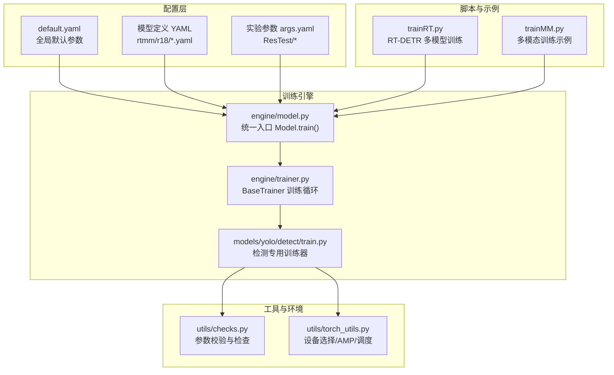
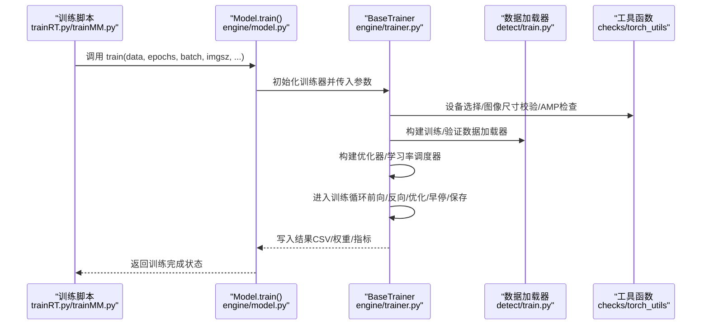
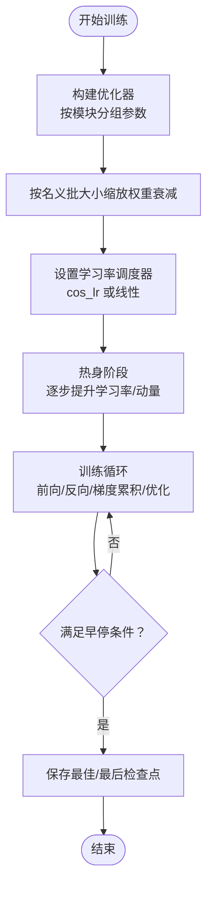
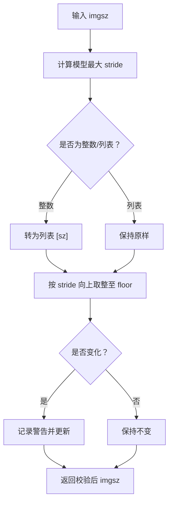
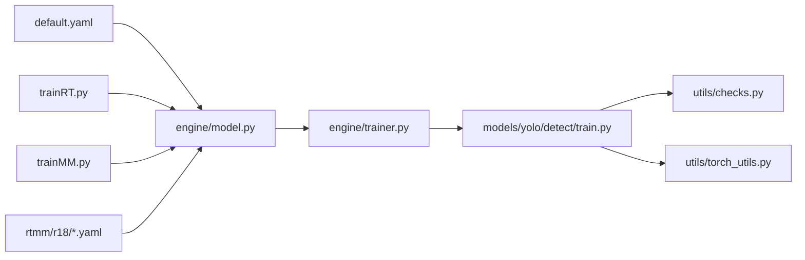

# 基础训练参数配置

<cite>
**本文档引用的文件**
- [ultralytics/cfg/default.yaml](file://ultralytics/cfg/default.yaml)
- [ultralytics/engine/trainer.py](file://ultralytics/engine/trainer.py)
- [ultralytics/engine/model.py](file://ultralytics/engine/model.py)
- [ultralytics/utils/checks.py](file://ultralytics/utils/checks.py)
- [ultralytics/utils/torch_utils.py](file://ultralytics/utils/torch_utils.py)
- [ultralytics/models/yolo/detect/train.py](file://ultralytics/models/yolo/detect/train.py)
- [trainRT.py](file://trainRT.py)
- [trainMM.py](file://trainMM.py)
- [ResTest/aifi-dattention-CSP-MutilScaleEdgeInformationEnhance-ASF-P2-lite-BackboneChannelGate/args.yaml](file://ResTest/aifi-dattention-CSP-MutilScaleEdgeInformationEnhance-ASF-P2-lite-BackboneChannelGate/args.yaml)
- [ultralytics/cfg/models/rtmm/r18/aifi-dattention-CSP-MutilScaleEdgeInformationEnhance-ASF-P2-lite-BackboneChannelGate.yaml](file://ultralytics/cfg/models/rtmm/r18/aifi-dattention-CSP-MutilScaleEdgeInformationEnhance-ASF-P2-lite-BackboneChannelGate.yaml)
- [ultralytics/cfg/models/rtmm/r18/aifi-dattention-CSP-MutilScaleEdgeInformationEnhance-ASF-P2-lite-ScalarGate.yaml](file://ultralytics/cfg/models/rtmm/r18/aifi-dattention-CSP-MutilScaleEdgeInformationEnhance-ASF-P2-lite-ScalarGate.yaml)
</cite>

## 目录
1. [简介](#简介)
2. [项目结构](#项目结构)
3. [核心组件](#核心组件)
4. [架构总览](#架构总览)
5. [详细组件分析](#详细组件分析)
6. [依赖分析](#依赖分析)
7. [性能考虑](#性能考虑)
8. [故障排除指南](#故障排除指南)
9. [结论](#结论)
10. [附录](#附录)

## 简介
本文件系统性梳理该代码库中基础训练参数配置，覆盖模型路径、数据集配置、训练轮数、批次大小、输入图像尺寸等基础配置项；解释学习率与优化器、权重衰减等超参数的作用与配置方法；阐述数据加载参数（工作线程数、缓存策略、设备选择）对训练性能的影响；并提供不同任务类型的基础配置模板与最佳实践建议。

## 项目结构
该仓库围绕 Ultralytics 训练框架组织，核心训练入口位于引擎模块，参数默认值集中在全局配置文件，具体任务（检测、分割、分类等）在各自子模块中实现。多模态（RGB+X）场景通过专用配置与模型定义扩展。

**图表来源**
- [ultralytics/cfg/default.yaml:1-168](file://ultralytics/cfg/default.yaml#L1-L168)
- [ultralytics/engine/model.py:791-800](file://ultralytics/engine/model.py#L791-L800)
- [ultralytics/engine/trainer.py:191-228](file://ultralytics/engine/trainer.py#L191-L228)
- [ultralytics/models/yolo/detect/train.py:79-90](file://ultralytics/models/yolo/detect/train.py#L79-L90)
- [ultralytics/utils/checks.py:115-166](file://ultralytics/utils/checks.py#L115-L166)
- [ultralytics/utils/torch_utils.py:131-200](file://ultralytics/utils/torch_utils.py#L131-L200)
- [trainRT.py:9-77](file://trainRT.py#L9-L77)
- [trainMM.py:1-15](file://trainMM.py#L1-L15)

**章节来源**
- [ultralytics/cfg/default.yaml:1-168](file://ultralytics/cfg/default.yaml#L1-L168)
- [ultralytics/engine/model.py:791-800](file://ultralytics/engine/model.py#L791-L800)
- [ultralytics/engine/trainer.py:191-228](file://ultralytics/engine/trainer.py#L191-L228)
- [ultralytics/models/yolo/detect/train.py:79-90](file://ultralytics/models/yolo/detect/train.py#L79-L90)
- [ultralytics/utils/checks.py:115-166](file://ultralytics/utils/checks.py#L115-L166)
- [ultralytics/utils/torch_utils.py:131-200](file://ultralytics/utils/torch_utils.py#L131-L200)
- [trainRT.py:9-77](file://trainRT.py#L9-L77)
- [trainMM.py:1-15](file://trainMM.py#L1-L15)

## 核心组件
- 全局默认配置 default.yaml：集中定义训练、验证、预测、导出等阶段的默认参数键值，是所有训练配置的“根”。
- 训练器 BaseTrainer：负责训练循环、数据加载、优化器与学习率调度、早停、断点续训、指标记录等。
- 检测专用训练器：在通用训练器基础上实现检测任务的数据加载、损失计算与评估流程。
- 工具函数：参数校验（图像尺寸、数据集）、设备选择与 AMP、自动批大小估算等。
- 示例脚本：trainRT.py 展示多模型顺序训练与内存管理；trainMM.py 展示多模态训练入口。

**章节来源**
- [ultralytics/cfg/default.yaml:6-168](file://ultralytics/cfg/default.yaml#L6-L168)
- [ultralytics/engine/trainer.py:59-178](file://ultralytics/engine/trainer.py#L59-L178)
- [ultralytics/models/yolo/detect/train.py:79-90](file://ultralytics/models/yolo/detect/train.py#L79-L90)
- [ultralytics/utils/checks.py:115-166](file://ultralytics/utils/checks.py#L115-L166)
- [ultralytics/utils/torch_utils.py:131-200](file://ultralytics/utils/torch_utils.py#L131-L200)
- [trainRT.py:9-77](file://trainRT.py#L9-L77)
- [trainMM.py:1-15](file://trainMM.py#L1-L15)

## 架构总览
训练参数从配置文件与命令行/脚本传参进入 Model.train()，经由统一入口加载模型与数据，再交由 BaseTrainer 完成训练循环与优化器/调度器初始化，最终写入结果与可视化。

**图表来源**
- [ultralytics/engine/model.py:791-800](file://ultralytics/engine/model.py#L791-L800)
- [ultralytics/engine/trainer.py:191-228](file://ultralytics/engine/trainer.py#L191-L228)
- [ultralytics/models/yolo/detect/train.py:79-90](file://ultralytics/models/yolo/detect/train.py#L79-L90)
- [ultralytics/utils/checks.py:115-166](file://ultralytics/utils/checks.py#L115-L166)
- [ultralytics/utils/torch_utils.py:131-200](file://ultralytics/utils/torch_utils.py#L131-L200)

## 详细组件分析

### 基础训练参数键值与作用
- 模型路径与类型
  - model：模型权重或 YAML 路径；支持从 PT 权重或 YAML 构建。
  - task：任务类型（detect/segment/classify/pose/obb）。
  - pretrained：是否使用预训练权重或指定权重文件。
- 数据集配置
  - data：数据 YAML 路径，包含训练/验证/类别名等。
  - single_cls：将多类数据视为单类训练。
  - rect：矩形训练/验证，提升推理效率。
  - fraction：训练数据比例（0-1），用于快速试验。
- 训练控制
  - epochs：训练轮数。
  - time：按小时训练，覆盖 epochs。
  - patience：早停耐心轮数。
  - resume：从上次检查点恢复训练。
  - close_mosaic：最后若干轮关闭马赛克增强。
  - multi_scale：训练期间多尺度缩放。
  - freeze：冻结前 N 层或指定索引层。
- 批次与图像尺寸
  - batch：每批图像数量；-1 表示自动批大小。
  - imgsz：整数或 [h,w]，训练/验证输入尺寸。
  - nbs：名义批大小，用于权重衰减缩放与梯度累积。
- 设备与并行
  - device：GPU/CPU/MPS 选择，支持多卡逗号分隔。
  - workers：数据加载工作线程数。
  - amp：自动混合精度（AMP）。
  - deterministic：确定性训练（影响性能与可复现性）。
- 日志与可视化
  - save/save_period：保存检查点与周期。
  - plots：训练/验证时保存图表。
  - save_dir/project/name/exist_ok：实验目录与命名规则。

**章节来源**
- [ultralytics/cfg/default.yaml:6-47](file://ultralytics/cfg/default.yaml#L6-L47)
- [ultralytics/cfg/default.yaml:92-126](file://ultralytics/cfg/default.yaml#L92-L126)

### 学习率与优化器配置
- 学习率与调度
  - lr0：初始学习率；不同优化器有默认推荐值。
  - lrf：最终学习率（lr0 × lrf）。
  - cos_lr：是否使用余弦退火调度。
  - warmup_epochs/warmup_momentum/warmup_bias_lr：热身轮数与对应动量/偏置学习率。
- 优化器与权重衰减
  - optimizer：可选 SGD、Adam、AdamW、Adamax、NAdam、RAdam、RMSProp、auto。
  - weight_decay：优化器权重衰减；训练器会按 batch_size 和累积步数进行缩放。
  - nbs：名义批大小，用于稳定不同 batch 尺寸下的权重衰减。
- 梯度累积
  - accumulate = max(round(nbs / batch_size), 1)，在每次优化前累积损失，模拟更大 batch。

**图表来源**
- [ultralytics/engine/trainer.py:325-342](file://ultralytics/engine/trainer.py#L325-L342)
- [ultralytics/engine/trainer.py:853-900](file://ultralytics/engine/trainer.py#L853-L900)

**章节来源**
- [ultralytics/engine/trainer.py:229-236](file://ultralytics/engine/trainer.py#L229-L236)
- [ultralytics/engine/trainer.py:325-342](file://ultralytics/engine/trainer.py#L325-L342)
- [ultralytics/engine/trainer.py:853-900](file://ultralytics/engine/trainer.py#L853-L900)

### 数据加载参数与性能影响
- workers：训练时数据加载工作线程数；CPU 训练时强制为 0 以减少数据加载开销。
- cache：是否缓存数据集到内存/磁盘，加速重复迭代。
- rect：矩形训练/验证，提升推理效率但需注意与 DataLoader shuffle 的兼容性。
- 图像尺寸校验：imgsz 必须为 stride 的倍数，自动向上取整至最小允许值。
- 自动批大小：根据模型与显存估算最优 batch，检测训练器提供专用 auto_batch 实现。

**图表来源**
- [ultralytics/utils/checks.py:115-166](file://ultralytics/utils/checks.py#L115-L166)

**章节来源**
- [ultralytics/engine/trainer.py:147-148](file://ultralytics/engine/trainer.py#L147-L148)
- [ultralytics/utils/checks.py:115-166](file://ultralytics/utils/checks.py#L115-L166)
- [ultralytics/models/yolo/detect/train.py:210-221](file://ultralytics/models/yolo/detect/train.py#L210-L221)

### 设备选择与 AMP
- 设备选择：支持 CPU、CUDA、MPS；多卡逗号分隔；-1 可自动选择空闲 GPU。
- AMP：在支持的设备上启用自动混合精度，提升吞吐并降低显存占用。
- 分布式训练：多卡时自动广播 AMP 开关与参数同步。

**章节来源**
- [ultralytics/utils/torch_utils.py:131-200](file://ultralytics/utils/torch_utils.py#L131-L200)
- [ultralytics/engine/trainer.py:281-294](file://ultralytics/engine/trainer.py#L281-L294)

### 多模态训练参数（RGB+X）
- modality：推理时选择模态（rgb/depth/thermal/ir/None）。
- use_multimodal_aug：是否启用独立的多模态增强流水线。
- mm_rgb_albu_enable/mm_rgb_albu_cfg：RGB 专属非几何增强开关与配置。
- mm_async_geo_*：异步几何扰动概率与参数。
- mm_modal_dropout_*：模态擦除/非对称擦除的概率与区域范围。
- mm_x_non_geo_*：X 模态专属非几何增强开关与配置。

**章节来源**
- [ultralytics/cfg/default.yaml:140-168](file://ultralytics/cfg/default.yaml#L140-L168)

### 不同任务类型的基础配置模板
- 检测（Detect）
  - 关键参数：task=detect、data、epochs、batch、imgsz、optimizer、lr0、weight_decay、warmup_epochs、cos_lr、patience、save、plots。
  - 示例：ResTest 中各模型的 args.yaml 展示了典型配置。
- 多模态（RT-DETR MM）
  - 关键参数：model 指向 rtmm/r18 下的 YAML；modality、use_multimodal_aug、workers、amp、deterministic 等。
  - 示例：trainRT.py 展示了多模型顺序训练与内存释放流程。
- 多模态（YOLOMM）
  - 关键参数：YOLOMM('*.yaml')、data、epochs、batch、project/name、amp、workers 等。
  - 示例：trainMM.py 展示了多模态训练入口与参数传入。

**章节来源**
- [ResTest/aifi-dattention-CSP-MutilScaleEdgeInformationEnhance-ASF-P2-lite-BackboneChannelGate/args.yaml:1-135](file://ResTest/aifi-dattention-CSP-MutilScaleEdgeInformationEnhance-ASF-P2-lite-BackboneChannelGate/args.yaml#L1-L135)
- [trainRT.py:9-77](file://trainRT.py#L9-L77)
- [trainMM.py:1-15](file://trainMM.py#L1-L15)
- [ultralytics/cfg/models/rtmm/r18/aifi-dattention-CSP-MutilScaleEdgeInformationEnhance-ASF-P2-lite-BackboneChannelGate.yaml:1-71](file://ultralytics/cfg/models/rtmm/r18/aifi-dattention-CSP-MutilScaleEdgeInformationEnhance-ASF-P2-lite-BackboneChannelGate.yaml#L1-L71)
- [ultralytics/cfg/models/rtmm/r18/aifi-dattention-CSP-MutilScaleEdgeInformationEnhance-ASF-P2-lite-ScalarGate.yaml:1-72](file://ultralytics/cfg/models/rtmm/r18/aifi-dattention-CSP-MutilScaleEdgeInformationEnhance-ASF-P2-lite-ScalarGate.yaml#L1-L72)

## 依赖分析
- 配置依赖：default.yaml 为全局默认，具体任务 YAML（如 rtmm/r18/*.yaml）覆盖模型结构与通道数等。
- 训练器依赖：BaseTrainer 依赖工具模块（设备选择、AMP、参数校验）与数据加载器；检测训练器进一步依赖数据集构建与 DataLoader。
- 脚本依赖：trainRT.py 与 trainMM.py 作为训练入口，调用 Model.train() 并传入参数。

**图表来源**
- [ultralytics/cfg/default.yaml:1-168](file://ultralytics/cfg/default.yaml#L1-L168)
- [ultralytics/engine/model.py:791-800](file://ultralytics/engine/model.py#L791-L800)
- [ultralytics/engine/trainer.py:191-228](file://ultralytics/engine/trainer.py#L191-L228)
- [ultralytics/models/yolo/detect/train.py:79-90](file://ultralytics/models/yolo/detect/train.py#L79-L90)
- [ultralytics/utils/checks.py:115-166](file://ultralytics/utils/checks.py#L115-L166)
- [ultralytics/utils/torch_utils.py:131-200](file://ultralytics/utils/torch_utils.py#L131-L200)
- [trainRT.py:9-77](file://trainRT.py#L9-L77)
- [trainMM.py:1-15](file://trainMM.py#L1-L15)
- [ultralytics/cfg/models/rtmm/r18/aifi-dattention-CSP-MutilScaleEdgeInformationEnhance-ASF-P2-lite-BackboneChannelGate.yaml:1-71](file://ultralytics/cfg/models/rtmm/r18/aifi-dattention-CSP-MutilScaleEdgeInformationEnhance-ASF-P2-lite-BackboneChannelGate.yaml#L1-L71)

**章节来源**
- [ultralytics/cfg/default.yaml:1-168](file://ultralytics/cfg/default.yaml#L1-L168)
- [ultralytics/engine/model.py:791-800](file://ultralytics/engine/model.py#L791-L800)
- [ultralytics/engine/trainer.py:191-228](file://ultralytics/engine/trainer.py#L191-L228)
- [ultralytics/models/yolo/detect/train.py:79-90](file://ultralytics/models/yolo/detect/train.py#L79-L90)
- [ultralytics/utils/checks.py:115-166](file://ultralytics/utils/checks.py#L115-L166)
- [ultralytics/utils/torch_utils.py:131-200](file://ultralytics/utils/torch_utils.py#L131-L200)
- [trainRT.py:9-77](file://trainRT.py#L9-L77)
- [trainMM.py:1-15](file://trainMM.py#L1-L15)
- [ultralytics/cfg/models/rtmm/r18/aifi-dattention-CSP-MutilScaleEdgeInformationEnhance-ASF-P2-lite-BackboneChannelGate.yaml:1-71](file://ultralytics/cfg/models/rtmm/r18/aifi-dattention-CSP-MutilScaleEdgeInformationEnhance-ASF-P2-lite-BackboneChannelGate.yaml#L1-L71)

## 性能考虑
- 批次大小与梯度累积：增大 batch 提升稳定性但占用显存；通过 nbs 与 accumulate 组合实现大 batch 效果。
- 学习率与调度：cos_lr 在长程训练中更稳定；warmup 减少初期震荡。
- AMP：在支持设备上显著提升吞吐与降低显存，部分变体可适当放宽 determinism 以减少 NaN 风险。
- 数据加载：合理设置 workers，避免过多导致 CPU 抢占；必要时启用 cache；rect 推理提升效率。
- 设备选择：多卡时确保 batch 是 GPU 数的整数倍；-1 自动选择空闲 GPU 时注意资源竞争。

[本节为通用指导，无需特定文件来源]

## 故障排除指南
- 图像尺寸不合法
  - 现象：日志警告“imgsz 必须为 stride 的倍数”。
  - 处理：调整 imgsz 使其为 stride 倍数；或使用默认自动校验逻辑。
- 多卡批大小不匹配
  - 现象：报错“batch 必须为 GPU 数的整数倍”。
  - 处理：将 batch 调整为 GPU 数的整数倍。
- AutoBatch 与多卡冲突
  - 现象：多卡训练时 AutoBatch 不支持 batch<1。
  - 处理：显式设置合理的 batch 值。
- 断点续训参数冲突
  - 现象：resume 与 model_scale/scale 冲突。
  - 处理：恢复训练时不要修改架构相关参数。
- 设备不可用
  - 现象：CUDA/MPS 不可用时回退 CPU。
  - 处理：确认驱动与 PyTorch 版本匹配；必要时切换 CPU。

**章节来源**
- [ultralytics/utils/checks.py:115-166](file://ultralytics/utils/checks.py#L115-L166)
- [ultralytics/utils/torch_utils.py:222-235](file://ultralytics/utils/torch_utils.py#L222-L235)
- [ultralytics/engine/trainer.py:191-214](file://ultralytics/engine/trainer.py#L191-L214)
- [ultralytics/engine/trainer.py:765-800](file://ultralytics/engine/trainer.py#L765-L800)

## 结论
本文件基于仓库实际代码梳理了基础训练参数配置，明确了参数键值、优化器与学习率调度、数据加载与设备选择对性能的影响，并提供了多任务与多模态的基础模板与最佳实践建议。建议在首次训练时采用默认配置，结合任务特点逐步微调关键参数（如 batch、imgsz、optimizer、lr0、weight_decay、patience 等），并通过 plots 与 results.csv 持续监控训练曲线。

[本节为总结，无需特定文件来源]

## 附录
- 常用参数速查
  - 模型与任务：model、task、pretrained
  - 数据集：data、single_cls、rect、fraction
  - 训练控制：epochs、time、patience、resume、close_mosaic、multi_scale、freeze
  - 批次与尺寸：batch、imgsz、nbs
  - 设备与并行：device、workers、amp、deterministic
  - 日志与可视化：save、save_period、plots、save_dir/project/name/exist_ok
  - 学习率与优化器：lr0、lrf、cos_lr、warmup_epochs、warmup_momentum、warmup_bias_lr、optimizer、weight_decay
  - 多模态：modality、use_multimodal_aug、mm_rgb_albu_*、mm_async_geo_*、mm_modal_dropout_*、mm_x_non_geo_*

[本节为补充信息，无需特定文件来源]