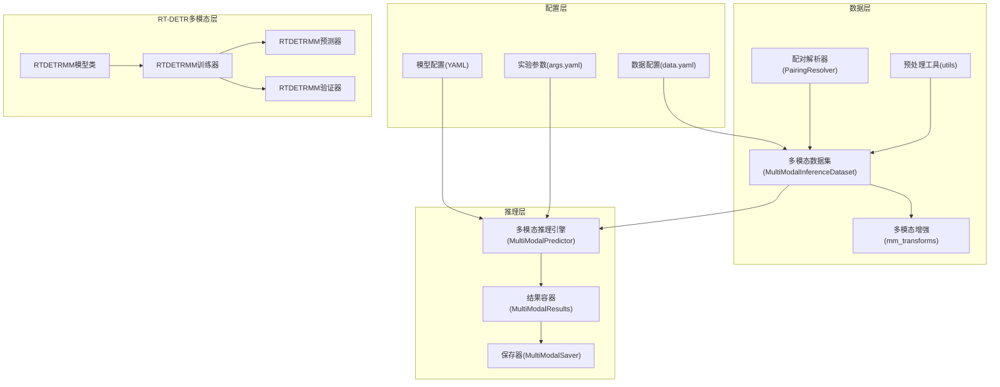
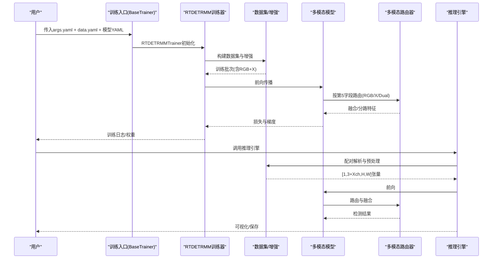
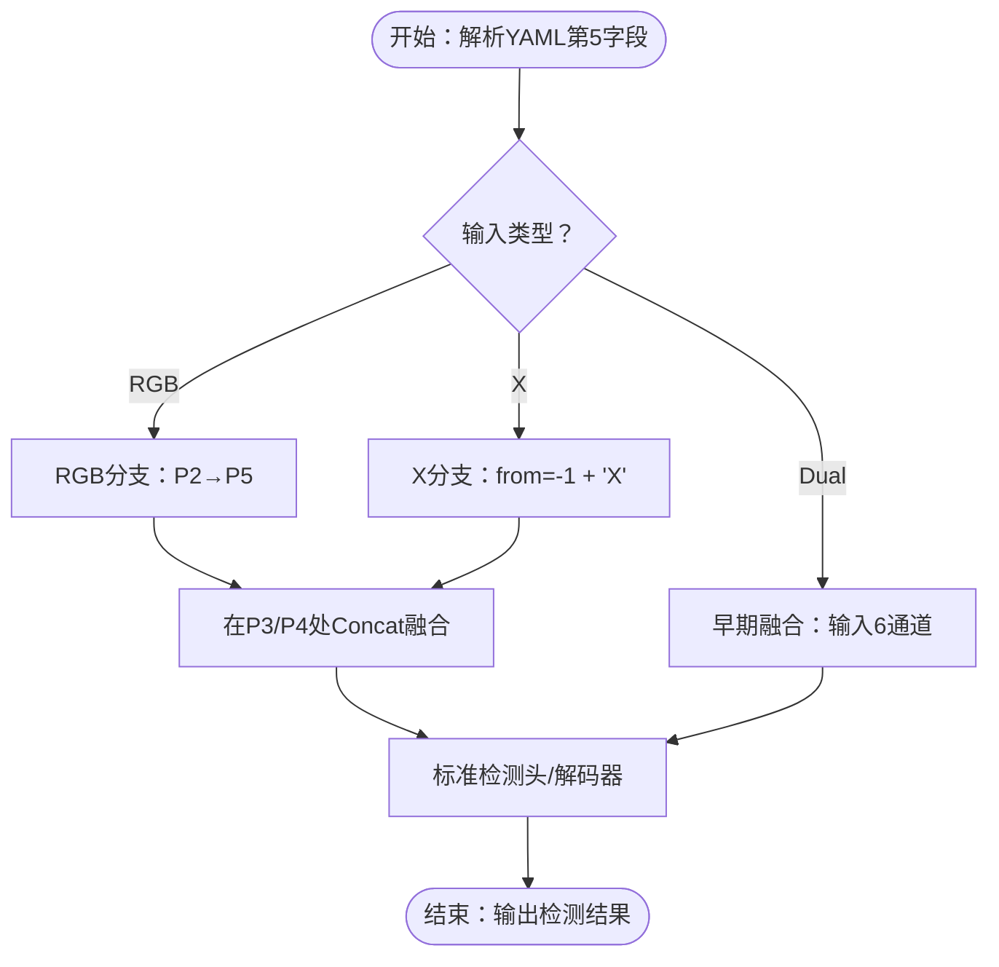
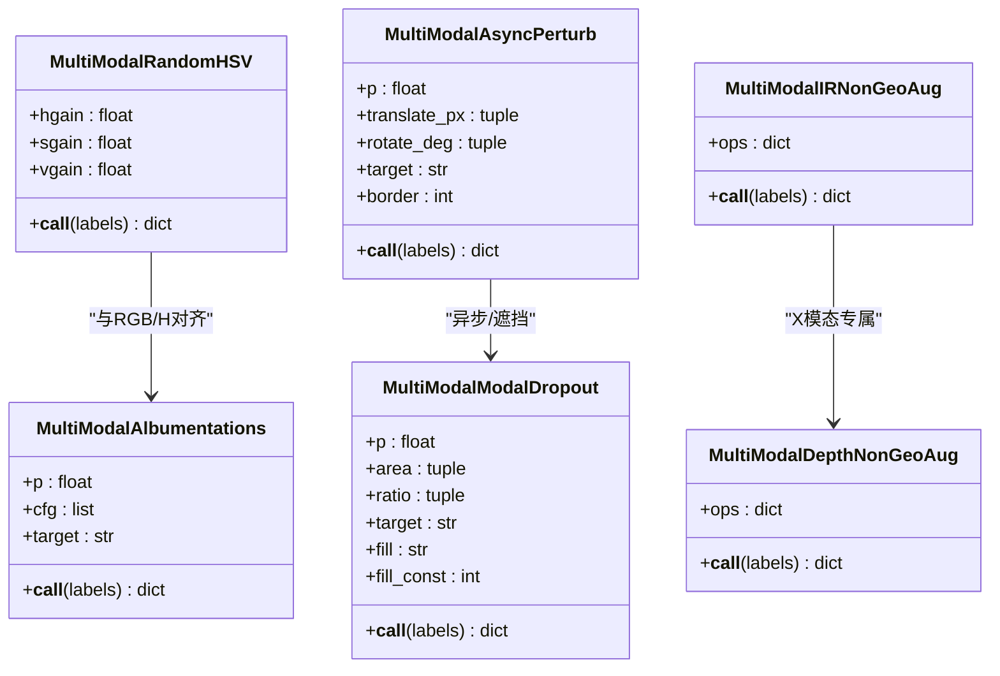
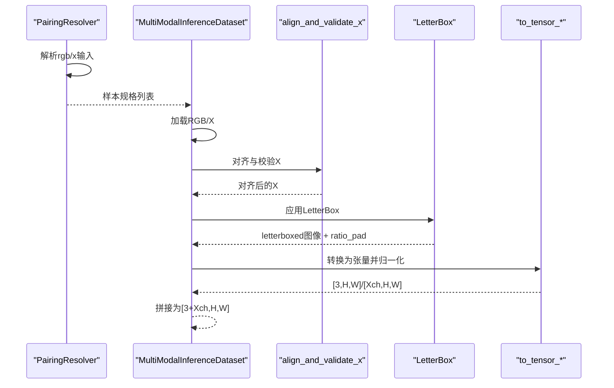
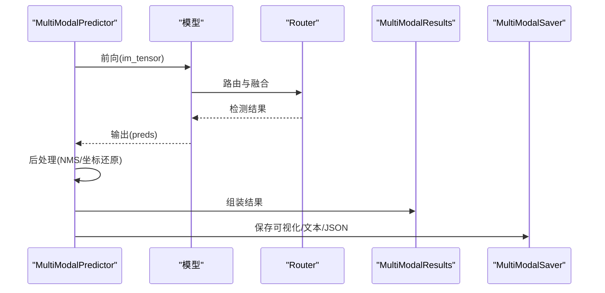
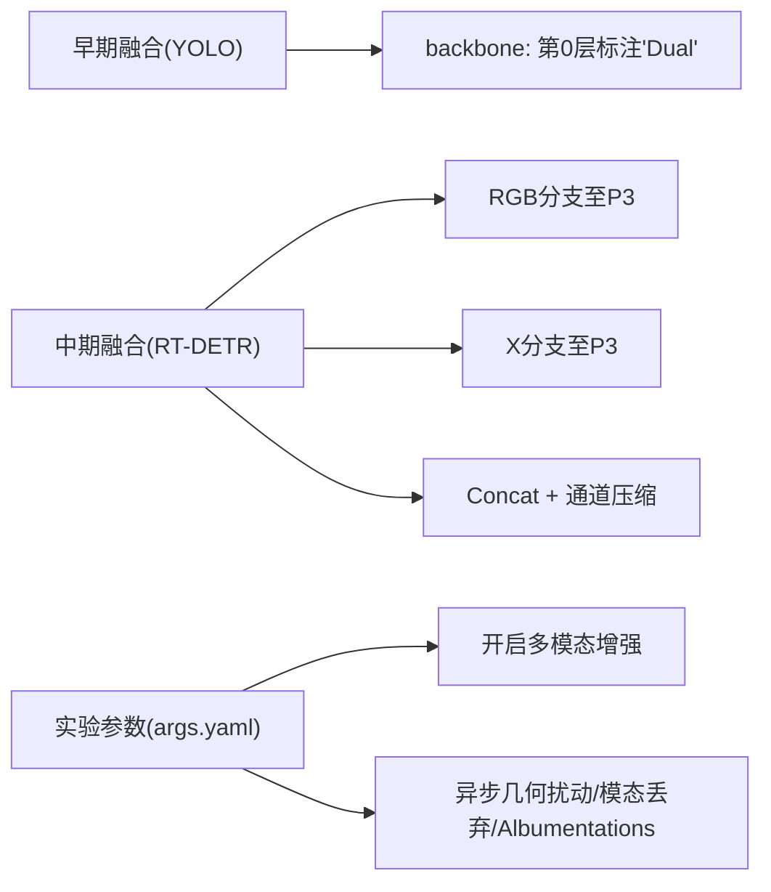
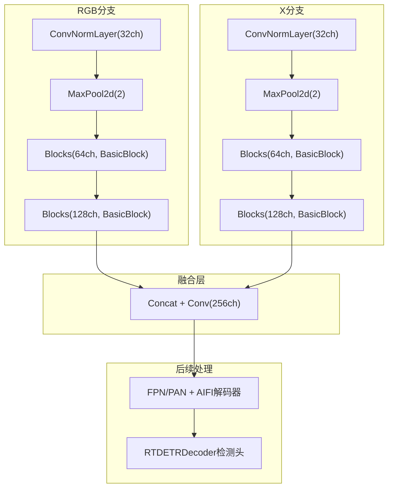
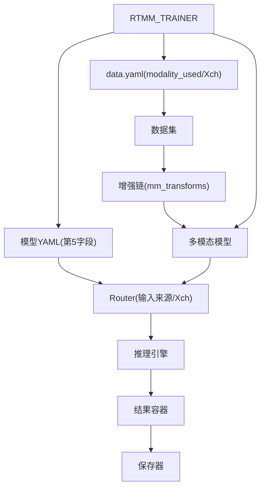

# 多模态训练配置

<cite>
**本文档引用的文件**
- [多模态YAML构建指点.md](file://ultralytics/cfg/models/多模态YAML构建指点.md)
- [yolo11n-mm-early.yaml](file://ultralytics/cfg/models/mm/yolo11n-mm-early.yaml)
- [rtdetr-r18-mm-mid.yaml](file://ultralytics/cfg/models/rt-detr/rtdetr-r18-mm-mid.yaml)
- [rtdetr-r18-mm-mid-aifi-edffn.yaml](file://ResTest/rtdetr-r18-mm-mid-aifi-edffn/args.yaml)
- [RTDETR-mid-args.yaml](file://ResTest/RTDETR-mid/args.yaml)
- [multimodal_augment.py](file://ultralytics/data/multimodal_augment.py)
- [inference_dataset.py](file://ultralytics/data/multimodal/inference_dataset.py)
- [pairing.py](file://ultralytics/data/multimodal/pairing.py)
- [utils.py](file://ultralytics/data/multimodal/utils.py)
- [predictor.py](file://ultralytics/engine/multimodal/predictor.py)
- [results.py](file://ultralytics/engine/multimodal/results.py)
- [saver.py](file://ultralytics/engine/multimodal/saver.py)
- [RTDETRMM模型类](file://ultralytics/models/rtdetrmm/model.py)
- [RTDETRMM训练器](file://ultralytics/models/rtdetrmm/train.py)
- [RTDETRMM预测器](file://ultralytics/models/rtdetrmm/predict.py)
- [RTDETRMM验证器](file://ultralytics/models/rtdetrmm/val.py)
- [RTDETRMMPredictor适配器](file://ultralytics/models/rtdetrmm/mm_predictor.py)
- [args.yaml（频域融合示例）](file://ResTest/aifi-dattention-CSP-MutilScaleEdgeInformationEnhance-ASF-P2-lite-BackboneFreqFusion/args.yaml)
- [args.yaml（频域融合2示例）](file://ResTest/aifi-dattention-CSP-MutilScaleEdgeInformationEnhance-ASF-P2-lite-BackboneFreqFusion2/args.yaml)
- [README.md（模型配置）](file://ultralytics/cfg/models/README.md)
</cite>

## 更新摘要
**变更内容**
- 新增RT-DETR多模态训练配置示例和验证流程说明
- 补充RTDETRMM独立多模态模型的架构设计和实现细节
- 添加RT-DETR多模态中期融合配置模板
- 更新多模态训练验证流程的技术要点

## 目录
1. [简介](#简介)
2. [项目结构](#项目结构)
3. [核心组件](#核心组件)
4. [架构总览](#架构总览)
5. [详细组件分析](#详细组件分析)
6. [RT-DETR多模态训练配置](#rtdetr多模态训练配置)
7. [依赖关系分析](#依赖关系分析)
8. [性能考虑](#性能考虑)
9. [故障排查指南](#故障排查指南)
10. [结论](#结论)
11. [附录](#附录)

## 简介
本文件面向RGB+X多模态联合训练场景，系统阐述多模态配置的构建范式、数据增强策略、异步几何扰动、模态丢弃、模态路由与填充、对比度控制等关键参数，并提供不同模态组合的配置模板与训练效果对比思路。文档同时覆盖数据同步、内存管理等工程要点，帮助读者在不牺牲精度的前提下获得稳定高效的多模态训练体验。

**更新** 新增RT-DETR多模态训练配置示例，包括中期融合配置模板和完整的验证流程说明。

## 项目结构
围绕多模态训练与推理，项目在以下层次组织：
- 配置层：模型配置（YAML）、数据配置（data.yaml）、实验参数（args.yaml）
- 数据层：多模态数据集、配对解析、预处理与增强
- 推理层：多模态推理引擎、结果封装与保存
- 模型层：YOLO系列与RT-DETR系列的多模态路由器与融合策略

**图表来源**
- [RTDETRMM模型类:25-57](file://ultralytics/models/rtdetrmm/model.py#L25-L57)
- [RTDETRMM训练器:24-60](file://ultralytics/models/rtdetrmm/train.py#L24-L60)
- [RTDETRMM预测器:21-62](file://ultralytics/models/rtdetrmm/predict.py#L21-L62)
- [RTDETRMM验证器:24-46](file://ultralytics/models/rtdetrmm/val.py#L24-L46)

**章节来源**
- [多模态YAML构建指点.md:1-239](file://ultralytics/cfg/models/多模态YAML构建指点.md#L1-L239)
- [README.md（模型配置）:1-66](file://ultralytics/cfg/models/README.md#L1-L66)

## 核心组件
- 模型配置（YAML）：通过第5字段标注输入路由（'RGB' | 'X' | 'Dual'），统一两模态抽象，支持早期/中期/晚期融合。
- 多模态增强：RGB HSV、异步几何扰动、模态丢弃、IR/深度专属非空间增强、Albumentations RGB/X专属非几何增强。
- 数据集与配对：严格校验与对齐，支持单模态零填充，LetterBox与张量转换。
- 推理引擎：基于Router的前向执行、NMS与坐标还原、结果封装与保存。
- 结果与保存：统一的可视化与多格式输出，支持并排合并图。
- **RT-DETR多模态支持**：独立的RTDETRMM模型家族，支持中期融合和动态通道数配置。

**更新** 新增RT-DETR多模态支持，包括独立的RTDETRMM模型类和完整的训练/推理/验证流程。

**章节来源**
- [多模态YAML构建指点.md:9-239](file://ultralytics/cfg/models/多模态YAML构建指点.md#L9-L239)
- [RTDETRMM模型类:25-188](file://ultralytics/models/rtdetrmm/model.py#L25-L188)
- [RTDETRMM训练器:24-104](file://ultralytics/models/rtdetrmm/train.py#L24-L104)
- [RTDETRMM预测器:21-90](file://ultralytics/models/rtdetrmm/predict.py#L21-L90)
- [RTDETRMM验证器:24-84](file://ultralytics/models/rtdetrmm/val.py#L24-L84)

## 架构总览
多模态训练/推理的关键流程如下：

**图表来源**
- [RTDETRMM训练器:62-93](file://ultralytics/models/rtdetrmm/train.py#L62-L93)
- [RTDETRMM预测器:64-90](file://ultralytics/models/rtdetrmm/predict.py#L64-L90)
- [RTDETRMM验证器:108-136](file://ultralytics/models/rtdetrmm/val.py#L108-L136)

## 详细组件分析

### 模态路由与融合策略
- 路由标记：YAML第5字段标注输入来源，'RGB'/'X'/'Dual'三选一，'Dual'仅用于输入起点。
- 早期融合：输入层直接接收6通道（RGB+X），结构最简，适合配准良好的模态。
- 中期融合：RGB/X双分支分别至P3/P4后Concat融合，兼顾细节与语义。
- 晚期融合：两路独立检测，推理阶段决策融合（示例中以注释形式提示）。

**图表来源**
- [多模态YAML构建指点.md:20-118](file://ultralytics/cfg/models/多模态YAML构建指点.md#L20-L118)
- [yolo11n-mm-early.yaml:19-59](file://ultralytics/cfg/models/mm/yolo11n-mm-early.yaml#L19-L59)
- [rtdetr-r18-mm-mid.yaml:12-66](file://ultralytics/cfg/models/rt-detr/rtdetr-r18-mm-mid.yaml#L12-L66)

**章节来源**
- [多模态YAML构建指点.md:9-118](file://ultralytics/cfg/models/多模态YAML构建指点.md#L9-L118)
- [yolo11n-mm-early.yaml:1-59](file://ultralytics/cfg/models/mm/yolo11n-mm-early.yaml#L1-L59)
- [rtdetr-r18-mm-mid.yaml:1-66](file://ultralytics/cfg/models/rt-detr/rtdetr-r18-mm-mid.yaml#L1-L66)

### 模态增强策略
- RGB HSV增强：仅对前3通道（RGB）应用HSV变换，避免破坏X模态特性。
- 异步几何扰动：对指定模态（'x'/'rgb'/'random'）施加极小平移/旋转，模拟传感器微错位，不修改标注。
- 模态丢弃：在指定模态的随机矩形区域进行抹除（zero/one/const/noise），提升单模态缺失/遮挡鲁棒性。
- IR/深度专属非空间增强：窗口化、CLAHE、Gamma、反色、噪声、漂移等，严格非几何，保持通道数与dtype。
- Albumentations RGB/X专属非几何增强：按通道数白名单选择算子，避免空间类变换。

**图表来源**
- [multimodal_augment.py:40-148](file://ultralytics/data/multimodal_augment.py#L40-L148)
- [multimodal_augment.py:475-582](file://ultralytics/data/multimodal_augment.py#L475-L582)
- [multimodal_augment.py:584-766](file://ultralytics/data/multimodal_augment.py#L584-L766)
- [multimodal_augment.py:768-1018](file://ultralytics/data/multimodal_augment.py#L768-L1018)
- [multimodal_augment.py:378-473](file://ultralytics/data/multimodal_augment.py#L378-L473)

**章节来源**
- [multimodal_augment.py:1-1358](file://ultralytics/data/multimodal_augment.py#L1-L1358)

### 数据同步与预处理
- 配对解析：显式提供rgb_source与x_source，支持单模态推理（零填充），保证数量一致。
- 空间对齐与通道校验：以RGB为基准resize X，严格校验通道数，支持1↔3显式转换。
- LetterBox与张量转换：LetterBox返回ratio_pad用于坐标还原，RGB通道翻转，X通道保持原序。
- 单模态零填充：当某模态缺失时，使用零张量填充，不影响模型前向。

**图表来源**
- [pairing.py:37-125](file://ultralytics/data/multimodal/pairing.py#L37-L125)
- [inference_dataset.py:94-183](file://ultralytics/data/multimodal/inference_dataset.py#L94-L183)
- [utils.py:13-83](file://ultralytics/data/multimodal/utils.py#L13-L83)
- [utils.py:86-179](file://ultralytics/data/multimodal/utils.py#L86-L179)

**章节来源**
- [pairing.py:1-203](file://ultralytics/data/multimodal/pairing.py#L1-L203)
- [inference_dataset.py:1-252](file://ultralytics/data/multimodal/inference_dataset.py#L1-L252)
- [utils.py:1-180](file://ultralytics/data/multimodal/utils.py#L1-L180)

### 推理与结果保存
- 推理引擎：从模型读取Router配置，区分YOLO与RTDETR后处理路径，支持流式推理。
- 结果容器：统一boxes、paths、orig_imgs、meta字段，支持RGB/X可视化与并排合并。
- 保存器：按RGB主路径命名输出，按需保存txt/json，支持双模态并排图。

**图表来源**
- [predictor.py:144-244](file://ultralytics/engine/multimodal/predictor.py#L144-L244)
- [results.py:30-131](file://ultralytics/engine/multimodal/results.py#L30-L131)
- [saver.py:54-112](file://ultralytics/engine/multimodal/saver.py#L54-L112)

**章节来源**
- [predictor.py:1-494](file://ultralytics/engine/multimodal/predictor.py#L1-L494)
- [results.py:1-357](file://ultralytics/engine/multimodal/results.py#L1-L357)
- [saver.py:1-112](file://ultralytics/engine/multimodal/saver.py#L1-L112)

### 配置模板与参数对照
- 早期融合模板（YOLO）：输入层标注'Dual'，其余沿用标准模块堆叠。
- 中期融合模板（RT-DETR）：RGB/X双分支至P3后Concat，再继续FPN/PAN与解码器。
- 实验参数示例：args.yaml中启用use_multimodal_aug，配置mm_async_geo_*、mm_modal_dropout_*、mm_rgb_albu_*等。

**图表来源**
- [yolo11n-mm-early.yaml:19-59](file://ultralytics/cfg/models/mm/yolo11n-mm-early.yaml#L19-L59)
- [rtdetr-r18-mm-mid.yaml:33-39](file://ultralytics/cfg/models/rt-detr/rtdetr-r18-mm-mid.yaml#L33-L39)
- [args.yaml（频域融合示例）:110-134](file://ResTest/aifi-dattention-CSP-MutilScaleEdgeInformationEnhance-ASF-P2-lite-BackboneFreqFusion/args.yaml#L110-L134)

**章节来源**
- [yolo11n-mm-early.yaml:1-59](file://ultralytics/cfg/models/mm/yolo11n-mm-early.yaml#L1-L59)
- [rtdetr-r18-mm-mid.yaml:1-66](file://ultralytics/cfg/models/rt-detr/rtdetr-r18-mm-mid.yaml#L1-L66)
- [args.yaml（频域融合示例）:1-135](file://ResTest/aifi-dattention-CSP-MutilScaleEdgeInformationEnhance-ASF-P2-lite-BackboneFreqFusion/args.yaml#L1-L135)
- [args.yaml（频域融合2示例）:1-135](file://ResTest/aifi-dattention-CSP-MutilScaleEdgeInformationEnhance-ASF-P2-lite-BackboneFreqFusion2/args.yaml#L1-L135)

## RT-DETR多模态训练配置

### RT-DETR多模态中期融合配置
RT-DETR系列提供了专门的多模态中期融合配置，支持RGB和X模态的双分支处理：

**图表来源**
- [rtdetr-r18-mm-mid.yaml:12-66](file://ultralytics/cfg/models/rt-detr/rtdetr-r18-mm-mid.yaml#L12-L66)

### RT-DETR多模态训练示例
基于提供的实验配置，展示完整的RT-DETR多模态训练流程：

**训练配置示例**：
- 模型：rtdetr-r18-mm-mid.yaml（中期融合）
- 数据集：M3FD_split/data.yaml
- 训练轮数：150 epochs
- 批次大小：8
- 图像尺寸：640×640
- 设备：GPU 0
- 预训练：启用
- 多模态增强：启用

**验证配置示例**：
- 支持单模态验证（RGB-only或X-only）
- 自动通道数动态配置（3+Xch）
- 支持多模态并排可视化

**章节来源**
- [RTDETR-mid-args.yaml:1-135](file://ResTest/RTDETR-mid/args.yaml#L1-L135)
- [rtdetr-r18-mm-mid-aifi-edffn.yaml:1-135](file://ResTest/rtdetr-r18-mm-mid-aifi-edffn/args.yaml#L1-L135)

### RTDETRMM独立模型架构
RTDETRMM提供了完全独立的多模态RT-DETR实现：

**核心特性**：
- 不依赖RT-DETR原生实现，完全独立的模型家族
- 基于YAML/权重内容的Fail-Fast判据识别多模态结构
- 支持双模态和单模态训练/推理
- 动态通道数配置（3通道RGB或6通道RGB+X）

**章节来源**
- [RTDETRMM模型类:25-188](file://ultralytics/models/rtdetrmm/model.py#L25-L188)
- [RTDETRMM训练器:24-104](file://ultralytics/models/rtdetrmm/train.py#L24-L104)
- [RTDETRMM预测器:21-90](file://ultralytics/models/rtdetrmm/predict.py#L21-L90)
- [RTDETRMM验证器:24-84](file://ultralytics/models/rtdetrmm/val.py#L24-L84)

## 依赖关系分析
- 模型配置依赖Router与YAML第5字段，决定输入形状与融合位置。
- 数据增强依赖hyp参数与数据集配置，确保RGB/X同步几何变换与X模态非空间增强。
- 推理引擎依赖模型Router配置与数据集meta信息，完成坐标还原与可视化。
- **RT-DETR多模态依赖**：RTDETRMM训练器依赖YAML/权重内容判据，确保多模态结构识别。

**图表来源**
- [多模态YAML构建指点.md:165-177](file://ultralytics/cfg/models/多模态YAML构建指点.md#L165-L177)
- [RTDETRMM训练器:84-98](file://ultralytics/models/rtdetrmm/train.py#L84-L98)
- [RTDETRMM模型类:34-46](file://ultralytics/models/rtdetrmm/model.py#L34-L46)

**章节来源**
- [多模态YAML构建指点.md:165-191](file://ultralytics/cfg/models/多模态YAML构建指点.md#L165-L191)
- [RTDETRMM训练器:84-104](file://ultralytics/models/rtdetrmm/train.py#L84-L104)
- [RTDETRMM模型类:34-57](file://ultralytics/models/rtdetrmm/model.py#L34-L57)

## 性能考虑
- 异步几何扰动与模态丢弃：适度使用可提升鲁棒性，但会增加少量CPU开销；建议在非OBB任务下启用。
- LetterBox与零填充：单模态推理时零填充避免IO阻塞，注意显存与内存峰值。
- Albumentations：按通道数缓存Compose，减少重复构建开销。
- 合理设置workers与batch：多模态I/O较重，适当降低workers可避免CPU瓶颈。
- **RT-DETR多模态性能**：动态通道数配置需要额外的warmup时间，但能确保最佳推理性能。

## 故障排查指南
- 通道不匹配：检查data.yaml的Xch与实际X通道数，确保'RGB'/'X'/'Dual'标注正确。
- 模块未导入：确认模块在相应__init__.py导出，或在extra_modules注册。
- 结果融合：晚期融合需在推理或后处理阶段自行合并，示例中为占位注释。
- 运行确认：使用profile=True查看Router路由日志，核对形状与空间重置信息。
- **RT-DETR多模态问题**：检查RTDETRMM模型的Fail-Fast判据，确保权重文件包含正确的多模态元信息。

**章节来源**
- [多模态YAML构建指点.md:206-217](file://ultralytics/cfg/models/多模态YAML构建指点.md#L206-L217)
- [RTDETRMM模型类:140-146](file://ultralytics/models/rtdetrmm/model.py#L140-L146)

## 结论
通过配置驱动与Router机制，本项目实现了RGB+X多模态的灵活融合与高效训练。合理选择融合策略、配置异步几何扰动与模态丢弃、结合IR/深度专属增强，可在复杂场景下显著提升鲁棒性与泛化能力。RT-DETR多模态训练配置提供了完整的中期融合解决方案，支持动态通道数和单/双模态训练模式。建议在实验中以args.yaml为入口，逐步调整增强强度与融合位置，结合可视化与指标进行对比分析。

**更新** 新增RT-DETR多模态训练配置，包括中期融合模板和完整的验证流程，为用户提供更丰富的多模态训练选择。

## 附录
- 常用参数速查
  - use_multimodal_aug：启用多模态增强链
  - mm_async_geo_p/translate_px/rotate_deg/target/border：异步几何扰动
  - mm_modal_dropout_p/area/ratio/target/fill/fill_const：模态丢弃
  - mm_rgb_albu_enable/mm_rgb_albu_cfg/mm_x_non_geo_enable/mm_x_non_geo_cfg：Albumentations配置
  - mm_ir_ops_cfg/mm_depth_ops_cfg：IR/深度专属非空间增强配置
- 模态组合建议
  - RGB+深度：优先中期融合，配合深度专属增强与模态丢弃
  - RGB+热红外：优先中期融合，配合IR专属增强与异步几何扰动
  - RGB+多通道X：早期融合或中期融合，依据配准程度与算力预算
- **RT-DETR多模态参数**
  - Xch：X模态通道数（动态配置）
  - modality：单模态训练/验证的模态标识
  - enable_self_modal_generation：自动模态生成开关
  - rect：RT-DETR验证的固定形状推理设置

**章节来源**
- [args.yaml（频域融合示例）:110-134](file://ResTest/aifi-dattention-CSP-MutilScaleEdgeInformationEnhance-ASF-P2-lite-BackboneFreqFusion/args.yaml#L110-L134)
- [args.yaml（频域融合2示例）:110-134](file://ResTest/aifi-dattention-CSP-MutilScaleEdgeInformationEnhance-ASF-P2-lite-BackboneFreqFusion2/args.yaml#L110-L134)
- [multimodal_augment.py:378-473](file://ultralytics/data/multimodal_augment.py#L378-L473)
- [RTDETRMM训练器:317-424](file://ultralytics/models/rtdetrmm/train.py#L317-L424)
- [RTDETRMM验证器:434-548](file://ultralytics/models/rtdetrmm/val.py#L434-L548)