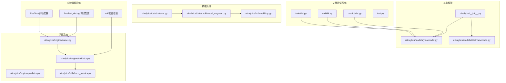
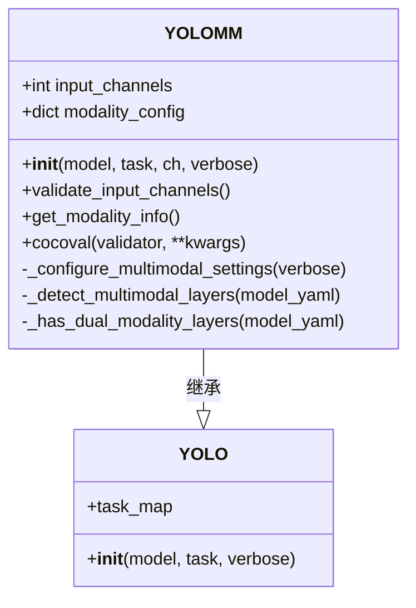
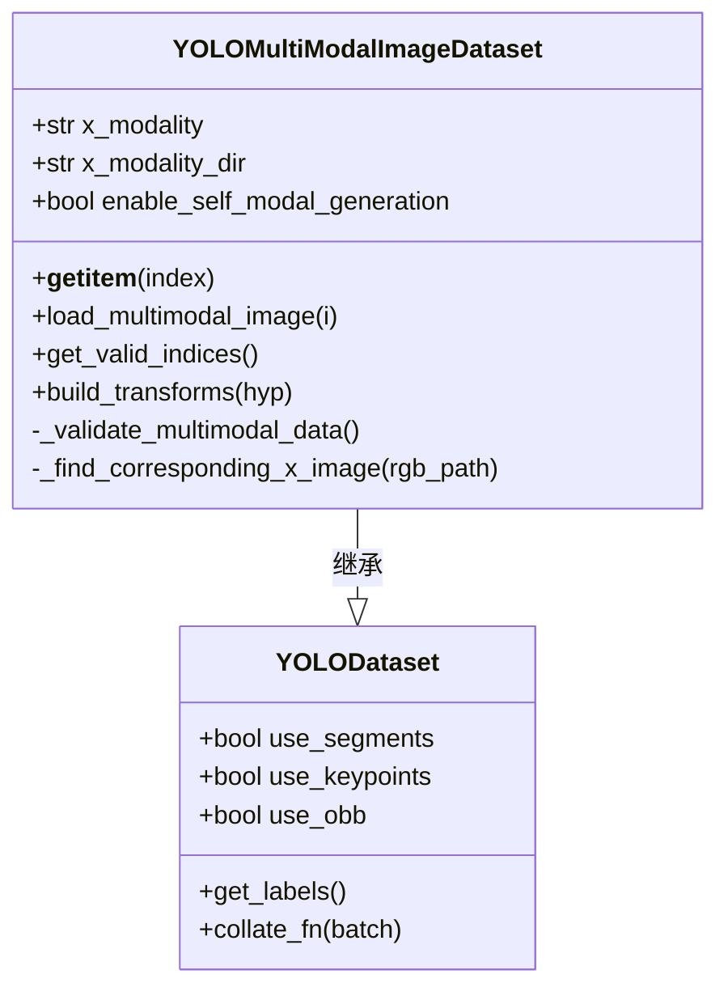
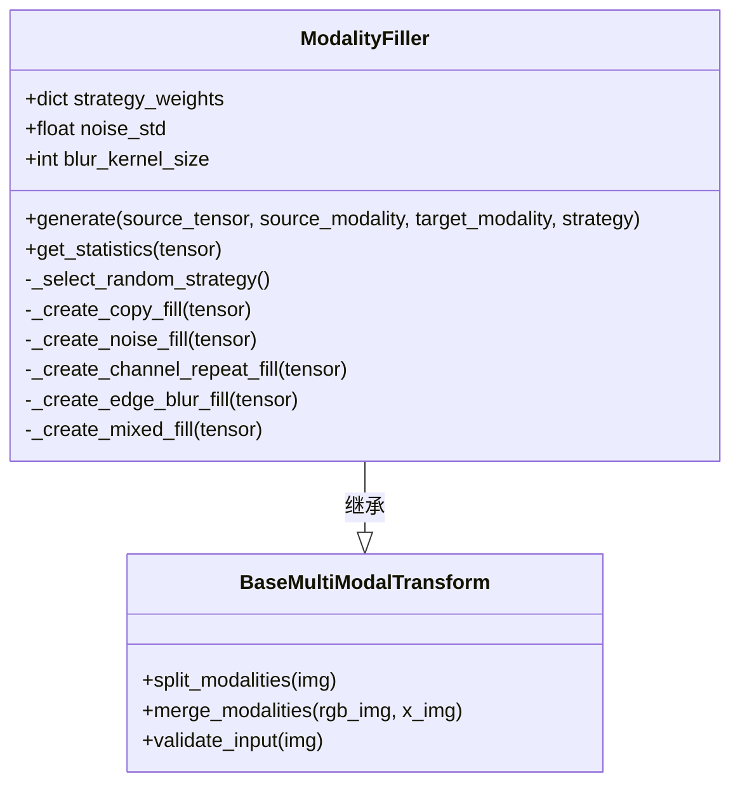
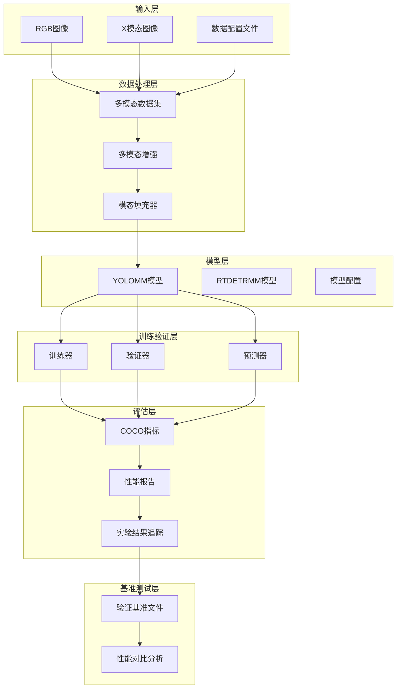
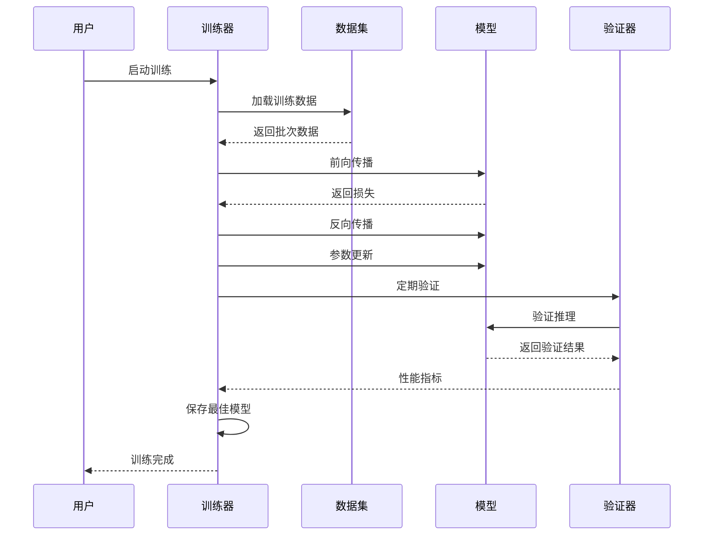
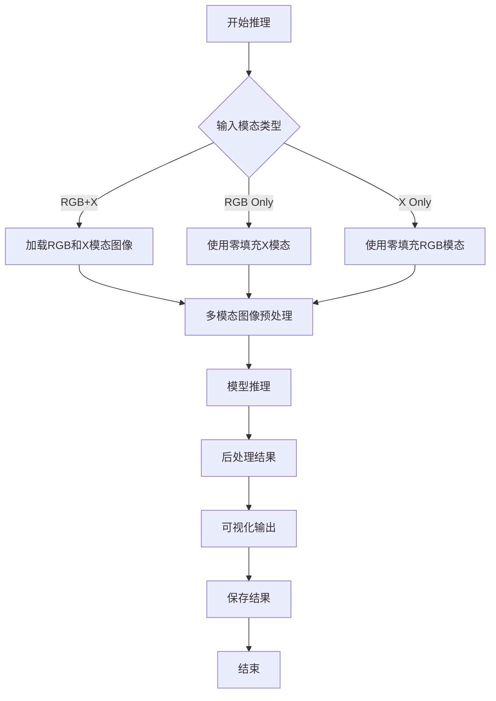
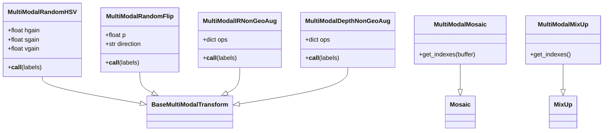
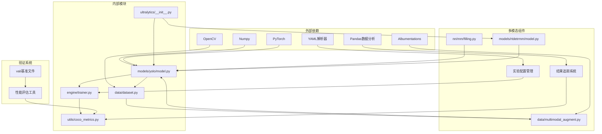

# 多模态训练验证系统

<cite>
**本文档引用的文件**
- [ultralytics/__init__.py](file://ultralytics/__init__.py)
- [trainMM.py](file://trainMM.py)
- [valMM.py](file://valMM.py)
- [predictMM.py](file://predictMM.py)
- [test.py](file://test.py)
- [ultralytics/models/yolo/model.py](file://ultralytics/models/yolo/model.py)
- [ultralytics/engine/trainer.py](file://ultralytics/engine/trainer.py)
- [ultralytics/engine/validator.py](file://ultralytics/engine/validator.py)
- [ultralytics/engine/predictor.py](file://ultralytics/engine/predictor.py)
- [ultralytics/data/dataset.py](file://ultralytics/data/dataset.py)
- [ultralytics/data/multimodal_augment.py](file://ultralytics/data/multimodal_augment.py)
- [ultralytics/nn/mm/filling.py](file://ultralytics/nn/mm/filling.py)
- [ultralytics/utils/coco_metrics.py](file://ultralytics/utils/coco_metrics.py)
- [ultralytics/models/rtdetrmm/model.py](file://ultralytics/models/rtdetrmm/model.py)
- [ResTest/aifi-dattention-CSP-MutilScaleEdgeInformationEnhance-ASF-P2-lite/results.csv](file://ResTest/aifi-dattention-CSP-MutilScaleEdgeInformationEnhance-ASF-P2-lite/results.csv)
- [ResTest/aifi-dattention-CSP-MutilScaleEdgeInformationEnhance-ASF-P2-lite-BackboneFreqFusion2/results.csv](file://ResTest/aifi-dattention-CSP-MutilScaleEdgeInformationEnhance-ASF-P2-lite-BackboneFreqFusion2/results.csv)
- [ResTest/aifi-dattention-CSP-MutilScaleEdgeInformationEnhance-ASF-P2-lite-BackboneFreqFusion4/results.csv](file://ResTest/aifi-dattention-CSP-MutilScaleEdgeInformationEnhance-ASF-P2-lite-BackboneFreqFusion4/results.csv)
- [ResTest/aifi-dattention-CSP-MutilScaleEdgeInformationEnhance-ASF-P2-lite/args.yaml](file://ResTest/aifi-dattention-CSP-MutilScaleEdgeInformationEnhance-ASF-P2-lite/args.yaml)
- [ResTest/aifi-dattention-CSP-MutilScaleEdgeInformationEnhance-ASF-P2-lite-BackboneFreqFusion/args.yaml](file://ResTest/aifi-dattention-CSP-MutilScaleEdgeInformationEnhance-ASF-P2-lite-BackboneFreqFusion/args.yaml)
- [ResTest_debug/BASE_probe/args.yaml](file://ResTest_debug/BASE_probe/args.yaml)
- [ResTest_debug/CGAFusion_probe/args.yaml](file://ResTest_debug/CGAFusion_probe/args.yaml)
- [val/RTDETRval/paper_data.txt](file://val/RTDETRval/paper_data.txt)
</cite>

## 更新摘要
**变更内容**
- 新增ResTest实验配置目录的详细分析
- 添加ResTest_debug调试实验配置说明
- 更新验证基准文件paper_data.txt的分析
- 扩展实验结果数据的统计分析
- 增强多模态实验配置的文档覆盖

## 目录
1. [简介](#简介)
2. [项目结构](#项目结构)
3. [核心组件](#核心组件)
4. [架构概览](#架构概览)
5. [详细组件分析](#详细组件分析)
6. [实验配置与结果分析](#实验配置与结果分析)
7. [验证基准与性能评估](#验证基准与性能评估)
8. [依赖关系分析](#依赖关系分析)
9. [性能考虑](#性能考虑)
10. [故障排除指南](#故障排除指南)
11. [结论](#结论)

## 简介

这是一个基于Ultralytics框架的多模态训练验证系统，专门用于RGB和X模态（如深度图、热红外图等）的联合目标检测任务。该系统支持多种多模态融合策略，包括早期融合、中期融合和晚期融合，并提供了完整的训练、验证和推理流程。

**更新** 新增了大规模实验配置和验证基准文件，包括ResTest目录下的19个实验组和ResTest_debug目录下的调试实验，以及val目录下24个RTDETR验证实验的基准数据。

系统的核心特点包括：
- 支持RGB+X双模态输入，自动识别和处理不同模态的图像
- 提供多种多模态数据增强策略，适应不同的X模态类型
- 实现了灵活的模态填充机制，用于处理缺失模态的情况
- 集成了COCO评估指标，提供标准的性能评估
- 支持RT-DETR和YOLO等多种骨干网络架构
- **新增** 完整的实验配置管理和结果追踪系统
- **新增** 多层次的验证基准和性能对比分析

## 项目结构

**图表来源**
- [ultralytics/__init__.py:1-88](file://ultralytics/__init__.py#L1-L88)
- [ultralytics/models/yolo/model.py:456-800](file://ultralytics/models/yolo/model.py#L456-L800)
- [ultralytics/data/dataset.py:423-780](file://ultralytics/data/dataset.py#L423-L780)

**章节来源**
- [ultralytics/__init__.py:1-88](file://ultralytics/__init__.py#L1-L88)
- [trainMM.py:1-15](file://trainMM.py#L1-L15)
- [valMM.py:1-22](file://valMM.py#L1-L22)
- [predictMM.py:1-40](file://predictMM.py#L1-L40)

## 核心组件

### YOLOMM多模态模型

YOLOMM是系统的核心模型类，专门处理多模态输入。它支持RGB-only、X-only和RGB+X三种模式：

**图表来源**
- [ultralytics/models/yolo/model.py:456-660](file://ultralytics/models/yolo/model.py#L456-L660)

### 多模态数据集

系统提供了专门的多模态数据集类，支持RGB+X图像的加载和处理：

**图表来源**
- [ultralytics/data/dataset.py:423-780](file://ultralytics/data/dataset.py#L423-L780)

### 多模态填充器

ModalityFiller类提供了多种策略来合成缺失的模态数据：

**图表来源**
- [ultralytics/nn/mm/filling.py:14-175](file://ultralytics/nn/mm/filling.py#L14-L175)

**章节来源**
- [ultralytics/models/yolo/model.py:456-800](file://ultralytics/models/yolo/model.py#L456-L800)
- [ultralytics/data/dataset.py:423-780](file://ultralytics/data/dataset.py#L423-L780)
- [ultralytics/nn/mm/filling.py:14-175](file://ultralytics/nn/mm/filling.py#L14-L175)

## 架构概览

系统采用分层架构设计，从底层的数据处理到上层的应用接口形成了完整的多模态处理流水线：

**图表来源**
- [ultralytics/engine/trainer.py:110-800](file://ultralytics/engine/trainer.py#L110-L800)
- [ultralytics/engine/validator.py:94-371](file://ultralytics/engine/validator.py#L94-L371)
- [ultralytics/engine/predictor.py:109-521](file://ultralytics/engine/predictor.py#L109-L521)

## 详细组件分析

### 训练流程

训练流程遵循标准的机器学习管道，包含数据准备、模型训练、验证和模型保存等步骤：

**图表来源**
- [ultralytics/engine/trainer.py:344-504](file://ultralytics/engine/trainer.py#L344-L504)
- [ultralytics/engine/validator.py:130-250](file://ultralytics/engine/validator.py#L130-L250)

### 推理流程

推理流程提供了灵活的API，支持单模态和双模态的推理：

**图表来源**
- [predictMM.py:1-40](file://predictMM.py#L1-L40)
- [ultralytics/engine/predictor.py:208-390](file://ultralytics/engine/predictor.py#L208-L390)

### 多模态增强策略

系统实现了多种多模态增强策略，针对不同类型的X模态进行了专门优化：

**图表来源**
- [ultralytics/data/multimodal_augment.py:40-800](file://ultralytics/data/multimodal_augment.py#L40-L800)

**章节来源**
- [trainMM.py:1-15](file://trainMM.py#L1-L15)
- [valMM.py:1-22](file://valMM.py#L1-L22)
- [predictMM.py:1-40](file://predictMM.py#L1-L40)
- [ultralytics/data/multimodal_augment.py:40-800](file://ultralytics/data/multimodal_augment.py#L40-L800)

## 实验配置与结果分析

### ResTest实验配置系统

系统提供了完整的实验配置管理，包含19个不同配置的实验组：

#### 主要实验配置类别

**基础实验配置**
- `aifi-dattention-CSP-MutilScaleEdgeInformationEnhance-ASF-P2-lite`: 标准的多尺度边缘信息增强实验
- `aifi-dattention-CSP-MutilScaleEdgeInformationEnhance-ASF-P2-lite-BackboneFreqFusion`: 频域融合骨干网络实验
- `aifi-dattention-CSP-MutilScaleEdgeInformationEnhance-ASF-P2-lite-BackboneFreqFusion2`: 改进的频域融合实验
- `aifi-dattention-CSP-MutilScaleEdgeInformationEnhance-ASF-P2-lite-BackboneFreqFusion4`: 最终版本频域融合实验

**章节来源**
- [ResTest/aifi-dattention-CSP-MutilScaleEdgeInformationEnhance-ASF-P2-lite/args.yaml:1-135](file://ResTest/aifi-dattention-CSP-MutilScaleEdgeInformationEnhance-ASF-P2-lite/args.yaml#L1-L135)
- [ResTest/aifi-dattention-CSP-MutilScaleEdgeInformationEnhance-ASF-P2-lite-BackboneFreqFusion/args.yaml:1-135](file://ResTest/aifi-dattention-CSP-MutilScaleEdgeInformationEnhance-ASF-P2-lite-BackboneFreqFusion/args.yaml#L1-L135)

#### 实验配置参数分析

所有实验配置都遵循统一的参数结构：

| 参数类别 | 关键参数 | 默认值 | 实验用途 |
|---------|---------|--------|----------|
| 训练设置 | epochs, batch, imgsz | 150, 8, 640 | 控制训练规模和图像尺寸 |
| 优化器设置 | lr0, momentum, weight_decay | 0.01, 0.937, 0.0005 | 控制学习率和权重衰减 |
| 数据增强 | mosaic, fliplr, hsv_h/s/v | 1.0, 0.5, 0.015/0.7/0.4 | 多样化训练数据 |
| 多模态设置 | use_multimodal_aug, mm_modal_dropout | true, 0.0 | 控制多模态增强策略 |

**章节来源**
- [ResTest/aifi-dattention-CSP-MutilScaleEdgeInformationEnhance-ASF-P2-lite/args.yaml:74-105](file://ResTest/aifi-dattention-CSP-MutilScaleEdgeInformationEnhance-ASF-P2-lite/args.yaml#L74-L105)

#### 实验结果追踪

每个实验都生成对应的结果文件，包含详细的训练过程监控：

**主要指标字段**
- `train/giou_loss`, `train/cls_loss`, `train/l1_loss`: 训练损失
- `metrics/precision(B)`, `metrics/recall(B)`, `metrics/mAP50(B)`, `metrics/mAP50-95(B)`: 性能指标
- `val/giou_loss`, `val/cls_loss`, `val/l1_loss`: 验证损失
- `lr/pg0`, `lr/pg1`, `lr/pg2`: 学习率

**章节来源**
- [ResTest/aifi-dattention-CSP-MutilScaleEdgeInformationEnhance-ASF-P2-lite/results.csv:1-152](file://ResTest/aifi-dattention-CSP-MutilScaleEdgeInformationEnhance-ASF-P2-lite/results.csv#L1-L152)

### ResTest_debug调试实验

调试实验提供了快速验证和问题排查的功能：

**调试实验配置**
- `BASE_probe`: 基础功能验证实验
- `CGAFusion_probe`: CGA融合模块调试实验
- `CSFCN_probe`: CSFCN特征融合调试实验
- 其他特定模块的调试实验

这些实验通常具有较小的训练轮数和批量大小，便于快速迭代和问题定位。

**章节来源**
- [ResTest_debug/BASE_probe/args.yaml:1-135](file://ResTest_debug/BASE_probe/args.yaml#L1-L135)
- [ResTest_debug/CGAFusion_probe/args.yaml:1-135](file://ResTest_debug/CGAFusion_probe/args.yaml#L1-L135)

## 验证基准与性能评估

### val目录验证系统

系统提供了24个RTDETR验证实验的基准数据，用于标准化性能评估：

#### 验证实验组织结构

**实验编号系统**
- `RTDETRval`: 基础验证实验
- `RTDETRval10-164`: 扩展验证实验序列
- 每个实验包含独立的`paper_data.txt`基准文件

**基准文件格式**

paper_data.txt包含两个主要部分：

**模型信息表**
| 字段 | 描述 | 示例值 |
|------|------|--------|
| GFLOPs | 模型计算复杂度 | 80.9 |
| Parameters | 参数数量 | 21,854,162 |
| 前处理时间 | 单张图前处理耗时 | 0.005583s |
| 推理时间 | 单张图推理耗时 | 0.213571s |
| 后处理时间 | 单张图后处理耗时 | 0.004800s |
| FPS(总) | 总处理FPS | 4.47 |
| FPS(推理) | 仅推理FPS | 4.68 |
| 模型文件大小 | 模型文件大小 | 98.7MB |

**模型指标表**
包含各类别的精确率、召回率、F1分数和mAP指标：

| 类别 | 精确率 | 召回率 | F1分数 | mAP50 | mAP75 | mAP50-95 |
|------|--------|--------|--------|-------|-------|----------|
| People | 0.9108 | 0.8345 | 0.8710 | 0.9089 | 0.5994 | 0.5669 |
| Car | 0.8928 | 0.8839 | 0.8883 | 0.9280 | 0.7339 | 0.6738 |
| Bus | 0.8691 | 0.8760 | 0.8725 | 0.8944 | 0.7548 | 0.7205 |
| Motorcycle | 0.8898 | 0.8535 | 0.8713 | 0.8812 | 0.4826 | 0.4761 |
| Lamp | 0.9120 | 0.8076 | 0.8566 | 0.8885 | 0.5608 | 0.5408 |
| Truck | 0.8612 | 0.7977 | 0.8282 | 0.8035 | 0.6056 | 0.5834 |
| 平均数据 | 0.8893 | 0.8422 | 0.8647 | 0.8841 | 0.6229 | 0.5936 |

**章节来源**
- [val/RTDETRval/paper_data.txt:1-21](file://val/RTDETRval/paper_data.txt#L1-L21)

### 性能对比分析方法

**多实验对比**
- 同一实验类型的不同配置对比
- 不同骨干网络架构的性能比较
- 不同数据增强策略的效果评估

**指标分析维度**
- 训练稳定性：损失曲线变化趋势
- 推理效率：FPS和延迟指标
- 检测精度：mAP和各类别指标
- 资源消耗：内存占用和计算复杂度

## 依赖关系分析

系统采用了清晰的模块化设计，各组件之间的依赖关系如下：

**图表来源**
- [ultralytics/__init__.py:1-88](file://ultralytics/__init__.py#L1-L88)
- [ultralytics/models/yolo/model.py:1-800](file://ultralytics/models/yolo/model.py#L1-L800)
- [ultralytics/data/dataset.py:1-800](file://ultralytics/data/dataset.py#L1-L800)

**章节来源**
- [ultralytics/__init__.py:1-88](file://ultralytics/__init__.py#L1-L88)
- [ultralytics/models/rtdetrmm/model.py:1-269](file://ultralytics/models/rtdetrmm/model.py#L1-L269)

## 性能考虑

系统在设计时充分考虑了性能优化：

### 内存管理
- 使用缓存机制存储多模态图像，减少重复加载
- 支持内存和磁盘双重缓存策略
- 实现了智能的内存清理机制

### 训练效率
- 支持分布式训练，充分利用多GPU资源
- 实现了梯度累积，提高训练稳定性
- 提供了自动批大小调整功能

### 推理优化
- 支持TensorRT和ONNX等加速推理
- 实现了模型量化和剪枝技术
- 提供了多线程推理支持

### 实验管理优化
- **新增** 自动化的实验配置管理
- **新增** 结果数据的结构化存储
- **新增** 多层次的性能对比分析
- **新增** 基准文件的标准化格式

## 故障排除指南

### 常见问题及解决方案

**问题1：多模态数据加载失败**
- 检查RGB和X模态图像的路径一致性
- 确认图像文件格式和尺寸匹配
- 验证数据配置文件中的X模态参数

**问题2：训练收敛困难**
- 检查学习率和批大小设置
- 验证多模态增强策略的合理性
- 确认数据质量，排除异常样本

**问题3：内存不足**
- 减少批大小或启用梯度累积
- 关闭不必要的数据增强
- 使用更高效的模型架构

**问题4：推理速度慢**
- 检查硬件配置和驱动程序
- 启用模型量化和优化
- 减少并发进程数量

**问题5：实验配置错误**
- **新增** 检查args.yaml文件的语法正确性
- **新增** 验证实验名称和保存路径的一致性
- **新增** 确认实验配置参数的合理性

**问题6：结果数据异常**
- **新增** 检查results.csv文件的完整性
- **新增** 验证指标计算的正确性
- **新增** 对比不同实验间的性能差异

**章节来源**
- [ultralytics/engine/trainer.py:505-541](file://ultralytics/engine/trainer.py#L505-L541)
- [ultralytics/data/dataset.py:530-690](file://ultralytics/data/dataset.py#L530-L690)

## 结论

这个多模态训练验证系统提供了一个完整、灵活且高性能的解决方案，适用于RGB和X模态的联合目标检测任务。系统的主要优势包括：

1. **模块化设计**：清晰的组件分离使得系统易于维护和扩展
2. **多模态支持**：全面支持各种X模态类型和融合策略
3. **性能优化**：从数据处理到推理的全链路性能优化
4. **标准化评估**：集成COCO指标，提供标准的性能评估
5. **易用性**：简洁的API设计，降低使用门槛
6. **实验管理**：**新增** 完善的实验配置和结果追踪系统
7. **验证基准**：**新增** 多层次的性能对比和基准测试能力

**更新总结**
本次更新显著增强了系统的实验管理和验证能力，通过ResTest和ResTest_debug目录提供了丰富的实验配置和调试选项，通过val目录的基准文件建立了标准化的性能评估体系。这些改进使得系统不仅能够支持日常的多模态训练验证任务，还能满足学术研究和工业应用中对实验管理和性能评估的严格要求。

该系统为多模态计算机视觉任务提供了一个强大的基础设施，可以根据具体需求进行定制和扩展，特别适合需要大量实验对比和性能基准测试的研究场景。