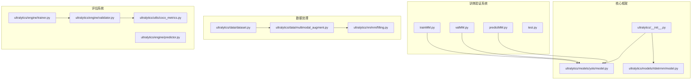
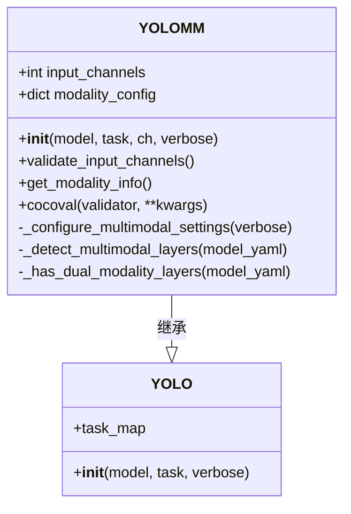
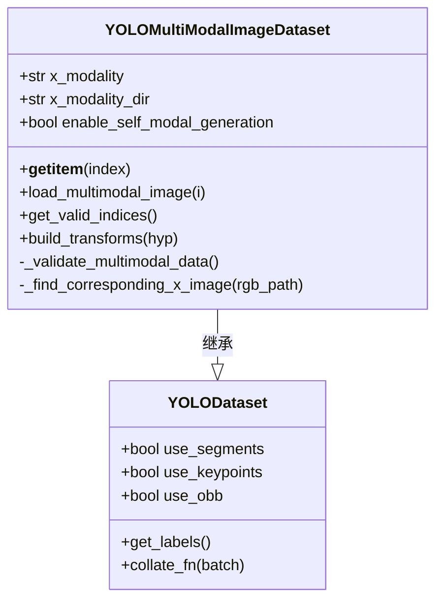
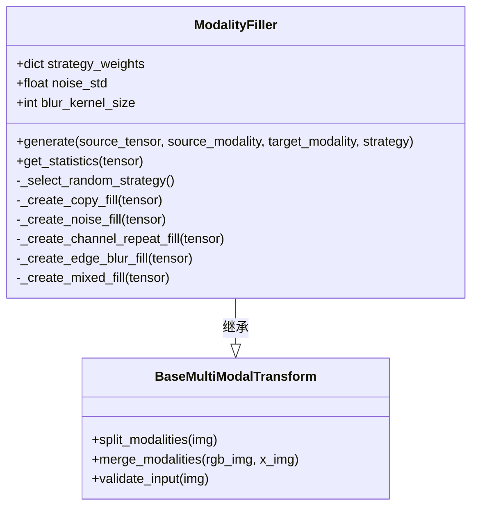
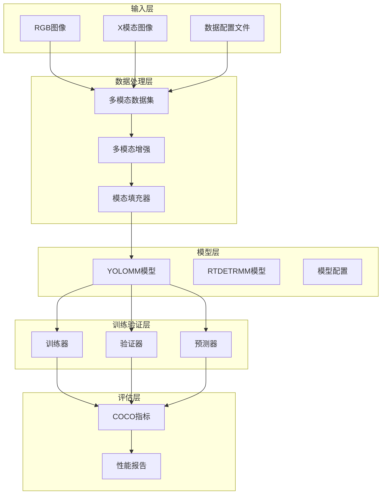
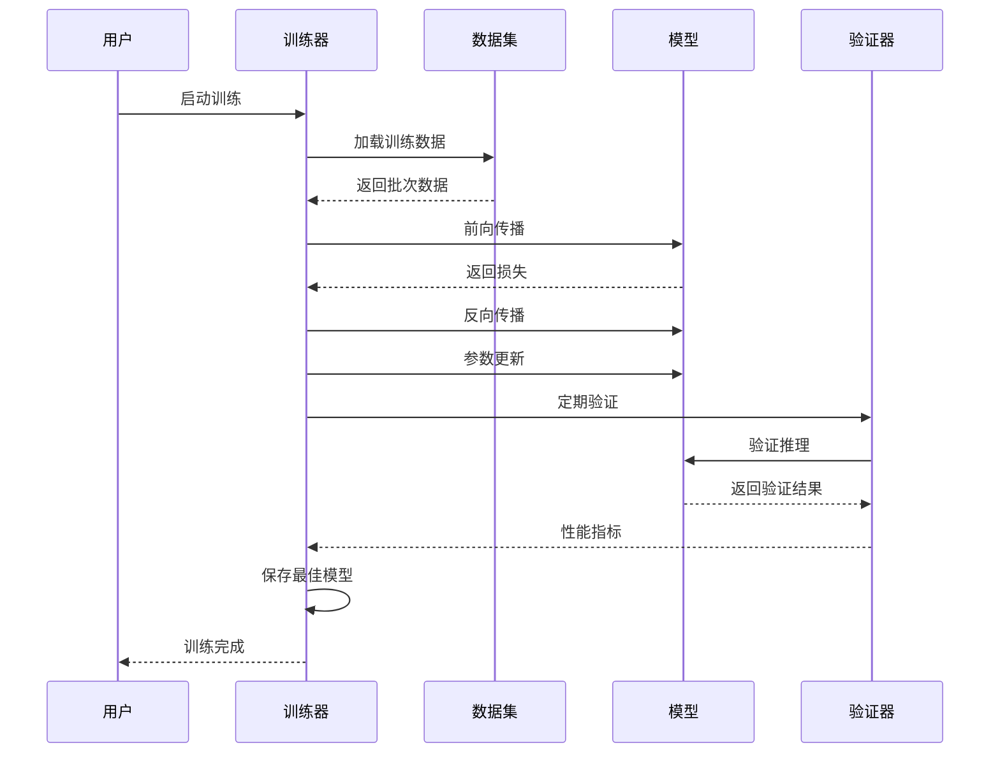
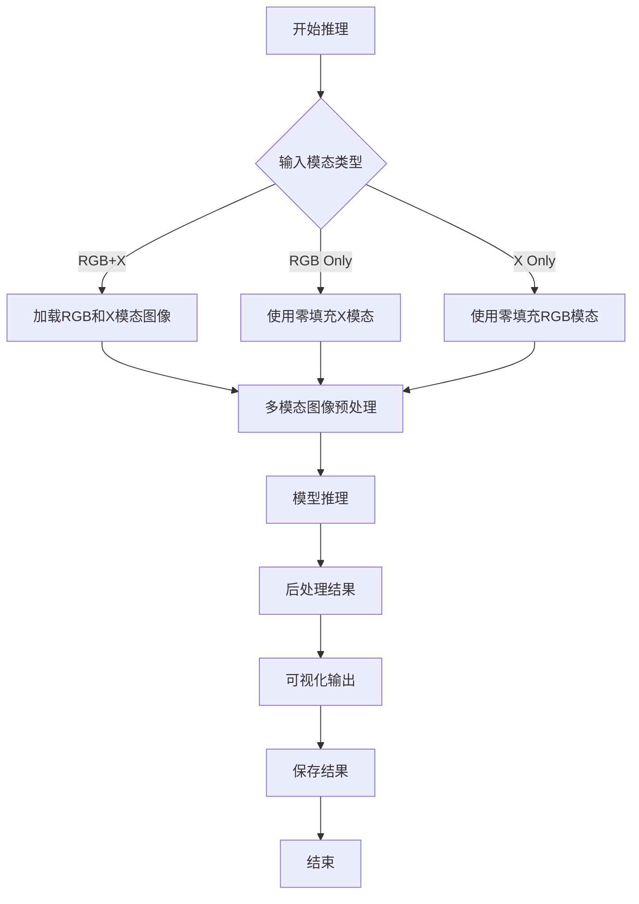
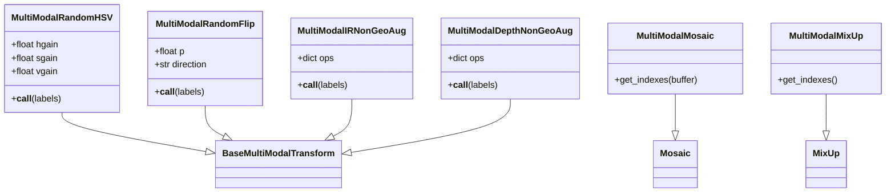
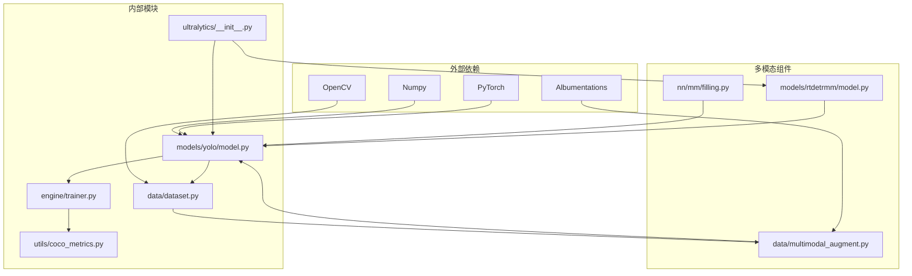

# 多模态训练验证系统

<cite>
**本文档引用的文件**
- [ultralytics/__init__.py](file://ultralytics/__init__.py)
- [trainMM.py](file://trainMM.py)
- [valMM.py](file://valMM.py)
- [predictMM.py](file://predictMM.py)
- [test.py](file://test.py)
- [ultralytics/models/yolo/model.py](file://ultralytics/models/yolo/model.py)
- [ultralytics/engine/trainer.py](file://ultralytics/engine/trainer.py)
- [ultralytics/engine/validator.py](file://ultralytics/engine/validator.py)
- [ultralytics/engine/predictor.py](file://ultralytics/engine/predictor.py)
- [ultralytics/data/dataset.py](file://ultralytics/data/dataset.py)
- [ultralytics/data/multimodal_augment.py](file://ultralytics/data/multimodal_augment.py)
- [ultralytics/nn/mm/filling.py](file://ultralytics/nn/mm/filling.py)
- [ultralytics/utils/coco_metrics.py](file://ultralytics/utils/coco_metrics.py)
- [ultralytics/models/rtdetrmm/model.py](file://ultralytics/models/rtdetrmm/model.py)
</cite>

## 目录
1. [简介](#简介)
2. [项目结构](#项目结构)
3. [核心组件](#核心组件)
4. [架构概览](#架构概览)
5. [详细组件分析](#详细组件分析)
6. [依赖关系分析](#依赖关系分析)
7. [性能考虑](#性能考虑)
8. [故障排除指南](#故障排除指南)
9. [结论](#结论)

## 简介

这是一个基于Ultralytics框架的多模态训练验证系统，专门用于RGB和X模态（如深度图、热红外图等）的联合目标检测任务。该系统支持多种多模态融合策略，包括早期融合、中期融合和晚期融合，并提供了完整的训练、验证和推理流程。

系统的核心特点包括：
- 支持RGB+X双模态输入，自动识别和处理不同模态的图像
- 提供多种多模态数据增强策略，适应不同的X模态类型
- 实现了灵活的模态填充机制，用于处理缺失模态的情况
- 集成了COCO评估指标，提供标准的性能评估
- 支持RT-DETR和YOLO等多种骨干网络架构

## 项目结构

**图表来源**
- [ultralytics/__init__.py:1-88](file://ultralytics/__init__.py#L1-L88)
- [ultralytics/models/yolo/model.py:456-800](file://ultralytics/models/yolo/model.py#L456-L800)
- [ultralytics/data/dataset.py:423-780](file://ultralytics/data/dataset.py#L423-L780)

**章节来源**
- [ultralytics/__init__.py:1-88](file://ultralytics/__init__.py#L1-L88)
- [trainMM.py:1-15](file://trainMM.py#L1-L15)
- [valMM.py:1-22](file://valMM.py#L1-L22)
- [predictMM.py:1-40](file://predictMM.py#L1-L40)

## 核心组件

### YOLOMM多模态模型

YOLOMM是系统的核心模型类，专门处理多模态输入。它支持RGB-only、X-only和RGB+X三种模式：

**图表来源**
- [ultralytics/models/yolo/model.py:456-660](file://ultralytics/models/yolo/model.py#L456-L660)

### 多模态数据集

系统提供了专门的多模态数据集类，支持RGB+X图像的加载和处理：

**图表来源**
- [ultralytics/data/dataset.py:423-780](file://ultralytics/data/dataset.py#L423-L780)

### 多模态填充器

ModalityFiller类提供了多种策略来合成缺失的模态数据：

**图表来源**
- [ultralytics/nn/mm/filling.py:14-175](file://ultralytics/nn/mm/filling.py#L14-L175)

**章节来源**
- [ultralytics/models/yolo/model.py:456-800](file://ultralytics/models/yolo/model.py#L456-L800)
- [ultralytics/data/dataset.py:423-780](file://ultralytics/data/dataset.py#L423-L780)
- [ultralytics/nn/mm/filling.py:14-175](file://ultralytics/nn/mm/filling.py#L14-L175)

## 架构概览

系统采用分层架构设计，从底层的数据处理到上层的应用接口形成了完整的多模态处理流水线：

**图表来源**
- [ultralytics/engine/trainer.py:110-800](file://ultralytics/engine/trainer.py#L110-L800)
- [ultralytics/engine/validator.py:94-371](file://ultralytics/engine/validator.py#L94-L371)
- [ultralytics/engine/predictor.py:109-521](file://ultralytics/engine/predictor.py#L109-L521)

## 详细组件分析

### 训练流程

训练流程遵循标准的机器学习管道，包含数据准备、模型训练、验证和模型保存等步骤：

**图表来源**
- [ultralytics/engine/trainer.py:344-504](file://ultralytics/engine/trainer.py#L344-L504)
- [ultralytics/engine/validator.py:130-250](file://ultralytics/engine/validator.py#L130-L250)

### 推理流程

推理流程提供了灵活的API，支持单模态和双模态的推理：

**图表来源**
- [predictMM.py:1-40](file://predictMM.py#L1-L40)
- [ultralytics/engine/predictor.py:208-390](file://ultralytics/engine/predictor.py#L208-L390)

### 多模态增强策略

系统实现了多种多模态增强策略，针对不同类型的X模态进行了专门优化：

**图表来源**
- [ultralytics/data/multimodal_augment.py:40-800](file://ultralytics/data/multimodal_augment.py#L40-L800)

**章节来源**
- [trainMM.py:1-15](file://trainMM.py#L1-L15)
- [valMM.py:1-22](file://valMM.py#L1-L22)
- [predictMM.py:1-40](file://predictMM.py#L1-L40)
- [ultralytics/data/multimodal_augment.py:40-800](file://ultralytics/data/multimodal_augment.py#L40-L800)

## 依赖关系分析

系统采用了清晰的模块化设计，各组件之间的依赖关系如下：

**图表来源**
- [ultralytics/__init__.py:1-88](file://ultralytics/__init__.py#L1-L88)
- [ultralytics/models/yolo/model.py:1-800](file://ultralytics/models/yolo/model.py#L1-L800)
- [ultralytics/data/dataset.py:1-800](file://ultralytics/data/dataset.py#L1-L800)

**章节来源**
- [ultralytics/__init__.py:1-88](file://ultralytics/__init__.py#L1-L88)
- [ultralytics/models/rtdetrmm/model.py:1-269](file://ultralytics/models/rtdetrmm/model.py#L1-L269)

## 性能考虑

系统在设计时充分考虑了性能优化：

### 内存管理
- 使用缓存机制存储多模态图像，减少重复加载
- 支持内存和磁盘双重缓存策略
- 实现了智能的内存清理机制

### 训练效率
- 支持分布式训练，充分利用多GPU资源
- 实现了梯度累积，提高训练稳定性
- 提供了自动批大小调整功能

### 推理优化
- 支持TensorRT和ONNX等加速推理
- 实现了模型量化和剪枝技术
- 提供了多线程推理支持

## 故障排除指南

### 常见问题及解决方案

**问题1：多模态数据加载失败**
- 检查RGB和X模态图像的路径一致性
- 确认图像文件格式和尺寸匹配
- 验证数据配置文件中的X模态参数

**问题2：训练收敛困难**
- 检查学习率和批大小设置
- 验证多模态增强策略的合理性
- 确认数据质量，排除异常样本

**问题3：内存不足**
- 减少批大小或启用梯度累积
- 关闭不必要的数据增强
- 使用更高效的模型架构

**问题4：推理速度慢**
- 检查硬件配置和驱动程序
- 启用模型量化和优化
- 减少并发进程数量

**章节来源**
- [ultralytics/engine/trainer.py:505-541](file://ultralytics/engine/trainer.py#L505-L541)
- [ultralytics/data/dataset.py:530-690](file://ultralytics/data/dataset.py#L530-L690)

## 结论

这个多模态训练验证系统提供了一个完整、灵活且高性能的解决方案，适用于RGB和X模态的联合目标检测任务。系统的主要优势包括：

1. **模块化设计**：清晰的组件分离使得系统易于维护和扩展
2. **多模态支持**：全面支持各种X模态类型和融合策略
3. **性能优化**：从数据处理到推理的全链路性能优化
4. **标准化评估**：集成COCO指标，提供标准的性能评估
5. **易用性**：简洁的API设计，降低使用门槛

该系统为多模态计算机视觉任务提供了一个强大的基础设施，可以根据具体需求进行定制和扩展。