# 训练配置管理

<cite>
**本文档引用的文件**
- [default.yaml](file://ultralytics/cfg/default.yaml)
- [trainer.py](file://ultralytics/engine/trainer.py)
- [tuner.py](file://ultralytics/engine/tuner.py)
- [augment.py](file://ultralytics/data/augment.py)
- [torch_utils.py](file://ultralytics/utils/torch_utils.py)
- [detect/train.py](file://ultralytics/models/yolo/detect/train.py)
- [rtdetr/train.py](file://ultralytics/models/rtdetr/train.py)
- [rtdetrmm/train.py](file://ultralytics/models/rtdetrmm/train.py)
- [__init__.py](file://ultralytics/cfg/__init__.py)
- [utils/__init__.py](file://ultralytics/utils/__init__.py)
- [yolo/multimodal/train.py](file://ultralytics/models/yolo/multimodal/train.py)
- [rtdetrmm/train.py](file://ultralytics/models/rtdetrmm/train.py)
- [args.yaml](file://ResTest/aifi-dattention-CSP-MutilScaleEdgeInformationEnhance-ASF-P2-lite-BackboneFreqFusion/args.yaml)
- [results.csv](file://ResTest/aifi-dattention-CSP-MutilScaleEdgeInformationEnhance-ASF-P2-lite-BackboneFreqFusion2/results.csv)
- [args.yaml](file://ResTest/RTDETR-mid/args.yaml)
- [args.yaml](file://ResTest/rtdetr-r18-mm-mid/args.yaml)
- [args.yaml](file://ResTest_debug/BASE_probe/args.yaml)
- [args.yaml](file://ResTest_debug/SDFM_probe/args.yaml)
- [paper_data.txt](file://val/RTDETRval/paper_data.txt)
</cite>

## 目录
1. [简介](#简介)
2. [项目结构](#项目结构)
3. [核心组件](#核心组件)
4. [架构概览](#架构概览)
5. [详细组件分析](#详细组件分析)
6. [依赖关系分析](#依赖关系分析)
7. [性能考虑](#性能考虑)
8. [故障排除指南](#故障排除指南)
9. [结论](#结论)
10. [附录](#附录)

## 简介

本文件档详细阐述了训练配置管理系统，涵盖学习率调度、优化器设置、损失函数权重、数据增强策略等核心配置参数。同时介绍了早停机制、混合精度训练、梯度裁剪等高级训练技巧，并提供了针对目标检测、实例分割、姿态估计等不同任务类型的训练配置模板。最后，文档解释了超参数调优的方法和工具，包括网格搜索、贝叶斯优化等策略。

**更新** 新增了多模态训练配置管理、实验结果导出和SQL数据库存储功能，扩展了训练验证系统的覆盖范围。本次更新特别关注于ResTest目录下50多个融合模块的训练配置文件，以及基于Paper数据的性能验证框架，为用户提供完整的实验管理和验证支持。

## 项目结构

该训练配置管理涉及以下关键模块：

- 配置系统：负责加载、合并和验证训练参数
- 训练引擎：实现基础训练流程、验证、检查点保存
- 数据增强：提供丰富的图像变换和混合策略
- 超参数调优：支持自动化搜索最优超参数组合
- 任务特定训练器：针对不同任务类型（检测、分割、分类、姿态估计、RT-DETR）的专用训练器
- 实验管理：支持CSV、HTML、JSON、SQL等多种结果导出格式
- 多模态训练：扩展支持RGB、深度、热红外等多模态数据融合训练
- 性能验证：基于Paper数据的标准化性能评估框架

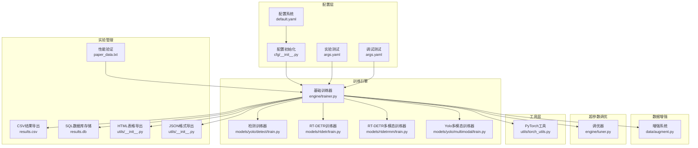

**图表来源**
- [default.yaml:1-168](file://ultralytics/cfg/default.yaml#L1-L168)
- [trainer.py:1-800](file://ultralytics/engine/trainer.py#L1-L800)
- [augment.py:1-800](file://ultralytics/data/augment.py#L1-L800)
- [tuner.py:1-247](file://ultralytics/engine/tuner.py#L1-L247)
- [utils/__init__.py:248-337](file://ultralytics/utils/__init__.py#L248-L337)

**章节来源**
- [default.yaml:1-168](file://ultralytics/cfg/default.yaml#L1-L168)
- [__init__.py:1-800](file://ultralytics/cfg/__init__.py#L1-L800)

## 核心组件

### 配置系统

配置系统采用YAML格式，提供全局训练参数设置。主要配置类别包括：

- **训练设置**：模型路径、数据集、训练轮数、批次大小、输入尺寸等
- **验证设置**：验证频率、评估指标阈值等
- **预测设置**：推理参数配置
- **导出设置**：模型导出格式选项
- **超参数设置**：学习率、动量、权重衰减等优化器参数
- **数据增强设置**：几何变换和颜色变换参数
- **多模态设置**：RGB、深度、热红外等多模态数据配置

### 基础训练器

基础训练器实现了完整的训练生命周期管理，包括：
- 模型初始化和加载
- 数据加载器构建
- 训练循环控制
- 验证和早停机制
- 检查点保存和恢复
- 混合精度训练支持
- 实验结果导出

### 数据增强系统

提供多种数据增强策略：
- 几何变换：旋转、平移、缩放、剪切、透视变换
- 颜色变换：HSV调整、随机翻转、BGR变换
- 混合策略：Mosaic、MixUp、CutMix、Copy-Paste
- 多模态增强：RGB独立非几何增强、异步几何扰动、模态擦除

### 超参数调优器

支持自动化超参数搜索：
- 基于进化算法的搜索策略
- 自定义搜索空间定义
- 多代进化的适应度评估
- 结果可视化和最佳参数保存

### 实验管理器

**新增功能** 支持多种实验结果导出格式：
- CSV格式：标准的训练日志记录
- HTML表格：便于网页查看的结果展示
- JSON格式：结构化的数据交换格式
- SQL数据库：持久化的结果存储和查询

### 多模态训练器

**新增功能** 扩展支持多模态数据融合训练：
- 单模态训练：仅使用RGB或X模态数据
- 双模态训练：RGB与X模态的联合训练
- 模态动态确定：根据数据配置自动选择X模态
- 多模态增强：独立的RGB增强和X模态增强策略

### 性能验证框架

**新增功能** 基于Paper数据的标准化性能评估：
- 模型信息记录：GFLOPs、参数数量、处理时间
- 模型指标评估：精确率、召回率、F1分数、mAP
- 性能基准对比：与标准数据集的性能对比
- 推理速度评估：前处理、推理、后处理时间统计

**章节来源**
- [trainer.py:110-800](file://ultralytics/engine/trainer.py#L110-L800)
- [augment.py:146-800](file://ultralytics/data/augment.py#L146-L800)
- [tuner.py:31-247](file://ultralytics/engine/tuner.py#L31-L247)
- [utils/__init__.py:248-337](file://ultralytics/utils/__init__.py#L248-L337)
- [yolo/multimodal/train.py:109-178](file://ultralytics/models/yolo/multimodal/train.py#L109-L178)

## 架构概览

训练配置管理采用分层架构设计，确保配置的一致性和可扩展性：

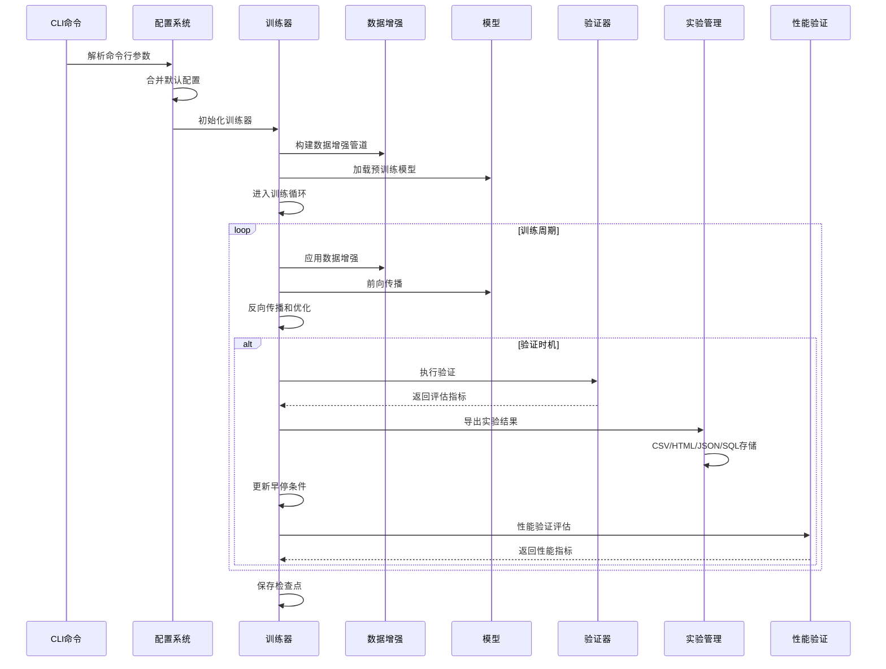

**图表来源**
- [trainer.py:191-504](file://ultralytics/engine/trainer.py#L191-L504)
- [detect/train.py:21-222](file://ultralytics/models/yolo/detect/train.py#L21-L222)
- [utils/__init__.py:294-337](file://ultralytics/utils/__init__.py#L294-L337)

## 详细组件分析

### 学习率调度系统

学习率调度支持两种模式：

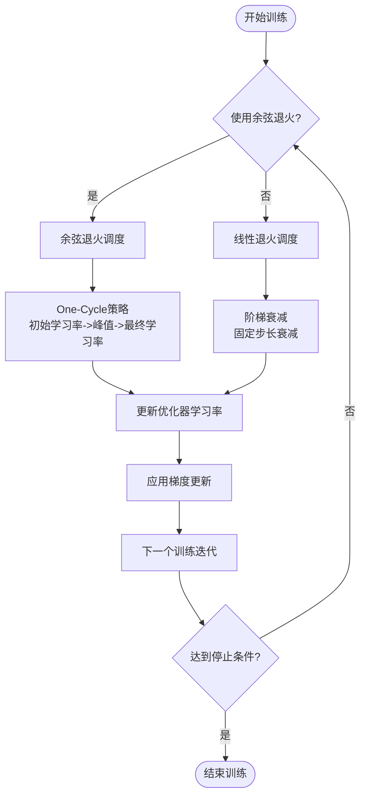

**图表来源**
- [trainer.py:229-236](file://ultralytics/engine/trainer.py#L229-L236)

关键参数配置：
- `lr0`: 初始学习率（SGD=1E-2, Adam=1E-3）
- `lrf`: 最终学习率（lr0 * lrf）
- `cos_lr`: 是否使用余弦学习率调度
- `warmup_epochs`: 热身轮数
- `warmup_momentum`: 热身动量
- `warmup_bias_lr`: 热身偏置学习率

### 优化器配置

支持多种优化器类型：
- SGD: 随机梯度下降
- Adam: 自适应矩估计
- AdamW: Adam权重衰减
- NAdam: 梯度标准化Adam
- RAdam: 随机化Adam
- RMSProp: 二乘平均自适应学习率

优化器参数：
- `optimizer`: 优化器类型选择
- `momentum`: 动量系数
- `weight_decay`: 权重衰减
- `nbs`: 标称批次大小

### 损失函数权重

损失函数权重配置用于平衡不同损失项的重要性：

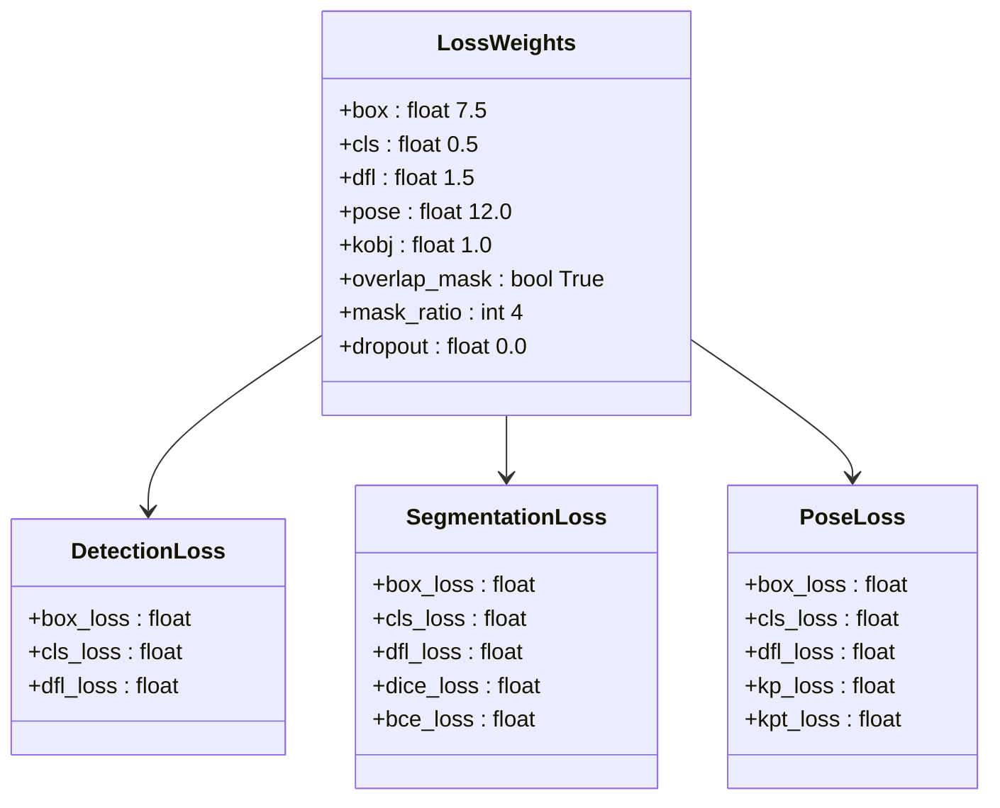

**图表来源**
- [default.yaml:100-105](file://ultralytics/cfg/default.yaml#L100-L105)
- [detect/train.py:147-152](file://ultralytics/models/yolo/detect/train.py#L147-L152)

### 数据增强策略

数据增强系统提供多层次的增强策略：

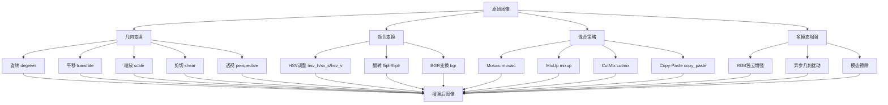

**图表来源**
- [default.yaml:106-123](file://ultralytics/cfg/default.yaml#L106-L123)
- [augment.py:502-795](file://ultralytics/data/augment.py#L502-L795)

**章节来源**
- [augment.py:146-800](file://ultralytics/data/augment.py#L146-L800)

### 早停机制

早停机制通过监控验证指标来防止过拟合：

```mermaid
stateDiagram-v2
[*] --> Training
Training --> Monitoring : 每个epoch结束
Monitoring --> CheckStop{"是否达到耐心阈值?"}
CheckStop --> |否| Training : 继续训练
CheckStop --> |是| EarlyStop : 触发早停
EarlyStop --> [*] : 保存最佳模型
Training --> Validation : 验证阶段
Validation --> UpdateBest : 更新最佳指标
UpdateBest --> Training : 继续训练
```

**图表来源**
- [trainer.py:339-462](file://ultralytics/engine/trainer.py#L339-L462)

配置参数：
- `patience`: 早停耐心轮数（默认100）
- `val`: 是否在训练过程中进行验证
- `save`: 是否保存训练检查点

### 混合精度训练

混合精度训练通过自动混合精度（AMP）技术提高训练效率：

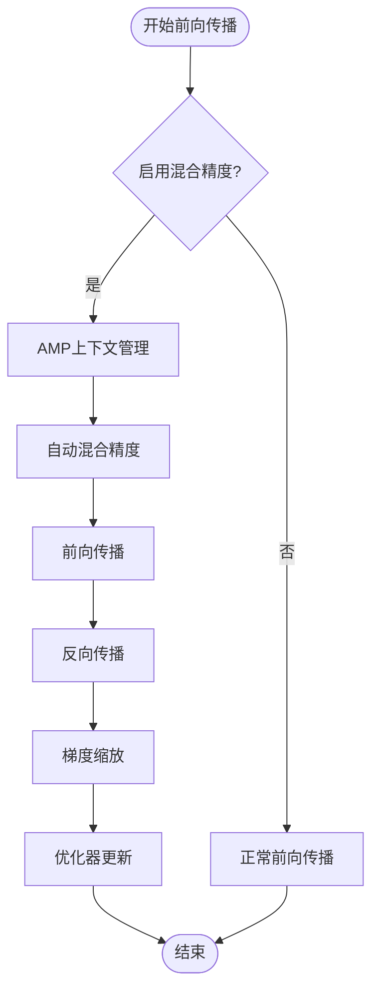

**图表来源**
- [trainer.py:404-416](file://ultralytics/engine/trainer.py#L404-L416)
- [torch_utils.py:77-104](file://ultralytics/utils/torch_utils.py#L77-L104)

配置参数：
- `amp`: 是否启用混合精度训练
- 自动梯度缩放器管理

### 梯度裁剪

梯度裁剪防止梯度爆炸问题：

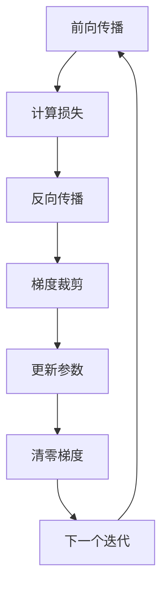

**图表来源**
- [trainer.py:657-666](file://ultralytics/engine/trainer.py#L657-L666)

配置参数：
- `max_norm`: 梯度最大范数（默认10.0）

### 实验结果管理

**新增功能** 支持多种实验结果导出格式：

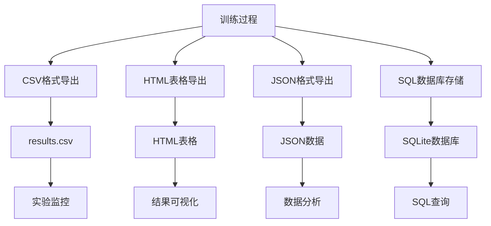

**图表来源**
- [utils/__init__.py:248-337](file://ultralytics/utils/__init__.py#L248-L337)
- [results.csv:1-133](file://ResTest/aifi-dattention-CSP-MutilScaleEdgeInformationEnhance-ASF-P2-lite-BackboneFreqFusion2/results.csv#L1-L133)

导出功能特性：
- CSV格式：标准的逗号分隔值格式，便于Excel和统计软件处理
- HTML格式：生成可直接在浏览器中查看的表格
- JSON格式：结构化的数据交换格式，支持嵌套数据
- SQL格式：持久化的数据库存储，支持复杂查询和数据分析

### 多模态训练配置

**新增功能** 扩展支持多模态数据融合训练：

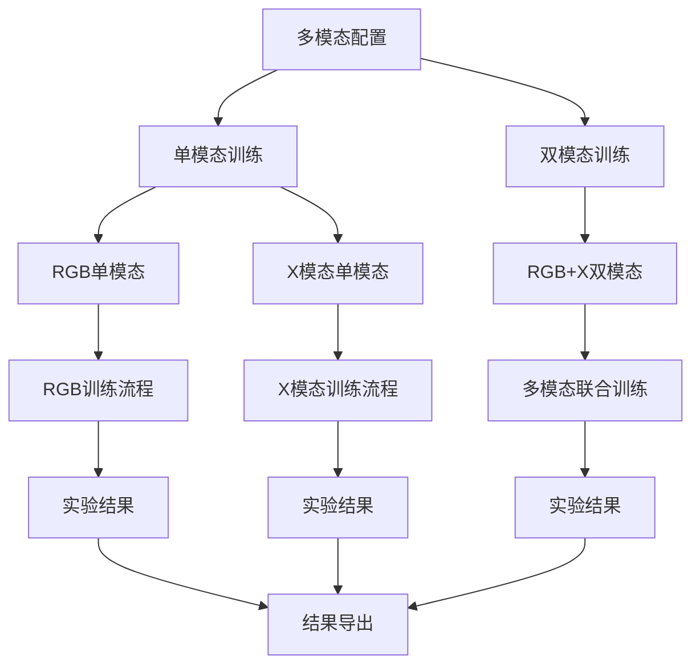

**图表来源**
- [yolo/multimodal/train.py:109-178](file://ultralytics/models/yolo/multimodal/train.py#L109-L178)
- [rtdetrmm/train.py:356-373](file://ultralytics/models/rtdetrmm/train.py#L356-L373)

多模态配置参数：
- `modality`: 指定使用的模态（rgb、depth、thermal、ir）
- `use_multimodal_aug`: 是否启用多模态数据增强
- `mm_rgb_albu_enable`: RGB独立增强开关
- `mm_async_geo_p`: 异步几何扰动概率
- `mm_modal_dropout_p`: 模态擦除概率

### 性能验证框架

**新增功能** 基于Paper数据的标准化性能评估：

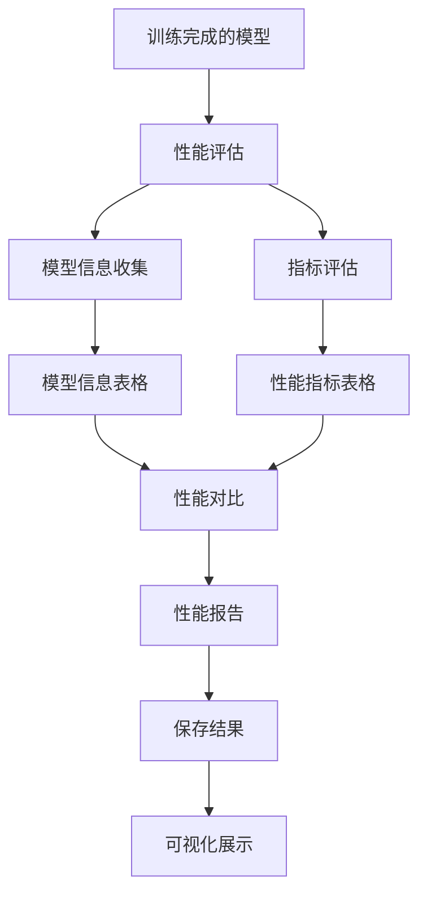

**图表来源**
- [paper_data.txt:1-21](file://val/RTDETRval/paper_data.txt#L1-L21)

性能验证特性：
- 模型信息记录：GFLOPs、参数数量、处理时间统计
- 模型指标评估：精确率、召回率、F1分数、mAP计算
- 性能基准对比：与标准数据集的性能对比分析
- 推理速度评估：前处理、推理、后处理时间统计

### 任务特定配置模板

#### 目标检测配置模板

```yaml
# 基础检测配置
task: detect
mode: train
model: yolo11n.pt
data: coco8.yaml
epochs: 100
batch: 16
imgsz: 640

# 优化器配置
optimizer: auto
lr0: 0.01
lrf: 0.01
momentum: 0.937
weight_decay: 0.0005

# 学习率调度
cos_lr: false
warmup_epochs: 3.0
warmup_momentum: 0.8
warmup_bias_lr: 0.1

# 数据增强
mosaic: 1.0
mixup: 0.0
cutmix: 0.0
hsv_h: 0.015
hsv_s: 0.7
hsv_v: 0.4
fliplr: 0.5

# 损失函数权重
box: 7.5
cls: 0.5
dfl: 1.5

# 训练技巧
patience: 100
amp: true
multi_scale: false
close_mosaic: 10
```

#### 实例分割配置模板

```yaml
# 分割任务配置
task: segment
mode: train
model: yolo11n-seg.pt
data: coco8-seg.yaml
epochs: 100
batch: 16
imgsz: 640

# 分割特有参数
overlap_mask: true
mask_ratio: 4

# 损失函数权重
box: 7.5
cls: 0.5
dfl: 1.5
```

#### 姿态估计配置模板

```yaml
# 姿态估计配置
task: pose
mode: train
model: yolo11n-pose.pt
data: coco8-pose.yaml
epochs: 100
batch: 16
imgsz: 640

# 姿态估计特有参数
pose: 12.0
kobj: 1.0

# 损失函数权重
box: 7.5
cls: 0.5
dfl: 1.5
```

#### 多模态训练配置模板

```yaml
# 多模态训练配置
task: detect
mode: train
model: ultralytics/cfg/models/rtmm/r18/aifi-dattention-CSP-MutilScaleEdgeInformationEnhance-ASF-P2-lite-BackboneFreqFusion.yaml
data: D:\BaiduNetdiskDownload\M3FD\M3FD_split\data.yaml
epochs: 150
batch: 4
imgsz: 640

# 多模态参数
modality: null
use_multimodal_aug: true
mm_rgb_albu_enable: true
mm_async_geo_p: 0.0
mm_modal_dropout_p: 0.0

# 训练技巧
patience: 100
amp: true
```

#### ResTest融合模块配置模板

```yaml
# ResTest融合模块配置
task: detect
mode: train
model: ultralytics/cfg/models/rtmm/r18/aifi-dattention-CSP-MutilScaleEdgeInformationEnhance-ASF-P2-lite-BackboneFreqFusion.yaml
data: D:\BaiduNetdiskDownload\M3FD\M3FD_split\data.yaml
epochs: 150
batch: 4
imgsz: 640

# 融合模块特有参数
mm_project_version: '0.1225'
use_multimodal_aug: true
mm_rgb_albu_enable: true
mm_async_geo_p: 0.0
mm_modal_dropout_p: 0.0

# 训练配置
optimizer: auto
lr0: 0.01
lrf: 0.01
momentum: 0.937
weight_decay: 0.0005
warmup_epochs: 3.0
warmup_momentum: 0.8
warmup_bias_lr: 0.1

# 数据增强
mosaic: 1.0
mixup: 0.0
cutmix: 0.0
hsv_h: 0.015
hsv_s: 0.7
hsv_v: 0.4
fliplr: 0.5

# 损失函数权重
box: 7.5
cls: 0.5
dfl: 1.5

# 训练技巧
patience: 100
amp: true
```

**章节来源**
- [default.yaml:6-126](file://ultralytics/cfg/default.yaml#L6-L126)
- [args.yaml:1-135](file://ResTest/aifi-dattention-CSP-MutilScaleEdgeInformationEnhance-ASF-P2-lite-BackboneFreqFusion/args.yaml#L1-L135)
- [args.yaml:1-135](file://ResTest/RTDETR-mid/args.yaml#L1-L135)
- [args.yaml:1-135](file://ResTest/rtdetr-r18-mm-mid/args.yaml#L1-L135)
- [args.yaml:1-135](file://ResTest_debug/BASE_probe/args.yaml#L1-L135)
- [args.yaml:1-135](file://ResTest_debug/SDFM_probe/args.yaml#L1-L135)

## 依赖关系分析

训练配置管理系统的关键依赖关系：

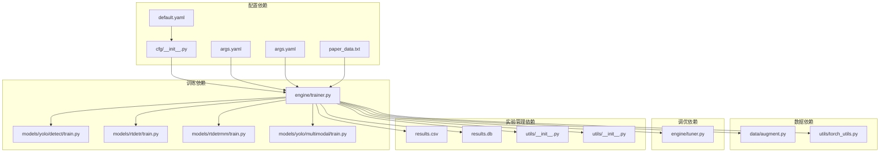

**图表来源**
- [__init__.py:279-358](file://ultralytics/cfg/__init__.py#L279-L358)
- [trainer.py:25-56](file://ultralytics/engine/trainer.py#L25-L56)
- [utils/__init__.py:294-337](file://ultralytics/utils/__init__.py#L294-L337)

**章节来源**
- [__init__.py:1-800](file://ultralytics/cfg/__init__.py#L1-L800)
- [trainer.py:1-800](file://ultralytics/engine/trainer.py#L1-L800)

## 性能考虑

### 训练效率优化

1. **批次大小优化**：使用`auto_batch()`方法自动确定最优批次大小
2. **内存管理**：定期清理GPU/CPU缓存，避免内存泄漏
3. **数据加载优化**：合理设置工作进程数，避免I/O瓶颈
4. **混合精度训练**：在支持的硬件上启用AMP提升训练速度
5. **多模态数据优化**：合理配置多模态数据加载和增强策略

### 超参数调优策略

1. **网格搜索**：系统性地探索参数空间
2. **贝叶斯优化**：基于历史结果指导参数选择
3. **进化算法**：模拟自然选择过程优化参数
4. **多目标优化**：同时优化准确率和推理速度

### 实验管理优化

1. **结果导出策略**：根据需求选择合适的导出格式
2. **数据库性能**：合理设计SQL表结构，优化查询性能
3. **内存使用**：控制CSV文件大小，避免内存溢出
4. **并发处理**：支持多实验并行运行和结果管理

### 性能验证优化

1. **标准化评估**：使用Paper数据框架进行标准化性能评估
2. **多维度指标**：综合考虑准确率、速度、资源消耗等指标
3. **对比分析**：与基线模型和标准数据集进行对比分析
4. **可视化展示**：提供直观的性能对比和趋势分析

## 故障排除指南

### 常见配置错误

1. **参数类型错误**：确保配置参数类型正确（整数、浮点数、布尔值）
2. **参数范围错误**：检查参数值是否在有效范围内
3. **配置冲突**：避免相互矛盾的配置设置
4. **多模态配置错误**：确保多模态数据路径和模态名称正确

### 训练问题诊断

1. **内存不足**：降低批次大小或启用混合精度
2. **收敛缓慢**：调整学习率或使用不同的优化器
3. **过拟合**：增加正则化或数据增强强度
4. **训练不稳定**：启用梯度裁剪或调整学习率调度
5. **多模态训练异常**：检查多模态数据路径和增强配置

### 实验管理问题

1. **结果导出失败**：检查文件权限和磁盘空间
2. **SQL数据库连接错误**：确认SQLite库安装和数据库文件权限
3. **CSV文件损坏**：检查编码格式和分隔符设置
4. **HTML表格显示异常**：验证CSS样式和浏览器兼容性

### 性能验证问题

1. **性能数据缺失**：检查Paper数据文件格式和内容完整性
2. **指标计算错误**：验证评估脚本和数据预处理流程
3. **对比分析不准确**：确保基线模型和评估环境的一致性
4. **可视化结果异常**：检查数据格式和绘图库配置

**章节来源**
- [__init__.py:360-421](file://ultralytics/cfg/__init__.py#L360-L421)
- [trainer.py:528-541](file://ultralytics/engine/trainer.py#L528-L541)
- [utils/__init__.py:294-337](file://ultralytics/utils/__init__.py#L294-L337)

## 结论

训练配置管理系统提供了完整的参数管理和优化框架，支持多种深度学习任务和高级训练技巧。通过合理的配置策略和超参数调优，可以显著提升模型训练效果和效率。系统的设计确保了配置的一致性、可扩展性和易用性，为不同规模和复杂度的训练任务提供了灵活的解决方案。

**更新** 新增的多模态训练配置、实验结果导出和SQL数据库存储功能，以及基于Paper数据的性能验证框架，进一步扩展了系统的实用性和可维护性，为大规模实验管理和数据分析提供了强有力的支持。ResTest目录下的50多个融合模块配置文件展示了系统的强大扩展能力，为研究人员提供了丰富的实验平台和验证工具。

## 附录

### 配置参数速查表

| 参数类别 | 关键参数 | 默认值 | 说明 |
|---------|----------|--------|------|
| 基础设置 | epochs, batch, imgsz | 100, 16, 640 | 训练轮数、批次大小、输入尺寸 |
| 优化器 | optimizer, lr0, momentum | auto, 0.01, 0.937 | 优化器类型、初始学习率、动量 |
| 学习率 | cos_lr, warmup_epochs | false, 3.0 | 余弦调度、热身轮数 |
| 数据增强 | mosaic, mixup, hsv_h | 1.0, 0.0, 0.015 | Mosaic概率、MixUp概率、HSV调整 |
| 损失权重 | box, cls, dfl | 7.5, 0.5, 1.5 | 边界框、分类、分布焦点损失权重 |
| 多模态 | modality, use_multimodal_aug | null, true | 多模态类型、是否启用多模态增强 |
| 实验管理 | save, save_period | true, -1 | 保存训练结果、检查点保存频率 |
| 性能验证 | perf_eval, benchmark | true, standard | 性能评估开关、基准数据集 |

### 超参数调优工具

1. **网格搜索**：适用于小参数空间的全面搜索
2. **贝叶斯优化**：适用于昂贵函数优化
3. **进化算法**：适用于复杂的多峰优化问题
4. **随机搜索**：简单有效的基线方法

### 实验结果导出格式

1. **CSV格式**：标准的数据表格格式，适合Excel和统计分析
2. **HTML格式**：交互式的网页表格，便于在线查看和分享
3. **JSON格式**：结构化的数据交换格式，支持复杂数据结构
4. **SQL格式**：持久化的数据库存储，支持复杂查询和数据分析

### 多模态训练配置

1. **单模态训练**：仅使用RGB或X模态数据进行训练
2. **双模态训练**：RGB与X模态的联合训练，充分利用多源信息
3. **动态模态选择**：根据数据配置自动确定X模态类型
4. **独立增强策略**：RGB和X模态分别配置增强参数，提高训练灵活性

### ResTest融合模块配置

1. **模块化设计**：每个融合模块都有独立的配置文件
2. **统一接口**：所有模块遵循相同的配置格式和参数约定
3. **可扩展性**：支持新的融合策略快速集成和测试
4. **标准化评估**：提供统一的性能验证和比较框架

### 性能验证框架

1. **标准化指标**：使用GFLOPs、参数数量、FPS等标准指标
2. **多维度评估**：同时评估准确率、速度、资源消耗
3. **对比分析**：与基线模型和标准数据集进行对比
4. **可视化展示**：提供直观的性能分析和趋势预测