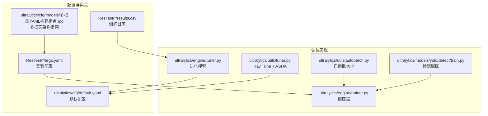
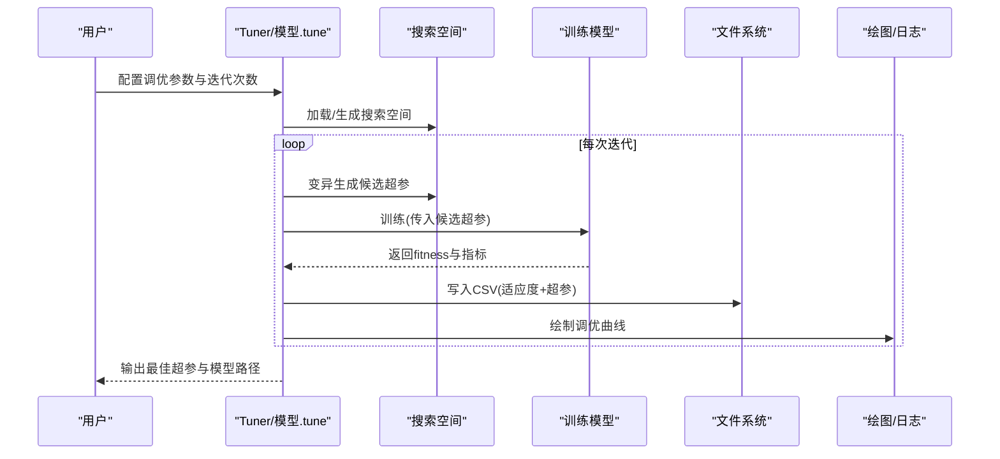
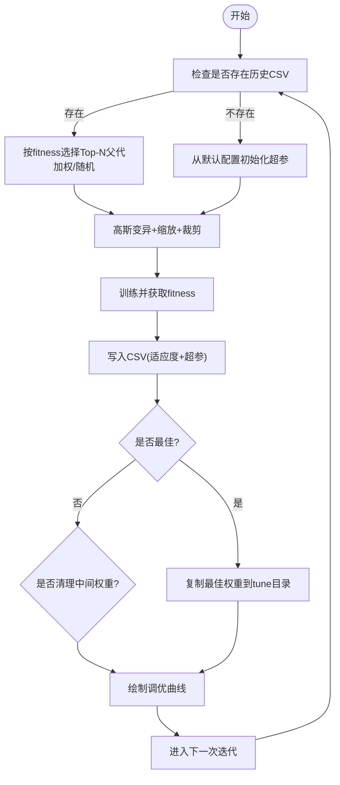
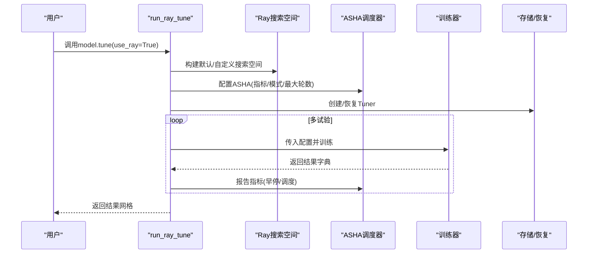
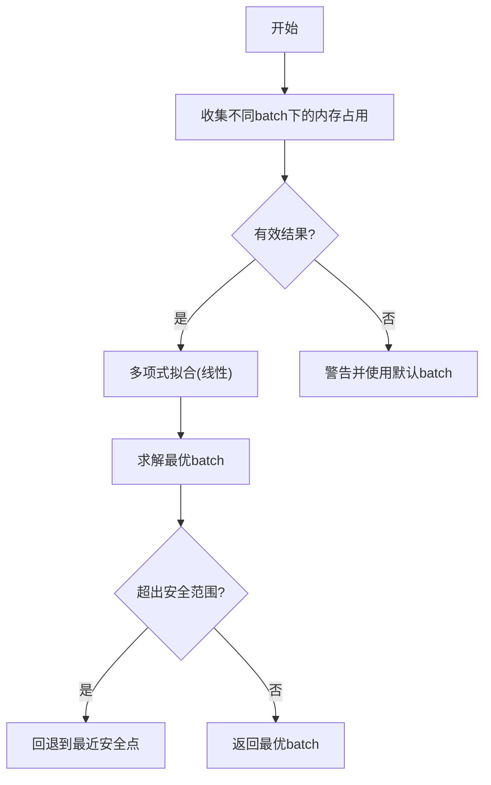
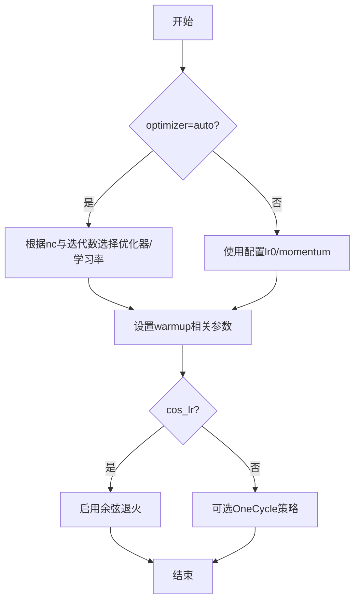
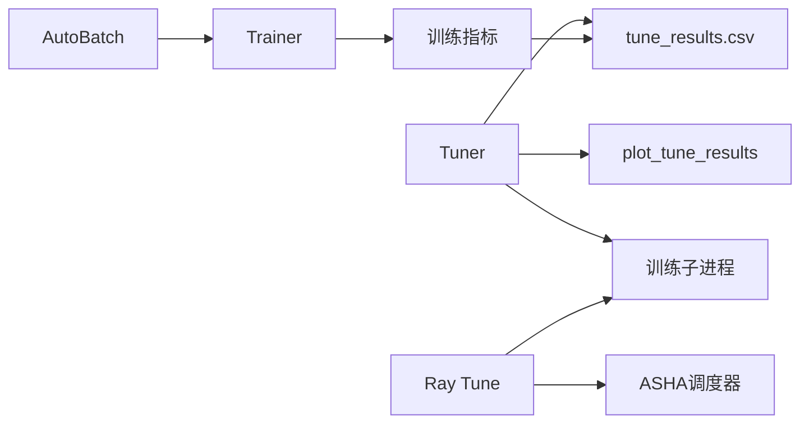

# 超参数调优配置

<cite>
**本文档引用的文件**
- [ultralytics/engine/tuner.py](file://ultralytics/engine/tuner.py)
- [ultralytics/utils/tuner.py](file://ultralytics/utils/tuner.py)
- [ultralytics/cfg/default.yaml](file://ultralytics/cfg/default.yaml)
- [ultralytics/engine/trainer.py](file://ultralytics/engine/trainer.py)
- [ultralytics/utils/autobatch.py](file://ultralytics/utils/autobatch.py)
- [ultralytics/models/yolo/detect/train.py](file://ultralytics/models/yolo/detect/train.py)
- [ResTest/aifi-dattention-CSP-MutilScaleEdgeInformationEnhance-ASF-P2-lite-BackboneFreqFusion/args.yaml](file://ResTest/aifi-dattention-CSP-MutilScaleEdgeInformationEnhance-ASF-P2-lite-BackboneFreqFusion/args.yaml)
- [ResTest/aifi-dattention-CSP-MutilScaleEdgeInformationEnhance-ASF-P2-lite-BackboneFreqFusion2/args.yaml](file://ResTest/aifi-dattention-CSP-MutilScaleEdgeInformationEnhance-ASF-P2-lite-BackboneFreqFusion2/args.yaml)
- [ResTest/aifi-dattention-CSP-MutilScaleEdgeInformationEnhance-ASF-P2-lite-BackboneFreqFusion2/results.csv](file://ResTest/aifi-dattention-CSP-MutilScaleEdgeInformationEnhance-ASF-P2-lite-BackboneFreqFusion2/results.csv)
- [ultralytics/cfg/models/多模态YAML构建指点.md](file://ultralytics/cfg/models/多模态YAML构建指点.md)
</cite>

## 目录
1. [简介](#简介)
2. [项目结构](#项目结构)
3. [核心组件](#核心组件)
4. [架构总览](#架构总览)
5. [详细组件分析](#详细组件分析)
6. [依赖关系分析](#依赖关系分析)
7. [性能考量](#性能考量)
8. [故障排查指南](#故障排查指南)
9. [结论](#结论)
10. [附录](#附录)

## 简介
本文件系统化梳理了本仓库中的超参数调优配置与实践，覆盖网格搜索、贝叶斯优化、进化搜索、自动化批大小搜索、学习率范围测试、批量大小搜索、网络架构参数调优等关键主题。文档基于实际源码实现，结合ResTest实验结果与多模态配置指南，提供可操作的调优策略、流程与最佳实践，并给出结果分析与模型性能评估方法。

## 项目结构
围绕超参数调优的关键文件与目录如下：
- 调优引擎与工具
  - ultralytics/engine/tuner.py：内置进化式超参搜索实现，支持迭代变异与自动记录
  - ultralytics/utils/tuner.py：集成Ray Tune与ASHA调度器，支持分布式与早停
  - ultralytics/utils/autobatch.py：自动批大小搜索，基于GPU内存拟合
  - ultralytics/engine/trainer.py：训练器，支持自动优化器选择与学习率策略
  - ultralytics/models/yolo/detect/train.py：检测训练子流程，提供auto_batch接口
- 默认配置
  - ultralytics/cfg/default.yaml：全局与超参默认值，包含学习率、权重衰减、数据增强等
- 实验与结果
  - ResTest/*：大量模型变体的args.yaml与results.csv，便于对比分析
  - ultralytics/cfg/models/多模态YAML构建指点.md：多模态网络架构配置指南

**图表来源**
- [ultralytics/engine/tuner.py:1-247](file://ultralytics/engine/tuner.py#L1-L247)
- [ultralytics/utils/tuner.py:1-160](file://ultralytics/utils/tuner.py#L1-L160)
- [ultralytics/utils/autobatch.py:92-119](file://ultralytics/utils/autobatch.py#L92-L119)
- [ultralytics/engine/trainer.py:853-867](file://ultralytics/engine/trainer.py#L853-L867)
- [ultralytics/models/yolo/detect/train.py:210-221](file://ultralytics/models/yolo/detect/train.py#L210-L221)
- [ultralytics/cfg/default.yaml:1-168](file://ultralytics/cfg/default.yaml#L1-L168)
- [ResTest/aifi-dattention-CSP-MutilScaleEdgeInformationEnhance-ASF-P2-lite-BackboneFreqFusion/args.yaml:1-135](file://ResTest/aifi-dattention-CSP-MutilScaleEdgeInformationEnhance-ASF-P2-lite-BackboneFreqFusion/args.yaml#L1-L135)
- [ResTest/aifi-dattention-CSP-MutilScaleEdgeInformationEnhance-ASF-P2-lite-BackboneFreqFusion2/results.csv:1-133](file://ResTest/aifi-dattention-CSP-MutilScaleEdgeInformationEnhance-ASF-P2-lite-BackboneFreqFusion2/results.csv#L1-L133)
- [ultralytics/cfg/models/多模态YAML构建指点.md:1-239](file://ultralytics/cfg/models/多模态YAML构建指点.md#L1-L239)

**章节来源**
- [ultralytics/engine/tuner.py:1-247](file://ultralytics/engine/tuner.py#L1-L247)
- [ultralytics/utils/tuner.py:1-160](file://ultralytics/utils/tuner.py#L1-L160)
- [ultralytics/cfg/default.yaml:1-168](file://ultralytics/cfg/default.yaml#L1-L168)

## 核心组件
- 进化式超参搜索（Tuner）
  - 提供搜索空间（学习率、动量、权重衰减、warmup、损失权重、数据增强概率等）
  - 支持从历史CSV恢复，按适应度选择父代并进行高斯变异
  - 每轮训练后记录fitness与超参到CSV，保存最佳超参与模型权重
- Ray Tune + ASHA调度
  - 自动构建搜索空间，默认使用uniform分布
  - 使用ASHA早停策略，按任务指标最大化
  - 支持W&B日志与资源分配
- 自动批大小搜索（AutoBatch）
  - 基于GPU内存拟合，计算最优batch size
  - 支持失败回退与安全范围约束
- 训练器与学习率策略
  - 支持optimizer=auto，依据样本数量自动选择优化器与学习率
  - 支持cos_lr、OneCycle等学习率调度

**章节来源**
- [ultralytics/engine/tuner.py:31-247](file://ultralytics/engine/tuner.py#L31-L247)
- [ultralytics/utils/tuner.py:7-160](file://ultralytics/utils/tuner.py#L7-L160)
- [ultralytics/utils/autobatch.py:92-119](file://ultralytics/utils/autobatch.py#L92-L119)
- [ultralytics/engine/trainer.py:853-867](file://ultralytics/engine/trainer.py#L853-L867)

## 架构总览
下图展示了超参数调优的端到端流程：从配置加载、搜索空间定义、迭代变异、训练执行、结果记录到可视化与最佳超参输出。

**图表来源**
- [ultralytics/engine/tuner.py:158-247](file://ultralytics/engine/tuner.py#L158-L247)
- [ultralytics/utils/tuner.py:90-160](file://ultralytics/utils/tuner.py#L90-L160)

## 详细组件分析

### 组件A：进化式超参搜索（Tuner）
- 关键特性
  - 搜索空间：学习率、动量、权重衰减、warmup、损失权重、HSV/几何增强概率等
  - 变异策略：高斯噪声+按gain缩放，限制在上下界内
  - 父代选择：单选或加权组合，按历史fitness加权
  - 结果持久化：CSV记录fitness与超参，自动复制最佳权重
- 流程图（算法实现）

**图表来源**
- [ultralytics/engine/tuner.py:110-156](file://ultralytics/engine/tuner.py#L110-L156)
- [ultralytics/engine/tuner.py:158-247](file://ultralytics/engine/tuner.py#L158-L247)

**章节来源**
- [ultralytics/engine/tuner.py:31-247](file://ultralytics/engine/tuner.py#L31-L247)

### 组件B：Ray Tune + ASHA调度
- 关键特性
  - 默认搜索空间：均匀分布的超参范围
  - ASHA早停：按epoch数与任务指标动态停止劣质试验
  - 资源分配：CPU线程与GPU分配
  - 可选W&B日志
- 调用序列

**图表来源**
- [ultralytics/utils/tuner.py:7-160](file://ultralytics/utils/tuner.py#L7-L160)

**章节来源**
- [ultralytics/utils/tuner.py:7-160](file://ultralytics/utils/tuner.py#L7-L160)

### 组件C：自动批大小搜索（AutoBatch）
- 关键特性
  - 基于GPU内存拟合，计算最优batch size
  - 支持失败回退与安全范围约束
  - 与检测训练流程集成

**图表来源**
- [ultralytics/utils/autobatch.py:92-119](file://ultralytics/utils/autobatch.py#L92-L119)
- [ultralytics/models/yolo/detect/train.py:210-221](file://ultralytics/models/yolo/detect/train.py#L210-L221)

**章节来源**
- [ultralytics/utils/autobatch.py:92-119](file://ultralytics/utils/autobatch.py#L92-L119)
- [ultralytics/models/yolo/detect/train.py:210-221](file://ultralytics/models/yolo/detect/train.py#L210-L221)

### 组件D：学习率范围测试与OneCycle策略
- 默认配置
  - lr0、lrf、cos_lr、warmup_epochs等
- 自动优化器选择
  - optimizer=auto时，依据类别数与迭代次数自动选择优化器与学习率
- 流程图（学习率策略）

**图表来源**
- [ultralytics/engine/trainer.py:853-867](file://ultralytics/engine/trainer.py#L853-L867)
- [ultralytics/cfg/default.yaml:92-126](file://ultralytics/cfg/default.yaml#L92-L126)

**章节来源**
- [ultralytics/engine/trainer.py:853-867](file://ultralytics/engine/trainer.py#L853-L867)
- [ultralytics/cfg/default.yaml:92-126](file://ultralytics/cfg/default.yaml#L92-L126)

### 组件E：批量大小搜索与学习率范围测试
- 批大小搜索
  - 使用AutoBatch自动确定最优batch
  - 可在不同batch下运行多次，观察mAP/loss变化趋势
- 学习率范围测试
  - 可通过调整lr0/lrf与cos_lr/warmup_epochs观察收敛行为
  - 结合results.csv中的metrics列评估性能

**章节来源**
- [ultralytics/utils/autobatch.py:92-119](file://ultralytics/utils/autobatch.py#L92-L119)
- [ResTest/aifi-dattention-CSP-MutilScaleEdgeInformationEnhance-ASF-P2-lite-BackboneFreqFusion2/results.csv:1-133](file://ResTest/aifi-dattention-CSP-MutilScaleEdgeInformationEnhance-ASF-P2-lite-BackboneFreqFusion2/results.csv#L1-L133)

### 组件F：网络架构参数调优（多模态）
- 多模态架构配置
  - 通过YAML第5字段指定输入模态（RGB/X/Dual）
  - 支持早期/中期/晚期融合策略
  - X通道数由data.yaml的Xch控制
- 实践要点
  - 保持分支连续与融合点明确
  - 使用profile=True检查路由与形状
  - 根据任务复杂度选择融合策略

**章节来源**
- [ultralytics/cfg/models/多模态YAML构建指点.md:1-239](file://ultralytics/cfg/models/多模态YAML构建指点.md#L1-L239)
- [ResTest/aifi-dattention-CSP-MutilScaleEdgeInformationEnhance-ASF-P2-lite-BackboneFreqFusion/args.yaml:1-135](file://ResTest/aifi-dattention-CSP-MutilScaleEdgeInformationEnhance-ASF-P2-lite-BackboneFreqFusion/args.yaml#L1-L135)
- [ResTest/aifi-dattention-CSP-MutilScaleEdgeInformationEnhance-ASF-P2-lite-BackboneFreqFusion2/args.yaml:1-135](file://ResTest/aifi-dattention-CSP-MutilScaleEdgeInformationEnhance-ASF-P2-lite-BackboneFreqFusion2/args.yaml#L1-L135)

## 依赖关系分析
- 组件耦合
  - Tuner依赖CSV记录与绘图工具，与训练流程解耦（通过子进程启动训练）
  - Ray Tune封装训练器，提供分布式与早停能力
  - AutoBatch与训练器耦合，确保批大小与内存匹配
- 外部依赖
  - Ray/Tune、ASHA、W&B（可选）
  - NumPy（统计与数组操作）

**图表来源**
- [ultralytics/engine/tuner.py:158-247](file://ultralytics/engine/tuner.py#L158-L247)
- [ultralytics/utils/tuner.py:112-151](file://ultralytics/utils/tuner.py#L112-L151)
- [ultralytics/utils/autobatch.py:92-119](file://ultralytics/utils/autobatch.py#L92-L119)

**章节来源**
- [ultralytics/engine/tuner.py:158-247](file://ultralytics/engine/tuner.py#L158-L247)
- [ultralytics/utils/tuner.py:112-151](file://ultralytics/utils/tuner.py#L112-L151)
- [ultralytics/utils/autobatch.py:92-119](file://ultralytics/utils/autobatch.py#L92-L119)

## 性能考量
- 计算资源
  - 使用Ray Tune可充分利用多GPU/多节点资源，结合ASHA减少无效试验
  - AutoBatch避免显存溢出，提高GPU利用率
- 收敛速度
  - optimizer=auto可快速获得合理初始配置
  - warmup_epochs与warmup_momentum影响初期稳定性
- 存储与日志
  - Tuner支持清理中间权重，降低磁盘占用
  - Ray Tune支持W&B日志，便于远程监控

[本节为通用指导，无需特定文件引用]

## 故障排查指南
- Ray相关
  - 缺少依赖：安装"ray[tune]"并满足版本要求
  - W&B未安装：不影响调优，但无法记录日志
- Tuner相关
  - 训练失败：检查CSV是否存在、命令行参数拼接是否正确
  - 结果为空：确认训练返回的metrics字段存在
- AutoBatch相关
  - 内存异常：检查GPU显存与拟合范围，必要时降低上限
- 多模态配置
  - 通道不匹配：核对data.yaml的Xch与YAML第5字段
  - 模块未导入：确认模块在相应__init__.py中导出

**章节来源**
- [ultralytics/utils/tuner.py:40-58](file://ultralytics/utils/tuner.py#L40-L58)
- [ultralytics/engine/tuner.py:195-206](file://ultralytics/engine/tuner.py#L195-L206)
- [ultralytics/utils/autobatch.py:112-119](file://ultralytics/utils/autobatch.py#L112-L119)
- [ultralytics/cfg/models/多模态YAML构建指点.md:206-217](file://ultralytics/cfg/models/多模态YAML构建指点.md#L206-L217)

## 结论
本仓库提供了从基础进化搜索到Ray Tune + ASHA的完整超参数调优能力，配合AutoBatch与默认配置，能够高效地完成学习率、批大小、数据增强与网络架构等关键超参的搜索与优化。结合ResTest实验与多模态配置指南，用户可以针对不同任务类型制定系统化的调优策略，并通过results.csv与最佳超参文件进行结果复现与分析。

[本节为总结性内容，无需特定文件引用]

## 附录

### A. 调优策略与流程（按任务类型）
- 目标检测（单模态/多模态）
  - 步骤：先用AutoBatch确定批大小；再用Tuner或Ray Tune搜索lr0/lrf/momentum/weight_decay与数据增强概率；最后固定最优超参微调
  - 多模态：优先中期融合，确保RGB/X分支连续与融合点明确
- 实例分割/分类/姿态估计
  - 保持相同搜索空间，关注cls/box/dfl等损失权重
- 多模态（RT-DETR/YOLO）
  - 使用多模态YAML构建指南，按早期/中期/晚期策略选择融合位置

**章节来源**
- [ultralytics/cfg/default.yaml:92-126](file://ultralytics/cfg/default.yaml#L92-L126)
- [ultralytics/cfg/models/多模态YAML构建指点.md:68-202](file://ultralytics/cfg/models/多模态YAML构建指点.md#L68-L202)

### B. 调优结果分析与模型性能评估
- 指标解读
  - mAP50、mAP50-95为主要目标指标；precision/recall反映召回与精确率平衡
- CSV分析
  - 通过tune_results.csv观察fitness与各超参的变化趋势
  - results.csv中metrics列可用于对比不同配置的收敛与泛化表现
- 最佳超参应用
  - 将best_hyperparameters.yaml中的超参注入训练配置，复现实验

**章节来源**
- [ultralytics/engine/tuner.py:240-247](file://ultralytics/engine/tuner.py#L240-L247)
- [ResTest/aifi-dattention-CSP-MutilScaleEdgeInformationEnhance-ASF-P2-lite-BackboneFreqFusion2/results.csv:1-133](file://ResTest/aifi-dattention-CSP-MutilScaleEdgeInformationEnhance-ASF-P2-lite-BackboneFreqFusion2/results.csv#L1-L133)