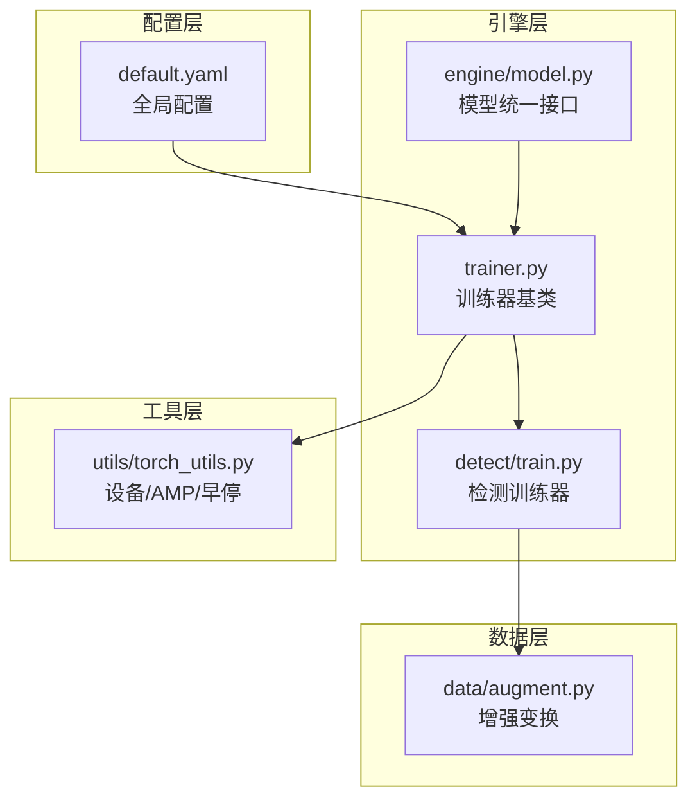
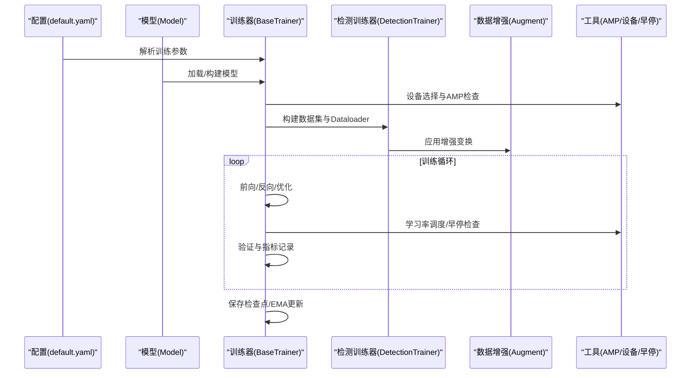
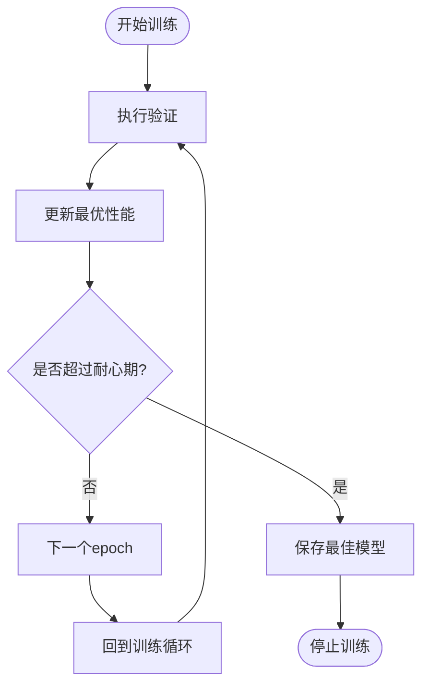
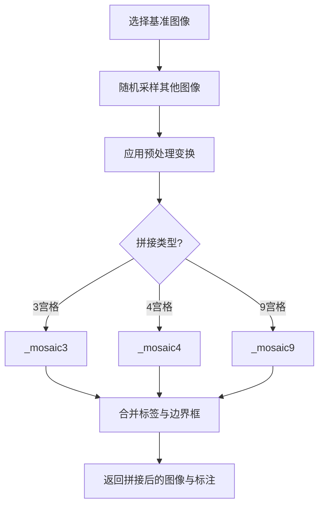
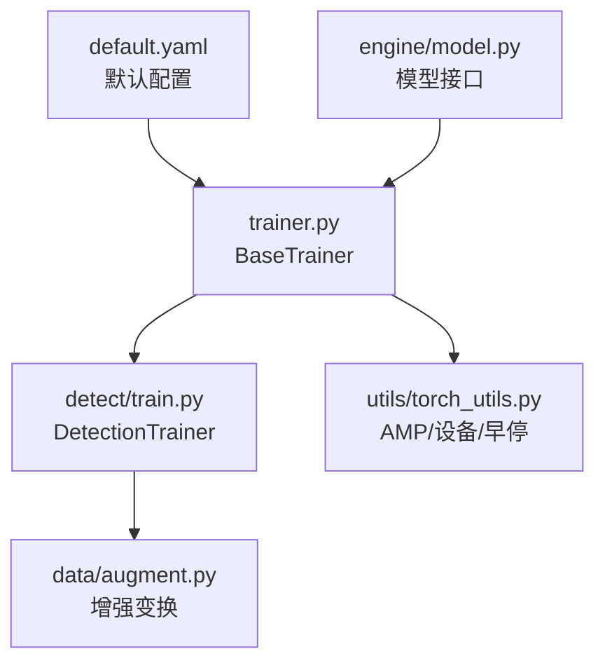

# 高级训练技巧配置

<cite>
**本文档引用的文件**
- [ultralytics/cfg/default.yaml](file://ultralytics/cfg/default.yaml)
- [ultralytics/engine/trainer.py](file://ultralytics/engine/trainer.py)
- [ultralytics/utils/torch_utils.py](file://ultralytics/utils/torch_utils.py)
- [ultralytics/data/augment.py](file://ultralytics/data/augment.py)
- [ultralytics/engine/model.py](file://ultralytics/engine/model.py)
- [ultralytics/models/yolo/detect/train.py](file://ultralytics/models/yolo/detect/train.py)
- [ResTest/aifi-dattention-CSP-MutilScaleEdgeInformationEnhance-ASF-P2-lite-BackboneFreqFusion/args.yaml](file://ResTest/aifi-dattention-CSP-MutilScaleEdgeInformationEnhance-ASF-P2-lite-BackboneFreqFusion/args.yaml)
- [ResTest/aifi-dattention-CSP-MutilScaleEdgeInformationEnhance-ASF-P2-lite-BackboneFreqFusion-resume/args.yaml](file://ResTest/aifi-dattention-CSP-MutilScaleEdgeInformationEnhance-ASF-P2-lite-BackboneFreqFusion-resume/args.yaml)
</cite>

## 目录
1. [简介](#简介)
2. [项目结构](#项目结构)
3. [核心组件](#核心组件)
4. [架构概览](#架构概览)
5. [详细组件分析](#详细组件分析)
6. [依赖关系分析](#依赖关系分析)
7. [性能考虑](#性能考虑)
8. [故障排除指南](#故障排除指南)
9. [结论](#结论)

## 简介

本文件详细阐述了该代码库中高级训练技巧的配置方法，包括但不限于：

- **早停机制**：基于验证集性能的自动停止策略
- **学习率调度策略**：线性退火与余弦退火两种调度方式
- **混合精度训练**：AMP自动混合精度的启用与管理
- **梯度裁剪**：防止梯度爆炸的梯度范数裁剪
- **多尺度训练**：动态尺度训练提升模型泛化能力
- **马赛克增强**：4张或9张图片拼接的增强技术
- **标签平滑**：正则化技术减少过拟合
- **冻结层配置**：预训练模型微调时的层冻结策略
- **预训练模型加载**：权重初始化与模型恢复
- **断点续训**：训练中断后的无缝恢复

同时，本文提供针对不同硬件环境（CPU/GPU/MPS）和数据集特点（小样本、大目标、多模态）的优化配置建议。

## 项目结构

该代码库采用模块化设计，围绕训练流程的关键环节组织：

- **配置层**：全局默认配置与任务特定配置
- **引擎层**：训练器、验证器、预测器的核心实现
- **数据层**：数据集构建、增强变换与加载
- **模型层**：YOLO系列模型的统一接口与任务映射
- **工具层**：设备选择、混合精度、回调与实用函数



**图表来源**
- [ultralytics/cfg/default.yaml:1-168](file://ultralytics/cfg/default.yaml#L1-L168)
- [ultralytics/engine/trainer.py:1-120](file://ultralytics/engine/trainer.py#L1-L120)
- [ultralytics/models/yolo/detect/train.py:1-60](file://ultralytics/models/yolo/detect/train.py#L1-L60)
- [ultralytics/data/augment.py:1-60](file://ultralytics/data/augment.py#L1-L60)
- [ultralytics/utils/torch_utils.py:1-60](file://ultralytics/utils/torch_utils.py#L1-L60)

**章节来源**
- [ultralytics/cfg/default.yaml:1-168](file://ultralytics/cfg/default.yaml#L1-L168)
- [ultralytics/engine/trainer.py:1-120](file://ultralytics/engine/trainer.py#L1-L120)
- [ultralytics/models/yolo/detect/train.py:1-60](file://ultralytics/models/yolo/detect/train.py#L1-L60)
- [ultralytics/data/augment.py:1-60](file://ultralytics/data/augment.py#L1-L60)
- [ultralytics/utils/torch_utils.py:1-60](file://ultralytics/utils/torch_utils.py#L1-L60)

## 核心组件

### 训练器基类（BaseTrainer）

- **职责**：封装训练循环、验证、检查点保存、学习率调度、混合精度与早停逻辑
- **关键特性**：
  - 支持单GPU与分布式训练（DDP）
  - 自动批大小估计（AutoBatch）
  - EMA（指数移动平均）模型维护
  - 断点续训（resume）
  - 多尺度训练（multi_scale）
  - 马赛克增强关闭时机（close_mosaic）

**章节来源**
- [ultralytics/engine/trainer.py:59-170](file://ultralytics/engine/trainer.py#L59-L170)
- [ultralytics/engine/trainer.py:229-342](file://ultralytics/engine/trainer.py#L229-L342)
- [ultralytics/engine/trainer.py:344-504](file://ultralytics/engine/trainer.py#L344-L504)

### 检测训练器（DetectionTrainer）

- **职责**：面向检测任务的数据集构建、数据加载器构造、预处理与损失标签
- **关键特性**：
  - 基于stride的网格对齐
  - 多尺度训练的随机尺度调整
  - 训练样本可视化与指标绘制

**章节来源**
- [ultralytics/models/yolo/detect/train.py:21-90](file://ultralytics/models/yolo/detect/train.py#L21-L90)
- [ultralytics/models/yolo/detect/train.py:92-145](file://ultralytics/models/yolo/detect/train.py#L92-L145)

### 混合精度与设备管理

- **AMP（自动混合精度）**：GradScaler管理，支持torch.amp与旧版autocast
- **设备选择**：自动选择GPU/CPU/MPS，并支持多GPU与空闲GPU选择
- **早停机制**：EarlyStopping类，基于验证集最优性能与耐心参数

**章节来源**
- [ultralytics/utils/torch_utils.py:77-104](file://ultralytics/utils/torch_utils.py#L77-L104)
- [ultralytics/utils/torch_utils.py:131-200](file://ultralytics/utils/torch_utils.py#L131-L200)
- [ultralytics/utils/torch_utils.py:966-1018](file://ultralytics/utils/torch_utils.py#L966-L1018)

### 数据增强与多尺度

- **增强变换**：Compose组合多种变换，支持随机翻转、透视、HSV扰动等
- **马赛克增强**：Mosaic类实现4张或9张图片拼接，支持缓冲区加速
- **多尺度训练**：在预处理阶段随机缩放输入尺寸，提升模型尺度不变性

**章节来源**
- [ultralytics/data/augment.py:146-204](file://ultralytics/data/augment.py#L146-L204)
- [ultralytics/data/augment.py:502-795](file://ultralytics/data/augment.py#L502-L795)
- [ultralytics/models/yolo/detect/train.py:103-117](file://ultralytics/models/yolo/detect/train.py#L103-L117)

## 架构概览

训练流程从配置解析开始，经过模型加载、数据准备、训练循环与验证，最终保存检查点并可选进行导出。



**图表来源**
- [ultralytics/cfg/default.yaml:9-47](file://ultralytics/cfg/default.yaml#L9-L47)
- [ultralytics/engine/model.py:791-800](file://ultralytics/engine/model.py#L791-L800)
- [ultralytics/engine/trainer.py:250-342](file://ultralytics/engine/trainer.py#L250-L342)
- [ultralytics/models/yolo/detect/train.py:54-90](file://ultralytics/models/yolo/detect/train.py#L54-L90)
- [ultralytics/utils/torch_utils.py:966-1018](file://ultralytics/utils/torch_utils.py#L966-L1018)

## 详细组件分析

### 早停机制配置

- **参数位置**：全局配置中的`patience`字段
- **工作原理**：
  - 基于验证集的最优性能（fitness）记录
  - 当连续`patience`个epoch未改善时触发停止
  - 保存最佳模型（best.pt）并在日志中提示
- **适用场景**：防止过拟合、节省训练时间



**图表来源**
- [ultralytics/utils/torch_utils.py:966-1018](file://ultralytics/utils/torch_utils.py#L966-L1018)
- [ultralytics/engine/trainer.py:458-462](file://ultralytics/engine/trainer.py#L458-L462)

**章节来源**
- [ultralytics/cfg/default.yaml:15-15](file://ultralytics/cfg/default.yaml#L15-L15)
- [ultralytics/utils/torch_utils.py:966-1018](file://ultralytics/utils/torch_utils.py#L966-L1018)
- [ultralytics/engine/trainer.py:458-462](file://ultralytics/engine/trainer.py#L458-L462)

### 学习率调度策略

- **参数位置**：全局配置中的`cos_lr`与`lrf`，训练器中的`lr0`、`warmup_epochs`等
- **策略类型**：
  - 余弦退火：`cos_lr=true`时使用one_cycle调度
  - 线性退火：默认线性衰减到`lrf * lr0`
- **热身**：通过`warmup_epochs`、`warmup_momentum`、`warmup_bias_lr`控制初始阶段的学习率与动量

```mermaid
sequenceDiagram
participant TRAINER as "训练器"
participant SCHED as "学习率调度器"
participant OPT as "优化器"
TRAINER->>SCHED : 初始化LambdaLR(线性/余弦)
loop 每个epoch
TRAINER->>SCHED : step()
SCHED-->>OPT : 更新学习率
TRAINER->>OPT : 优化器步进
end
```

**图表来源**
- [ultralytics/engine/trainer.py:229-235](file://ultralytics/engine/trainer.py#L229-L235)
- [ultralytics/utils/torch_utils.py:658-670](file://ultralytics/utils/torch_utils.py#L658-L670)

**章节来源**
- [ultralytics/cfg/default.yaml:34-34](file://ultralytics/cfg/default.yaml#L34-L34)
- [ultralytics/cfg/default.yaml:93-99](file://ultralytics/cfg/default.yaml#L93-L99)
- [ultralytics/engine/trainer.py:229-235](file://ultralytics/engine/trainer.py#L229-L235)
- [ultralytics/utils/torch_utils.py:658-670](file://ultralytics/utils/torch_utils.py#L658-L670)

### 混合精度训练（AMP）

- **参数位置**：全局配置中的`amp`
- **实现细节**：
  - GradScaler管理混合精度梯度缩放
  - 自动AMP兼容性检查与广播（多GPU）
  - 支持torch.amp.autocast与旧版autocast
- **性能收益**：降低内存占用、提升吞吐量

**章节来源**
- [ultralytics/cfg/default.yaml:37-37](file://ultralytics/cfg/default.yaml#L37-L37)
- [ultralytics/engine/trainer.py:281-294](file://ultralytics/engine/trainer.py#L281-L294)
- [ultralytics/utils/torch_utils.py:77-104](file://ultralytics/utils/torch_utils.py#L77-L104)

### 梯度裁剪

- **实现位置**：优化器步进前对模型参数应用`clip_grad_norm_`
- **作用**：防止梯度爆炸，稳定训练过程
- **裁剪阈值**：默认10.0（可在实现中调整）

**章节来源**
- [ultralytics/engine/trainer.py:657-666](file://ultralytics/engine/trainer.py#L657-L666)

### 多尺度训练

- **参数位置**：全局配置中的`multi_scale`
- **实现位置**：检测训练器的`preprocess_batch`中随机缩放输入尺寸
- **效果**：提升模型对不同尺度目标的适应能力

**章节来源**
- [ultralytics/cfg/default.yaml:41-41](file://ultralytics/cfg/default.yaml#L41-L41)
- [ultralytics/models/yolo/detect/train.py:103-117](file://ultralytics/models/yolo/detect/train.py#L103-L117)

### 马赛克增强

- **参数位置**：全局配置中的`mosaic`
- **实现位置**：Mosaic类支持3/4/9宫格拼接，支持缓冲区加速
- **关闭时机**：通过`close_mosaic`在最后若干epoch禁用



**图表来源**
- [ultralytics/data/augment.py:502-795](file://ultralytics/data/augment.py#L502-L795)

**章节来源**
- [ultralytics/cfg/default.yaml:119-119](file://ultralytics/cfg/default.yaml#L119-L119)
- [ultralytics/data/augment.py:502-795](file://ultralytics/data/augment.py#L502-L795)
- [ultralytics/engine/trainer.py:363-382](file://ultralytics/engine/trainer.py#L363-L382)

### 标签平滑

- **参数位置**：全局配置中的`copy_paste`与`copy_paste_mode`
- **作用**：通过复制粘贴增强减少过拟合，提升泛化能力
- **注意**：需结合具体任务与数据集效果评估

**章节来源**
- [ultralytics/cfg/default.yaml:122-123](file://ultralytics/cfg/default.yaml#L122-L123)

### 冻结层配置

- **参数位置**：全局配置中的`freeze`
- **实现位置**：训练器中遍历模型参数，冻结指定层数或索引
- **适用场景**：预训练模型微调时保留特征提取能力

**章节来源**
- [ultralytics/cfg/default.yaml:40-40](file://ultralytics/cfg/default.yaml#L40-L40)
- [ultralytics/engine/trainer.py:258-280](file://ultralytics/engine/trainer.py#L258-L280)

### 预训练模型加载与断点续训

- **预训练加载**：`pretrained`参数支持布尔值或权重路径
- **断点续训**：`resume`参数支持从最近检查点或指定checkpoint恢复
- **配置覆盖**：断点续训时允许覆盖部分参数（如设备、图像尺寸）

**章节来源**
- [ultralytics/cfg/default.yaml:26-26](file://ultralytics/cfg/default.yaml#L26-L26)
- [ultralytics/engine/trainer.py:765-800](file://ultralytics/engine/trainer.py#L765-L800)

## 依赖关系分析

训练器与各组件之间的依赖关系如下：



**图表来源**
- [ultralytics/cfg/default.yaml:1-168](file://ultralytics/cfg/default.yaml#L1-L168)
- [ultralytics/engine/trainer.py:1-120](file://ultralytics/engine/trainer.py#L1-L120)
- [ultralytics/models/yolo/detect/train.py:1-60](file://ultralytics/models/yolo/detect/train.py#L1-L60)
- [ultralytics/data/augment.py:1-60](file://ultralytics/data/augment.py#L1-L60)
- [ultralytics/utils/torch_utils.py:1-60](file://ultralytics/utils/torch_utils.py#L1-L60)
- [ultralytics/engine/model.py:1-80](file://ultralytics/engine/model.py#L1-L80)

**章节来源**
- [ultralytics/engine/trainer.py:1-120](file://ultralytics/engine/trainer.py#L1-L120)
- [ultralytics/models/yolo/detect/train.py:1-60](file://ultralytics/models/yolo/detect/train.py#L1-L60)
- [ultralytics/data/augment.py:1-60](file://ultralytics/data/augment.py#L1-L60)
- [ultralytics/utils/torch_utils.py:1-60](file://ultralytics/utils/torch_utils.py#L1-L60)
- [ultralytics/engine/model.py:1-80](file://ultralytics/engine/model.py#L1-L80)

## 性能考虑

- **硬件环境优化**：
  - **GPU**：启用AMP与合适的批大小；合理设置`workers`；使用DDP进行多卡训练
  - **CPU**：禁用多进程数据加载（`workers=0`）；避免过多的增强变换
  - **MPS（Apple Silicon）**：注意内存管理，必要时降低批大小与分辨率
- **数据集特性优化**：
  - **小样本数据集**：增加马赛克与MixUp增强；使用标签平滑；适当冻结浅层
  - **大目标数据集**：可考虑关闭马赛克；增大输入尺寸；使用余弦退火
  - **多模态数据集**：启用多模态增强配置（RGB+X），并确保通道数匹配
- **训练稳定性**：
  - 合理设置学习率与warmup；使用早停与EMA；监控梯度范数进行梯度裁剪

[本节提供通用指导，无需特定文件引用]

## 故障排除指南

- **训练不收敛或震荡**：
  - 检查学习率与warmup设置；尝试关闭马赛克；启用梯度裁剪
- **显存不足（OOM）**：
  - 降低批大小或输入尺寸；启用AMP；减少增强变换复杂度
- **断点续训失败**：
  - 确认checkpoint路径存在；避免在resume时修改模型架构参数
- **多尺度训练异常**：
  - 确保stride对齐；检查网格大小与输入尺寸关系

**章节来源**
- [ultralytics/engine/trainer.py:505-541](file://ultralytics/engine/trainer.py#L505-L541)
- [ultralytics/engine/trainer.py:765-800](file://ultralytics/engine/trainer.py#L765-L800)

## 结论

通过合理配置上述高级训练技巧，可以在不同硬件与数据集条件下显著提升模型的训练效率与最终性能。建议从早停与学习率调度入手，逐步引入混合精度、多尺度与增强技术，并结合冻结层与断点续训实现高效微调。