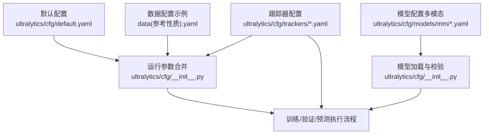
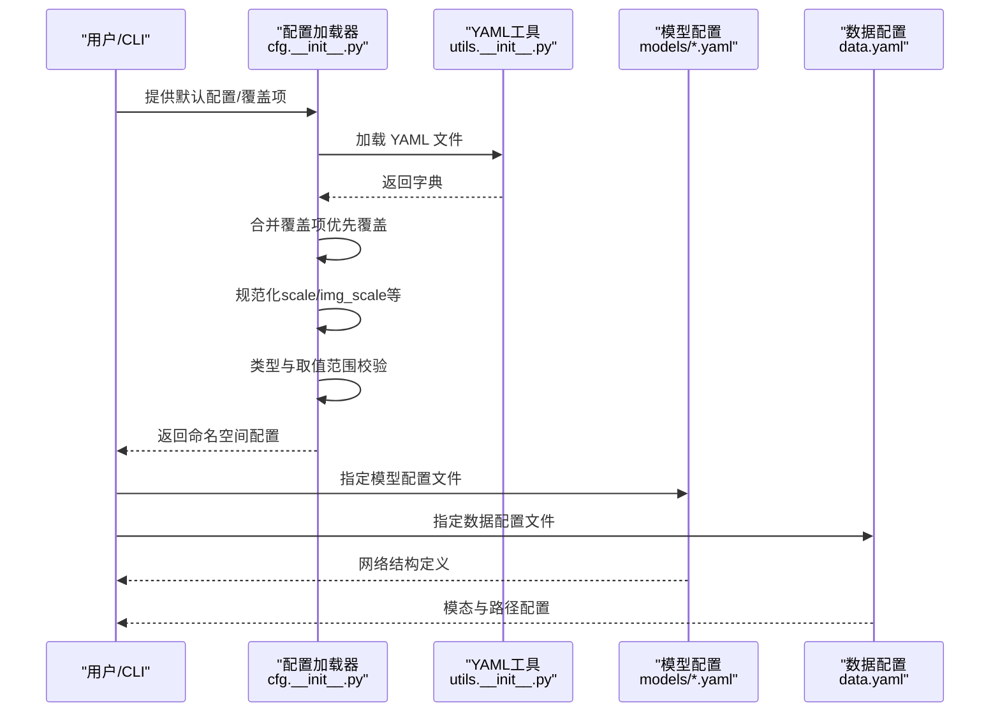
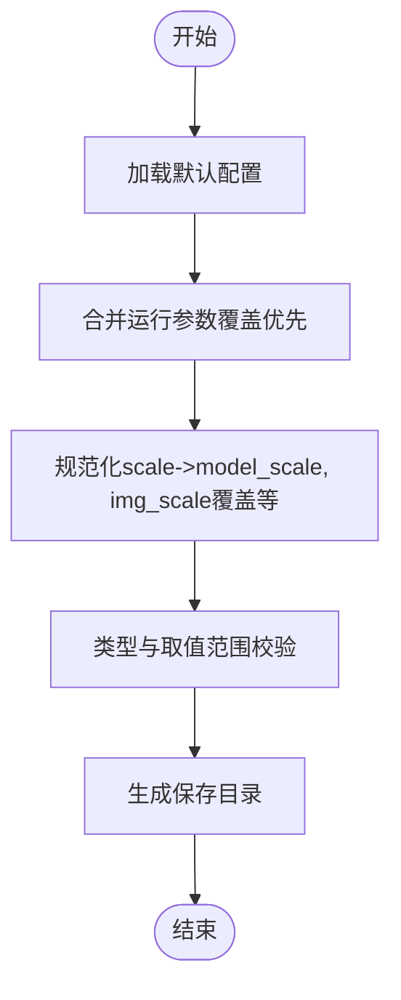
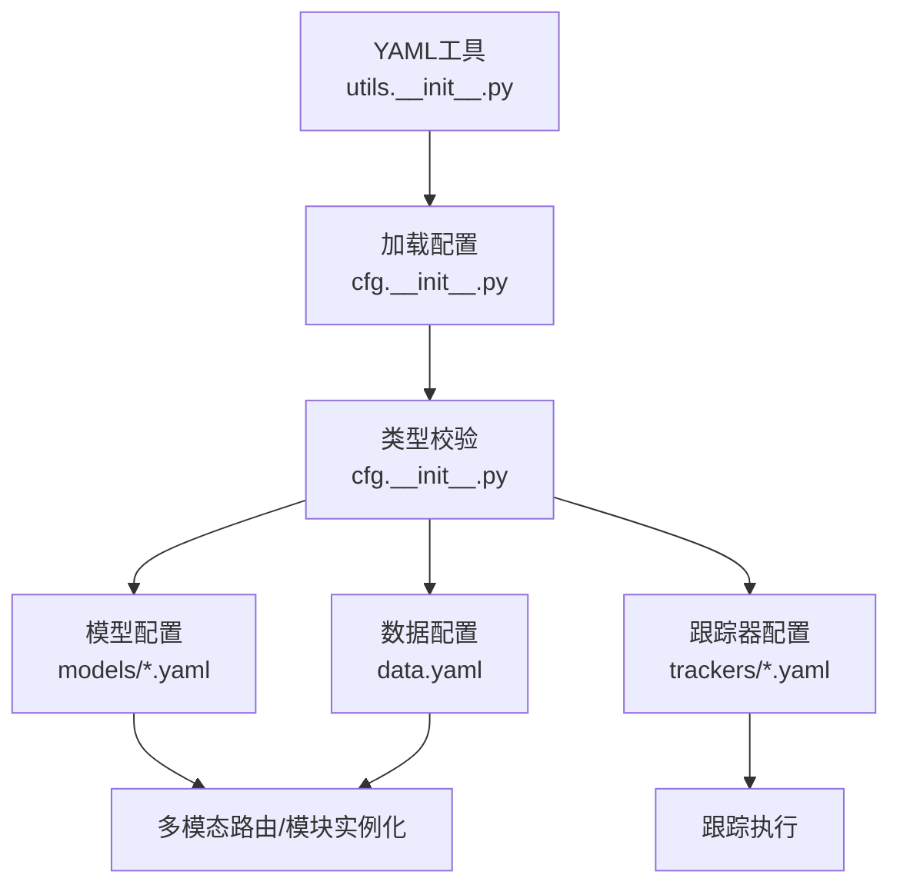

# 配置文件结构与语法

<cite>
**本文档引用的文件**
- [ultralytics/cfg/default.yaml](file://ultralytics/cfg/default.yaml)
- [ultralytics/cfg/models/README.md](file://ultralytics/cfg/models/README.md)
- [ultralytics/cfg/models/多模态YAML构建指点.md](file://ultralytics/cfg/models/多模态YAML构建指点.md)
- [ultralytics/cfg/trackers/botsort.yaml](file://ultralytics/cfg/trackers/botsort.yaml)
- [ultralytics/cfg/trackers/bytetrack.yaml](file://ultralytics/cfg/trackers/bytetrack.yaml)
- [ultralytics/cfg/__init__.py](file://ultralytics/cfg/__init__.py)
- [ultralytics/utils/__init__.py](file://ultralytics/utils/__init__.py)
- [ResTest/RTDETR-mid/args.yaml](file://ResTest/RTDETR-mid/args.yaml)
- [ResTest/aifi-dattention-CSP-MutilScaleEdgeInformationEnhance-ASF-P2-lite/args.yaml](file://ResTest/aifi-dattention-CSP-MutilScaleEdgeInformationEnhance-ASF-P2-lite/args.yaml)
- [data(参考性质).yaml](file://data(参考性质).yaml)
- [ultralytics/cfg/models/mm/yolo11n-mm-early.yaml](file://ultralytics/cfg/models/mm/yolo11n-mm-early.yaml)
- [ultralytics/cfg/models/rtmm/r18/rtdetr-r18-mm-mid.yaml](file://ultralytics/cfg/models/rtmm/r18/rtdetr-r18-mm-mid.yaml)
</cite>

## 目录
1. [简介](#简介)
2. [项目结构](#项目结构)
3. [核心组件](#核心组件)
4. [架构总览](#架构总览)
5. [详细组件分析](#详细组件分析)
6. [依赖关系分析](#依赖关系分析)
7. [性能考量](#性能考量)
8. [故障排查指南](#故障排查指南)
9. [结论](#结论)
10. [附录](#附录)

## 简介
本文件系统化阐述本仓库中配置文件的结构与语法，涵盖：
- YAML 语法规则、数据类型与嵌套结构
- 全局配置参数、任务配置、训练配置、验证配置、预测配置等各部分的职责与参数含义
- 参数参考手册（类型、默认值、取值范围、使用建议）
- 配置文件的继承机制、参数覆盖规则与最佳实践
- 实际配置示例与常见配置模式

## 项目结构
配置体系由三类文件构成：
- 默认配置：提供所有可用参数的默认值与分组
- 模型配置：描述网络拓扑与模块连接，支持多模态扩展
- 运行参数：每次实验的命令行或 YAML 覆盖项

图表来源
- [ultralytics/cfg/default.yaml:1-168](file://ultralytics/cfg/default.yaml#L1-L168)
- [ultralytics/cfg/__init__.py:279-357](file://ultralytics/cfg/__init__.py#L279-L357)
- [ultralytics/cfg/models/README.md:1-66](file://ultralytics/cfg/models/README.md#L1-L66)
- [ultralytics/cfg/models/多模态YAML构建指点.md:1-239](file://ultralytics/cfg/models/多模态YAML构建指点.md#L1-L239)
- [ultralytics/cfg/trackers/botsort.yaml:1-23](file://ultralytics/cfg/trackers/botsort.yaml#L1-L23)
- [ultralytics/cfg/trackers/bytetrack.yaml:1-15](file://ultralytics/cfg/trackers/bytetrack.yaml#L1-L15)
- [data(参考性质).yaml](file://data(参考性质).yaml#L1-L28)

章节来源
- [ultralytics/cfg/default.yaml:1-168](file://ultralytics/cfg/default.yaml#L1-L168)
- [ultralytics/cfg/models/README.md:1-66](file://ultralytics/cfg/models/README.md#L1-L66)
- [ultralytics/cfg/models/多模态YAML构建指点.md:1-239](file://ultralytics/cfg/models/多模态YAML构建指点.md#L1-L239)
- [ultralytics/cfg/trackers/botsort.yaml:1-23](file://ultralytics/cfg/trackers/botsort.yaml#L1-L23)
- [ultralytics/cfg/trackers/bytetrack.yaml:1-15](file://ultralytics/cfg/trackers/bytetrack.yaml#L1-L15)
- [data(参考性质).yaml](file://data(参考性质).yaml#L1-L28)

## 核心组件
- 默认配置（default.yaml）：定义所有可用参数及其默认值，按功能分组（训练、验证、预测、导出、超参等），并包含多模态扩展字段
- 模型配置（models/*.yaml）：描述网络结构，支持多模态 YAML 扩展语法（第5字段路由）
- 运行参数（args.yaml/CLI）：覆盖默认配置，支持键值对合并与类型校验
- 跟踪器配置（trackers/*.yaml）：指定跟踪算法参数
- 数据配置（data.yaml）：定义数据集路径、模态映射与类别

章节来源
- [ultralytics/cfg/default.yaml:1-168](file://ultralytics/cfg/default.yaml#L1-L168)
- [ultralytics/cfg/models/README.md:1-66](file://ultralytics/cfg/models/README.md#L1-L66)
- [ultralytics/cfg/models/多模态YAML构建指点.md:1-239](file://ultralytics/cfg/models/多模态YAML构建指点.md#L1-L239)
- [ultralytics/cfg/trackers/botsort.yaml:1-23](file://ultralytics/cfg/trackers/botsort.yaml#L1-L23)
- [ultralytics/cfg/trackers/bytetrack.yaml:1-15](file://ultralytics/cfg/trackers/bytetrack.yaml#L1-L15)
- [data(参考性质).yaml](file://data(参考性质).yaml#L1-L28)

## 架构总览
配置加载与校验流程如下：

图表来源
- [ultralytics/cfg/__init__.py:279-357](file://ultralytics/cfg/__init__.py#L279-L357)
- [ultralytics/utils/__init__.py:634-748](file://ultralytics/utils/__init__.py#L634-L748)
- [ultralytics/cfg/default.yaml:1-168](file://ultralytics/cfg/default.yaml#L1-L168)

章节来源
- [ultralytics/cfg/__init__.py:279-357](file://ultralytics/cfg/__init__.py#L279-L357)
- [ultralytics/utils/__init__.py:634-748](file://ultralytics/utils/__init__.py#L634-L748)

## 详细组件分析

### YAML 语法规则与数据类型
- 语法要点
  - 键值对：使用冒号分隔，缩进表示层级
  - 列表：使用短横线加空格表示元素
  - 注释：以井号开头
  - 引号：字符串可加引号，布尔与数值无需引号
- 数据类型
  - 字符串：如路径、模型名、任务类型
  - 数值：整数、浮点数（含百分比/概率类参数）
  - 布尔：true/false
  - 列表：如多模态通道范围、视频帧步长
- 嵌套结构
  - 任务配置、训练配置、验证配置、预测配置、导出配置、超参配置等按功能分组
  - 模型配置采用模块列表，每条记录包含来源、重复次数、模块名与参数，并支持多模态第5字段

章节来源
- [ultralytics/cfg/default.yaml:1-168](file://ultralytics/cfg/default.yaml#L1-L168)
- [ultralytics/cfg/models/多模态YAML构建指点.md:20-36](file://ultralytics/cfg/models/多模态YAML构建指点.md#L20-L36)

### 全局配置参数（default.yaml）
- 任务与模式
  - task：任务类型（detect/segment/classify/pose/obb）
  - mode：运行模式（train/val/predict/export/track/benchmark）
- 通用路径与模型
  - model：模型文件路径（.pt 或 .yaml）
  - data：数据配置文件路径
  - project/name/exist_ok：实验目录组织与覆盖策略
- 设备与并行
  - device：设备选择（CPU/GPU/多GPU）
  - workers：数据加载线程数
- 训练控制
  - epochs/time/patience：训练轮次、时长与早停
  - batch：批大小（AutoBatch=-1）
  - imgsz：输入尺寸（整数或[h,w]）
  - deterministic/seed：确定性与随机种子
  - rect/multi_scale/amp：矩形训练、多尺度、混合精度
  - freeze：冻结层数或索引列表
  - close_mosaic：最后若干轮关闭马赛克
  - resume：断点续训
- 超参与数据增强
  - 学习率与优化器：lr0/lrf/optimizer
  - 动量与权重衰减：momentum/weight_decay
  - 预热：warmup_epochs/warmup_momentum/warmup_bias_lr
  - 损失权重：box/cls/dfl/pose/kobj/nbs
  - HSV/几何增强：hsv_h/s/v、degrees/translate/scale/img_scale/shear/perspective/fliplr/bgr
  - 马赛克/混合/裁剪：mosaic/mixup/cutmix/copy_paste
- 导出配置
  - format/keras/optimize/int8/dynamic/simplify/opset/workspace/nms

章节来源
- [ultralytics/cfg/default.yaml:6-168](file://ultralytics/cfg/default.yaml#L6-L168)

### 任务配置（训练/验证/预测/导出）
- 训练配置（train）
  - 关键参数：epochs、batch、imgsz、optimizer、amp、resume、freeze、multi_scale、rect、patience、save、save_period、cache、workers、project/name/exist_ok、pretrained、seed/deterministic、fraction、profile、close_mosaic、overlap_mask/mask_ratio（分割）、dropout（分类）
- 验证配置（val/test）
  - 关键参数：val、split、save_json、conf、iou、max_det、half、dnn、plots
- 预测配置（predict）
  - 关键参数：source、vid_stride、stream_buffer、visualize、augment、agnostic_nms、classes、retina_masks、embed
- 导出配置（export）
  - 关键参数：format、keras、optimize、int8、dynamic、simplify、opset、workspace、nms

章节来源
- [ultralytics/cfg/default.yaml:9-91](file://ultralytics/cfg/default.yaml#L9-L91)

### 多模态配置（模型与数据）
- 模型配置（models/*.yaml）
  - 通用语法：backbone/head 模块列表，每条记录为四元组或五元组（第5字段为输入源）
  - 输入源：'RGB'/'X'/'Dual'，'Dual'=3+Xch
  - 通道规则：RGB=3，X=Xch，默认3；'Dual'=6
  - 融合策略：早期融合（输入即6通道）、中期融合（P3/P4等位置融合）、晚期融合（推理阶段融合）
- 数据配置（data.yaml）
  - 路径：path/train/val/test
  - 模态映射：modality.rgb/modality.ir/modality.depth
  - 使用模态：modality_used（双模态）
  - 类别：names

章节来源
- [ultralytics/cfg/models/多模态YAML构建指点.md:20-195](file://ultralytics/cfg/models/多模态YAML构建指点.md#L20-L195)
- [ultralytics/cfg/models/mm/yolo11n-mm-early.yaml:1-59](file://ultralytics/cfg/models/mm/yolo11n-mm-early.yaml#L1-L59)
- [ultralytics/cfg/models/rtmm/r18/rtdetr-r18-mm-mid.yaml:1-67](file://ultralytics/cfg/models/rtmm/r18/rtdetr-r18-mm-mid.yaml#L1-L67)
- [data(参考性质).yaml](file://data(参考性质).yaml#L1-L28)

### 跟踪器配置（trackers/*.yaml）
- BoT-SORT：track_high_thresh/track_low_thresh/new_track_thresh/track_buffer/match_thresh/fuse_score/gmc_method/proximity_thresh/appearance_thresh/with_reid/model
- ByteTrack：track_high_thresh/track_low_thresh/new_track_thresh/track_buffer/match_thresh/fuse_score

章节来源
- [ultralytics/cfg/trackers/botsort.yaml:1-23](file://ultralytics/cfg/trackers/botsort.yaml#L1-L23)
- [ultralytics/cfg/trackers/bytetrack.yaml:1-15](file://ultralytics/cfg/trackers/bytetrack.yaml#L1-L15)

### 参数覆盖与继承机制
- 合并顺序
  - 默认配置（default.yaml）为基础
  - 运行参数（args.yaml/CLI）逐项覆盖
  - 特殊处理：scale 作为模型规模别名时，会映射到 model_scale 并保留增强 scale
  - img_scale 可显式覆盖增强 scale
- 类型与取值范围校验
  - 浮点/整数/布尔/分数（0~1）四类键集合，越界或类型不符会抛错或自动转换
- 保存目录
  - 优先使用 save_dir，否则基于 project/name/task/mode 自动生成

图表来源
- [ultralytics/cfg/__init__.py:279-357](file://ultralytics/cfg/__init__.py#L279-L357)
- [ultralytics/cfg/__init__.py:360-420](file://ultralytics/cfg/__init__.py#L360-L420)

章节来源
- [ultralytics/cfg/__init__.py:279-357](file://ultralytics/cfg/__init__.py#L279-L357)
- [ultralytics/cfg/__init__.py:360-420](file://ultralytics/cfg/__init__.py#L360-L420)

### 参数参考手册（摘要）
- 任务与模式
  - task: detect/segment/classify/pose/obb
  - mode: train/val/predict/export/track/benchmark
- 训练控制
  - epochs: 整数；默认值见默认配置
  - patience: 整数；早停轮数
  - batch: 整数或-1（AutoBatch）
  - imgsz: 整数或[h,w]；训练/验证整数，预测/导出可为列表
  - deterministic/seed: 布尔/整数；复现实验
  - rect/multi_scale/amp: 布尔；矩形训练/多尺度/混合精度
  - freeze: 整数或列表；冻结层数或索引
  - close_mosaic/resume: 布尔；最后若干轮关闭马赛克/断点续训
  - fraction: 0~1；训练数据比例
  - profile: 布尔；导出/训练时性能分析
- 超参与增强
  - lr0/lrf/weight_decay/momentum: 浮点；学习率与优化器相关
  - warmup_epochs/warmup_momentum/warmup_bias_lr: 浮点；预热
  - box/cls/dfl/pose/kobj/nbs: 浮点；损失权重与名义批大小
  - hsv_h/s/v、degrees/translate/scale/img_scale/shear/perspective/fliplr/bgr: 浮点；HSV与几何增强
  - mosaic/mixup/cutmix/copy_paste: 0~1；数据增强概率
  - auto_augment/erasing: 文本/0~1；分类增强策略
- 验证与预测
  - conf/iou: 0~1；置信度阈值与IoU阈值
  - max_det: 整数；每图最大检测数
  - half/dnn/plots/show/save_*等：布尔；精度/后端/可视化与保存选项
- 导出
  - format/keras/optimize/int8/dynamic/simplify/opset/workspace/nms：布尔/整数/字符串
- 多模态
  - model_scale：n/s/m/l/x（模型规模）
  - use_multimodal_aug/mm_rgb_albu_*：布尔/列表；多模态增强开关与配置
  - mm_async_geo_*、mm_modal_dropout_*：概率与填充策略
  - Xch：整数；X模态通道数
  - modality_used：列表；使用的模态组合（如["rgb","ir"]）

章节来源
- [ultralytics/cfg/default.yaml:6-168](file://ultralytics/cfg/default.yaml#L6-L168)
- [ultralytics/cfg/models/多模态YAML构建指点.md:165-195](file://ultralytics/cfg/models/多模态YAML构建指点.md#L165-L195)

### 实际配置示例与常见模式
- 示例一：RT-DETR 中期融合（RGB+X）
  - 模型：rtdetr-r18-mm-mid.yaml
  - 数据：data(参考性质).yaml（modality_used=["rgb","ir"]）
  - 训练参数：epochs、batch、imgsz、optimizer、amp、resume、patience、save、save_period、cache、workers、project/name/exist_ok、pretrained、seed/deterministic、fraction、profile、close_mosaic、overlap_mask/mask_ratio（如适用）
  - 多模态增强：use_multimodal_aug/mm_rgb_albu_*等
- 示例二：YOLO11 早期融合（RGB+X）
  - 模型：yolo11n-mm-early.yaml
  - 融合策略：输入层直接6通道（Dual=3+Xch）
  - 训练/验证/预测参数同上
- 示例三：单模态验证（X-only）
  - 数据：modality_used 指定["rgb","X"]，验证时传入 --modality X 或在验证配置中指定 modality
  - 框架会自动映射到实际存在的 X 模态（如 depth/thermal/ir 等）

章节来源
- [ResTest/RTDETR-mid/args.yaml:1-135](file://ResTest/RTDETR-mid/args.yaml#L1-L135)
- [ResTest/aifi-dattention-CSP-MutilScaleEdgeInformationEnhance-ASF-P2-lite/args.yaml:1-135](file://ResTest/aifi-dattention-CSP-MutilScaleEdgeInformationEnhance-ASF-P2-lite/args.yaml#L1-L135)
- [ultralytics/cfg/models/mm/yolo11n-mm-early.yaml:1-59](file://ultralytics/cfg/models/mm/yolo11n-mm-early.yaml#L1-L59)
- [ultralytics/cfg/models/rtmm/r18/rtdetr-r18-mm-mid.yaml:1-67](file://ultralytics/cfg/models/rtmm/r18/rtdetr-r18-mm-mid.yaml#L1-L67)
- [data(参考性质).yaml](file://data(参考性质).yaml#L1-L28)

## 依赖关系分析
- 配置加载依赖 YAML 工具进行安全解析与容错
- 模型配置依赖模块注册（模块需在相应 __init__.py 中导出）
- 多模态路由依赖 Router 将 RGB/X/Dual 正确映射到模块与通道
- 跟踪器配置与训练/验证/预测流程解耦，通过 tracker 参数注入

图表来源
- [ultralytics/utils/__init__.py:634-748](file://ultralytics/utils/__init__.py#L634-L748)
- [ultralytics/cfg/__init__.py:360-420](file://ultralytics/cfg/__init__.py#L360-L420)
- [ultralytics/cfg/models/多模态YAML构建指点.md:206-217](file://ultralytics/cfg/models/多模态YAML构建指点.md#L206-L217)

章节来源
- [ultralytics/utils/__init__.py:634-748](file://ultralytics/utils/__init__.py#L634-L748)
- [ultralytics/cfg/__init__.py:360-420](file://ultralytics/cfg/__init__.py#L360-L420)
- [ultralytics/cfg/models/多模态YAML构建指点.md:206-217](file://ultralytics/cfg/models/多模态YAML构建指点.md#L206-L217)

## 性能考量
- 混合精度（amp）：在支持硬件上开启可显著提速
- 多尺度训练（multi_scale）：提高泛化但可能增加内存占用
- 缓存（cache）：启用可减少 IO，但占用磁盘
- workers：合理设置可提升数据加载吞吐
- 导出优化：optimize/int8/dynamic/simplify 等参数影响部署性能与精度权衡

## 故障排查指南
- YAML 解析错误
  - 现象：加载失败或出现意外 None 字符串
  - 处理：确保使用 .yaml/.yml 扩展；框架已内置容错字符清理与 None 字符串修正
- 参数类型与取值范围
  - 现象：TypeError/ValueError
  - 处理：检查 CFG_FLOAT_KEYS/CFG_FRACTION_KEYS/CFG_INT_KEYS/CFG_BOOL_KEYS 对应范围与类型
- 多模态通道不匹配
  - 现象：报错提示通道数不一致
  - 处理：核对 data.yaml 的 Xch 与 YAML 第5字段；仅在输入起点使用 'Dual'；避免在中间层误用
- 模块未导入
  - 现象：ImportError
  - 处理：确认模块在相应 __init__.py 中导出
- 单/双模态验证不兼容
  - 现象：指定 modality 与可用模态不匹配
  - 处理：检查 data.yaml 的 modality_used 与实际数据配置

章节来源
- [ultralytics/utils/__init__.py:724-738](file://ultralytics/utils/__init__.py#L724-L738)
- [ultralytics/cfg/__init__.py:360-420](file://ultralytics/cfg/__init__.py#L360-L420)
- [ultralytics/cfg/models/多模态YAML构建指点.md:206-217](file://ultralytics/cfg/models/多模态YAML构建指点.md#L206-L217)

## 结论
本仓库的配置体系以 YAML 为核心，通过默认配置、模型配置、运行参数与数据配置的协同，实现了灵活、可扩展且强约束的参数管理。遵循本文档的语法、类型与覆盖规则，结合多模态 YAML 扩展与常见融合范式，可高效搭建从训练到部署的完整流水线。

## 附录
- 常用命令与参数覆盖
  - CLI：yolo task=... mode=... model=... data=... epochs=... imgsz=...
  - YAML：在 args.yaml 中设置对应键值，支持列表/字典嵌套
- 模板与清单
  - 多模态 YAML 最小可用清单（Checklist）详见多模态构建指南