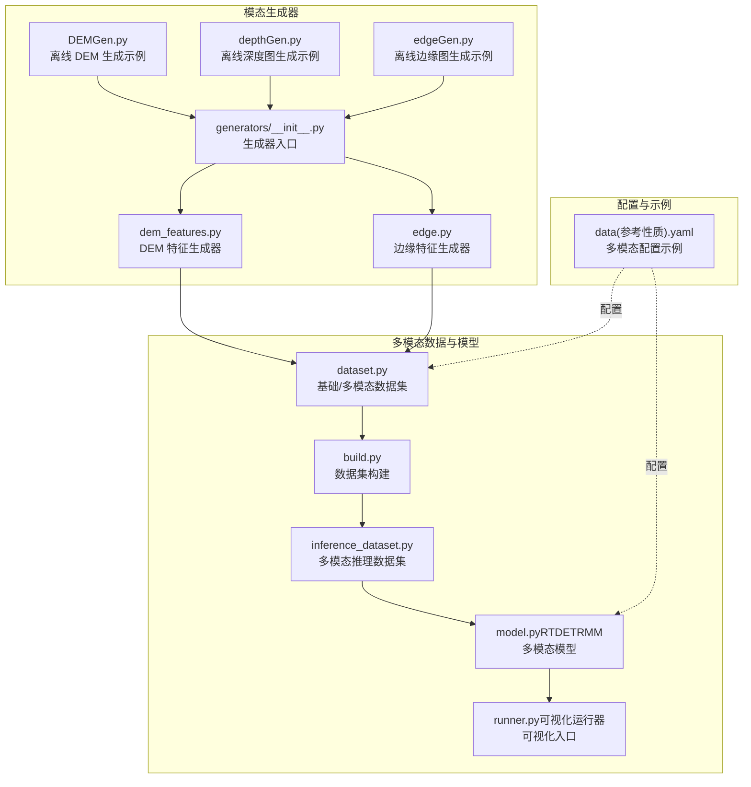
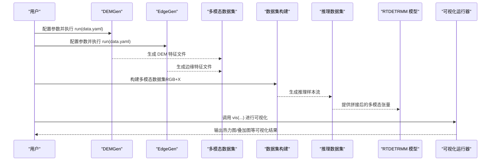
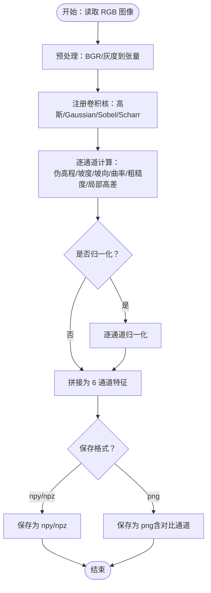
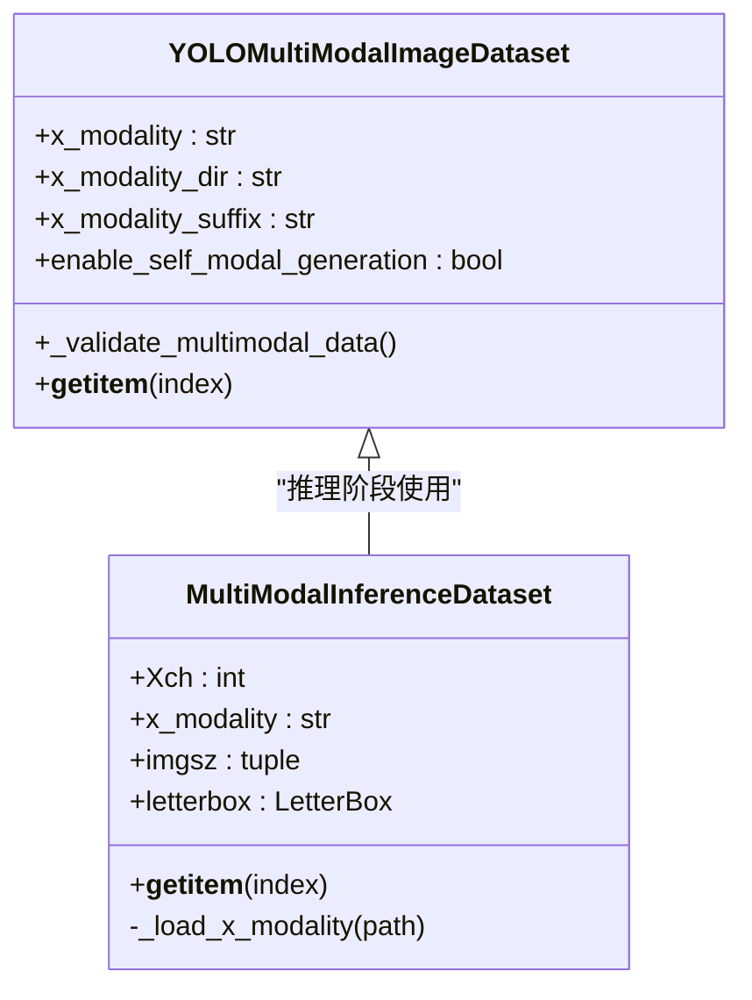
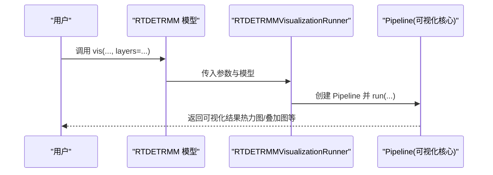
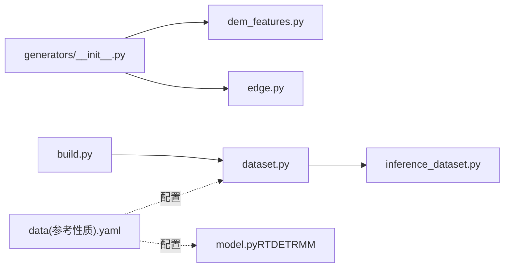

# 地理信息处理

<cite>
**本文引用的文件**   
- [DEMGen.py](file://DEMGen.py)
- [depthGen.py](file://depthGen.py)
- [edgeGen.py](file://edgeGen.py)
- [dem_features.py](file://ultralytics/nn/mm/generators/dem_features.py)
- [edge.py](file://ultralytics/nn/mm/generators/edge.py)
- [__init__.py（多模态生成器入口）](file://ultralytics/nn/mm/generators/__init__.py)
- [model.py（RTDETRMM）](file://ultralytics/models/rtdetrmm/model.py)
- [runner.py（RTDETRMM可视化运行器）](file://ultralytics/models/rtdetrmm/visualize/runner.py)
- [inference_dataset.py（多模态推理数据集）](file://ultralytics/data/multimodal/inference_dataset.py)
- [build.py（数据集构建）](file://ultralytics/data/build.py)
- [dataset.py（基础数据集与多模态数据集）](file://ultralytics/data/dataset.py)
- [data(参考性质).yaml](file://data(参考性质).yaml)
</cite>

## 目录
1. [简介](#简介)
2. [项目结构](#项目结构)
3. [核心组件](#核心组件)
4. [架构总览](#架构总览)
5. [详细组件分析](#详细组件分析)
6. [依赖分析](#依赖分析)
7. [性能考虑](#性能考虑)
8. [故障排查指南](#故障排查指南)
9. [结论](#结论)
10. [附录](#附录)

## 简介
本文件面向地理信息处理领域，系统梳理并讲解本仓库中的多模态地理特征生成与推理能力，重点覆盖以下方面：
- DEM（数字高程模型）特征的离线生成与格式化存储
- 深度图与边缘图等多模态地理特征的批量生成
- 多模态数据集构建与推理流程
- 多模态模型（RTDETRMM）的可视化与评估入口
- 地理信息数据质量控制、坐标系与空间分析的实践建议

本指南既适用于初学者快速上手，也提供面向工程实践的深度分析与优化建议。

## 项目结构
围绕地理信息处理的核心模块与文件组织如下：
- 模态生成器：提供 DEM、深度图、边缘图的离线批量生成能力
- 多模态数据集：支持 RGB 与 X 模态（如 DEM/深度/边缘）的拼接与推理
- 多模态模型：RTDETRMM 的配置、路由与可视化
- 配置与示例：data.yaml 示例与生成脚本示例

**图表来源**
- [DEMGen.py:1-42](file://DEMGen.py#L1-L42)
- [depthGen.py:1-24](file://depthGen.py#L1-L24)
- [edgeGen.py:1-46](file://edgeGen.py#L1-L46)
- [__init__.py（多模态生成器入口）:1-14](file://ultralytics/nn/mm/generators/__init__.py#L1-L14)
- [dem_features.py:1-469](file://ultralytics/nn/mm/generators/dem_features.py#L1-L469)
- [edge.py:1-36](file://ultralytics/nn/mm/generators/edge.py#L1-L36)
- [build.py:1-422](file://ultralytics/data/build.py#L1-L422)
- [dataset.py:1-200](file://ultralytics/data/dataset.py#L1-L200)
- [inference_dataset.py:1-200](file://ultralytics/data/multimodal/inference_dataset.py#L1-L200)
- [model.py（RTDETRMM）:1-269](file://ultralytics/models/rtdetrmm/model.py#L1-L269)
- [runner.py（RTDETRMM可视化运行器）:1-48](file://ultralytics/models/rtdetrmm/visualize/runner.py#L1-L48)
- [data(参考性质).yaml:1-28](file://data(参考性质).yaml#L1-L28)

**章节来源**
- [DEMGen.py:1-42](file://DEMGen.py#L1-L42)
- [depthGen.py:1-24](file://depthGen.py#L1-L24)
- [edgeGen.py:1-46](file://edgeGen.py#L1-L46)
- [__init__.py（多模态生成器入口）:1-14](file://ultralytics/nn/mm/generators/__init__.py#L1-L14)
- [dem_features.py:1-469](file://ultralytics/nn/mm/generators/dem_features.py#L1-L469)
- [edge.py:1-36](file://ultralytics/nn/mm/generators/edge.py#L1-L36)
- [build.py:1-422](file://ultralytics/data/build.py#L1-L422)
- [dataset.py:1-200](file://ultralytics/data/dataset.py#L1-L200)
- [inference_dataset.py:1-200](file://ultralytics/data/multimodal/inference_dataset.py#L1-L200)
- [model.py（RTDETRMM）:1-269](file://ultralytics/models/rtdetrmm/model.py#L1-L269)
- [runner.py（RTDETRMM可视化运行器）:1-48](file://ultralytics/models/rtdetrmm/visualize/runner.py#L1-L48)
- [data(参考性质).yaml:1-28](file://data(参考性质).yaml#L1-L28)

## 核心组件
- DEM 特征生成器：提供 6 通道 DEM-like 特征（伪高程、坡度、坡向、曲率、粗糙度、局部高差），支持 npy/npz/png 保存
- 深度图生成器：基于深度估计模型生成深度图，支持对比图、颜色图、原始 16bit 等保存选项
- 边缘图生成器：基于 Sobel/Scharr 算子提取边缘，支持单通道/三通道、归一化、伽马校正、二值化等
- 多模态数据集：支持 RGB 与 X 模态（如 DEM/深度/边缘）拼接，推理时进行 LetterBox 对齐与通道校验
- RTDETRMM 模型：多模态检测模型，支持可视化与 COCO 评估，自动识别输入通道与可用模态集合

**章节来源**
- [dem_features.py:1-469](file://ultralytics/nn/mm/generators/dem_features.py#L1-L469)
- [edge.py:1-36](file://ultralytics/nn/mm/generators/edge.py#L1-L36)
- [inference_dataset.py:1-200](file://ultralytics/data/multimodal/inference_dataset.py#L1-L200)
- [model.py（RTDETRMM）:1-269](file://ultralytics/models/rtdetrmm/model.py#L1-L269)

## 架构总览
下图展示从数据准备到多模态推理与可视化的整体流程：

**图表来源**
- [DEMGen.py:19-42](file://DEMGen.py#L19-L42)
- [edgeGen.py:20-46](file://edgeGen.py#L20-L46)
- [build.py:115-257](file://ultralytics/data/build.py#L115-L257)
- [inference_dataset.py:94-183](file://ultralytics/data/multimodal/inference_dataset.py#L94-L183)
- [model.py（RTDETRMM）:190-222](file://ultralytics/models/rtdetrmm/model.py#L190-L222)
- [runner.py（RTDETRMM可视化运行器）:14-48](file://ultralytics/models/rtdetrmm/visualize/runner.py#L14-L48)

## 详细组件分析

### DEM 特征生成器（DEMGen）
- 功能概述
  - 将 RGB 图像转换为 6 通道 DEM-like 特征：伪高程、坡度、坡向、曲率、粗糙度、局部高差
  - 支持 Gaussian/Sobel/Scharr 卷积核与可选归一化
  - 输出格式：npy/npz/png，便于后续多模态训练与推理
- 关键参数
  - 高斯平滑核大小、Sobel/Scharr 核大小、局部粗糙度核大小、局部差分核大小
  - 是否启用 Scharr 算子、是否归一化
- 保存策略
  - 默认保存到 images_dem/<split>/，支持 npy/npz/png
  - PNG 保存时可同时输出前 3 通道与后 3 通道的对比图
- 使用方式
  - 通过 DEMGen.run(data.yaml) 批量生成，支持 split 控制 train/val/test 子集

**图表来源**
- [dem_features.py:111-210](file://ultralytics/nn/mm/generators/dem_features.py#L111-L210)
- [dem_features.py:284-466](file://ultralytics/nn/mm/generators/dem_features.py#L284-L466)

**章节来源**
- [dem_features.py:1-469](file://ultralytics/nn/mm/generators/dem_features.py#L1-L469)
- [DEMGen.py:19-42](file://DEMGen.py#L19-L42)

### 深度图生成器（DepthGen）
- 功能概述
  - 基于深度估计模型生成深度图，支持彩色深度图、对比图、原始 16bit 等输出
  - 适合与 RGB 组成多模态输入
- 关键参数
  - 权重路径、设备、保存目录、对比图开关、npy/tif/16bit 保存选项
  - split 控制子集，batch_size 与 num_workers 控制并行度
- 使用方式
  - 通过 DepthGen.run(dataset.yaml) 批量生成深度图

**章节来源**
- [depthGen.py:1-24](file://depthGen.py#L1-L24)

### 边缘图生成器（EdgeGen）
- 功能概述
  - 基于 Sobel/Scharr 算子提取边缘，支持单通道/三通道输出
  - 支持归一化、伽马校正、二值化阈值等
- 关键参数
  - 高斯平滑核大小、Sobel/Scharr 核大小、是否归一化、伽马系数、是否二值化、阈值
  - 输出格式：png/npy/tif（可选 npz）
- 使用方式
  - 通过 EdgeGen.run(data.yaml) 批量生成边缘图

**章节来源**
- [edge.py:1-36](file://ultralytics/nn/mm/generators/edge.py#L1-L36)
- [edgeGen.py:1-46](file://edgeGen.py#L1-L46)

### 多模态数据集与推理
- 多模态数据集（YOLOMultiModalImageDataset）
  - 支持 RGB 与 X 模态（如 DEM/深度/边缘）拼接
  - 自动校验 X 模态通道数与空间分辨率，必要时进行 LetterBox 对齐
  - 支持自动生成缺失的 X 模态（当启用自模态生成时）
- 推理数据集（MultiModalInferenceDataset）
  - 严格校验：文件存在性、可读性、X 通道数一致性
  - 统一预处理：LetterBox + 转 tensor + 归一化
  - 支持单模态零填充，保证输入张量维度一致

**图表来源**
- [dataset.py:513-540](file://ultralytics/data/dataset.py#L513-L540)
- [inference_dataset.py:94-183](file://ultralytics/data/multimodal/inference_dataset.py#L94-L183)

**章节来源**
- [dataset.py:513-540](file://ultralytics/data/dataset.py#L513-L540)
- [inference_dataset.py:1-200](file://ultralytics/data/multimodal/inference_dataset.py#L1-L200)

### RTDETRMM 模型与可视化
- 模型特性
  - 自动识别多模态结构，推断输入通道与可用模态集合（RGB、X、Dual）
  - 提供 vis(...) 可视化入口，委托给 RTDETRMMVisualizationRunner
  - COCO 评估默认 rect=False，避免非方形输入导致的 bbox 缩放问题
- 可视化流程
  - 通过 runner.run(...) 调用通用 visualize_core Pipeline
  - 支持 heat/overlay 等可视化方法与指定层

**图表来源**
- [model.py（RTDETRMM）:190-222](file://ultralytics/models/rtdetrmm/model.py#L190-L222)
- [runner.py（RTDETRMM可视化运行器）:14-48](file://ultralytics/models/rtdetrmm/visualize/runner.py#L14-L48)

**章节来源**
- [model.py（RTDETRMM）:1-269](file://ultralytics/models/rtdetrmm/model.py#L1-L269)
- [runner.py（RTDETRMM可视化运行器）:1-48](file://ultralytics/models/rtdetrmm/visualize/runner.py#L1-L48)

## 依赖分析
- 生成器入口
  - generators/__init__.py 导出 DepthGen、DEMGen、EdgeGen，统一对外暴露
- 数据集构建
  - build.py 提供 build_yolo_dataset，支持文本多模态与图像多模态两类数据集
  - 多模态图像数据集参数优先级：函数参数 > cfg > data 字典
- 配置示例
  - data(参考性质).yaml 展示了多模态路径配置与类别映射，可作为训练/推理配置模板

**图表来源**
- [__init__.py（多模态生成器入口）:1-14](file://ultralytics/nn/mm/generators/__init__.py#L1-L14)
- [dem_features.py:1-469](file://ultralytics/nn/mm/generators/dem_features.py#L1-L469)
- [edge.py:1-36](file://ultralytics/nn/mm/generators/edge.py#L1-L36)
- [build.py:115-257](file://ultralytics/data/build.py#L115-L257)
- [dataset.py:1-200](file://ultralytics/data/dataset.py#L1-200)
- [inference_dataset.py:1-200](file://ultralytics/data/multimodal/inference_dataset.py#L1-L200)
- [data(参考性质).yaml:1-28](file://data(参考性质).yaml#L1-L28)

**章节来源**
- [__init__.py（多模态生成器入口）:1-14](file://ultralytics/nn/mm/generators/__init__.py#L1-L14)
- [build.py:115-257](file://ultralytics/data/build.py#L115-L257)
- [data(参考性质).yaml:1-28](file://data(参考性质).yaml#L1-L28)

## 性能考虑
- 并行与批处理
  - 生成器支持 batch_size 与 num_workers，合理设置可提升吞吐
  - 推理阶段 InfiniteDataLoader 与分布式采样器可减少重复开销
- 内存与 I/O
  - npz 压缩保存可显著降低存储占用；png 适合快速浏览但占用更高
  - 多模态拼接时注意通道数与分辨率对显存的影响
- 算法参数
  - 卷积核大小与是否启用 Scharr/Sobel 会影响计算复杂度与特征质量
  - 归一化与伽马校正可改善可视化效果，但增加少量计算

[本节为通用指导，无需特定文件引用]

## 故障排查指南
- 生成器运行失败
  - 检查输入路径与 split 设置，确认 images_dem/images_edge/images_depth 目录存在
  - 若保存失败，检查 overwrite 与文件权限
- 多模态数据集报错
  - X 模态通道数不匹配：确保 Xch 与实际通道数一致
  - 空间分辨率不一致：启用 LetterBox 对齐或统一预处理
- 模型推理异常
  - 确认输入通道数为 3 或 6，避免不支持的通道数
  - COCO 评估时保持 rect=False，避免非方形输入导致的缩放偏差
- 可视化无输出
  - 确保 layers 参数已提供且为整数列表
  - 检查保存路径与设备参数

**章节来源**
- [dem_features.py:284-466](file://ultralytics/nn/mm/generators/dem_features.py#L284-L466)
- [inference_dataset.py:94-183](file://ultralytics/data/multimodal/inference_dataset.py#L94-L183)
- [model.py（RTDETRMM）:140-146](file://ultralytics/models/rtdetrmm/model.py#L140-L146)
- [model.py（RTDETRMM）:224-234](file://ultralytics/models/rtdetrmm/model.py#L224-L234)
- [runner.py（RTDETRMM可视化运行器）:32-34](file://ultralytics/models/rtdetrmm/visualize/runner.py#L32-L34)

## 结论
本仓库提供了完整的多模态地理特征生成与推理链路：从 DEM/深度/边缘特征的离线生成，到多模态数据集的构建与推理，再到 RTDETRMM 模型的可视化与评估。通过合理的参数配置与质量控制，可在地理信息处理任务中高效获得高质量的多模态输入与稳定可靠的推理结果。

[本节为总结性内容，无需特定文件引用]

## 附录
- 配置文件模板
  - data(参考性质).yaml 展示了多模态路径与类别映射，可据此扩展 RGB+X 的训练配置
- 生成脚本示例
  - DEMGen.py、depthGen.py、edgeGen.py 提供了最小可用示例，便于快速上手

**章节来源**
- [data(参考性质).yaml:1-28](file://data(参考性质).yaml#L1-L28)
- [DEMGen.py:19-42](file://DEMGen.py#L19-L42)
- [depthGen.py:1-24](file://depthGen.py#L1-L24)
- [edgeGen.py:1-46](file://edgeGen.py#L1-L46)